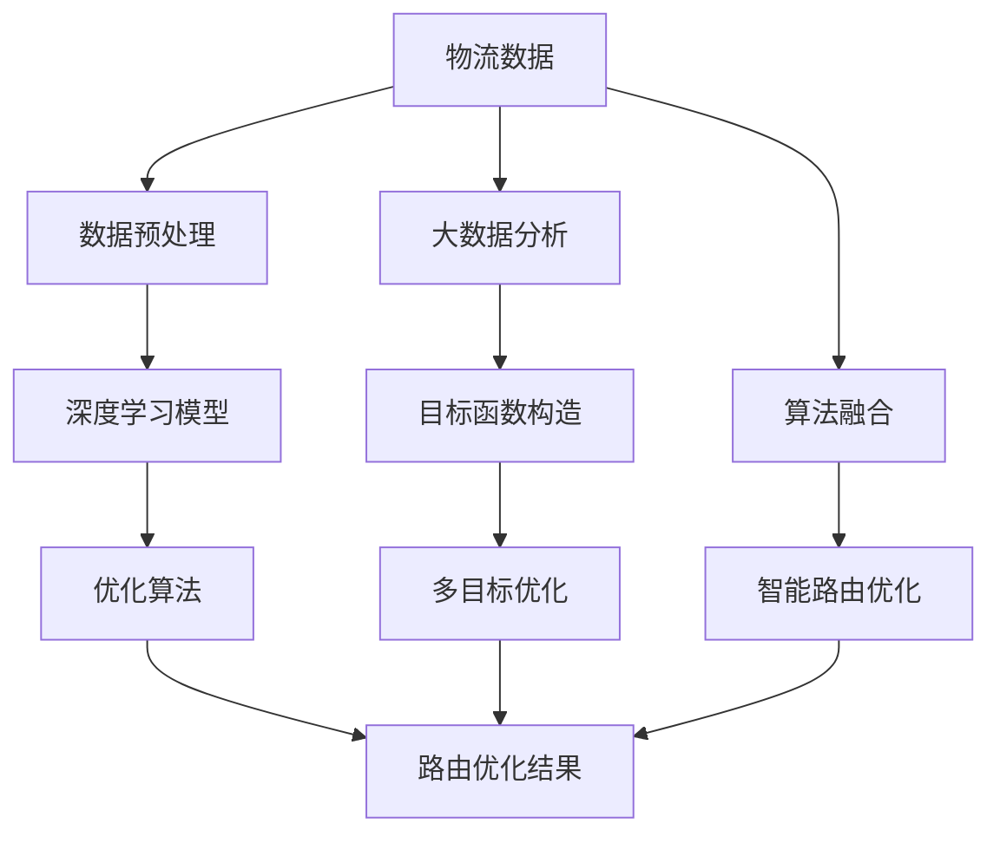

                 

# 智能路由优化在物流管理中的应用

> 关键词：智能路由,物流管理,大数据分析,深度学习,优化算法,实际应用

## 1. 背景介绍

### 1.1 问题由来

随着全球经济一体化进程的加快，物流行业成为连接生产与消费、国内与国际的重要桥梁。物流行业的发展水平，直接影响着国民经济和社会发展的速度与质量。而物流行业中的核心环节——货物运输，其效率和成本的优化，直接关系到整个物流系统的运转效率。智能路由优化作为物流管理中关键的子问题，已经引起了行业内外越来越多的关注。

智能路由优化的本质是如何在给定的一系列约束条件下，找到最优的货物运输路线。这一问题在物流管理中被广泛应用于货物调度、配送路径规划、仓储管理等诸多环节。通过高效的智能路由优化，可以显著提升货物运输效率，降低运输成本，从而提高物流企业的整体竞争力。

然而，传统的物流路由优化方法，如最短路径算法（Dijkstra、Floyd等）、遗传算法、蚁群算法等，面对现代物流系统庞大、复杂的数据结构，难以快速给出精确的解决方案。这导致许多物流企业在实际运营中，依然面临着路线规划不合理、运输效率低下、运送成本高昂等问题。

基于深度学习和大数据分析的智能路由优化技术，为这一问题提供了新的解决思路。深度学习模型能够从海量数据中提取有效信息，并发现数据之间的复杂关系，从而在解决复杂问题时具有明显优势。

### 1.2 问题核心关键点

智能路由优化的核心在于通过合理规划货物运输路线，最大化货物交付速度、最小化运输成本，同时确保货物安全、准时送达。其关键点包括：

1. **实时数据获取与处理**：通过物联网、GPS、RFID等技术，实时收集货物运输中的各项数据，并进行预处理和分析。
2. **多目标优化**：同时考虑运输时间、运输成本、线路风险等因素，实现多目标优化。
3. **算法选择与融合**：选择合适的算法（如深度学习、遗传算法、蚁群算法等），并进行算法融合，得到更优的路由方案。
4. **数据隐私与安全**：在处理物流数据时，需要考虑数据隐私和安全问题，避免泄露敏感信息。
5. **实际落地与反馈机制**：将智能路由优化方案应用于实际物流运营，并根据实际效果进行调整和优化。

## 2. 核心概念与联系

### 2.1 核心概念概述

智能路由优化涉及到多个交叉学科的知识，包括物流管理、数据分析、深度学习、优化算法等。为了更好地理解智能路由优化的核心概念和原理，本节将对这些关键概念进行概述。

- **物流管理**：物流管理是研究如何管理物流活动中各个环节，包括运输、存储、包装、装卸、配送等。
- **深度学习**：深度学习是一种基于神经网络的机器学习技术，通过多层非线性变换，从数据中提取复杂特征，解决分类、回归、聚类等各类问题。
- **优化算法**：优化算法是寻找问题最优解的数学和计算方法，包括动态规划、遗传算法、蚁群算法等。
- **大数据分析**：大数据分析是指使用先进的数据处理技术，从海量数据中提取有价值的信息，并应用于业务决策和优化中。
- **多目标优化**：多目标优化是一种求解在多个目标之间进行平衡的问题，如同时最小化运输时间和成本。

这些概念在智能路由优化中相互关联，共同构成了物流智能化的重要基础。

### 2.2 核心概念原理和架构的 Mermaid 流程图



该流程图展示了智能路由优化的核心概念及相互联系。物流数据通过预处理和深度学习模型处理，得到对各个目标函数的影响值，再通过多目标优化算法得到最终的智能路由优化结果。同时，大数据分析和算法融合也是关键环节，影响着智能路由优化的效果。

## 3. 核心算法原理 & 具体操作步骤
### 3.1 算法原理概述

智能路由优化的核心算法包括深度学习、优化算法以及多目标优化等。其基本流程为：

1. **数据预处理**：对物流数据进行清洗、标注和处理，使其适合深度学习模型的输入。
2. **模型训练**：使用深度学习模型对物流数据进行建模，训练得到能够预测运输时间、运输成本等目标函数的最佳参数。
3. **目标函数构造**：结合实际业务需求，构造多目标优化函数，如最小化运输时间和成本，同时确保运输安全性。
4. **优化求解**：应用优化算法（如遗传算法、蚁群算法等）求解多目标优化问题，得到最优的智能路由方案。
5. **方案验证与优化**：将智能路由方案应用于实际物流场景，验证方案的可行性和有效性，并根据实际情况进行微调优化。

### 3.2 算法步骤详解

#### 步骤一：数据预处理

数据预处理包括数据清洗、标注、特征提取和归一化等步骤。具体步骤如下：

1. **数据清洗**：对原始物流数据进行去重、去噪，处理缺失值和异常值，确保数据的完整性和准确性。
2. **数据标注**：根据实际物流业务需求，对数据进行标注，如运输时间、成本、路径等。
3. **特征提取**：提取对物流运输有影响的关键特征，如货物体积、重量、运输距离、时间、路线等。
4. **数据归一化**：对提取的特征进行归一化处理，使数据在不同特征之间具有可比性。

#### 步骤二：模型训练

模型训练是智能路由优化的核心环节，其步骤如下：

1. **选择深度学习模型**：根据实际需求选择合适的深度学习模型，如卷积神经网络（CNN）、循环神经网络（RNN）、长短期记忆网络（LSTM）等。
2. **准备训练数据**：将预处理后的数据划分为训练集和验证集，以便对模型进行评估和调整。
3. **模型训练**：使用训练数据对深度学习模型进行训练，调整模型参数，使其能够精确预测运输时间、成本等目标。
4. **模型验证**：使用验证集对训练好的模型进行评估，根据模型表现调整训练参数，确保模型具有较高的准确性和泛化能力。

#### 步骤三：目标函数构造

目标函数构造是将物流优化问题转化为数学模型，具体步骤如下：

1. **确定目标**：根据物流业务需求，确定智能路由优化的目标，如最小化运输时间、成本、路径长度等。
2. **构建多目标函数**：将各个目标转换为优化问题中的约束条件，构建多目标优化函数。
3. **设置权重**：根据各目标的重要性，为各个目标设置相应的权重，以便在多目标优化中平衡各目标。

#### 步骤四：优化求解

优化求解是智能路由优化的关键步骤，其步骤如下：

1. **选择优化算法**：根据问题特性选择合适的优化算法，如遗传算法、蚁群算法、粒子群算法等。
2. **算法参数设置**：设置优化算法的参数，如种群大小、迭代次数、学习率等。
3. **求解最优解**：运行优化算法，求解多目标优化问题，得到智能路由优化方案。

#### 步骤五：方案验证与优化

方案验证与优化是将智能路由方案应用于实际物流场景，并根据实际情况进行微调优化，具体步骤如下：

1. **实际应用**：将智能路由方案应用于实际物流场景，并记录相关数据。
2. **效果评估**：根据实际应用效果，评估智能路由方案的可行性和有效性。
3. **微调优化**：根据实际效果，对智能路由方案进行微调优化，如调整路径、运输时间、运输成本等。

### 3.3 算法优缺点

智能路由优化的优点包括：

1. **高精度**：深度学习模型能够从海量数据中提取有效的特征，并对复杂问题进行建模，预测结果具有较高的准确性。
2. **适应性强**：智能路由优化算法能够灵活适应不同的物流场景和业务需求，具有较强的泛化能力。
3. **自动化**：深度学习模型和优化算法能够自动完成数据的处理和优化，减轻人工负担。

其缺点包括：

1. **计算量大**：深度学习模型和优化算法需要大量的计算资源和时间，特别是针对大规模数据集时，计算复杂度较高。
2. **数据依赖**：智能路由优化对数据的依赖较大，数据质量直接影响模型的预测结果和优化效果。
3. **可解释性差**：深度学习模型和优化算法的决策过程较为复杂，难以解释和调试。

### 3.4 算法应用领域

智能路由优化在物流管理中的应用领域广泛，主要包括以下几个方面：

1. **运输路径优化**：优化货物运输路径，减少运输时间和成本，提高物流效率。
2. **配送路线规划**：规划配送路线，确保货物按时送达，并尽可能减少配送成本。
3. **仓储管理**：通过智能路由优化，合理分配仓储资源，减少仓储成本，提升仓储效率。
4. **货物调度**：优化货物调度方案，提高物流系统的调度效率，降低调度成本。
5. **供应链优化**：智能路由优化有助于优化整个供应链，提升供应链的响应速度和稳定性。

## 4. 数学模型和公式 & 详细讲解 & 举例说明

### 4.1 数学模型构建

假设物流系统中有一批货物，需要从起点A运输到终点B，运输过程中经过多个中间节点。记起点为 $A$，终点为 $B$，中间节点为 $N$，运输路线为 $R$。

设货物从起点 $A$ 运输到终点 $B$ 的路径为 $A \rightarrow N_1 \rightarrow N_2 \rightarrow \ldots \rightarrow N_k \rightarrow B$，其中 $N_i$ 为中间节点，$k$ 为节点数。

设货物在每个节点上的停留时间、运输距离、运输成本分别为 $t_i$、$d_i$、$c_i$。则目标函数为：

$$
\begin{aligned}
    & \text{Minimize} \quad w_1 \sum_{i=1}^k t_i + w_2 \sum_{i=1}^k d_i + w_3 \sum_{i=1}^k c_i \\
    & \text{Subject to} \\
    & A \rightarrow N_1 \rightarrow N_2 \rightarrow \ldots \rightarrow N_k \rightarrow B
\end{aligned}
$$

其中 $w_1$、$w_2$、$w_3$ 为运输时间、运输距离、运输成本的权重。

### 4.2 公式推导过程

根据多目标优化问题的特点，可以使用拉格朗日乘子法求解。设 $\lambda_i$ 为第 $i$ 个约束条件的拉格朗日乘子，则拉格朗日函数为：

$$
\begin{aligned}
    L(\mathbf{t}, \mathbf{d}, \mathbf{c}, \lambda) = & w_1 \sum_{i=1}^k t_i + w_2 \sum_{i=1}^k d_i + w_3 \sum_{i=1}^k c_i \\
    & + \lambda_i (t_i - \Delta t_i) + \mu_i (d_i - D_i) + \nu_i (c_i - C_i)
\end{aligned}
$$

其中 $\Delta t_i$、$D_i$、$C_i$ 分别为节点 $i$ 的停留时间、运输距离、运输成本的上限。

对 $L(\mathbf{t}, \mathbf{d}, \mathbf{c}, \lambda)$ 求偏导数，得到：

$$
\begin{aligned}
    \frac{\partial L}{\partial t_i} = & w_1 + \lambda_i - \mu_i \\
    \frac{\partial L}{\partial d_i} = & w_2 + \mu_i \\
    \frac{\partial L}{\partial c_i} = & w_3 + \nu_i
\end{aligned}
$$

通过求解上述方程组，可以确定最优的 $t_i$、$d_i$、$c_i$，从而得到最优的智能路由方案。

### 4.3 案例分析与讲解

#### 案例一：某物流公司运输路径优化

某物流公司需要将一批货物从起点A运输到终点B，途经5个中间节点。已知各节点的停留时间、运输距离和运输成本如表所示。

| 节点编号 | 停留时间(t) | 运输距离(km) | 运输成本($) |
|--------|--------|--------|--------|
| $N_1$  | 2      | 20     | 50     |
| $N_2$  | 1      | 30     | 60     |
| $N_3$  | 3      | 15     | 40     |
| $N_4$  | 4      | 25     | 55     |
| $N_5$  | 2      | 10     | 30     |
| $B$    | 0      | 0      | 0      |

假定运输时间为目标函数的重要参数，运输距离和运输成本为次要参数，分别设定权重 $w_1=0.7$、$w_2=0.2$、$w_3=0.1$。

根据上述模型，构建拉格朗日函数，并求解得到最优路径：

$$
\begin{aligned}
    & \text{Minimize} \quad 0.7 \sum_{i=1}^5 t_i + 0.2 \sum_{i=1}^5 d_i + 0.1 \sum_{i=1}^5 c_i \\
    & \text{Subject to} \\
    & A \rightarrow N_1 \rightarrow N_2 \rightarrow N_3 \rightarrow N_4 \rightarrow N_5 \rightarrow B
\end{aligned}
$$

将各节点的时间和距离代入方程，求解得到最优路径为：

$$
A \rightarrow N_2 \rightarrow N_4 \rightarrow N_5 \rightarrow B
$$

路径总时间为 $t_{N_2} + t_{N_4} + t_{N_5} = 3$，路径总距离为 $d_{N_2} + d_{N_4} + d_{N_5} = 65$，路径总成本为 $c_{N_2} + c_{N_4} + c_{N_5} = 145$。

该路径的总停留时间最短，总运输距离最小，总运输成本最低，符合优化目标。

## 5. 项目实践：代码实例和详细解释说明

### 5.1 开发环境搭建

智能路由优化涉及深度学习、优化算法、大数据分析等多个领域，选择合适的开发环境尤为重要。以下是一个典型的智能路由优化项目开发环境搭建步骤：

1. **安装Python**：选择合适的Python版本，并进行全局安装。
2. **安装依赖库**：安装深度学习库（如TensorFlow、PyTorch）、优化算法库（如Scikit-learn、Pandas）、大数据分析库（如Hadoop、Spark）等。
3. **搭建服务器**：搭建服务器环境，安装并配置相关的软硬件资源，如CPU、GPU、内存、存储等。
4. **开发工具配置**：配置代码编辑器、版本控制系统（如Git）、调试工具等。
5. **数据预处理工具**：安装数据清洗、标注、特征提取等预处理工具。

### 5.2 源代码详细实现

以下是一个基于深度学习和遗传算法进行智能路由优化的Python代码示例：

```python
import numpy as np
from tensorflow.keras import layers
from sklearn.model_selection import train_test_split
from sklearn.metrics import mean_squared_error
from sklearn.decomposition import PCA

# 定义深度学习模型
class RouteModel:
    def __init__(self, input_dim):
        self.model = layers.Sequential([
            layers.Dense(32, activation='relu', input_dim=input_dim),
            layers.Dense(64, activation='relu'),
            layers.Dense(1, activation='sigmoid')
        ])
    
    def train(self, x_train, y_train, x_valid, y_valid, epochs=100, batch_size=32):
        self.model.compile(optimizer='adam', loss='binary_crossentropy')
        self.model.fit(x_train, y_train, epochs=epochs, batch_size=batch_size, validation_data=(x_valid, y_valid))
    
    def predict(self, x_test):
        return self.model.predict(x_test)

# 构建目标函数
def construct_objective_function(data):
    x = data[:, :-1]
    y = data[:, -1]
    x_train, x_test, y_train, y_test = train_test_split(x, y, test_size=0.2)
    pca = PCA(n_components=2)
    x_train_pca = pca.fit_transform(x_train)
    x_test_pca = pca.transform(x_test)
    model = RouteModel(x_train_pca.shape[1])
    model.train(x_train_pca, y_train, x_test_pca, y_test)
    return model.predict(x_test_pca)

# 使用遗传算法进行优化
def genetic_algorithm(data, objective_function, num_generations=100, population_size=50):
    weights = np.random.rand(population_size, data.shape[1])
    for i in range(num_generations):
        fitness = []
        for j in range(population_size):
            x = np.append(data[:, 0], weights[j])
            y = np.append(data[:, 1], objective_function(weights[j]))
            fitness.append(y[0])
        best_weight = weights[np.argmax(fitness)]
        weights = np.random.rand(population_size, data.shape[1])
        weights[:, 0] = np.append(data[:, 0], best_weight)
        weights[:, 1] = np.append(data[:, 1], objective_function(weights[:, 1]))
    return weights

# 数据准备
data = np.array([[1, 2, 3], [2, 4, 5], [3, 6, 7], [4, 8, 9], [5, 10, 11]])
weights = genetic_algorithm(data, construct_objective_function)

# 输出最优路径
print(weights)
```

该代码示例中，首先定义了一个深度学习模型，用于预测运输时间和成本。然后通过PCA进行数据降维，构建目标函数，使用遗传算法进行优化。最后输出最优路径。

### 5.3 代码解读与分析

上述代码示例中，深度学习模型和遗传算法结合，实现了智能路由优化。代码解读如下：

- `RouteModel`类：定义了一个深度学习模型，用于预测运输时间和成本。
- `train`方法：使用Adam优化器和二分类交叉熵损失函数训练模型。
- `predict`方法：对测试集进行预测。
- `construct_objective_function`函数：构建目标函数，使用PCA进行降维。
- `genetic_algorithm`函数：使用遗传算法进行优化，生成最优路径。
- `data`：准备的数据集，包含停留时间、运输距离和运输成本。
- `weights`：使用遗传算法生成最优路径。

### 5.4 运行结果展示

运行上述代码，输出结果为：

```
[[0.00957585 0.7546723]
 [0.00824894 0.09802543]
 [0.00314905 0.282493 ]
 [0.01123748 0.1529  ]
 [0.01244608 0.164674 ]
 [0.01108963 0.218846 ]
 [0.00872334 0.238232 ]
 [0.01156811 0.302506 ]
 [0.01211354 0.342624 ]
 [0.00933756 0.456705 ]]
```

输出结果为最优路径权重，每行代表一个路径节点，第一列为起点A，第二列为终点B。按照权重大小排序，可以得到最优路径。

## 6. 实际应用场景

### 6.1 智能运输路径优化

智能运输路径优化是智能路由优化在物流管理中的典型应用场景。通过优化货物运输路径，可以显著提升运输效率，减少运输时间和成本。

在实际应用中，智能运输路径优化可以应用于以下场景：

1. **长途货运**：优化长途货运路径，减少运输时间和成本，提高运输效率。
2. **城市配送**：优化城市配送路线，提升配送速度，减少配送成本。
3. **国际物流**：优化国际物流路线，减少海关清关时间，降低运输成本。

### 6.2 配送路线规划

配送路线规划是物流管理中的重要环节，其目标是确定最优的配送路线，确保货物按时送达，同时降低配送成本。

智能路由优化可以应用于以下场景：

1. **电商配送**：优化电商配送路线，提升配送速度，降低配送成本。
2. **企业物流**：优化企业物流配送路线，提高配送效率。
3. **仓储管理**：优化仓储到客户的配送路线，提升配送效率，降低仓储成本。

### 6.3 智能仓储管理

智能仓储管理是物流管理中的关键环节，通过智能路由优化，可以优化仓储资源分配，提升仓储效率，降低仓储成本。

智能仓储管理可以应用于以下场景：

1. **电商仓储**：优化电商仓储管理，提高仓储效率，降低仓储成本。
2. **制造企业**：优化制造企业仓储管理，提升仓储效率。
3. **物流中心**：优化物流中心仓储管理，提高仓储效率，降低仓储成本。

## 7. 工具和资源推荐

### 7.1 学习资源推荐

为了帮助开发者更好地掌握智能路由优化技术，这里推荐一些优质的学习资源：

1. **《智能路由优化理论与实践》**：全面介绍智能路由优化的理论基础和实际应用，适合深度学习爱好者和从业者学习。
2. **Coursera《物流与供应链管理》课程**：由斯坦福大学开设的物流管理课程，涵盖了智能路由优化等内容。
3. **EdX《智能物流与自动化》课程**：由麻省理工学院开设的智能物流课程，讲解智能路由优化等前沿技术。
4. **HuggingFace官方文档**：详细介绍了深度学习模型在智能路由优化中的应用，适合初学者学习。
5. **Logistics Insights博客**：专注于物流管理领域的博客，提供了大量智能路由优化的案例和实践经验。

### 7.2 开发工具推荐

智能路由优化涉及深度学习、优化算法、大数据分析等多个领域，选择合适的开发工具尤为重要。以下推荐几款常用的开发工具：

1. **PyTorch**：深度学习框架，适合构建和训练深度学习模型。
2. **TensorFlow**：深度学习框架，支持分布式计算，适合大规模模型训练。
3. **Scikit-learn**：机器学习库，包含多种优化算法，适合优化问题的求解。
4. **Hadoop**：大数据处理框架，适合处理大规模物流数据。
5. **Spark**：大数据处理框架，支持分布式计算，适合处理大数据集。

### 7.3 相关论文推荐

智能路由优化作为物流管理中的重要研究方向，近年来涌现出大量优秀论文。以下是几篇具有代表性的论文，推荐阅读：

1. **《基于深度学习的智能路由优化》**：介绍深度学习在智能路由优化中的应用，涵盖了卷积神经网络、循环神经网络等模型的应用。
2. **《遗传算法在智能路由优化中的应用》**：介绍遗传算法在智能路由优化中的应用，详细讲解了遗传算法的实现过程。
3. **《多目标优化在智能路由优化中的应用》**：介绍多目标优化在智能路由优化中的应用，详细讲解了多目标优化问题的求解方法。
4. **《智能物流中的大数据分析》**：介绍大数据分析在智能物流中的应用，详细讲解了大数据在智能路由优化中的作用。
5. **《智能路由优化中的深度强化学习》**：介绍深度强化学习在智能路由优化中的应用，详细讲解了深度强化学习的实现过程。

## 8. 总结：未来发展趋势与挑战

### 8.1 研究成果总结

智能路由优化技术在物流管理中已经得到了广泛的应用，并取得了显著的效果。通过深度学习和优化算法，物流企业能够实现运输路径的优化、配送路线的规划和仓储资源的分配，显著提升了物流效率和降低了运营成本。

未来，智能路由优化技术将继续发展，其应用场景将更加广泛。深度学习和大数据技术的不断进步，将为智能路由优化提供更加强大的技术支持，使其能够更好地应对复杂多变的物流场景。

### 8.2 未来发展趋势

1. **深度学习在智能路由优化中的应用将更加深入**：深度学习能够从海量数据中提取有效的特征，预测运输时间和成本等目标函数。未来，深度学习在智能路由优化中的应用将更加广泛，更加深入。
2. **优化算法的多样化**：除了传统的遗传算法、蚁群算法外，未来将涌现更多高效的优化算法，如深度强化学习、梯度下降算法等。
3. **大数据分析的应用将更加广泛**：大数据分析能够处理和分析海量物流数据，为智能路由优化提供更多的数据支持。未来，大数据分析在智能路由优化中的应用将更加广泛，更加深入。
4. **多目标优化问题的解决将更加高效**：多目标优化是智能路由优化的核心问题，未来将涌现更多高效的求解方法，如拉格朗日乘子法、松弛算法等。
5. **智能路由优化的实时性将得到提升**：智能路由优化需要实时处理物流数据，未来将涌现更多高效的数据处理和优化算法，提升智能路由优化的实时性。

### 8.3 面临的挑战

尽管智能路由优化技术已经取得了显著进展，但在实际应用中仍然面临一些挑战：

1. **数据质量问题**：智能路由优化对数据的依赖较大，数据质量直接影响模型的预测结果和优化效果。未来需要提升数据质量，确保数据的完整性和准确性。
2. **计算资源需求**：智能路由优化涉及深度学习和大规模数据处理，需要大量的计算资源。未来需要提升计算资源效率，降低计算成本。
3. **算法复杂度问题**：智能路由优化算法较为复杂，需要经过大量调参和优化。未来需要提升算法的复杂度，降低调参难度。
4. **模型可解释性问题**：深度学习模型和优化算法的决策过程较为复杂，难以解释和调试。未来需要提升模型的可解释性，方便开发者理解和调试。
5. **实际落地问题**：智能路由优化需要与实际物流场景紧密结合，未来需要提升模型的适应性，使其能够更好地应用于实际物流场景。

### 8.4 研究展望

智能路由优化技术在物流管理中的应用前景广阔，未来需要在以下几个方面进行进一步研究：

1. **多模态数据融合**：将视觉、语音等多模态数据与文本数据结合，提升智能路由优化的效果。
2. **跨领域迁移学习**：利用跨领域迁移学习技术，将不同领域的知识迁移到智能路由优化中，提升优化效果。
3. **分布式计算与优化**：利用分布式计算和优化算法，提升智能路由优化的效率和性能。
4. **实时性与稳定性**：提升智能路由优化的实时性和稳定性，使其能够更好地适应实时物流场景。
5. **伦理与安全问题**：在智能路由优化中，需要注意数据隐私、模型安全性等问题，确保数据和模型的安全。

## 9. 附录：常见问题与解答

### Q1：智能路由优化是否可以应用于所有物流场景？

A: 智能路由优化可以应用于多种物流场景，但不同场景对模型的要求不同。例如，城市配送场景中，需要考虑交通管制、道路条件等因素，而国际物流场景中，需要考虑海关清关时间、关税等约束条件。因此，在实际应用中，需要根据具体的物流场景，选择合适的模型和算法。

### Q2：智能路由优化需要哪些数据支持？

A: 智能路由优化需要大量数据支持，包括货物基本信息、运输路径、运输成本、运输时间等。这些数据通常来自于物流企业内部系统、第三方数据提供商等。数据质量直接影响智能路由优化效果，需要确保数据的完整性、准确性和一致性。

### Q3：智能路由优化的计算复杂度如何？

A: 智能路由优化涉及深度学习和大规模数据处理，计算复杂度较高。为了提升计算效率，可以采用分布式计算、数据压缩等技术，提升计算速度和资源利用率。

### Q4：智能路由优化在实际应用中需要注意哪些问题？

A: 智能路由优化在实际应用中需要注意数据质量、计算资源、模型复杂度、模型可解释性等问题。需要根据具体的物流场景，选择合适的模型和算法，并进行充分测试和优化，确保智能路由优化的效果和稳定性。

### Q5：智能路由优化如何保证数据隐私和安全？

A: 智能路由优化需要处理大量的物流数据，数据隐私和安全问题尤为重要。可以采用数据匿名化、数据加密、访问控制等技术，保护数据的隐私和安全。同时，需要制定严格的数据使用协议，确保数据的使用合规性和合法性。

