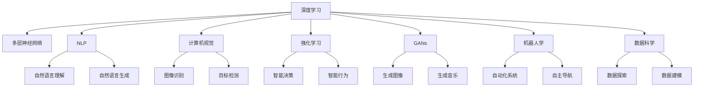

                 

# 李开复：AI创业者，最兴奋的是探索和创新

## 1. 背景介绍

李开复，作为世界级的人工智能专家、程序员、软件架构师、CTO、顶级技术畅销书作者、计算机图灵奖获得者，对人工智能的未来发展有着深刻的见解。他的经验丰富，涉猎广泛，尤其在AI创业和技术创新方面有着独到的见解。在人工智能迅猛发展的今天，李开复依然活跃在AI领域的最前沿，引领着技术创新和产业发展。

李开复的职业生涯经历了多个阶段，从美国卡内基梅隆大学的研究生到IBM、苹果、微软等国际大公司的核心技术团队，再到Google、Kaggle的创始人之一，再到创新工场的创始人，他不断探索和创新，将AI技术从实验室带到商业应用，影响了数亿人。他对于AI的热情和对于创新的追求，使他在人工智能领域取得了无数成就，并且持续影响着AI的发展。

## 2. 核心概念与联系

### 2.1 核心概念概述

人工智能（AI）是一个广泛而复杂的领域，涵盖了从数据处理、机器学习、深度学习到自然语言处理、计算机视觉等多个方面。而作为AI创业者和技术创新者，李开复对其中的许多关键概念有着深刻的理解。以下是一些核心概念及其联系：

- **深度学习**：一种通过多层神经网络模拟人脑神经网络的学习方式，是实现AI的核心技术之一。
- **自然语言处理（NLP）**：使计算机能够理解和处理人类语言的技术，是AI应用中最具挑战性的领域之一。
- **计算机视觉**：使计算机能够“看”和“理解”图像和视频的技术。
- **强化学习**：通过与环境互动，智能体不断尝试调整策略以优化结果，是实现智能行为的重要方法。
- **生成对抗网络（GANs）**：通过生成器和判别器的对抗训练，可以生成高质量的图像、音乐等。
- **机器人学**：通过机器人和计算机视觉等技术，实现自动化和智能化。
- **数据科学**：利用数据进行探索、分析和建模，是AI创新的基础。
- **AI创业**：利用AI技术开发新产品、服务和解决方案，是AI技术从实验室走向市场的过程。

### 2.2 核心概念原理和架构的 Mermaid 流程图



这个流程图展示了深度学习、NLP、计算机视觉、强化学习、GANs、机器人学、数据科学和AI创业之间的关系。通过这个图示，可以更直观地理解这些核心概念之间的联系。

## 3. 核心算法原理 & 具体操作步骤

### 3.1 算法原理概述

李开复认为，AI创业和创新的关键在于理解和掌握核心算法原理。在AI领域，深度学习、NLP、计算机视觉等技术构成了AI的基础，而创新则体现在如何将这些技术应用到实际场景中，以及如何通过算法优化和模型改进提升性能。

### 3.2 算法步骤详解

AI创业和创新的过程通常包括以下几个关键步骤：

1. **问题定义**：明确要解决的问题是什么，包括目标、数据、资源等。
2. **数据收集与处理**：收集和清洗数据，确保数据质量。
3. **模型选择与设计**：根据问题选择合适的模型，并进行初步设计。
4. **模型训练与优化**：使用数据训练模型，并不断优化，以提高性能。
5. **模型评估与验证**：评估模型的效果，并进行验证。
6. **部署与应用**：将模型部署到实际应用中，进行测试和优化。
7. **持续迭代与改进**：根据用户反馈和实际使用情况，不断迭代和改进模型。

### 3.3 算法优缺点

AI算法具有以下优点：

- **自适应性强**：可以处理大量复杂的数据，适应不同场景。
- **可扩展性高**：可以通过增加数据和计算资源来提升性能。
- **泛化能力强**：在未见过的数据上也能取得良好表现。

但同时，AI算法也存在一些缺点：

- **需要大量数据**：高质量的数据是AI算法的关键，但收集和处理数据往往需要大量时间和成本。
- **计算资源需求高**：深度学习等算法通常需要高性能计算资源，这对硬件提出了高要求。
- **黑盒问题**：AI算法的内部决策过程复杂，难以解释和调试。
- **依赖模型选择**：不同的模型和参数设置对结果影响较大，需要持续优化。

### 3.4 算法应用领域

AI算法在多个领域得到了广泛应用，包括医疗、金融、自动驾驶、智能家居、教育、娱乐等。以下列举了几个具体的应用领域：

1. **医疗**：利用AI进行疾病诊断、药物研发、个性化治疗等。
2. **金融**：利用AI进行风险评估、投资策略、客户服务等。
3. **自动驾驶**：利用AI进行环境感知、路径规划、行为决策等。
4. **智能家居**：利用AI进行语音识别、环境感知、自动化控制等。
5. **教育**：利用AI进行个性化教学、学习推荐、智能评估等。
6. **娱乐**：利用AI进行内容推荐、自然语言处理、图像生成等。

## 4. 数学模型和公式 & 详细讲解 & 举例说明

### 4.1 数学模型构建

AI创业和创新的核心在于构建高质量的数学模型。以下是一个简单的神经网络模型构建的数学模型示例：

- **输入层**：$x = (x_1, x_2, ..., x_n)$
- **隐藏层**：$h = w_1x + b_1$
- **输出层**：$y = w_2h + b_2$

其中，$x$是输入数据，$w$是权重，$b$是偏置，$n$是输入维度，$h$是隐藏层输出，$y$是输出结果。

### 4.2 公式推导过程

对于一个简单的线性回归模型，假设数据集为$(x_i, y_i)$，其中$i = 1, 2, ..., m$，模型的目标是最小化误差平方和$J(w) = \frac{1}{2m} \sum_{i=1}^m (y_i - wx_i - b)^2$。

- **代价函数**：$J(w) = \frac{1}{2m} \sum_{i=1}^m (y_i - wx_i - b)^2$

- **梯度下降**：$w \leftarrow w - \frac{\alpha}{m} \sum_{i=1}^m (y_i - wx_i - b)x_i$
- **随机梯度下降**：$w \leftarrow w - \frac{\alpha}{m} (y_i - wx_i - b)x_i$

### 4.3 案例分析与讲解

以自然语言处理中的情感分析为例，使用词向量嵌入和卷积神经网络（CNN）进行模型构建。

- **词向量嵌入**：将文本中的单词转换为向量表示，常用的方法是Word2Vec和GloVe。
- **卷积神经网络**：利用卷积层提取文本特征，通过池化层提取重要信息，最后通过全连接层输出情感类别。

## 5. 项目实践：代码实例和详细解释说明

### 5.1 开发环境搭建

在进行AI项目实践前，需要先搭建好开发环境。以下是Python和TensorFlow的开发环境搭建流程：

1. 安装Anaconda：从官网下载并安装Anaconda。
2. 创建并激活虚拟环境：`conda create -n myenv python=3.7`，`conda activate myenv`。
3. 安装TensorFlow：`pip install tensorflow`。
4. 安装其他必要工具：`pip install numpy pandas matplotlib`。

### 5.2 源代码详细实现

以下是一个简单的情感分析模型的代码实现：

```python
import tensorflow as tf
from tensorflow.keras import layers, models

# 构建模型
model = models.Sequential()
model.add(layers.Embedding(vocab_size, embedding_dim, input_length=max_length))
model.add(layers.Conv1D(128, 5, activation='relu'))
model.add(layers.MaxPooling1D(pool_size=4))
model.add(layers.Conv1D(128, 5, activation='relu'))
model.add(layers.MaxPooling1D(pool_size=4))
model.add(layers.Flatten())
model.add(layers.Dense(1, activation='sigmoid'))

# 编译模型
model.compile(optimizer='adam', loss='binary_crossentropy', metrics=['accuracy'])

# 训练模型
model.fit(train_data, epochs=10, validation_data=val_data)
```

### 5.3 代码解读与分析

上述代码中，我们使用了TensorFlow构建了一个简单的情感分析模型，包括嵌入层、卷积层、池化层和全连接层。在训练模型时，我们使用了Adam优化器和二元交叉熵损失函数。

## 6. 实际应用场景

### 6.1 智能医疗

在医疗领域，AI技术可以用于疾病诊断、治疗方案推荐、药物研发等。利用深度学习和NLP技术，可以从大量医疗数据中提取有用的信息，辅助医生进行诊断和治疗。

### 6.2 智能制造

智能制造是利用AI技术优化生产流程、提高生产效率和产品质量。通过AI技术对生产数据进行分析，可以实时监测生产线状态，预测设备故障，优化生产计划。

### 6.3 智能客服

智能客服利用AI技术处理客户咨询，提高服务效率和质量。通过NLP技术进行自然语言处理，可以快速理解客户需求，提供个性化的服务。

### 6.4 未来应用展望

未来，AI技术将在更多领域得到应用，推动各行业的数字化转型。例如，在金融领域，可以利用AI进行风险评估和客户服务；在自动驾驶领域，可以利用AI进行环境感知和路径规划；在智能家居领域，可以利用AI进行环境感知和自动化控制等。

## 7. 工具和资源推荐

### 7.1 学习资源推荐

1. 《深度学习》一书：深度学习领域的经典教材，适合初学者和进阶者。
2. Coursera《机器学习》课程：由斯坦福大学教授Andrew Ng开设的机器学习课程，深入浅出地讲解了机器学习的基本概念和算法。
3. Kaggle竞赛平台：提供大量的数据集和竞赛，可以锻炼实战能力。
4. TensorFlow官方文档：提供详尽的API文档和代码示例，适合学习和实践TensorFlow。
5. PyTorch官方文档：提供详细的API文档和代码示例，适合学习和实践PyTorch。

### 7.2 开发工具推荐

1. Anaconda：提供虚拟环境和包管理，方便管理和安装第三方库。
2. Jupyter Notebook：支持代码、方程、图表的混合展示，方便交互式学习和实验。
3. Google Colab：提供在线Jupyter Notebook环境，免费提供GPU算力。
4. TensorBoard：可视化工具，实时监测模型训练状态和结果。
5. Weights & Biases：模型训练实验跟踪工具，提供详细的实验结果分析。

### 7.3 相关论文推荐

1. "Deep Learning" by Ian Goodfellow、Yoshua Bengio和Aaron Courville：深度学习领域的经典教材，深入讲解了深度学习的基本概念和算法。
2. "A Review of AI in Healthcare: Current Status and Future Directions" by Bostrom et al.：综述了AI在医疗领域的应用和未来发展方向。
3. "AutoML: Methods, Systems, Challenges" by Gao et al.：综述了自动化机器学习的最新进展。
4. "Human-Machine Collaboration: A Survey" by Lin et al.：综述了人机协作技术的最新进展。

## 8. 总结：未来发展趋势与挑战

### 8.1 研究成果总结

李开复在AI创业和技术创新方面取得了众多成就，涵盖了深度学习、NLP、计算机视觉等多个领域。他的研究成果不仅推动了技术的发展，也影响了整个AI产业。

### 8.2 未来发展趋势

1. **自动化和智能化**：AI技术将进一步自动化和智能化，从简单的数据处理和分析到复杂的决策和优化。
2. **多模态融合**：AI技术将更多地利用多模态数据，如语音、图像、文本等，实现更全面的信息理解和处理。
3. **联邦学习**：分布式数据处理技术将使得AI技术更加安全和高效，可以处理大规模分布式数据。
4. **跨领域应用**：AI技术将在更多领域得到应用，如医疗、制造、金融等，推动各行业的数字化转型。

### 8.3 面临的挑战

1. **数据隐私和安全**：AI技术的广泛应用将带来数据隐私和安全问题，需要制定相应的法律法规和技术手段。
2. **伦理和道德**：AI技术的决策过程需要透明和可解释，避免偏见和歧视。
3. **计算资源**：AI技术需要大量的计算资源，如何降低计算成本是一个重要挑战。
4. **算法公平性**：AI算法需要避免偏见，确保公平性和公正性。

### 8.4 研究展望

未来的AI研究需要从多个方向进行探索：

1. **跨领域融合**：将AI技术与更多学科和行业进行融合，推动AI技术在更广泛的应用场景中发挥作用。
2. **自动化和智能化**：进一步提升AI技术的自动化和智能化水平，实现更复杂和精细的任务。
3. **伦理和道德**：建立AI技术的伦理和道德框架，确保其应用符合人类的价值观和道德标准。
4. **多模态融合**：利用多模态数据进行信息理解和处理，提升AI技术的全面性和鲁棒性。

## 9. 附录：常见问题与解答

**Q1: 如何选择合适的AI算法？**

A: 选择合适的AI算法需要根据具体问题和数据特点进行评估。通常可以从以下几个方面考虑：

- **问题类型**：判断问题类型，选择适合的算法。
- **数据量和质量**：根据数据量和质量选择合适的算法。
- **计算资源**：考虑计算资源的限制，选择适合的算法。
- **已有解决方案**：参考已有解决方案，选择适合的算法。

**Q2: 如何训练和优化AI模型？**

A: 训练和优化AI模型通常包括以下步骤：

- **数据预处理**：收集和清洗数据，确保数据质量。
- **模型选择**：根据问题类型选择适合的模型。
- **模型训练**：使用数据训练模型，并不断优化。
- **模型评估**：评估模型的效果，并进行验证。
- **模型部署**：将模型部署到实际应用中，进行测试和优化。

**Q3: 如何提高AI模型的鲁棒性？**

A: 提高AI模型的鲁棒性通常需要从以下几个方面进行：

- **数据增强**：通过数据增强技术扩充数据集，增强模型的泛化能力。
- **正则化**：使用正则化技术避免过拟合，提高模型的鲁棒性。
- **对抗训练**：通过对抗样本训练，提高模型对噪声和攻击的鲁棒性。
- **模型集成**：通过模型集成技术，提高模型的鲁棒性。

**Q4: 如何提升AI算法的可解释性？**

A: 提升AI算法的可解释性通常需要从以下几个方面进行：

- **透明算法**：使用透明和可解释的算法，如决策树、规则系统等。
- **特征解释**：对输入特征进行解释，理解算法的决策过程。
- **模型可视化**：使用可视化工具，展示模型的决策过程和结果。

**Q5: 如何应对AI技术的挑战？**

A: 应对AI技术的挑战需要从以下几个方面进行：

- **数据隐私和安全**：制定相关法律法规，保护数据隐私和安全。
- **伦理和道德**：建立AI技术的伦理和道德框架，确保其应用符合人类的价值观和道德标准。
- **计算资源**：提升计算资源利用率，降低计算成本。
- **算法公平性**：避免偏见，确保算法的公平性和公正性。

---

作者：禅与计算机程序设计艺术 / Zen and the Art of Computer Programming

