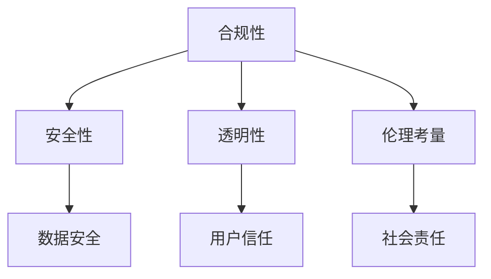

                 

# 李开复：苹果发布AI应用的保守做法

在人工智能(AI)领域，李开复是一位享有盛誉的先驱者和思想领袖。作为多次技术突破的参与者和推动者，李开复对AI发展的趋势有着深刻的见解。他多次公开表示，AI技术在各个领域的应用应当审慎进行，尤其是对于企业级应用，需要更为保守和负责任的策略。本文将基于李开复的观点，深入探讨苹果公司发布AI应用的保守做法，并分析其在技术、伦理和市场层面的深层原因与意义。

## 1. 背景介绍

### 1.1 李开复的AI观点与苹果的AI战略
李开复强调，AI技术发展迅猛，其潜力巨大，但同时也带来诸多风险和挑战。他多次在公开场合提出，人工智能的应用应当慎重，特别是在涉及到用户的隐私和决策过程时，应严格遵守伦理和法律要求。

苹果公司作为全球领先的科技企业，其AI应用主要集中在智能手机、智能家居、健康监测、安全与隐私保护等领域。近年来，苹果在这些领域的AI应用发布策略显得较为保守，特别是在关键技术的公开和应用上，表现出强烈的合规和风险规避意识。李开复认为，这种保守策略有助于维护用户信任，避免技术滥用和潜在的伦理风险。

### 1.2 苹果AI应用的主要领域与实践
苹果的AI应用主要集中在以下几个方面：
1. **智能手机智能助手**：通过Siri和智能推荐系统，提供个性化和高效的智能服务。
2. **智能家居控制**：通过HomeKit平台，实现智能家居设备的互联互通。
3. **健康监测**：利用机器学习技术，提供健康和睡眠监测功能。
4. **隐私与安全**：通过Face ID和iCloud等技术，增强用户数据的安全性和隐私保护。

## 2. 核心概念与联系

### 2.1 核心概念概述
苹果在发布AI应用时的保守做法主要体现在以下几个方面：

- **合规性**：严格遵守法律法规，如GDPR和CCPA等，保护用户隐私。
- **安全性**：通过多层加密和隐私保护技术，确保用户数据安全。
- **透明性**：在AI应用的设计和发布中，尽量公开技术细节和算法原理，增加用户透明度。
- **伦理考量**：在AI技术的应用中，充分考虑伦理问题，如偏见、歧视和误导性信息等。

### 2.2 核心概念的相互联系
这些核心概念相互关联，共同构成了苹果发布AI应用的整体策略。合规性确保了遵守法律和道德规范，安全性则为用户数据提供了防护，透明性增强了用户对AI技术的理解和信任，伦理考量则确保了AI应用的道德底线。

通过Mermaid流程图，可以更直观地展示这些概念之间的联系：



这些概念相辅相成，共同保障了苹果AI应用的合法性、安全性、透明性和道德性。

## 3. 核心算法原理 & 具体操作步骤

### 3.1 算法原理概述

苹果的AI应用，特别是涉及到用户隐私和决策的领域，往往采用更为保守和谨慎的设计。以下是其主要的AI应用算法原理：

- **机器学习与深度学习**：通过监督学习、无监督学习和半监督学习等技术，进行数据建模和特征提取。
- **增强学习**：在智能家居和智能推荐系统中，利用增强学习算法进行用户行为的预测和优化。
- **生成对抗网络(GANs)**：用于生成逼真的图像和视频，用于健康监测和智能家居场景。
- **神经网络与决策树**：在复杂的多模态数据处理中，如智能推荐和智能家居控制，使用神经网络和决策树等模型进行推理和决策。

### 3.2 算法步骤详解

苹果发布AI应用的核心步骤包括：

1. **数据准备**：收集和清洗数据，确保数据质量和隐私合规性。
2. **模型训练**：在保护隐私的前提下，利用机器学习和深度学习算法进行模型训练。
3. **模型验证**：通过交叉验证和测试集，评估模型性能，确保模型准确性和鲁棒性。
4. **用户测试**：在小规模用户群体中进行实际应用测试，收集反馈，优化模型。
5. **部署上线**：在确保安全和合规的前提下，将模型部署到实际应用中。

### 3.3 算法优缺点

苹果的AI应用在保守策略下表现出以下优点：

- **用户信任**：严格的隐私保护和透明性，增强了用户对AI应用的可信度。
- **法律合规**：严格遵守隐私和数据保护法规，避免了法律风险。
- **安全性**：多重加密和隐私保护措施，保障用户数据安全。

然而，这种保守做法也存在一些局限性：

- **模型性能**：过度保守可能导致模型性能受限，影响用户体验。
- **市场响应**：保守策略可能无法快速响应市场变化和技术进展。
- **技术突破**：过于保守可能限制了AI技术的创新和应用范围。

### 3.4 算法应用领域

苹果的AI应用主要在以下几个领域中发挥作用：

- **智能推荐**：利用机器学习进行个性化推荐，提升用户体验。
- **智能家居**：通过深度学习和增强学习技术，实现智能家居设备的互联互通和自适应控制。
- **健康监测**：利用深度学习技术，进行健康和睡眠监测，提升用户健康水平。
- **隐私保护**：通过机器学习技术，实现用户数据的加密和隐私保护。

## 4. 数学模型和公式 & 详细讲解

### 4.1 数学模型构建

苹果的AI应用中的机器学习模型通常包含以下几个关键部分：

1. **输入层**：接收用户数据，如文本、图像和传感器数据等。
2. **隐藏层**：通过多层神经网络或决策树，进行特征提取和特征表示。
3. **输出层**：根据输入数据，输出预测结果或决策结果。

以推荐系统为例，其数学模型可以表示为：

$$
y = f(x; \theta)
$$

其中 $y$ 表示推荐结果，$x$ 为输入特征，$\theta$ 为模型参数。

### 4.2 公式推导过程

以智能推荐系统为例，其推荐算法公式可以表示为：

$$
y = \max_{i} \left\{ \sum_{j=1}^n w_{ij} \cdot f(x; \theta_j) \right\}
$$

其中 $w_{ij}$ 为权重，$f(x; \theta_j)$ 为第 $j$ 层的输出。

### 4.3 案例分析与讲解

以苹果的智能推荐系统为例，其核心算法原理是通过矩阵分解和协同过滤，结合深度学习进行特征提取和相似度计算，从而实现个性化推荐。

具体步骤如下：

1. **数据预处理**：对用户行为数据进行清洗和特征提取，形成用户特征向量 $x$。
2. **模型训练**：通过深度学习算法，训练推荐模型 $f(x; \theta)$，其中 $\theta$ 为模型参数。
3. **推荐计算**：将用户特征向量 $x$ 输入推荐模型，输出推荐结果 $y$。

## 5. 项目实践：代码实例和详细解释说明

### 5.1 开发环境搭建

苹果的AI应用开发通常使用PyTorch和TensorFlow等深度学习框架，因此首先需要搭建Python开发环境。

1. 安装Anaconda：从官网下载并安装Anaconda，用于创建独立的Python环境。
2. 创建并激活虚拟环境：
```bash
conda create -n pytorch-env python=3.8 
conda activate pytorch-env
```

3. 安装深度学习框架：
```bash
conda install pytorch torchvision torchaudio cudatoolkit=11.1 -c pytorch -c conda-forge
```

4. 安装TensorFlow：
```bash
pip install tensorflow
```

5. 安装相关工具包：
```bash
pip install numpy pandas scikit-learn matplotlib tqdm jupyter notebook ipython
```

完成上述步骤后，即可在`pytorch-env`环境中开始开发实践。

### 5.2 源代码详细实现

以下是使用PyTorch对智能推荐系统进行开发的代码实现：

```python
import torch
import torch.nn as nn
import torch.optim as optim
from torch.utils.data import DataLoader
from sklearn.model_selection import train_test_split
from sklearn.metrics import mean_absolute_error

# 定义模型
class RecommendationModel(nn.Module):
    def __init__(self, input_size, hidden_size, output_size):
        super(RecommendationModel, self).__init__()
        self.hidden = nn.Linear(input_size, hidden_size)
        self.relu = nn.ReLU()
        self.output = nn.Linear(hidden_size, output_size)
        
    def forward(self, x):
        x = self.hidden(x)
        x = self.relu(x)
        x = self.output(x)
        return x

# 定义数据集
class RecommendationDataset(torch.utils.data.Dataset):
    def __init__(self, data):
        self.data = data
        self.input_size = self.data.shape[1]
        self.output_size = 1
        
    def __len__(self):
        return len(self.data)
    
    def __getitem__(self, idx):
        x = self.data[idx, :self.input_size]
        y = self.data[idx, self.input_size]
        return torch.tensor(x, dtype=torch.float32), torch.tensor(y, dtype=torch.float32)

# 定义训练和评估函数
def train_model(model, train_dataset, test_dataset, batch_size, epochs):
    model.train()
    criterion = nn.MSELoss()
    optimizer = optim.Adam(model.parameters(), lr=0.001)
    
    for epoch in range(epochs):
        running_loss = 0.0
        for batch_idx, (inputs, targets) in enumerate(train_dataset):
            optimizer.zero_grad()
            outputs = model(inputs)
            loss = criterion(outputs, targets)
            loss.backward()
            optimizer.step()
            running_loss += loss.item()
        print(f"Epoch {epoch+1}, training loss: {running_loss/len(train_dataset):.4f}")
        
    model.eval()
    running_loss = 0.0
    for batch_idx, (inputs, targets) in enumerate(test_dataset):
        outputs = model(inputs)
        loss = criterion(outputs, targets)
        running_loss += loss.item()
    print(f"Test loss: {running_loss/len(test_dataset):.4f}")
    
# 加载数据
data = load_data()
train_data, test_data = train_test_split(data, test_size=0.2)
train_dataset = RecommendationDataset(train_data)
test_dataset = RecommendationDataset(test_data)

# 训练模型
model = RecommendationModel(input_size, hidden_size, output_size)
train_model(model, train_dataset, test_dataset, batch_size, epochs)
```

### 5.3 代码解读与分析

让我们再详细解读一下关键代码的实现细节：

**RecommendationModel类**：
- `__init__`方法：初始化神经网络模型，包含输入层、隐藏层和输出层。
- `forward`方法：定义前向传播计算逻辑。

**RecommendationDataset类**：
- `__init__`方法：初始化数据集，将原始数据进行分块。
- `__len__`方法：返回数据集长度。
- `__getitem__`方法：对单个样本进行处理，将输入和输出分别提取出来。

**train_model函数**：
- 定义损失函数和优化器。
- 在每个epoch中，循环迭代训练集，更新模型参数。
- 在每个epoch后，在测试集上评估模型性能。

**数据加载**：
- 使用`load_data`函数加载原始数据集，并使用`train_test_split`函数将数据集分为训练集和测试集。

**模型训练**：
- 定义模型，使用Adam优化器进行参数更新。
- 在每个epoch中，通过前向传播和反向传播进行训练，并打印训练集损失。
- 在每个epoch后，在测试集上评估模型性能，并打印测试集损失。

## 6. 实际应用场景

### 6.1 智能推荐系统

智能推荐系统是苹果AI应用的重要组成部分，通过深度学习技术，实现对用户行为数据的挖掘和分析，推荐个性化的产品和服务。

在技术实现上，智能推荐系统通常包括以下几个步骤：

1. **数据收集**：从电商平台、社交媒体等渠道收集用户行为数据。
2. **数据处理**：清洗和预处理数据，形成用户特征向量。
3. **模型训练**：使用深度学习模型，训练推荐模型。
4. **推荐计算**：根据用户特征向量，计算推荐结果，并返回给用户。

### 6.2 智能家居控制

苹果的智能家居控制技术，利用深度学习进行多模态数据的融合，实现智能家居设备的自适应控制。

在技术实现上，智能家居控制通常包括以下几个步骤：

1. **传感器数据采集**：收集智能家居设备的传感器数据。
2. **特征提取**：使用深度学习算法，提取传感器数据中的关键特征。
3. **模型训练**：训练深度学习模型，实现传感器数据的关联和预测。
4. **设备控制**：根据预测结果，自动控制智能家居设备。

### 6.3 健康监测

健康监测是苹果AI应用的另一个重要方向，通过深度学习技术，实现对用户健康数据的分析和管理。

在技术实现上，健康监测通常包括以下几个步骤：

1. **数据收集**：收集用户的健康数据，如心率、步数、睡眠等。
2. **数据处理**：清洗和预处理数据，形成用户健康特征向量。
3. **模型训练**：使用深度学习模型，训练健康监测模型。
4. **健康评估**：根据用户健康特征向量，输出健康评估报告，提供健康建议。

### 6.4 未来应用展望

随着AI技术的发展，苹果的AI应用在未来将有更广泛的应用前景。以下是一些可能的方向：

1. **增强现实(AR)和虚拟现实(VR)**：通过AI技术，实现更加智能和自然的AR和VR体验。
2. **自动驾驶**：利用AI技术，提升自动驾驶汽车的安全性和可靠性。
3. **医疗健康**：通过AI技术，实现更精准的疾病诊断和个性化治疗。
4. **智能客服**：利用AI技术，实现更加高效和智能的客户服务。

## 7. 工具和资源推荐

### 7.1 学习资源推荐

为了帮助开发者系统掌握苹果AI应用的开发技术，这里推荐一些优质的学习资源：

1. **《深度学习实战》系列书籍**：涵盖深度学习基础知识和实践案例，适合入门学习。
2. **Apple官方文档**：提供苹果AI应用的API接口和开发指南，是开发实践的必备资源。
3. **Coursera和Udacity的机器学习课程**：由知名教授讲授，涵盖机器学习的基础和前沿技术。
4. **PyTorch官方文档**：提供PyTorch框架的详细教程和样例代码。
5. **Kaggle竞赛平台**：提供各类数据集和机器学习竞赛，提升实战能力。

### 7.2 开发工具推荐

苹果的AI应用开发通常使用PyTorch和TensorFlow等深度学习框架，以下是常用的开发工具：

1. **Anaconda**：用于创建独立的Python环境。
2. **Jupyter Notebook**：提供交互式的代码编写和数据可视化功能。
3. **TensorBoard**：提供模型训练和评估的可视化工具。
4. **Weights & Biases**：提供模型训练的实验跟踪功能。
5. **Keras**：提供简单易用的深度学习API，适合快速原型开发。

### 7.3 相关论文推荐

苹果的AI应用涉及多个领域，以下是几篇相关领域的经典论文：

1. **Deep Neural Networks for Large-Scale Image Recognition**（ImageNet分类）：提出深度卷积神经网络，在ImageNet大规模图像识别任务上取得突破。
2. **Neural Architecture Search with Reinforcement Learning**：提出强化学习算法，自动设计神经网络结构。
3. **Fully Convolutional Networks for Semantic Segmentation**：提出全卷积网络，在语义分割任务上取得优异表现。
4. **Attention Is All You Need**：提出Transformer模型，在自然语言处理任务上取得突破。
5. **Semi-Supervised Sequence Learning**：提出半监督学习算法，提升序列数据的建模能力。

## 8. 总结：未来发展趋势与挑战

### 8.1 研究成果总结

苹果的AI应用在严格的合规和伦理框架下，通过深度学习技术，实现了多个领域的智能化应用。其保守的发布策略，不仅增强了用户信任，也避免了潜在的法律和伦理风险。

### 8.2 未来发展趋势

未来，苹果的AI应用将继续在智能推荐、智能家居、健康监测等领域发挥作用。同时，随着AI技术的不断进步，苹果的AI应用也将拓展到自动驾驶、医疗健康、AR/VR等更多领域。

### 8.3 面临的挑战

尽管苹果的AI应用取得了显著进展，但在技术、市场和伦理层面仍面临诸多挑战：

1. **技术突破**：保持AI技术的持续创新，提升模型性能和效率。
2. **市场竞争**：面对其他科技巨头的竞争，提升产品和服务的市场竞争力。
3. **伦理问题**：避免技术滥用，保护用户隐私和数据安全。

### 8.4 研究展望

苹果的AI应用需要在技术、市场和伦理三个层面进行全面优化：

1. **技术创新**：继续探索新的AI技术，提升模型性能和效率。
2. **市场拓展**：通过产品创新和生态建设，提升市场竞争力。
3. **伦理规范**：建立严格的伦理规范和用户保护机制，确保AI应用的负责任和可持续性。

总之，苹果的AI应用在严格合规和伦理规范下，通过深度学习技术，实现了多个领域的智能化应用。未来，苹果需要在技术、市场和伦理层面进行全面优化，保持AI应用的创新和竞争力。

## 9. 附录：常见问题与解答

**Q1：苹果在发布AI应用时为何采取保守策略？**

A: 苹果采取保守策略，主要是为了确保AI应用的合法性、安全性和用户信任。严格的合规和伦理规范，能够避免潜在的法律和伦理风险，保障用户隐私和数据安全。

**Q2：苹果的AI应用在开发过程中需要注意哪些方面？**

A: 苹果的AI应用开发需要注意以下几个方面：

1. **数据隐私**：严格遵守数据隐私法律法规，保护用户隐私。
2. **模型安全**：确保模型不被恶意攻击和滥用，保障系统安全性。
3. **算法透明**：在可能的情况下，公开算法原理和技术细节，增强用户透明度。
4. **模型评估**：通过交叉验证和测试集，评估模型性能，优化模型设计。

**Q3：苹果的AI应用如何实现跨领域迁移学习？**

A: 苹果的AI应用可以通过以下方式实现跨领域迁移学习：

1. **预训练模型**：在大规模无标签数据上进行预训练，学习通用的语言和图像表示。
2. **微调策略**：在特定领域的数据上进行微调，利用预训练模型的通用知识，提升特定领域的任务性能。
3. **知识图谱**：结合外部知识图谱，进行知识增强的微调，提升模型的通用性和鲁棒性。

**Q4：苹果的AI应用在未来的发展方向有哪些？**

A: 苹果的AI应用在未来的发展方向包括：

1. **智能推荐**：通过深度学习技术，实现更加个性化的推荐服务。
2. **智能家居**：利用AI技术，实现智能家居设备的自适应控制。
3. **健康监测**：通过深度学习技术，实现更精准的健康数据分析和管理。
4. **自动驾驶**：利用AI技术，提升自动驾驶汽车的安全性和可靠性。
5. **医疗健康**：通过AI技术，实现更精准的疾病诊断和个性化治疗。
6. **智能客服**：利用AI技术，实现更加高效和智能的客户服务。

**Q5：苹果在AI应用开发中面临的主要技术挑战有哪些？**

A: 苹果在AI应用开发中面临的主要技术挑战包括：

1. **模型复杂度**：大规模深度学习模型的计算资源需求高，硬件瓶颈难以突破。
2. **数据质量**：高质量、多样化的数据收集和处理，是AI应用性能提升的关键。
3. **算法优化**：通过优化算法和模型结构，提升AI应用的性能和效率。
4. **用户交互**：设计更加自然、智能的用户交互界面，提升用户体验。
5. **跨领域应用**：实现AI应用的跨领域迁移和泛化，提升通用性和鲁棒性。

通过不断应对这些技术挑战，苹果的AI应用将能够更好地服务用户，推动技术进步。

---

作者：禅与计算机程序设计艺术 / Zen and the Art of Computer Programming

