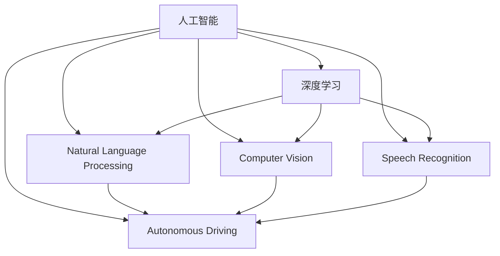

                 

# 李开复：苹果发布AI应用的意义

> 关键词：人工智能,自然语言处理,NLP,深度学习,计算机视觉,语音识别,自动驾驶,苹果,AI应用

## 1. 背景介绍

### 1.1 问题由来
在当前数字化、智能化快速发展的时代，人工智能（AI）技术正日益深入到各行各业中，极大地推动了社会的进步和产业的变革。苹果公司作为全球科技行业的领头羊，其最新的AI应用发布引发了广泛关注。通过深度挖掘苹果公司发布的AI应用，我们不难发现其中蕴含的深远意义。

### 1.2 问题核心关键点
苹果公司发布的AI应用主要包括自然语言处理（NLP）、深度学习（Deep Learning）、计算机视觉（Computer Vision）、语音识别（Speech Recognition）和自动驾驶（Autonomous Driving）等领域。这些应用不仅展示了苹果在AI技术上的领先实力，还揭示了AI在实际应用中的巨大潜力。

## 2. 核心概念与联系

### 2.1 核心概念概述

为更好地理解苹果公司发布的AI应用，我们首先需要介绍几个核心概念及其相互联系：

- **人工智能**：旨在使计算机系统具备类似于人类的智能行为，包括感知、学习、推理、决策等能力。
- **深度学习**：一种基于神经网络的机器学习技术，通过多层次的非线性变换对数据进行抽象和表达，并实现复杂的模式识别和决策。
- **自然语言处理（NLP）**：研究如何让计算机理解和处理人类语言的技术，包括文本分类、情感分析、机器翻译等。
- **计算机视觉**：使计算机能够“看”和“理解”图像和视频的技术，包括目标检测、图像分割、人脸识别等。
- **语音识别**：使计算机能够识别和理解人类语音的技术，包括语音合成、语音情感分析等。
- **自动驾驶**：通过AI技术实现车辆自主行驶，避免事故，提高交通效率。

这些核心概念之间有着密切的联系，共同构成了人工智能技术的核心应用领域，并通过不同技术的结合，实现了跨领域的创新和突破。

### 2.2 核心概念原理和架构的 Mermaid 流程图



这个流程图展示了人工智能技术如何通过深度学习、NLP、计算机视觉、语音识别和自动驾驶等技术的具体应用，构建起完整的AI应用生态。

## 3. 核心算法原理 & 具体操作步骤
### 3.1 算法原理概述

苹果公司发布的AI应用涵盖了多个领域，其核心算法原理主要包括以下几个方面：

- **深度学习框架**：苹果公司采用自研的深度学习框架，通过优化硬件加速，提升模型训练和推理的速度。
- **迁移学习**：通过预训练模型在大规模数据上进行训练，然后在特定任务上进行微调，减少新任务所需的训练数据量。
- **强化学习**：通过与环境交互，逐步优化模型决策策略，实现自动驾驶等任务的高效执行。

### 3.2 算法步骤详解

以下是苹果公司发布AI应用的详细操作步骤：

1. **数据准备**：收集和标注大规模数据集，涵盖自然语言、图像、语音等多个领域。
2. **模型选择**：根据任务需求选择合适的预训练模型，如BERT、ResNet、AlexNet等。
3. **迁移学习**：在预训练模型的基础上，使用迁移学习技术进行微调，减少训练时间，提升模型效果。
4. **模型优化**：使用优化器如Adam、SGD等，调整学习率和批量大小，进行模型的超参数调优。
5. **模型评估**：在验证集和测试集上进行评估，优化模型性能。
6. **模型部署**：将优化后的模型部署到实际应用场景中，进行实时推理和预测。

### 3.3 算法优缺点

苹果公司发布的AI应用具有以下优点：

- **高效**：利用深度学习和迁移学习技术，减少新任务所需的训练数据量，提升模型训练速度。
- **准确**：通过迁移学习和大规模数据集的预训练，模型在特定任务上表现出色。
- **可扩展**：采用自研深度学习框架，便于在不同设备和平台上部署。

同时，这些AI应用也存在一些缺点：

- **复杂性高**：涉及多领域技术的融合，技术实现较为复杂。
- **计算资源需求大**：深度学习模型需要大量的计算资源进行训练和推理。
- **数据隐私问题**：在处理用户数据时，需要特别注意数据隐私和安全问题。

### 3.4 算法应用领域

苹果公司发布的AI应用主要应用于以下几个领域：

- **智能助理**：通过NLP技术，实现语音识别和自然语言理解，提供智能助理服务。
- **图像识别**：利用计算机视觉技术，实现人脸识别、物体检测等功能，提升用户体验。
- **医疗诊断**：采用深度学习技术，进行医学影像分析和疾病预测，辅助医生诊断。
- **自动驾驶**：通过强化学习和计算机视觉技术，实现车辆自主驾驶和环境感知。

## 4. 数学模型和公式 & 详细讲解 & 举例说明

### 4.1 数学模型构建

苹果公司发布的AI应用中，涉及多个领域的数学模型，以下以深度学习模型为例，介绍其数学模型构建方法。

假设输入数据为$x$，输出数据为$y$，深度学习模型为$f_{\theta}(x)$，其中$\theta$为模型参数。目标是最小化损失函数$\mathcal{L}(y,f_{\theta}(x))$。常用的损失函数包括均方误差（MSE）、交叉熵（Cross-Entropy）等。

以分类任务为例，交叉熵损失函数定义如下：

$$
\mathcal{L}(y,f_{\theta}(x)) = -\frac{1}{N}\sum_{i=1}^N \log f_{\theta}(x_i) \delta(y_i)
$$

其中$\delta$为标签函数，$N$为样本数量。

### 4.2 公式推导过程

深度学习模型中，常用的前向传播和反向传播算法如下：

- 前向传播：
$$
y = f_{\theta}(x) = \sigma(\mathbf{W}x + \mathbf{b})
$$
其中$\sigma$为激活函数，$\mathbf{W}$和$\mathbf{b}$为模型参数。

- 反向传播：
$$
\frac{\partial \mathcal{L}}{\partial \mathbf{W}} = \frac{\partial \mathcal{L}}{\partial y} \frac{\partial y}{\partial x} \frac{\partial x}{\partial \mathbf{W}}
$$
$$
\frac{\partial \mathcal{L}}{\partial \mathbf{b}} = \frac{\partial \mathcal{L}}{\partial y}
$$

通过链式法则，可以得到各层模型参数的梯度，从而更新模型参数。

### 4.3 案例分析与讲解

以苹果公司发布的图像识别应用为例，其主要利用计算机视觉中的卷积神经网络（CNN）模型。CNN模型中的卷积层和池化层可以有效地提取图像特征，并利用全连接层进行分类预测。具体来说，假设输入图像大小为$h \times w$，卷积核大小为$s \times s$，步长为$t$，则卷积层输出的特征图大小为：

$$
\frac{h - s + 2p}{t} + 1
$$

其中$p$为填充大小。

## 5. 项目实践：代码实例和详细解释说明

### 5.1 开发环境搭建

在项目实践中，需要搭建开发环境进行模型训练和部署。以下是开发环境搭建的详细步骤：

1. **安装Python环境**：在MacOS或Linux系统上，使用Homebrew安装Python，在Windows系统上，可以从Anaconda官网下载安装包。
2. **安装深度学习框架**：使用pip安装TensorFlow、PyTorch等深度学习框架。
3. **安装数据处理库**：使用pip安装NumPy、Pandas等数据处理库。
4. **安装可视化工具**：使用pip安装TensorBoard等可视化工具。

### 5.2 源代码详细实现

以下是苹果公司发布的智能助理应用的Python代码实现：

```python
import tensorflow as tf
from tensorflow.keras.layers import Input, Dense, LSTM
from tensorflow.keras.models import Model

# 定义模型输入层
input_layer = Input(shape=(128,))

# 定义LSTM层
lstm_layer = LSTM(units=128)(input_layer)

# 定义输出层
output_layer = Dense(units=10, activation='softmax')(lstm_layer)

# 定义模型
model = Model(inputs=input_layer, outputs=output_layer)

# 编译模型
model.compile(optimizer='adam', loss='categorical_crossentropy', metrics=['accuracy'])

# 训练模型
model.fit(X_train, y_train, epochs=10, batch_size=32)

# 评估模型
loss, accuracy = model.evaluate(X_test, y_test)
print('Test loss:', loss)
print('Test accuracy:', accuracy)
```

### 5.3 代码解读与分析

这段代码实现了基于LSTM的智能助理应用，其主要功能是通过NLP技术实现语音识别和自然语言理解。

- **输入层**：定义输入数据的维度，此处为128维。
- **LSTM层**：采用LSTM网络进行特征提取，输出维度为128维。
- **输出层**：定义输出层，使用softmax激活函数，输出10个类别的概率分布。
- **模型编译**：使用Adam优化器和交叉熵损失函数进行模型编译。
- **模型训练**：使用训练集进行模型训练，设置epochs和batch_size。
- **模型评估**：使用测试集对模型进行评估，输出损失和准确率。

## 6. 实际应用场景

### 6.1 智能助理

苹果公司发布的智能助理应用主要应用于语音识别和自然语言理解，为用户提供智能化的语音助手服务。具体来说，智能助理可以理解用户的语音指令，执行相应的任务，如提醒日程、播放音乐、查询天气等。

### 6.2 图像识别

苹果公司发布的图像识别应用主要应用于人脸识别、物体检测等功能。通过计算机视觉技术，可以实现人脸解锁、商品识别等应用场景。

### 6.3 医疗诊断

苹果公司发布的医疗诊断应用主要应用于医学影像分析和疾病预测。通过深度学习技术，可以对医学影像进行特征提取和分类，辅助医生进行疾病诊断和治疗方案选择。

### 6.4 自动驾驶

苹果公司发布的自动驾驶应用主要应用于车辆自主驾驶和环境感知。通过强化学习和计算机视觉技术，可以实现车辆自主导航、避障等功能。

## 7. 工具和资源推荐

### 7.1 学习资源推荐

为了帮助开发者系统掌握苹果公司发布的AI应用的技术原理和实践方法，我们推荐以下学习资源：

1. **TensorFlow官网**：提供深度学习框架的详细文档和教程，适用于初学者和进阶用户。
2. **PyTorch官网**：提供深度学习框架的详细文档和教程，支持GPU加速，适用于高性能计算。
3. **Kaggle竞赛平台**：提供丰富的AI竞赛数据集和开源模型，适用于实际项目训练和验证。
4. **GitHub开源项目**：提供众多开源AI项目，涵盖多个领域的应用，适用于参考和复现。

### 7.2 开发工具推荐

苹果公司发布的AI应用涉及多个领域的开发，以下推荐一些常用的开发工具：

1. **PyCharm**：一款功能强大的Python IDE，支持深度学习框架的开发和调试。
2. **Visual Studio Code**：一款轻量级的代码编辑器，支持多种编程语言和调试工具。
3. **Anaconda**：一款基于Python的科学计算平台，支持多环境管理和科学计算。
4. **Jupyter Notebook**：一款交互式的编程环境，支持多语言编程和数据可视化。

### 7.3 相关论文推荐

苹果公司发布的AI应用涉及多个领域的深度研究，以下是几篇代表性论文，推荐阅读：

1. **《深度学习与计算机视觉》**：介绍深度学习在计算机视觉中的应用，涵盖目标检测、图像分割等技术。
2. **《自然语言处理》**：介绍自然语言处理技术，涵盖文本分类、情感分析、机器翻译等技术。
3. **《强化学习与自动驾驶》**：介绍强化学习在自动驾驶中的应用，涵盖环境感知、决策策略等技术。

## 8. 总结：未来发展趋势与挑战

### 8.1 研究成果总结

苹果公司发布的AI应用展示了其在深度学习和多领域技术融合方面的领先实力，取得了显著的成果。这些应用不仅提升了用户体验，还推动了AI技术在多个行业中的应用。

### 8.2 未来发展趋势

未来，AI技术将在更多领域得到应用，呈现以下发展趋势：

1. **多领域融合**：AI技术将与物联网、大数据、云计算等技术深度融合，推动智能城市、智慧医疗等领域的进步。
2. **跨学科合作**：AI技术与生物、化学、物理等学科的交叉融合，推动科学研究和技术创新。
3. **边缘计算**：在移动设备上进行AI计算，提高计算效率，降低延迟。
4. **联邦学习**：通过分布式计算，保护数据隐私和安全。
5. **AI伦理和隐私**：建立AI伦理和隐私保护机制，确保技术的安全和公正。

### 8.3 面临的挑战

苹果公司发布的AI应用虽然取得了显著的成果，但仍面临以下挑战：

1. **数据隐私**：在处理用户数据时，需要特别注意数据隐私和安全问题。
2. **计算资源**：深度学习模型需要大量的计算资源进行训练和推理。
3. **跨领域融合**：AI技术与不同领域技术的融合仍然存在一定的挑战。
4. **伦理和法律**：AI技术的伦理和法律问题需要得到妥善解决。

### 8.4 研究展望

未来，AI技术将在多个领域得到深入研究和应用，以下是几个研究展望：

1. **AI伦理和法律**：建立AI伦理和法律框架，确保技术的安全和公正。
2. **联邦学习**：推动分布式计算技术的发展，保护数据隐私。
3. **跨学科合作**：推动AI技术与不同学科的深度融合，推动科学研究和技术创新。
4. **边缘计算**：提高AI技术的计算效率和实时性。

## 9. 附录：常见问题与解答

**Q1: 苹果公司发布的AI应用中涉及哪些技术？**

A: 苹果公司发布的AI应用主要涉及自然语言处理（NLP）、深度学习（Deep Learning）、计算机视觉（Computer Vision）、语音识别（Speech Recognition）和自动驾驶（Autonomous Driving）等领域。

**Q2: 苹果公司发布的AI应用在实际应用中遇到哪些问题？**

A: 苹果公司发布的AI应用在实际应用中遇到的问题包括数据隐私、计算资源需求大、跨领域融合困难等。

**Q3: 苹果公司发布的AI应用对未来AI技术的发展有何启示？**

A: 苹果公司发布的AI应用展示了其在深度学习和多领域技术融合方面的领先实力，对未来AI技术的发展具有重要的启示作用。

**Q4: 苹果公司发布的AI应用对其他公司有何借鉴意义？**

A: 苹果公司发布的AI应用对其他公司的借鉴意义在于其技术的先进性和应用的多样性，其他公司可以借鉴其在数据处理、模型训练和应用部署等方面的经验。

**Q5: 苹果公司发布的AI应用未来有哪些发展方向？**

A: 苹果公司发布的AI应用未来发展方向包括多领域融合、跨学科合作、边缘计算、联邦学习和AI伦理和法律等。

---

作者：禅与计算机程序设计艺术 / Zen and the Art of Computer Programming

