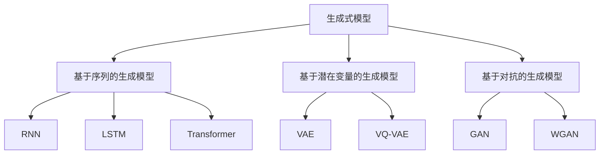

                 

# 生成式AIGC：科技创新与商业应用的融合

> 关键词：生成式AI,自动生成内容,内容创作,商业应用,科技创新

## 1. 背景介绍

### 1.1 问题由来

随着AI技术的不断进步，生成式人工智能（Generative AI, 简称AIGC）正在成为当前的热门话题。生成式AI指的是通过模型生成新数据，而不是仅仅在已有数据上进行分类或预测。相较于传统的基于监督学习的AI，生成式AI更具创造性和可塑性。这种技术能够广泛应用于内容创作、智能生成、自然语言处理等多个领域。

在当今信息爆炸的时代，内容创作和传播需求激增，传统内容生产方式难以满足人们日益增长的内容需求。同时，随着技术的进步，越来越多的AI技术被应用于内容创作，特别是在文章生成、音乐创作、图像生成、视频制作等场景中，AI已经能够生产出与人类作品相媲美的高质量内容。

但与此同时，AIGC技术也面临许多挑战。如何在内容真实性、创造性、版权保护、伦理等方面找到平衡，是AIGC在商业化应用中需要考虑的重要问题。如何在保持技术创新的同时，保证商业应用的合理性、合法性和公平性，也是当前研究的重要课题。

### 1.2 问题核心关键点

AIGC的核心是生成式模型，其设计原理和架构涉及深度学习、自然语言处理、图像处理等多领域知识。核心概念包括：

- **生成式模型**：通过学习数据分布，生成新的数据样本，如文本、图像、音频等。
- **变分自编码器（VAE）**：一种生成模型，能够学习数据的潜在分布，并生成新的数据样本。
- **生成对抗网络（GAN）**：通过生成器与判别器之间的对抗训练，生成逼真的数据样本。
- **变分生成自编码器（VQ-VAE）**：结合了离散嵌入和变分自编码器的生成模型，具有较好的可解释性。
- **自回归模型**：如LSTM、Transformer等，通过顺序生成方式生成文本、音频等序列数据。

这些核心概念在AIGC技术中具有重要的应用，构成了其技术基础和理论支撑。

## 2. 核心概念与联系

### 2.1 核心概念概述

AIGC技术涉及多个领域，其中生成式模型是核心。生成式模型主要分为三大类：基于序列的生成模型、基于潜在变量的生成模型、以及基于对抗的生成模型。

- **基于序列的生成模型**：通过顺序生成方式生成序列数据，如自然语言处理中的RNN、LSTM、Transformer等模型。
- **基于潜在变量的生成模型**：学习数据的潜在变量，生成新的数据样本，如VAE、VQ-VAE等。
- **基于对抗的生成模型**：通过生成器与判别器之间的对抗训练，生成逼真的数据样本，如GAN、WGAN等。

这些生成模型各自有其独特的优势和局限性。基于序列的模型适用于生成序列数据，但对于复杂数据分布的生成能力有限。基于潜在变量的模型能够学习数据的潜在变量，具有较好的生成能力，但生成的数据样本可能缺乏可解释性。基于对抗的模型生成数据样本质量高，但模型训练复杂，对初始条件敏感。

### 2.2 核心概念原理和架构的 Mermaid 流程图



这个流程图展示了生成式模型分类及各个子类模型的具体实现。不同类别的生成模型适用于不同类型的数据生成任务。

## 3. 核心算法原理 & 具体操作步骤

### 3.1 算法原理概述

生成式AIGC技术主要通过生成模型学习数据分布，生成新的数据样本。其核心算法包括：

- **变分自编码器（VAE）**：学习数据的潜在变量，生成新的数据样本，其训练过程通过最大化数据似然和最小化潜在变量与数据变量的差异来优化。
- **生成对抗网络（GAN）**：通过生成器与判别器之间的对抗训练，生成逼真的数据样本，其训练过程通过优化生成器和判别器的博弈过程来生成高质量的数据样本。
- **变分生成自编码器（VQ-VAE）**：结合了离散嵌入和变分自编码器的生成模型，能够生成具有较好可解释性的数据样本。
- **自回归模型**：如LSTM、Transformer等，通过顺序生成方式生成序列数据，具有较好的时间序列建模能力。

这些生成模型在各自的领域中均表现出色，并在实际应用中得到了广泛的应用。

### 3.2 算法步骤详解

生成式AIGC技术的实现步骤主要包括：

1. **数据准备**：收集并处理所需的数据，包括清洗、标注、归一化等预处理步骤。
2. **模型选择**：根据任务需求选择合适的生成模型，如基于序列的模型、基于潜在变量的模型、基于对抗的模型等。
3. **模型训练**：使用训练数据集训练生成模型，优化模型参数。
4. **数据生成**：使用训练好的模型生成新的数据样本。
5. **后处理**：对生成的数据样本进行后处理，如文本编辑、图像处理等，提高生成数据的可接受度。

以生成文本为例，具体步骤如下：

**1. 数据准备**：收集需要生成文本的语料库，并进行清洗、分词等预处理步骤。

**2. 模型选择**：选择适合的文本生成模型，如基于LSTM的生成模型、基于Transformer的生成模型等。

**3. 模型训练**：使用收集的文本数据训练生成模型，调整模型参数。

**4. 数据生成**：使用训练好的模型生成新的文本样本。

**5. 后处理**：对生成的文本进行后处理，如拼写检查、语法修正等。

### 3.3 算法优缺点

生成式AIGC技术具有以下优点：

- **高效性**：能够快速生成大量高质量的数据样本，节省人力和时间成本。
- **创造性**：生成的数据样本具有较强的创造性和多样性，能够提供更丰富的内容选择。
- **可解释性**：生成的数据样本具有一定的可解释性，能够帮助人们理解数据生成的过程。

但同时，生成式AIGC技术也存在一些缺点：

- **过拟合风险**：生成的数据样本可能过度拟合训练数据，导致生成的数据与现实情况不符。
- **真实性问题**：生成的数据样本可能缺乏真实性，难以满足实际应用的需求。
- **版权问题**：生成的数据样本可能侵犯原始内容的版权，存在法律风险。
- **伦理问题**：生成的内容可能涉及伦理和道德问题，需要审慎使用。

### 3.4 算法应用领域

生成式AIGC技术在多个领域中具有广泛的应用前景，主要包括：

- **内容创作**：如文章生成、音乐创作、图像生成等。
- **智能生成**：如自动翻译、文本摘要、视频剪辑等。
- **自然语言处理**：如对话生成、文本分类、情感分析等。
- **图像处理**：如图像生成、图像修复、图像转换等。
- **音频处理**：如音乐生成、语音合成、音频编辑等。

这些应用领域展示了AIGC技术的强大潜力和广泛应用前景。

## 4. 数学模型和公式 & 详细讲解 & 举例说明

### 4.1 数学模型构建

生成式AIGC技术的核心数学模型包括：

- **变分自编码器（VAE）**：学习数据的潜在变量，生成新的数据样本。其训练过程通过最大化数据似然和最小化潜在变量与数据变量的差异来优化。
- **生成对抗网络（GAN）**：通过生成器与判别器之间的对抗训练，生成逼真的数据样本。其训练过程通过优化生成器和判别器的博弈过程来生成高质量的数据样本。

以变分自编码器（VAE）为例，其数学模型包括：

- **数据集**：$D = \{(x_i, y_i)\}_{i=1}^N$，其中 $x_i$ 是样本，$y_i$ 是标签。
- **生成器**：$G(z)$，将潜在变量 $z$ 映射为生成样本 $x$。
- **解码器**：$D(x)$，将生成样本 $x$ 映射回潜在变量 $z$。
- **潜在变量分布**：$p(z)$，控制生成样本的分布。
- **生成样本分布**：$p(x)$，生成样本的真实分布。

VAE的目标是最小化生成样本分布与真实分布之间的差异，同时最大化数据似然。其损失函数为：

$$
\mathcal{L} = \frac{1}{N} \sum_{i=1}^N \left[ \log p(x_i) + D_{KL}(p(z|x_i) || q(z|x_i)) \right]
$$

其中 $D_{KL}$ 是KL散度，用于衡量两个概率分布之间的差异。

### 4.2 公式推导过程

以变分自编码器（VAE）为例，其训练过程包括：

1. **数据预处理**：对数据集进行归一化处理。
2. **潜在变量分布**：选择潜在变量的先验分布 $p(z)$，如高斯分布。
3. **生成器和解码器训练**：使用训练数据集训练生成器 $G(z)$ 和解码器 $D(x)$，最小化损失函数 $\mathcal{L}$。
4. **潜在变量分布训练**：使用生成器和解码器训练潜在变量分布 $p(z)$。

以生成对抗网络（GAN）为例，其训练过程包括：

1. **生成器训练**：使用训练数据集训练生成器 $G(z)$，最小化判别器的损失函数。
2. **判别器训练**：使用生成器生成的样本和真实样本训练判别器 $D(x)$，最大化判别器的损失函数。
3. **交替训练**：生成器和判别器交替训练，直到收敛。

### 4.3 案例分析与讲解

以文本生成为例，可以使用基于LSTM的生成模型进行训练。具体步骤如下：

**1. 数据预处理**：对文本数据进行清洗、分词、归一化等预处理步骤。

**2. 模型选择**：选择基于LSTM的生成模型。

**3. 模型训练**：使用预处理后的文本数据训练生成模型，调整模型参数。

**4. 数据生成**：使用训练好的模型生成新的文本样本。

**5. 后处理**：对生成的文本进行后处理，如拼写检查、语法修正等。

以图像生成为例，可以使用基于GAN的生成模型进行训练。具体步骤如下：

**1. 数据准备**：收集需要生成图像的语料库，并进行预处理步骤。

**2. 模型选择**：选择基于GAN的生成模型，如DCGAN、WGAN等。

**3. 模型训练**：使用预处理后的图像数据训练生成模型，调整模型参数。

**4. 数据生成**：使用训练好的模型生成新的图像样本。

**5. 后处理**：对生成的图像进行后处理，如图像编辑、优化等。

## 5. 项目实践：代码实例和详细解释说明

### 5.1 开发环境搭建

要进行生成式AIGC的实践，需要搭建相应的开发环境。以下是在PyTorch中进行文本生成实践的开发环境搭建步骤：

1. 安装Anaconda：从官网下载并安装Anaconda，用于创建独立的Python环境。

2. 创建并激活虚拟环境：
```bash
conda create -n pytorch-env python=3.8 
conda activate pytorch-env
```

3. 安装PyTorch：根据CUDA版本，从官网获取对应的安装命令。例如：
```bash
conda install pytorch torchvision torchaudio cudatoolkit=11.1 -c pytorch -c conda-forge
```

4. 安装必要的第三方库：
```bash
pip install torch nn torchtext transformers
```

完成上述步骤后，即可在`pytorch-env`环境中开始文本生成实践。

### 5.2 源代码详细实现

下面以基于LSTM的文本生成模型为例，给出使用PyTorch进行文本生成的PyTorch代码实现。

```python
import torch
import torch.nn as nn
import torch.optim as optim
from torchtext.datasets import TextClassification
from torchtext.data import Field, BucketIterator

# 定义模型结构
class LSTMModel(nn.Module):
    def __init__(self, vocab_size, embed_dim, hidden_dim, output_dim, n_layers, dropout):
        super(LSTMModel, self).__init__()
        self.embedding = nn.Embedding(vocab_size, embed_dim)
        self.lstm = nn.LSTM(embed_dim, hidden_dim, num_layers=n_layers, dropout=dropout, batch_first=True)
        self.fc = nn.Linear(hidden_dim, output_dim)
        self.dropout = nn.Dropout(dropout)
        
    def forward(self, text, hidden):
        embedded = self.dropout(self.embedding(text))
        output, hidden = self.lstm(embedded, hidden)
        hidden = self.dropout(hidden[-1])
        return self.fc(hidden.squeeze(0))
    
# 定义训练函数
def train_model(model, iterator, optimizer, criterion):
    epoch_loss = 0
    epoch_acc = 0
    
    model.train()
    
    for batch in iterator:
        optimizer.zero_grad()
        predictions = model(batch.text, hidden)
        loss = criterion(predictions, batch.label)
        acc = binary_accuracy(predictions, batch.label)
        loss.backward()
        optimizer.step()
        epoch_loss += loss.item()
        epoch_acc += acc.item()
    
    return epoch_loss / len(iterator), epoch_acc / len(iterator)
    
# 定义评估函数
def evaluate_model(model, iterator, criterion):
    epoch_loss = 0
    epoch_acc = 0
    
    model.eval()
    
    with torch.no_grad():
        for batch in iterator:
            predictions = model(batch.text, hidden)
            loss = criterion(predictions, batch.label)
            acc = binary_accuracy(predictions, batch.label)
            epoch_loss += loss.item()
            epoch_acc += acc.item()
    
    return epoch_loss / len(iterator), epoch_acc / len(iterator)
    
# 定义模型训练和评估函数
def train_and_evaluate(model, train_iterator, valid_iterator, test_iterator, optimizer, criterion, num_epochs):
    for epoch in range(num_epochs):
        train_loss, train_acc = train_model(model, train_iterator, optimizer, criterion)
        val_loss, val_acc = evaluate_model(model, valid_iterator, criterion)
        
        if (epoch + 1) % 1 == 0:
            print(f'Epoch: {epoch+1}, Train Loss: {train_loss:.3f}, Train Acc: {train_acc:.3f}, Val Loss: {val_loss:.3f}, Val Acc: {val_acc:.3f}')
```

### 5.3 代码解读与分析

**LSTMModel类**：
- `__init__`方法：初始化模型结构，包括嵌入层、LSTM层、全连接层和dropout层。
- `forward`方法：前向传播过程，将输入文本经过嵌入层、LSTM层和全连接层得到输出。

**train_model函数**：
- 使用模型进行前向传播，计算损失和准确率，进行反向传播和参数更新。

**evaluate_model函数**：
- 使用模型进行前向传播，计算损失和准确率，但不进行反向传播和参数更新。

**train_and_evaluate函数**：
- 定义训练和评估函数，循环训练模型，并输出训练和验证的损失和准确率。

以上代码展示了基于LSTM的文本生成模型的训练和评估过程。在实际应用中，可以根据具体需求对模型结构进行改进，例如增加注意力机制、引入Transformer等。

## 6. 实际应用场景

### 6.1 智能写作辅助

生成式AIGC技术可以应用于智能写作辅助，帮助作家、记者、研究人员等高效创作。智能写作系统可以通过分析用户需求，自动生成文章标题、开头、段落、结尾等内容，减少创作者的工作量。

以文章生成为例，智能写作系统可以根据用户输入的关键词、主题等信息，自动生成符合用户需求的短文或文章。用户可以对生成的内容进行修改和编辑，最终完成创作。

### 6.2 智能广告生成

生成式AIGC技术可以应用于智能广告生成，帮助企业快速生成高质量的广告文案。智能广告系统可以根据用户偏好、行为数据等信息，自动生成符合用户需求的广告文案。

以广告生成为例，智能广告系统可以根据用户浏览历史、购买记录等信息，自动生成个性化的广告文案。用户可以根据生成的文案进行审核和修改，最终完成广告投放。

### 6.3 智能翻译

生成式AIGC技术可以应用于智能翻译，帮助用户实现自动翻译。智能翻译系统可以根据用户输入的文本，自动翻译成目标语言。

以翻译为例，智能翻译系统可以根据用户输入的英文文本，自动翻译成中文。用户可以对翻译结果进行审核和修改，最终完成翻译任务。

### 6.4 未来应用展望

随着生成式AIGC技术的不断进步，其应用领域将进一步拓展。未来，生成式AIGC技术将在以下几个方向取得更多突破：

1. **多模态生成**：结合文本、图像、音频等多种数据类型，生成更加丰富和多样化的内容。
2. **跨语言生成**：实现跨语言生成，提高全球内容创作和传播的效率。
3. **个性化生成**：根据用户偏好和行为数据，生成个性化的内容，满足用户需求。
4. **交互式生成**：实现人机交互式生成，提升用户参与感和互动体验。
5. **生成式模型优化**：通过深度学习和强化学习等技术，优化生成模型的性能和效率。

## 7. 工具和资源推荐

### 7.1 学习资源推荐

为了帮助开发者系统掌握生成式AIGC的理论基础和实践技巧，这里推荐一些优质的学习资源：

1. 《生成式AI：原理与实践》系列博文：由生成式AI技术专家撰写，深入浅出地介绍了生成式AI的基本原理、常用模型和应用场景。

2. 《深度学习框架教程》课程：涵盖PyTorch、TensorFlow等深度学习框架的使用方法和技巧，适合初学者和进阶者学习。

3. 《自然语言处理与深度学习》书籍：介绍自然语言处理和深度学习的基本概念和常用模型，包括文本生成、机器翻译等任务。

4. HuggingFace官方文档：提供丰富的生成式AI模型和工具库，适合快速上手生成式AI的开发和应用。

5. GAN Research领域综述：总结生成对抗网络的研究进展和应用场景，提供生成式AI的前沿研究动态。

通过对这些资源的学习实践，相信你一定能够快速掌握生成式AIGC的核心技术和应用方法，实现高质量的内容创作和智能生成。

### 7.2 开发工具推荐

高效的开发离不开优秀的工具支持。以下是几款用于生成式AIGC开发的常用工具：

1. PyTorch：基于Python的开源深度学习框架，灵活的计算图，适合快速迭代研究。支持多种生成式AI模型和工具库。

2. TensorFlow：由Google主导开发的开源深度学习框架，生产部署方便，适合大规模工程应用。提供丰富的生成式AI模型和工具库。

3. Weights & Biases：模型训练的实验跟踪工具，可以记录和可视化模型训练过程中的各项指标，方便对比和调优。与主流深度学习框架无缝集成。

4. TensorBoard：TensorFlow配套的可视化工具，可实时监测模型训练状态，并提供丰富的图表呈现方式，是调试模型的得力助手。

5. Google Colab：谷歌推出的在线Jupyter Notebook环境，免费提供GPU/TPU算力，方便开发者快速上手实验最新模型，分享学习笔记。

合理利用这些工具，可以显著提升生成式AIGC任务的开发效率，加快创新迭代的步伐。

### 7.3 相关论文推荐

生成式AIGC技术的发展源于学界的持续研究。以下是几篇奠基性的相关论文，推荐阅读：

1. Generative Adversarial Networks（GAN）论文：提出生成对抗网络，通过生成器与判别器之间的对抗训练，生成逼真的数据样本。

2. Variational Autoencoder（VAE）论文：提出变分自编码器，学习数据的潜在变量，生成新的数据样本。

3. Neural Machine Translation by Jointly Learning to Align and Translate（Transformer）论文：提出Transformer模型，用于机器翻译任务，取得了SOTA的性能。

4. Attention is All You Need论文：提出自注意力机制，大幅提升Transformer模型的性能和效率。

5. Deep Speech 3：用深度学习实现语音识别，利用生成式AI技术生成高质量的语音样本。

这些论文代表了大生成式AIGC技术的发展脉络。通过学习这些前沿成果，可以帮助研究者把握学科前进方向，激发更多的创新灵感。

## 8. 总结：未来发展趋势与挑战

### 8.1 研究成果总结

生成式AIGC技术在内容创作、智能生成、自然语言处理等多个领域中展现出了强大的潜力。通过生成式AI模型，能够快速生成高质量的数据样本，提高内容创作和智能生成的效率和质量。

### 8.2 未来发展趋势

展望未来，生成式AIGC技术将呈现以下几个发展趋势：

1. **多模态生成**：结合文本、图像、音频等多种数据类型，生成更加丰富和多样化的内容。
2. **跨语言生成**：实现跨语言生成，提高全球内容创作和传播的效率。
3. **个性化生成**：根据用户偏好和行为数据，生成个性化的内容，满足用户需求。
4. **交互式生成**：实现人机交互式生成，提升用户参与感和互动体验。
5. **生成式模型优化**：通过深度学习和强化学习等技术，优化生成模型的性能和效率。

### 8.3 面临的挑战

尽管生成式AIGC技术已经取得了瞩目成就，但在实际应用中仍面临诸多挑战：

1. **数据质量问题**：生成的内容可能与真实数据存在差异，影响实际应用效果。
2. **版权和伦理问题**：生成的内容可能侵犯原始内容的版权，存在法律风险。同时生成的内容可能涉及伦理和道德问题，需要审慎使用。
3. **模型可解释性**：生成式模型的决策过程难以解释，难以理解生成的内容。
4. **计算资源消耗**：生成式AI模型通常需要大量的计算资源，训练和推理效率较低。

### 8.4 研究展望

未来的研究需要在以下几个方向寻求新的突破：

1. **模型可解释性**：开发更加可解释的生成式模型，提高模型的透明度和可理解性。
2. **版权和伦理问题**：研究生成式AI模型的版权和伦理问题，确保生成内容的使用合法合规。
3. **计算资源优化**：优化生成式AI模型的计算资源消耗，提高训练和推理效率。
4. **跨领域应用**：将生成式AI技术应用于更多领域，如医疗、金融、法律等，拓展应用场景。

这些研究方向凸显了生成式AIGC技术的广阔前景，预示着未来的应用和研究方向。

## 9. 附录：常见问题与解答

**Q1：生成式AI模型与传统AI模型有何不同？**

A: 生成式AI模型与传统AI模型的主要区别在于其生成数据的能力。传统AI模型通常用于分类、预测等任务，而生成式AI模型能够生成新的数据样本。例如，传统模型可以通过训练数据学习数据的分布，进行分类预测；而生成式模型则能够通过学习数据的分布，生成新的数据样本。

**Q2：生成式AI模型在实际应用中面临哪些挑战？**

A: 生成式AI模型在实际应用中面临以下挑战：

1. **数据质量问题**：生成的内容可能与真实数据存在差异，影响实际应用效果。
2. **版权和伦理问题**：生成的内容可能侵犯原始内容的版权，存在法律风险。同时生成的内容可能涉及伦理和道德问题，需要审慎使用。
3. **模型可解释性**：生成式模型的决策过程难以解释，难以理解生成的内容。
4. **计算资源消耗**：生成式AI模型通常需要大量的计算资源，训练和推理效率较低。

**Q3：如何提高生成式AI模型的性能？**

A: 提高生成式AI模型的性能可以从以下几个方面入手：

1. **数据质量**：使用高质量的数据进行模型训练，提高模型的泛化能力。
2. **模型优化**：优化模型的架构和超参数，提高模型的训练和推理效率。
3. **正则化**：使用正则化技术，如L2正则、Dropout等，避免过拟合。
4. **模型融合**：将多种生成式AI模型进行融合，提高模型的多样性和泛化能力。
5. **对抗训练**：引入对抗样本，提高模型的鲁棒性。

**Q4：生成式AI模型在实际应用中如何评估其性能？**

A: 生成式AI模型的性能评估可以从以下几个方面入手：

1. **内容真实性**：评估生成的内容与真实数据的相似度，使用BLEU、ROUGE等指标进行评估。
2. **内容多样性**：评估生成的内容的多样性和创新性，使用多样性指标进行评估。
3. **内容质量**：评估生成的内容的质量，使用人工评审或自动评价指标进行评估。
4. **计算效率**：评估模型的训练和推理效率，使用计算时间、内存占用等指标进行评估。

通过以上系统梳理，可以看到生成式AIGC技术的巨大潜力和应用前景。相信在学界和产业界的共同努力下，生成式AI技术将在未来得到更广泛的应用，为内容创作和智能生成等领域带来深刻的变革。

---

作者：禅与计算机程序设计艺术 / Zen and the Art of Computer Programming

