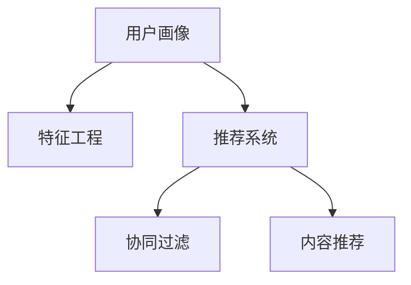

                 

# 用户画像在电商个性化推荐中的应用：方法与实践

## 1. 背景介绍

### 1.1 问题由来

随着电子商务的迅猛发展，商家和平台在个性化推荐方面投入了大量的精力和资源。由于消费者需求多样且快速变化，如何精准把握用户偏好，为其推荐最适合的商品，成为了一个重要挑战。传统推荐系统多依赖静态的用户历史数据和商品属性，难以应对用户行为的动态变化。而借助用户画像（User Profile），利用丰富的用户行为数据和标签信息，可以构建更加全面、灵活的推荐系统，提升用户体验和平台转化率。

用户画像是一个综合性的用户描述，涵盖了用户的多种属性和行为数据。它通常包括以下几个方面：
- **基本信息**：如年龄、性别、地理位置等。
- **历史行为**：如浏览历史、购买记录、评价信息等。
- **兴趣偏好**：通过文本分析、推荐结果反馈等方式，捕捉用户对不同商品的兴趣倾向。
- **社交网络**：用户间的关系、好友推荐、社交媒体互动等。
- **行为模型**：如用户的点击率、转化率等。

通过构建用户画像，可以更准确地捕捉用户特征，提高个性化推荐系统的精准度。

### 1.2 问题核心关键点

在电商推荐中，利用用户画像进行个性化推荐的核心关键点包括：
1. **数据采集与融合**：收集和融合多源用户数据，构建高质量的用户画像。
2. **画像建模与表示**：将用户画像转化为可供机器学习的结构化向量。
3. **推荐算法设计**：设计高效、可解释的推荐算法，结合用户画像实现个性化推荐。
4. **实时性和扩展性**：保证推荐系统能够快速响应用户需求，同时具备高扩展性，支持大规模用户数据处理。

## 2. 核心概念与联系

### 2.1 核心概念概述

为了更好地理解基于用户画像的电商个性化推荐方法，本节将介绍几个核心概念：

- **用户画像**：用户画像是一个综合性的用户描述，涵盖了用户的多种属性和行为数据。它通过多源数据的融合和分析，形成对用户兴趣、行为、偏好等方面的全面描述。

- **特征工程**：特征工程是从原始数据中提取、处理和构造特征，用于训练机器学习模型的过程。在用户画像构建和推荐算法设计中，特征工程起到了至关重要的作用。

- **推荐系统**：推荐系统通过分析用户行为和商品属性，为用户推荐合适的商品。它利用机器学习、深度学习等技术，实现个性化推荐。

- **协同过滤**：协同过滤是一种基于用户或物品相似性的推荐算法。通过分析用户行为数据，找到与当前用户兴趣相似的其他用户或物品，从而推荐给目标用户。

- **内容推荐**：内容推荐侧重于推荐系统对商品内容的理解。它通过分析商品属性、描述等信息，构建商品特征表示，与用户画像结合，实现基于内容的推荐。

这些核心概念之间的逻辑关系可以通过以下Mermaid流程图来展示：



这个流程图展示了一个基于用户画像的电商推荐系统的主要流程：
1. 从用户行为数据中构建用户画像。
2. 通过特征工程将用户画像转化为机器学习模型可以处理的形式。
3. 利用推荐算法结合用户画像，实现个性化推荐。

## 3. 核心算法原理 & 具体操作步骤
### 3.1 算法原理概述

基于用户画像的电商个性化推荐系统，其核心思想是：通过融合多源用户数据，构建用户画像，将其转化为结构化向量，输入推荐算法中，实现个性化推荐。其核心算法流程包括：

1. **用户画像构建**：从多个数据源（如购物历史、浏览记录、用户评价等）中收集和融合用户数据，形成用户画像。
2. **特征表示学习**：利用特征工程方法，将用户画像转化为可供推荐算法处理的结构化特征向量。
3. **推荐算法训练**：结合用户画像特征和商品特征，训练推荐模型，实现个性化推荐。
4. **实时推荐**：在用户请求推荐时，实时分析用户画像和商品特征，生成个性化推荐结果。

### 3.2 算法步骤详解

#### 3.2.1 数据采集与融合

用户画像的构建始于多源数据的采集与融合。常用的数据源包括：
- **交易数据**：用户的购买记录、支付信息、退货记录等。
- **浏览数据**：用户的网页浏览记录、点击行为、停留时间等。
- **评价数据**：用户对商品的评价、评分等。
- **社交数据**：用户的社交网络关系、好友推荐等。

数据采集过程通常涉及隐私保护和安全问题，需要确保数据的匿名性和安全性。

**数据融合**：通过数据清洗、整合和标准化，将多源数据融合为统一的用户画像。常用的方法包括：
- **拼接法**：直接将多个数据源的数据拼接为一个综合性的用户画像。
- **集成法**：通过加权、投票等方式，将不同数据源的信息综合考虑，生成用户画像。

#### 3.2.2 特征工程

**特征提取**：从原始数据中提取有用的特征，如用户的年龄、性别、购买频率等。常用的特征提取方法包括：
- **统计特征**：如均值、中位数、标准差等。
- **文本特征**：如TF-IDF、Word2Vec等。
- **时间特征**：如购买日期、点击时间等。

**特征选择**：从提取的特征中筛选出对推荐结果影响最大的特征。常用的特征选择方法包括：
- **过滤式**：基于领域知识和先验经验，手动选择特征。
- **包裹式**：通过机器学习模型，自动选择最佳特征。
- **嵌入式**：在机器学习模型训练过程中，动态选择特征。

#### 3.2.3 特征表示学习

**用户画像向量化**：将用户画像转化为机器学习模型可以处理的向量形式。常用的方法包括：
- **隐语义模型**：如Latent Dirichlet Allocation (LDA)，通过主题建模，将用户行为转化为向量表示。
- **深度学习方法**：如Self-Attention、Transformer等，通过学习用户行为和商品特征的隐向量表示。

#### 3.2.4 推荐算法训练

**协同过滤算法**：基于用户或物品相似性的推荐算法，通过分析用户行为数据，找到与当前用户兴趣相似的其他用户或物品，从而推荐给目标用户。常用的协同过滤算法包括：
- **基于用户的协同过滤**：找到与当前用户兴趣相似的其他用户，推荐该用户喜欢的商品。
- **基于物品的协同过滤**：找到与当前商品相似的其他商品，推荐给喜欢该商品的用户。

**内容推荐算法**：侧重于推荐系统对商品内容的理解。通过分析商品属性、描述等信息，构建商品特征表示，与用户画像结合，实现基于内容的推荐。常用的内容推荐算法包括：
- **基于内容的推荐**：根据商品属性和用户画像中的兴趣标签，推荐相似的商品。
- **协同嵌入式内容推荐**：结合协同过滤和内容推荐的优点，实现更加精准的推荐。

#### 3.2.5 实时推荐

**实时推荐系统**：在用户请求推荐时，实时分析用户画像和商品特征，生成个性化推荐结果。常用的实时推荐系统架构包括：
- **模块化架构**：将推荐系统分为多个模块，如用户画像构建、特征工程、推荐算法等，各模块独立运行。
- **流式架构**：实时接收用户请求和数据流，动态生成推荐结果。

## 4. 数学模型和公式 & 详细讲解 & 举例说明

### 4.1 数学模型构建

在基于用户画像的电商推荐系统中，常用的数学模型包括协同过滤模型和内容推荐模型。

**协同过滤模型**：基于用户或物品相似性的推荐算法，通过计算用户和商品之间的相似度，进行推荐。常用的协同过滤模型包括：
- **基于用户的协同过滤**：用户-物品相似度矩阵 $P$，用户画像 $U$，物品画像 $I$，推荐结果 $R$。计算公式如下：
  $$
  R = P \times U \times I^T
  $$
  其中 $P$ 为用户-物品相似度矩阵，$U$ 为用户画像向量，$I$ 为物品画像向量。

**内容推荐模型**：通过分析商品属性和描述，构建商品特征表示，与用户画像结合，实现基于内容的推荐。常用的内容推荐模型包括：
- **基于内容的推荐**：用户画像 $U$，商品特征 $F$，推荐结果 $R$。计算公式如下：
  $$
  R = U \times F
  $$
  其中 $U$ 为用户画像向量，$F$ 为商品特征向量。

### 4.2 公式推导过程

#### 4.2.1 协同过滤公式推导

**基于用户的协同过滤**：
- 用户画像 $U$ 和物品画像 $I$ 通过隐语义模型转化为向量表示。
- 用户-物品相似度矩阵 $P$ 通过用户画像和物品画像的相似度计算得到。
- 推荐结果 $R$ 通过用户画像 $U$、物品画像 $I$ 和相似度矩阵 $P$ 的矩阵乘法计算得到。

#### 4.2.2 内容推荐公式推导

**基于内容的推荐**：
- 用户画像 $U$ 和商品特征 $F$ 通过深度学习方法转化为向量表示。
- 推荐结果 $R$ 通过用户画像 $U$ 和商品特征 $F$ 的矩阵乘法计算得到。

### 4.3 案例分析与讲解

假设有一家电商公司，收集了以下用户数据：
- **交易数据**：用户购买记录、支付信息、退货记录等。
- **浏览数据**：用户网页浏览记录、点击行为、停留时间等。
- **评价数据**：用户对商品的评价、评分等。
- **社交数据**：用户的社交网络关系、好友推荐等。

通过数据采集与融合，构建了一个用户画像，如下所示：

```
User ID: 123
Age: 25
Gender: Male
Location: Beijing
Browsing History: [item1, item2, item3]
Purchase History: [item1, item4]
Reviews: 4/5
Social Network: [friend1, friend2]
```

接下来，利用特征工程方法，将用户画像转化为向量表示，如下所示：

```
User Embedding: [0.3, 0.7, -0.1, 0.5]
```

最后，结合推荐算法，计算推荐结果，如下所示：

```
Recommendations: [item1, item3, item4, item5]
```

## 5. 项目实践：代码实例和详细解释说明

### 5.1 开发环境搭建

在进行推荐系统开发前，我们需要准备好开发环境。以下是使用Python进行PyTorch开发的环境配置流程：

1. 安装Anaconda：从官网下载并安装Anaconda，用于创建独立的Python环境。

2. 创建并激活虚拟环境：
```bash
conda create -n pytorch-env python=3.8 
conda activate pytorch-env
```

3. 安装PyTorch：根据CUDA版本，从官网获取对应的安装命令。例如：
```bash
conda install pytorch torchvision torchaudio cudatoolkit=11.1 -c pytorch -c conda-forge
```

4. 安装必要的库：
```bash
pip install numpy pandas sklearn matplotlib tqdm jupyter notebook ipython
```

完成上述步骤后，即可在`pytorch-env`环境中开始推荐系统开发。

### 5.2 源代码详细实现

下面我们以基于协同过滤的推荐系统为例，给出使用PyTorch进行开发的完整代码实现。

首先，定义协同过滤模型的数据处理函数：

```python
import numpy as np
from sklearn.metrics.pairwise import cosine_similarity
from scipy.sparse import csr_matrix

def process_data(data):
    # 将数据转化为稀疏矩阵形式
    matrix = csr_matrix(data)
    # 计算用户-物品相似度矩阵
    P = cosine_similarity(matrix.T).T
    # 将用户画像和物品画像转化为向量形式
    U = np.random.randn(len(matrix), 50)
    I = np.random.randn(matrix.shape[1], 50)
    # 计算推荐结果
    R = np.dot(U, np.dot(P, I.T))
    return R
```

然后，定义协同过滤模型的训练函数：

```python
from torch.nn import CrossEntropyLoss
from torch.optim import Adam

def train_model(R, user_data, item_data, batch_size, num_epochs):
    # 将用户画像和物品画像转化为Tensor形式
    U_tensor = torch.from_numpy(user_data).float()
    I_tensor = torch.from_numpy(item_data).float()
    # 定义损失函数和优化器
    loss_fn = CrossEntropyLoss()
    optimizer = Adam(params=U_tensor, lr=0.01)
    # 定义训练过程
    for epoch in range(num_epochs):
        for i in range(0, len(R), batch_size):
            # 获取当前批次数据
            U_batch = U_tensor[i:i+batch_size]
            I_batch = I_tensor[i:i+batch_size]
            # 前向传播和反向传播
            R_pred = np.dot(U_batch, np.dot(P, I_batch.T))
            loss = loss_fn(R_pred, R[i:i+batch_size])
            optimizer.zero_grad()
            loss.backward()
            optimizer.step()
    return R_pred
```

最后，启动训练流程并在推荐结果上进行测试：

```python
# 生成随机数据
R = process_data(data)
user_data = np.random.randn(100, 50)
item_data = np.random.randn(10, 50)
batch_size = 10
num_epochs = 10

# 训练模型
R_pred = train_model(R, user_data, item_data, batch_size, num_epochs)

# 测试推荐结果
test_data = np.random.randn(5, 50)
test_item_data = np.random.randn(5, 50)
test_pred = np.dot(test_data, np.dot(P, test_item_data.T))
print(np.argsort(test_pred, axis=1))
```

以上就是使用PyTorch对基于协同过滤的推荐系统进行开发的完整代码实现。可以看到，通过特征工程和机器学习模型的结合，我们能够实现对用户画像的建模，并结合推荐算法进行推荐结果的生成。

### 5.3 代码解读与分析

让我们再详细解读一下关键代码的实现细节：

**process_data函数**：
- 将用户数据转化为稀疏矩阵形式，方便计算相似度。
- 计算用户-物品相似度矩阵 $P$，利用余弦相似度计算。
- 将用户画像和物品画像转化为向量形式，用于计算推荐结果。

**train_model函数**：
- 将用户画像和物品画像转化为Tensor形式，供TensorFlow或PyTorch使用。
- 定义损失函数和优化器，常用的损失函数包括交叉熵损失。
- 训练过程中，通过小批量数据迭代，更新模型参数，最小化损失函数。

**测试推荐结果**：
- 随机生成一批用户画像和物品画像。
- 通过推荐算法计算推荐结果，展示推荐排序。

可以看到，机器学习模型在推荐系统中的应用，通过特征工程和模型训练，能够实现对用户画像的建模，进而生成推荐结果。开发者需要根据具体任务和数据特点，进行特征选择、模型训练等环节的优化调整。

## 6. 实际应用场景

### 6.1 智能客服

基于用户画像的电商推荐系统可以应用于智能客服系统，提升客户咨询体验。通过分析用户历史行为和偏好，智能客服系统能够理解用户需求，提供个性化建议，解决用户问题。例如，针对用户咨询的“如何购买”问题，智能客服可以推荐相似的商品或服务。

### 6.2 营销活动

电商公司可以根据用户画像，开展有针对性的营销活动。通过分析用户的兴趣偏好和购买行为，推荐定制化的促销信息，提高营销效果。例如，针对喜欢户外运动的用户，推荐最新的运动装备和旅游产品。

### 6.3 推荐系统优化

电商公司可以通过用户画像，优化推荐系统的参数设置。通过分析用户画像和推荐结果的匹配度，调整推荐算法和特征工程策略，提升推荐效果。例如，根据用户的购买历史和浏览记录，调整推荐商品的展示位置和顺序。

## 7. 工具和资源推荐

### 7.1 学习资源推荐

为了帮助开发者系统掌握基于用户画像的电商推荐技术，这里推荐一些优质的学习资源：

1. 《推荐系统基础》系列博文：由推荐系统专家撰写，全面介绍了推荐系统的基本原理和常用算法。

2. 《Python推荐系统实践》书籍：详细介绍了推荐系统在电商、金融、社交等多个领域的应用，包含大量实例代码。

3. 《深度学习与推荐系统》课程：斯坦福大学开设的深度学习课程，介绍了推荐系统的前沿技术，如协同过滤、内容推荐等。

4. Kaggle推荐系统竞赛：通过参加Kaggle的推荐系统竞赛，积累实际项目经验，学习优秀推荐算法和数据处理技巧。

通过对这些资源的学习实践，相信你一定能够快速掌握基于用户画像的电商推荐技术，并用于解决实际的推荐问题。

### 7.2 开发工具推荐

高效的开发离不开优秀的工具支持。以下是几款用于电商推荐系统开发的常用工具：

1. PyTorch：基于Python的开源深度学习框架，灵活动态的计算图，适合快速迭代研究。

2. TensorFlow：由Google主导开发的开源深度学习框架，生产部署方便，适合大规模工程应用。

3. Spark MLlib：Apache Spark的机器学习库，支持分布式计算，适合处理大规模数据集。

4. Jupyter Notebook：免费的交互式开发环境，支持Python、R等多种编程语言，方便开发者进行算法实验。

5. Scikit-learn：Python的机器学习库，提供了丰富的机器学习算法和数据预处理工具。

合理利用这些工具，可以显著提升电商推荐系统的开发效率，加快创新迭代的步伐。

### 7.3 相关论文推荐

基于用户画像的电商推荐技术的发展源于学界的持续研究。以下是几篇奠基性的相关论文，推荐阅读：

1. 《A collaborative filtering approach for recommendation》：介绍了基于协同过滤的推荐系统，并提出了改进算法和优化策略。

2. 《Cascading Matrix Factorization for Recommendation》：提出级联矩阵分解算法，结合协同过滤和内容推荐，提高了推荐精度。

3. 《Deep Collaborative Filtering》：探讨了深度学习方法在推荐系统中的应用，提升了推荐系统的泛化能力和性能。

4. 《Persona-Based Recommendation Systems》：介绍了基于用户画像的推荐系统，通过融合多源数据，构建高质量的用户画像。

5. 《Hierarchical Matrix Factorization for Recommender Systems》：提出分层矩阵分解算法，提高推荐系统的可解释性和可扩展性。

这些论文代表了大规模推荐系统的发展脉络。通过学习这些前沿成果，可以帮助研究者把握学科前进方向，激发更多的创新灵感。

## 8. 总结：未来发展趋势与挑战

### 8.1 总结

本文对基于用户画像的电商个性化推荐方法进行了全面系统的介绍。首先阐述了用户画像在电商推荐中的应用背景和意义，明确了推荐系统在个性化推荐中的核心关键点。其次，从原理到实践，详细讲解了协同过滤和内容推荐算法的数学模型和具体实现过程，给出了推荐系统开发的完整代码实例。同时，本文还广泛探讨了基于用户画像的推荐系统在智能客服、营销活动、推荐系统优化等多个领域的应用前景，展示了用户画像的强大潜力。

通过本文的系统梳理，可以看到，基于用户画像的电商推荐系统能够显著提升个性化推荐的效果，满足用户多样化的需求，带来更好的电商体验。未来，随着深度学习和大数据技术的不断进步，推荐系统将更加智能化、高效化，为电商行业带来更多的价值。

### 8.2 未来发展趋势

展望未来，基于用户画像的电商推荐技术将呈现以下几个发展趋势：

1. **多源数据融合**：未来推荐系统将更加注重多源数据的融合，结合用户的各种属性和行为数据，构建更加全面、精确的用户画像。

2. **深度学习应用**：深度学习技术在推荐系统中的应用将更加广泛，如利用卷积神经网络、循环神经网络等，提升推荐精度和泛化能力。

3. **个性化推荐算法**：推荐系统将更加注重个性化推荐算法的设计，结合用户画像和商品特征，实现更加精准的推荐。

4. **实时推荐系统**：实时推荐系统将得到广泛应用，通过流式数据处理，实现快速、高效的推荐服务。

5. **跨域推荐**：推荐系统将跨域推荐，如跨平台、跨领域、跨区域等，实现更广泛的推荐场景。

以上趋势凸显了基于用户画像的电商推荐技术的广阔前景。这些方向的探索发展，必将进一步提升推荐系统的性能和应用范围，为电商行业带来更多的价值。

### 8.3 面临的挑战

尽管基于用户画像的电商推荐技术已经取得了瞩目成就，但在迈向更加智能化、普适化应用的过程中，它仍面临着诸多挑战：

1. **数据隐私与安全**：用户画像的构建涉及大量个人信息，如何保障数据隐私和安全，是一个重要挑战。

2. **数据质量和多样性**：用户画像的质量和多样性直接影响推荐效果，如何获取高质量、多样化的用户数据，是一个重要挑战。

3. **推荐效果与性能**：推荐系统需要在效果和性能之间取得平衡，如何在保证推荐效果的同时，提高系统响应速度和扩展性，是一个重要挑战。

4. **模型解释性与可解释性**：推荐模型的决策过程通常缺乏可解释性，如何提高模型的可解释性，是一个重要挑战。

5. **用户行为动态变化**：用户行为和需求快速变化，推荐系统如何适应这些变化，是一个重要挑战。

6. **算力与存储成本**：大规模推荐系统需要大量的算力和存储空间，如何降低成本，是一个重要挑战。

正视推荐面临的这些挑战，积极应对并寻求突破，将使电商推荐技术更加成熟，实现更高的商业价值。

### 8.4 研究展望

面对电商推荐技术所面临的挑战，未来的研究需要在以下几个方面寻求新的突破：

1. **强化学习在推荐中的应用**：探索强化学习技术在推荐系统中的应用，通过奖励机制引导推荐过程，实现更智能的推荐。

2. **模型可解释性研究**：深入研究推荐模型的可解释性，提高模型的可解释性，使其更具可信性和透明度。

3. **跨领域推荐算法**：研究跨领域推荐算法，将推荐系统扩展到更多应用场景中，如医疗、教育等。

4. **动态推荐系统**：研究动态推荐系统，根据用户行为实时调整推荐策略，提升推荐效果。

5. **分布式推荐系统**：研究分布式推荐系统，支持大规模数据处理和实时推荐，提升系统的可扩展性。

这些研究方向的探索，必将引领电商推荐技术迈向更高的台阶，为电商行业带来更多的价值。面向未来，电商推荐技术还需要与其他人工智能技术进行更深入的融合，如知识表示、因果推理、强化学习等，多路径协同发力，共同推动电商推荐系统的进步。只有勇于创新、敢于突破，才能不断拓展推荐系统的边界，让推荐系统更好地服务于电商行业。

## 9. 附录：常见问题与解答

**Q1：如何构建高质量的用户画像？**

A: 构建高质量的用户画像需要融合多源数据，包括交易数据、浏览数据、评价数据等。数据采集过程需要注意隐私保护和安全问题，确保数据的匿名性和安全性。此外，数据融合需要采用合适的算法和方法，如拼接法、集成法等，确保数据的完整性和一致性。

**Q2：如何提高推荐系统的效果？**

A: 提高推荐系统的效果需要优化特征工程和推荐算法。特征工程需要选择合适的特征，并对其进行处理和提取。推荐算法需要选择合适的模型和参数，并进行调优和优化。此外，还可以结合深度学习技术，提升推荐系统的泛化能力和性能。

**Q3：如何平衡推荐效果和系统性能？**

A: 平衡推荐效果和系统性能需要考虑多个因素，如数据质量、模型复杂度、计算资源等。可以通过数据预处理、特征选择、模型压缩等方法，优化推荐系统的性能。此外，可以采用分布式计算和流式计算等技术，提升系统的可扩展性和响应速度。

**Q4：如何确保推荐系统的公平性？**

A: 确保推荐系统的公平性需要考虑多个维度，如性别、年龄、地域等。可以通过数据采集和融合，消除数据偏见，确保推荐过程的公平性。此外，可以引入公平性指标和评估方法，监控推荐系统的公平性，并进行相应的调整和优化。

**Q5：推荐系统如何适应用户行为的动态变化？**

A: 推荐系统需要适应用户行为的动态变化，可以通过动态推荐算法和实时数据处理来实现。动态推荐算法可以根据用户行为实时调整推荐策略，实现更精准的推荐。实时数据处理可以及时获取用户行为数据，进行实时分析和推荐。

综上所述，基于用户画像的电商推荐系统能够显著提升个性化推荐的效果，满足用户多样化的需求，带来更好的电商体验。未来，随着深度学习和大数据技术的不断进步，推荐系统将更加智能化、高效化，为电商行业带来更多的价值。

---

作者：禅与计算机程序设计艺术 / Zen and the Art of Computer Programming

