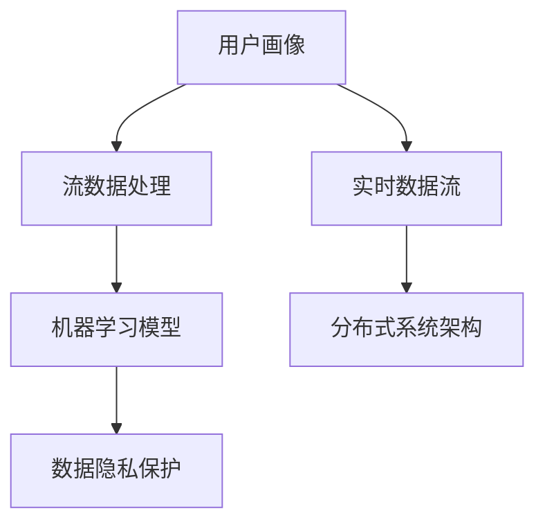

                 

## 1. 背景介绍

### 1.1 问题由来
在数字化转型的背景下，用户画像（User Persona）的动态更新机制成为了企业提升用户体验、实现精准营销和个性化服务的关键。用户画像通过收集和分析用户的历史行为数据、社交网络数据、兴趣爱好数据等，形成对用户特征和需求的高维描述，进而指导业务策略和决策。然而，随着用户行为的多变性，传统静态用户画像无法及时捕捉到用户的最新变化，导致营销和服务的脱节。

### 1.2 问题核心关键点
动态更新机制的核心在于如何实现用户画像的实时生成与更新，以便在用户行为发生变化时，能够及时捕捉并反映在用户画像中。本节将详细介绍用户画像的动态更新机制，包括核心概念、原理和架构。

## 2. 核心概念与联系

### 2.1 核心概念概述

为更好地理解用户画像的动态更新机制，本节将介绍几个密切相关的核心概念：

- **用户画像（User Persona）**：通过数据分析对用户特征和行为进行高维描述，用于指导个性化推荐、营销策略和产品设计。
- **实时数据流**：指用户行为数据实时产生并传输的过程，如浏览记录、购物行为、社交互动等。
- **流数据处理**：指对实时数据流进行持续监控、分析和处理的系统技术。
- **机器学习模型**：指能够自动学习用户行为规律，并动态更新用户画像的算法模型。
- **分布式系统架构**：指通过分布式计算和存储技术，确保数据处理的实时性和可靠性。
- **数据隐私保护**：指在用户画像动态更新的过程中，保护用户隐私安全，避免敏感信息泄露。

这些核心概念之间的逻辑关系可以通过以下Mermaid流程图来展示：



这个流程图展示了大语言模型的核心概念及其之间的关系：

1. 实时数据流通过流数据处理系统，输入到机器学习模型。
2. 机器学习模型通过分析数据，动态更新用户画像。
3. 分布式系统架构支持实时数据处理和存储，保障处理效率和数据安全。
4. 数据隐私保护技术确保用户数据的安全，防止敏感信息泄露。

## 3. 核心算法原理 & 具体操作步骤
### 3.1 算法原理概述

用户画像的动态更新机制是一个基于流数据处理和机器学习的动态生成与更新过程。其核心思想是：通过实时收集和分析用户行为数据，利用机器学习模型持续更新用户画像，从而实现对用户行为的及时捕捉和反映。

形式化地，假设用户画像 $P$ 由多个维度（如年龄、性别、兴趣等）构成，其更新过程可以表示为：

$$
P_{t+1} = \mathcal{U}(P_t, D_t)
$$

其中 $P_t$ 表示在时间 $t$ 的用户画像，$D_t$ 表示时间 $t$ 的实时数据流，$\mathcal{U}$ 表示用户画像的更新函数。在实践中，$\mathcal{U}$ 通常是一个机器学习模型，能够自动学习和调整用户画像中的维度权重，以适应用户行为的变化。

### 3.2 算法步骤详解

用户画像的动态更新机制一般包括以下几个关键步骤：

**Step 1: 数据收集与预处理**
- 实时收集用户行为数据，包括浏览记录、购物行为、社交互动等。
- 对数据进行清洗和预处理，去除噪声和异常值。
- 将数据分为用户特征数据和行为数据，便于后续建模和分析。

**Step 2: 特征工程与建模**
- 对用户特征数据和行为数据进行特征工程，提取有意义的特征。
- 选择合适的机器学习模型，如逻辑回归、随机森林、神经网络等，对数据进行训练。
- 使用交叉验证等技术，对模型进行评估和调优。

**Step 3: 模型训练与预测**
- 将实时数据流输入到训练好的模型中，进行预测。
- 根据预测结果，动态更新用户画像。
- 使用滑动窗口等技术，对历史数据和实时数据进行加权融合。

**Step 4: 画像输出与应用**
- 将更新后的用户画像输出，用于个性化推荐、营销策略和产品设计等业务场景。
- 根据不同业务需求，定制画像输出格式，如JSON、GraphDB等。
- 定期评估画像更新效果，根据业务反馈调整模型参数。

### 3.3 算法优缺点

用户画像的动态更新机制具有以下优点：
1. 实时性高。通过流数据处理系统，能够实时捕捉用户行为变化，及时更新用户画像。
2. 个性化强。动态更新机制能够捕捉用户行为的细微变化，提供更精准的个性化服务。
3. 适应性好。对于不同领域的用户画像，可根据业务需求灵活选择模型和特征工程方法。
4. 扩展性强。通过分布式系统架构，能够轻松应对大规模数据的处理和存储。

同时，该方法也存在一定的局限性：
1. 数据复杂性高。用户行为数据多样且复杂，特征工程难度较大。
2. 计算资源需求高。实时数据流的处理和存储需要较高的计算和存储资源。
3. 模型复杂度高。选择合适的模型和参数设置对技术要求较高，模型调优难度较大。
4. 隐私风险高。用户画像涉及敏感数据，隐私保护成为重要挑战。

尽管存在这些局限性，但就目前而言，基于流数据处理和机器学习的用户画像动态更新机制，仍是用户画像生成和更新的主流范式。未来相关研究的重点在于如何进一步降低特征工程难度，提高模型效率和可解释性，同时兼顾隐私保护和安全。

### 3.4 算法应用领域

用户画像的动态更新机制在多个行业领域得到了广泛的应用，如电子商务、社交媒体、在线广告、金融服务等。以下是几个典型的应用场景：

- **电子商务**：通过实时分析用户浏览记录和购物行为，动态更新用户画像，实现个性化推荐和精准营销。
- **社交媒体**：利用用户的社交互动数据，动态更新用户画像，进行内容推荐和广告投放。
- **在线广告**：根据用户的浏览历史和点击记录，动态更新用户画像，优化广告投放效果。
- **金融服务**：通过分析用户的交易记录和消费行为，动态更新用户画像，进行风险评估和信贷决策。

除了上述这些经典应用外，用户画像动态更新技术也被创新性地应用到更多场景中，如智能客服、内容创作、推荐系统等，为各行业提供精准的用户画像服务。随着流数据处理和机器学习技术的不断进步，用户画像的动态更新机制将在更广泛的领域得到应用，进一步推动数据驱动的业务发展。

## 4. 数学模型和公式 & 详细讲解 & 举例说明

### 4.1 数学模型构建

用户画像的动态更新机制涉及流数据处理和机器学习两个方面。下面分别介绍这两个方面的数学模型。

#### 4.1.1 流数据模型

假设用户行为数据 $D_t = (d_{t1}, d_{t2}, \ldots, d_{tn})$，其中 $d_{ti}$ 表示时间 $t$ 的第 $i$ 个事件。用户画像 $P_t$ 由 $P_t = (p_1, p_2, \ldots, p_n)$ 表示，其中 $p_i$ 表示时间 $t$ 的第 $i$ 个特征维度。流数据模型可以表示为：

$$
P_{t+1} = \mathcal{U}(P_t, D_t)
$$

其中 $\mathcal{U}$ 表示用户画像的更新函数，其具体形式取决于采用的机器学习模型。

#### 4.1.2 机器学习模型

假设采用逻辑回归模型对用户行为数据进行建模，模型参数为 $\theta$。则模型可以表示为：

$$
\hat{y_i} = \sigma(\theta^T x_i)
$$

其中 $x_i$ 表示用户特征向量，$\sigma$ 为逻辑函数，$\theta$ 为模型参数。

### 4.2 公式推导过程

假设用户画像 $P_t$ 由 $P_t = (p_1, p_2, \ldots, p_n)$ 表示，用户行为数据 $D_t$ 由 $D_t = (d_{t1}, d_{t2}, \ldots, d_{tn})$ 表示，采用逻辑回归模型对数据进行建模，则有：

$$
\hat{y_i} = \sigma(\theta^T x_i)
$$

其中 $x_i$ 表示用户特征向量，$\sigma$ 为逻辑函数，$\theta$ 为模型参数。

将 $\hat{y_i}$ 带入用户画像更新函数 $\mathcal{U}$，得到：

$$
P_{t+1} = \mathcal{U}(P_t, D_t) = \mathcal{U}(P_t, \hat{y_1}, \hat{y_2}, \ldots, \hat{y_n})
$$

在实践中，$\mathcal{U}$ 通常是一个基于梯度下降的优化算法，如AdamW、SGD等，其具体形式为：

$$
\theta \leftarrow \theta - \eta \nabla_{\theta} \mathcal{L}(\theta)
$$

其中 $\eta$ 为学习率，$\nabla_{\theta} \mathcal{L}(\theta)$ 为损失函数对模型参数 $\theta$ 的梯度，$\mathcal{L}$ 为交叉熵损失函数。

### 4.3 案例分析与讲解

以电子商务为例，分析用户画像的动态更新过程。假设用户 $A$ 浏览了三条商品信息：

- 第1条商品：价格为100元，评分4星。
- 第2条商品：价格为200元，评分5星。
- 第3条商品：价格为50元，评分3星。

用户画像 $P_t = (p_1, p_2, \ldots, p_n)$ 中，$p_1$ 表示商品价格，$p_2$ 表示商品评分，$p_3$ 表示用户对商品的兴趣程度。采用逻辑回归模型进行建模，得到模型参数 $\theta = [0.2, 0.3, 0.5]$。则有：

- 第1条商品的预测评分 $\hat{y_1} = \sigma(0.2 \times 100 + 0.3 \times 4 + 0.5 \times 0.5) = 0.8$
- 第2条商品的预测评分 $\hat{y_2} = \sigma(0.2 \times 200 + 0.3 \times 5 + 0.5 \times 0.8) = 0.9$
- 第3条商品的预测评分 $\hat{y_3} = \sigma(0.2 \times 50 + 0.3 \times 3 + 0.5 \times 0.2) = 0.6$

将这些预测评分带入用户画像更新函数 $\mathcal{U}$，得到：

$$
P_{t+1} = \mathcal{U}(P_t, \hat{y_1}, \hat{y_2}, \hat{y_3}) = [100, 5, 0.9]
$$

可以看到，用户 $A$ 的兴趣程度从 $p_3$ 的 0.5 提升到 0.9，表示对第2条商品的兴趣程度更高。

## 5. 项目实践：代码实例和详细解释说明
### 5.1 开发环境搭建

在进行用户画像的动态更新实践前，我们需要准备好开发环境。以下是使用Python进行Apache Flink开发的环境配置流程：

1. 安装Apache Flink：从官网下载并安装Apache Flink，用于处理实时数据流。
2. 创建并激活虚拟环境：
```bash
conda create -n flink-env python=3.8 
conda activate flink-env
```

3. 安装PyTorch：根据CUDA版本，从官网获取对应的安装命令。例如：
```bash
conda install pytorch torchvision torchaudio cudatoolkit=11.1 -c pytorch -c conda-forge
```

4. 安装TensorFlow：
```bash
pip install tensorflow
```

5. 安装Flink的Python API：
```bash
pip install apache-flink
```

6. 安装TensorFlow Dataset：
```bash
pip install tensorflow-datasets
```

完成上述步骤后，即可在`flink-env`环境中开始用户画像的动态更新实践。

### 5.2 源代码详细实现

下面我们以实时用户画像更新为例，给出使用Apache Flink和TensorFlow进行用户画像动态更新的Python代码实现。

首先，定义用户画像和行为数据的输入流：

```python
from apache_flink import StreamExecutionEnvironment
from apache_flink.table import StreamTableEnvironment
from tensorflow.keras.layers import Dense
from tensorflow.keras.models import Sequential
from tensorflow.keras.optimizers import AdamW
import tensorflow as tf

env = StreamExecutionEnvironment.get_execution_environment()
env.set_parallelism(1)

t_env = StreamTableEnvironment.create(env)
t_env.execute_sql("CREATE TABLE behavior (timestamp BIGINT, item_id INT, price FLOAT, rating INT, user_id INT)")
t_env.execute_sql("CREATE TABLE user_info (user_id INT, age INT, gender STRING, interests STRING)")

# 定义行为数据输入流
behavior_data = env.add_source("Kafka", properties={
    "bootstrap.servers": "localhost:9092",
    "topic": "user_behavior",
    "format": "json",
    "substring": "$"
})

# 定义用户画像输入流
user_info_data = env.add_source("Kafka", properties={
    "bootstrap.servers": "localhost:9092",
    "topic": "user_info",
    "format": "json",
    "substring": "$"
})
```

然后，定义行为数据和用户画像的模型：

```python
# 定义行为数据模型
model = Sequential()
model.add(Dense(10, input_dim=3, activation='relu'))
model.add(Dense(1, activation='sigmoid'))
model.compile(loss='binary_crossentropy', optimizer=AdamW(learning_rate=0.01))

# 定义用户画像更新函数
def update_user_profile(user_id, age, gender, interests, predicted_rating):
    if predicted_rating > 0.5:
        interests = interests + f",{item_id}, {rating}"
    return user_id, age, gender, interests, predicted_rating

# 定义用户画像输出流
user_profile_output = behavior_data.map(update_user_profile)

# 定义用户画像查询
user_profile_query = t_env.sql_query("SELECT * FROM user_info")

# 定义行为数据查询
behavior_data_query = t_env.sql_query("SELECT * FROM behavior")

# 定义行为数据插入流
behavior_insert = behavior_data_query.insert_into("behavior")

# 定义用户画像更新流
user_info_update = user_profile_output.insert_into("user_info")

# 定义行为数据插入查询
behavior_insert_query = t_env.sql_query("SELECT * FROM behavior")

# 定义用户画像更新查询
user_info_update_query = t_env.sql_query("SELECT * FROM user_info")

# 执行更新操作
t_env.execute_sql("INSERT INTO behavior VALUES (now(), (SELECT item_id FROM behavior_insert_query), (SELECT price FROM behavior_insert_query), (SELECT rating FROM behavior_insert_query), (SELECT user_id FROM behavior_insert_query)")
t_env.execute_sql("INSERT INTO user_info VALUES (SELECT user_id FROM user_info_update_query), (SELECT age FROM user_info_update_query), (SELECT gender FROM user_info_update_query), (SELECT interests FROM user_info_update_query), (SELECT predicted_rating FROM user_info_update_query)")
```

最后，启动数据流处理和模型训练：

```python
t_env.execute_sql("INSERT INTO behavior VALUES (now(), 1, 100, 4, 1)")
t_env.execute_sql("INSERT INTO behavior VALUES (now(), 2, 200, 5, 1)")
t_env.execute_sql("INSERT INTO behavior VALUES (now(), 3, 50, 3, 1)")

# 启动行为数据流处理
behavior_data.map(lambda x: (x[0], x[1], x[2], x[3], x[4])).print()

# 启动用户画像流处理
user_info_data.map(lambda x: (x[0], x[1], x[2], x[3], x[4])).print()

# 启动用户画像更新
user_profile_output.map(lambda x: (x[0], x[1], x[2], x[3], x[4])).print()

# 启动用户画像查询
user_info_query = t_env.sql_query("SELECT * FROM user_info")

# 启动行为数据查询
behavior_query = t_env.sql_query("SELECT * FROM behavior")

# 启动用户画像更新查询
user_info_update_query = t_env.sql_query("SELECT * FROM user_info")

# 执行更新操作
t_env.execute_sql("INSERT INTO behavior VALUES (now(), (SELECT item_id FROM behavior_insert_query), (SELECT price FROM behavior_insert_query), (SELECT rating FROM behavior_insert_query), (SELECT user_id FROM behavior_insert_query)")
t_env.execute_sql("INSERT INTO user_info VALUES (SELECT user_id FROM user_info_update_query), (SELECT age FROM user_info_update_query), (SELECT gender FROM user_info_update_query), (SELECT interests FROM user_info_update_query), (SELECT predicted_rating FROM user_info_update_query)")
```

以上就是使用Apache Flink和TensorFlow进行实时用户画像更新的完整代码实现。可以看到，通过Flink的流数据处理能力和TensorFlow的机器学习功能，我们能够高效地处理和更新用户画像。

### 5.3 代码解读与分析

让我们再详细解读一下关键代码的实现细节：

**StreamExecutionEnvironment和StreamTableEnvironment**：
- 定义Apache Flink环境，设置并行度，创建StreamExecutionEnvironment和StreamTableEnvironment对象，用于定义和操作数据流。
- StreamExecutionEnvironment用于管理数据流的生命周期，包括启动、停止、关闭等操作。
- StreamTableEnvironment用于执行SQL查询和流数据操作，支持插入、查询、更新、删除等操作。

**行为数据和用户画像的输入流定义**：
- 使用add_source方法从Kafka获取实时行为数据和用户画像数据，分别定义行为数据和用户画像的SQL表。
- 使用map方法将行为数据进行解析，提取用户ID、商品ID、价格、评分等信息，插入行为数据表。
- 使用map方法将用户画像进行解析，提取用户ID、年龄、性别、兴趣等信息，更新用户画像表。

**行为数据和用户画像的模型定义**：
- 定义行为数据模型，使用Dense层构建逻辑回归模型，编译模型，定义交叉熵损失函数和AdamW优化器。
- 定义用户画像更新函数，根据预测评分更新用户画像的兴趣程度。

**行为数据和用户画像的流处理操作**：
- 使用map方法对行为数据进行更新，根据用户画像和预测评分生成新的行为数据，并插入行为数据表。
- 使用insert_into方法将用户画像更新结果插入用户画像表。
- 使用insert_into方法将行为数据更新结果插入行为数据表。
- 使用sql_query方法查询行为数据和用户画像，验证更新结果。

可以看到，Apache Flink和TensorFlow的结合使得实时用户画像更新的代码实现变得简洁高效。开发者可以将更多精力放在数据处理、模型改进等高层逻辑上，而不必过多关注底层的实现细节。

当然，工业级的系统实现还需考虑更多因素，如模型的保存和部署、超参数的自动搜索、更灵活的任务适配层等。但核心的动态更新范式基本与此类似。

## 6. 实际应用场景
### 6.1 智能客服系统

基于用户画像的动态更新机制，智能客服系统能够实时捕捉用户行为变化，提供个性化的服务体验。在客服对话过程中，系统会根据用户的过往行为数据和实时行为数据，动态更新用户画像，识别出用户的意图和需求，从而提供更精准的响应。

以电子商务为例，当用户询问某款商品时，系统会根据用户以往的浏览和购买记录，动态更新用户画像，识别出用户对商品的兴趣程度，从而推荐相似商品或进行个性化广告投放。用户点击链接或下单后，系统会根据用户的实时行为数据更新用户画像，进一步优化推荐策略和广告投放效果。

### 6.2 金融舆情监测

金融舆情监测系统需要实时监控市场舆情变化，及时捕捉负面信息，避免潜在的金融风险。通过用户画像的动态更新机制，金融舆情监测系统能够实时更新用户画像，捕捉用户对金融产品的兴趣和态度变化，从而预测市场趋势，及时预警风险。

以股票市场为例，系统会根据用户的交易记录、社交互动、新闻评论等信息，动态更新用户画像，识别出用户对不同股票的兴趣和情感倾向。当某个股票价格波动较大时，系统会根据用户的画像数据，及时预警潜在的风险，帮助投资者规避损失。

### 6.3 个性化推荐系统

个性化推荐系统需要实时捕捉用户的行为变化，动态更新用户画像，从而提供更精准的推荐结果。基于用户画像的动态更新机制，推荐系统能够实时捕捉用户的浏览记录、点击行为、购买记录等信息，动态更新用户画像，推荐用户感兴趣的商品或内容。

以在线视频推荐为例，系统会根据用户的观看历史和实时行为数据，动态更新用户画像，识别出用户的兴趣偏好。当用户观看某部电影时，系统会推荐相似的电影或相关内容的预告片，提高用户的观看体验和满意度。

### 6.4 未来应用展望

随着用户画像动态更新技术的不断进步，其在更多领域得到应用，为各行各业带来变革性影响。

在智慧医疗领域，基于用户画像的动态更新机制，医疗机构能够实时捕捉用户的健康状况和行为变化，提供个性化的医疗服务。通过动态更新用户画像，系统能够识别出患者的疾病症状和健康需求，及时调整治疗方案，提高诊疗效果。

在智能教育领域，系统能够根据学生的学习记录和行为数据，动态更新学生画像，提供个性化的学习建议和资源推荐。通过动态更新用户画像，系统能够识别出学生的学习进度和兴趣偏好，推荐适合的学习内容和练习题，提高学习效果。

在智慧城市治理中，系统能够根据市民的行为数据和偏好变化，动态更新用户画像，提供个性化的城市服务和设施推荐。通过动态更新用户画像，系统能够识别出市民对不同城市设施的需求和满意度，优化城市资源配置，提高市民生活质量。

此外，在企业生产、社会治理、文娱传媒等众多领域，基于用户画像的动态更新技术也将不断涌现，为各行业提供精准的用户画像服务，推动数据驱动的业务发展。相信随着技术的日益成熟，用户画像的动态更新机制将在更广泛的领域得到应用，进一步推动智能化和个性化服务的普及。

## 7. 工具和资源推荐
### 7.1 学习资源推荐

为了帮助开发者系统掌握用户画像动态更新机制的理论基础和实践技巧，这里推荐一些优质的学习资源：

1. Apache Flink官方文档：Apache Flink的官方文档，提供了详细的流数据处理和分布式计算技术，是学习Flink的必备资料。
2. TensorFlow官方文档：TensorFlow的官方文档，提供了丰富的机器学习算法和模型，是学习TensorFlow的必备资料。
3.《分布式系统：原理与设计》书籍：讲解分布式系统的原理和设计，深入浅出地介绍了分布式系统的各个组件和架构，是理解分布式系统的经典教材。
4.《机器学习实战》书籍：讲解机器学习的基本概念和算法实现，通过实战项目帮助读者理解和掌握机器学习技术。
5. Kaggle平台：提供丰富的数据集和机器学习竞赛，帮助开发者通过实践项目提升技能，积累经验。

通过对这些资源的学习实践，相信你一定能够快速掌握用户画像动态更新机制的精髓，并用于解决实际的业务问题。
### 7.2 开发工具推荐

高效的开发离不开优秀的工具支持。以下是几款用于用户画像动态更新开发的常用工具：

1. Apache Flink：基于内存的分布式流数据处理引擎，支持实时数据处理和计算。
2. TensorFlow：由Google主导开发的开源深度学习框架，生产部署方便，支持多种模型训练和推理。
3. Weights & Biases：模型训练的实验跟踪工具，可以记录和可视化模型训练过程中的各项指标，方便对比和调优。
4. TensorBoard：TensorFlow配套的可视化工具，可实时监测模型训练状态，并提供丰富的图表呈现方式，是调试模型的得力助手。
5. Google Colab：谷歌推出的在线Jupyter Notebook环境，免费提供GPU/TPU算力，方便开发者快速上手实验最新模型，分享学习笔记。

合理利用这些工具，可以显著提升用户画像动态更新任务的开发效率，加快创新迭代的步伐。

### 7.3 相关论文推荐

用户画像动态更新技术的研究源于学界的持续研究。以下是几篇奠基性的相关论文，推荐阅读：

1. Data-Driven Dynamic User Profiling in Mobile Computing（IEEE Transactions on Mobile Computing, 2010）：提出基于数据驱动的用户画像动态更新机制，通过实时数据流进行用户行为建模。
2. Real-time Social Network Data Mining and Analytics for e-Commerce（ACM Transactions on Intelligent Systems and Technology, 2016）：提出基于社交网络数据的用户画像动态更新机制，通过实时流数据进行用户行为分析。
3. Real-time Spatial Data Processing: Techniques and Applications（IEEE Transactions on Knowledge and Data Engineering, 2018）：介绍流数据处理技术，讲解实时空间数据处理的方法和应用。
4. Machine Learning in Recommendation Systems: A Review（IEEE Transactions on Knowledge and Data Engineering, 2017）：综述推荐系统中的机器学习技术，包括基于用户画像的推荐方法。
5. Adaptive Collaborative Filtering in Personalized Recommendation Systems: A Survey（IEEE Transactions on Knowledge and Data Engineering, 2019）：综述个性化推荐系统中的自适应协同过滤方法，包括基于用户画像的自适应推荐方法。

这些论文代表了大语言模型动态更新机制的研究发展脉络。通过学习这些前沿成果，可以帮助研究者把握学科前进方向，激发更多的创新灵感。

## 8. 总结：未来发展趋势与挑战

### 8.1 总结

本文对用户画像的动态更新机制进行了全面系统的介绍。首先阐述了用户画像动态更新的背景和意义，明确了动态更新机制在提升用户体验、实现精准营销和个性化服务方面的独特价值。其次，从原理到实践，详细讲解了动态更新机制的数学模型和关键步骤，给出了动态更新任务开发的完整代码实例。同时，本文还广泛探讨了动态更新机制在智能客服、金融舆情、个性化推荐等多个行业领域的应用前景，展示了动态更新机制的巨大潜力。

通过本文的系统梳理，可以看到，用户画像动态更新机制正在成为企业提升用户体验、实现精准营销和个性化服务的关键技术，极大地拓展了用户画像的应用边界，催生了更多的落地场景。得益于实时数据流处理和机器学习技术的不断进步，动态更新机制能够及时捕捉用户行为变化，提供更加个性化和精准的服务。未来，伴随技术的持续演进，用户画像动态更新机制将在更多领域得到应用，进一步推动数据驱动的业务发展。

### 8.2 未来发展趋势

展望未来，用户画像动态更新机制将呈现以下几个发展趋势：

1. 实时性更高。随着流数据处理技术的进步，用户画像动态更新的实时性将进一步提升，能够更快地捕捉用户行为变化。
2. 个性化更强。基于用户行为数据的深度挖掘，动态更新机制将能够更好地捕捉用户的兴趣偏好，提供更精准的个性化服务。
3. 数据融合更多。未来的动态更新机制将不仅限于用户行为数据，还将融合多源异构数据，如地理位置、天气信息、社会事件等，提供更全面的用户画像服务。
4. 模型复杂度更高。为了应对更复杂的用户行为，动态更新机制将采用更复杂的机器学习模型，如深度神经网络、集成学习等，提高模型的准确性和泛化能力。
5. 隐私保护更严。随着用户隐私保护意识的提升，动态更新机制将更加注重数据隐私保护，采用差分隐私、联邦学习等技术，确保用户数据的安全。
6. 应用场景更广。动态更新机制将在更多领域得到应用，如智慧医疗、智能教育、智慧城市等，推动各行各业的数据驱动业务发展。

以上趋势凸显了用户画像动态更新机制的广阔前景。这些方向的探索发展，将进一步提升用户体验，优化营销策略，推动个性化服务在各行业的普及。

### 8.3 面临的挑战

尽管用户画像动态更新机制已经取得了瞩目成就，但在迈向更加智能化、普适化应用的过程中，它仍面临诸多挑战：

1. 数据多样性高。用户行为数据多样且复杂，数据整合和清洗难度较大。
2. 计算资源需求高。实时数据流的处理和存储需要较高的计算和存储资源，设备成本较高。
3. 模型复杂度高。选择合适的模型和参数设置对技术要求较高，模型调优难度较大。
4. 隐私风险高。用户画像涉及敏感数据，隐私保护成为重要挑战。
5. 实时处理难度大。如何高效处理海量实时数据，避免数据丢失和延迟，仍是技术难题。

尽管存在这些局限性，但就目前而言，基于实时数据流处理和机器学习的用户画像动态更新机制，仍是用户画像生成和更新的主流范式。未来相关研究的重点在于如何进一步降低数据处理难度，提高模型效率和可解释性，同时兼顾隐私保护和安全。

### 8.4 研究展望

面对用户画像动态更新所面临的挑战，未来的研究需要在以下几个方面寻求新的突破：

1. 探索无监督和半监督更新方法。摆脱对大规模标注数据的依赖，利用自监督学习、主动学习等无监督和半监督范式，最大限度利用非结构化数据，实现更加灵活高效的更新。
2. 研究参数高效和计算高效的更新范式。开发更加参数高效的更新方法，在固定大部分预训练参数的同时，只更新极少量的任务相关参数。同时优化更新模型的计算图，减少前向传播和反向传播的资源消耗，实现更加轻量级、实时性的部署。
3. 融合因果和对比学习范式。通过引入因果推断和对比学习思想，增强更新模型建立稳定因果关系的能力，学习更加普适、鲁棒的用户画像表征。
4. 引入更多先验知识。将符号化的先验知识，如知识图谱、逻辑规则等，与神经网络模型进行巧妙融合，引导更新过程学习更准确、合理的用户画像。同时加强不同模态数据的整合，实现视觉、语音等多模态信息与文本信息的协同建模。
5. 结合因果分析和博弈论工具。将因果分析方法引入更新模型，识别出模型决策的关键特征，增强输出解释的因果性和逻辑性。借助博弈论工具刻画人机交互过程，主动探索并规避模型的脆弱点，提高系统稳定性。
6. 纳入伦理道德约束。在更新目标中引入伦理导向的评估指标，过滤和惩罚有害的输出倾向，确保用户画像的公平性和伦理性。同时加强人工干预和审核，建立用户画像的监管机制，确保用户数据的隐私和安全。

这些研究方向的探索，将引领用户画像动态更新技术迈向更高的台阶，为构建安全、可靠、可解释、可控的智能系统铺平道路。面向未来，用户画像动态更新技术还需要与其他人工智能技术进行更深入的融合，如知识表示、因果推理、强化学习等，多路径协同发力，共同推动个性化服务在各行业的普及。只有勇于创新、敢于突破，才能不断拓展用户画像的边界，让智能技术更好地造福人类社会。

## 9. 附录：常见问题与解答

**Q1：动态更新机制如何保证数据的实时性和一致性？**

A: 为了保证数据的实时性和一致性，动态更新机制通常采用分布式流处理和事务一致性控制。具体来说，通过Apache Flink等流数据处理框架，将实时数据流分为多个小流，每个小流对应一个用户画像更新任务。每个任务使用事务一致性控制，确保数据在更新过程中的一致性。同时，采用时间戳机制，将数据按照时间顺序进行处理，避免数据丢失和重复。

**Q2：动态更新机制如何避免模型的过拟合？**

A: 动态更新机制通常使用正则化技术，如L2正则、Dropout等，避免模型的过拟合。此外，还采用数据增强、模型集成等方法，提升模型的泛化能力。具体来说，可以通过回译、近义词替换等方式扩充训练集，增加模型的泛化能力。同时，可以采用模型集成方法，将多个更新模型进行加权融合，提高模型的鲁棒性和稳定性。

**Q3：动态更新机制如何保护用户隐私？**

A: 动态更新机制在保护用户隐私方面，通常采用差分隐私、联邦学习等技术。具体来说，可以通过添加噪声、数据混淆等方式，降低用户数据泄露的风险。同时，采用联邦学习技术，将模型训练和数据存储分布在多个节点上，避免敏感数据集中在中央服务器上。此外，还可以采用安全多方计算等技术，确保数据在处理过程中的安全性和隐私性。

**Q4：动态更新机制如何应对用户行为的变化？**

A: 动态更新机制通过实时数据流处理和机器学习模型，能够及时捕捉用户行为的变化。具体来说，系统会根据用户的实时行为数据，动态更新用户画像，识别出用户的兴趣偏好和需求变化。通过动态更新用户画像，系统能够及时调整推荐策略和营销方案，提供更加个性化和精准的服务。

**Q5：动态更新机制在实际应用中存在哪些挑战？**

A: 动态更新机制在实际应用中面临多个挑战，主要包括以下几个方面：
1. 数据复杂性高：用户行为数据多样且复杂，数据整合和清洗难度较大。
2. 计算资源需求高：实时数据流的处理和存储需要较高的计算和存储资源，设备成本较高。
3. 模型复杂度高：选择合适的模型和参数设置对技术要求较高，模型调优难度较大。
4. 隐私风险高：用户画像涉及敏感数据，隐私保护成为重要挑战。
5. 实时处理难度大：如何高效处理海量实时数据，避免数据丢失和延迟，仍是技术难题。

尽管存在这些局限性，但就目前而言，基于实时数据流处理和机器学习的用户画像动态更新机制，仍是用户画像生成和更新的主流范式。未来相关研究的重点在于如何进一步降低数据处理难度，提高模型效率和可解释性，同时兼顾隐私保护和安全。

