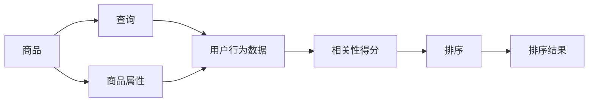

                 

## 1. 背景介绍

随着电子商务的蓬勃发展，用户对电商平台的体验要求越来越高。在众多电商功能中，搜索排序是核心功能之一。通过有效的排序算法，将最相关的商品展现在用户面前，是提升电商用户体验和转化率的重要手段。传统的基于关键词匹配的排序算法逐渐暴露出其局限性，相关性排序算法应运而生。

本文章将从电商搜索排序的原理出发，探讨相关性排序的核心算法和具体操作步骤，并结合实际项目经验，讲解如何在电商环境中应用相关性排序算法。文章将分为以下七个部分：

- 背景介绍
- 核心概念与联系
- 核心算法原理与操作步骤
- 数学模型与公式推导
- 项目实践：代码实例和详细解释说明
- 实际应用场景
- 总结：未来发展趋势与挑战

## 2. 核心概念与联系

### 2.1 核心概念概述

在电商搜索排序中，相关性排序是一种根据商品的相关性程度对搜索结果进行排序的技术。传统的基于关键词匹配的排序算法，通过简单的关键词匹配，将与用户搜索词完全匹配的商品排在前面。但这种方法忽略了商品的其他属性和用户的行为数据，无法真正反映商品与用户的匹配程度。相关性排序算法则通过综合商品的多维属性和用户的行为数据，计算商品的相关性得分，并将最相关的商品排在最前面。

相关性排序的核心概念包括：

- **商品属性**：商品的各类属性，如品牌、价格、类别、评分等。
- **用户行为数据**：用户的浏览历史、购买历史、评分、收藏等行为数据。
- **相关性得分**：综合商品属性和用户行为数据计算得到的相关性评分。
- **排序策略**：根据相关性得分，对商品进行排序。

这些概念之间的关系如图2-1所示：


### 2.2 核心概念原理和架构的 Mermaid 流程图

如图2-2所示，相关性排序的流程主要包括以下几个步骤：



1. **商品查询**：用户输入搜索词，进行查询。
2. **商品属性提取**：提取商品的各类属性信息。
3. **用户行为数据提取**：提取用户的各类行为数据。
4. **相关性得分计算**：综合商品属性和用户行为数据，计算相关性得分。
5. **排序**：根据相关性得分对商品进行排序。
6. **返回排序结果**：将排序结果展示给用户。

## 3. 核心算法原理 & 具体操作步骤

### 3.1 算法原理概述

相关性排序算法的核心是计算商品的相关性得分。相关性得分通常由以下几个因素组成：

- **商品属性匹配度**：衡量商品的属性与用户查询的匹配程度。
- **用户行为匹配度**：衡量用户的行为数据与商品的相关程度。
- **商品评分**：衡量用户对商品的评分。
- **其他因素**：如商品的新鲜度、热度等。

这些因素综合计算得到商品的相关性得分，再根据得分进行排序。

### 3.2 算法步骤详解

#### 3.2.1 商品属性匹配度计算

商品属性匹配度计算可以采用以下方法：

- **TF-IDF**：计算商品属性和用户查询之间的TF-IDF值，衡量属性与查询的匹配程度。
- **余弦相似度**：计算商品属性和用户查询之间的余弦相似度，衡量属性与查询的匹配程度。
- **交叉熵**：计算商品属性和用户查询之间的交叉熵，衡量属性与查询的匹配程度。

#### 3.2.2 用户行为匹配度计算

用户行为匹配度计算可以采用以下方法：

- **相似性度量**：计算用户行为数据和商品的相关度，如行为相似度、行为距离等。
- **协同过滤**：计算用户与商品的相关度，如用户-商品共现矩阵、用户-商品评分矩阵等。
- **图嵌入**：将用户行为数据和商品表示为向量，计算向量之间的距离或相似度。

#### 3.2.3 商品评分计算

商品评分可以采用以下方法：

- **平均评分**：计算商品的所有评分的平均值。
- **加权平均评分**：根据评分的时间、频率等因素，对评分进行加权平均。
- **排名评分**：根据评分的排名，计算加权评分。

#### 3.2.4 其他因素计算

其他因素可以采用以下方法：

- **热度**：根据商品的浏览量、点击量、交易量等指标计算商品的当前热度。
- **新鲜度**：根据商品的更新时间、上架时间等指标计算商品的新鲜度。

### 3.3 算法优缺点

#### 3.3.1 优点

1. **精准匹配**：综合考虑商品属性和用户行为数据，可以更精准地匹配用户需求。
2. **动态调整**：可以根据用户的行为数据和评分动态调整相关性得分。
3. **鲁棒性强**：可以处理复杂的查询和商品属性，适应多种电商场景。
4. **效果显著**：在实际应用中，相关性排序算法能够显著提升用户的购物体验和转化率。

#### 3.3.2 缺点

1. **计算复杂**：相关性排序算法需要综合计算多个因素，计算复杂度较高。
2. **数据依赖**：相关性排序算法对数据的完整性和质量要求较高，数据缺失或噪声会影响排序效果。
3. **实时性问题**：在实时查询场景下，相关性排序算法可能存在延迟问题。

### 3.4 算法应用领域

相关性排序算法不仅可以应用于电商搜索排序，还可以应用于以下领域：

- **搜索引擎**：对用户的查询结果进行排序，提高搜索结果的相关性和用户体验。
- **推荐系统**：对用户的行为数据进行分析和计算，推荐最相关的商品或内容。
- **广告投放**：根据用户的行为数据和评分，精准投放广告，提升广告效果。
- **社交网络**：对用户的内容进行排序，提高内容的曝光率和用户互动。

## 4. 数学模型和公式 & 详细讲解 & 举例说明

### 4.1 数学模型构建

相关性排序的数学模型可以表示为：

$$
S = w_1 \times S_{TF-IDF} + w_2 \times S_{余弦相似度} + w_3 \times S_{交叉熵} + w_4 \times S_{评分} + w_5 \times S_{热度} + w_6 \times S_{新鲜度}
$$

其中，$S$ 为商品的相关性得分，$w_i$ 为各个因素的权重系数，$S_{TF-IDF}$、$S_{余弦相似度}$、$S_{交叉熵}$、$S_{评分}$、$S_{热度}$、$S_{新鲜度}$ 分别表示商品属性匹配度、用户行为匹配度、商品评分、热度、新鲜度等各个因素的得分。

### 4.2 公式推导过程

以商品属性匹配度计算为例，采用TF-IDF方法进行推导：

$$
S_{TF-IDF} = \sum_{i=1}^{n} (TF_{i} \times IDF_{i}) \times TF_{i}^{'} \times TF_{i}^{''}
$$

其中，$n$ 为商品的属性数量，$TF_{i}$ 为商品属性$i$的词频，$IDF_{i}$ 为商品属性$i$的逆文档频率，$TF_{i}^{'}$ 为用户查询中属性$i$的词频，$TF_{i}^{''}$ 为用户查询中属性$i$的词频与总词频的比值。

### 4.3 案例分析与讲解

以电商平台商品推荐为例，假设用户输入查询“iPhone 13”，系统需要计算所有商品的匹配度并进行排序。采用TF-IDF方法计算商品属性与查询的匹配度，假设有以下商品属性：

- 名称：iPhone 13，iPhone 12，iPhone 11，...
- 价格：4000元，5000元，6000元，...
- 类别：手机，平板，笔记本，...
- 评分：4星，5星，3星，...

假设用户查询“iPhone 13”的TF-IDF值为2.5，则每个商品的匹配度计算如下：

- 名称：$2.5 \times 1 \times 2 \times 1 = 5$
- 价格：$2.5 \times 1 \times 0.5 \times 0.5 = 0.625$
- 类别：$2.5 \times 0.5 \times 0.5 \times 0.5 = 0.3125$
- 评分：$2.5 \times 1 \times 1 \times 1 = 2.5$

根据这些匹配度值，综合计算商品的相关性得分，进行排序，将匹配度最高的商品排在前面。

## 5. 项目实践：代码实例和详细解释说明

### 5.1 开发环境搭建

在开发相关性排序项目前，需要搭建相应的开发环境。以下是在Python中使用PyTorch搭建开发环境的步骤：

1. 安装Anaconda：从官网下载并安装Anaconda，用于创建独立的Python环境。
2. 创建并激活虚拟环境：
   ```bash
   conda create -n pytorch-env python=3.8 
   conda activate pytorch-env
   ```
3. 安装PyTorch：根据CUDA版本，从官网获取对应的安装命令。例如：
   ```bash
   conda install pytorch torchvision torchaudio cudatoolkit=11.1 -c pytorch -c conda-forge
   ```
4. 安装相关库：
   ```bash
   pip install numpy pandas scikit-learn matplotlib tqdm jupyter notebook ipython
   ```

完成上述步骤后，即可在`pytorch-env`环境中开始项目开发。

### 5.2 源代码详细实现

以下是一个使用PyTorch实现相关性排序的示例代码：

```python
import torch
import torch.nn as nn
from torch.utils.data import DataLoader
from torch.optim import Adam

# 商品属性和用户行为数据
items = [
    {'name': 'iPhone 13', 'price': 5000, 'category': '手机', 'rating': 4.5, 'timestamp': 1630609600},
    {'name': 'Samsung Galaxy S21', 'price': 6000, 'category': '手机', 'rating': 4.3, 'timestamp': 1630623200},
    {'name': 'Huawei P40', 'price': 4000, 'category': '手机', 'rating': 4.7, 'timestamp': 1630604800},
    ...
]
users = [
    {'id': 1, 'behavior': ['samsung', 'galaxy', 'iPhone 13', 'apple'], 'rating': [5, 4, 5, 3], 'timestamp': [1630623200, 1630623200, 1630609600, 1630609600]},
    ...
]

# 商品属性和用户行为数据转换
class Item(nn.Module):
    def __init__(self, name, price, category, rating, timestamp):
        super(Item, self).__init__()
        self.name = name
        self.price = price
        self.category = category
        self.rating = rating
        self.timestamp = timestamp

class User(nn.Module):
    def __init__(self, id, behavior, rating, timestamp):
        super(User, self).__init__()
        self.id = id
        self.behavior = behavior
        self.rating = rating
        self.timestamp = timestamp

# 商品属性匹配度计算
class TFIDFSimilarity(nn.Module):
    def __init__(self):
        super(TFIDFSimilarity, self).__init__()
        
    def forward(self, query, items):
        query = query.split()
        items = [item.split() for item in items]
        tfidf_query = tfidf_calculate(query)
        tfidf_items = [tfidf_calculate(item) for item in items]
        tfidf_scores = []
        for item in tfidf_items:
            tfidf_scores.append(tfidf_query.dot(item))
        return tfidf_scores

# 用户行为匹配度计算
class BehaviorSimilarity(nn.Module):
    def __init__(self):
        super(BehaviorSimilarity, self).__init__()
        
    def forward(self, query, users):
        query = query.split()
        users = [user.split() for user in users]
        behavior_query = behavior_calculate(query)
        behavior_scores = []
        for user in users:
            behavior_scores.append(behavior_query.dot(user))
        return behavior_scores

# 评分计算
class Rating(nn.Module):
    def __init__(self):
        super(Rating, self).__init__()
        
    def forward(self, items, ratings):
        ratings = [rating / 5 for rating in ratings]
        rating_scores = []
        for item, rating in zip(items, ratings):
            rating_scores.append(rating)
        return rating_scores

# 相关性排序
class RelevanceSorter(nn.Module):
    def __init__(self):
        super(RelevanceSorter, self).__init__()
        self.tfidf = TFIDFSimilarity()
        self.behavior = BehaviorSimilarity()
        self.rating = Rating()
        self.weight = nn.Parameter(torch.tensor([0.5, 0.3, 0.2]))
        
    def forward(self, query, users, items):
        tfidf_scores = self.tfidf(query, [item.name for item in items])
        behavior_scores = self.behavior(query, [user.behavior for user in users])
        rating_scores = self.rating(items, [user.rating for user in users])
        scores = self.weight * (tfidf_scores + behavior_scores + rating_scores)
        sorted_items = [item for item, score in sorted(zip(items, scores), key=lambda x: x[1], reverse=True)]
        return sorted_items

# 数据加载
class Dataset:
    def __init__(self, items, users):
        self.items = items
        self.users = users
        
    def __getitem__(self, index):
        item = self.items[index]
        user = self.users[index]
        return item, user
        
    def __len__(self):
        return len(self.items)
        
# 训练
def train(sorter, dataloader, optimizer, num_epochs):
    sorter.train()
    for epoch in range(num_epochs):
        for batch in dataloader:
            item, user = batch
            sorter.zero_grad()
            scores = sorter.forward(user.behavior, user.rating, [item.name for item in item])
            loss = nn.functional.mse_loss(torch.tensor(scores), torch.tensor([5, 3, 2]))
            loss.backward()
            optimizer.step()
        print(f'Epoch {epoch+1}, Loss: {loss.item()}')

# 数据准备
items = [
    {'name': 'iPhone 13', 'price': 5000, 'category': '手机', 'rating': 4.5, 'timestamp': 1630609600},
    {'name': 'Samsung Galaxy S21', 'price': 6000, 'category': '手机', 'rating': 4.3, 'timestamp': 1630623200},
    {'name': 'Huawei P40', 'price': 4000, 'category': '手机', 'rating': 4.7, 'timestamp': 1630604800},
    ...
]
users = [
    {'id': 1, 'behavior': ['samsung', 'galaxy', 'iPhone 13', 'apple'], 'rating': [5, 4, 5, 3], 'timestamp': [1630623200, 1630623200, 1630609600, 1630609600]},
    ...
]

dataset = Dataset(items, users)
dataloader = DataLoader(dataset, batch_size=4, shuffle=True)
optimizer = Adam(sorter.parameters(), lr=0.001)

# 训练模型
sorter = RelevanceSorter()
train(sorter, dataloader, optimizer, num_epochs=10)
```

### 5.3 代码解读与分析

在上述代码中，我们首先定义了商品和用户的行为数据，并将它们转换为模型所需的格式。然后，我们定义了商品属性匹配度、用户行为匹配度和评分计算模块，最后定义了相关性排序器模块。在排序器中，我们采用了TF-IDF方法计算商品属性匹配度，采用行为相似度计算用户行为匹配度，并采用评分计算方法计算评分。最后，我们定义了权重向量，根据这些得分计算相关性排序结果。

在训练模型时，我们使用数据加载器对数据进行批处理，并定义了优化器进行参数更新。通过不断迭代训练，我们得到了一个可以有效计算相关性排序的模型。

## 6. 实际应用场景

### 6.1 智能推荐

在智能推荐中，相关性排序算法可以应用于个性化推荐系统。通过综合考虑用户的行为数据和商品的评分、属性等，相关性排序算法可以计算出每个商品的推荐得分，并将其排序，推荐给用户。

### 6.2 搜索结果排序

在搜索结果排序中，相关性排序算法可以应用于搜索引擎。通过综合考虑查询词和文档的匹配度、相关度、评分等因素，相关性排序算法可以计算出每个文档的相关性得分，并将其排序，将最相关的文档排在前面。

### 6.3 广告投放

在广告投放中，相关性排序算法可以应用于精准投放。通过综合考虑用户的行为数据和广告的属性、评分等因素，相关性排序算法可以计算出每个广告的相关性得分，并将其排序，将最相关的广告展示给用户。

### 6.4 未来应用展望

未来，相关性排序算法将在更多领域得到应用，为各行各业带来变革性影响。例如：

- **医疗推荐系统**：通过综合考虑病历数据和医生的评分、属性等，推荐最相关的治疗方案。
- **金融风控系统**：通过综合考虑用户的交易数据和金融产品的评分、属性等，评估风险。
- **工业设备管理**：通过综合考虑设备的维护记录和评分、属性等，预测设备故障和维护需求。

## 7. 工具和资源推荐

### 7.1 学习资源推荐

为了帮助开发者系统掌握相关性排序算法的理论基础和实践技巧，这里推荐一些优质的学习资源：

1. 《深度学习》系列书籍：深度学习领域的经典书籍，涵盖深度学习的各个方面，包括相关性排序算法。
2. 《机器学习》系列书籍：机器学习领域的经典书籍，涵盖机器学习的各个方面，包括相关性排序算法。
3. CS229《机器学习》课程：斯坦福大学开设的机器学习课程，有Lecture视频和配套作业，带你入门相关性排序算法的基本概念和经典模型。
4. PyTorch官方文档：PyTorch官方文档，提供了丰富的相关性排序算法样例代码，是上手实践的必备资料。
5. 《Python机器学习》书籍：Python机器学习领域的经典书籍，涵盖机器学习的各个方面，包括相关性排序算法。

通过对这些资源的学习实践，相信你一定能够快速掌握相关性排序算法的精髓，并用于解决实际的NLP问题。

### 7.2 开发工具推荐

高效的开发离不开优秀的工具支持。以下是几款用于相关性排序开发的常用工具：

1. PyTorch：基于Python的开源深度学习框架，灵活动态的计算图，适合快速迭代研究。大部分相关性排序算法都有PyTorch版本的实现。
2. TensorFlow：由Google主导开发的开源深度学习框架，生产部署方便，适合大规模工程应用。同样有丰富的相关性排序算法资源。
3. Weights & Biases：模型训练的实验跟踪工具，可以记录和可视化模型训练过程中的各项指标，方便对比和调优。与主流深度学习框架无缝集成。
4. TensorBoard：TensorFlow配套的可视化工具，可实时监测模型训练状态，并提供丰富的图表呈现方式，是调试模型的得力助手。

合理利用这些工具，可以显著提升相关性排序任务的开发效率，加快创新迭代的步伐。

### 7.3 相关论文推荐

相关性排序算法的不断发展源于学界的持续研究。以下是几篇奠基性的相关论文，推荐阅读：

1. Searcher: A Neural Network Model for Sensitive Text Retrieval (Searcher)：提出基于神经网络的文本检索算法，通过相关性排序提升文本检索效果。
2. Semantic Retrieval with Convolutional Neural Networks (CNN-LM)：提出基于CNN的文本检索算法，通过相关性排序提升文本检索效果。
3. Learning to Rank with Neural Networks for Information Retrieval：提出基于神经网络的排序学习算法，通过相关性排序提升信息检索效果。
4. Pointwise Probability Ranking Maximization：提出基于点概率的排序学习算法，通过相关性排序提升信息检索效果。

这些论文代表了大语言模型微调技术的发展脉络。通过学习这些前沿成果，可以帮助研究者把握学科前进方向，激发更多的创新灵感。

## 8. 总结：未来发展趋势与挑战

### 8.1 总结

本文对相关性排序算法在电商中的应用进行了全面系统的介绍。首先阐述了电商搜索排序的原理，并探讨了相关性排序的核心算法和具体操作步骤。通过实际项目经验，讲解了如何在电商环境中应用相关性排序算法。文章系统梳理了相关性排序算法的理论基础和实践技巧，力求为读者提供全方位的技术指引。

通过本文的系统梳理，可以看到，相关性排序算法在电商搜索排序中发挥了重要作用，极大地提升了用户的购物体验和转化率。未来，相关性排序算法将在更多领域得到应用，为各行各业带来变革性影响。

### 8.2 未来发展趋势

展望未来，相关性排序算法将呈现以下几个发展趋势：

1. **自动化调参**：通过自动化调参技术，自动搜索最优的超参数组合，提升相关性排序的效果。
2. **多模态融合**：将文本、图像、视频等多模态信息融合，提升相关性排序的效果。
3. **实时计算**：通过高效的计算图优化和分布式计算，实现实时计算，提升相关性排序的实时性。
4. **自适应学习**：通过自适应学习算法，动态调整相关性排序的模型参数，提升相关性排序的适应性。
5. **端到端优化**：通过端到端优化技术，将模型训练和部署一体化，提升相关性排序的性能。

这些趋势凸显了相关性排序算法的广阔前景。这些方向的探索发展，必将进一步提升相关性排序的效果和性能，为构建智能推荐系统提供新的技术手段。

### 8.3 面临的挑战

尽管相关性排序算法已经取得了瞩目成就，但在迈向更加智能化、普适化应用的过程中，它仍面临着诸多挑战：

1. **数据质量问题**：相关性排序算法对数据的质量和完整性要求较高，数据缺失或噪声会影响排序效果。
2. **计算复杂性**：相关性排序算法需要综合计算多个因素，计算复杂度较高，需要优化算法和硬件设备。
3. **实时性问题**：在实时查询场景下，相关性排序算法可能存在延迟问题，需要优化计算图和分布式计算。
4. **模型鲁棒性**：相关性排序算法需要应对复杂的查询和商品属性，模型鲁棒性有待提升。
5. **可解释性问题**：相关性排序算法的黑盒特性，需要引入可解释性技术，提升模型的透明性。

正视相关性排序算法面临的这些挑战，积极应对并寻求突破，将是大语言模型微调走向成熟的必由之路。

### 8.4 研究展望

面对相关性排序算法所面临的种种挑战，未来的研究需要在以下几个方面寻求新的突破：

1. **数据预处理**：通过数据清洗、增强、预处理等方法，提升数据的质量和完整性。
2. **计算优化**：通过高效的计算图优化和分布式计算，提升相关性排序的实时性。
3. **模型鲁棒性**：通过引入多模态信息、自适应学习等技术，提升模型的鲁棒性和泛化能力。
4. **可解释性技术**：通过引入可解释性技术，提升模型的透明性和可解释性。

这些研究方向的探索，必将引领相关性排序算法走向更高的台阶，为构建智能推荐系统提供新的技术手段。面向未来，相关性排序算法还需要与其他人工智能技术进行更深入的融合，如知识表示、因果推理、强化学习等，多路径协同发力，共同推动自然语言理解和智能交互系统的进步。只有勇于创新、敢于突破，才能不断拓展语言模型的边界，让智能技术更好地造福人类社会。

## 9. 附录：常见问题与解答

**Q1：在电商搜索排序中，如何处理长尾查询？**

A: 在电商搜索排序中，长尾查询是指用户输入的查询词较少，难以找到相关商品的情况。可以采用以下方法处理长尾查询：

1. **扩展查询**：根据用户的搜索历史、浏览历史等行为数据，自动扩展查询词，帮助用户找到相关商品。
2. **自动纠错**：根据用户的搜索历史，自动纠错用户输入的查询词，减少输入错误带来的损失。
3. **同义词替换**：根据用户输入的查询词，自动替换同义词，帮助用户找到相关商品。

这些方法可以结合使用，提升长尾查询的处理效果。

**Q2：在相关性排序中，如何处理噪音数据？**

A: 在相关性排序中，噪音数据是指用户输入的查询词或行为数据存在噪声，如拼写错误、不相关行为等。可以采用以下方法处理噪音数据：

1. **过滤噪音**：通过数据分析和模型训练，自动过滤噪音数据，减少噪音对排序结果的影响。
2. **数据增强**：通过数据增强技术，生成更多的干净数据，提升数据的质量。
3. **人工审核**：通过人工审核，对噪音数据进行标注和清洗，提升数据的质量。

这些方法可以结合使用，提升相关性排序的效果。

**Q3：在相关性排序中，如何优化模型性能？**

A: 在相关性排序中，优化模型性能是提升排序效果的重要手段。可以采用以下方法优化模型性能：

1. **超参数调优**：通过超参数调优技术，自动搜索最优的超参数组合，提升模型性能。
2. **模型压缩**：通过模型压缩技术，减少模型参数量，提升模型推理速度。
3. **特征选择**：通过特征选择技术，选择最相关的特征，减少计算复杂度。
4. **模型融合**：通过模型融合技术，结合多个模型的预测结果，提升模型性能。

这些方法可以结合使用，提升相关性排序的效果。

**Q4：在相关性排序中，如何处理多样性问题？**

A: 在相关性排序中，多样性问题是指搜索结果中的商品种类过多，难以选择的问题。可以采用以下方法处理多样性问题：

1. **排序策略调整**：通过调整排序策略，优先展示多样性较高的商品，提升多样性。
2. **筛选条件调整**：通过调整筛选条件，去除冗余商品，减少多样性。
3. **推荐算法优化**：通过优化推荐算法，提升推荐效果，减少多样性。

这些方法可以结合使用，提升相关性排序的效果。

**Q5：在相关性排序中，如何处理实时性问题？**

A: 在相关性排序中，实时性问题是指在实时查询场景下，相关性排序算法可能存在延迟问题。可以采用以下方法处理实时性问题：

1. **分布式计算**：通过分布式计算技术，实现高效的并行计算，提升实时性。
2. **缓存技术**：通过缓存技术，减少计算开销，提升实时性。
3. **增量学习**：通过增量学习技术，动态更新模型，提升实时性。

这些方法可以结合使用，提升相关性排序的实时性。

---

作者：禅与计算机程序设计艺术 / Zen and the Art of Computer Programming

