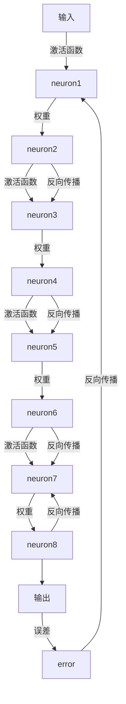

                 

# 神经网络：人工智能的基石

> 关键词：神经网络,深度学习,人工智能,机器学习,前向传播,反向传播,激活函数,损失函数,反向传播算法,深度神经网络,卷积神经网络,循环神经网络,深度学习框架,TensorFlow,PyTorch

## 1. 背景介绍

### 1.1 问题由来

人工智能(AI)是计算机科学的前沿领域，旨在构建能够模拟人类智能行为的计算机系统。自20世纪60年代以来，AI经历了多次发展高潮和低谷。1980年代初，基于符号主义的知识表示和推理成为主流，但受限于专家系统知识获取的困难。进入21世纪，随着深度学习技术的突破，基于神经网络的模型成为AI发展的新引擎。

深度学习是机器学习的一个分支，通过多层次的非线性变换实现复杂的模式识别任务。其核心思想是通过大规模数据训练，学习特征表示和模型参数，使计算机具备学习能力。其中，神经网络是实现深度学习的基础，构建了端到端的模型框架，让机器能够自主学习数据规律，进行决策和预测。

神经网络在图像识别、语音识别、自然语言处理等诸多领域取得了巨大成功。例如，图像分类任务上，基于深度卷积神经网络(CNN)的方法已经超越了人类识别能力；自然语言处理中，基于循环神经网络(RNN)和Transformer模型的技术，让计算机能够理解、生成、翻译语言，提升了人机交互的自然性。

### 1.2 问题核心关键点

神经网络作为深度学习的重要组成部分，通过模拟人脑的神经元结构，实现了对复杂非线性映射的建模。其核心机制包括前向传播和反向传播算法，以及多种激活函数和损失函数。通过不断调整模型参数，使得神经网络能够逼近复杂函数，完成各种AI任务。

神经网络的核心问题包括以下几点：

- 如何设计有效的神经网络结构，以便高效地学习输入数据的特征表示？
- 如何确定合适的激活函数和损失函数，以优化模型的预测性能？
- 如何在训练过程中进行有效的反向传播算法，更新模型参数？
- 如何处理大规模训练数据，避免过拟合，提高模型泛化能力？
- 如何在实际应用中高效部署和优化神经网络模型？

这些问题的解决，直接关系到神经网络的性能和应用效果。

### 1.3 问题研究意义

研究神经网络不仅有助于提高AI技术的精度和效率，还能够为各类行业提供智能化解决方案，推动产业发展。例如，在医疗领域，基于神经网络的技术可以辅助医生进行疾病诊断和药物研发；在金融领域，神经网络可以帮助分析市场趋势，进行风险管理；在自动驾驶中，神经网络能够实现对环境的高效感知和决策。

此外，神经网络的研究还能够促进计算机科学的理论创新，提升机器学习的基础理论水平，为未来AI技术的突破提供基础支撑。

## 2. 核心概念与联系

### 2.1 核心概念概述

神经网络是一种由多个神经元组成的层次结构，每一层通过权值连接。其基本结构包括输入层、隐藏层和输出层。前向传播将输入数据通过神经网络传递到输出层，反向传播则通过调整模型参数，最小化预测值与真实值之间的误差。

**前向传播**：将输入数据从输入层逐步传递到输出层的过程。每层神经元通过权值和偏置，对输入数据进行加权求和和激活操作，得到该层的输出。

**反向传播**：利用输出误差反向传播，更新模型参数的过程。通过链式法则，将输出误差逐层传递，计算每层参数的梯度，并根据梯度方向调整参数值，以最小化预测误差。

**激活函数**：神经元激活的非线性函数。通过引入激活函数，神经网络可以逼近复杂非线性函数，增强模型表现力。常用的激活函数包括ReLU、Sigmoid、Tanh等。

**损失函数**：衡量模型预测值与真实值之间差异的函数。通过优化损失函数，使得模型预测值尽可能接近真实值。常用的损失函数包括均方误差、交叉熵等。

**反向传播算法**：利用反向传播原理，通过链式法则计算每层参数梯度，并根据梯度更新模型参数的算法。它是深度学习中最重要的算法之一，也是实现神经网络模型的关键。

**深度神经网络**：具有多个隐藏层的神经网络，能够处理更为复杂的特征表示。常用的深度神经网络包括卷积神经网络(CNN)、循环神经网络(RNN)、长短期记忆网络(LSTM)等。

### 2.2 核心概念联系

神经网络的核心概念通过前向传播和反向传播算法连接起来，构成了整个学习过程。以下通过Mermaid流程图展示神经网络的总体结构：



该图展示了单层神经网络的结构和反向传播过程。输入数据通过前向传播传递到输出层，输出误差通过反向传播逐层传递，更新模型参数。这种结构不断重复，实现了神经网络的训练和优化。

## 3. 核心算法原理 & 具体操作步骤
### 3.1 算法原理概述

神经网络的核心算法原理基于前向传播和反向传播。以下详细介绍其基本原理：

- **前向传播**：将输入数据从输入层逐步传递到输出层的过程。每层神经元通过权值和偏置，对输入数据进行加权求和和激活操作，得到该层的输出。
- **反向传播**：利用输出误差反向传播，更新模型参数的过程。通过链式法则，将输出误差逐层传递，计算每层参数的梯度，并根据梯度方向调整参数值，以最小化预测误差。

### 3.2 算法步骤详解

神经网络的训练过程包括前向传播和反向传播两个阶段，具体步骤如下：

1. **前向传播**：
   - 将输入数据 $x$ 传递到输入层，通过权重矩阵 $W$ 和偏置向量 $b$ 计算每层输出 $a$，公式为：
     \[
     a = \sigma(Wx + b)
     \]
   - 重复上述计算，直到输出层，得到最终输出 $\hat{y}$，其中 $\sigma$ 为激活函数。

2. **计算损失函数**：
   - 将 $\hat{y}$ 与真实标签 $y$ 计算损失函数 $L$，常用的损失函数包括均方误差、交叉熵等。

3. **反向传播**：
   - 从输出层开始，计算每层参数的梯度 $\frac{\partial L}{\partial w_i}$ 和 $\frac{\partial L}{\partial b_i}$，公式为：
     \[
     \frac{\partial L}{\partial w_i} = \frac{\partial L}{\partial a_i} \sigma'(Wa_i + b) \frac{\partial w_i}{\partial a_i}
     \]
     \[
     \frac{\partial L}{\partial b_i} = \frac{\partial L}{\partial a_i} \sigma'(Wa_i + b)
     \]
   - 逐层向后传递，更新模型参数 $w$ 和 $b$。

4. **迭代优化**：
   - 重复上述步骤，进行多次迭代，直至模型收敛。

### 3.3 算法优缺点

神经网络具有以下优点：

- 能够逼近任意复杂函数，适用于各类任务。
- 具有较强的泛化能力，可以通过大量数据进行训练，获得较好的性能。
- 利用反向传播算法，模型参数更新高效，收敛速度较快。

但同时也存在以下缺点：

- 需要大量的数据和计算资源，训练成本较高。
- 模型结构复杂，调试和维护较为困难。
- 存在过拟合风险，需要设计有效的正则化策略。

### 3.4 算法应用领域

神经网络在AI领域得到了广泛应用，涵盖以下几个主要方向：

- **计算机视觉**：通过卷积神经网络(CNN)进行图像识别、分类、分割等任务。
- **自然语言处理**：通过循环神经网络(RNN)、Transformer模型等进行语言理解、生成、翻译等任务。
- **语音识别**：通过卷积神经网络(CNN)、循环神经网络(RNN)等进行声音特征提取和语音识别。
- **机器人学**：通过神经网络进行感知、决策、控制等，构建智能机器人系统。
- **生物医学**：通过神经网络进行图像分析、疾病预测、药物研发等，辅助医疗诊断和治疗。

## 4. 数学模型和公式 & 详细讲解 & 举例说明
### 4.1 数学模型构建

神经网络的数学模型可以描述为：

\[
y = f(x; \theta)
\]

其中 $x$ 为输入，$y$ 为输出，$\theta$ 为模型参数。神经网络的参数包括权重矩阵 $W$ 和偏置向量 $b$。

### 4.2 公式推导过程

以下以单层神经网络为例，推导前向传播和反向传播的数学公式。

#### 前向传播
假设神经网络只有一层，输入 $x$ 和输出 $y$ 分别为：
\[
y = \sigma(Wx + b)
\]

其中 $\sigma$ 为激活函数，通常使用ReLU或Sigmoid。

#### 反向传播
假设损失函数为均方误差 $L(y, \hat{y}) = \frac{1}{2}(y - \hat{y})^2$，输出 $\hat{y}$ 和真实标签 $y$ 的误差为 $e$：
\[
e = y - \hat{y}
\]

通过链式法则，计算每层参数的梯度：
\[
\frac{\partial L}{\partial w_i} = \frac{\partial L}{\partial a_i} \sigma'(Wa_i + b) \frac{\partial w_i}{\partial a_i}
\]
\[
\frac{\partial L}{\partial b_i} = \frac{\partial L}{\partial a_i} \sigma'(Wa_i + b)
\]

其中 $\frac{\partial L}{\partial a_i}$ 为输出误差对输入的导数，$\sigma'$ 为激活函数的导数。

### 4.3 案例分析与讲解

以图像分类为例，使用卷积神经网络(CNN)进行训练。假设输入为28x28的图像，经过卷积层和池化层后，输出为100维的特征向量。将特征向量输入全连接层，得到10维的分类输出，通过Softmax激活函数得到概率分布，最后通过交叉熵损失函数进行优化。

#### 代码实现

以下是使用PyTorch实现CNN的代码示例：

```python
import torch
import torch.nn as nn
import torch.nn.functional as F

class CNN(nn.Module):
    def __init__(self):
        super(CNN, self).__init__()
        self.conv1 = nn.Conv2d(1, 16, 3)
        self.pool = nn.MaxPool2d(2)
        self.fc1 = nn.Linear(100, 10)
        
    def forward(self, x):
        x = F.relu(self.conv1(x))
        x = self.pool(x)
        x = F.relu(self.fc1(x))
        return F.softmax(x, dim=1)
```

该代码定义了一个简单的CNN模型，包含一个卷积层、池化层和全连接层。在训练过程中，通过反向传播算法更新模型参数，最小化损失函数。

## 5. 项目实践：代码实例和详细解释说明
### 5.1 开发环境搭建

神经网络的项目开发通常需要使用深度学习框架，如TensorFlow、PyTorch等。以下以PyTorch为例，介绍开发环境的搭建流程：

1. 安装Anaconda：从官网下载并安装Anaconda，用于创建独立的Python环境。

2. 创建并激活虚拟环境：
```bash
conda create -n pytorch-env python=3.8 
conda activate pytorch-env
```

3. 安装PyTorch：根据CUDA版本，从官网获取对应的安装命令。例如：
```bash
conda install pytorch torchvision torchaudio cudatoolkit=11.1 -c pytorch -c conda-forge
```

4. 安装PyTorch的可视化工具：
```bash
pip install torchsummary
```

5. 安装常用的数据集和数据预处理库：
```bash
pip install torchvision
```

6. 安装NLP相关的库：
```bash
pip install nltk spacy
```

完成上述步骤后，即可在`pytorch-env`环境中进行神经网络开发。

### 5.2 源代码详细实现

以下以手写数字识别为例，使用PyTorch实现一个简单的CNN模型。

```python
import torch
import torch.nn as nn
import torchvision
import torchvision.transforms as transforms
import torch.nn.functional as F

class CNN(nn.Module):
    def __init__(self):
        super(CNN, self).__init__()
        self.conv1 = nn.Conv2d(1, 16, 3)
        self.pool = nn.MaxPool2d(2)
        self.fc1 = nn.Linear(100, 10)
        
    def forward(self, x):
        x = F.relu(self.conv1(x))
        x = self.pool(x)
        x = F.relu(self.fc1(x))
        return F.softmax(x, dim=1)
```

在训练过程中，可以使用PyTorch的DataLoader对数据集进行批量化加载，同时使用优化器进行模型参数的更新。

```python
from torch.utils.data import DataLoader
import torch.optim as optim

train_dataset = torchvision.datasets.MNIST(root='./data', train=True, transform=transforms.ToTensor(), download=True)
test_dataset = torchvision.datasets.MNIST(root='./data', train=False, transform=transforms.ToTensor(), download=True)

train_loader = DataLoader(train_dataset, batch_size=64, shuffle=True)
test_loader = DataLoader(test_dataset, batch_size=64, shuffle=False)

model = CNN()
optimizer = optim.Adam(model.parameters(), lr=0.001)
criterion = nn.CrossEntropyLoss()

for epoch in range(10):
    running_loss = 0.0
    for i, data in enumerate(train_loader, 0):
        inputs, labels = data
        optimizer.zero_grad()
        outputs = model(inputs)
        loss = criterion(outputs, labels)
        loss.backward()
        optimizer.step()
        running_loss += loss.item()
        if i % 100 == 99:
            print(f'Epoch [{epoch+1}/{10}], loss: {running_loss/100:.4f}')

print('Finished Training')
```

在训练结束后，可以使用PyTorch的Summary功能，对模型结构进行可视化：

```python
from torchsummary import summary

summary(model, (1, 28, 28))
```

## 6. 实际应用场景
### 6.1 图像识别

图像识别是神经网络的重要应用场景之一。通过卷积神经网络(CNN)，神经网络可以自动学习图像特征，进行分类、检测、分割等任务。

在实践中，可以使用CNN对各种图像数据进行标注，然后在训练集上训练模型，最终在测试集上进行预测。例如，可以使用CNN对医疗图像进行肿瘤检测，对食品图像进行分类，对卫星图像进行目标识别。

### 6.2 语音识别

语音识别是神经网络在语音领域的重要应用。通过卷积神经网络(CNN)和循环神经网络(RNN)，神经网络可以自动学习语音特征，进行语音识别、情感分析等任务。

在实践中，可以使用CNN对语音信号进行特征提取，然后通过RNN进行序列建模，最后使用分类器进行识别。例如，可以使用RNN对语音命令进行识别，使用CNN对语音情感进行分析。

### 6.3 自然语言处理

自然语言处理(NLP)是神经网络在文本领域的重要应用。通过循环神经网络(RNN)和Transformer模型，神经网络可以自动学习语言特征，进行语言理解、生成、翻译等任务。

在实践中，可以使用RNN或Transformer模型对文本进行标注，然后在训练集上训练模型，最终在测试集上进行预测。例如，可以使用RNN对文本进行情感分析，使用Transformer模型进行机器翻译，使用CNN对文本进行分类。

## 7. 工具和资源推荐
### 7.1 学习资源推荐

为了帮助开发者系统掌握神经网络的理论基础和实践技巧，这里推荐一些优质的学习资源：

1. 《深度学习》系列书籍：由深度学习专家Ian Goodfellow、Yoshua Bengio、Aaron Courville合著，系统介绍了深度学习的基本原理和应用。

2. CS231n《卷积神经网络》课程：斯坦福大学开设的计算机视觉课程，有Lecture视频和配套作业，带你入门卷积神经网络的设计和实现。

3. CS224n《序列建模》课程：斯坦福大学开设的自然语言处理课程，有Lecture视频和配套作业，带你了解序列建模的基本方法。

4. 《动手学深度学习》在线书籍：由李沐等人合著，提供丰富的代码实现和实验讲解，适合实战学习。

5. 《Deep Learning with PyTorch》在线书籍：由Alban Desmaison等人合著，深入浅出地介绍了使用PyTorch进行深度学习的全流程。

通过对这些资源的学习实践，相信你一定能够快速掌握神经网络的设计和实现，并在实际应用中取得良好效果。

### 7.2 开发工具推荐

高效的开发离不开优秀的工具支持。以下是几款用于神经网络开发的常用工具：

1. PyTorch：基于Python的开源深度学习框架，灵活动态的计算图，适合快速迭代研究。大量神经网络模型有PyTorch版本的实现。

2. TensorFlow：由Google主导开发的开源深度学习框架，生产部署方便，适合大规模工程应用。提供丰富的神经网络模型资源。

3. Keras：基于TensorFlow的高级神经网络API，使用简单，适合快速原型设计和实验验证。

4. MXNet：由Apache开发的深度学习框架，支持多种编程语言和分布式训练，适合大规模分布式系统。

5. Theano：由蒙特利尔大学开发的深度学习框架，支持高效的GPU计算，适合学术研究。

合理利用这些工具，可以显著提升神经网络的开发效率，加快创新迭代的步伐。

### 7.3 相关论文推荐

神经网络的研究源于学界的持续探索，以下是几篇奠基性的相关论文，推荐阅读：

1. A Course in Deep Learning（深度学习入门）：Ian Goodfellow、Yoshua Bengio、Aaron Courville合著，系统介绍了深度学习的基本原理和应用。

2. ImageNet Classification with Deep Convolutional Neural Networks：Alex Krizhevsky、Ilya Sutskever、Geoffrey Hinton提出卷积神经网络(CNN)，取得了图像分类任务的SOTA。

3. Sequence to Sequence Learning with Neural Networks：Ilya Sutskever、Oriol Vinyals、Quoc V. Le提出序列到序列模型，推动了机器翻译等NLP任务的发展。

4. WaveNet：A Generative Model for Raw Audio（声音生成网络）：Dmitri V. Mettes、Geoffrey E. Hinton提出WaveNet，实现了高质量的语音生成。

5. Attention is All You Need（Transformer论文）：Ashish Vaswani等提出Transformer模型，推动了自然语言处理的突破。

这些论文代表了大神经网络的研究脉络，通过学习这些前沿成果，可以帮助研究者把握学科前进方向，激发更多的创新灵感。

## 8. 总结：未来发展趋势与挑战
### 8.1 研究成果总结

神经网络作为深度学习的重要组成部分，在AI领域得到了广泛应用，取得了显著的成果。近年来，基于神经网络的技术在图像识别、语音识别、自然语言处理等领域取得了突破性进展，广泛应用于智能系统、医疗、金融等行业。

### 8.2 未来发展趋势

展望未来，神经网络技术将呈现以下几个发展趋势：

1. 模型结构复杂化：随着神经网络的发展，模型结构将越来越复杂，包含更多的层次和参数。这将带来更高的精度和更强的表达能力。

2. 多模态融合：神经网络将越来越多地应用于多模态数据处理，如视觉、语音、文本等。通过融合不同模态的信息，神经网络可以更全面地理解现实世界，提升智能系统的表现。

3. 自适应学习：神经网络将具备更强的自适应学习能力，能够根据环境变化动态调整模型参数，保持性能稳定。

4. 混合优化器：神经网络将采用多种优化器相结合的方式，如Adam、SGD等，以提高训练效率和模型性能。

5. 分布式训练：随着数据规模的扩大，神经网络的训练将越来越多地采用分布式方式，以提高训练速度和模型容量。

6. 量子计算：神经网络将与量子计算相结合，实现更高效的计算和更强的表达能力。

以上趋势凸显了神经网络技术的广阔前景，这些方向的探索发展，必将进一步提升神经网络的性能和应用效果，为AI技术的突破提供强大支撑。

### 8.3 面临的挑战

尽管神经网络技术取得了诸多进展，但在应用过程中仍面临诸多挑战：

1. 模型规模大：大规模神经网络需要大量的计算资源，对算力、内存、存储等硬件要求较高。这限制了神经网络的实际应用。

2. 训练成本高：神经网络的训练需要大量的数据和计算资源，成本较高。如何降低训练成本，成为重要的研究方向。

3. 模型复杂性高：神经网络的复杂性较高，调试和维护较为困难。如何设计更简洁的模型结构，降低模型复杂性，成为重要的优化方向。

4. 泛化能力差：神经网络存在过拟合的风险，泛化能力较弱。如何设计有效的正则化策略，提升模型的泛化能力，成为重要的优化方向。

5. 计算效率低：神经网络的计算效率较低，推理速度慢，限制了实际应用。如何提高计算效率，优化模型结构，成为重要的优化方向。

6. 模型可解释性差：神经网络的“黑盒”特性，导致模型的决策过程难以解释。如何增强模型的可解释性，提升模型的透明性，成为重要的研究方向。

7. 数据隐私问题：神经网络需要大量的数据进行训练，如何保护数据隐私，确保数据安全，成为重要的研究方向。

8. 伦理道德问题：神经网络可能学习到有害、偏见的知识，如何消除模型偏见，确保模型的公平性和道德性，成为重要的研究方向。

### 8.4 研究展望

面对神经网络所面临的诸多挑战，未来的研究需要在以下几个方面寻求新的突破：

1. 设计更简洁的模型结构：通过网络剪枝、量化、压缩等技术，设计更简洁、高效、轻量级的神经网络模型。

2. 开发高效的优化算法：结合多种优化算法，设计高效的混合优化策略，提升神经网络的训练效率和模型性能。

3. 引入外部知识：将符号化的先验知识，如知识图谱、逻辑规则等，与神经网络模型进行融合，引导模型学习更准确、合理的语言模型。

4. 增强模型的可解释性：通过引入因果分析、逻辑推理等方法，增强神经网络模型的可解释性和透明性，提升模型的可信度。

5. 引入伦理道德约束：在神经网络的设计和训练过程中，引入伦理导向的评估指标，过滤和惩罚有害、偏见的输出倾向，确保模型的公平性和道德性。

6. 优化分布式训练：设计高效的分布式训练算法，提高神经网络的训练速度和模型容量，适应大规模数据的应用场景。

7. 探索量子计算：将神经网络与量子计算相结合，实现更高效的计算和更强的表达能力，推动神经网络的边界扩展。

这些研究方向的探索，必将引领神经网络技术迈向更高的台阶，为AI技术的突破提供强大的支撑。面向未来，神经网络技术还需要与其他人工智能技术进行更深入的融合，如知识表示、因果推理、强化学习等，多路径协同发力，共同推动自然语言理解和智能交互系统的进步。只有勇于创新、敢于突破，才能不断拓展神经网络的边界，让智能技术更好地造福人类社会。

## 9. 附录：常见问题与解答

**Q1：神经网络与传统机器学习模型的区别是什么？**

A: 神经网络与传统机器学习模型的最大区别在于其非线性建模能力。传统机器学习模型如线性回归、逻辑回归、SVM等，通常只能处理线性关系，难以处理复杂的多元非线性关系。而神经网络通过引入多个非线性变换层，可以逼近任意复杂函数，适应各种复杂的模式识别任务。

**Q2：神经网络中激活函数的作用是什么？**

A: 激活函数是神经网络中的重要组成部分，通过引入非线性变换，使得神经网络可以逼近更复杂的非线性关系。常用的激活函数包括ReLU、Sigmoid、Tanh等，其中ReLU是最常用的激活函数，其输出具有零均值和正态分布的特征，能够加速模型的收敛。

**Q3：什么是过拟合，如何避免过拟合？**

A: 过拟合指的是模型在训练集上表现良好，但在测试集上表现较差的现象。过拟合通常出现在训练数据不足或模型复杂度过高的情况下。为了避免过拟合，可以采取以下措施：
1. 增加训练数据量，使用数据增强技术，扩大训练样本的多样性。
2. 使用正则化技术，如L1、L2正则、Dropout等，限制模型的复杂度。
3. 使用早停法(Early Stopping)，在验证集上监测模型性能，及时停止训练。
4. 使用模型剪枝、量化等技术，减少模型参数，降低过拟合风险。

**Q4：深度神经网络的优势是什么？**

A: 深度神经网络的主要优势包括：
1. 逼近复杂函数：通过多层非线性变换，深度神经网络能够逼近任意复杂函数，适应各种复杂的模式识别任务。
2. 自适应学习：深度神经网络可以通过大量数据进行训练，获得较少的样本即可取得较好的性能。
3. 特征提取：深度神经网络能够自动学习数据特征，无需手动提取特征，减少了人工干预的环节。
4. 泛化能力：深度神经网络具备较强的泛化能力，能够适应不同的数据分布和应用场景。
5. 高精度：深度神经网络在许多任务上取得了SOTA表现，如图像分类、语音识别、自然语言处理等。

这些优势使得深度神经网络在AI领域具有广泛的应用前景。

