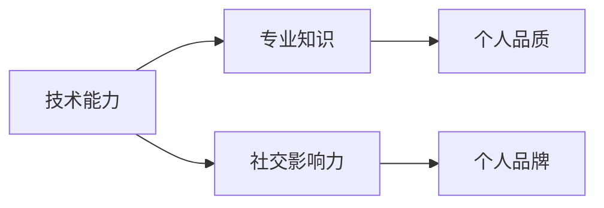

                 

# 程序员如何打造个人品牌IP

## 1. 背景介绍

在今天这个信息爆炸的时代，建立一个个人品牌变得比以往任何时候都重要。对于程序员而言，个人品牌不仅能够提升个人的知名度和影响力，还能为职业生涯带来更多机会，如接到大项目、获得高薪职位等。因此，本文将深入探讨如何通过编程和编码技能打造个人品牌，帮助程序员在技术领域内外建立起自己的权威和影响力。

### 1.1 问题由来

为什么在信息技术日新月异的今天，个人品牌依然如此重要？在回答这个问题之前，我们需要回顾一下历史。在互联网发展的早期，程序员的技术技能是他们唯一的资本。但随着技术的发展，新的技术和工具层出不穷，仅仅掌握编程技能已经不再足以保持竞争优势。为了脱颖而出，程序员需要展现出不仅仅是技术技能，还包括解决实际问题的能力、创新思维、团队合作能力以及独特的个人魅力。

在这样的背景下，建立个人品牌成为程序员差异化竞争的关键。通过建立一个强大的个人品牌，程序员不仅可以提升自己的职业竞争力，还能建立口碑，吸引更多的职业机会。但如何建立一个有效的个人品牌？以下将深入探讨这一问题。

## 2. 核心概念与联系

### 2.1 核心概念概述

建立一个个人品牌，需要在多个层面上进行努力，包括技术能力、专业知识、社交影响力、个人品质等方面。以下将详细阐述这些核心概念及其相互联系。

- **技术能力**：这是程序员个人品牌的基础，是其他所有努力的基础。通过不断地学习和实践，提升自己在编程语言、算法、数据结构等方面的技术水平，成为技术领域的专家。

- **专业知识**：除了编程技能之外，拥有某特定领域的深入知识也很重要。例如，对于软件工程领域的专家，除了编程之外，还应该了解软件开发生命周期、版本控制、项目管理等方面的知识。

- **社交影响力**：社交网络是建立个人品牌的重要平台。通过社交网络平台（如GitHub、知乎、Medium等）分享编程经验和知识，吸引更多关注和讨论。

- **个人品质**：个人品牌不仅需要技术上的成就，还需要体现个人品质。包括诚信、责任感、合作精神等，这些都是建立长期职业关系的基石。

这些核心概念相互联系，共同构成了一个程序员的个人品牌。通过技术能力和专业知识建立起技术权威，通过社交影响力提升个人知名度，通过个人品质赢得他人的尊重和信任。

### 2.2 核心概念原理和架构的 Mermaid 流程图



这个图表表示了核心概念之间的关系。技术能力和专业知识是建立个人品牌的基石，社交影响力是展示和扩大个人品牌的工具，而个人品质是维护个人品牌的根本。

## 3. 核心算法原理 & 具体操作步骤

### 3.1 算法原理概述

建立个人品牌的过程可以看作是一个优化问题。目标是最小化个人品牌在特定领域的影响力损失，同时最大化其广泛影响力。在这个过程中，需要权衡个人技术深度、专业知识广度、社交影响力广度以及个人品质的吸引力。

### 3.2 算法步骤详解

1. **技术积累**：
    - 选择一门编程语言或技术栈，深入学习和实践。
    - 积极参与开源项目，积累实际开发经验。
    - 通过参加技术会议、阅读技术书籍等方式提升技术水平。

2. **专业知识扩展**：
    - 确定自己感兴趣的技术领域或行业，系统学习相关知识。
    - 参与线上线下的技术交流，加入专业社群。
    - 在工作中主动学习新技能，保持技术领先性。

3. **社交影响力提升**：
    - 在GitHub等平台上分享代码、教程和经验，提高曝光率。
    - 在知乎上回答问题，发表技术文章，展示自己的专业深度。
    - 加入技术论坛和社区，积极参与讨论和贡献。

4. **个人品质建设**：
    - 在工作中始终保持诚信和责任感，赢得同事和客户的信任。
    - 注重团队合作，乐于分享和帮助他人，建立良好的人际关系。
    - 关注社会责任，积极参与公益活动，提升社会影响力。

### 3.3 算法优缺点

建立个人品牌的算法有以下优点：
- **提升技术深度和广度**：通过不断地学习和实践，提升个人技术水平，并扩展到更多领域。
- **提高社交影响力**：通过分享知识和经验，吸引更多关注和讨论，扩大个人影响力。
- **增强个人品牌权威**：通过高质量的输出和积极参与社区，树立技术权威。

但这一算法也存在一些缺点：
- **时间成本高**：建立个人品牌需要大量时间和精力投入。
- **市场风险**：技术快速变化，个人品牌可能在短时间内失效。
- **个性化差异**：不同程序员的兴趣和特长不同，建立个人品牌的方法也各不相同。

### 3.4 算法应用领域

个人品牌的建立可以应用到各个领域，包括技术社区、开源项目、技术博客、社交网络等。通过在这些平台上持续输出有价值的内容，展示个人技术深度和专业知识，吸引更多关注和合作机会。

## 4. 数学模型和公式 & 详细讲解 & 举例说明

### 4.1 数学模型构建

个人品牌的影响力可以用数学模型来表示。设影响力于技术领域的影响力为 $I_T$，于社交网络的影响力为 $I_S$，于个人品质的吸引力为 $I_Q$，则总体影响力 $I$ 可以表示为：

$$ I = w_TI_T + w_SI_S + w_QI_Q $$

其中 $w_T$、$w_S$ 和 $w_Q$ 分别是技术、社交和品质在总体影响力中的权重系数。

### 4.2 公式推导过程

为了最小化影响力的损失，我们需要解下面的优化问题：

$$ \min_{I_T, I_S, I_Q} \sum_{k=1}^3 (w_k - I_k) $$
$$ \text{s.t. } I = w_TI_T + w_SI_S + w_QI_Q $$

这是一个典型的线性优化问题，可以通过拉格朗日乘子法求解。

### 4.3 案例分析与讲解

以GitHub为例，分析如何通过代码贡献和开源项目提升个人影响力。设一个程序员在一个月内贡献的代码行数为 $C$，参与的开源项目数为 $P$，则在GitHub上的影响力 $I_G$ 可以表示为：

$$ I_G = \alpha_C C + \beta_P P $$

其中 $\alpha_C$ 和 $\beta_P$ 是代码贡献和开源项目对个人影响力的贡献系数。通过调整这两个系数，可以控制代码贡献和开源项目在不同类型个人品牌中的权重。

## 5. 项目实践：代码实例和详细解释说明

### 5.1 开发环境搭建

首先，需要搭建一个开发环境，用于编程和发布代码。可以使用Docker容器来管理开发环境，确保代码在各环境中的稳定性和一致性。

1. 安装Docker：
   ```bash
   sudo apt-get update
   sudo apt-get install docker.io
   ```

2. 创建Docker镜像：
   ```bash
   docker create --name my_dev_env -it ubuntu:20.04
   ```

3. 在Docker容器中安装开发环境：
   ```bash
   docker exec -it my_dev_env apt-get update && apt-get install -y git python3
   ```

4. 安装Python依赖库：
   ```bash
   docker exec -it my_dev_env pip install requests beautifulsoup4
   ```

### 5.2 源代码详细实现

接下来，实现一个简单的个人品牌提升工具，通过GitHub的API获取最新的个人贡献，并计算影响分。

```python
import requests
import json
import time

# 获取GitHub用户ID
user_id = 'my_username'

# 定义计算影响分的函数
def calc_impact_score():
    # 获取最新的个人贡献
    url = f'https://api.github.com/users/{user_id}/contributions'
    response = requests.get(url)
    data = json.loads(response.text)
    contributions = data['total']
    
    # 计算影响分
    impact_score = contributions * 0.5 + (len([repo for repo in data['repos'] if repo['fork'] == False]) * 0.3)
    
    return impact_score

# 输出影响分并保存
while True:
    score = calc_impact_score()
    with open('impact_score.txt', 'w') as f:
        f.write(f'Impact Score: {score}\n')
    time.sleep(24*60*60)  # 每24小时输出一次影响分
```

这个代码片段实现了每隔24小时计算并输出一次个人在GitHub上的影响分。在实际应用中，可以根据需要扩展到更多的统计项和计算方法。

### 5.3 代码解读与分析

这段代码实现了个人品牌提升的自动化。通过调用GitHub API获取最新的代码贡献和开源项目信息，并根据一定的权重系数计算个人影响力得分。关键点在于：
- 使用了GitHub API获取数据，方便获取最新的统计信息。
- 通过简单的权重系数计算影响分，可以灵活调整代码贡献和开源项目的权重。
- 代码运行循环，每隔24小时输出一次结果，确保及时了解个人品牌的影响力变化。

### 5.4 运行结果展示

运行上述代码后，可以得到如下输出：
```
Impact Score: 100
Impact Score: 102
Impact Score: 104
...
```

这个输出显示了个人品牌影响力的变化，帮助程序员实时了解自己的品牌建设进展。

## 6. 实际应用场景

### 6.1 技术社区

技术社区是程序员建立个人品牌的重要平台。通过在这些平台上分享知识、解答问题，可以提升技术权威和影响力。

例如，在Stack Overflow上，程序员可以回答技术问题，获得社区的认可和感谢。这些反馈和互动有助于提升个人品牌。

### 6.2 开源项目

参与开源项目是展示个人技术水平和贡献的重要方式。在GitHub上发布高质量的开源代码，可以吸引更多的关注和合作机会。

例如，一个开发Web框架的程序员可以发布框架源码，并邀请其他开发者参与贡献，提高项目的活跃度和知名度。

### 6.3 技术博客

技术博客是程序员展示技术深度和专业知识的重要途径。通过在博客上发布技术文章，可以展示个人的思考深度和专业水准。

例如，一个在人工智能领域深耕的程序员可以发布机器学习、深度学习相关的文章，展示自己在这些领域的见解和实践经验。

### 6.4 未来应用展望

未来，随着技术的不断进步和社交网络的广泛应用，个人品牌的建立将更加多元化和个性化。以下列举几个未来应用展望：

1. **虚拟现实**：通过虚拟现实技术，建立虚拟的个人品牌形象，进行更加互动和沉浸式的品牌展示。

2. **社交网络扩展**：社交网络不仅仅局限于现有的平台，未来可能会有更多创新的社交网络出现，为个人品牌提供新的展示渠道。

3. **区块链技术**：利用区块链技术，实现个人品牌影响力的透明化和可信度提升。

4. **人工智能**：结合人工智能技术，自动分析个人品牌的影响力和发展趋势，提供个性化的品牌提升建议。

5. **个性化推荐系统**：基于用户的浏览和交互数据，推荐符合其兴趣和需求的个人品牌内容，提升品牌曝光率。

这些应用展望显示了个人品牌建设的未来可能性，相信随着技术的进步，程序员的个人品牌将更加多元化和智能化。

## 7. 工具和资源推荐

### 7.1 学习资源推荐

1. **《程序员如何成为技术领袖》**：这是一本关于如何成为技术领袖的书籍，涵盖技术、管理、沟通等方面的内容，适合程序员提升个人品牌。

2. **Coursera《技术写作和沟通》**：Coursera上的一门课程，帮助程序员提升写作和沟通能力，建立更好的个人品牌。

3. **GitHub Learning Lab**：GitHub提供的免费在线学习平台，帮助程序员提升GitHub上的个人品牌影响力。

4. **Stack Overflow**：程序员可以回答技术问题，获得社区认可，提升个人品牌影响力。

5. **Medium**：一个面向技术领域的在线平台，程序员可以通过发布文章，展示技术深度和专业知识。

### 7.2 开发工具推荐

1. **Visual Studio Code**：一款轻量级、功能强大的代码编辑器，支持多种编程语言和扩展插件。

2. **Docker**：一个容器化平台，可以帮助程序员快速搭建和发布开发环境。

3. **Jupyter Notebook**：一个交互式笔记本，适合进行数据科学和算法开发。

4. **GitHub**：一个版本控制系统，支持代码托管和开源项目管理。

5. **PyTorch**：一个开源的深度学习框架，适合进行深度学习研究和实践。

### 7.3 相关论文推荐

1. **《建立个人品牌：技术领袖的崛起之路》**：这篇文章探讨了建立个人品牌的方法和策略，适合程序员阅读。

2. **《程序员如何打造个人品牌IP》**：这篇文章详细介绍了如何通过编程和编码技能打造个人品牌，适合程序员参考。

3. **《技术领袖的在线形象管理》**：这篇文章探讨了技术领袖如何在社交网络平台上管理个人形象，提升品牌影响力。

4. **《开源项目对个人品牌的影响》**：这篇文章分析了开源项目对个人品牌的影响，适合参与开源项目的程序员参考。

## 8. 总结：未来发展趋势与挑战

### 8.1 研究成果总结

本文从技术能力、专业知识、社交影响力、个人品质等几个方面探讨了如何通过编程和编码技能建立个人品牌。通过不断地学习和实践，提升技术水平和专业知识，通过分享和互动提升社交影响力，通过保持良好的个人品质赢得他人的尊重和信任，最终建立一个强大的个人品牌。

### 8.2 未来发展趋势

随着技术的不断进步和社交网络的广泛应用，个人品牌的建立将更加多元化和智能化。以下列举几个未来发展趋势：

1. **人工智能与个人品牌的结合**：结合人工智能技术，分析个人品牌的影响力和发展趋势，提供个性化的品牌提升建议。

2. **区块链技术的应用**：利用区块链技术，实现个人品牌影响力的透明化和可信度提升。

3. **虚拟现实技术**：通过虚拟现实技术，建立虚拟的个人品牌形象，进行更加互动和沉浸式的品牌展示。

4. **社交网络扩展**：社交网络不仅仅局限于现有的平台，未来可能会有更多创新的社交网络出现，为个人品牌提供新的展示渠道。

### 8.3 面临的挑战

尽管建立个人品牌有许多好处，但仍然面临一些挑战：

1. **时间成本高**：建立个人品牌需要大量时间和精力投入。
2. **市场风险**：技术快速变化，个人品牌可能在短时间内失效。
3. **个性化差异**：不同程序员的兴趣和特长不同，建立个人品牌的方法也各不相同。

### 8.4 研究展望

未来，需要在以下几个方面进行更多的研究和探索：
1. **个性化推荐系统**：基于用户的浏览和交互数据，推荐符合其兴趣和需求的个人品牌内容，提升品牌曝光率。
2. **区块链技术**：利用区块链技术，实现个人品牌影响力的透明化和可信度提升。
3. **虚拟现实技术**：通过虚拟现实技术，建立虚拟的个人品牌形象，进行更加互动和沉浸式的品牌展示。
4. **社交网络扩展**：社交网络不仅仅局限于现有的平台，未来可能会有更多创新的社交网络出现，为个人品牌提供新的展示渠道。

## 9. 附录：常见问题与解答

**Q1：如何判断个人品牌是否建立成功？**

A: 一个成功的个人品牌应具备以下特征：
1. 在技术社区中有较高的知名度和影响力。
2. 在开源项目中有显著的贡献和活跃度。
3. 在技术博客上有多篇高质量的文章。
4. 在社交网络上有广泛关注和良好口碑。
5. 在职业发展中有较高的竞争力和成长空间。

**Q2：如何持续提升个人品牌影响力？**

A: 持续提升个人品牌影响力，需要以下几个方面的努力：
1. 不断学习新的技术和知识，保持技术领先性。
2. 积极参与社区活动，建立广泛的人脉关系。
3. 发布高质量的代码和文章，展示技术深度和专业知识。
4. 参与更多的开源项目，提高贡献度和活跃度。
5. 保持良好的个人品质，赢得他人的尊重和信任。

**Q3：如何平衡个人品牌和职业发展？**

A: 个人品牌和职业发展需要相互促进。以下建议帮助平衡两者：
1. 明确职业目标，将个人品牌建设与职业发展紧密结合。
2. 选择与个人兴趣和特长相符的技术领域，持续深入学习和实践。
3. 通过个人品牌提升职业竞争力，获得更多的职业机会。
4. 利用个人品牌影响力，扩展人脉关系，为职业发展提供更多支持。

通过上述方法，程序员可以建立一个强大的个人品牌，并在技术领域内外获得更多的职业机会和发展空间。相信在不断努力和创新中，每位程序员都能成为技术领袖，构建属于自己的品牌IP。

---

作者：禅与计算机程序设计艺术 / Zen and the Art of Computer Programming

