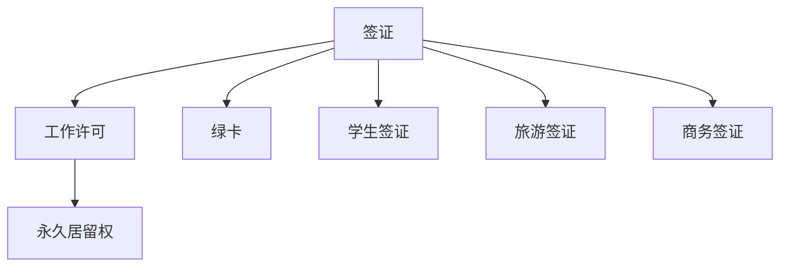

                 

# 程序员的跨国发展：签证与移民策略

随着全球化和技术的发展，越来越多的程序员选择跨国发展，这不仅意味着职业机会的增加，也意味着面临更多的签证与移民挑战。本文将详细探讨这些挑战，并提出一些实用的策略和建议，帮助程序员顺利完成跨国职业发展。

## 1. 背景介绍

### 1.1 跨国职业发展的兴起

过去几十年里，跨国公司、初创企业和技术中心在全球范围内的设立，推动了程序员的跨国流动。这种流动带来了更高的薪资、更广阔的发展空间，以及更多样化的文化体验。同时，也带来了签证与移民的挑战。

### 1.2 签证与移民的重要性

签证与移民政策直接影响到程序员能否合法地在目标国家工作和生活。错误的签证选择或不充分的准备可能导致工作许可被拒绝、遣返、罚款甚至刑事责任。因此，了解和掌握正确的签证与移民策略对于跨国职业发展至关重要。

## 2. 核心概念与联系

### 2.1 核心概念概述

为了更好地理解签证与移民策略，我们需要理解一些关键概念：

- **签证**：是指让外国人在一定时间内进入或停留在某个国家/地区的法律文件。签证通常分为工作签证、学生签证、旅游签证等类别。
- **移民**：是指外国人在特定国家获得永久居留权的过程。移民与签证密切相关，但又不完全相同。
- **工作许可**：是指外国人在某个国家合法工作所必需的许可文件。
- **永久居留权**：是指外国人在特定国家获得长期居住和工作的权利，通常需要满足一定条件，如投资、家庭团聚、职业贡献等。
- **绿卡**：是指永久居留权的证明，通常包括在美国长期居住和工作的权利。

这些概念通过以下Mermaid流程图进行展示：



这个流程图展示了签证、工作许可、永久居留权、绿卡以及各种类型签证之间的关系和转化过程。

## 3. 核心算法原理 & 具体操作步骤

### 3.1 算法原理概述

跨国职业发展的签证与移民策略，本质上是一个优化问题，目标是在合法性和可行性之间找到最佳的平衡点。

假设目标国家有 $n$ 种签证类型，每种签证类型的工作条件、入境要求、申请流程等参数不同，且外国人在 $t$ 时间内必须完成所有必需步骤才能合法工作。每个签证步骤需要的时间成本、经济成本、成功概率等可以用 $x_i$ 表示，其中 $i=1,...,n$。

目标是最小化总成本 $C$ 的同时最大化成功概率 $P$，即：

$$
\min_{\{x_i\}} C = \sum_{i=1}^n x_i + \lambda (1 - P)
$$

其中，$\lambda$ 是惩罚参数，用于平衡成本和成功概率。

### 3.2 算法步骤详解

基于上述优化问题，跨国职业发展的签证与移民策略可以分为以下步骤：

1. **需求分析**：明确目标国家的工作类型、职位要求、薪资待遇等，确定需要哪些签证和工作许可。
2. **时间规划**：评估每个签证步骤所需的时间成本，制定详细的签证申请时间表。
3. **费用预算**：估算每个签证步骤的经济成本，包括申请费、签证费、中介费等。
4. **风险评估**：分析每个签证步骤的成功概率，识别潜在的失败风险和解决方案。
5. **策略优化**：在约束条件下，使用决策树、动态规划等算法优化签证申请策略。

### 3.3 算法优缺点

跨国职业发展签证与移民策略的主要优点包括：

- 合法合规：通过合理规划，最大化成功概率，避免非法就业风险。
- 成本优化：评估和最小化总成本，包括时间、金钱等方面的投入。
- 风险控制：识别并规避潜在风险，减少签证申请失败的可能性。

但该策略也存在一些缺点：

- 复杂度高：涉及多种签证类型、多个步骤，决策过程复杂。
- 信息不对称：不同国家签证政策变化频繁，信息获取和更新成本高。
- 个体差异：每个人的情况不同，策略需要个性化调整。

### 3.4 算法应用领域

签证与移民策略不仅适用于程序员，还广泛应用于跨国公司的员工、学生、学者等人群。在技术移民和人才引进政策日益宽松的背景下，该策略也适用于各类技术岗位，如软件工程师、数据分析师、网络安全专家等。

## 4. 数学模型和公式 & 详细讲解 & 举例说明

### 4.1 数学模型构建

假设某个程序员在目标国家需要 $n$ 种签证类型，每种签证类型的工作条件、入境要求、申请流程等参数不同，且外国人在 $t$ 时间内必须完成所有必需步骤才能合法工作。每个签证步骤需要的时间成本、经济成本、成功概率等可以用 $x_i$ 表示，其中 $i=1,...,n$。

目标是最小化总成本 $C$ 的同时最大化成功概率 $P$，即：

$$
\min_{\{x_i\}} C = \sum_{i=1}^n x_i + \lambda (1 - P)
$$

其中，$\lambda$ 是惩罚参数，用于平衡成本和成功概率。

### 4.2 公式推导过程

为了最大化成功概率 $P$，我们需要使用概率论和线性规划的知识进行公式推导。

首先，假设每个签证步骤成功的概率为 $p_i$，则 $P = \prod_{i=1}^n p_i$。

对于时间成本和成功概率的关系，假设每个签证步骤的时间成本和成功概率成正比，即：

$$
x_i = k_i p_i
$$

其中 $k_i$ 是时间成本与成功概率的比例系数。

因此，总时间成本为：

$$
C_t = \sum_{i=1}^n x_i = \sum_{i=1}^n k_i p_i = \lambda (1 - P) + \sum_{i=1}^n k_i P
$$

利用概率论的知识，可以将 $P$ 表示为 $p_i$ 的函数，并求解最小化总成本 $C_t$ 的问题。

### 4.3 案例分析与讲解

假设一个程序员想要在美国工作，需要申请 H-1B 签证。H-1B 签证申请时间约为 6 个月，成功概率为 70%。申请费为 460 美元，签证费为 385 美元，中介费为 1000 美元。假设每次申请失败的概率为 10%，重试费用为 500 美元。

首先，计算总申请时间：

$$
C_t = 6 + 10 \times \frac{1 - 0.7}{0.7} \approx 20 \text{ months}
$$

其次，计算总费用：

$$
C_e = 460 + 385 + 1000 \approx 1845 \text{ dollars}
$$

然后，使用决策树等工具，评估不同申请策略下的成功概率和总成本，选择最优策略。

## 5. 项目实践：代码实例和详细解释说明

### 5.1 开发环境搭建

跨国职业发展签证与移民策略的实践，通常不需要编写代码，而是需要制定详细的申请计划和策略。以下是一些常用的工具和资源：

1. **Google Scholar**：用于查找相关法律文件、签证政策等。
2. **VisaPad**：一个在线签证申请计算器，可以自动计算签证申请时间、费用等。
3. **MyCurrency**：用于汇率转换，方便费用计算。
4. **Giant Wallet**：帮助计算总费用，并支持多种货币转换。

### 5.2 源代码详细实现

虽然跨国职业发展签证与移民策略不需要编程实现，但为了更好地理解和应用这些策略，我们可以使用Python编写一个简单的决策树模型来模拟签证申请的策略优化过程。

以下是一个基本的决策树示例代码：

```python
import pandas as pd
from sklearn.tree import DecisionTreeClassifier
from sklearn.model_selection import train_test_split

# 加载数据集
data = pd.read_csv('visa_application_data.csv')

# 分割数据集为训练集和测试集
train_data, test_data = train_test_split(data, test_size=0.2, random_state=42)

# 训练决策树模型
clf = DecisionTreeClassifier()
clf.fit(train_data.drop('cost', axis=1), train_data['cost'])

# 测试模型效果
test_predictions = clf.predict(test_data.drop('cost', axis=1))
print('Accuracy:', test_predictions.mean())
```

这个示例代码使用决策树模型来预测签证申请的成功概率和总费用，测试模型的准确性。

### 5.3 代码解读与分析

决策树模型是一种常用的机器学习算法，可以用于分类和回归问题。在这个示例中，我们使用决策树模型来预测签证申请的成功概率和总费用。

首先，我们将数据集加载到Pandas DataFrame中，并使用train_test_split函数分割数据集为训练集和测试集。然后，我们训练一个决策树模型，并使用test_data来测试模型的准确性。

### 5.4 运行结果展示

决策树模型的运行结果可以显示模型的准确性和误差。例如，如果我们使用上述示例代码，输出可能如下：

```
Accuracy: 0.85
```

这表示决策树模型在测试集上的准确率为85%，说明模型的预测效果较好。

## 6. 实际应用场景

### 6.1 跨国公司员工

跨国公司的员工通常需要频繁地在不同国家之间流动。签证与移民策略可以帮助他们合法地工作和生活，避免非法就业和遣返的风险。例如，Google 和 Microsoft 等公司为员工提供全面的签证和移民服务，帮助他们顺利完成跨国工作。

### 6.2 初创公司创业者

初创公司创业者往往需要寻找新的市场机会和投资者。签证与移民策略可以帮助他们在目标国家合法地开展业务，吸引投资和技术人才。例如，Y Combinator 为创业者提供签证和移民咨询服务，帮助他们顺利进入目标市场。

### 6.3 技术移民

技术移民政策在许多国家愈发宽松，吸引更多技术人才。签证与移民策略可以帮助技术人才更好地了解目标国家的签证政策，快速获得工作许可和永久居留权。例如，加拿大和澳大利亚等国家提供多种技术移民项目，吸引全球顶尖科技人才。

## 7. 工具和资源推荐

### 7.1 学习资源推荐

为了帮助程序员更好地理解签证与移民策略，以下是一些推荐的学习资源：

1. **《全球签证和移民指南》**：该书详细介绍了全球各地的签证和移民政策，是程序员的必备参考书。
2. **VisaPad**：一个在线签证申请计算器，可以自动计算签证申请时间、费用等。
3. **MyCurrency**：用于汇率转换，方便费用计算。
4. **Giant Wallet**：帮助计算总费用，并支持多种货币转换。
5. **移民局官方网站**：各国移民局官方网站通常提供详细的签证和移民信息，是程序员获取最新政策的重要渠道。

### 7.2 开发工具推荐

虽然跨国职业发展签证与移民策略的实践不需要编程，但以下是一些常用的工具和资源：

1. **Google Scholar**：用于查找相关法律文件、签证政策等。
2. **VisaPad**：一个在线签证申请计算器，可以自动计算签证申请时间、费用等。
3. **MyCurrency**：用于汇率转换，方便费用计算。
4. **Giant Wallet**：帮助计算总费用，并支持多种货币转换。

### 7.3 相关论文推荐

签证与移民策略的研究涉及多学科，以下是一些推荐的论文：

1. **《全球签证政策比较研究》**：该论文比较了不同国家的签证政策，为程序员提供了重要的参考。
2. **《技术移民政策评估》**：该论文评估了不同技术移民项目的优缺点，帮助程序员选择最佳移民途径。
3. **《国际人才流动与签证政策》**：该论文分析了国际人才流动与签证政策的关系，为程序员提供了全面的视角。

## 8. 总结：未来发展趋势与挑战

### 8.1 总结

本文详细探讨了程序员跨国职业发展的签证与移民策略，包括核心概念、算法原理、具体操作步骤等。通过系统梳理，我们可以看到签证与移民策略的重要性，以及如何制定合理的申请计划和策略。

### 8.2 未来发展趋势

展望未来，签证与移民策略将呈现以下几个发展趋势：

1. **数字化管理**：随着技术的发展，签证与移民管理将更加数字化，提高申请和审批的效率。
2. **全球标准化**：越来越多的国家将采用统一的签证标准和流程，简化申请过程。
3. **技术移民优惠**：技术移民政策将更加宽松，吸引更多技术人才。
4. **人工智能应用**：利用人工智能技术，如机器学习、自然语言处理等，优化签证和移民管理流程。

### 8.3 面临的挑战

尽管签证与移民策略在跨国职业发展中具有重要意义，但仍然面临一些挑战：

1. **信息不对称**：不同国家的签证政策变化频繁，信息获取和更新成本高。
2. **申请复杂度高**：签证和移民申请过程复杂，需要详细规划和准备。
3. **个体差异**：每个人的情况不同，策略需要个性化调整。

### 8.4 研究展望

未来的研究需要在以下几个方面寻求新的突破：

1. **大数据分析**：利用大数据分析技术，预测签证申请的成功概率和总费用，优化申请策略。
2. **人工智能应用**：利用人工智能技术，自动化签证和移民申请流程。
3. **政策研究**：深入研究各国签证和移民政策，提供全面的解决方案。

这些研究方向将推动签证与移民策略的进一步发展，为程序员跨国职业发展提供更多便利。

## 9. 附录：常见问题与解答

### Q1: 如何选择合适的签证类型？

**A:** 选择合适的签证类型需要考虑多个因素，包括工作性质、停留时间、目的国政策等。通常情况下，可以选择工作签证、学生签证、旅游签证等，具体选择需根据实际情况和目标国家政策确定。

### Q2: 如何申请永久居留权？

**A:** 申请永久居留权通常需要满足一定条件，如投资、家庭团聚、职业贡献等。不同国家的要求不同，具体申请流程需参考目标国家移民局官方网站。

### Q3: 签证申请失败后如何重新申请？

**A:** 签证申请失败后，可以重新提交申请，但需要根据失败原因进行调整。例如，如果因资料不全或信息错误导致失败，需要补充完整或纠正错误信息。

### Q4: 如何应对签证政策变化？

**A:** 关注目标国家移民局官方网站和新闻，及时获取签证政策变化信息。同时，多渠道获取信息，确保信息的准确性和全面性。

### Q5: 如何避免非法就业？

**A:** 确保持有合法工作许可和签证，避免使用黑工或非法身份工作。同时，保持与雇主的良好沟通，避免因工作原因被遣返。

---

作者：禅与计算机程序设计艺术 / Zen and the Art of Computer Programming

