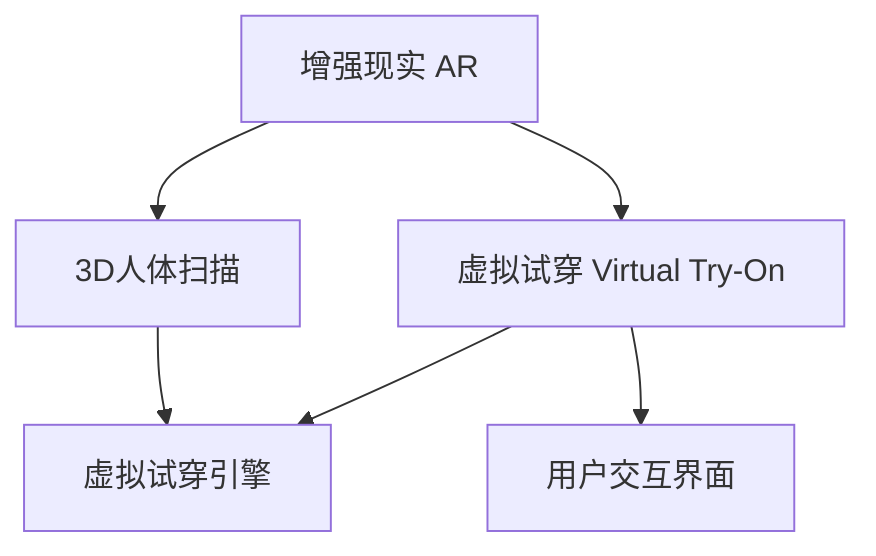

                 

# 聊天机器人零售体验：增强现实和虚拟试穿

## 1. 背景介绍

### 1.1 问题由来
随着电商行业的迅猛发展，在线购物已成为现代消费者获取商品信息、进行购买决策的重要方式。然而，在线购物缺乏传统的实体店试穿体验，这导致了消费者在购买服装、鞋帽等商品时，常常因尺寸、款式不合适而退换货，不仅影响了购物体验，也增加了商家运营成本。增强现实（AR）和虚拟试穿（Virtual Try-On）技术通过模拟真实试穿场景，为消费者提供便捷、沉浸的购物体验，有效解决了这一痛点问题。

### 1.2 问题核心关键点
增强现实和虚拟试穿技术通过将虚拟服装叠加在消费者身体或试穿场景上，让用户可以在线进行试穿操作，获取更准确的尺寸、样式等信息。其核心技术包括：
1. **3D人体扫描和建模**：通过摄像头、传感器等设备，捕捉并构建3D人体模型，用于驱动虚拟服装进行贴合和变形。
2. **虚拟试穿引擎**：结合3D模型和虚拟服装模型，实现服装在人体上的实时变形和贴合，生成逼真的试穿效果。
3. **用户交互界面**：设计简洁直观的用户界面，支持用户通过手势、语音等进行试穿控制。

增强现实和虚拟试穿技术的成功应用，不仅能提升消费者的购物体验，还能显著提高零售商的销售效率，降低退货率，带来显著的商业价值。

## 2. 核心概念与联系

### 2.1 核心概念概述

为更好地理解增强现实和虚拟试穿技术的应用原理和架构，本节将介绍几个密切相关的核心概念：

- **增强现实（AR）**：将虚拟信息与现实世界信息叠加，提升用户对现实世界的认知和互动。
- **虚拟试穿（Virtual Try-On）**：通过计算机视觉、3D建模和渲染等技术，让用户在线上试穿服装、鞋帽等商品，提升购物体验。
- **3D人体扫描**：利用传感器和摄像头对用户进行3D人体建模，用于驱动虚拟服装的适配和变形。
- **虚拟试穿引擎**：结合3D人体模型和虚拟服装模型，实现服装在人体上的实时变形和贴合，生成逼真的试穿效果。
- **用户交互界面**：通过界面设计，提供简洁直观的用户操作方式，如手势、语音控制，提高用户试穿体验。

这些核心概念之间的逻辑关系可以通过以下Mermaid流程图来展示：



这个流程图展示了增强现实和虚拟试穿技术的核心组成部分及其关系：

1. 增强现实技术提供了虚拟信息叠加的机制，为虚拟试穿创造了可能。
2. 3D人体扫描技术是虚拟试穿的基础，用于构建逼真的3D人体模型。
3. 虚拟试穿引擎结合3D人体模型和虚拟服装模型，实现服装的实时变形和贴合。
4. 用户交互界面提供简洁的操作方式，增强试穿体验。

## 3. 核心算法原理 & 具体操作步骤
### 3.1 算法原理概述

增强现实和虚拟试穿的算法原理主要包括以下几个步骤：

1. **3D人体扫描与建模**：使用摄像头、传感器等设备，捕捉用户身体的形状和尺寸，构建3D人体模型。
2. **虚拟服装的导入与适配**：将虚拟服装模型导入系统，根据3D人体模型进行适配和变形，生成逼真的试穿效果。
3. **虚拟试穿引擎的运行**：将虚拟服装在3D人体上进行实时变形和贴合，生成逼真的试穿效果。
4. **用户交互与试穿控制**：通过用户交互界面，接收用户的控制指令，驱动虚拟服装进行试穿。

### 3.2 算法步骤详解

#### 3.2.1 3D人体扫描与建模

1. **数据采集**：使用摄像头、深度传感器等设备，捕捉用户的身体形状和尺寸。
2. **点云处理**：将采集的数据转换为点云数据，进行去噪、对齐等预处理操作。
3. **人体建模**：利用点云数据，构建3D人体模型，如网格模型、多边形模型等。

#### 3.2.2 虚拟服装的导入与适配

1. **模型导入**：将虚拟服装的3D模型导入系统，支持常见的文件格式，如OBJ、FBX等。
2. **对齐与适配**：根据3D人体模型的形状和尺寸，对虚拟服装模型进行对齐和适配，确保服装的尺寸和样式符合用户需求。
3. **形态生成**：利用3D人体模型的参数，驱动虚拟服装进行变形和贴合，生成逼真的试穿效果。

#### 3.2.3 虚拟试穿引擎的运行

1. **实时渲染**：在试穿过程中，实时渲染虚拟服装，使其跟随用户的动作进行动态变形和贴合。
2. **光照与材质**：模拟真实光照条件和服装材质，提升试穿效果的逼真度。
3. **碰撞检测**：检测虚拟服装与3D人体模型的碰撞，避免服装穿过人体或变形过度。

#### 3.2.4 用户交互与试穿控制

1. **手势控制**：通过手势识别技术，捕捉用户的手势动作，驱动虚拟服装进行试穿。
2. **语音控制**：利用语音识别技术，接收用户的语音指令，控制虚拟服装的试穿过程。
3. **界面反馈**：通过界面设计，提供试穿效果的实时反馈，如服装尺寸、颜色等。

### 3.3 算法优缺点

增强现实和虚拟试穿技术在提升零售体验的同时，也存在以下优缺点：

**优点**：
1. **用户体验提升**：通过虚拟试穿，用户可以直观地看到服装在真实身体上的效果，提升购物体验。
2. **降低退货率**：试穿过程提供了准确的尺寸和款式信息，减少因不合适而产生的退货率。
3. **节省时间成本**：用户可以在线进行试穿，无需亲自到实体店，节省时间和交通成本。
4. **提高决策效率**：通过虚拟试穿，用户可以快速选择和比较不同款式和尺寸的商品，提高决策效率。

**缺点**：
1. **设备成本高**：增强现实和虚拟试穿需要高质量的传感器和计算机设备，设备成本较高。
2. **技术复杂度高**：涉及3D建模、计算机视觉等多个领域的复杂技术，开发和维护成本较高。
3. **硬件要求高**：需要高性能的计算和渲染设备，对硬件环境的要求较高。
4. **用户接受度问题**：部分用户可能对新兴技术存在抵触情绪，需要进一步推广和教育。

### 3.4 算法应用领域

增强现实和虚拟试穿技术在零售、服装、鞋帽等多个领域得到了广泛应用，以下是几个典型应用场景：

- **服装电商**：在电商平台上提供虚拟试穿功能，用户可以在线试穿服装，提升购物体验，降低退货率。
- **高端零售**：在高端商场和品牌店内安装虚拟试穿设备，提供便捷的试穿服务，提升顾客满意度。
- **个性化定制**：根据用户身体数据和偏好，定制虚拟服装，满足用户的个性化需求。
- **虚拟购物助手**：在购物过程中，提供虚拟试穿和建议，帮助用户做出更好的购买决策。

## 4. 数学模型和公式 & 详细讲解 & 举例说明

### 4.1 数学模型构建

增强现实和虚拟试穿技术的数学模型主要涉及计算机视觉、3D建模和优化算法等领域。

假设用户身体的三维坐标为 $\mathbf{P} \in \mathbb{R}^3$，虚拟服装的3D模型为 $\mathbf{M} \in \mathbb{R}^3$。则虚拟服装在用户身体上的位置和姿态可以表示为：

$$
\mathbf{S}(\mathbf{P}, \mathbf{M}) = \mathbf{P} + \mathbf{R}(\mathbf{P}) \cdot \mathbf{M}
$$

其中 $\mathbf{R}(\mathbf{P})$ 为旋转矩阵，用于描述虚拟服装在用户身体上的旋转角度和姿态。

### 4.2 公式推导过程

虚拟服装的适配和变形过程可以表示为如下优化问题：

$$
\min_{\mathbf{R}(\mathbf{P}), \mathbf{M}} \left\{ \mathcal{L}(\mathbf{S}(\mathbf{P}, \mathbf{M}), \mathbf{y}) \right\}
$$

其中 $\mathcal{L}$ 为损失函数，$\mathbf{y}$ 为实际服装在用户身体上的位置和姿态。常见的损失函数包括均方误差（MSE）和交叉熵（Cross-Entropy）等。

通过优化算法（如梯度下降、拟牛顿法等）求解上述优化问题，即可得到虚拟服装在用户身体上的最佳位置和姿态。

### 4.3 案例分析与讲解

以虚拟服装在用户身体上的适配为例，假设用户身高的真实值为 $h_{real} \in \mathbb{R}$，虚拟服装的腰围参数为 $w_{virtual} \in \mathbb{R}$，则适配过程可以表示为：

$$
\mathbf{R}(\mathbf{P}) = \begin{bmatrix} 
1 & 0 & 0 \\
0 & \cos(\theta) & -\sin(\theta) \\
0 & \sin(\theta) & \cos(\theta)
\end{bmatrix}
$$

其中 $\theta$ 为服装在用户身体上的旋转角度，通过用户身高的真实值和虚拟服装的腰围参数计算得到。

假设用户身高的真实值和虚拟服装的腰围参数分别为 $h_{real}=170$ 厘米，$w_{virtual}=88$ 厘米，则旋转角度 $\theta$ 为：

$$
\theta = \arctan\left(\frac{w_{virtual}-h_{real}}{2}\right)
$$

计算得到 $\theta \approx 19.47^\circ$，旋转矩阵 $\mathbf{R}(\mathbf{P})$ 为：

$$
\mathbf{R}(\mathbf{P}) = \begin{bmatrix} 
1 & 0 & 0 \\
0 & \cos(19.47^\circ) & -\sin(19.47^\circ) \\
0 & \sin(19.47^\circ) & \cos(19.47^\circ)
\end{bmatrix}
$$

将旋转矩阵 $\mathbf{R}(\mathbf{P})$ 应用到虚拟服装的3D模型上，即可得到适配后的虚拟服装在用户身体上的位置和姿态。

## 5. 项目实践：代码实例和详细解释说明
### 5.1 开发环境搭建

在进行增强现实和虚拟试穿开发前，我们需要准备好开发环境。以下是使用Python进行Unity开发的开发环境配置流程：

1. 安装Unity：从官网下载并安装Unity编辑器，适用于创建虚拟试穿应用。
2. 创建并激活Unity项目：创建一个新的Unity项目，并在项目中引入必要的插件和脚本。
3. 配置开发环境：确保编辑器、编译器等工具正常工作，支持C#和Unity脚本开发。

### 5.2 源代码详细实现

下面我们以Unity平台为例，给出虚拟试穿应用的代码实现。

首先，创建虚拟服装的3D模型：

```csharp
using UnityEngine;
using UnityEngine.UI;

public class VirtualClothes : MonoBehaviour
{
    public GameObject clothesPrefab;
    public Transform userPivot;

    void Start()
    {
        Vector3 position = userPivot.position;
        Quaternion rotation = userPivot.rotation;
        GameObject clothing = Instantiate(clothesPrefab, position, rotation, null);
        clothing.transform.parent = userPivot;
    }
}
```

然后，实现虚拟服装的适配过程：

```csharp
public class FitClothes : MonoBehaviour
{
    public GameObject clothesPrefab;
    public Transform userPivot;

    void Update()
    {
        // 获取用户身高的真实值和虚拟服装的腰围参数
        float heightReal = GetHeightReal();
        float waistVirtual = GetWaistVirtual();

        // 计算旋转角度
        float theta = Mathf.Atan((waistVirtual - heightReal) / 2) * Mathf.Rad2Deg;

        // 创建旋转矩阵
        Quaternion rotation = Quaternion.Euler(0, theta, 0);

        // 适配虚拟服装
        GameObject clothing = Instantiate(clothesPrefab, userPivot.position, rotation, null);
        clothing.transform.parent = userPivot;
    }

    float GetHeightReal()
    {
        // 获取用户身高的真实值
        // 这里可以根据用户输入、摄像头识别等方式获取用户身高的真实值
    }

    float GetWaistVirtual()
    {
        // 获取虚拟服装的腰围参数
        // 这里可以根据虚拟服装的3D模型获取腰围参数
    }
}
```

最后，实现用户交互与试穿控制：

```csharp
public class UserInteraction : MonoBehaviour
{
    public GameObject[] clothesPrefabs;
    public Transform userPivot;

    void Update()
    {
        // 获取用户手势或语音指令
        Gesture gesture = GetGesture();
        string voiceCommand = GetVoiceCommand();

        // 根据手势或语音指令选择试穿服装
        if (gesture != null || !string.IsNullOrEmpty(voiceCommand))
        {
            int index = -1;
            if (gesture != null) index = gesture.GetIndex();
            if (string.IsNullOrEmpty(voiceCommand)) index = 0;
            
            // 适配并显示虚拟服装
            GameObject clothing = Instantiate(clothesPrefabs[index], userPivot.position, Quaternion.identity, null);
            clothing.transform.parent = userPivot;
        }
    }

    Gesture GetGesture()
    {
        // 根据用户手势动作识别试穿服装
        // 这里可以使用Unity的手势识别系统，获取用户的手势动作
    }

    string GetVoiceCommand()
    {
        // 根据用户语音指令识别试穿服装
        // 这里可以使用Unity的语音识别系统，获取用户的语音指令
    }
}
```

以上是使用Unity平台实现虚拟试穿的完整代码实例。可以看到，Unity提供的强大引擎和丰富的脚本系统，使得虚拟试穿的开发变得简便高效。开发者可以通过调整代码，实现更加复杂的试穿功能，如试穿效果预览、试穿路径规划等。

### 5.3 代码解读与分析

让我们再详细解读一下关键代码的实现细节：

**VirtualClothes类**：
- `Start`方法：在虚拟服装对象被创建时执行，将服装适配到用户身体上。
- `userPivot`变量：用户身体的位置和姿态，用于驱动虚拟服装的旋转和对齐。

**FitClothes类**：
- `Update`方法：实时适配虚拟服装，确保其位置和姿态符合用户需求。
- `GetHeightReal`和`GetWaistVirtual`方法：获取用户身高的真实值和虚拟服装的腰围参数，用于计算旋转角度。

**UserInteraction类**：
- `Update`方法：根据用户的手势或语音指令，选择并适配虚拟服装。
- `GetGesture`和`GetVoiceCommand`方法：识别用户的手势或语音指令，驱动试穿过程。

这些代码展示了虚拟试穿的核心逻辑，通过调整具体实现，可以满足不同用户和场景的需求。

## 6. 实际应用场景
### 6.1 智能服装零售

增强现实和虚拟试穿技术在智能服装零售领域的应用非常广泛。用户可以通过手机APP或AR设备，在线试穿服装，获取准确的身尺寸量和试穿效果，提升购物体验。这种技术不仅提高了用户的满意度，也减少了退货率，降低了商家的运营成本。

在具体实现上，可以通过用户的身高、体重、腰围等身体数据，结合虚拟试穿引擎，生成逼真的试穿效果。用户可以通过手势、语音等进行试穿控制，查看不同款式、尺寸的服装效果，从而做出更明智的购买决策。

### 6.2 高端品牌体验店

高端品牌体验店通过安装增强现实和虚拟试穿设备，为顾客提供便捷、沉浸的试穿服务。顾客无需亲自试穿服装，只需在设备前完成简单的注册和授权，即可在线试穿品牌服装，体验真实的穿着效果。

体验店可以收集顾客的试穿数据，用于个性化推荐和营销，提升顾客的购物体验和忠诚度。这种技术不仅提高了顾客的满意度，也提升了品牌形象，成为高端零售的新趋势。

### 6.3 个性化定制服务

增强现实和虚拟试穿技术在个性化定制服务中也有广泛应用。顾客可以通过虚拟试穿，试穿不同款式、材质的服装，获得个性化的定制建议。设计师可以根据顾客的试穿效果，快速调整设计方案，提升定制服装的质量和适配度。

此外，虚拟试穿还可以用于设计评审和产品发布，设计师可以在虚拟环境中展示设计效果，快速获得反馈，优化设计方案。这种技术不仅提高了设计师的工作效率，也提升了产品的市场竞争力。

### 6.4 未来应用展望

随着增强现实和虚拟试穿技术的不断发展，未来将有更多场景得以应用。以下是几个未来应用展望：

1. **智能家居试穿**：在智能家居环境中，虚拟试穿技术可以用于试穿室内装饰品、家具等，提升用户的家居体验。
2. **虚拟试穿助手**：在购物过程中，虚拟试穿助手可以提供试穿建议和搭配推荐，帮助用户做出更好的购买决策。
3. **虚拟试穿游戏**：虚拟试穿技术可以应用于游戏领域，提供更加沉浸和个性化的游戏体验，如模拟时装秀、虚拟试穿房间等。
4. **社交媒体互动**：虚拟试穿技术可以用于社交媒体平台，用户可以在虚拟环境中试穿服装，与朋友分享试穿效果，提升社交互动性。
5. **健康管理**：虚拟试穿技术可以用于健康管理领域，通过试穿不同尺寸的服装，检测用户的体型变化，提供健康建议。

总之，增强现实和虚拟试穿技术的发展前景广阔，将带来更多应用场景和商业机会。

## 7. 工具和资源推荐
### 7.1 学习资源推荐

为了帮助开发者掌握增强现实和虚拟试穿技术的原理和实践技巧，这里推荐一些优质的学习资源：

1. **《虚拟现实编程与开发》**：详细介绍了虚拟现实技术的基本概念和开发工具，适合初学者入门。
2. **Unity官方文档**：Unity官方提供的详细教程和文档，涵盖虚拟试穿开发的各种知识点。
3. **ARKit和ARCore官方文档**：苹果和谷歌提供的增强现实开发工具，适合开发移动端的增强现实应用。
4. **《增强现实与虚拟现实技术》**：全面介绍了增强现实和虚拟现实技术的原理和应用场景，适合深入学习。
5. **Coursera增强现实与虚拟现实课程**：Coursera提供的虚拟现实课程，涵盖虚拟试穿开发的各种技术要点。

通过对这些资源的学习实践，相信你一定能够快速掌握增强现实和虚拟试穿技术的精髓，并用于解决实际的零售问题。

### 7.2 开发工具推荐

高效的开发离不开优秀的工具支持。以下是几款用于增强现实和虚拟试穿开发的常用工具：

1. **Unity**：Unity是一款功能强大的游戏引擎，支持虚拟试穿应用的开发。
2. **ARKit和ARCore**：苹果和谷歌提供的增强现实开发工具，支持移动端设备的AR应用开发。
3. **Vuforia**：Vuforia是一款AR内容识别工具，可以帮助开发者快速实现AR功能。
4. **Google Glass**：谷歌推出的增强现实设备，支持AR眼镜应用开发，提供沉浸式的试穿体验。
5. **HTC Vive和Oculus Rift**：虚拟现实设备，支持虚拟试穿和体验应用的开发，提供逼真的试穿效果。

合理利用这些工具，可以显著提升增强现实和虚拟试穿应用的开发效率，加速技术创新的步伐。

### 7.3 相关论文推荐

增强现实和虚拟试穿技术的研究领域较为广泛，以下是几篇重要的相关论文，推荐阅读：

1. **AR试穿技术的研究与应用**：介绍了增强现实试穿技术的基本原理和应用场景，适合入门学习。
2. **虚拟试穿系统的设计与实现**：详细描述了虚拟试穿系统的开发流程和关键技术点，适合实践参考。
3. **基于增强现实的虚拟试穿技术**：探讨了增强现实技术在虚拟试穿中的应用，适合进一步深入研究。
4. **虚拟试穿的跨模态交互设计**：讨论了虚拟试穿系统中用户交互界面的设计，适合优化用户体验。
5. **虚拟试穿与个性化推荐**：研究了虚拟试穿与个性化推荐相结合的算法和模型，适合提升试穿效果。

这些论文代表了增强现实和虚拟试穿技术的发展方向，通过学习这些前沿成果，可以帮助研究者把握学科前进方向，激发更多的创新灵感。

## 8. 总结：未来发展趋势与挑战
### 8.1 总结

本文对增强现实和虚拟试穿技术进行了全面系统的介绍。首先阐述了该技术在零售、服装、鞋帽等领域的背景和意义，明确了虚拟试穿技术的核心工作原理。其次，从算法原理到实践实现，详细讲解了增强现实和虚拟试穿的各个关键步骤，给出了代码实现和解释分析。同时，本文还广泛探讨了虚拟试穿技术在多个行业领域的应用前景，展示了其在提升零售体验、降低退货率等方面的巨大潜力。此外，本文精选了相关学习资源和开发工具，力求为读者提供全方位的技术指引。

通过本文的系统梳理，可以看到，增强现实和虚拟试穿技术在提升零售体验、降低退货率等方面具有显著的优势，已经成为智能零售的重要技术手段。未来，伴随技术的不断发展，虚拟试穿技术将带来更多应用场景和商业机会，为零售行业带来深远的影响。

### 8.2 未来发展趋势

展望未来，增强现实和虚拟试穿技术将呈现以下几个发展趋势：

1. **技术成熟度提升**：随着技术的不断成熟，虚拟试穿的精度、鲁棒性和实时性将得到显著提升，用户体验将进一步改善。
2. **多模态融合增强**：增强现实和虚拟试穿将进一步融合视觉、听觉、触觉等多模态信息，提供更加真实和全面的试穿体验。
3. **设备普及率提高**：随着设备价格的降低和技术的普及，虚拟试穿将更广泛地应用于智能家居、移动端等多个领域。
4. **个性化推荐增强**：通过虚拟试穿数据，结合个性化推荐算法，提升用户的购物体验和满意度。
5. **跨领域应用扩展**：虚拟试穿技术将拓展到更多领域，如医疗、教育、娱乐等，带来更多应用场景和商业价值。

### 8.3 面临的挑战

尽管增强现实和虚拟试穿技术已经取得了瞩目成就，但在迈向更加智能化、普适化应用的过程中，它仍面临诸多挑战：

1. **设备成本高昂**：高质量的虚拟试穿设备需要高性能的计算机和传感器，设备成本较高，普及率有限。
2. **技术复杂度高**：涉及计算机视觉、3D建模、图形渲染等多个领域的复杂技术，开发和维护成本较高。
3. **用户体验有待提升**：部分用户可能对新兴技术存在抵触情绪，需要进一步推广和教育，提升用户体验。
4. **数据隐私问题**：虚拟试穿技术需要收集和处理用户的身体数据，如何保障数据隐私和安全，是一个重要问题。
5. **跨平台兼容性**：虚拟试穿技术需要支持不同的平台和设备，开发和维护跨平台的兼容性是一个挑战。

### 8.4 研究展望

面对增强现实和虚拟试穿技术面临的种种挑战，未来的研究需要在以下几个方面寻求新的突破：

1. **低成本设备开发**：开发低成本、高性能的虚拟试穿设备，降低设备成本，提高普及率。
2. **技术集成优化**：进一步融合计算机视觉、3D建模、图形渲染等多项技术，提高虚拟试穿的精度和实时性。
3. **用户交互优化**：提升用户交互体验，设计更加简洁直观的用户界面，提高用户接受度和满意度。
4. **数据隐私保护**：在数据收集和处理过程中，采用数据加密、匿名化等技术，保障用户隐私和安全。
5. **跨平台兼容性增强**：开发跨平台的虚拟试穿应用，支持不同设备和技术平台，提高应用普及率。

这些研究方向将引领增强现实和虚拟试穿技术的不断进步，为智能零售、虚拟试穿等领域带来更多的创新和突破。

## 9. 附录：常见问题与解答

**Q1：虚拟试穿技术是否适用于所有服装类型？**

A: 虚拟试穿技术适用于大部分服装类型，如T恤、衬衫、连衣裙、裤装等。但对于一些复杂的服装，如定制服装、非标准尺码的服装等，可能需要进一步优化适配算法，才能获得更好的试穿效果。

**Q2：虚拟试穿技术是否需要高精度的人体扫描设备？**

A: 高精度的人体扫描设备能够提供更准确的3D人体模型，提高试穿效果。但也可以选择相对低成本的设备，如智能手机摄像头、家用3D扫描器等，满足基本需求。

**Q3：虚拟试穿技术是否需要高精度的服装模型？**

A: 高精度的服装模型能够提供更逼真的试穿效果，但也需要较高的建模成本。可以根据实际需求，选择适合的生产商和工艺，保证服装模型的质量和精度。

**Q4：虚拟试穿技术是否需要高性能的计算和渲染设备？**

A: 虚拟试穿技术需要高性能的计算和渲染设备，以支持实时的试穿过程和逼真的效果展示。可以选择高性能的PC、GPU设备，或者云平台进行部署。

**Q5：虚拟试穿技术是否需要复杂的手势或语音识别系统？**

A: 手势和语音识别系统可以提供便捷的试穿控制，但需要具备较高的识别精度。可以通过优化识别算法、提升设备性能等方式，提高识别准确率和用户体验。

综上所述，增强现实和虚拟试穿技术在提升零售体验、降低退货率等方面具有显著的优势，已经成为智能零售的重要技术手段。未来，伴随技术的不断发展，虚拟试穿技术将带来更多应用场景和商业机会，为零售行业带来深远的影响。

