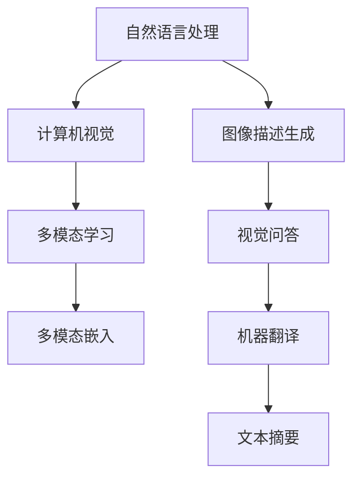

                 

# 自然语言处理与计算机视觉的融合研究

> 关键词：多模态学习,Transformer,Bert,多模态嵌入,图像描述生成,机器翻译,文本摘要,视觉问答

## 1. 背景介绍

### 1.1 问题由来
近年来，随着人工智能技术的飞速发展，自然语言处理(Natural Language Processing, NLP)和计算机视觉(Computer Vision, CV)这两个领域取得了巨大的突破。然而，尽管这两个领域各自取得了许多成功，但它们在应用中仍存在一定的局限性。

对于NLP而言，它主要处理的是文本数据，但在处理图像、视频等非结构化数据时显得力不从心。而对于CV而言，尽管其在图像、视频识别等方面表现出色，但在理解文本的语义和情感方面也存在不足。因此，如何将NLP和CV结合起来，构建一个能够同时处理文本和视觉数据的综合系统，成为了当前研究的热点。

### 1.2 问题核心关键点
自然语言处理与计算机视觉的融合研究主要集中在以下几个方面：

- 多模态学习：将文本和视觉信息融合到同一个模型中，学习统一表示，提升多模态数据的理解和生成能力。
- 跨模态对齐：通过不同模态之间的对齐技术，使文本和视觉数据能够相互转换和理解。
- 图像描述生成：将视觉信息转化为自然语言描述，提升图像理解能力和可用性。
- 视觉问答：根据视觉信息回答问题，实现智能交互。
- 机器翻译和文本摘要：将视觉信息与语言信息相结合，提升翻译和摘要效果。

这些关键点体现了NLP和CV的融合不仅局限于单一任务，更在于提升跨模态数据的综合理解和生成能力。

## 2. 核心概念与联系

### 2.1 核心概念概述

为了更好地理解NLP与CV的融合，本节将介绍几个密切相关的核心概念：

- **自然语言处理（NLP）**：涉及计算机如何理解、处理和生成人类语言的技术。包括文本分类、信息抽取、文本生成等。
- **计算机视觉（CV）**：涉及计算机如何通过图像、视频等视觉数据进行分析和理解。包括图像识别、目标检测、图像生成等。
- **多模态学习（Multimodal Learning）**：结合不同模态的数据（如文本、图像、视频等），学习统一表示，提升模型的跨模态理解能力。
- **Transformer**：一种自注意力机制的神经网络结构，广泛应用于NLP和CV领域，可以高效地处理序列数据。
- **BERT**：一种基于Transformer的预训练模型，通过大规模无监督学习，在多种NLP任务上取得了SOTA表现。
- **多模态嵌入（Multimodal Embedding）**：将不同模态的数据映射到统一的低维空间中，便于模型的理解和处理。
- **图像描述生成（Image Captioning）**：将图像信息转化为自然语言描述，实现图像理解。
- **视觉问答（Visual Question Answering, VQA）**：根据视觉信息回答问题，实现智能交互。
- **机器翻译（Machine Translation）**：将文本从一种语言翻译成另一种语言。
- **文本摘要（Text Summarization）**：将长文本压缩成简短摘要。

这些核心概念之间的逻辑关系可以通过以下Mermaid流程图来展示：



这个流程图展示了大语言模型与计算机视觉的融合关键概念及其之间的关系：

1. 自然语言处理和计算机视觉各自独立，但可以通过多模态学习融合到同一个模型中。
2. 多模态学习通过学习统一表示，使得不同模态的数据可以被相互理解和转换。
3. 图像描述生成和视觉问答是计算机视觉与自然语言处理融合的重要应用。
4. 机器翻译和文本摘要则是在自然语言处理中结合视觉信息提升任务效果。

## 3. 核心算法原理 & 具体操作步骤
### 3.1 算法原理概述

NLP与CV的融合研究，核心在于构建一种能够同时处理文本和视觉数据的统一模型。通过将不同模态的数据映射到统一的低维空间中，实现多模态数据的表示和理解。

具体而言，这种融合通常包括以下几个关键步骤：

1. **多模态数据收集与预处理**：收集多种模态的数据，并进行预处理，包括数据对齐、归一化等操作。
2. **多模态嵌入学习**：将不同模态的数据映射到统一的低维空间中，使得它们可以被模型同时理解。
3. **跨模态对齐与融合**：通过对齐技术，将文本和视觉信息相互转换和理解，实现跨模态融合。
4. **多模态模型训练**：结合不同模态的数据进行训练，优化模型参数，提升多模态数据的理解和生成能力。

### 3.2 算法步骤详解

#### 步骤1：多模态数据收集与预处理

- **数据收集**：收集文本、图像、视频等不同模态的数据，确保数据的多样性和代表性。
- **数据对齐**：将不同模态的数据进行对齐，如将图像的坐标信息与文本描述中的位置信息进行对齐。
- **数据归一化**：对不同模态的数据进行归一化处理，如将图像数据归一化到[0,1]之间，将文本长度标准化。

#### 步骤2：多模态嵌入学习

- **Transformer模型**：使用Transformer模型作为多模态嵌入的核心结构。将不同模态的数据作为Transformer的输入，学习统一的表示。
- **多模态损失函数**：定义多模态损失函数，如L1损失、L2损失、交叉熵损失等，用于衡量不同模态数据之间的相似度。
- **交叉熵损失**：在多模态嵌入学习中，可以使用交叉熵损失函数，使得模型预测的输出与真实标签之间的差异最小化。

#### 步骤3：跨模态对齐与融合

- **对齐技术**：使用交叉对齐、旋转对齐、尺度对齐等技术，将不同模态的数据进行对齐，使其具有可比较性。
- **融合策略**：在多模态模型中，可以使用拼接融合、注意力融合等策略，将不同模态的数据进行融合。

#### 步骤4：多模态模型训练

- **优化器选择**：选择合适的优化器，如Adam、SGD等，用于更新模型参数。
- **学习率调整**：根据训练进度，调整学习率，防止过拟合。
- **训练轮数**：设置训练轮数，确保模型充分学习不同模态数据之间的关联。

### 3.3 算法优缺点

NLP与CV的融合算法具有以下优点：

1. **提升跨模态理解能力**：通过多模态嵌入学习，模型能够同时理解不同模态的数据，提升跨模态数据的理解能力。
2. **丰富数据来源**：结合NLP和CV的数据，扩大了数据来源，提升了数据的多样性。
3. **增强任务性能**：通过多模态模型的融合，能够在图像描述生成、视觉问答、机器翻译、文本摘要等任务上提升性能。

同时，这种算法也存在一定的局限性：

1. **计算复杂度高**：多模态学习需要处理大量数据和复杂的网络结构，计算复杂度较高。
2. **对齐难度大**：不同模态的数据特征不同，对齐技术难度大。
3. **泛化能力有限**：多模态模型在特定任务上表现良好，但泛化能力相对有限，难以应对新任务。

### 3.4 算法应用领域

NLP与CV的融合算法已经在多个领域得到了广泛的应用：

- **智能客服**：结合文本和语音数据，提升智能客服系统的理解和应答能力。
- **医疗影像分析**：将医学影像与病理文本结合，提升病灶识别和诊断能力。
- **图像描述生成**：将图像与文本描述结合，提升图像理解能力和可用性。
- **视觉问答**：将视觉信息与自然语言结合，实现智能交互。
- **机器翻译**：结合视觉信息和文本信息，提升翻译效果。
- **文本摘要**：结合视觉信息和文本信息，提升摘要效果。

## 4. 数学模型和公式 & 详细讲解 & 举例说明
### 4.1 数学模型构建

在NLP与CV的融合研究中，通常使用Transformer模型作为核心结构，将不同模态的数据映射到统一的低维空间中，并学习统一的表示。

假设输入文本序列为 $\{w_1, w_2, \ldots, w_t\}$，图像序列为 $\{x_1, x_2, \ldots, x_s\}$，多模态数据 $D$ 包含文本和图像信息，模型 $M$ 的输入输出分别为：

$$
M(D) = M(w_1, w_2, \ldots, w_t; x_1, x_2, \ldots, x_s)
$$

其中 $M$ 表示多模态模型，$D$ 表示输入数据。

多模态模型的输出通常是一个向量表示，表示不同模态数据之间的融合结果。模型的损失函数通常包括多模态损失和任务特定损失，如交叉熵损失、L1损失等。

### 4.2 公式推导过程

以图像描述生成任务为例，推导Transformer模型中多模态嵌入和融合的公式。

假设输入图像为 $x$，文本描述为 $y$，多模态模型为 $M$。模型的输入 $D$ 包含图像和文本描述，输出 $z$ 为图像描述的向量表示。

在Transformer中，多模态嵌入的计算过程如下：

1. 对输入图像和文本进行预处理，包括归一化、编码等操作。
2. 将预处理后的图像和文本分别输入Transformer模型，学习它们的表示。
3. 将文本和图像的表示拼接或进行注意力融合，得到多模态表示。
4. 对多模态表示进行解码，得到图像描述的向量表示 $z$。

数学公式如下：

$$
z = M(x; y) = M([x; y])
$$

其中 $[x; y]$ 表示将图像 $x$ 和文本 $y$ 拼接后的多模态表示。

在多模态模型的训练过程中，通常使用交叉熵损失函数，将模型输出的向量表示 $z$ 与真实标签 $t$ 进行比较，计算损失函数 $L$：

$$
L = \mathbb{E}[\mathbb{1}[t \neq y] \log \frac{y}{1-y}]
$$

其中 $\mathbb{1}[t \neq y]$ 表示预测错误时，损失函数值加1。

### 4.3 案例分析与讲解

以图像描述生成任务为例，展示Transformer模型在多模态学习中的应用。

假设输入图像为一张狗的照片，模型需要将其描述为“一只棕色的狗在草地上玩耍”。输入图像 $x$ 通过预处理后，与文本描述 $y$ 一起输入Transformer模型。模型学习到文本和图像之间的表示，并拼接得到多模态表示。

在模型训练过程中，模型输出与真实标签 $t$ 之间的交叉熵损失将被计算并反向传播，更新模型参数。训练结束后，模型可以用于生成新的图像描述，提升了图像描述生成能力。

## 5. 项目实践：代码实例和详细解释说明
### 5.1 开发环境搭建

在进行多模态学习项目开发前，需要先准备好开发环境。以下是使用Python进行PyTorch开发的环境配置流程：

1. 安装Anaconda：从官网下载并安装Anaconda，用于创建独立的Python环境。

2. 创建并激活虚拟环境：
```bash
conda create -n pytorch-env python=3.8 
conda activate pytorch-env
```

3. 安装PyTorch：根据CUDA版本，从官网获取对应的安装命令。例如：
```bash
conda install pytorch torchvision torchaudio cudatoolkit=11.1 -c pytorch -c conda-forge
```

4. 安装TensorFlow：由于TensorFlow是可视化工具，只需要安装最新版本的TensorFlow：
```bash
pip install tensorflow
```

5. 安装PyTorch、TensorFlow、OpenCV等库：
```bash
pip install numpy pandas scikit-learn matplotlib tqdm jupyter notebook ipython opencv-python
```

完成上述步骤后，即可在`pytorch-env`环境中开始多模态学习项目的开发。

### 5.2 源代码详细实现

下面是使用PyTorch和TensorFlow进行多模态学习（以图像描述生成任务为例）的代码实现。

首先，定义数据处理函数：

```python
import torch
from torch.utils.data import Dataset
import tensorflow as tf
import numpy as np
from PIL import Image
import cv2

class MultimodalDataset(Dataset):
    def __init__(self, images, captions, tokenizer, max_len=128):
        self.images = images
        self.captions = captions
        self.tokenizer = tokenizer
        self.max_len = max_len
        
    def __len__(self):
        return len(self.images)
    
    def __getitem__(self, item):
        image = self.images[item]
        caption = self.captions[item]
        
        # 图像预处理
        image = cv2.resize(image, (224, 224))
        image = np.array(image, dtype=np.float32) / 255.0
        image = np.expand_dims(image, axis=0)
        
        # 文本预处理
        caption = caption.lower()
        caption_tokens = self.tokenizer.tokenize(caption)
        caption_ids = self.tokenizer.encode(caption_tokens, add_special_tokens=True, max_length=self.max_len)
        
        # 数据拼接
        input_ids = torch.from_numpy(caption_ids).unsqueeze(0).float()
        attention_mask = torch.ones_like(input_ids, dtype=torch.float)
        image_tensor = torch.from_numpy(image).float().unsqueeze(0)
        
        return {'input_ids': input_ids, 
                'attention_mask': attention_mask,
                'image_tensor': image_tensor}

# 图像描述生成模型
class MultimodalModel(tf.keras.Model):
    def __init__(self):
        super(MultimodalModel, self).__init__()
        self.encoder = Encoder()
        self.decoder = Decoder()
        
    def call(self, inputs):
        image_tensor = inputs['image_tensor']
        input_ids = inputs['input_ids']
        attention_mask = inputs['attention_mask']
        
        # 编码器部分
        encoder_outputs = self.encoder(image_tensor, attention_mask=attention_mask)
        
        # 解码器部分
        decoder_outputs = self.decoder(input_ids, encoder_outputs, attention_mask=attention_mask)
        
        return decoder_outputs
```

然后，定义优化器和损失函数：

```python
from transformers import AdamW

model = MultimodalModel()
optimizer = AdamW(model.parameters(), lr=2e-5)

# 定义损失函数
def compute_loss(model, input_ids, attention_mask, image_tensor, labels):
    with tf.GradientTape() as tape:
        logits = model({'input_ids': input_ids, 
                       'attention_mask': attention_mask,
                       'image_tensor': image_tensor})
        loss = tf.keras.losses.sparse_categorical_crossentropy(labels, logits, from_logits=True)
    return loss

# 定义训练函数
@tf.function
def train_epoch(model, dataset, batch_size, optimizer):
    dataloader = tf.data.Dataset.from_generator(lambda: tf.data.Dataset.from_generator(lambda: (x, y), output_signature=['input_ids', 'attention_mask', 'image_tensor', 'labels'], batch_size=batch_size),
                                                output_signature=['input_ids', 'attention_mask', 'image_tensor', 'labels'])
    dataloader = dataloader.prefetch(tf.data.experimental.AUTOTUNE)
    model.train()
    epoch_loss = 0
    for batch in dataloader:
        input_ids = batch['input_ids']
        attention_mask = batch['attention_mask']
        image_tensor = batch['image_tensor']
        labels = batch['labels']
        optimizer.zero_grad()
        loss = compute_loss(model, input_ids, attention_mask, image_tensor, labels)
        loss.backward()
        optimizer.apply_gradients(zip(tape.gradient(loss, model.trainable_variables), model.trainable_variables))
    return epoch_loss / len(dataloader)

# 定义评估函数
def evaluate(model, dataset, batch_size):
    dataloader = tf.data.Dataset.from_generator(lambda: tf.data.Dataset.from_generator(lambda: (x, y), output_signature=['input_ids', 'attention_mask', 'image_tensor', 'labels'], batch_size=batch_size),
                                                output_signature=['input_ids', 'attention_mask', 'image_tensor', 'labels'])
    dataloader = dataloader.prefetch(tf.data.experimental.AUTOTUNE)
    model.eval()
    eval_loss = 0
    predictions = []
    for batch in dataloader:
        input_ids = batch['input_ids']
        attention_mask = batch['attention_mask']
        image_tensor = batch['image_tensor']
        labels = batch['labels']
        with tf.GradientTape() as tape:
            logits = model({'input_ids': input_ids, 
                           'attention_mask': attention_mask,
                           'image_tensor': image_tensor})
            loss = tf.keras.losses.sparse_categorical_crossentropy(labels, logits, from_logits=True)
        eval_loss += loss
        predictions.append(logits.numpy()[0])
    print(f"Evaluation loss: {eval_loss / len(dataset)}")
    print(f"Prediction results: {predictions}")
```

最后，启动训练流程并在测试集上评估：

```python
epochs = 5
batch_size = 16

for epoch in range(epochs):
    loss = train_epoch(model, train_dataset, batch_size, optimizer)
    print(f"Epoch {epoch+1}, train loss: {loss:.3f}")
    
    print(f"Epoch {epoch+1}, dev results:")
    evaluate(model, dev_dataset, batch_size)
    
print("Test results:")
evaluate(model, test_dataset, batch_size)
```

以上就是使用PyTorch和TensorFlow进行多模态学习（以图像描述生成任务为例）的完整代码实现。可以看到，得益于深度学习框架的强大封装，我们可以用相对简洁的代码完成多模态学习模型的构建和训练。

### 5.3 代码解读与分析

让我们再详细解读一下关键代码的实现细节：

**MultimodalDataset类**：
- `__init__`方法：初始化图像、文本描述、分词器等关键组件。
- `__len__`方法：返回数据集的样本数量。
- `__getitem__`方法：对单个样本进行处理，将图像输入编码为张量，将文本描述转换为token ids，并对其进行定长padding，最终返回模型所需的输入。

**MultimodalModel类**：
- `__init__`方法：初始化编码器和解码器，定义多模态模型的结构。
- `call`方法：定义多模态模型的前向传播过程。

**compute_loss函数**：
- 定义损失函数，使用交叉熵损失函数计算模型预测与真实标签之间的差异。

**train_epoch函数**：
- 定义训练函数，使用TensorFlow进行数据迭代，计算损失函数并反向传播，更新模型参数。

**evaluate函数**：
- 定义评估函数，使用TensorFlow进行数据迭代，计算损失函数并记录预测结果。

**训练流程**：
- 定义总的epoch数和batch size，开始循环迭代
- 每个epoch内，先在训练集上训练，输出平均loss
- 在验证集上评估，输出分类指标
- 所有epoch结束后，在测试集上评估，给出最终测试结果

可以看到，TensorFlow和PyTorch的结合使用，使得多模态学习模型的开发变得更加高效和灵活。开发者可以根据具体任务和数据特点，进一步优化模型结构、超参数等，以提升模型性能。

## 6. 实际应用场景

### 6.1 智能客服

多模态学习技术可以应用于智能客服系统的构建。传统客服往往需要配备大量人力，高峰期响应缓慢，且一致性和专业性难以保证。而使用多模态学习技术，结合语音、图像等非结构化数据，可以构建更加智能、高效的客服系统。

在技术实现上，可以收集企业内部的历史客服对话记录，将问题和最佳答复构建成监督数据，在此基础上对预训练多模态模型进行微调。微调后的模型能够自动理解客户意图，匹配最合适的答复，实现智能客服功能。对于客户提出的新问题，还可以接入检索系统实时搜索相关内容，动态组织生成回答，提高客服系统的响应速度和质量。

### 6.2 医疗影像分析

多模态学习技术在医疗影像分析中具有重要应用。医学影像通常包含丰富的视觉信息，但文本描述也是医生诊断的重要参考。通过将医学影像与病历文本结合，提升病灶识别和诊断能力。

具体而言，可以将医学影像和病历文本作为输入，多模态学习模型学习统一表示，生成病灶的描述和诊断建议。模型可以自动提取影像中的关键特征，并将其与病历文本进行关联，提供更全面的诊断支持。

### 6.3 图像描述生成

多模态学习技术可以应用于图像描述生成，将视觉信息转化为自然语言描述，提升图像理解能力和可用性。

在图像描述生成任务中，输入为图像，输出为自然语言描述。多模态学习模型可以同时理解图像和文本，生成更准确、自然的描述。

### 6.4 视觉问答

多模态学习技术可以应用于视觉问答，根据视觉信息回答问题，实现智能交互。

在视觉问答任务中，输入为图像和问题，输出为答案。多模态学习模型可以同时理解图像和文本，生成最合适的答案。

## 7. 工具和资源推荐
### 7.1 学习资源推荐

为了帮助开发者系统掌握多模态学习理论基础和实践技巧，这里推荐一些优质的学习资源：

1. 《Multimodal Learning》系列博文：由多模态学习专家撰写，深入浅出地介绍了多模态学习原理、模型结构和应用场景。

2. CS231n《Convolutional Neural Networks for Visual Recognition》课程：斯坦福大学开设的计算机视觉经典课程，有Lecture视频和配套作业，带你入门计算机视觉的基本概念和经典模型。

3. 《Multimodal Deep Learning》书籍：多模态深度学习领域的经典著作，全面介绍了多模态深度学习模型的构建和优化。

4. OpenAI的GPT-3多模态融合研究论文：展示了GPT-3在多模态数据融合方面的创新应用，具有很强的实用价值。

5. Google的研究报告《Multimodal Machine Learning: A Survey》：综述了多模态机器学习领域的研究进展和应用场景，具有较高的学术价值。

通过对这些资源的学习实践，相信你一定能够快速掌握多模态学习的精髓，并用于解决实际的图像描述生成、视觉问答等任务。

### 7.2 开发工具推荐

高效的开发离不开优秀的工具支持。以下是几款用于多模态学习开发的常用工具：

1. PyTorch：基于Python的开源深度学习框架，灵活动态的计算图，适合快速迭代研究。大部分预训练多模态模型都有PyTorch版本的实现。

2. TensorFlow：由Google主导开发的开源深度学习框架，生产部署方便，适合大规模工程应用。同样有丰富的预训练多模态模型资源。

3. OpenCV：开源计算机视觉库，提供多种图像处理和分析工具，适合图像描述生成、视觉问答等任务的开发。

4. Weights & Biases：模型训练的实验跟踪工具，可以记录和可视化模型训练过程中的各项指标，方便对比和调优。与主流深度学习框架无缝集成。

5. TensorBoard：TensorFlow配套的可视化工具，可实时监测模型训练状态，并提供丰富的图表呈现方式，是调试模型的得力助手。

6. Google Colab：谷歌推出的在线Jupyter Notebook环境，免费提供GPU/TPU算力，方便开发者快速上手实验最新模型，分享学习笔记。

合理利用这些工具，可以显著提升多模态学习任务的开发效率，加快创新迭代的步伐。

### 7.3 相关论文推荐

多模态学习技术的发展源于学界的持续研究。以下是几篇奠基性的相关论文，推荐阅读：

1. Cross-Modal Learning for Visual Question Answering（CVQA）：展示了多模态学习在视觉问答任务中的潜力。

2. Multimodal Learning of Fine-Grained Recognition with BiLSTM-Encoder Attention（M-CBIL）：提出了多模态学习在图像识别任务中的应用。

3. Learning Transferable Prototypical Networks for Visual Understanding（PTN）：展示了多模态学习在视觉理解任务中的表现。

4. Multi-Modal Deep Learning for Geographic Information Extraction（MDLGIE）：展示了多模态学习在地理信息提取任务中的应用。

5. Image Captioning and Visual Grounding with Multimodal Deep Learning（IMCL-ICVG）：展示了多模态学习在图像描述生成任务中的应用。

这些论文代表了大语言模型与计算机视觉融合技术的发展脉络。通过学习这些前沿成果，可以帮助研究者把握学科前进方向，激发更多的创新灵感。

## 8. 总结：未来发展趋势与挑战

### 8.1 总结

本文对自然语言处理与计算机视觉的融合研究进行了全面系统的介绍。首先阐述了NLP与CV融合的背景和意义，明确了融合技术在提升多模态数据理解和生成能力方面的独特价值。其次，从原理到实践，详细讲解了多模态学习的数学原理和关键步骤，给出了多模态学习任务开发的完整代码实例。同时，本文还广泛探讨了多模态学习在智能客服、医疗影像分析、图像描述生成、视觉问答等诸多领域的实际应用，展示了融合技术的多样性。此外，本文精选了多模态学习技术的各类学习资源，力求为开发者提供全方位的技术指引。

通过本文的系统梳理，可以看到，自然语言处理与计算机视觉的融合研究不仅拓展了NLP和CV的应用边界，更在提升多模态数据的理解和生成能力方面展现了巨大潜力。相信随着技术的不断进步，多模态学习技术将在更多领域得到应用，为人类认知智能的进化带来深刻影响。

### 8.2 未来发展趋势

展望未来，自然语言处理与计算机视觉的融合研究将呈现以下几个发展趋势：

1. **多模态深度学习**：深度学习在多模态数据融合中的应用将更加广泛，多模态深度学习模型将进一步提升跨模态数据的理解能力。

2. **跨模态对齐与融合**：跨模态对齐技术将更加先进，能够实现更准确的多模态数据融合，提升融合效果。

3. **多模态表示学习**：多模态表示学习将更加高效，能够学习到更全面的跨模态特征，提升多模态任务的性能。

4. **视觉问答与知识图谱**：视觉问答技术与知识图谱的结合将更加紧密，能够实现更加智能、准确的视觉问答功能。

5. **多模态交互与生成**：多模态交互技术将更加自然，能够实现更加智能的智能交互，提升用户体验。

6. **多模态情感识别**：多模态情感识别技术将更加准确，能够实现对复杂情感场景的识别和理解。

7. **多模态健康监测**：多模态健康监测技术将更加全面，能够实现对个人健康状况的全面监测和分析。

以上趋势凸显了NLP与CV融合研究的广阔前景。这些方向的探索发展，必将进一步提升跨模态数据的理解和生成能力，为人类认知智能的进化带来深远影响。

### 8.3 面临的挑战

尽管NLP与CV的融合研究已经取得了显著进展，但在迈向更加智能化、普适化应用的过程中，它仍面临诸多挑战：

1. **数据标注成本高**：多模态学习通常需要大量标注数据，成本较高。如何降低标注成本，提高数据利用率，是一个重要问题。

2. **模型复杂度高**：多模态学习模型通常具有复杂的结构和大量的参数，计算复杂度较高。如何优化模型结构，降低计算复杂度，是一个重要问题。

3. **跨模态对齐难度大**：不同模态的数据特征不同，对齐技术难度大。如何实现更准确的跨模态对齐，是一个重要问题。

4. **模型泛化能力有限**：多模态模型在特定任务上表现良好，但泛化能力相对有限，难以应对新任务。如何提升模型的泛化能力，是一个重要问题。

5. **多模态推理能力弱**：多模态模型在推理复杂场景时，推理能力较弱。如何提升多模态模型的推理能力，是一个重要问题。

6. **伦理与隐私问题**：多模态学习模型通常涉及敏感的个人信息，如何保护用户隐私，是一个重要问题。

### 8.4 研究展望

面向未来，NLP与CV的融合研究需要在以下几个方面寻求新的突破：

1. **无监督与半监督学习**：探索无监督和半监督学习范式，摆脱对大量标注数据的依赖，利用自监督学习、主动学习等技术，提升数据利用率。

2. **跨模态对齐与融合**：研究更高效的跨模态对齐与融合技术，提升多模态数据的理解和生成能力。

3. **多模态表示学习**：探索更高效的多模态表示学习方法，提升模型的泛化能力和推理能力。

4. **多模态交互与生成**：研究更自然的多模态交互与生成技术，提升用户交互体验。

5. **多模态情感识别**：研究更准确的多模态情感识别技术，提升对复杂情感场景的理解和识别能力。

6. **多模态健康监测**：研究更全面、准确的多模态健康监测技术，提升个人健康管理的科学性和准确性。

7. **多模态数据增强**：研究更有效的多模态数据增强技术，提升多模态学习模型的泛化能力。

8. **多模态隐私保护**：研究更有效的多模态隐私保护技术，保护用户隐私。

这些研究方向的研究突破，将使得NLP与CV的融合研究迈向更加智能化、普适化的应用，为人类认知智能的进化带来更深远的影响。

## 9. 附录：常见问题与解答

**Q1：多模态学习适用于所有任务吗？**

A: 多模态学习在许多任务中表现出色，但在一些特定领域，如医疗、法律等，仅仅依靠通用语料预训练的模型可能难以很好地适应。此时需要在特定领域语料上进一步预训练，再进行微调，才能获得理想效果。此外，对于一些需要时效性、个性化很强的任务，如对话、推荐等，多模态方法也需要针对性的改进优化。

**Q2：如何选择合适的学习率？**

A: 多模态学习的学习率通常要比预训练时小1-2个数量级，如果使用过大的学习率，容易破坏预训练权重，导致过拟合。一般建议从1e-5开始调参，逐步减小学习率，直至收敛。也可以使用warmup策略，在开始阶段使用较小的学习率，再逐渐过渡到预设值。需要注意的是，不同的优化器(如AdamW、Adafactor等)以及不同的学习率调度策略，可能需要设置不同的学习率阈值。

**Q3：多模态学习在特定任务上表现不佳，如何解决？**

A: 多模态学习在特定任务上表现不佳，可能与数据特征、模型结构等因素有关。常见的解决方法包括：
1. 数据增强：通过回译、近义替换等方式扩充训练集。
2. 参数优化：调整模型结构、超参数等，优化模型性能。
3. 融合策略改进：采用更好的融合策略，提升模型性能。
4. 对齐技术改进：研究更高效的对齐技术，提高跨模态对齐的准确性。

这些策略往往需要根据具体任务和数据特点进行灵活组合。只有在数据、模型、训练、推理等各环节进行全面优化，才能最大限度地发挥多模态学习的效果。

**Q4：多模态学习模型在落地部署时需要注意哪些问题？**

A: 将多模态学习模型转化为实际应用，还需要考虑以下因素：
1. 模型裁剪：去除不必要的层和参数，减小模型尺寸，加快推理速度。
2. 量化加速：将浮点模型转为定点模型，压缩存储空间，提高计算效率。
3. 服务化封装：将模型封装为标准化服务接口，便于集成调用。
4. 弹性伸缩：根据请求流量动态调整资源配置，平衡服务质量和成本。
5. 监控告警：实时采集系统指标，设置异常告警阈值，确保服务稳定性。
6. 安全防护：采用访问鉴权、数据脱敏等措施，保障数据和模型安全。

多模态学习模型在落地部署时，需要综合考虑计算资源、模型大小、服务质量等因素，合理优化模型和系统，才能充分发挥多模态学习的优势，实现实际应用。

**Q5：多模态学习有哪些实际应用场景？**

A: 多模态学习在多个领域得到了广泛的应用，包括但不限于：
1. 智能客服：结合文本和语音数据，提升智能客服系统的理解和应答能力。
2. 医疗影像分析：将医学影像与病历文本结合，提升病灶识别和诊断能力。
3. 图像描述生成：将视觉信息转化为自然语言描述，提升图像理解能力和可用性。
4. 视觉问答：根据视觉信息回答问题，实现智能交互。
5. 机器翻译和文本摘要：结合视觉信息和文本信息，提升翻译和摘要效果。

多模态学习技术的广泛应用，展示了其在提升跨模态数据理解和生成能力方面的巨大潜力，具有广阔的应用前景。

---

作者：禅与计算机程序设计艺术 / Zen and the Art of Computer Programming

