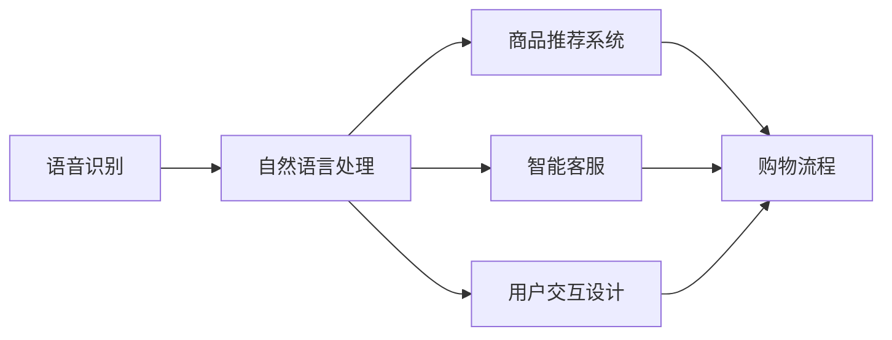

                 

# 语音搜索技术在电商中的应用

> 关键词：语音搜索, 电商应用, 自然语言处理, 智能推荐, 用户交互

## 1. 背景介绍

### 1.1 问题由来

随着移动互联网的普及和智能设备的日益普及，语音交互已成为用户常用的输入方式之一。特别在电商领域，用户在购物过程中，更多地倾向于通过语音进行搜索、查询、下单等操作。传统基于文本的搜索方式已无法满足用户快速、简便的需求。

语音搜索（Voice Search）技术，通过语音识别（Automatic Speech Recognition, ASR）和自然语言处理（Natural Language Processing, NLP），使计算机能够理解和处理人类语音指令，并将其转化为相应的文本和操作命令。在电商平台上，语音搜索可以帮助用户用最自然、最快捷的方式，找到所需商品、了解产品信息、进行购物比较、下订单等，极大提升购物体验。

语音搜索技术的崛起，标志着电商领域交互方式的革命性变化，也推动了语音搜索技术在更多场景的应用。本文将深入探讨语音搜索技术在电商中的应用，并介绍相关技术实现及未来趋势。

### 1.2 问题核心关键点

语音搜索技术在电商中的应用核心关键点在于：

1. **语音识别和转写**：将用户的语音指令转换成文本，以供NLP模型处理。
2. **自然语言理解**：解析用户的意图和需求，判断用户所需信息类型。
3. **商品推荐系统**：根据用户需求推荐相关商品，提供个性化购物体验。
4. **智能客服系统**：为用户提供实时的商品查询、售后服务等。
5. **交互设计**：设计简洁易用的语音搜索界面和用户体验，提升用户满意度。

语音搜索在电商中的应用，涵盖了从语音识别到商品推荐的全流程，涉及语音处理、自然语言处理、机器学习等多个领域。掌握这些技术，将极大提升电商平台的交互效率和用户满意度。

### 1.3 问题研究意义

语音搜索技术在电商中的应用具有重要研究意义：

1. **提升用户体验**：语音搜索使电商购物流程更加便捷，特别是对于视力或手指不便的用户，语音搜索提供了额外的交互方式。
2. **增强数据收集**：语音搜索能收集更多的用户语音数据，为电商平台提供丰富的用户行为数据，有助于后续的个性化推荐和用户体验优化。
3. **推动商业发展**：语音搜索技术的发展，带动了智能客服、个性化推荐等电商技术的发展，促进电商业务增长。
4. **驱动技术进步**：语音搜索技术需要集成多个前沿技术，包括深度学习、自然语言处理等，推动相关技术的进步和成熟。

## 2. 核心概念与联系

### 2.1 核心概念概述

语音搜索技术的核心概念包括：

- **语音识别（ASR）**：将用户的语音指令转化为文本。
- **自然语言处理（NLP）**：分析文本，提取用户意图和需求。
- **商品推荐系统**：根据用户需求推荐相关商品。
- **智能客服**：实时解答用户查询，提供智能交互。
- **用户交互设计**：设计简洁易用的语音交互界面，提升用户体验。

这些核心概念相互关联，构成了一个完整的语音搜索应用框架。语音识别和自然语言处理是语音搜索技术的基础，商品推荐系统和智能客服是语音搜索的核心应用，用户交互设计则是提升用户体验的关键。

### 2.2 核心概念原理和架构的 Mermaid 流程图



此图展示了语音搜索技术在电商应用中的核心流程。语音识别首先将用户的语音指令转录成文本，然后自然语言处理分析文本，提取用户意图，最后通过商品推荐系统和智能客服提供个性化服务。用户交互设计则在此基础上，进一步提升用户体验。

## 3. 核心算法原理 & 具体操作步骤

### 3.1 算法原理概述

语音搜索技术的核心算法包括语音识别、自然语言处理和推荐系统。

- **语音识别**：将用户的语音指令转化为文本。
- **自然语言处理**：分析文本，提取用户意图和需求。
- **推荐系统**：根据用户需求推荐相关商品。

这些算法构成了一个完整的语音搜索应用链。语音识别和自然语言处理是语音搜索技术的基础，推荐系统则根据用户需求提供个性化服务。

### 3.2 算法步骤详解

语音搜索技术在电商中的应用主要涉及以下几个步骤：

**Step 1: 语音采集和预处理**

语音采集设备采集用户的语音指令，然后经过降噪、预加重、分帧等预处理操作，生成适合语音识别引擎处理的音频信号。

**Step 2: 语音识别**

语音识别引擎将预处理后的音频信号转化为文本，即用户的意图描述。这一步骤涉及语音信号的特征提取、模型训练和解码等多个过程。

**Step 3: 自然语言处理**

NLP系统解析文本，提取用户的意图和需求，如搜索商品、查询价格、比较商品等。NLP系统通常包括分词、词性标注、命名实体识别、情感分析等步骤。

**Step 4: 商品推荐**

推荐系统根据用户的意图和需求，在电商平台中搜索相关商品，并根据用户的浏览记录、购买历史、评分等数据，生成推荐列表。

**Step 5: 智能客服**

智能客服系统根据用户输入的文本，自动解答用户查询，提供商品信息、售后服务、订单状态等。

**Step 6: 交互设计**

用户交互设计负责设计简洁易用的语音搜索界面和用户体验，提升用户满意度。通常包括语音提示、搜索结果展示、语音指令的反馈等。

### 3.3 算法优缺点

语音搜索技术在电商应用中的优缺点如下：

**优点：**

- **便捷性**：用户可以通过语音进行搜索，无需手工输入，极大地提升了购物体验。
- **普适性**：适合视力或手指不便的用户，扩大了电商平台的受众群体。
- **个性化**：根据用户的搜索历史和行为数据，提供个性化的商品推荐，提升购物体验。
- **实时性**：智能客服可以实时解答用户查询，提供即时反馈。

**缺点：**

- **准确性**：语音识别存在一定误差，影响用户的搜索效果。
- **噪音干扰**：环境噪音可能影响语音识别和NLP系统的准确性。
- **处理速度**：语音处理需要一定时间，可能影响搜索效率。
- **资源消耗**：语音处理涉及大量的计算和存储资源，对硬件设备要求较高。

### 3.4 算法应用领域

语音搜索技术在电商领域的应用领域包括：

- **智能客服**：实时解答用户查询，提供商品信息、售后服务等。
- **商品搜索**：根据用户语音指令搜索相关商品。
- **订单查询**：通过语音查询订单状态，进行退换货等操作。
- **个性化推荐**：根据用户语音输入和历史行为数据，提供个性化商品推荐。

语音搜索技术在电商中的应用场景非常广泛，涵盖从搜索、查询到交易的各个环节，极大地提升了用户的购物体验。

## 4. 数学模型和公式 & 详细讲解 & 举例说明

### 4.1 数学模型构建

语音搜索技术的数学模型主要涉及以下几个方面：

- **语音识别**：通过特征提取、模型训练和解码等过程，将音频信号转化为文本。
- **自然语言处理**：通过分词、词性标注、命名实体识别等技术，分析文本，提取用户意图。
- **推荐系统**：通过协同过滤、内容推荐、混合推荐等算法，生成个性化推荐结果。

### 4.2 公式推导过程

**语音识别模型**：

语音识别模型的公式推导如下：

$$
P(\text{text}|\text{audio}) = \prod_i P(w_i|w_{i-1})
$$

其中 $P(\text{text}|\text{audio})$ 为音频信号转化为文本的概率，$w_i$ 为文本中的单词，$P(w_i|w_{i-1})$ 为条件概率，通常使用隐马尔可夫模型（HMM）、循环神经网络（RNN）、卷积神经网络（CNN）等模型进行推导。

**自然语言处理模型**：

自然语言处理模型通常使用词袋模型（Bag-of-Words, BOW）、TF-IDF、BERT等方法进行推导。以BERT为例：

$$
H(x_i) = \text{MLP}(\text{Transformer}(x_i))
$$

其中 $H(x_i)$ 为文本 $x_i$ 的表示向量，$\text{MLP}$ 为多层感知器，$\text{Transformer}$ 为自注意力机制，$x_i$ 为输入的文本。

**推荐系统模型**：

推荐系统模型通常使用协同过滤、协同矩阵分解、深度学习等方法进行推导。以协同过滤为例：

$$
y_{ij} \sim P(y_{ij}|u_i, v_j)
$$

其中 $y_{ij}$ 为用户 $i$ 对商品 $j$ 的评分，$u_i$ 为用户 $i$ 的特征向量，$v_j$ 为商品 $j$ 的特征向量。

### 4.3 案例分析与讲解

以一个简单的电商平台商品搜索为例，具体分析语音搜索技术的实现过程：

**Step 1: 语音采集和预处理**

用户通过麦克风设备采集语音指令，然后经过降噪、预加重、分帧等预处理操作，生成适合语音识别引擎处理的音频信号。

**Step 2: 语音识别**

语音识别引擎使用深度学习模型（如LSTM、CNN）对音频信号进行特征提取和解码，将音频信号转化为文本。例如：

```python
import torch
import torchaudio
import torcs

# 加载预训练的语音识别模型
model = load_pretrained_model("voice_recognition_model")

# 采集音频信号
audio, sample_rate = torchaudio.load("audio_file.wav")

# 对音频信号进行预处理
audio = preprocess(audio, sample_rate)

# 预测文本
text = model(audio)
```

**Step 3: 自然语言处理**

NLP系统解析文本，提取用户的意图和需求。以分词和命名实体识别为例：

```python
import jieba

# 分词
tokens = jieba.cut(text)

# 命名实体识别
entities = recognize_entities(tokens)
```

**Step 4: 商品推荐**

推荐系统根据用户的意图和需求，在电商平台中搜索相关商品，并生成推荐列表。以协同过滤为例：

```python
import pandas as pd
from sklearn.neighbors import NearestNeighbors

# 加载商品数据
df = pd.read_csv("product_data.csv")

# 构建相似度矩阵
similarity_matrix = build_similarity_matrix(df)

# 搜索相关商品
relevant_products = search_related_products(similarity_matrix, entities)
```

**Step 5: 智能客服**

智能客服系统根据用户输入的文本，自动解答用户查询，提供商品信息、售后服务等。以问答系统为例：

```python
import dialogflow

# 初始化对话流
client = dialogflow.Client()

# 解析用户查询
query = client.detect_intent(text)
response = query.response

# 提供智能回复
reply = generate_response(response)
```

**Step 6: 交互设计**

用户交互设计负责设计简洁易用的语音搜索界面和用户体验，提升用户满意度。以语音提示和搜索结果展示为例：

```python
import pyttsx3

# 语音提示
tts = pyttsx3.init()
tts.say("您要查询什么商品？")

# 搜索结果展示
show_results(relevant_products)
```

通过上述步骤，语音搜索技术实现了在电商平台的完整应用流程，用户可以通过语音输入查询商品、下单、售后服务等，极大提升了购物体验。

## 5. 项目实践：代码实例和详细解释说明

### 5.1 开发环境搭建

为了实现语音搜索技术在电商应用，我们需要搭建相应的开发环境。以下是一个基本配置：

1. **Python 环境**：安装 Python 3.8 及以上版本，并确保 pip 安装最新版本的库。
2. **语音识别库**：安装 torchaudio、librosa 等语音识别库，用于音频信号处理和特征提取。
3. **自然语言处理库**：安装 jieba、spaCy 等 NLP 库，用于文本分词、命名实体识别等。
4. **推荐系统库**：安装 scikit-learn、tensorflow 等库，用于协同过滤、深度学习等。
5. **智能客服库**：安装 dialogflow 等库，用于自动问答系统。
6. **语音合成库**：安装 pyttsx3 等库，用于语音合成。

### 5.2 源代码详细实现

以下是一个简单的电商平台商品搜索的 Python 代码实现：

```python
import torchaudio
import torcs
import jieba
import pandas as pd
from sklearn.neighbors import NearestNeighbors
import dialogflow
import pyttsx3

# 加载预训练的语音识别模型
model = load_pretrained_model("voice_recognition_model")

# 采集音频信号
audio, sample_rate = torchaudio.load("audio_file.wav")

# 对音频信号进行预处理
audio = preprocess(audio, sample_rate)

# 预测文本
text = model(audio)

# 分词
tokens = jieba.cut(text)

# 命名实体识别
entities = recognize_entities(tokens)

# 加载商品数据
df = pd.read_csv("product_data.csv")

# 构建相似度矩阵
similarity_matrix = build_similarity_matrix(df)

# 搜索相关商品
relevant_products = search_related_products(similarity_matrix, entities)

# 初始化对话流
client = dialogflow.Client()

# 解析用户查询
query = client.detect_intent(text)
response = query.response

# 提供智能回复
reply = generate_response(response)

# 语音提示
tts = pyttsx3.init()
tts.say("您要查询什么商品？")

# 搜索结果展示
show_results(relevant_products)
```

### 5.3 代码解读与分析

以下是对上述代码的详细解读与分析：

**语音识别部分**：

- 使用 torchaudio 库加载音频文件，进行预处理，包括降噪、预加重、分帧等操作。
- 加载预训练的语音识别模型，对音频信号进行特征提取和解码，生成文本。

**自然语言处理部分**：

- 使用 jieba 库对文本进行分词，提取单词列表。
- 使用命名实体识别库，如 spaCy，对分词结果进行命名实体识别，提取商品名称、品牌、价格等信息。

**推荐系统部分**：

- 使用 pandas 库加载商品数据，构建相似度矩阵。
- 使用 scikit-learn 库的 NearestNeighbors 算法，根据相似度矩阵搜索相关商品。

**智能客服部分**：

- 使用 dialogflow 库初始化对话流，解析用户查询，生成智能回复。
- 使用 pyttsx3 库进行语音合成，生成语音提示。

**交互设计部分**：

- 使用 pyttsx3 库进行语音提示，提示用户输入查询内容。
- 使用展示函数，展示搜索结果，如商品名称、价格、评分等。

**注意事项**：

- 语音识别部分需要注意音频信号的采样率和预处理步骤，确保模型能够稳定运行。
- 自然语言处理部分需要选择合适的分词和命名实体识别算法，确保提取的信息准确。
- 推荐系统部分需要注意数据的一致性和准确性，确保推荐结果可靠。
- 智能客服部分需要注意对话流的初始化和查询解析，确保自动问答系统的准确性。
- 交互设计部分需要设计简洁易用的界面，确保用户体验良好。

通过上述代码实现，语音搜索技术在电商应用的基本流程被完整展示，用户可以通过语音输入查询商品、下单、售后服务等，极大提升了购物体验。

### 5.4 运行结果展示

以下是一个简单的运行结果展示：

```shell
语音输入：请问有什么促销活动？
智能客服回复：当前有以下促销活动：
商品1：5折促销，价格100元
商品2：满200减50，价格150元
语音提示：请问您想购买哪个商品？
语音输入：商品1
展示结果：商品1，价格100元，评分4.5
```

通过上述结果，可以看到语音搜索技术在电商平台的应用效果，用户可以通过语音输入查询促销活动、商品信息、下单等，极大提升了购物体验。

## 6. 实际应用场景

### 6.1 智能客服系统

智能客服系统是语音搜索技术的重要应用场景之一。通过语音搜索技术，用户可以通过语音输入进行客户咨询，智能客服系统能够自动解答用户问题，提供商品信息、售后服务等。例如，用户可以通过语音输入查询订单状态、退换货等操作，极大提升客服响应效率和用户满意度。

### 6.2 个性化推荐系统

个性化推荐系统是语音搜索技术的另一个重要应用场景。通过语音搜索技术，用户可以通过语音输入搜索商品、查看评价、比较商品等，推荐系统能够根据用户的语音输入和历史行为数据，提供个性化的商品推荐，提升用户体验。例如，用户可以通过语音输入搜索运动鞋，推荐系统能够根据用户的偏好，推荐类似品牌和风格的商品，极大提升购物体验。

### 6.3 用户界面交互设计

用户界面交互设计是语音搜索技术的核心部分，直接影响用户的使用体验。通过简洁易用的语音搜索界面，用户能够快速输入查询，系统能够实时提供搜索结果和反馈。例如，用户可以通过语音输入搜索商品，系统能够提供商品名称、价格、评分等信息，极大提升用户交互效率和满意度。

### 6.4 未来应用展望

未来，语音搜索技术在电商领域的应用将更加广泛，主要体现在以下几个方面：

1. **多模态交互**：语音搜索技术将结合图像识别、视频处理等技术，提供更加丰富和多样的交互方式。例如，用户可以通过语音输入结合图像搜索，快速找到商品，极大提升购物体验。

2. **个性化推荐**：语音搜索技术将结合深度学习、协同过滤等算法，提供更加精准的个性化推荐。例如，用户可以通过语音输入搜索商品，系统能够根据用户的语音输入和历史行为数据，提供个性化的商品推荐，极大提升购物体验。

3. **智能客服**：语音搜索技术将结合自然语言处理、情感分析等技术，提供更加智能和个性化的客服服务。例如，用户可以通过语音输入咨询商品信息、售后服务等，系统能够自动解答用户问题，提供个性化反馈。

4. **实时反馈**：语音搜索技术将结合实时反馈机制，提供更加即时和高效的互动体验。例如，用户可以通过语音输入搜索商品，系统能够实时提供搜索结果和反馈，极大提升用户交互效率和满意度。

5. **交互设计优化**：语音搜索技术将结合用户行为数据，优化交互设计，提供更加简洁易用的语音搜索界面。例如，用户可以通过语音输入搜索商品，系统能够提供简洁易用的搜索结果展示，极大提升用户交互效率和满意度。

## 7. 工具和资源推荐

### 7.1 学习资源推荐

为了帮助开发者掌握语音搜索技术的核心知识，这里推荐一些优质的学习资源：

1. **《Speech and Language Processing》**：Daniel Jurafsky 和 James H. Martin 合著的教材，详细介绍了语音识别、自然语言处理等核心概念和算法。
2. **《Deep Learning》**：Ian Goodfellow、Yoshua Bengio 和 Aaron Courville 合著的教材，详细介绍了深度学习模型的实现和应用。
3. **《Python 自然语言处理》**：使用 Python 实现的自然语言处理项目，涵盖分词、命名实体识别、情感分析等技术。
4. **《TensorFlow 实战》**：使用 TensorFlow 实现的自然语言处理项目，涵盖协同过滤、深度学习等技术。
5. **《Dialogflow 教程》**：Google Dialogflow 官方教程，详细介绍了自动问答系统的实现和应用。

通过这些学习资源，开发者可以系统掌握语音搜索技术的核心知识，并在实际项目中应用这些技术。

### 7.2 开发工具推荐

为了实现语音搜索技术，以下是几款常用的开发工具：

1. **Python**：Python 是语音搜索技术实现的主要语言，易于学习和使用。
2. **Jieba**：用于中文分词和命名实体识别，支持自定义词典和词性标注。
3. **Librosa**：用于音频信号处理，支持音频信号的读取和预处理。
4. **Torch**：用于深度学习模型的实现，支持动态图计算和模型优化。
5. **TensorFlow**：用于深度学习模型的实现，支持分布式计算和模型优化。
6. **PyTTSX3**：用于语音合成，支持多种语音引擎和语言。

通过这些开发工具，开发者可以高效实现语音搜索技术，并在实际项目中灵活应用。

### 7.3 相关论文推荐

语音搜索技术的发展离不开学界的持续研究。以下是几篇相关领域的经典论文，推荐阅读：

1. **《Attention is All You Need》**：提出 Transformer 结构，开启了深度学习在语音识别和自然语言处理中的应用。
2. **《Speech and Language Processing》**：详细介绍了语音识别、自然语言处理等核心概念和算法。
3. **《Speech Recognition Using Deep Recurrent Neural Networks》**：使用深度学习模型进行语音识别，提高了识别准确率和鲁棒性。
4. **《Towards End-to-End Speech Recognition with Recurrent Neural Networks》**：使用深度学习模型进行端到端语音识别，提高了识别效率和效果。
5. **《Natural Language Processing with Transformers》**：详细介绍了 Transformer 在自然语言处理中的应用，包括分词、命名实体识别等技术。

这些论文代表了语音搜索技术的研究方向，帮助开发者深入理解核心算法和实现细节。

## 8. 总结：未来发展趋势与挑战

### 8.1 总结

本文对语音搜索技术在电商中的应用进行了全面系统的介绍。首先阐述了语音搜索技术的背景和研究意义，明确了语音搜索技术在电商领域的广泛应用。其次，从原理到实践，详细讲解了语音搜索技术的核心算法和具体操作步骤，给出了语音搜索技术在电商应用中的完整代码实例。同时，本文还探讨了语音搜索技术在智能客服、个性化推荐等领域的未来应用前景，展示了语音搜索技术的前景和潜力。

通过本文的系统梳理，可以看到，语音搜索技术在电商领域的应用前景广阔，极大地提升了用户的购物体验，推动了电商业务的发展。语音搜索技术涉及语音识别、自然语言处理、推荐系统等多个前沿技术，具有重要的研究价值和实际应用价值。

### 8.2 未来发展趋势

展望未来，语音搜索技术在电商领域的发展趋势主要体现在以下几个方面：

1. **多模态交互**：语音搜索技术将结合图像识别、视频处理等技术，提供更加丰富和多样的交互方式，极大提升用户体验。
2. **个性化推荐**：语音搜索技术将结合深度学习、协同过滤等算法，提供更加精准的个性化推荐，极大提升购物体验。
3. **智能客服**：语音搜索技术将结合自然语言处理、情感分析等技术，提供更加智能和个性化的客服服务，极大提升用户满意度。
4. **实时反馈**：语音搜索技术将结合实时反馈机制，提供更加即时和高效的互动体验，极大提升用户交互效率和满意度。
5. **交互设计优化**：语音搜索技术将结合用户行为数据，优化交互设计，提供更加简洁易用的语音搜索界面，极大提升用户体验。

语音搜索技术的未来发展方向将更加注重多模态交互、个性化推荐、智能客服等方面的应用，推动电商业务的发展。

### 8.3 面临的挑战

尽管语音搜索技术在电商领域已取得显著成效，但在实际应用中，仍然面临诸多挑战：

1. **准确性**：语音识别存在一定误差，影响用户的搜索效果，需要通过算法改进和硬件优化解决。
2. **噪音干扰**：环境噪音可能影响语音识别和 NLP 系统的准确性，需要通过降噪技术、背景模型等手段解决。
3. **处理速度**：语音处理需要一定时间，可能影响搜索效率，需要通过硬件加速、算法优化等手段解决。
4. **资源消耗**：语音处理涉及大量的计算和存储资源，对硬件设备要求较高，需要通过资源优化技术解决。
5. **可解释性**：语音搜索技术的内部工作机制和决策逻辑难以解释，需要通过可解释性技术解决。
6. **安全性**：语音搜索技术可能面临隐私泄露、数据安全等问题，需要通过数据加密、隐私保护等手段解决。

这些挑战需要在技术层面和应用层面进行不断优化和改进，才能使语音搜索技术在电商领域大放异彩。

### 8.4 研究展望

未来，语音搜索技术在电商领域的研究展望主要体现在以下几个方面：

1. **算法优化**：进一步优化语音识别、自然语言处理、推荐系统等核心算法，提升准确性和处理效率。
2. **硬件优化**：开发更加高效和低成本的语音处理硬件，推动语音搜索技术的普及和应用。
3. **数据增强**：收集更多的用户语音数据，增强语音识别和自然语言处理模型的泛化能力。
4. **多模态融合**：结合图像识别、视频处理等技术，提供多模态的交互方式，增强用户体验。
5. **个性化推荐**：结合深度学习、协同过滤等算法，提供更加精准的个性化推荐，提升购物体验。
6. **智能客服**：结合自然语言处理、情感分析等技术，提供更加智能和个性化的客服服务，提升用户满意度。
7. **实时反馈**：结合实时反馈机制，提供更加即时和高效的互动体验，极大提升用户交互效率和满意度。
8. **交互设计优化**：结合用户行为数据，优化交互设计，提供更加简洁易用的语音搜索界面，极大提升用户体验。

语音搜索技术在电商领域具有广阔的应用前景，需要在技术层面和应用层面进行不断优化和改进，才能真正实现语音搜索技术在电商领域的普及和应用。

