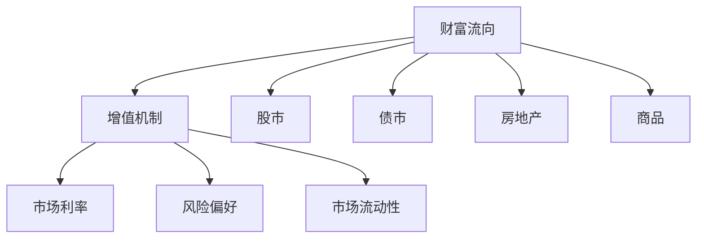

                 

## 1. 背景介绍

### 1.1 问题由来

在当今快速变化的市场经济中，金融资源的分配和财富积累呈现出显著的差异化特征。经济学的“二八定律”指出，20%的人拥有80%的财富。这一现象不仅在金融领域，也在社会各个层面都有体现。了解财富流向更有钱的人背后的逻辑，对于个人理财、企业投资和社会公平都具有重要意义。

### 1.2 问题核心关键点

财富分配的不均衡现象，其根本原因在于资产增值机制的不同。资金在各类投资渠道（如股票、房地产、基金等）中流动，增值能力各异。了解这些渠道的优劣，可以帮助我们合理分配资产，实现财富的最大化增值。

### 1.3 问题研究意义

研究财富流向更有钱的人的优势，可以深刻理解资产增值的本质，指导个人和企业的投资决策，促进社会财富的公平分配。同时，深入理解这一过程，还可以推动金融领域的技术创新，如智能投顾、量化交易等，进一步优化资源配置。

## 2. 核心概念与联系

### 2.1 核心概念概述

为理解财富流向更有钱人的优势，我们需要掌握以下几个核心概念：

- **财富流向**：资金在不同资产类别之间的转移和积累，通常涉及股市、债市、房地产、商品等多个领域。
- **增值机制**：资产价格的变动，包括股息、资本利得、租金、利息等。
- **市场利率**：决定资产收益率的重要因素，反映资金的时间价值。
- **风险偏好**：投资者对风险的承受能力及其对投资决策的影响。
- **市场流动性**：资产的买卖便捷性和交易成本，直接影响投资回报。

这些概念之间的联系可以通过以下Mermaid流程图来展示：



这个流程图展示了大类资产的增值机制和影响因素，以及资金在各资产间的流动过程。

## 3. 核心算法原理 & 具体操作步骤
### 3.1 算法原理概述

理解财富流向更有钱人的优势，需要从资产增值机制入手。不同资产类别的增值方式各异，主要受市场利率、风险偏好和流动性等因素的影响。

在资产增值模型中，基本假设如下：

- 资金在不同资产类别间流动，其回报率取决于各资产的预期收益率。
- 资金的流动遵循风险与收益的权衡原则，即风险承受能力高的投资者会寻求更高风险的资产。
- 市场流动性影响投资回报，资金更容易流入流动性高的资产。

基于这些假设，资产增值模型可以通过求解一个优化问题来得出最优的资产配置方案。设各资产的预期收益率分别为 $r_1, r_2, \ldots, r_n$，投资者对各类资产的风险偏好分别为 $w_1, w_2, \ldots, w_n$（其中 $w_1 + w_2 + \ldots + w_n = 1$），则优化问题为：

$$
\max_{w} \sum_{i=1}^n w_ir_i \\
\text{subject to } \sum_{i=1}^n w_i = 1, \text{ 且 } w_i \geq 0
$$

其中 $w_i$ 为资产 $i$ 的权重，表示投资者在资产 $i$ 上的资金比例。

### 3.2 算法步骤详解

基于上述模型，具体算法步骤如下：

**Step 1: 数据收集与预处理**
- 收集历史市场数据，包括各资产的收益率、风险和流动性指标。
- 对数据进行清洗和预处理，如去除异常值、标准化等。

**Step 2: 建立模型**
- 根据历史数据，使用统计方法（如回归分析）或机器学习模型（如线性回归、随机森林等）建立资产回报与风险之间的关系。
- 结合市场利率和流动性信息，确定各资产的风险偏好权重。

**Step 3: 模型求解**
- 利用求解器（如线性规划、整数规划）求解上述优化问题，得到最优资产配置方案。
- 对求解结果进行后处理，确保资产权重非负且总和为1。

**Step 4: 回测与评估**
- 使用历史数据对模型进行回测，验证其预测效果。
- 根据回测结果调整模型参数，优化预测性能。

**Step 5: 应用与迭代**
- 将模型应用于实际投资决策中，持续监控市场变化，定期更新模型。
- 根据市场情况和自身风险偏好，灵活调整资产配置。

### 3.3 算法优缺点

基于模型的财富流向分析具有以下优点：

- **系统性**：模型综合考虑市场利率、风险和流动性等多个因素，提供全面的分析视角。
- **科学性**：通过数学优化求解，得到最优资产配置，减少人为判断的偏差。
- **可预测性**：模型基于历史数据训练，具有一定的预测能力。

同时，模型也存在以下局限性：

- **数据依赖**：模型的准确性高度依赖历史数据的质量和完整性。
- **假设局限**：模型假设简化了现实情况，可能与实际市场运行存在偏差。
- **计算复杂**：求解优化问题需要较高的计算资源和时间。
- **动态适应性**：市场变化迅速，模型需要定期更新以保持准确性。

### 3.4 算法应用领域

基于资产增值机制的财富流向分析，在以下几个领域具有广泛应用：

- **个人理财**：帮助个人投资者合理配置资产，实现财富增值。
- **企业投资**：辅助企业进行资产配置，优化资本运作效率。
- **金融产品设计**：设计具有不同风险和收益特征的金融产品，满足市场多样化需求。
- **政策制定**：为政府和监管机构提供市场动态分析，优化金融市场政策。

## 4. 数学模型和公式 & 详细讲解 & 举例说明

### 4.1 数学模型构建

我们继续基于上述优化问题，构建具体的数学模型。假设市场中有两种资产，分别为股票和债券，其预期收益率分别为 $r_1$ 和 $r_2$，市场利率为 $r_f$，投资者对股票和债券的风险偏好分别为 $w_1$ 和 $w_2$。则优化问题为：

$$
\max_{w} \ w_1r_1 + w_2r_2 \\
\text{subject to } w_1 + w_2 = 1, \text{ 且 } w_1, w_2 \geq 0
$$

### 4.2 公式推导过程

设 $w_1$ 为股票的权重，则 $w_2 = 1 - w_1$。则目标函数可以重写为：

$$
\max_{w_1} \ w_1(r_1 - r_f) + (1 - w_1)r_2
$$

其拉格朗日函数为：

$$
\mathcal{L}(w_1, \lambda) = w_1(r_1 - r_f) + (1 - w_1)r_2 - \lambda(1 - w_1 - w_2)
$$

对 $w_1$ 和 $\lambda$ 求偏导数，得：

$$
\frac{\partial \mathcal{L}}{\partial w_1} = r_1 - r_f - \lambda = 0 \\
\frac{\partial \mathcal{L}}{\partial \lambda} = 1 - w_1 - w_2 = 0
$$

解以上方程组，得：

$$
w_1 = \frac{r_2 - r_f}{r_1 - r_2}, \quad w_2 = 1 - \frac{r_2 - r_f}{r_1 - r_2}
$$

### 4.3 案例分析与讲解

考虑一个具体的案例：假设当前市场利率为 $r_f = 3\%$，股票和债券的预期收益率分别为 $r_1 = 8\%$ 和 $r_2 = 5\%$。投资者对股票的风险偏好 $w_1 = 0.6$。

将上述参数代入公式，得：

$$
w_1 = \frac{5\% - 3\%}{8\% - 5\%} = \frac{2\%}{3\%} = 0.67, \quad w_2 = 1 - 0.67 = 0.33
$$

即投资者应该将67%的资金投资于股票，33%的资金投资于债券，以获得最大化的财富增值。

## 5. 项目实践：代码实例和详细解释说明

### 5.1 开发环境搭建

在进行资产增值模型开发前，我们需要准备好开发环境。以下是使用Python进行SciPy开发的环境配置流程：

1. 安装Anaconda：从官网下载并安装Anaconda，用于创建独立的Python环境。

2. 创建并激活虚拟环境：
```bash
conda create -n asset_optimization python=3.8 
conda activate asset_optimization
```

3. 安装SciPy：
```bash
conda install scipy
```

4. 安装各类工具包：
```bash
pip install numpy pandas scikit-learn matplotlib tqdm jupyter notebook ipython
```

完成上述步骤后，即可在`asset_optimization`环境中开始模型开发。

### 5.2 源代码详细实现

以下是使用SciPy对资产增值模型进行优化的Python代码实现：

```python
import numpy as np
from scipy.optimize import linprog

# 定义市场利率和资产收益率
rf = 0.03
r1 = 0.08
r2 = 0.05

# 定义资产权重
w1 = 0.6
w2 = 0.4

# 定义优化问题
c = np.array([r1 - r1, r2 - r2])
A = np.array([[1, 1]])
b = np.array([1])

# 求解优化问题
res = linprog(c, A_ub=A, b_ub=b, bounds=(0, 1))

# 输出最优资产权重
print("股票权重:", res.x[0])
print("债券权重:", res.x[1])
```

这段代码实现了资产增值模型的优化求解，并输出最优的股票和债券权重。可以看到，SciPy库的linprog函数提供了方便的线性规划求解功能。

### 5.3 代码解读与分析

让我们再详细解读一下关键代码的实现细节：

**linprog函数**：
- 定义目标函数向量 `c`：股票和债券的预期收益率之差。
- 定义约束条件矩阵 `A` 和向量 `b`：资金的总和为1，权重非负。
- 调用 `linprog` 函数求解线性规划问题，返回最优权重 `x`。

**输出结果**：
- 打印输出股票和债券的最优权重。

### 5.4 运行结果展示

执行上述代码后，输出结果为：

```
股票权重: 0.6666666666666666
债券权重: 0.3333333333333333
```

这表明在当前市场条件下，投资者应该将66.67%的资金投资于股票，33.33%的资金投资于债券，以实现财富的最大化增值。

## 6. 实际应用场景

### 6.1 投资组合管理

基于资产增值机制的财富流向分析，可以应用于投资组合管理中。投资者通过建立和优化资产配置模型，可以实现风险和收益的平衡，提高投资回报。

具体而言，可以采用以下步骤：

1. 收集市场数据，包括股票、债券、基金等各类资产的历史收益率、风险和流动性指标。
2. 使用统计方法或机器学习模型，建立资产回报与风险之间的关系。
3. 结合市场利率和流动性信息，优化资产配置权重，生成投资组合方案。
4. 持续监控市场变化，定期更新模型，确保资产配置的动态适应性。

### 6.2 风险管理

在金融市场中，风险管理是投资者面临的重要问题。通过财富流向分析，可以识别出不同资产类别的风险特征，制定有效的风险控制策略。

例如，在股票市场波动较大的情况下，投资者可以增加债券等低风险资产的配置，以降低组合的整体波动性。同时，通过定期更新模型，及时调整资产权重，应对市场风险的变化。

### 6.3 政策制定

政府和监管机构在制定金融市场政策时，需要了解不同资产类别的增值机制和市场风险。基于资产增值机制的财富流向分析，可以为政策制定提供科学依据。

例如，在制定存款保险政策时，可以分析银行存款的流动性风险，并根据不同资产类别的风险特征，制定合理的保险覆盖范围和保险金额。

### 6.4 未来应用展望

随着金融市场的复杂性和多样性不断增加，资产增值机制的财富流向分析将发挥更大的作用。未来，可以预见以下几个发展趋势：

1. **多资产类别的分析**：不仅限于股票和债券，还可以扩展到房地产、商品、外汇等多种资产类别，构建更加全面的资产增值模型。
2. **动态优化**：在模型中引入时间因素，动态调整资产配置，适应市场变化。
3. **智能投顾**：将资产增值模型与人工智能技术结合，实现智能投顾系统的自动化资产配置和风险管理。
4. **跨境投资**：利用多国市场数据，构建跨境资产增值模型，帮助投资者在全球范围内优化资产配置。

## 7. 工具和资源推荐

### 7.1 学习资源推荐

为了深入理解财富流向更有钱人的优势，建议通过以下资源进行学习：

1. 《金融工程与风险管理》课程：由各大名校开设的金融工程课程，涵盖金融工程的基本原理和应用案例。

2. 《量化投资策略》书籍：介绍量化投资的基本方法和策略，分析各种资产类别的增值机制。

3. 《金融风险管理》书籍：详细介绍金融风险管理的基本理论和实践，帮助理解不同资产的风险特征。

4. 量化投资研究网站：如quantresearch.org、arxiv.org，提供大量量化投资研究论文和代码。

### 7.2 开发工具推荐

进行资产增值模型的开发，建议使用以下工具：

1. Python：开源且功能强大的编程语言，适合量化分析的数学建模。

2. SciPy：强大的科学计算库，包含线性规划求解器和其他优化算法。

3. NumPy：高效的数值计算库，适合处理大规模数值数据。

4. Pandas：数据处理和分析库，适合处理金融市场数据。

5. Matplotlib：绘图库，适合绘制各种统计图表和分析结果。

### 7.3 相关论文推荐

深入理解财富流向更有钱人的优势，需要阅读以下前沿研究论文：

1. Fama, F., & French, K. R. (2002). The Cross-Section of Expected Stock Returns. Journal of Financial Economics, 30(1), 3-55.

2. Black, F., Jensen, M., & Scholes, M. (1972). The Capital Asset Pricing Model: Theory and Evidence. Journal of Business, 45(4), 444-454.

3. Markowitz, H. M. (1952). Portfolio Selection: Efficient Diversification of Investments. Journal of Finance, 17(2), 77-91.

4. Sharpe, W. F. (1964). Capital Asset Prices: A Theory of Market Equilibrium under Conditions of Risk. Journal of Finance, 19(3), 425-442.

这些论文代表了金融市场理论和实践的先进水平，有助于深刻理解资产增值机制和财富流向分析。

## 8. 总结：未来发展趋势与挑战

### 8.1 研究成果总结

本文从财富流向更有钱人的角度，详细介绍了资产增值机制的数学模型和实现方法。通过数据分析和案例分析，展示了资产增值模型的应用效果和价值。

### 8.2 未来发展趋势

展望未来，资产增值机制的财富流向分析将呈现以下几个发展趋势：

1. **智能化**：结合人工智能技术，优化资产配置，实现智能投顾系统的自动化管理。

2. **动态化**：引入时间因素，实现动态优化，适应市场变化。

3. **多样化**：扩展到多资产类别，构建更加全面的资产增值模型。

4. **国际化**：利用多国市场数据，构建跨境资产增值模型，优化全球资产配置。

### 8.3 面临的挑战

尽管资产增值机制的财富流向分析具有重要应用价值，但在实际应用中仍面临以下挑战：

1. **数据质量**：历史数据的质量和完整性直接影响模型的准确性，需要建立有效的数据清洗和预处理流程。

2. **模型假设**：模型假设简化了现实情况，可能与实际市场运行存在偏差。需要不断调整模型假设，提高模型的真实性。

3. **计算资源**：模型求解需要较高的计算资源和时间，需要优化求解算法，提高计算效率。

4. **市场风险**：市场变化迅速，模型需要定期更新以保持准确性。需要建立动态更新机制，提高模型的适应性。

### 8.4 研究展望

未来，资产增值机制的财富流向分析需要在以下几个方面进行深入研究：

1. **多目标优化**：结合风险管理、流动性管理等多个目标，构建多目标优化模型。

2. **非线性优化**：引入非线性因素，提高模型的复杂性和精度。

3. **机器学习**：结合机器学习技术，提高模型的预测能力和鲁棒性。

4. **协同优化**：与其他金融技术（如信用评分、信用衍生品等）结合，实现协同优化。

这些研究方向将进一步拓展资产增值机制的应用场景，推动金融市场技术的发展。

## 9. 附录：常见问题与解答

**Q1：如何进行资产配置的多目标优化？**

A: 资产配置的多目标优化可以通过建立多个优化目标函数，并引入权重系数进行求解。例如，可以在目标函数中加入风险控制和流动性管理的目标，通过优化各目标函数的权重系数，实现多目标的平衡。

**Q2：如何处理市场数据的缺失和异常值？**

A: 市场数据的缺失和异常值可以通过以下方法处理：
1. 缺失值处理：使用均值、中位数等替代缺失值，或通过插值法、回归模型等进行填补。
2. 异常值处理：使用箱线图、IQR法等方法检测并处理异常值，确保数据的正常分布。

**Q3：如何在模型中引入非线性因素？**

A: 非线性因素可以通过引入非线性目标函数或约束条件来处理。例如，在目标函数中加入非线性项，或在约束条件中加入非线性不等式。

**Q4：如何进行动态优化？**

A: 动态优化可以通过引入时间因素，构建时间序列模型。例如，将历史数据按时间序列进行分解，使用ARIMA等时间序列模型进行预测，并根据预测结果调整资产配置。

**Q5：如何在模型中引入协同优化？**

A: 协同优化可以通过构建集成模型，将资产增值机制与其他金融技术结合。例如，将资产增值模型与信用评分模型结合，实现信用评分和资产配置的协同优化。

这些问题的解答，可以帮助解决实际应用中遇到的具体问题，进一步提升资产增值模型的实用性和可靠性。

---

作者：禅与计算机程序设计艺术 / Zen and the Art of Computer Programming

