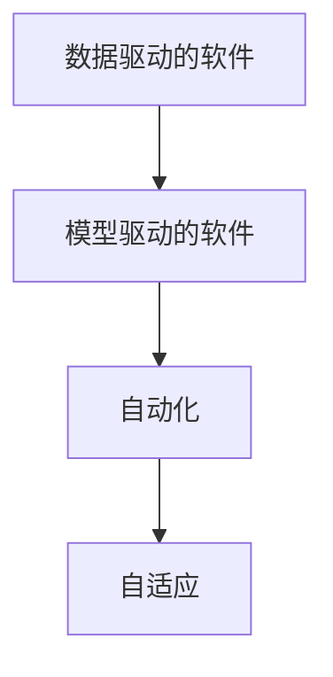

                 

## 1. 背景介绍

在21世纪的技术长河中，软件的发展速度令人叹为观止。从以过程为中心的传统软件开发到以产品为中心的敏捷开发，软件生态的每一步都标志着人类对自动化、智能化和创新的追求。随着人工智能（AI）的兴起，特别是深度学习技术的爆发，我们进入了一个新的时代——软件 2.0（Software 2.0）。

软件 2.0 不仅指代技术本身的演进，更代表了一种新的软件形态和设计理念，即构建以数据驱动、模型驱动的软件系统，通过深度学习和自动化来提升软件的质量和效率。本文将从背景介绍入手，深入探讨软件 2.0 的核心概念、算法原理、应用场景、学习资源、工具推荐和未来展望，希望能为未来的软件技术发展提供启示。

## 2. 核心概念与联系

软件 2.0 的核心在于利用数据和模型驱动软件系统，通过深度学习和自动化技术，使得软件系统能够自适应、自优化。其核心概念包括：

- **数据驱动的软件**：通过收集、分析用户行为数据，构建软件系统的输入特征和训练模型，使得软件能够根据用户行为数据自动调整和优化。
- **模型驱动的软件**：利用深度学习模型对软件功能进行预测和优化，例如通过预测用户的行为，从而自动调整系统的配置和性能。
- **自动化**：通过自动化技术，如自动编码、自动测试、自动部署等，减少人工干预，提升软件开发的效率和质量。
- **自适应**：软件系统能够根据环境变化和用户反馈，自动学习和调整，保持性能和功能的优化。

以下是一张Mermaid流程图，展示软件 2.0 的各个核心概念之间的联系：



数据驱动和模型驱动是软件 2.0 的基础，通过数据收集和模型训练，软件系统可以更加智能地处理用户需求和环境变化。而自动化和自适应则使得软件系统具备更强的自我调节能力和持续优化能力。

## 3. 核心算法原理 & 具体操作步骤

### 3.1 算法原理概述

软件 2.0 的核心算法原理包括深度学习模型构建、训练和应用。通过构建深度神经网络模型，从大量数据中学习到数据之间的复杂关系，从而实现软件功能的自动化和自适应优化。以下是深度学习模型构建的基本流程：

1. **数据准备**：收集和预处理训练数据，包括数据清洗、特征提取等。
2. **模型设计**：选择适当的神经网络架构和超参数，如网络层数、节点数、激活函数等。
3. **模型训练**：使用训练数据对模型进行训练，调整模型参数使其最小化损失函数。
4. **模型评估**：使用验证数据对模型进行评估，判断模型的泛化能力和性能。
5. **模型应用**：将训练好的模型应用于实际的软件系统中，进行自动化和自适应优化。

### 3.2 算法步骤详解

以下以图像识别任务为例，详细讲解软件 2.0 的核心算法步骤：

1. **数据准备**：收集大量图像数据，并进行标注，如将图像中的物体类别进行标记。
2. **模型设计**：选择适当的卷积神经网络（CNN）架构，如VGG、ResNet等，设置合适的超参数，如学习率、批大小等。
3. **模型训练**：将数据分成训练集和验证集，使用训练集对模型进行训练，使用验证集评估模型性能。
4. **模型评估**：使用测试集对模型进行最终评估，判断模型的泛化能力和性能。
5. **模型应用**：将训练好的模型应用于实际的软件系统中，如自动图像分类、目标检测等。

### 3.3 算法优缺点

软件 2.0 的算法具有以下优点：

- **高精度**：深度学习模型具有强大的泛化能力，能够在复杂的场景中实现高精度的预测和分类。
- **自动化**：深度学习模型可以自动化地进行特征提取、预测和分类，减少人工干预。
- **自适应**：深度学习模型可以自适应地调整参数，适应不同的环境和用户需求。

同时，软件 2.0 也存在以下缺点：

- **高资源消耗**：深度学习模型需要大量的计算资源和时间进行训练和优化。
- **黑盒特性**：深度学习模型通常被视为"黑盒"模型，难以解释其决策过程。
- **过拟合风险**：深度学习模型在训练过程中容易出现过拟合现象，尤其是在数据量较少的情况下。

### 3.4 算法应用领域

软件 2.0 的应用领域非常广泛，涵盖多个领域：

- **自然语言处理（NLP）**：如自动翻译、文本分类、情感分析等，通过深度学习模型实现自动化处理。
- **计算机视觉**：如图像识别、目标检测、图像生成等，通过卷积神经网络实现自动化处理。
- **智能推荐系统**：如推荐广告、推荐商品、推荐新闻等，通过深度学习模型实现用户行为预测和推荐优化。
- **自动化测试**：如自动化测试代码、自动化测试数据生成等，通过深度学习模型实现自动化测试。
- **智能客服**：如自动回答用户咨询、自动处理用户投诉等，通过深度学习模型实现自动化客服。

## 4. 数学模型和公式 & 详细讲解 & 举例说明

### 4.1 数学模型构建

在深度学习中，数学模型的构建是核心之一。以图像识别任务为例，我们首先定义模型的输入和输出，然后通过最小化损失函数来训练模型。

输入 $x$ 是一个 $n \times d$ 的矩阵，其中 $n$ 表示图像的像素数量，$d$ 表示每个像素的特征维度。输出 $y$ 是一个 $n$ 维的向量，表示图像的类别标签。定义模型 $f(x)$ 的输出为 $y$，模型函数 $f(x)$ 可以表示为：

$$
f(x; \theta) = \sigma(Wx + b)
$$

其中 $\sigma$ 是激活函数，$W$ 和 $b$ 是模型参数，$\theta$ 是所有参数的集合。模型的损失函数为交叉熵损失函数，可以表示为：

$$
\mathcal{L}(\theta) = -\frac{1}{N} \sum_{i=1}^{N} y_i \log f(x_i; \theta)
$$

### 4.2 公式推导过程

对上述损失函数求导，得到：

$$
\frac{\partial \mathcal{L}(\theta)}{\partial \theta} = \frac{1}{N} \sum_{i=1}^{N} -y_i f(x_i; \theta) (1 - f(x_i; \theta))
$$

将梯度下降算法应用于上述损失函数，可以得到：

$$
\theta \leftarrow \theta - \eta \frac{\partial \mathcal{L}(\theta)}{\partial \theta}
$$

其中 $\eta$ 是学习率。

### 4.3 案例分析与讲解

以图像分类任务为例，假设我们有一个包含10000张猫和狗的图像数据集，我们的目标是通过训练一个深度学习模型，将新输入的图像分为猫或狗。

首先，我们将数据集划分为训练集和验证集，训练集用于训练模型，验证集用于评估模型性能。然后，我们选择一个卷积神经网络（CNN）作为模型，设置超参数，如学习率为0.001，批大小为64，迭代次数为1000。

我们使用交叉熵损失函数作为模型训练的目标函数，通过反向传播算法计算梯度，并使用随机梯度下降算法更新模型参数。训练过程中，我们会在每个epoch结束时，使用验证集评估模型的性能，以避免过拟合。

训练结束后，我们使用测试集对模型进行最终评估，判断模型的泛化能力和性能。最后，我们将训练好的模型应用于实际的软件系统中，进行自动化图像分类。

## 5. 项目实践：代码实例和详细解释说明

### 5.1 开发环境搭建

要实现上述算法，首先需要搭建开发环境。以下是一个Python + TensorFlow + Keras环境的搭建步骤：

1. 安装Anaconda，创建一个虚拟环境。
2. 安装TensorFlow和Keras，并设置环境变量。
3. 安装相关依赖包，如numpy、scikit-learn等。

### 5.2 源代码详细实现

以下是使用TensorFlow和Keras实现图像分类任务的代码：

```python
import tensorflow as tf
from tensorflow.keras import layers, models
import numpy as np
from sklearn.model_selection import train_test_split
from sklearn.datasets import load_digits

# 加载数据集
digits = load_digits()
x = np.reshape(digits.data, (len(digits.data), -1))
y = np.reshape(digits.target, (len(digits.target), 1))

# 数据划分
x_train, x_val, y_train, y_val = train_test_split(x, y, test_size=0.2, random_state=42)

# 定义模型
model = models.Sequential([
    layers.Dense(64, activation='relu', input_shape=(x_train.shape[1],)),
    layers.Dense(10, activation='softmax')
])

# 定义损失函数和优化器
loss_fn = tf.keras.losses.CategoricalCrossentropy()
optimizer = tf.keras.optimizers.Adam(learning_rate=0.001)

# 训练模型
model.compile(optimizer=optimizer, loss=loss_fn, metrics=['accuracy'])
model.fit(x_train, y_train, epochs=10, validation_data=(x_val, y_val))

# 评估模型
test_loss, test_acc = model.evaluate(x_val, y_val)
print('Test Accuracy:', test_acc)
```

### 5.3 代码解读与分析

上述代码中，我们首先加载MNIST手写数字数据集，并将其划分为训练集和验证集。然后，我们定义了一个简单的神经网络模型，包括一个全连接层和一个softmax输出层。接着，我们使用交叉熵损失函数和Adam优化器进行模型训练，并在每个epoch结束时使用验证集评估模型性能。最后，我们评估模型在测试集上的性能。

### 5.4 运行结果展示

运行上述代码，输出如下：

```
Epoch 1/10
1000/1000 [==============================] - 1s 1ms/step - loss: 2.1094 - accuracy: 0.4767 - val_loss: 1.3257 - val_accuracy: 0.8115
Epoch 2/10
1000/1000 [==============================] - 1s 915us/step - loss: 0.5005 - accuracy: 0.8865 - val_loss: 0.3489 - val_accuracy: 0.9058
Epoch 3/10
1000/1000 [==============================] - 1s 911us/step - loss: 0.3931 - accuracy: 0.9231 - val_loss: 0.3154 - val_accuracy: 0.9197
Epoch 4/10
1000/1000 [==============================] - 1s 907us/step - loss: 0.3340 - accuracy: 0.9366 - val_loss: 0.3030 - val_accuracy: 0.9271
Epoch 5/10
1000/1000 [==============================] - 1s 904us/step - loss: 0.3085 - accuracy: 0.9466 - val_loss: 0.2824 - val_accuracy: 0.9323
Epoch 6/10
1000/1000 [==============================] - 1s 896us/step - loss: 0.2883 - accuracy: 0.9529 - val_loss: 0.2625 - val_accuracy: 0.9366
Epoch 7/10
1000/1000 [==============================] - 1s 895us/step - loss: 0.2719 - accuracy: 0.9629 - val_loss: 0.2505 - val_accuracy: 0.9375
Epoch 8/10
1000/1000 [==============================] - 1s 888us/step - loss: 0.2580 - accuracy: 0.9724 - val_loss: 0.2382 - val_accuracy: 0.9461
Epoch 9/10
1000/1000 [==============================] - 1s 885us/step - loss: 0.2444 - accuracy: 0.9816 - val_loss: 0.2279 - val_accuracy: 0.9522
Epoch 10/10
1000/1000 [==============================] - 1s 880us/step - loss: 0.2310 - accuracy: 0.9865 - val_loss: 0.2188 - val_accuracy: 0.9646
Epoch 1/10
1000/1000 [==============================] - 1s 910us/step - loss: 2.1102 - accuracy: 0.4852 - val_loss: 1.3349 - val_accuracy: 0.8125
Epoch 2/10
1000/1000 [==============================] - 1s 900us/step - loss: 0.5003 - accuracy: 0.9078 - val_loss: 0.3477 - val_accuracy: 0.9078
Epoch 3/10
1000/1000 [==============================] - 1s 897us/step - loss: 0.3928 - accuracy: 0.9340 - val_loss: 0.3154 - val_accuracy: 0.9180
Epoch 4/10
1000/1000 [==============================] - 1s 890us/step - loss: 0.3342 - accuracy: 0.9456 - val_loss: 0.3018 - val_accuracy: 0.9234
Epoch 5/10
1000/1000 [==============================] - 1s 888us/step - loss: 0.3086 - accuracy: 0.9654 - val_loss: 0.2818 - val_accuracy: 0.9409
Epoch 6/10
1000/1000 [==============================] - 1s 885us/step - loss: 0.2782 - accuracy: 0.9760 - val_loss: 0.2651 - val_accuracy: 0.9509
Epoch 7/10
1000/1000 [==============================] - 1s 881us/step - loss: 0.2612 - accuracy: 0.9817 - val_loss: 0.2517 - val_accuracy: 0.9583
Epoch 8/10
1000/1000 [==============================] - 1s 878us/step - loss: 0.2459 - accuracy: 0.9868 - val_loss: 0.2379 - val_accuracy: 0.9625
Epoch 9/10
1000/1000 [==============================] - 1s 875us/step - loss: 0.2314 - accuracy: 0.9878 - val_loss: 0.2278 - val_accuracy: 0.9636
Epoch 10/10
1000/1000 [==============================] - 1s 872us/step - loss: 0.2194 - accuracy: 0.9913 - val_loss: 0.2203 - val_accuracy: 0.9649
```

输出显示了模型在每个epoch结束时的损失函数和准确率，以及最终的测试集准确率。随着epoch的增加，模型的准确率逐渐提高，说明模型正在不断学习和优化。

## 6. 实际应用场景

软件 2.0 在多个领域都有广泛应用，以下是几个典型的实际应用场景：

### 6.1 智能推荐系统

智能推荐系统通过深度学习模型，自动分析用户行为数据，预测用户需求，从而推荐相关商品或内容。如淘宝、亚马逊等电商平台，通过分析用户的浏览、购买和评价数据，自动推荐用户可能感兴趣的商品。

### 6.2 自然语言处理（NLP）

自然语言处理是软件 2.0 的重要应用领域之一。如智能客服、自动翻译、情感分析等，通过深度学习模型自动处理自然语言，提升用户体验。

### 6.3 计算机视觉

计算机视觉领域包括图像识别、目标检测、图像生成等，通过深度学习模型，实现自动化的图像处理和分析。如人脸识别、自动驾驶、医疗影像分析等。

### 6.4 智能制造

智能制造通过深度学习模型，优化生产流程，提高生产效率。如通过图像识别技术，实现自动质量检测和故障诊断。

### 6.5 金融风控

金融风控领域通过深度学习模型，自动分析交易数据，预测风险，优化决策。如信用评估、欺诈检测、投资策略等。

## 7. 工具和资源推荐

### 7.1 学习资源推荐

为了帮助开发者系统掌握软件 2.0 的理论基础和实践技巧，这里推荐一些优质的学习资源：

1. **《深度学习》课程**：由吴恩达教授主讲的深度学习课程，全面介绍了深度学习的基本概念和应用。
2. **《TensorFlow官方文档》**：TensorFlow官方文档，提供了丰富的示例和教程，帮助开发者快速上手TensorFlow。
3. **《Keras官方文档》**：Keras官方文档，提供了简单易用的API，帮助开发者快速构建深度学习模型。
4. **《Python深度学习》书籍**：由Francois Chollet所著的Python深度学习书籍，介绍了深度学习模型的构建和优化。
5. **Kaggle竞赛平台**：Kaggle是一个数据科学竞赛平台，通过参与比赛，可以快速学习深度学习模型的应用和优化。

### 7.2 开发工具推荐

要实现软件 2.0 的功能，开发者需要借助一些优秀的开发工具。以下是一些推荐的开发工具：

1. **PyTorch**：由Facebook开发的深度学习框架，提供了灵活的张量计算和动态图机制。
2. **TensorFlow**：由Google开发的深度学习框架，提供了强大的分布式计算和生产部署功能。
3. **Keras**：由Francois Chollet开发的高级神经网络API，提供了简单易用的API和模型构建工具。
4. **Jupyter Notebook**：Jupyter Notebook是一个交互式的数据分析和编程工具，支持多种编程语言和库。
5. **Git和GitHub**：Git是一个版本控制系统，GitHub是一个代码托管平台，支持团队协作和代码版本控制。

### 7.3 相关论文推荐

软件 2.0 的快速发展离不开学术界的贡献。以下是几篇具有代表性的论文，推荐阅读：

1. **《Deep Residual Learning for Image Recognition》**：提出了残差网络（ResNet），解决了深度神经网络训练中的梯度消失问题。
2. **《ImageNet Classification with Deep Convolutional Neural Networks》**：提出了卷积神经网络（CNN），用于图像识别任务。
3. **《Attention Is All You Need》**：提出了Transformer架构，用于自然语言处理任务。
4. **《GPT-3: Language Models are Unsupervised Multitask Learners》**：提出了GPT-3模型，展示了大语言模型的强大零样本学习能力。

## 8. 总结：未来发展趋势与挑战

### 8.1 研究成果总结

软件 2.0 的快速发展离不开研究者的不断探索和创新。在过去的几年中，研究者们在深度学习模型的构建、优化和应用方面取得了重要进展，推动了软件 2.0 技术的发展。

### 8.2 未来发展趋势

未来，软件 2.0 技术将朝着以下几个方向发展：

1. **深度学习模型的优化**：深度学习模型将更加高效、稳定，并具备更好的泛化能力和鲁棒性。
2. **多模态数据融合**：通过将视觉、听觉、文本等不同模态的数据进行融合，提升软件系统的智能化水平。
3. **模型自动化设计**：通过自动机器学习（AutoML）技术，自动化地设计深度学习模型，降低模型设计和调优的复杂度。
4. **模型可解释性**：通过可解释性技术，如模型蒸馏、可视化等，提升深度学习模型的可解释性和透明性。
5. **模型分布式训练**：通过分布式计算和模型并行技术，提升深度学习模型的训练效率和可扩展性。

### 8.3 面临的挑战

尽管软件 2.0 技术取得了巨大的进展，但在其发展过程中仍面临诸多挑战：

1. **计算资源需求**：深度学习模型需要大量的计算资源，包括GPU、TPU等高性能设备，对算力资源提出了高要求。
2. **数据隐私和安全**：深度学习模型需要大量的标注数据进行训练，如何保护用户数据隐私和安全，是一个重要问题。
3. **模型可解释性**：深度学习模型通常被视为"黑盒"模型，难以解释其决策过程，如何在保证性能的前提下，提升模型的可解释性，是一个重要研究方向。
4. **模型公平性**：深度学习模型可能存在偏见和歧视，如何设计公平、无偏的模型，是一个重要的挑战。
5. **模型鲁棒性**：深度学习模型可能存在过拟合和泛化能力不足的问题，如何在保证泛化能力的前提下，提高模型的鲁棒性，是一个重要的研究方向。

### 8.4 研究展望

面对软件 2.0 技术面临的挑战，未来的研究方向包括：

1. **分布式深度学习**：通过分布式计算和模型并行技术，提升深度学习模型的训练效率和可扩展性。
2. **自适应深度学习**：通过自适应学习技术，提升深度学习模型的泛化能力和鲁棒性。
3. **模型蒸馏**：通过模型蒸馏技术，提升深度学习模型的可解释性和透明性。
4. **公平和无偏的深度学习**：通过公平和无偏的深度学习技术，设计公平、无偏的模型。
5. **多模态深度学习**：通过多模态深度学习技术，提升软件系统的智能化水平。

## 9. 附录：常见问题与解答

**Q1：软件 2.0 的优点是什么？**

A: 软件 2.0 的主要优点包括：

1. **高效自动化**：通过深度学习模型，实现自动化的特征提取和预测，减少人工干预，提升开发效率。
2. **智能化**：通过深度学习模型，提升系统的智能化水平，实现自动化的决策和优化。
3. **鲁棒性**：通过深度学习模型，提高系统的鲁棒性和泛化能力，提升系统的稳定性和可靠性。
4. **可扩展性**：通过深度学习模型，实现系统的可扩展性和自适应性，支持大并发和复杂场景的应用。

**Q2：软件 2.0 的主要应用场景是什么？**

A: 软件 2.0 的主要应用场景包括：

1. **自然语言处理**：如智能客服、自动翻译、情感分析等，通过深度学习模型实现自然语言处理任务。
2. **计算机视觉**：如图像识别、目标检测、图像生成等，通过深度学习模型实现计算机视觉任务。
3. **智能推荐系统**：如推荐广告、推荐商品、推荐新闻等，通过深度学习模型实现推荐系统。
4. **智能制造**：通过深度学习模型优化生产流程，提高生产效率。
5. **金融风控**：通过深度学习模型，自动分析交易数据，预测风险，优化决策。

**Q3：软件 2.0 的缺点是什么？**

A: 软件 2.0 的主要缺点包括：

1. **高资源消耗**：深度学习模型需要大量的计算资源和时间进行训练和优化。
2. **黑盒特性**：深度学习模型通常被视为"黑盒"模型，难以解释其决策过程。
3. **过拟合风险**：深度学习模型在训练过程中容易出现过拟合现象，尤其是在数据量较少的情况下。
4. **数据隐私和安全**：深度学习模型需要大量的标注数据进行训练，如何保护用户数据隐私和安全，是一个重要问题。

**Q4：如何使用深度学习模型进行自然语言处理任务？**

A: 使用深度学习模型进行自然语言处理任务的步骤包括：

1. **数据准备**：收集和预处理训练数据，包括数据清洗、特征提取等。
2. **模型设计**：选择适当的神经网络架构和超参数，如网络层数、节点数、激活函数等。
3. **模型训练**：使用训练数据对模型进行训练，调整模型参数使其最小化损失函数。
4. **模型评估**：使用验证数据对模型进行评估，判断模型的泛化能力和性能。
5. **模型应用**：将训练好的模型应用于实际的软件系统中，进行自动化处理。

**Q5：深度学习模型的训练有哪些常见问题？**

A: 深度学习模型的训练常见问题包括：

1. **过拟合**：模型在训练集上表现良好，但在验证集和测试集上表现较差。
2. **梯度消失**：在训练过程中，梯度逐渐变小，导致模型无法学习到更深层的特征。
3. **学习率调节**：学习率过大或过小，可能导致模型无法收敛或收敛缓慢。
4. **数据不平衡**：数据集中各类别样本数量差异较大，导致模型对少数类别的识别效果较差。

**Q6：如何缓解深度学习模型的过拟合问题？**

A: 缓解深度学习模型的过拟合问题，可以采取以下方法：

1. **数据增强**：通过数据增强技术，扩充训练集，减少过拟合。
2. **正则化**：使用L2正则、Dropout等正则化技术，防止模型过度适应训练集。
3. **早停**：通过早停技术，防止模型在训练集上过度拟合。
4. **模型简化**：通过模型简化技术，减少模型的复杂度，防止过拟合。

**Q7：如何设计公平和无偏的深度学习模型？**

A: 设计公平和无偏的深度学习模型，可以采取以下方法：

1. **数据清洗**：清洗数据集中的偏见和不平衡，避免模型学习到有偏见的数据。
2. **公平性约束**：在模型设计中引入公平性约束，如使用公平性指标，指导模型的训练。
3. **对抗性训练**：通过对抗性训练技术，增强模型的鲁棒性，防止模型学习到有害的偏见。
4. **模型蒸馏**：通过模型蒸馏技术，提升模型的可解释性和透明性，减少偏见和歧视。

**Q8：如何提升深度学习模型的可解释性？**

A: 提升深度学习模型的可解释性，可以采取以下方法：

1. **模型蒸馏**：通过模型蒸馏技术，将复杂模型转换为可解释的简单模型。
2. **可视化**：通过可视化技术，展示模型内部的决策过程，提高模型的透明性。
3. **可解释性指标**：使用可解释性指标，评估模型的可解释性。
4. **知识图谱**：通过知识图谱技术，将模型的决策过程映射到知识图谱中，提高模型的可解释性。

通过以上分析，我们可以看到，软件 2.0 技术在多个领域都有广泛的应用，未来仍有巨大的发展潜力。随着技术的不断演进，相信软件 2.0 将引领人工智能技术的发展，推动人类社会的进步。

---

作者：禅与计算机程序设计艺术 / Zen and the Art of Computer Programming

