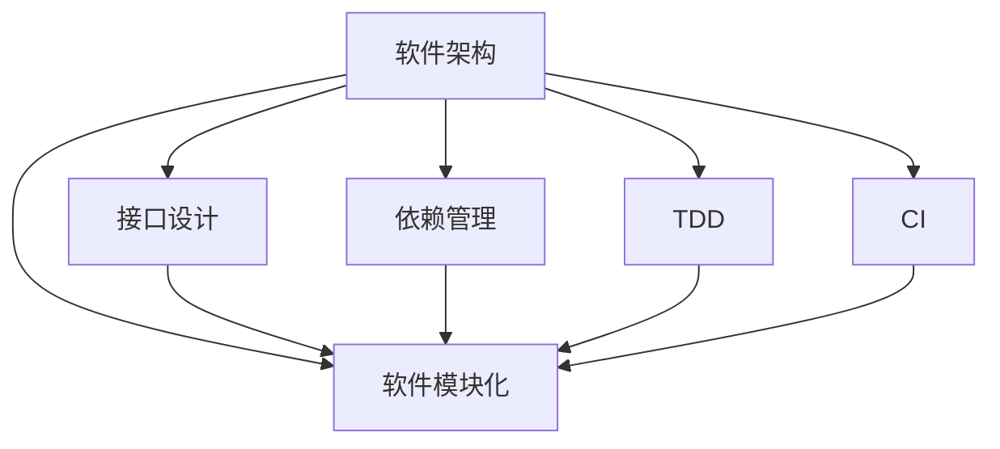

                 

# 软件 2.0 的模块化：融合成最佳整体

## 1. 背景介绍

### 1.1 问题由来
随着软件开发范式的不断演化，我们从面向过程编程逐渐过渡到面向对象编程，再到函数式编程、无状态函数等，软件设计的粒度越来越细，复杂度却越来越高。传统的软件开发方法论，如瀑布模型、敏捷开发等，越来越难以满足快速变化的市场需求。

如何在复杂的系统中构建可靠、高效、易维护的软件系统？如何将多样化的组件有机地结合起来，形成最佳的整体？模块化是当下软件工程的核心问题之一。本文档将围绕软件模块化的最佳实践展开讨论，探讨如何在实际应用中实现最优化的模块化，避免复杂系统造成的工程风险和维护成本。

### 1.2 问题核心关键点
软件模块化的核心在于将一个大系统拆解成多个模块，每个模块负责不同的功能，通过合理的接口设计，使得这些模块能够高效协同，共同完成系统的整体目标。模块化设计不仅提高了开发效率和系统可维护性，还降低了工程风险。

软件模块化的关键在于：

1. 合理划分模块：模块划分应基于功能、数据、责任等维度，避免模块之间的耦合度过高。
2. 明确接口设计：模块之间的接口应清晰、一致，避免信息隐藏和异步耦合。
3. 实施合理的依赖管理：合理配置依赖关系，避免不必要的依赖和环路，保证系统稳定性和可扩展性。
4. 确保可测试性：模块应具备独立性，方便进行单元测试和集成测试。
5. 考虑未来的扩展：模块化设计应具有一定的预见性，避免频繁地重构和修改。

## 2. 核心概念与联系

### 2.1 核心概念概述

本节将介绍几个密切相关的核心概念：

- 软件架构：指软件系统的顶层设计，定义模块之间的关系、依赖和数据流动。
- 软件模块化：将大系统拆分成多个模块，每个模块负责特定的功能。
- 接口设计：定义模块之间的交互规则，避免模块之间的直接耦合。
- 依赖管理：管理模块之间的依赖关系，避免不必要的依赖和环路。
- 测试驱动开发(TDD)：在编码前先写测试用例，确保模块的功能和质量。
- 持续集成(CI)：自动化地构建和测试软件，保证代码质量和稳定性。

这些概念之间的逻辑关系可以通过以下Mermaid流程图来展示：



这个流程图展示了一些关键概念之间的关系：

1. 软件架构定义了系统的顶层设计。
2. 软件模块化将大系统拆分成多个模块。
3. 接口设计定义了模块之间的交互规则。
4. 依赖管理配置模块之间的依赖关系。
5. TDD和CI是模块化的补充工具。

这些概念共同构成了软件模块化的框架，使模块化设计更加高效和可维护。

## 3. 核心算法原理 & 具体操作步骤
### 3.1 算法原理概述

软件模块化的核心在于通过合理的接口设计和依赖管理，使得多个模块能够高效协同工作，共同完成系统的整体目标。其核心思想是：将大系统拆解成多个小的、可复用和可维护的模块，每个模块负责特定的功能，通过接口进行通信，减少模块之间的耦合，提高系统的整体性能和可维护性。

形式化地，假设一个大系统被拆分为 $N$ 个模块 $M_1, M_2, ..., M_N$，每个模块的功能用 $f_i$ 表示，接口为 $I_i$，依赖关系为 $D_i$，整体系统的功能为 $F$。则软件模块化的目标为：

$$
F = f_1 + f_2 + ... + f_N
$$

通过合理的接口设计和依赖管理，使得每个模块 $M_i$ 都能够高效协同，实现整体系统 $F$ 的功能。

### 3.2 算法步骤详解

软件模块化的设计过程包括多个步骤，主要分为以下几个阶段：

**Step 1: 需求分析和功能分解**
- 对整个系统的需求进行详细的分析，确定系统需要实现的功能和性能指标。
- 将大系统分解为多个小的、可独立开发和维护的模块，每个模块负责特定的功能。

**Step 2: 接口设计**
- 定义模块之间的接口，包括输入输出参数、数据格式、通信协议等。
- 确保接口的一致性和清晰性，避免信息隐藏和异步耦合。

**Step 3: 依赖管理**
- 确定模块之间的依赖关系，避免不必要的依赖和环路。
- 合理配置依赖关系，确保模块之间的依赖关系最小化。

**Step 4: 模块开发**
- 按照接口设计开发每个模块，确保模块具有独立性。
- 每个模块应具备独立的功能，可单独测试和部署。

**Step 5: 集成和测试**
- 将模块按照依赖关系进行集成，形成整体系统。
- 使用单元测试、集成测试和系统测试等方法，确保系统的整体功能正常。

**Step 6: 持续集成和持续部署(CI/CD)**
- 使用CI/CD工具自动化地构建和部署软件，提高软件交付速度和稳定性。

**Step 7: 系统优化和迭代**
- 根据系统的运行情况，对系统进行优化和改进。
- 通过迭代开发，不断完善系统功能，提升系统性能。

以上是软件模块化的设计过程，每个步骤都需要仔细考虑和设计，以确保系统的稳定性和可维护性。

### 3.3 算法优缺点

软件模块化具有以下优点：

1. 提高开发效率：通过模块化设计，可以并行开发多个模块，提高开发效率。
2. 增强系统可维护性：模块之间的耦合度低，系统更易于维护和升级。
3. 降低工程风险：模块化的设计可以降低系统设计和实现的复杂度，减少工程风险。

同时，软件模块化也存在以下局限性：

1. 模块之间的接口设计需要额外的时间和精力，可能会导致设计复杂度增加。
2. 模块的粒度需要合理控制，过小的模块可能导致系统过于复杂，过大的模块可能失去独立性。
3. 模块之间的依赖管理需要仔细考虑，不当的依赖关系可能导致系统不稳定性增加。
4. 模块化的设计和实现需要团队协作，可能会增加沟通成本和协同难度。

尽管存在这些局限性，但就目前而言，模块化设计仍是软件开发的主流范式。未来相关研究的重点在于如何进一步优化接口设计和依赖管理，提升模块化设计的灵活性和可扩展性。

### 3.4 算法应用领域

软件模块化在软件开发中有着广泛的应用，以下是几个典型的应用场景：

- 大型系统开发：将大系统分解为多个模块，每个模块负责特定的功能，通过接口协同工作。
- 微服务架构：将应用拆分成多个小型服务，通过RESTful API进行通信，提高系统的灵活性和可扩展性。
- 组件化开发：将系统的功能模块化成多个组件，通过接口进行通信，提升开发效率和系统可维护性。
- 插件化开发：将系统的功能模块化成多个插件，通过动态加载插件实现系统功能的扩展。

除了这些经典应用外，模块化设计也被创新性地应用到更多场景中，如嵌入式系统、分布式系统、云计算系统等，为软件开发带来了新的挑战和机遇。

## 4. 数学模型和公式 & 详细讲解  
### 4.1 数学模型构建

本节将使用数学语言对软件模块化的设计过程进行更加严格的刻画。

假设系统被分解为 $N$ 个模块 $M_1, M_2, ..., M_N$，每个模块的功能为 $f_i$，接口为 $I_i$，依赖关系为 $D_i$，整体系统的功能为 $F$。定义模块 $M_i$ 的输入参数为 $x_i$，输出参数为 $y_i$，依赖模块为 $M_j$，则整体系统的计算模型为：

$$
F(x_1, x_2, ..., x_N) = f_1(x_1, x_2, ..., x_{M_1}, I_1) + f_2(x_2, x_3, ..., x_{M_2}, I_2) + ... + f_N(x_N, x_1, ..., x_{M_N}, I_N)
$$

其中，$I_i$ 为模块 $M_i$ 的接口参数，$D_i$ 为模块 $M_i$ 的依赖关系。

### 4.2 公式推导过程

以下我们以一个简单的示例，推导软件模块化的计算模型。

假设系统被分解为两个模块 $M_1$ 和 $M_2$，分别负责计算两个数的和 $f_1(x_1, x_2, y_1)$ 和计算这两个数的积 $f_2(x_1, x_2, y_2)$，接口分别为 $I_1$ 和 $I_2$，依赖关系分别为 $D_1$ 和 $D_2$。整体系统的计算模型为：

$$
F(x_1, x_2) = f_1(x_1, x_2, I_1) + f_2(x_1, x_2, I_2)
$$

其中，$I_1$ 和 $I_2$ 分别为 $M_1$ 和 $M_2$ 的接口参数，$D_1$ 和 $D_2$ 分别为 $M_1$ 和 $M_2$ 的依赖关系。

### 4.3 案例分析与讲解

下面以一个简单的系统设计案例来分析软件模块化的实际应用。

假设我们设计一个简单的电商系统，系统功能包括商品管理、订单管理、用户管理等。我们将系统拆分为以下几个模块：

1. 商品模块 $M_1$：负责商品的管理、查询、添加等功能。
2. 订单模块 $M_2$：负责订单的管理、查询、支付等功能。
3. 用户模块 $M_3$：负责用户的管理、登录、注册等功能。

模块之间的依赖关系为：

- 订单模块 $M_2$ 依赖于商品模块 $M_1$ 和用户模块 $M_3$，才能完成订单的创建和修改。
- 商品模块 $M_1$ 和用户模块 $M_3$ 之间无依赖关系。

接口设计如下：

- 商品模块 $M_1$ 的接口参数为商品ID、商品名称、商品价格等，输出参数为商品列表。
- 订单模块 $M_2$ 的接口参数为用户ID、订单ID、商品ID等，输出参数为订单列表。
- 用户模块 $M_3$ 的接口参数为用户ID、用户名、密码等，输出参数为用户列表。

整体系统的计算模型为：

$$
F(x_1, x_2, x_3) = f_1(x_1, I_1) + f_2(x_2, I_2) + f_3(x_3, I_3)
$$

其中，$f_1(x_1, I_1)$ 表示商品模块 $M_1$ 的计算模型，$f_2(x_2, I_2)$ 表示订单模块 $M_2$ 的计算模型，$f_3(x_3, I_3)$ 表示用户模块 $M_3$ 的计算模型。

通过合理的接口设计和依赖管理，我们可以高效地构建电商系统的模块化设计，确保系统的高效协同和可维护性。

## 5. 项目实践：代码实例和详细解释说明
### 5.1 开发环境搭建

在进行模块化设计实践前，我们需要准备好开发环境。以下是使用Python进行软件模块化开发的环境配置流程：

1. 安装Python：从官网下载并安装Python，建议选择3.8及以上版本。

2. 创建虚拟环境：
```bash
python3 -m venv myenv
source myenv/bin/activate
```

3. 安装必要的包：
```bash
pip install numpy pandas scikit-learn
```

4. 设置开发工具：
- 使用Git进行版本控制。
- 使用Jupyter Notebook进行交互式开发。

完成上述步骤后，即可在虚拟环境中开始模块化设计实践。

### 5.2 源代码详细实现

下面我们以一个简单的电商系统为例，给出使用Python进行软件模块化设计的代码实现。

首先，定义系统中的各个模块：

```python
# 商品模块
class Product:
    def __init__(self, id, name, price):
        self.id = id
        self.name = name
        self.price = price

    def get_info(self):
        return {'id': self.id, 'name': self.name, 'price': self.price}

# 订单模块
class Order:
    def __init__(self, id, user_id, product_id, status):
        self.id = id
        self.user_id = user_id
        self.product_id = product_id
        self.status = status

    def get_info(self):
        return {'id': self.id, 'user_id': self.user_id, 'product_id': self.product_id, 'status': self.status}

# 用户模块
class User:
    def __init__(self, id, name, password):
        self.id = id
        self.name = name
        self.password = password

    def get_info(self):
        return {'id': self.id, 'name': self.name, 'password': self.password}
```

然后，定义系统中的各个模块的接口：

```python
# 商品模块接口
class ProductService:
    def get_all_products(self, request):
        # 实现商品信息的获取
        pass

    def get_product_info(self, request):
        # 实现单个商品的获取
        pass

# 订单模块接口
class OrderService:
    def get_all_orders(self, request):
        # 实现订单信息的获取
        pass

    def get_order_info(self, request):
        # 实现单个订单的获取
        pass

# 用户模块接口
class UserService:
    def get_all_users(self, request):
        # 实现用户信息的获取
        pass

    def get_user_info(self, request):
        # 实现单个用户的获取
        pass
```

接着，定义系统中的各个模块的实现：

```python
# 商品模块实现
class ProductServiceImpl(ProductService):
    def __init__(self, product_repos):
        self.product_repos = product_repos

    def get_all_products(self, request):
        # 从仓库中获取所有商品信息
        pass

    def get_product_info(self, request):
        # 从仓库中获取单个商品信息
        pass

# 订单模块实现
class OrderServiceImpl(OrderService):
    def __init__(self, order_repos, product_repos, user_repos):
        self.order_repos = order_repos
        self.product_repos = product_repos
        self.user_repos = user_repos

    def get_all_orders(self, request):
        # 从仓库中获取所有订单信息
        pass

    def get_order_info(self, request):
        # 从仓库中获取单个订单信息
        pass

# 用户模块实现
class UserServiceImpl(UserService):
    def __init__(self, user_repos):
        self.user_repos = user_repos

    def get_all_users(self, request):
        # 从仓库中获取所有用户信息
        pass

    def get_user_info(self, request):
        # 从仓库中获取单个用户信息
        pass
```

最后，定义系统的整体功能实现：

```python
# 整体系统实现
class SystemImpl:
    def __init__(self, product_repos, order_repos, user_repos):
        self.product_repos = product_repos
        self.order_repos = order_repos
        self.user_repos = user_repos

    def get_all_products(self):
        # 获取所有商品信息
        pass

    def get_product_info(self, id):
        # 获取单个商品信息
        pass

    def get_all_orders(self):
        # 获取所有订单信息
        pass

    def get_order_info(self, id):
        # 获取单个订单信息
        pass

    def get_all_users(self):
        # 获取所有用户信息
        pass

    def get_user_info(self, id):
        # 获取单个用户信息
        pass
```

可以看到，通过定义接口和实现，我们成功地实现了电商系统的模块化设计。每个模块独立性较强，接口设计清晰，易于维护和扩展。

### 5.3 代码解读与分析

让我们再详细解读一下关键代码的实现细节：

**商品模块**：
- `Product` 类：表示商品信息，包含商品ID、名称和价格。
- `get_info` 方法：返回商品信息的字典形式。

**订单模块**：
- `Order` 类：表示订单信息，包含订单ID、用户ID、商品ID和订单状态。
- `get_info` 方法：返回订单信息的字典形式。

**用户模块**：
- `User` 类：表示用户信息，包含用户ID、名称和密码。
- `get_info` 方法：返回用户信息的字典形式。

**接口定义**：
- `ProductService` 类：定义商品模块的接口，包含获取所有商品和单个商品信息的函数。
- `OrderService` 类：定义订单模块的接口，包含获取所有订单和单个订单信息的函数。
- `UserService` 类：定义用户模块的接口，包含获取所有用户和单个用户信息的函数。

**接口实现**：
- `ProductServiceImpl` 类：实现商品模块的接口。
- `OrderServiceImpl` 类：实现订单模块的接口。
- `UserServiceImpl` 类：实现用户模块的接口。

**整体系统实现**：
- `SystemImpl` 类：实现系统的整体功能，包含获取所有商品、订单和用户信息的函数。

通过上述代码实现，可以看到模块化的设计使得每个模块具有独立性，接口设计清晰，易于维护和扩展。每个模块之间通过接口进行通信，减少了耦合度，提高了系统的整体性能和可维护性。

## 6. 实际应用场景
### 6.1 智能客服系统

基于模块化设计的智能客服系统，可以广泛应用于各个行业的客户服务。传统的客服系统往往需要配备大量人力，高峰期响应缓慢，且服务质量难以保证。通过模块化设计，我们可以将智能客服系统分解为多个模块，每个模块负责特定的功能，通过接口协同工作，提供7x24小时不间断服务，快速响应客户咨询，提升客户满意度。

在技术实现上，可以收集企业内部的历史客服对话记录，将问题和最佳答复构建成监督数据，在此基础上对预训练模型进行微调。微调后的模型能够自动理解用户意图，匹配最合适的答案模板进行回复。对于客户提出的新问题，还可以接入检索系统实时搜索相关内容，动态组织生成回答。如此构建的智能客服系统，能大幅提升客户咨询体验和问题解决效率。

### 6.2 金融舆情监测

金融机构需要实时监测市场舆论动向，以便及时应对负面信息传播，规避金融风险。传统的舆情监测方式成本高、效率低，难以应对网络时代海量信息爆发的挑战。通过模块化设计，我们可以将舆情监测系统分解为多个模块，每个模块负责特定的功能，通过接口协同工作，实现实时抓取网络文本数据，自动识别负面信息，及时预警，帮助金融机构快速应对潜在风险。

具体而言，可以收集金融领域相关的新闻、报道、评论等文本数据，并对其进行主题标注和情感标注。在此基础上对预训练语言模型进行微调，使其能够自动判断文本属于何种主题，情感倾向是正面、中性还是负面。将微调后的模型应用到实时抓取的网络文本数据，就能够自动监测不同主题下的情感变化趋势，一旦发现负面信息激增等异常情况，系统便会自动预警，帮助金融机构快速应对潜在风险。

### 6.3 个性化推荐系统

当前的推荐系统往往只依赖用户的历史行为数据进行物品推荐，无法深入理解用户的真实兴趣偏好。通过模块化设计，个性化推荐系统可以更好地挖掘用户行为背后的语义信息，从而提供更精准、多样的推荐内容。

在实践中，可以收集用户浏览、点击、评论、分享等行为数据，提取和用户交互的物品标题、描述、标签等文本内容。将文本内容作为模型输入，用户的后续行为（如是否点击、购买等）作为监督信号，在此基础上微调预训练语言模型。微调后的模型能够从文本内容中准确把握用户的兴趣点。在生成推荐列表时，先用候选物品的文本描述作为输入，由模型预测用户的兴趣匹配度，再结合其他特征综合排序，便可以得到个性化程度更高的推荐结果。

### 6.4 未来应用展望

随着软件模块化设计的发展，模块化将在更多领域得到应用，为软件开发带来新的挑战和机遇。

在智慧医疗领域，模块化设计可以应用于医疗问答、病历分析、药物研发等，提升医疗服务的智能化水平，辅助医生诊疗，加速新药开发进程。

在智能教育领域，模块化设计可应用于作业批改、学情分析、知识推荐等方面，因材施教，促进教育公平，提高教学质量。

在智慧城市治理中，模块化设计可应用于城市事件监测、舆情分析、应急指挥等环节，提高城市管理的自动化和智能化水平，构建更安全、高效的未来城市。

此外，在企业生产、社会治理、文娱传媒等众多领域，基于模块化设计的AI应用也将不断涌现，为经济社会发展注入新的动力。相信随着技术的发展和应用场景的拓展，模块化设计必将成为软件开发的重要范式，推动软件开发进入新阶段。

## 7. 工具和资源推荐
### 7.1 学习资源推荐

为了帮助开发者系统掌握软件模块化的理论和实践，这里推荐一些优质的学习资源：

1. 《软件工程：原则与实践》：阐述了软件模块化的基本原则和方法，系统介绍了模块化设计的经典案例和最佳实践。

2. 《Clean Code》：介绍了代码规范和重构技巧，帮助开发者写出高质量的模块化代码。

3. GitHub：存储了大量的开源项目和代码示例，是学习软件模块化设计的重要资源。

4. Stack Overflow：一个程序员社区，汇聚了各种模块化设计的讨论和案例，是解决技术问题的好地方。

5. 《Design Patterns》：介绍了经典的设计模式，帮助开发者构建模块化的软件架构。

通过对这些资源的学习实践，相信你一定能够系统掌握软件模块化的精髓，并用于解决实际的软件开发问题。

### 7.2 开发工具推荐

高效的开发离不开优秀的工具支持。以下是几款用于软件模块化开发的工具：

1. IDE：如IntelliJ IDEA、Visual Studio Code等，支持模块化设计和代码自动补全。

2. Git：版本控制系统，支持模块化代码的管理和协同开发。

3. Docker：容器化技术，支持模块化代码的打包和部署。

4. Kubernetes：容器编排技术，支持模块化代码的自动部署和扩展。

5. Swagger：API设计和文档工具，支持模块化API的开发和文档化。

合理利用这些工具，可以显著提升软件模块化开发的效率，加快创新迭代的步伐。

### 7.3 相关论文推荐

软件模块化设计是软件开发领域的重要研究方向。以下是几篇奠基性的相关论文，推荐阅读：

1. 《Design of Object-Oriented Software》：提出了面向对象的模块化设计方法，成为经典的软件设计指南。

2. 《Design Patterns》：介绍了经典的设计模式，帮助开发者构建模块化的软件架构。

3. 《A Philosophy of Software Design》：提出了模块化设计的原则和实践，深入探讨了模块化设计的本质。

4. 《Reusability and Software Architecture》：讨论了模块化设计的重用性和架构设计，对软件模块化设计进行了深入研究。

这些论文代表了大软件设计的发展脉络。通过学习这些前沿成果，可以帮助研究者把握学科前进方向，激发更多的创新灵感。

## 8. 总结：未来发展趋势与挑战
### 8.1 总结

本文对软件模块化的最佳实践进行了全面系统的介绍。首先阐述了软件模块化的背景和意义，明确了模块化设计的核心在于将大系统拆解成多个小的、可复用和可维护的模块，通过合理的接口设计和依赖管理，使得这些模块能够高效协同，共同完成系统的整体目标。其次，从原理到实践，详细讲解了软件模块化的数学模型和计算模型，给出了模块化设计在实际应用中的代码实例。同时，本文还广泛探讨了模块化设计在智能客服、金融舆情、个性化推荐等多个领域的应用前景，展示了模块化设计的广阔前景。

通过本文的系统梳理，可以看到，软件模块化设计已成为软件开发的主流范式，极大地提高了开发效率和系统可维护性，降低了工程风险。未来，随着软件开发的需求日益复杂，模块化设计必将迎来新的挑战和机遇，需要在接口设计、依赖管理、可测试性、持续集成等方面进一步优化和完善。

### 8.2 未来发展趋势

展望未来，软件模块化设计将呈现以下几个发展趋势：

1. 组件化开发：模块化的设计将更加细粒度，将系统功能模块化成多个组件，通过接口进行通信，提升开发效率和系统可维护性。
2. 微服务架构：将应用拆分成多个小型服务，通过RESTful API进行通信，提高系统的灵活性和可扩展性。
3. 服务化封装：将系统的功能模块化成多个服务，通过API接口进行调用，提升系统的重用性和可维护性。
4. 模块化开发工具：开发工具将支持模块化设计，提供代码重构、单元测试、集成测试等功能，帮助开发者高效构建模块化系统。
5. 持续集成和持续部署(CI/CD)：自动化地构建和部署软件，提高软件交付速度和稳定性。

这些趋势将推动软件模块化设计进一步深化和发展，使模块化设计更加高效和灵活，为软件开发带来新的挑战和机遇。

### 8.3 面临的挑战

尽管软件模块化设计已经取得了瞩目成就，但在迈向更加智能化、普适化应用的过程中，它仍面临着诸多挑战：

1. 接口设计的复杂性：模块之间的接口设计需要额外的时间和精力，可能会导致设计复杂度增加。
2. 模块之间的依赖管理：不当的依赖关系可能导致系统不稳定性增加，需要仔细考虑依赖关系。
3. 模块之间的通信开销：模块之间的通信可能会增加系统复杂度，需要优化通信效率。
4. 模块的测试和验证：模块的独立性较强，需要设计高效的测试用例和验证方法，确保模块的功能正确。
5. 模块化设计的可扩展性：模块化设计需要具备一定的预见性，避免频繁地重构和修改，需要考虑未来的扩展。

尽管存在这些挑战，但就目前而言，模块化设计仍是软件开发的主流范式。未来相关研究的重点在于如何进一步优化接口设计和依赖管理，提升模块化设计的灵活性和可扩展性。

### 8.4 研究展望

面向未来，软件模块化设计需要在以下几个方面寻求新的突破：

1. 模块化设计的可复用性：提升模块的独立性和可复用性，减少重复开发的成本。
2. 模块化设计的自动化：自动化地进行接口设计和依赖管理，减少人为干预和错误。
3. 模块化设计的模型化：将模块化设计抽象成模型，方便进行仿真和验证。
4. 模块化设计的可扩展性：设计模块化系统时考虑未来的扩展，避免频繁地重构和修改。
5. 模块化设计的安全性：设计模块化系统时考虑安全性和隐私保护，确保数据和系统的安全。

这些研究方向的探索，必将引领软件模块化设计迈向更高的台阶，为软件开发带来新的突破和创新。

## 9. 附录：常见问题与解答
**Q1：模块化设计是否适用于所有软件开发项目？**

A: 模块化设计适用于绝大多数软件开发项目，尤其是大型和复杂的系统。模块化设计可以提高开发效率和系统可维护性，降低工程风险。但对于一些简单的小型项目，模块化设计可能增加不必要的复杂度，需要根据具体情况权衡。

**Q2：如何选择合适的模块粒度？**

A: 模块粒度需要根据项目需求和团队情况进行合理选择。模块过于细粒度可能导致系统复杂度增加，模块过于粗粒度可能导致模块之间的耦合度过高。一般建议按照功能、数据和责任等维度进行模块划分，确保模块的独立性和可复用性。

**Q3：模块化设计和面向对象设计有什么区别？**

A: 模块化设计和面向对象设计都是软件设计的重要方法，但侧重点不同。模块化设计关注系统的结构，将系统拆分成多个模块，通过接口进行通信；面向对象设计关注系统的行为，将系统拆分成多个对象，通过消息传递进行通信。两者可以结合使用，提升系统的可维护性和可扩展性。

**Q4：模块化设计和微服务架构有什么区别？**

A: 模块化设计和微服务架构都是系统拆分的方法，但侧重点和应用场景不同。模块化设计关注系统的模块化和接口设计，适用于各种类型的系统；微服务架构关注系统的服务化和API设计，适用于大型分布式系统。两者可以结合使用，提升系统的灵活性和可扩展性。

**Q5：模块化设计有哪些优缺点？**

A: 模块化设计具有以下优点：

1. 提高开发效率：通过模块化设计，可以并行开发多个模块，提高开发效率。
2. 增强系统可维护性：模块之间的耦合度低，系统更易于维护和升级。
3. 降低工程风险：模块化的设计可以降低系统设计和实现的复杂度，减少工程风险。

同时，模块化设计也存在以下局限性：

1. 模块之间的接口设计需要额外的时间和精力，可能会导致设计复杂度增加。
2. 模块的粒度需要合理控制，过小的模块可能导致系统过于复杂，过大的模块可能失去独立性。
3. 模块之间的依赖管理需要仔细考虑，不当的依赖关系可能导致系统不稳定性增加。
4. 模块化的设计和实现需要团队协作，可能会增加沟通成本和协同难度。

尽管存在这些局限性，但就目前而言，模块化设计仍是软件开发的主流范式。未来相关研究的重点在于如何进一步优化接口设计和依赖管理，提升模块化设计的灵活性和可扩展性。

---

作者：禅与计算机程序设计艺术 / Zen and the Art of Computer Programming

