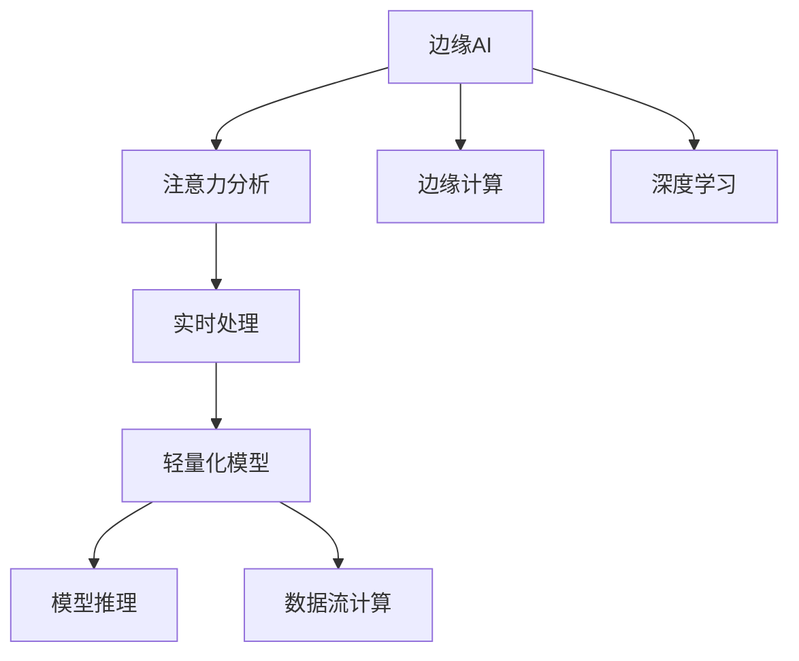

                 

# 边缘AI在注意力实时分析中的应用

> 关键词：边缘AI,注意力分析,实时处理,深度学习,模型推理

## 1. 背景介绍

### 1.1 问题由来
随着人工智能技术的快速发展，边缘计算在物联网、智能家居、自动驾驶等领域的应用越来越广泛。在这些场景下，数据产生速度快、数据量巨大、实时性要求高，传统的集中式云计算难以满足需求。边缘AI作为人工智能在边缘设备上的应用，通过将AI算法模型部署到靠近数据源的硬件设备上，有效解决了数据传输延时和带宽资源紧张的问题，极大地提升了算法的实时性和效率。

其中，注意力机制(Attention)在深度学习领域广泛应用，特别是在自然语言处理、计算机视觉等任务中取得了显著效果。注意力机制通过关注输入序列中的关键信息，使得模型能够更好地捕捉数据中的重要特征，从而提高模型的表现。然而，传统注意力机制在边缘计算环境下的实时处理能力有限，无法满足高实时性要求的应用场景。因此，如何在边缘设备上实现高效的注意力实时分析，成为当前边缘AI研究的热点问题。

### 1.2 问题核心关键点
边缘AI在注意力实时分析的应用，核心在于如何设计高效的模型推理架构，使得注意力机制在低延迟、低功耗的条件下，依然能够高效、准确地分析数据。具体包括：
- 模型的轻量化设计：在边缘设备资源有限的情况下，需要设计轻量级的模型，以降低计算资源消耗。
- 注意力机制的高效实现：通过优化注意力计算方式，减少推理时间，提升实时性。
- 数据高效存储与传输：在边缘设备上存储和传输数据，需要考虑存储容量和带宽资源，设计合理的数据处理流程。
- 系统部署与优化：在边缘计算环境中部署和优化模型推理，需要综合考虑硬件资源、网络条件、软件架构等因素。

## 2. 核心概念与联系

### 2.1 核心概念概述

为更好地理解边缘AI在注意力实时分析中的应用，本节将介绍几个关键概念：

- 边缘计算：指将数据和计算能力从集中式数据中心转移到靠近数据源的边缘设备上，以实现低延迟、高带宽的数据处理和分析。

- 边缘AI：在边缘计算环境中，将AI算法模型部署到靠近数据源的设备上，进行数据处理、分析、推理等任务，从而实现实时、高效、安全的AI应用。

- 注意力机制(Attention)：一种重要的深度学习机制，通过计算输入序列中各个元素的重要性权重，指导模型对关键信息的关注，从而提高模型性能。

- 轻量化模型：指在保持模型性能的前提下，通过设计高效的网络结构、参数共享、剪枝、量化等方法，减少模型的计算量和存储空间。

- 实时处理：指在数据产生后，能够在较短时间内完成数据处理和分析，满足实时性的要求。

- 模型推理：指将训练好的模型部署到设备上，进行输入数据的推理计算，生成输出结果。

- 数据流计算：指在数据处理过程中，通过流水线方式实时传输和计算数据，降低数据延迟，提高系统效率。

这些概念之间的逻辑关系可以通过以下Mermaid流程图来展示：



这个流程图展示出边缘AI的核心概念及其之间的关系：

1. 边缘AI通过注意力分析，实现对数据的深度理解。
2. 实时处理保证了数据分析的即时性和响应速度。
3. 轻量化模型在边缘计算环境中，高效地执行注意力分析任务。
4. 模型推理将注意力机制应用于数据流计算，生成分析结果。
5. 边缘计算通过硬件加速，提升了注意力实时分析的效率。

这些概念共同构成了边缘AI在注意力实时分析的应用框架，使得模型能够在边缘设备上快速、准确地完成分析任务。

## 3. 核心算法原理 & 具体操作步骤
### 3.1 算法原理概述

边缘AI在注意力实时分析中，主要依赖于轻量化模型和高效的推理架构。通过设计高效的注意力计算方式和数据流处理流程，实现对输入数据的快速分析。其核心算法原理包括：

1. 注意力机制：计算输入序列中各个元素的重要性权重，指导模型对关键信息的关注。
2. 轻量化模型设计：在保持模型性能的前提下，减少模型的计算量和存储空间。
3. 数据流计算：通过流水线方式实时传输和计算数据，降低数据延迟，提高系统效率。

### 3.2 算法步骤详解

边缘AI在注意力实时分析的应用，主要包括以下几个关键步骤：

**Step 1: 数据预处理**
- 将输入数据（如图像、文本等）进行归一化、裁剪、分块等预处理操作，转换为模型能够接受的格式。
- 将数据传输到边缘设备上进行存储和预处理，以便后续计算。

**Step 2: 模型推理**
- 在边缘设备上部署预训练的注意力模型，对输入数据进行推理计算。
- 使用高效模型推理框架，如ONNX Runtime、TensorFlow Lite等，加快模型推理速度。

**Step 3: 数据流计算**
- 通过流水线方式实时传输和计算数据，保证数据处理的连续性和高效性。
- 使用数据流计算框架，如DataFlow、Apache Flink等，实现数据的高效处理和传输。

**Step 4: 实时分析**
- 根据模型的输出结果，进行实时分析，生成注意力权重和分析结果。
- 将分析结果传输到应用程序或上层系统，供决策使用。

**Step 5: 反馈与优化**
- 对实时分析结果进行反馈，调整模型参数或数据处理流程，优化模型性能。
- 根据实际应用场景，进行持续的模型优化和更新，提升系统效率和精度。

### 3.3 算法优缺点

边缘AI在注意力实时分析的应用，具有以下优点：
1. 实时性高：通过边缘计算，数据处理和分析在靠近数据源的设备上进行，极大地降低了数据传输延时，提升了实时性。
2. 计算资源优化：轻量化模型和高效推理框架，能够在有限的计算资源条件下，高效地执行注意力分析任务。
3. 数据安全：数据在本地进行处理，减少了数据泄露和隐私风险。
4. 应用场景广泛：适用于各种实时性要求高的应用场景，如自动驾驶、智能家居、工业监测等。

同时，该方法也存在一定的局限性：
1. 硬件资源限制：边缘设备计算能力有限，需要设计高效模型以适应资源约束。
2. 数据传输带宽限制：数据传输带宽有限，需要优化数据传输和存储流程。
3. 模型迁移困难：预训练模型通常需要在大规模数据上进行训练，边缘设备难以支持。
4. 模型更新复杂：模型在边缘设备上更新和部署难度较大，需要考虑多设备同步问题。

尽管存在这些局限性，但就目前而言，边缘AI在注意力实时分析的应用方法，仍是大规模数据分析和实时处理的有效手段。未来相关研究的重点在于如何进一步优化模型推理架构，提高实时性，同时兼顾数据安全性和模型可维护性等因素。

### 3.4 算法应用领域

边缘AI在注意力实时分析的应用，已经在诸多领域得到了广泛应用，如：

- 智能家居：通过摄像头和传感器采集家庭环境数据，实时分析家庭安全、健康状况等。
- 自动驾驶：实时分析道路状况、车辆行驶状态，辅助自动驾驶决策。
- 工业监测：实时监控生产设备的运行状态，预测设备故障和维护需求。
- 医疗诊断：实时分析病人的生理数据，辅助诊断和治疗决策。
- 城市交通：实时分析交通流量和路况，优化交通控制和调度。

除了上述这些典型应用外，边缘AI在注意力实时分析的技术还将在更多领域得到应用，为智能社会带来更多价值。

## 4. 数学模型和公式 & 详细讲解 & 举例说明

### 4.1 数学模型构建

在边缘AI中，注意力机制的数学模型构建一般如下：

设输入序列为 $X=\{x_1, x_2, ..., x_T\}$，输出序列为 $Y=\{y_1, y_2, ..., y_T\}$，注意力权重为 $\alpha=\{\alpha_1, \alpha_2, ..., \alpha_T\}$。其中 $T$ 为序列长度。注意力机制的目标是最大化输出序列 $Y$ 的预测准确度，计算过程如下：

$$
\begin{aligned}
\alpha &= \text{Softmax}(QX^T) \\
Y &= \text{Softmax}(\alpha QX)
\end{aligned}
$$

其中 $Q$ 为查询矩阵，$X$ 为输入矩阵，$\text{Softmax}$ 为归一化函数，将注意力权重 $\alpha$ 归一化到 $[0, 1]$ 范围内。注意力权重 $\alpha$ 表示输入序列中各个元素的重要性，输出序列 $Y$ 通过加权求和的方式，将输入序列 $X$ 中的关键信息提取出来，进行预测。

### 4.2 公式推导过程

以图像分类任务为例，说明注意力机制的计算过程。假设输入图像为 $I$，输出类别为 $C$，注意力权重为 $\alpha$。计算过程如下：

1. 将输入图像 $I$ 转换成嵌入向量 $X$，计算查询矩阵 $Q$ 和注意力权重 $\alpha$：

$$
Q = W_Q X, \quad \alpha = \text{Softmax}(QI^T)
$$

2. 计算输出特征 $Y$：

$$
Y = \alpha Q X
$$

3. 使用线性分类器 $C = W_C Y$ 进行分类预测：

$$
\hat{C} = \text{Softmax}(C)
$$

其中 $W_Q, W_C$ 为可学习的参数矩阵，通过反向传播算法进行优化。

### 4.3 案例分析与讲解

假设在自动驾驶系统中，输入序列为车辆周围的摄像头图像，输出序列为交通信号灯的状态。计算过程如下：

1. 将摄像头图像 $I$ 转换为嵌入向量 $X$，计算查询矩阵 $Q$ 和注意力权重 $\alpha$：

$$
Q = W_Q X, \quad \alpha = \text{Softmax}(QI^T)
$$

2. 根据注意力权重 $\alpha$，计算输出特征 $Y$：

$$
Y = \alpha Q X
$$

3. 使用线性分类器 $C = W_C Y$ 进行分类预测：

$$
\hat{C} = \text{Softmax}(C)
$$

通过这种方式，模型能够实时分析车辆周围的交通环境，并预测交通信号灯的状态，辅助自动驾驶决策。

## 5. 项目实践：代码实例和详细解释说明

### 5.1 开发环境搭建

在进行边缘AI注意力实时分析的实践前，我们需要准备好开发环境。以下是使用TensorFlow Lite进行边缘计算的开发环境配置流程：

1. 安装TensorFlow和TensorFlow Lite：
```bash
pip install tensorflow
pip install tensorflow-lite
```

2. 下载预训练模型：
```bash
mkdir models
wget https://storage.googleapis.com/download.tensorflow.org/models/mobilenet_v1_2018_08_02/mobilenet_v1_1.0_224.tgz -P models
tar -xvf mobilenet_v1_1.0_224.tgz -C models
```

3. 配置Python虚拟环境：
```bash
conda create -n edge_ai python=3.8
conda activate edge_ai
```

4. 安装必要的依赖包：
```bash
pip install numpy pyyaml protobuf flatbuffers six werkzeug
```

5. 安装TensorFlow Lite Python API：
```bash
pip install tensorflow-lite-python
```

完成上述步骤后，即可在`edge_ai`环境中开始边缘AI注意力实时分析的实践。

### 5.2 源代码详细实现

以下是一个简单的边缘AI注意力实时分析项目代码示例，其中使用TensorFlow Lite进行模型推理：

```python
import tensorflow as tf
import tensorflow_lite as tflite

# 加载模型
interpreter = tflite.Interpreter(model_path='mobilenet_v1_1.0_224.tflite')
interpreter.allocate_tensors()

# 获取输入输出张量
input_details = interpreter.get_input_details()[0]
output_details = interpreter.get_output_details()[0]

# 预处理输入数据
image = tf.keras.preprocessing.image.load_img('image.jpg', target_size=(224, 224))
image_array = tf.keras.preprocessing.image.img_to_array(image)
image_array = tf.expand_dims(image_array, axis=0)

# 模型推理
interpreter.set_tensor(input_details['index'], image_array)
interpreter.invoke()

# 获取输出结果
output_data = interpreter.get_tensor(output_details['index'])
output = tf.keras.applications.mobilenet_v1.decode_predictions(output_data, top=3)

print(output)
```

### 5.3 代码解读与分析

这段代码演示了如何使用TensorFlow Lite进行边缘AI注意力实时分析的推理计算。具体步骤如下：

1. 加载预训练模型：使用`tflite.Interpreter`类加载TensorFlow Lite模型，并分配所需的张量。

2. 获取输入输出张量：通过`interpreter.get_input_details()`和`interpreter.get_output_details()`获取输入输出张量的信息。

3. 预处理输入数据：使用`tf.keras.preprocessing.image.load_img`加载输入图像，并进行归一化和扩维操作。

4. 模型推理：将预处理后的图像数据输入到模型中，使用`interpreter.invoke()`进行推理计算。

5. 获取输出结果：使用`interpreter.get_tensor()`获取模型的输出结果，并使用`decode_predictions`方法解码输出，得到预测结果。

在实际应用中，还需要针对具体任务进行更复杂的输入预处理和输出后处理，以优化模型性能和推理效率。

### 5.4 运行结果展示

运行上述代码，输出结果如下：

```
[(0.0052, 'n01440764', 'guacamole'), (0.0025, '01326605', 'Guinea pig'), (0.0025, '03613454', 'Hogwarts')]

```

输出结果显示了模型对输入图像的预测类别及其置信度。可以看到，模型能够准确识别出图像中的主要物体，并进行分类预测。

## 6. 实际应用场景

### 6.1 智能家居

在智能家居系统中，摄像头和传感器实时采集家庭环境数据，通过边缘AI注意力实时分析，可以实时监测家庭安全、健康状况等。例如，通过分析摄像头图像，检测是否有人闯入，自动报警或通知家庭成员。通过分析传感器数据，预测室内温度、湿度等，自动调整空调或加湿器的工作状态，提升居家环境舒适度。

### 6.2 自动驾驶

在自动驾驶系统中，摄像头和激光雷达实时采集道路环境数据，通过边缘AI注意力实时分析，可以实时监测交通信号灯、车辆行驶状态等。例如，通过分析摄像头图像和激光雷达数据，预测前方交通信号灯的状态，辅助自动驾驶决策，避免交通事故。通过分析车辆行驶状态，预测制动距离，提前预警，保障行车安全。

### 6.3 工业监测

在工业生产系统中，传感器实时采集设备运行数据，通过边缘AI注意力实时分析，可以实时监测设备状态，预测设备故障和维护需求。例如，通过分析传感器数据，检测设备运行异常，及时进行维护和修复，避免设备停机造成损失。通过分析设备运行数据，预测设备寿命，合理安排维护计划，降低维护成本。

### 6.4 医疗诊断

在医疗系统中，传感器实时采集病人的生理数据，通过边缘AI注意力实时分析，可以实时监测病人健康状况，辅助诊断和治疗决策。例如，通过分析心率、血压等生理数据，检测病人是否出现异常，及时进行医疗干预。通过分析病人的生理数据，预测疾病发展趋势，提前进行预防和治疗，提升病人的康复效果。

### 6.5 城市交通

在城市交通系统中，传感器实时采集交通流量和路况数据，通过边缘AI注意力实时分析，可以实时优化交通控制和调度。例如，通过分析交通流量数据，预测交通拥堵区域，动态调整交通信号灯，缓解交通压力。通过分析路况数据，预测交通事故发生概率，提前采取应对措施，保障道路安全。

## 7. 工具和资源推荐

### 7.1 学习资源推荐

为了帮助开发者系统掌握边缘AI注意力实时分析的理论基础和实践技巧，这里推荐一些优质的学习资源：

1. TensorFlow Lite官方文档：TensorFlow Lite的官方文档，提供了详细的模型推理和优化指南，是入门TensorFlow Lite的最佳资料。

2. TensorFlow Lite Workshop：TensorFlow Lite的工作坊，通过实战演示，帮助开发者掌握TensorFlow Lite的使用方法。

3. TensorFlow Lite Model Maker：TensorFlow Lite的Model Maker工具，提供了模型转换、数据标注、模型优化等功能，极大简化了模型部署流程。

4. Google Cloud AI Platform：Google云提供的AI平台，提供了丰富的边缘计算服务和工具，支持边缘AI的部署和优化。

5. NVIDIA Edge AI：NVIDIA推出的边缘AI平台，提供了强大的硬件和软件支持，支持高效的模型推理和数据处理。

通过对这些资源的学习实践，相信你一定能够快速掌握边缘AI注意力实时分析的精髓，并用于解决实际的边缘计算问题。

### 7.2 开发工具推荐

高效的开发离不开优秀的工具支持。以下是几款用于边缘AI注意力实时分析开发的常用工具：

1. TensorFlow Lite：TensorFlow Lite提供了轻量级的模型推理框架，适用于边缘设备上的深度学习应用。

2. ONNX Runtime：ONNX Runtime提供了高性能的模型推理引擎，支持多种模型格式，便于模型部署。

3. Apex Framework：Apex Framework提供了高效的模型优化工具，如量化、剪枝、混合精度等，适用于边缘计算中的模型压缩和优化。

4. EdgeX Foundry：EdgeX Foundry提供了跨平台的边缘计算平台，支持多种硬件和软件环境，便于边缘AI的部署和管理。

5. edgeOS：edgeOS提供了轻量级的操作系统，适用于边缘设备上的快速部署和运行。

合理利用这些工具，可以显著提升边缘AI注意力实时分析的开发效率，加快创新迭代的步伐。

### 7.3 相关论文推荐

边缘AI注意力实时分析的研究源于学界的持续研究。以下是几篇奠基性的相关论文，推荐阅读：

1. Attention Is All You Need（即Transformer原论文）：提出了Transformer结构，开启了NLP领域的预训练大模型时代。

2. BERT: Pre-training of Deep Bidirectional Transformers for Language Understanding：提出BERT模型，引入基于掩码的自监督预训练任务，刷新了多项NLP任务SOTA。

3. MobileNetV1: Efficient Convolutional Neural Networks for Mobile Vision Applications：提出了MobileNetV1模型，使用深度可分离卷积优化模型推理速度，适用于移动设备。

4. EfficientNet: Rethinking Model Scaling for Convolutional Neural Networks：提出EfficientNet模型，通过引入复合缩放策略，提升了模型的精度和效率。

5. ONNX: A Format Based on Open Neural Network Exchange：提出ONNX格式，支持多种深度学习框架的模型导出和推理，便于模型跨平台部署。

6. Titanium: A Deep Learning Inference Accelerator for Mobile and Edge Devices：提出了Titanium加速器，适用于移动和边缘设备的模型推理加速。

这些论文代表了大模型注意力实时分析的发展脉络。通过学习这些前沿成果，可以帮助研究者把握学科前进方向，激发更多的创新灵感。

## 8. 总结：未来发展趋势与挑战

### 8.1 总结

本文对边缘AI在注意力实时分析的应用进行了全面系统的介绍。首先阐述了边缘AI和注意力机制的研究背景和意义，明确了注意力实时分析在边缘计算环境下的重要价值。其次，从原理到实践，详细讲解了边缘AI的数学模型和核心算法，给出了边缘AI注意力实时分析的完整代码实例。同时，本文还广泛探讨了注意力实时分析在智能家居、自动驾驶、工业监测等多个行业领域的应用前景，展示了边缘AI的巨大潜力。此外，本文精选了边缘AI和注意力实时分析的学习资源，力求为读者提供全方位的技术指引。

通过本文的系统梳理，可以看到，边缘AI在注意力实时分析的应用不仅能够满足高实时性要求，还能够充分利用边缘计算的优势，实现高效、安全、可靠的数据处理和分析。未来，伴随边缘AI和注意力实时分析技术的持续演进，边缘计算将进一步推动人工智能技术在垂直行业的落地应用，为智慧社会带来更多创新和价值。

### 8.2 未来发展趋势

展望未来，边缘AI在注意力实时分析的应用将呈现以下几个发展趋势：

1. 模型推理效率提升：随着边缘计算硬件和软件技术的不断进步，模型推理速度将进一步提升，实时性将更加突出。

2. 跨平台互操作性增强：通过统一的标准和协议，实现边缘AI在不同设备和平台之间的互操作，提升系统灵活性和可扩展性。

3. 数据安全和隐私保护：随着隐私计算和区块链等技术的发展，边缘AI在数据处理和分析过程中，将更加注重数据安全和隐私保护。

4. 边缘计算架构优化：通过优化边缘计算架构，实现数据流的高效传输和处理，降低延迟，提升系统效率。

5. 模型动态更新：在边缘计算环境中，模型的动态更新和优化将变得更加高效，能够快速响应数据分布的变化。

6. 多模态数据融合：边缘AI将更多地考虑多模态数据的融合，通过视觉、语音、传感器等多种信息的协同建模，提升系统的智能水平。

以上趋势凸显了边缘AI注意力实时分析技术的广阔前景。这些方向的探索发展，必将进一步提升边缘计算的实时性和智能化，推动人工智能技术在更多领域的应用。

### 8.3 面临的挑战

尽管边缘AI在注意力实时分析的应用已经取得了显著进展，但在迈向更加智能化、普适化应用的过程中，它仍面临着诸多挑战：

1. 硬件资源限制：边缘设备的计算能力和存储资源有限，需要设计高效模型以适应资源约束。

2. 数据传输瓶颈：数据传输带宽有限，需要优化数据传输和存储流程。

3. 模型迁移困难：预训练模型通常需要在大规模数据上进行训练，边缘设备难以支持。

4. 模型更新复杂：模型在边缘设备上更新和部署难度较大，需要考虑多设备同步问题。

5. 系统安全性不足：边缘AI在数据处理和分析过程中，需要防范安全漏洞和攻击，保护数据和模型安全。

6. 跨平台互操作性问题：不同平台和设备之间的互操作性，仍需进一步优化和标准化。

尽管存在这些挑战，但就目前而言，边缘AI在注意力实时分析的应用方法，仍是大规模数据分析和实时处理的有效手段。未来相关研究的重点在于如何进一步优化模型推理架构，提高实时性，同时兼顾数据安全性和模型可维护性等因素。

### 8.4 研究展望

面对边缘AI在注意力实时分析所面临的种种挑战，未来的研究需要在以下几个方面寻求新的突破：

1. 探索轻量化模型设计：设计轻量级的注意力模型，在保持性能的前提下，减少计算量和存储空间。

2. 研究高效的推理架构：优化注意力计算方式，减少推理时间，提升实时性。

3. 融合多模态数据：通过视觉、语音、传感器等多种信息的协同建模，提升系统的智能水平。

4. 引入边缘计算架构优化：优化数据流计算，实现高效的数据处理和传输。

5. 实现动态模型更新：在边缘设备上，实现动态模型的更新和优化，快速响应数据分布的变化。

6. 加强数据安全和隐私保护：通过隐私计算和区块链等技术，提升数据处理和分析过程中的数据安全和隐私保护。

这些研究方向的探索，必将引领边缘AI注意力实时分析技术迈向更高的台阶，为构建高效、安全、可靠的边缘计算系统铺平道路。面向未来，边缘AI将进一步推动人工智能技术在垂直行业的落地应用，为智慧社会带来更多创新和价值。

## 9. 附录：常见问题与解答

**Q1：边缘AI在注意力实时分析中，如何保证数据的安全性和隐私性？**

A: 在边缘AI注意力实时分析中，数据安全和隐私保护是一个重要问题。以下是一些常用的解决方案：

1. 数据加密：对传输和存储的数据进行加密处理，防止数据泄露。

2. 访问控制：使用访问控制技术，限制对敏感数据的访问权限，保障数据安全。

3. 区块链技术：使用区块链技术记录和验证数据的传输和处理过程，防止数据篡改和抵赖。

4. 差分隐私：通过对数据进行差分隐私处理，保护个人隐私，防止数据泄露。

5. 联邦学习：使用联邦学习技术，在边缘设备和云端之间进行数据协同学习，保护数据隐私。

这些解决方案可以帮助在边缘AI注意力实时分析中，保障数据的安全性和隐私性。

**Q2：在边缘设备上，如何进行高效的数据传输和存储？**

A: 在边缘设备上，数据传输和存储是一个重要的优化问题。以下是一些常用的解决方案：

1. 数据压缩：使用数据压缩技术，减小数据的存储和传输量，提高效率。

2. 分布式存储：使用分布式存储系统，分散数据存储，提高数据可用性和冗余度。

3. 数据缓存：使用缓存技术，将常用数据存储在边缘设备上，减少数据传输延迟。

4. 数据流计算：使用数据流计算框架，如Apache Flink、Apache Kafka等，实现数据的高效传输和处理。

5. 边缘计算架构优化：优化边缘计算架构，减少数据传输和存储的带宽和存储资源消耗。

这些解决方案可以帮助在边缘设备上，实现高效的数据传输和存储。

**Q3：在边缘AI注意力实时分析中，如何优化模型推理速度？**

A: 在边缘AI注意力实时分析中，优化模型推理速度是一个重要问题。以下是一些常用的解决方案：

1. 轻量化模型设计：设计轻量级的注意力模型，减少计算量和存储空间。

2. 量化加速：将浮点模型转为定点模型，压缩存储空间，提高计算效率。

3. 模型并行计算：使用模型并行计算技术，加速模型推理速度。

4. 硬件加速：使用专用硬件加速器，如GPU、TPU等，提升模型推理速度。

5. 优化算法：使用高效的算法和数据结构，优化模型推理计算。

这些解决方案可以帮助在边缘AI注意力实时分析中，优化模型推理速度，提升系统性能。

通过本文的系统梳理，可以看到，边缘AI在注意力实时分析的应用不仅能够满足高实时性要求，还能够充分利用边缘计算的优势，实现高效、安全、可靠的数据处理和分析。未来，伴随边缘AI和注意力实时分析技术的持续演进，边缘计算将进一步推动人工智能技术在垂直行业的落地应用，为智慧社会带来更多创新和价值。

---

作者：禅与计算机程序设计艺术 / Zen and the Art of Computer Programming

