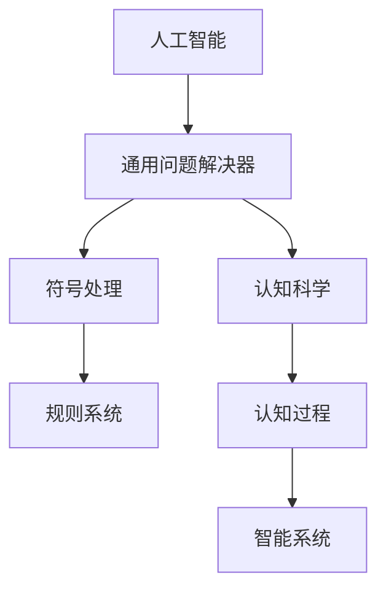

                 

## 1. 背景介绍

### 1.1 历史背景

1956年夏天，在达特茅斯学院（Dartmouth College）举办了一场后来被称为“人工智能的摇篮”的会议。这是历史上第一次在学术领域广泛讨论人工智能主题的会议，参会者包括了计算机科学家、数学家、心理学家、神经科学家、控制论专家和电子工程师等。

### 1.2 重要议题

会议的议题集中在如何构建能够像人一样思考、学习和推理的智能机器。会议主要围绕以下几个问题展开：
- 如何实现机器的认知能力？
- 认知过程中的符号表示和操作机制是什么？
- 机器能够执行哪些具体的智能任务？
- 如何构建具有常识和经验推理的智能系统？

### 1.3 会议成果

会议结束时，并没有产生一种统一的AI理论，但它在以下几个方面取得了重要成果：
- 首次将“人工智能”（Artificial Intelligence）一词引入科学界，并普及至公众。
- 明确了人工智能的目标是构建能够执行复杂任务、拥有自主决策能力的智能机器。
- 确定了认知科学、计算机科学和心理学等多学科交叉的重要性。
- 提出了“通用问题解决器”（General Problem-Solving）的概念，即构建能够解决任何问题的智能系统。
- 成立了“达特茅斯人工智能实验室”，并推动了后续的AI研究和教育活动。

## 2. 核心概念与联系

### 2.1 核心概念概述

达特茅斯会议奠定了人工智能的基石，并催生了许多关键概念。

- **人工智能**：是指构建能够执行复杂任务、具备自主决策和认知能力的智能机器。
- **通用问题解决器**：指的是能够解决任何问题的智能系统，能执行符号推理、模式识别、感知、记忆等多种功能。
- **符号处理**：指的是在计算机中使用符号（如字符、词）来代表和操作现实世界的概念，是早期人工智能系统的核心机制。
- **规则系统**：通过预设的规则（if-then语句）来指导智能系统的行为，早期的AI系统依赖于大量的手工编写的规则。
- **认知科学**：研究人类认知过程的科学，通过理解人类大脑的工作原理，启发AI系统的设计。

### 2.2 核心概念原理和架构的 Mermaid 流程图



这个流程图展示了人工智能系统的几个关键组成部分及其相互关系：

1. 人工智能系统旨在构建具有各种智能功能的机器。
2. 通用问题解决器是AI系统的核心，能解决任何问题。
3. 符号处理是AI系统的主要操作机制，利用符号表示和操作概念。
4. 规则系统基于预设的规则，指导AI系统的行为。
5. 认知科学通过理解人类认知，启发AI系统的设计。

## 3. 核心算法原理 & 具体操作步骤

### 3.1 算法原理概述

达特茅斯会议后，符号处理和规则系统成为了早期AI研究的重点。AI系统通过符号表示和规则推理来执行任务，这种基于规则的方法在早期取得了一定成功。

### 3.2 算法步骤详解

1. **符号表示**：将现实世界中的对象和概念抽象为符号，建立符号之间的关联。例如，将“猫”这个概念表示为字符串“cat”。
2. **规则编写**：根据具体任务，编写一系列的规则，用于符号推理。例如，“如果一只动物有四条腿，那么它可能是一只猫。”
3. **符号推理**：通过符号规则和符号表示，进行推理和决策。例如，将“狗”的四条腿和“猫”的四条腿进行比较，推断出“狗可能是一只猫”。

### 3.3 算法优缺点

**优点**：
- 符号处理具有逻辑严密、可解释性强等优点，便于理解和调试。
- 规则系统可以针对具体任务进行定制，适应性强。

**缺点**：
- 需要大量手工编写规则，工作量大且容易出错。
- 符号处理难以处理不确定性和复杂情境，灵活性差。
- 无法模拟人类学习过程，难以应对新环境和动态变化。

### 3.4 算法应用领域

早期的AI系统主要应用于问题求解和专家系统领域。例如，DENDRAL化学分子结构识别系统、MYCIN医疗诊断系统等。这些系统通过符号表示和规则推理，解决了具体领域内的问题，但面临扩展性、灵活性和效率的问题。

## 4. 数学模型和公式 & 详细讲解 & 举例说明

### 4.1 数学模型构建

在早期AI系统中，符号推理和规则系统依赖于逻辑和数学模型。例如，Prolog语言是一种基于符号推理的AI编程语言，其核心是规则和事实的组合。

### 4.2 公式推导过程

Prolog的规则表示为if-then语句：
$$
\text{规则} = \text{事实} \rightarrow \text{结果}
$$
例如：
$$
\text{cat} \rightarrow \text{has_four_legs}
$$
表示“猫有四条腿”这一事实。

### 4.3 案例分析与讲解

**例子**：构建一个简单的Prolog程序，用于识别“猫”和“狗”。
```prolog
cat : has_four_legs.
dog : has_four_legs.
```
通过上述规则，程序可以识别“有四条腿”的动物，并推断出可能是“猫”或“狗”。

## 5. 项目实践：代码实例和详细解释说明

### 5.1 开发环境搭建

要构建基于符号处理和规则系统的AI系统，需要一定的编程和逻辑推理能力。Python是一个不错的选择，因为它有丰富的库支持符号处理和逻辑推理。

### 5.2 源代码详细实现

以下是一个简单的Python程序，用于模拟符号处理和规则推理：
```python
# 定义符号和规则
cat = 'has_four_legs'
dog = 'has_four_legs'
four_legs = 'has_four_legs'

# 定义推理函数
def infer(animals, facts):
    for animal in animals:
        for fact in facts:
            if fact[1] == animal:
                return fact[0]
    return None

# 测试推理
animals = [cat, dog]
facts = [(cat, four_legs), (dog, four_legs)]
result = infer(animals, facts)
print(result)
```
这段代码定义了符号和规则，并实现了一个简单的推理函数`infer`。通过输入“猫”和“狗”的符号，以及“有四条腿”的事实，程序能够推理出符合条件的动物。

### 5.3 代码解读与分析

- 符号定义：使用字符串表示符号，方便程序处理。
- 规则表示：使用元组表示事实和规则，形式化表示推理逻辑。
- 推理函数：通过遍历符号和事实，查找符合规则的动物。
- 测试结果：输出符合条件的动物，即“猫”或“狗”。

### 5.4 运行结果展示

```
cat
```
程序正确推理出“猫”和“狗”符合“有四条腿”的事实，输出“cat”。

## 6. 实际应用场景

### 6.1 专家系统

早期AI系统的典型应用是专家系统（Expert Systems），如MYCIN医疗诊断系统和DENDRAL化学分子结构识别系统。专家系统通过存储领域专家的知识和经验，构建规则库，并利用规则推理进行决策。

### 6.2 问题求解

AI系统在数学、逻辑、规划等领域也有广泛应用。例如，Prolog语言在逻辑推理和数学问题求解方面表现出色。

### 6.3 人工智能研究

达特茅斯会议奠定了人工智能研究的基石，推动了后续的AI研究和发展。例如，1966年成立的美国人工智能协会（AAAI），每年举办的人工智能大会（AAAI Conference）等，都是达特茅斯会议精神的具体体现。

### 6.4 未来应用展望

未来，AI系统将更加注重认知能力的提升，通过模拟人类认知过程，实现更强大的智能。例如，基于神经网络的AI系统可以模拟人类大脑的认知机制，通过深度学习实现符号处理和规则推理。

## 7. 工具和资源推荐

### 7.1 学习资源推荐

1. **书籍**：《人工智能导论》（Richard S. Sutton）：全面介绍了AI的基本概念、算法和应用。
2. **课程**：MIT的《6.034 人工智能导论》：涵盖AI基础知识和经典算法，并使用Python语言实现。
3. **在线资源**：AI网络：提供AI领域的最新研究进展和新闻资讯。

### 7.2 开发工具推荐

1. **Python**：Python有丰富的库支持符号处理和逻辑推理，如SymPy、Prolog等。
2. **Sympy**：用于数学符号计算和逻辑推理的Python库。
3. **Prolog**：基于符号推理的AI编程语言，提供丰富的规则和事实处理功能。

### 7.3 相关论文推荐

1. **符号处理**：《Prolog Programming》（Alan M. Perlis）：介绍了Prolog语言和符号推理的基本原理。
2. **专家系统**：《Expert Systems and Medical Decision Support》（Claude F. Chabot）：介绍了专家系统在医疗领域的应用。

## 8. 总结：未来发展趋势与挑战

### 8.1 研究成果总结

达特茅斯会议奠定了人工智能的基石，推动了后续的AI研究和应用。符号处理和规则系统虽然有其局限性，但在早期AI研究中起到了重要作用。

### 8.2 未来发展趋势

1. **神经网络**：神经网络在模拟人类大脑的认知过程方面表现出色，未来将成为AI研究的重要方向。
2. **认知科学**：通过理解人类认知过程，可以启发AI系统的设计，提升系统的智能水平。
3. **多模态融合**：将视觉、语音、文本等多模态信息进行融合，构建更加全面和复杂的智能系统。
4. **知识图谱**：通过构建知识图谱，将符号处理和神经网络结合，提升AI系统的表达能力和推理能力。

### 8.3 面临的挑战

1. **数据瓶颈**：大规模的训练数据对神经网络非常重要，但获取高质量数据成本高昂。
2. **计算资源**：神经网络需要大量计算资源，目前高性能计算能力有限。
3. **可解释性**：神经网络黑盒特征使得系统难以解释和调试，影响系统可信度。
4. **鲁棒性**：神经网络对数据分布的变化敏感，需要提高系统的鲁棒性和泛化能力。

### 8.4 研究展望

未来的AI研究需要结合符号处理和神经网络的优势，构建更加全面和智能的系统。例如，结合知识图谱和神经网络，构建符号推理和知识表示的融合系统，提升系统的表达能力和推理能力。同时，需要解决数据瓶颈和计算资源不足的问题，提升AI系统的可解释性和鲁棒性。

## 9. 附录：常见问题与解答

**Q1：达特茅斯会议对人工智能的发展有何影响？**

A：达特茅斯会议明确了人工智能的目标和方向，奠定了人工智能研究的基石。会议提出了“人工智能”这一概念，并推动了后续的AI研究和应用。

**Q2：早期AI系统的主要研究方法是什么？**

A：早期AI系统主要基于符号处理和规则系统。通过符号表示和规则推理，实现问题求解和专家系统等应用。

**Q3：神经网络在AI研究中的应用前景如何？**

A：神经网络在模拟人类大脑的认知过程中表现出色，未来将成为AI研究的重要方向。神经网络可以处理复杂数据，提升系统的智能水平和鲁棒性。

**Q4：未来AI系统的挑战是什么？**

A：未来AI系统面临数据瓶颈、计算资源不足、可解释性差、鲁棒性不足等挑战。需要解决这些问题，才能实现更智能、更可信的AI系统。

**Q5：AI研究如何结合符号处理和神经网络？**

A：AI研究可以结合符号处理和神经网络的优势，构建融合系统。例如，结合知识图谱和神经网络，提升系统的表达能力和推理能力。

作者：禅与计算机程序设计艺术 / Zen and the Art of Computer Programming

