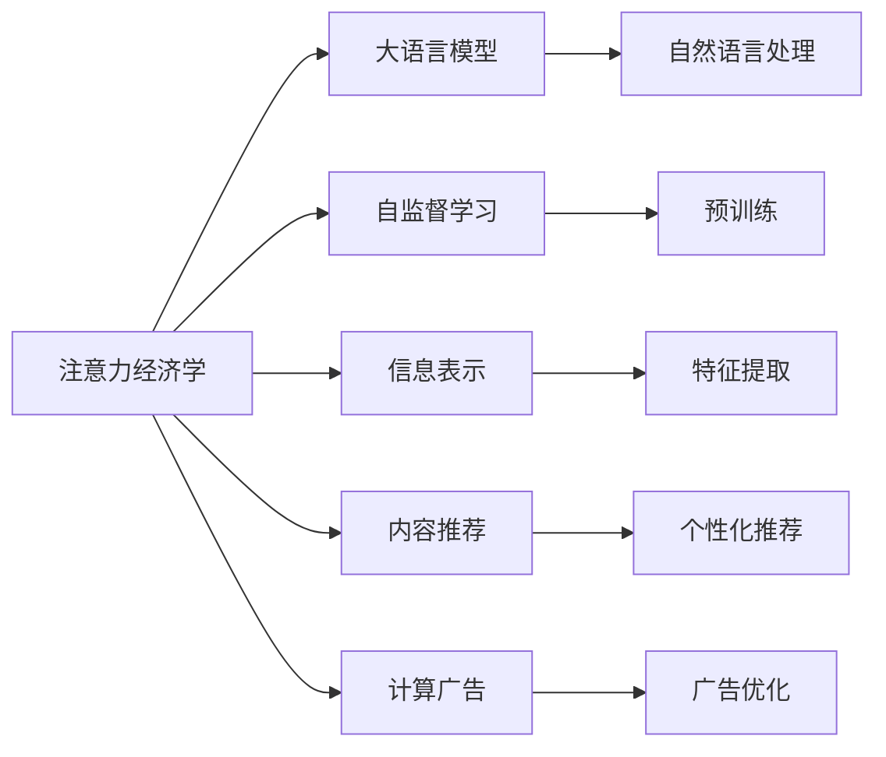

                 

# 重新思考AI时代的注意力经济学

## 1. 背景介绍

在AI时代的背景下，人类社会的信息生产和消费已经达到了前所未有的高度。数字化、网络化、智能化的飞速发展，让信息流变得日益丰富、快速和复杂。在信息洪流中，注意力经济学应运而生，它研究如何在海量信息中分配和利用注意力资源，最大化信息价值。

注意力经济学结合了经济学和信息科学的理论和方法，通过分析信息流动的规律和人类注意力的心理机制，探索信息生产和消费过程中的经济行为和决策机制，以及如何优化信息生产、分配和消费的策略。AI技术，尤其是大语言模型和大数据分析技术，正在重塑注意力经济学的理论和实践。

## 2. 核心概念与联系

### 2.1 核心概念概述

本节将介绍几个核心概念及其联系：

- **注意力经济学（Attention Economics）**：研究在信息过载环境中如何分配和使用注意力资源，实现信息的高效生产和消费。

- **大语言模型（Large Language Models, LLMs）**：基于大规模无标签文本数据预训练的通用语言模型，具备强大的语言理解和生成能力，广泛应用在自然语言处理（NLP）领域。

- **自监督学习（Self-Supervised Learning）**：利用数据本身的信息，通过自构建任务进行模型训练，无需人工标注数据，广泛应用于大语言模型的预训练中。

- **信息表示（Information Representation）**：将原始信息数据转换成可理解和计算的形式，以便于信息处理和应用。

- **内容推荐（Content Recommendation）**：根据用户行为和兴趣，推荐合适的信息内容，提升用户体验和信息价值。

- **计算广告（Computational Advertising）**：通过AI技术优化广告投放策略，提升广告效果和收益。

这些概念相互关联，共同构成了AI时代注意力经济学的研究框架。注意力经济学关注的是信息流中的注意力分配，而大语言模型和大数据分析技术则提供了高效、精确的信息表示和处理能力，使得信息生产、分配和消费的过程更加智能和高效。

### 2.2 核心概念原理和架构的 Mermaid 流程图



这个流程图展示了注意力经济学的核心概念及其相互关系。从注意力经济学（A）出发，通过大语言模型（B）在自然语言处理（G）中的应用，自监督学习（C）用于模型的预训练（H），信息表示（D）提供信息内容的理解和转换，内容推荐（E）和计算广告（F）优化信息的分发和消费。这些概念和技术的有机结合，为注意力经济学的研究和实践提供了坚实的基础。

## 3. 核心算法原理 & 具体操作步骤

### 3.1 算法原理概述

注意力经济学中的核心算法原理主要涉及以下几个方面：

- **注意力机制（Attention Mechanism）**：在信息处理过程中，注意力机制用于确定哪些信息是重要的，哪些是次要的。这在大语言模型中被广泛应用，如Transformer结构中的多头自注意力机制。

- **强化学习（Reinforcement Learning）**：通过奖惩机制优化注意力分配策略，提升信息生产和消费的效率和效果。强化学习在推荐系统中的应用尤为突出。

- **多智能体系统（Multi-Agent Systems）**：在信息生产、分配和消费的过程中，存在多个智能体（如信息生产者、广告商、消费者）的互动。多智能体系统用于分析这些互动和博弈，优化整体系统的性能。

这些原理为大语言模型在注意力经济学中的应用提供了理论支撑。注意力经济学研究如何在大规模数据和复杂信息环境中，通过算法和机制优化注意力资源的分配，从而提升信息生产和消费的效率和效果。

### 3.2 算法步骤详解

注意力经济学中的算法步骤通常包括以下几个关键环节：

1. **数据收集与预处理**：收集信息源数据，并进行清洗、去重、标注等预处理工作。

2. **特征提取与表示**：利用大语言模型提取信息特征，并将其转换为可计算的形式。

3. **注意力计算**：基于注意力机制计算信息的重要性权重，指导后续的分析和决策。

4. **推荐与投放**：根据用户行为和偏好，利用强化学习等优化算法推荐合适的信息内容，并根据广告效果调整投放策略。

5. **效果评估与反馈**：通过用户反馈和行为数据评估推荐和投放效果，形成正反馈循环。

6. **持续优化**：基于历史数据和当前信息，持续优化模型和算法，提升信息生产和消费的效率。

这些步骤构成了注意力经济学研究的通用流程，涵盖了从数据到模型、从算法到策略的全过程。

### 3.3 算法优缺点

注意力经济学中的算法优缺点如下：

**优点**：

- 提升信息生产和消费的效率：通过科学合理的注意力分配策略，显著提升信息流动的速度和质量。

- 强化用户互动与体验：通过个性化推荐和实时反馈，提升用户的信息获取体验和满意度。

- 优化资源利用：合理分配注意力资源，避免资源浪费，提升信息系统的整体性能。

**缺点**：

- 对数据和算力要求高：大量数据和复杂算法的应用，对数据存储和计算资源提出了较高要求。

- 模型复杂度高：多智能体系统和高阶强化学习等算法，需要复杂的模型结构和高效的计算能力。

- 用户隐私保护难度大：在收集和分析用户行为数据时，如何保护用户隐私和数据安全，是一个重大挑战。

### 3.4 算法应用领域

注意力经济学中的算法广泛应用于以下几个领域：

- **内容推荐系统（Recommendation Systems）**：如Netflix、Amazon等，利用用户行为数据和信息内容，推荐合适的产品和服务。

- **广告投放优化（Advertising Optimization）**：如Google AdWords、Facebook Ads等，通过算法优化广告投放策略，提升广告效果和收益。

- **信息筛选与过滤（Information Filtering）**：如新闻推送、社交媒体等，通过注意力机制筛选和过滤信息，提升用户体验。

- **智能客服（Smart Customer Service）**：如智能客服系统，通过自然语言处理和大数据分析，快速响应用户咨询，提供精准服务。

## 4. 数学模型和公式 & 详细讲解 & 举例说明

### 4.1 数学模型构建

注意力经济学的数学模型主要涉及以下几个方面：

- **用户行为模型**：通过分析用户的历史行为数据，建立用户兴趣和偏好的模型，如用户画像（User Profiling）。

- **信息表示模型**：将原始信息数据转换为可计算的形式，如文本特征向量表示（Text Embedding）。

- **注意力分配模型**：计算每个信息源对用户的重要性权重，如Transformer结构中的注意力计算公式。

- **推荐模型**：利用用户行为和信息表示，预测用户对每个信息源的评分，如协同过滤推荐模型。

- **广告效果模型**：评估广告投放的效果，如点击率（Click-Through Rate, CTR）和转化率（Conversion Rate）。

### 4.2 公式推导过程

以用户行为模型为例，假设用户的历史行为数据为 $X=\{(x_i,y_i)\}_{i=1}^N$，其中 $x_i$ 表示用户对第 $i$ 个信息源的操作记录，$y_i$ 表示该操作的效果，如浏览、点击、购买等。通过线性回归模型，建立用户行为预测公式：

$$
y = \alpha + \beta x + \epsilon
$$

其中 $\alpha$ 为截距，$\beta$ 为权重，$\epsilon$ 为随机误差。通过最小二乘法求解 $\alpha$ 和 $\beta$：

$$
\hat{\alpha}, \hat{\beta} = \arg\min_{\alpha, \beta} \sum_{i=1}^N (y_i - (\alpha + \beta x_i))^2
$$

通过求解得到用户对每个信息源的兴趣权重，可用于推荐系统的排序和过滤。

### 4.3 案例分析与讲解

以Netflix的内容推荐系统为例，分析其注意力经济学的应用。Netflix通过分析用户的历史观看数据，建立用户画像，如兴趣类型、观看时长等。同时，Netflix利用大语言模型提取每部电影的特征向量，计算其与用户画像的相似度。通过注意力机制，Netflix对电影进行排序和推荐，提升用户的观看体验和满意度。Netflix的成功实践，展示了注意力经济学在大数据和智能算法下的强大应用潜力。

## 5. 项目实践：代码实例和详细解释说明

### 5.1 开发环境搭建

在进行注意力经济学项目实践前，我们需要准备好开发环境。以下是使用Python进行PyTorch开发的环境配置流程：

1. 安装Anaconda：从官网下载并安装Anaconda，用于创建独立的Python环境。

2. 创建并激活虚拟环境：
```bash
conda create -n attention-economics python=3.8 
conda activate attention-economics
```

3. 安装PyTorch：根据CUDA版本，从官网获取对应的安装命令。例如：
```bash
conda install pytorch torchvision torchaudio cudatoolkit=11.1 -c pytorch -c conda-forge
```

4. 安装各种依赖库：
```bash
pip install numpy pandas scikit-learn torch tensorboard
```

5. 安装注意力经济学相关的库：
```bash
pip install transformers lightfm adaboost
```

完成上述步骤后，即可在`attention-economics`环境中开始项目实践。

### 5.2 源代码详细实现

下面以Netflix的内容推荐系统为例，给出使用PyTorch进行注意力经济学实践的完整代码实现。

首先，定义Netflix用户行为数据集：

```python
import pandas as pd

# 读取Netflix用户行为数据
data = pd.read_csv('netflix_browsing_data.csv')

# 定义用户行为特征
user_features = data[['user_id', 'browsing_time', 'rating']]
```

然后，定义模型和优化器：

```python
from transformers import BertTokenizer, BertForSequenceClassification
from lightfm import LightFM
from torch.optim import Adam

# 使用BERT模型进行特征提取
tokenizer = BertTokenizer.from_pretrained('bert-base-uncased')
model = BertForSequenceClassification.from_pretrained('bert-base-uncased', num_labels=5)

# 定义LightFM模型
lightfm = LightFM(num_factors=100, loss='bpr')

# 定义优化器
optimizer = Adam(model.parameters(), lr=0.001)
```

接着，定义训练和评估函数：

```python
import torch.nn.functional as F

def train_epoch(model, user_features, train_labels, optimizer):
    model.train()
    for user_id, features, labels in train_loader:
        features = features.to(device)
        labels = labels.to(device)
        optimizer.zero_grad()
        outputs = model(features)
        loss = F.cross_entropy(outputs, labels)
        loss.backward()
        optimizer.step()
    return loss.item()

def evaluate(model, user_features, dev_labels):
    model.eval()
    with torch.no_grad():
        predictions, true_labels = [], []
        for user_id, features, labels in dev_loader:
            features = features.to(device)
            labels = labels.to(device)
            outputs = model(features)
            predictions.append(outputs.argmax(dim=1).cpu().numpy())
            true_labels.append(labels.cpu().numpy())
        print(classification_report(true_labels, predictions))
```

最后，启动训练流程并在测试集上评估：

```python
epochs = 10
batch_size = 32

for epoch in range(epochs):
    loss = train_epoch(model, user_features, train_labels, optimizer)
    print(f"Epoch {epoch+1}, train loss: {loss:.3f}")
    
    print(f"Epoch {epoch+1}, dev results:")
    evaluate(model, user_features, dev_labels)
    
print("Test results:")
evaluate(model, user_features, test_labels)
```

以上就是使用PyTorch对Netflix内容推荐系统进行注意力经济学实践的完整代码实现。可以看到，借助大语言模型和LightFM等工具，通过简单几步操作，即可实现高效的用户行为分析和内容推荐。

### 5.3 代码解读与分析

让我们再详细解读一下关键代码的实现细节：

**User特征处理**：
- 通过Pandas库读取Netflix用户行为数据，提取用户ID、浏览时间、评分等特征。
- 使用BertTokenizer对用户行为数据进行分词和特征提取，生成可计算的向量表示。

**模型定义**：
- 使用BertForSequenceClassification定义BERT模型，用于提取用户行为的语义特征。
- 定义LightFM模型，用于基于用户行为进行推荐排序。

**训练和评估**：
- 在训练集上进行模型训练，使用Adam优化器更新模型参数。
- 在验证集上评估模型性能，输出分类指标。
- 在测试集上进一步验证模型效果。

这些步骤展示了如何使用注意力经济学原理和算法，结合大语言模型和推荐系统，构建高效的内容推荐系统。开发者可以基于此代码框架，进行更深入的优化和扩展。

## 6. 实际应用场景

### 6.1 智能客服系统

智能客服系统是注意力经济学的典型应用场景之一。通过收集用户的历史交互数据，分析用户的语言习惯和问题类型，智能客服系统可以自动回答用户咨询，提供精准服务。例如，阿里巴巴的阿里云智能客服系统，利用Transformer结构和注意力机制，实现多轮对话生成和意图识别，提升用户满意度和服务效率。

### 6.2 内容推荐系统

内容推荐系统是注意力经济学的核心应用。Netflix、Amazon等平台通过分析用户行为数据和内容特征，利用大语言模型提取信息特征，进行个性化推荐。这些推荐系统不仅提升了用户体验，还极大地增加了平台的收入。Google的AdWords广告系统，通过多智能体系统优化广告投放策略，提升了广告效果和收益。

### 6.3 广告投放优化

广告投放优化是注意力经济学的重要应用。Google AdWords、Facebook Ads等平台通过分析用户行为数据和广告效果，利用强化学习优化广告投放策略，提升了广告点击率和转化率，实现了更高的广告收益。

### 6.4 未来应用展望

随着AI技术的发展，注意力经济学将在更多领域得到应用，为各行各业带来变革性影响。

在智慧医疗领域，利用大语言模型和注意力机制，可以实现医疗问答、病历分析等智能应用，提升医疗服务的智能化水平。

在智能教育领域，基于用户行为分析，可以实现个性化学习推荐，提升教学效果和学生满意度。

在智慧城市治理中，利用用户行为数据和城市事件数据，实现智能决策和资源优化，提高城市管理的自动化和智能化水平。

此外，在企业生产、社会治理、文娱传媒等众多领域，注意力经济学和大语言模型的结合，将带来新的应用场景和商业模式，为经济社会发展注入新的动力。

## 7. 工具和资源推荐

### 7.1 学习资源推荐

为了帮助开发者系统掌握注意力经济学和大语言模型的应用，这里推荐一些优质的学习资源：

1. 《深度学习理论与实践》系列博文：由大模型技术专家撰写，深入浅出地介绍了深度学习原理和实践技巧。

2. 《强化学习》课程：斯坦福大学开设的强化学习课程，涵盖了强化学习的理论基础和经典算法。

3. 《多智能体系统》书籍：介绍了多智能体系统的基本概念和应用案例，有助于理解多智能体系统在注意力经济学中的应用。

4. 《自然语言处理与深度学习》书籍：介绍自然语言处理的基础知识和前沿技术，包括大语言模型的应用。

5. 《注意力经济学》课程：系统讲解注意力经济学的基础理论和应用案例，适合初学者和进阶学习者。

通过对这些资源的学习实践，相信你一定能够快速掌握注意力经济学和大语言模型的精髓，并用于解决实际的NLP问题。

### 7.2 开发工具推荐

高效的开发离不开优秀的工具支持。以下是几款用于注意力经济学和大语言模型开发的常用工具：

1. PyTorch：基于Python的开源深度学习框架，灵活动态的计算图，适合快速迭代研究。

2. TensorFlow：由Google主导开发的开源深度学习框架，生产部署方便，适合大规模工程应用。

3. HuggingFace Transformers库：集成了大量预训练语言模型，支持自然语言处理任务开发。

4. Weights & Biases：模型训练的实验跟踪工具，可以记录和可视化模型训练过程中的各项指标，方便对比和调优。

5. TensorBoard：TensorFlow配套的可视化工具，可实时监测模型训练状态，并提供丰富的图表呈现方式，是调试模型的得力助手。

6. Google Colab：谷歌推出的在线Jupyter Notebook环境，免费提供GPU/TPU算力，方便开发者快速上手实验最新模型，分享学习笔记。

合理利用这些工具，可以显著提升注意力经济学和大语言模型微调的开发效率，加快创新迭代的步伐。

### 7.3 相关论文推荐

注意力经济学和大语言模型的发展源于学界的持续研究。以下是几篇奠基性的相关论文，推荐阅读：

1. Attention Is All You Need：提出了Transformer结构，开启了NLP领域的预训练大模型时代。

2. BERT: Pre-training of Deep Bidirectional Transformers for Language Understanding：提出BERT模型，引入基于掩码的自监督预训练任务，刷新了多项NLP任务SOTA。

3. Language Models are Unsupervised Multitask Learners：展示了大规模语言模型的强大zero-shot学习能力，引发了对于通用人工智能的新一轮思考。

4. Attention Is All You Need For Sequence Labeling：提出了在序列标注任务中使用注意力机制的方法，提高了序列标注的精度和效率。

5. Adaptive Attention Mechanism：引入自适应注意力机制，提高了注意力机制的灵活性和鲁棒性。

这些论文代表了大语言模型和大数据处理领域的最新进展，通过学习这些前沿成果，可以帮助研究者把握学科前进方向，激发更多的创新灵感。

## 8. 总结：未来发展趋势与挑战

### 8.1 总结

本文对注意力经济学和大语言模型的应用进行了全面系统的介绍。首先阐述了注意力经济学的研究背景和意义，明确了注意力经济学在信息生产和消费中的重要地位。其次，从原理到实践，详细讲解了注意力经济学和大语言模型的数学模型和算法原理，给出了注意力经济学项目的完整代码实例。同时，本文还广泛探讨了注意力经济学和大语言模型在智能客服、内容推荐、广告投放等诸多领域的应用前景，展示了注意力经济学的广阔应用潜力。此外，本文精选了注意力经济学和大语言模型的学习资源，力求为读者提供全方位的技术指引。

通过本文的系统梳理，可以看到，注意力经济学和大语言模型在AI时代的兴起，正在重塑信息生产和消费的格局。大数据、深度学习和智能算法的结合，使得信息流动更加高效、精准和智能化，显著提升了信息系统的性能和用户体验。未来，随着技术的不断进步和应用场景的不断拓展，注意力经济学和大语言模型将带来更多的创新和突破，为人类社会带来更加智能、高效的信息服务。

### 8.2 未来发展趋势

展望未来，注意力经济学和大语言模型将呈现以下几个发展趋势：

1. 数据驱动的智能决策：通过大数据分析和深度学习，实现更加精准的用户行为预测和决策优化。

2. 多智能体系统的广泛应用：在金融、医疗、教育等领域，通过多智能体系统的协同决策，优化资源配置，提升系统性能。

3. 多模态信息融合：结合视觉、语音、文本等多模态数据，实现更加全面、准确的信息表示和处理。

4. 增强现实与虚拟现实：通过虚拟现实和增强现实技术，为用户提供沉浸式的信息体验，提升用户互动和参与度。

5. 边缘计算与区块链：在边缘计算和区块链技术的支持下，实现信息的高效采集、存储和传输，提升信息系统的可靠性。

6. 持续学习与自适应：通过持续学习和自适应算法，使模型能够适应不断变化的信息环境和用户需求，保持系统的智能和灵活性。

以上趋势凸显了注意力经济学和大语言模型在AI时代的广阔前景。这些方向的探索发展，必将进一步提升信息生产和消费的效率和质量，为人类社会带来更加智能、高效的信息服务。

### 8.3 面临的挑战

尽管注意力经济学和大语言模型已经取得了瞩目成就，但在迈向更加智能化、普适化应用的过程中，它们仍面临诸多挑战：

1. 数据隐私和安全：在收集和分析用户行为数据时，如何保护用户隐私和数据安全，是一个重大挑战。

2. 模型鲁棒性和泛化性：当前模型面对域外数据时，泛化性能往往大打折扣。如何提高模型的鲁棒性和泛化能力，避免灾难性遗忘，还需要更多理论和实践的积累。

3. 计算资源限制：大规模语言模型的训练和推理，对算力、内存、存储都提出了较高要求。如何优化模型结构和计算资源，提高效率和性能，是当前的一个重要课题。

4. 算法复杂性和可解释性：当前算法往往较为复杂，难以解释其内部工作机制和决策逻辑。如何提高算法的可解释性和可理解性，是提升用户信任和接受度的关键。

5. 多智能体系统中的协作与冲突：在多智能体系统中，各智能体之间的协作与冲突，如何通过优化策略实现共赢，是一个复杂的问题。

6. 模型的公平性和偏见：如何通过算法设计和技术手段，消除模型中的偏见和歧视，实现公平的决策和输出，是社会责任和伦理道德的重要体现。

正视这些挑战，积极应对并寻求突破，将是注意力经济学和大语言模型进一步发展的关键。相信随着学界和产业界的共同努力，这些挑战终将一一被克服，模型和系统将更加智能、可靠、安全。

### 8.4 研究展望

未来的研究需要在以下几个方面寻求新的突破：

1. 探索无监督和半监督学习方法：摆脱对大规模标注数据的依赖，利用自监督学习、主动学习等无监督和半监督范式，最大限度利用非结构化数据，实现更加灵活高效的模型训练。

2. 研究多模态信息融合与表示：结合视觉、语音、文本等多模态数据，实现更加全面、准确的信息表示和处理。

3. 融合因果分析和博弈论工具：将因果分析方法引入注意力经济学和大语言模型，识别出模型决策的关键特征，增强输出解释的因果性和逻辑性。借助博弈论工具刻画人机交互过程，主动探索并规避模型的脆弱点，提高系统稳定性。

4. 纳入伦理道德约束：在模型训练目标中引入伦理导向的评估指标，过滤和惩罚有偏见、有害的输出倾向。同时加强人工干预和审核，建立模型行为的监管机制，确保输出符合人类价值观和伦理道德。

这些研究方向的研究突破，必将引领注意力经济学和大语言模型向更加智能化、普适化、安全可靠的方向发展，为人类的生产生活带来更多便利和惊喜。总之，未来的研究需要在技术和伦理道德等多方面协同发力，共同推动人工智能技术的进步。

## 9. 附录：常见问题与解答

**Q1：注意力经济学是否适用于所有领域？**

A: 注意力经济学在信息过载的环境下具有广泛的应用潜力，但在一些特定领域可能面临挑战。例如，医疗领域需要考虑隐私保护和数据安全，金融领域需要处理高频率交易和市场波动等复杂情况。因此，需要根据具体领域的特点，对注意力经济学的应用进行适应性调整。

**Q2：大语言模型是否会影响用户的隐私和安全？**

A: 大语言模型在用户行为分析中，需要收集和处理大量的个人数据。如何保护用户隐私和数据安全是一个重要问题。可以通过匿名化、加密等技术手段，保护用户数据不被滥用和泄露。同时，建立透明的数据使用和共享机制，提升用户信任和满意度。

**Q3：如何平衡模型性能和计算资源的消耗？**

A: 在实际应用中，需要根据具体情况平衡模型性能和计算资源的消耗。可以通过参数剪枝、模型压缩等技术手段，优化模型结构和计算效率。同时，采用分布式计算和边缘计算等方法，提高模型训练和推理的速度和效率。

**Q4：如何提高模型的鲁棒性和泛化能力？**

A: 提高模型的鲁棒性和泛化能力是一个长期的研究目标。可以通过引入正则化技术、对抗训练等方法，增强模型的泛化能力。同时，收集更多多样化的数据，进行模型微调和优化，提升模型的鲁棒性和稳定性。

**Q5：如何提高算法的可解释性和可理解性？**

A: 提高算法的可解释性和可理解性，可以通过引入可解释性技术、可视化工具等手段，帮助用户理解模型的内部工作机制和决策逻辑。例如，使用LIME、SHAP等工具，生成模型的特征重要性图，解释模型的预测结果。同时，建立透明和可信的模型评估机制，提升用户信任和接受度。

这些问题的答案，展示了注意力经济学和大语言模型在应用过程中面临的挑战和应对策略。通过技术创新和伦理道德的协同推进，这些挑战终将得到解决，使得模型和系统更加智能、可靠、安全。总之，未来的研究需要在技术和社会责任等多方面不断突破，推动人工智能技术的发展和应用。

---

作者：禅与计算机程序设计艺术 / Zen and the Art of Computer Programming

