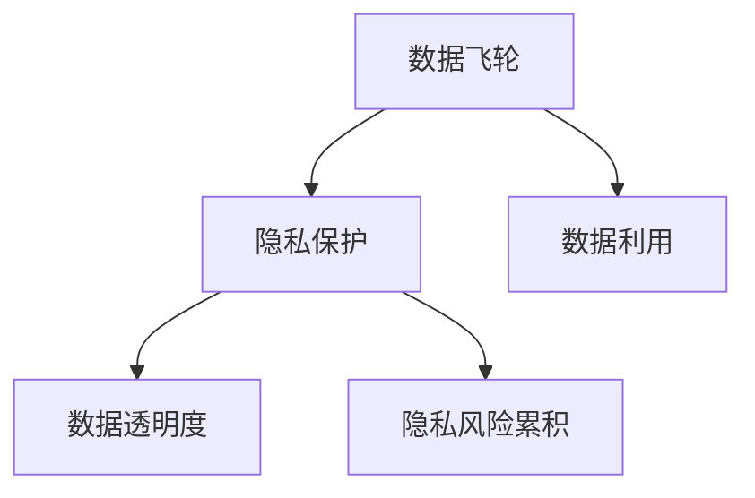

                 

# 隐私保护与数据飞轮的矛盾探讨

## 1. 背景介绍

随着大数据和人工智能技术的迅猛发展，数据飞轮(Datasphere)成为当今信息社会的一种重要现象，即通过数据的循环采集、清洗、分析、再采集，不断增强企业的数据资产，为算法模型的训练和优化提供更丰富的数据源，进而提升模型精度和应用效果。然而，数据飞轮的运作过程也引发了严重的隐私保护问题。

隐私保护是指保护个人、组织或群体的数据不被未经授权的收集、使用或共享。在数据飞轮的循环过程中，数据不断被收集、处理和分析，隐私风险不断累积，用户隐私保护和数据利用之间的矛盾日益突出。一方面，企业希望通过大数据和人工智能技术提升自身竞争力，另一方面，用户和监管机构对于隐私保护的要求越来越高，两者之间的冲突加剧。

隐私保护与数据飞轮的矛盾主要体现在以下几个方面：

- 数据隐私风险累积：在数据飞轮中，数据经过多次处理和分析，隐私风险不断累积，用户隐私保护压力增大。
- 数据使用透明度不足：数据飞轮中的数据采集、清洗和分析过程复杂且隐蔽，用户难以了解其隐私数据被如何使用。
- 隐私保护的限制：当前隐私保护技术无法完全消除数据飞轮带来的隐私风险，且隐私保护限制了数据利用的范围和效率。

本文档旨在深入探讨隐私保护与数据飞轮之间的矛盾，分析当前隐私保护技术在数据飞轮中的应用和局限，提出可能的解决策略，为数据飞轮的隐私保护提供理论和实践参考。

## 2. 核心概念与联系

### 2.1 核心概念概述

为更好地理解隐私保护与数据飞轮的矛盾，本节将介绍几个密切相关的核心概念：

- 数据飞轮：指通过数据的循环采集、清洗、分析、再采集，不断增强企业的数据资产，为算法模型的训练和优化提供更丰富的数据源，进而提升模型精度和应用效果。

- 隐私保护：指保护个人、组织或群体的数据不被未经授权的收集、使用或共享。隐私保护技术包括数据匿名化、差分隐私、联邦学习等。

- 数据利用：指企业利用数据飞轮采集的数据，通过模型训练和优化，提升自身竞争力，创造经济价值。

- 数据透明度：指数据在采集、处理和分析过程中的可追溯性和可理解性，用户可以清楚地了解其数据被如何利用。

- 隐私风险累积：指在数据飞轮的循环过程中，隐私风险不断累积，用户隐私保护压力增大。

这些核心概念之间的逻辑关系可以通过以下Mermaid流程图来展示：



这个流程图展示了大数据飞轮中的核心概念及其之间的关系：

1. 数据飞轮通过数据的循环采集、清洗、分析、再采集，不断增强企业的数据资产。
2. 隐私保护是保护个人隐私不被未经授权收集、使用或共享的技术手段。
3. 数据利用指企业通过数据飞轮采集的数据，提升自身竞争力，创造经济价值。
4. 数据透明度指数据在采集、处理和分析过程中的可追溯性和可理解性。
5. 隐私风险累积指在数据飞轮的循环过程中，隐私风险不断累积，用户隐私保护压力增大。

## 3. 核心算法原理 & 具体操作步骤

### 3.1 算法原理概述

隐私保护与数据飞轮的矛盾主要源于数据飞轮中的数据多次处理和分析，隐私风险不断累积。隐私保护技术可以通过以下方式缓解这一矛盾：

- 数据匿名化：将个人数据进行去标识化处理，使数据难以与具体个人关联，从而保护隐私。
- 差分隐私：通过在查询结果中引入噪声，确保个体数据不被泄露。
- 联邦学习：在本地设备上训练模型，仅共享模型参数，保护数据隐私。
- 差分隐私：通过在查询结果中引入噪声，确保个体数据不被泄露。

数据飞轮的隐私保护主要涉及以下步骤：

1. 数据采集：通过传感器、移动设备、网络等渠道收集用户数据。
2. 数据预处理：对数据进行去噪、去重、清洗等处理，保证数据质量。
3. 数据利用：利用数据训练模型，提升企业竞争力。
4. 数据反馈：通过数据分析和应用，形成反馈机制，持续改进数据采集和利用过程。

### 3.2 算法步骤详解

以下我们将以差分隐私为例，详细讲解隐私保护在数据飞轮中的应用步骤。

**Step 1: 数据匿名化**
- 对采集到的用户数据进行匿名化处理，去除个人身份标识。
- 使用脱敏技术如假名化、泛化、扰动等，保证数据难以关联到具体个人。

**Step 2: 差分隐私机制设置**
- 定义查询数据和个体数据之间的差分概率$\epsilon$，表示最多允许多少误差。
- 在查询结果中引入随机噪声，确保个体数据不被泄露。

**Step 3: 数据利用**
- 对匿名化后的数据进行模型训练，提升企业竞争力。
- 定期将训练好的模型参数进行共享或发布，用于产品和服务优化。

**Step 4: 隐私风险评估**
- 对数据利用过程进行隐私风险评估，确保数据隐私安全。
- 定期对数据利用结果进行监控和审计，及时发现和修复隐私风险。

**Step 5: 用户反馈**
- 向用户提供数据透明度和隐私保护措施的说明，增加用户信任。
- 收集用户反馈，持续改进数据飞轮的隐私保护策略。

### 3.3 算法优缺点

差分隐私在数据飞轮中的应用具有以下优点：

- 保护隐私：通过引入噪声，保护个体数据不被泄露。
- 模型精度可控：通过调整噪声参数，控制模型精度和隐私风险之间的平衡。
- 数据匿名化：匿名化处理确保数据难以关联到具体个人。

同时，差分隐私也存在一些局限：

- 噪声引入：引入的噪声可能影响模型精度，需要在精度和隐私之间进行平衡。
- 计算复杂：差分隐私的计算复杂度较高，尤其是在大数据场景下。
- 隐私风险不确定性：隐私风险的计算依赖于具体的查询和数据分布，难以全面覆盖。

### 3.4 算法应用领域

差分隐私在数据飞轮中的应用主要涉及以下几个领域：

- 社交网络：保护用户数据隐私，同时提升社交网络推荐和广告效果。
- 医疗健康：保护患者隐私，同时利用患者数据进行疾病预测和治疗优化。
- 金融服务：保护用户交易数据隐私，同时提升风险评估和金融服务质量。
- 智能城市：保护城市数据隐私，同时提升城市管理和公共服务效率。

## 4. 数学模型和公式 & 详细讲解

### 4.1 数学模型构建

差分隐私的数学模型可以定义为：

$$
\mathcal{D} = \{D_1, D_2, ..., D_n\}
$$

其中，$D_i$ 表示单个用户的原始数据。差分隐私的目标是确保：

$$
P(D \in \mathcal{D} \mid M(S,D)) = P(D \in \mathcal{D} \mid M(S,D'))
$$

即，在输入数据$S$下，模型$M$输出结果与真实数据$D$相关性不大。差分隐私通常通过在模型输出中引入随机噪声$N$来实现：

$$
\hat{Y} = M(S, D + N)
$$

其中，$\hat{Y}$表示差分隐私机制下的模型输出，$N$为随机噪声，满足$N \sim \mathcal{N}(0,\sigma^2)$。

### 4.2 公式推导过程

差分隐私的隐私损失$\epsilon$可以表示为：

$$
\epsilon = \sup_{S \in \mathcal{S}}\sum_{D \in \mathcal{D}} ||P(D \in \mathcal{D} \mid M(S,D)) - P(D \in \mathcal{D} \mid M(S,D'))||
$$

其中，$\mathcal{S}$表示输入数据的集合。通过引入随机噪声$N$，差分隐私的隐私损失可以控制在$\epsilon$范围内。具体地，对于随机噪声$N$，有：

$$
P(D \in \mathcal{D} \mid M(S,D)) \leq \exp(-\frac{\epsilon}{2}\sigma^2)
$$

### 4.3 案例分析与讲解

假设有一家电商公司，希望通过用户购物数据训练推荐模型。公司决定采用差分隐私机制来保护用户隐私。在具体实现中，公司采取以下步骤：

1. 数据采集：通过用户移动设备和网站收集购物数据。
2. 数据匿名化：对采集到的数据进行去标识化处理，如脱敏、泛化等。
3. 差分隐私机制设置：定义隐私参数$\epsilon$，确保隐私风险控制在可接受范围内。
4. 数据利用：利用匿名化后的数据进行模型训练，提升推荐效果。
5. 隐私风险评估：定期对数据利用过程进行隐私风险评估，确保数据隐私安全。

通过差分隐私机制，电商公司可以在保护用户隐私的同时，充分利用购物数据提升推荐效果，实现商业价值。

## 5. 项目实践：代码实例和详细解释说明

### 5.1 开发环境搭建

在进行差分隐私实践前，我们需要准备好开发环境。以下是使用Python进行PyTorch开发的环境配置流程：

1. 安装Anaconda：从官网下载并安装Anaconda，用于创建独立的Python环境。

2. 创建并激活虚拟环境：
```bash
conda create -n pytorch-env python=3.8 
conda activate pytorch-env
```

3. 安装PyTorch：根据CUDA版本，从官网获取对应的安装命令。例如：
```bash
conda install pytorch torchvision torchaudio cudatoolkit=11.1 -c pytorch -c conda-forge
```

4. 安装相关库：
```bash
pip install numpy pandas sklearn torchmetrics
```

完成上述步骤后，即可在`pytorch-env`环境中开始差分隐私实践。

### 5.2 源代码详细实现

以下是使用差分隐私机制对用户推荐模型进行训练的PyTorch代码实现：

```python
import torch
import torch.nn as nn
from torch.utils.data import DataLoader
from torchmetrics import Accuracy
from sklearn.model_selection import train_test_split
from sklearn.preprocessing import LabelEncoder
from sklearn.metrics import confusion_matrix

# 加载数据
X_train, X_test, y_train, y_test = train_test_split(X, y, test_size=0.2, random_state=42)
le = LabelEncoder()
y_train = le.fit_transform(y_train)
y_test = le.transform(y_test)

# 定义模型
class RecommendationModel(nn.Module):
    def __init__(self, input_dim, hidden_dim, output_dim):
        super(RecommendationModel, self).__init__()
        self.encoder = nn.Linear(input_dim, hidden_dim)
        self.decoder = nn.Linear(hidden_dim, output_dim)
    
    def forward(self, x):
        x = self.encoder(x)
        x = self.decoder(x)
        return x
    
# 定义差分隐私机制
def differential_privacy(model, data, epsilon):
    noise = torch.randn_like(data) * 2 / epsilon
    noise = noise - 1
    data_with_noise = data + noise
    y_pred = model(data_with_noise)
    return y_pred, noise
    
# 定义损失函数
def differential_privacy_loss(y_pred, y_true, noise):
    loss = nn.CrossEntropyLoss()(y_pred, y_true)
    return loss, noise
    
# 定义评估指标
def evaluate(model, data_loader, noise):
    model.eval()
    y_pred_list, loss_list, noise_list = [], [], []
    for data, target in data_loader:
        data_with_noise, noise = differential_privacy(model, data, epsilon)
        y_pred = model(data_with_noise)
        y_pred = torch.argmax(y_pred, dim=1)
        loss = differential_privacy_loss(y_pred, target, noise)
        y_pred_list.append(y_pred.numpy())
        loss_list.append(loss.item())
        noise_list.append(noise.item())
    y_pred_list = torch.tensor(y_pred_list)
    y_true_list = torch.tensor(y_test)
    y_pred, noise_list = torch.cat(y_pred_list, dim=0), torch.stack(noise_list, dim=0)
    loss_list = torch.stack(loss_list, dim=0)
    accuracy = Accuracy()(y_pred, y_true_list)
    confusion_mat = confusion_matrix(y_true_list, y_pred)
    return accuracy, loss_list.mean(), confusion_mat
    
# 训练模型
model = RecommendationModel(input_dim=10, hidden_dim=64, output_dim=5)
optimizer = torch.optim.Adam(model.parameters(), lr=0.01)
epsilon = 1e-5
for epoch in range(10):
    model.train()
    for data, target in train_loader:
        data_with_noise, noise = differential_privacy(model, data, epsilon)
        optimizer.zero_grad()
        y_pred = model(data_with_noise)
        loss = differential_privacy_loss(y_pred, target, noise)
        loss.backward()
        optimizer.step()
    with torch.no_grad():
        accuracy, loss, confusion_mat = evaluate(model, test_loader, epsilon)
        print(f'Epoch {epoch+1}, accuracy: {accuracy:.4f}, loss: {loss:.4f}')
```

### 5.3 代码解读与分析

让我们再详细解读一下关键代码的实现细节：

**训练函数**：
- 数据预处理：对训练集进行划分，使用sklearn进行标签编码。
- 模型定义：定义一个简单的推荐模型。
- 差分隐私机制：在模型输入中引入随机噪声，确保数据隐私安全。
- 损失函数：计算差分隐私机制下的损失函数，确保模型精度和隐私风险之间的平衡。
- 评估指标：定义评估指标，包括准确率、损失和混淆矩阵等。

**训练过程**：
- 定义训练参数，如学习率、epoch数等。
- 在每个epoch内，对数据进行差分隐私处理，计算模型损失并反向传播更新参数。
- 在每个epoch结束时，对测试集进行评估，输出模型准确率和损失。

**评估过程**：
- 对测试集进行差分隐私处理，计算模型预测和标签，并计算损失和混淆矩阵等评估指标。
- 输出模型在差分隐私机制下的评估结果。

可以看出，差分隐私机制在数据飞轮中的应用是相对复杂的，需要对数据预处理、模型训练和评估进行全面优化。只有在各个环节都进行细致设计，才能有效保护用户隐私并提升模型效果。

## 6. 实际应用场景

### 6.1 社交网络

社交网络是数据飞轮的典型应用场景之一。用户数据在社交网络平台上被广泛收集和分析，用于个性化推荐、广告投放等。差分隐私可以应用于社交网络的数据隐私保护，确保用户数据不被泄露。

在社交网络中，差分隐私可以保护用户的隐私数据，如个人资料、朋友圈信息等。社交网络平台通过差分隐私机制，确保用户数据的隐私安全，同时利用数据提升推荐和广告效果，为用户和平台带来双重利益。

### 6.2 医疗健康

医疗健康领域的数据飞轮涉及大量患者数据，如病历、诊断结果等。差分隐私可以应用于医疗健康数据的隐私保护，确保患者隐私不被泄露。

医疗机构通过差分隐私机制，确保患者数据在采集、存储和分析过程中的隐私安全。差分隐私可以保护患者隐私，同时提升医疗诊断和治疗效果，提高患者对医疗服务的信任度。

### 6.3 金融服务

金融服务领域的数据飞轮涉及大量用户交易数据，如信用卡消费、股票交易等。差分隐私可以应用于金融服务数据的隐私保护，确保用户隐私不被泄露。

金融服务公司通过差分隐私机制，确保用户交易数据在采集、存储和分析过程中的隐私安全。差分隐私可以保护用户隐私，同时提升金融服务风险评估和客户服务效果，提高用户对金融服务的满意度。

### 6.4 智能城市

智能城市的数据飞轮涉及大量城市数据，如交通流量、能源消耗等。差分隐私可以应用于智能城市数据的隐私保护，确保城市数据不被泄露。

智能城市通过差分隐私机制，确保城市数据在采集、存储和分析过程中的隐私安全。差分隐私可以保护城市数据隐私，同时提升城市管理和公共服务效果，提高市民对智能城市的信任度。

## 7. 工具和资源推荐

### 7.1 学习资源推荐

为了帮助开发者系统掌握差分隐私的理论基础和实践技巧，这里推荐一些优质的学习资源：

1. 《Differential Privacy: Privacy-Preserving Algorithms and Protocols》书籍：差分隐私领域的经典教材，详细介绍了差分隐私的基本原理和应用场景。

2. Kaggle差分隐私竞赛：Kaggle举办过多次差分隐私竞赛，可以学习差分隐私在实际应用中的实现方法和效果评估。

3. Google差分隐私文档：Google发布的差分隐私文档，包含差分隐私的详细实现方法和常见问题。

4. OpenDP差分隐私框架：OpenDP是一个开源的差分隐私框架，提供多种差分隐私算法的实现和工具支持。

5. PySyft差分隐私库：PySyft是一个开源的差分隐私库，支持多种差分隐私算法和联邦学习，用于数据隐私保护和模型训练。

通过对这些资源的学习实践，相信你一定能够快速掌握差分隐私的精髓，并用于解决实际的隐私保护问题。

### 7.2 开发工具推荐

高效的差分隐私开发离不开优秀的工具支持。以下是几款用于差分隐私开发的常用工具：

1. PyTorch：基于Python的开源深度学习框架，灵活动态的计算图，适合快速迭代研究。

2. TensorFlow：由Google主导开发的开源深度学习框架，生产部署方便，适合大规模工程应用。

3. PySyft：开源的差分隐私库，支持多种差分隐私算法和联邦学习，用于数据隐私保护和模型训练。

4. OpenDP：开源的差分隐私框架，提供多种差分隐私算法的实现和工具支持。

5. differential_privacy：Python实现的差分隐私库，包含差分隐私算法的实现和应用示例。

合理利用这些工具，可以显著提升差分隐私的开发效率，加快创新迭代的步伐。

### 7.3 相关论文推荐

差分隐私的发展源于学界的持续研究。以下是几篇奠基性的相关论文，推荐阅读：

1. Differential Privacy: An Introduction to Algorithms, Principles, and Motivations（差分隐私入门）：差分隐私领域的经典教材，详细介绍了差分隐私的基本原理和应用场景。

2. Privacy-Preserving Deep Learning in Federated Learning （联邦学习中的隐私保护）：探讨了差分隐私在联邦学习中的应用，如何保护用户隐私的同时进行模型训练。

3. Optimizing Privacy in Federated Learning （联邦学习中的隐私优化）：研究了在联邦学习中如何平衡隐私和模型性能。

4. Differential Privacy in Deep Learning （深度学习中的差分隐私）：研究了深度学习模型中的差分隐私保护方法。

5. Differential Privacy: The Easybits Are Quiet （差分隐私的易感性）：研究了差分隐私的易感性，即数据分布对隐私保护的影响。

这些论文代表了大差分隐私发展脉络。通过学习这些前沿成果，可以帮助研究者把握学科前进方向，激发更多的创新灵感。

## 8. 总结：未来发展趋势与挑战

### 8.1 研究成果总结

本文对差分隐私在数据飞轮中的应用进行了全面系统的介绍。首先阐述了数据飞轮和隐私保护的矛盾，详细讲解了差分隐私的算法原理和具体操作步骤，并给出了微调任务开发的完整代码实例。同时，本文还广泛探讨了差分隐私在社交网络、医疗健康、金融服务、智能城市等多个行业领域的应用前景，展示了差分隐私范式的巨大潜力。

通过本文的系统梳理，可以看到，差分隐私在数据飞轮中的应用是多样化和有前景的，但同时也面临着诸多挑战。差分隐私需要在精度和隐私之间进行平衡，确保数据隐私安全的同时，提升数据利用效果。未来，差分隐私的发展方向需要考虑如何在保护隐私的前提下，提升数据利用效率和模型精度。

### 8.2 未来发展趋势

展望未来，差分隐私在数据飞轮中的应用将呈现以下几个发展趋势：

1. 差分隐私算法优化：未来的差分隐私算法将更加高效、灵活，能够在数据分布复杂多变的情况下，保护隐私的同时提升数据利用效果。

2. 差分隐私模型训练：差分隐私机制将更加深入地融入模型训练过程，保护模型参数隐私，避免隐私风险传递到下游任务。

3. 差分隐私联邦学习：差分隐私和联邦学习技术的结合，将使多边数据共享更加安全和高效。

4. 差分隐私多模态数据融合：差分隐私机制可以应用于多模态数据融合，保护不同模态数据在融合过程中的隐私安全。

5. 差分隐私智能合约：差分隐私机制将应用于智能合约，确保智能合约执行过程中的隐私安全。

6. 差分隐私区块链：差分隐私机制将应用于区块链，保护数据隐私和交易隐私。

以上趋势凸显了差分隐私技术的广泛应用前景，其发展将为数据飞轮的隐私保护带来更多的可能性。

### 8.3 面临的挑战

尽管差分隐私在数据飞轮中的应用已经取得了一些进展，但在面向实际应用的过程中，仍然面临着诸多挑战：

1. 隐私保护与数据利用的平衡：差分隐私需要在隐私保护和数据利用之间找到平衡，避免过度保护导致数据利用效率下降。

2. 差分隐私算法复杂度高：差分隐私算法的计算复杂度高，难以在大规模数据场景下高效应用。

3. 差分隐私效果不确定：差分隐私效果受数据分布和查询方式的影响，难以全面覆盖隐私风险。

4. 差分隐私机制部署复杂：差分隐私机制的部署和维护需要专业知识和技术支持，难以大规模推广。

5. 差分隐私透明度不足：差分隐私机制的透明度不高，用户难以了解其数据隐私如何保护。

6. 差分隐私成本高：差分隐私的实现成本高，包括隐私保护技术开发和隐私保护机制的维护。

正视差分隐私面临的这些挑战，积极应对并寻求突破，将是大差分隐私走向成熟的必由之路。相信随着学界和产业界的共同努力，这些挑战终将一一被克服，差分隐私必将在构建安全、可靠、可控的智能系统中扮演越来越重要的角色。

### 8.4 研究展望

面对差分隐私面临的挑战，未来的研究需要在以下几个方面寻求新的突破：

1. 探索无监督和半监督差分隐私方法。摆脱对大规模标注数据的依赖，利用自监督学习、主动学习等无监督和半监督范式，最大限度利用非结构化数据，实现更加灵活高效的差分隐私。

2. 研究参数高效和计算高效的差分隐私范式。开发更加参数高效的差分隐私方法，在固定大部分预训练参数的情况下，只更新极少量的任务相关参数。同时优化差分隐私的计算图，减少前向传播和反向传播的资源消耗，实现更加轻量级、实时性的部署。

3. 融合因果和对比学习范式。通过引入因果推断和对比学习思想，增强差分隐私机制建立稳定因果关系的能力，学习更加普适、鲁棒的语言表征，从而提升模型泛化性和抗干扰能力。

4. 引入更多先验知识。将符号化的先验知识，如知识图谱、逻辑规则等，与差分隐私机制进行巧妙融合，引导差分隐私机制学习更准确、合理的语言模型。同时加强不同模态数据的整合，实现视觉、语音等多模态信息与文本信息的协同建模。

5. 结合因果分析和博弈论工具。将因果分析方法引入差分隐私机制，识别出模型决策的关键特征，增强输出解释的因果性和逻辑性。借助博弈论工具刻画人机交互过程，主动探索并规避差分隐私机制的脆弱点，提高系统稳定性。

6. 纳入伦理道德约束。在差分隐私机制的训练目标中引入伦理导向的评估指标，过滤和惩罚有偏见、有害的输出倾向。同时加强人工干预和审核，建立差分隐私机制行为的监管机制，确保输出符合人类价值观和伦理道德。

这些研究方向的探索，必将引领差分隐私技术迈向更高的台阶，为构建安全、可靠、可解释、可控的智能系统铺平道路。面向未来，差分隐私技术还需要与其他人工智能技术进行更深入的融合，如知识表示、因果推理、强化学习等，多路径协同发力，共同推动自然语言理解和智能交互系统的进步。只有勇于创新、敢于突破，才能不断拓展隐私保护技术的边界，让智能技术更好地造福人类社会。

## 9. 附录：常见问题与解答

**Q1：差分隐私和隐私保护有什么区别？**

A: 差分隐私是隐私保护的一种具体方法，通过在查询结果中引入噪声，保护个体数据不被泄露。隐私保护是一个更广泛的概念，包括但不限于差分隐私，还包括数据脱敏、匿名化、加密等方法。

**Q2：差分隐私机制会影响模型精度吗？**

A: 差分隐私机制通过引入噪声保护隐私，但也会影响模型精度。具体来说，噪声的引入会导致模型输出出现一定的误差，需要在精度和隐私风险之间进行平衡。

**Q3：差分隐私在实际应用中如何部署？**

A: 差分隐私在实际应用中需要考虑以下几个方面：
1. 数据匿名化：对采集到的数据进行去标识化处理，如脱敏、泛化等。
2. 差分隐私机制设置：定义隐私参数$\epsilon$，确保隐私风险控制在可接受范围内。
3. 数据利用：利用匿名化后的数据进行模型训练，提升推荐效果。
4. 隐私风险评估：定期对数据利用过程进行隐私风险评估，确保数据隐私安全。
5. 用户反馈：向用户提供数据透明度和隐私保护措施的说明，增加用户信任。

**Q4：差分隐私在医疗健康领域的应用有哪些？**

A: 差分隐私在医疗健康领域的应用主要包括以下几个方面：
1. 病历数据保护：通过差分隐私机制保护病历数据隐私，确保患者数据在采集、存储和分析过程中的隐私安全。
2. 疾病预测和治疗优化：利用差分隐私机制，确保患者数据在疾病预测和治疗优化中的隐私安全。

**Q5：差分隐私在金融服务领域的应用有哪些？**

A: 差分隐私在金融服务领域的应用主要包括以下几个方面：
1. 用户交易数据保护：通过差分隐私机制，确保用户交易数据在采集、存储和分析过程中的隐私安全。
2. 金融服务风险评估和客户服务优化：利用差分隐私机制，确保用户交易数据在金融服务风险评估和客户服务优化中的隐私安全。

通过本文的系统梳理，可以看到，差分隐私在数据飞轮中的应用是多样化和有前景的，但同时也面临着诸多挑战。差分隐私需要在隐私保护和数据利用之间找到平衡，确保数据隐私安全的同时，提升数据利用效果。未来，差分隐私的发展方向需要考虑如何在保护隐私的前提下，提升数据利用效率和模型精度。

总之，差分隐私在数据飞轮中的应用需要综合考虑隐私保护、数据利用和模型精度之间的平衡，只有不断优化隐私保护技术和应用策略，才能在实际应用中取得理想的效果。

---

作者：禅与计算机程序设计艺术 / Zen and the Art of Computer Programming

