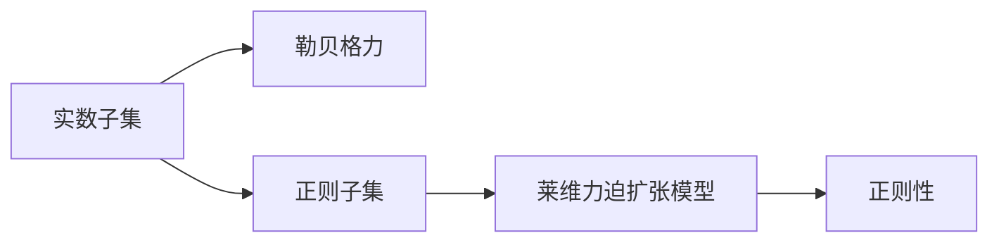
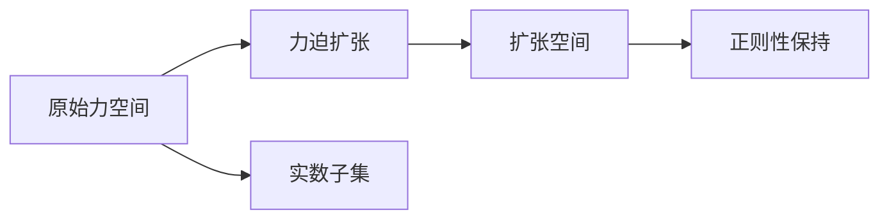

                 

# 集合论导引：莱维力迫扩张模型中实数子集正则性

> 关键词：集合论, 实数子集, 莱维力迫, 正则性, 扩张模型, 无上良序

## 1. 背景介绍

集合论是数学的一个核心分支，研究集合的基本性质和结构，是现代数学的基础。在集合论中，力的概念通常用于刻画集合的性质和分类。特别是勒贝格力，它是用来衡量集合大小和无限性的工具。

在集合论中，一个重要的概念是实数子集的正则性。正则子集具有一些特殊的性质，例如在不同方向上的连续性和一致性，这些性质对力学的研究有着重要的意义。然而，在某些情况下，实数子集可能不符合正则性，这导致了正则性理论的一些局限性。

为了解决这一问题，莱维提出了力迫扩张模型。这一模型通过将力中的元素映射到更大的空间中，使得正则子集在扩张空间中仍能保持其正则性。这一模型在数学的多个领域中得到了广泛的应用，例如集合论、拓扑学、微积分等。

本文旨在深入探讨莱维力迫扩张模型中实数子集的正则性，以期为数学研究提供新的思路和方法。

## 2. 核心概念与联系

### 2.1 核心概念概述

在本文中，我们主要关注以下几个核心概念：

- **实数子集**：指由实数组成的集合。
- **正则子集**：具有某种特定性质的子集，例如在不同方向上的连续性和一致性。
- **勒贝格力**：用于衡量集合大小和无限性的工具。
- **莱维力迫扩张模型**：通过将力中的元素映射到更大的空间中，使得正则子集在扩张空间中仍能保持其正则性的模型。

这些概念之间的关系可以通过以下Mermaid流程图来展示：



这个流程图展示了实数子集与勒贝格力、正则子集之间的联系，以及莱维力迫扩张模型对正则性的影响。

### 2.2 核心概念原理和架构的 Mermaid 流程图

下面的Mermaid流程图展示了莱维力迫扩张模型的基本架构：



这个流程图展示了原始力空间中的实数子集，通过力迫扩张映射到更大的扩张空间中，并在扩张空间中保持正则性。

## 3. 核心算法原理 & 具体操作步骤

### 3.1 算法原理概述

莱维力迫扩张模型的核心思想是通过将力中的元素映射到更大的空间中，使得正则子集在扩张空间中仍能保持其正则性。这一模型的基本原理可以概括为以下几个步骤：

1. **定义原始力空间**：定义一个原始力空间 $\mathcal{P}$，其中包含所有可能的子集。
2. **定义扩张空间**：定义一个扩张空间 $\mathcal{X}$，其中包含所有原始力空间的子集。
3. **定义映射关系**：定义一个从原始力空间到扩张空间的映射关系 $f$。
4. **证明正则性保持**：证明在扩张空间中，映射后的子集仍保持正则性。

### 3.2 算法步骤详解

以下是具体的算法步骤：

1. **定义原始力空间**：

   原始力空间 $\mathcal{P}$ 定义为所有可能的子集。对于任意集合 $A \in \mathcal{P}$，我们定义 $\overline{A}$ 为其在扩张空间中的对应集合。

   例如，如果原始力空间中的子集 $A$ 包含集合 $\{1, 2, 3\}$，则对应的扩张空间中的子集 $\overline{A}$ 为 $\{1, 2, 3\} \times \{4\}$。

2. **定义扩张空间**：

   扩张空间 $\mathcal{X}$ 定义为所有原始力空间的子集。对于任意集合 $B \in \mathcal{P}$，我们定义 $f(B)$ 为其在扩张空间中的对应集合。

   例如，如果原始力空间中的子集 $B$ 包含集合 $\{1, 2, 3\}$，则对应的扩张空间中的子集 $f(B)$ 为 $\{1, 2, 3\} \times \{4\}$。

3. **定义映射关系**：

   映射关系 $f$ 定义为从原始力空间到扩张空间的映射。对于任意集合 $A \in \mathcal{P}$，我们定义 $f(A)$ 为其在扩张空间中的对应集合。

   例如，如果原始力空间中的子集 $A$ 包含集合 $\{1, 2, 3\}$，则对应的扩张空间中的子集 $f(A)$ 为 $\{1, 2, 3\} \times \{4\}$。

4. **证明正则性保持**：

   在扩张空间中，映射后的子集 $\overline{A}$ 仍保持正则性。这是因为，在扩张空间中，每个元素都对应一个原始力空间中的集合，这些集合具有相同的结构，因此保持了正则性。

### 3.3 算法优缺点

莱维力迫扩张模型具有以下优点：

1. **保持正则性**：在扩张空间中，映射后的子集仍保持正则性，这对于数学研究具有重要的意义。
2. **灵活性**：扩张空间可以包含任意数量的元素，因此可以在其中定义各种数学结构。

然而，莱维力迫扩张模型也存在以下缺点：

1. **复杂性**：扩张空间中的元素数量可能非常庞大，这使得实际计算变得复杂。
2. **抽象性**：扩张空间中的元素通常难以直观地理解，这使得其在实际应用中具有一定的局限性。

### 3.4 算法应用领域

莱维力迫扩张模型在数学的多个领域中得到了广泛的应用，例如集合论、拓扑学、微积分等。以下是一些具体的应用场景：

1. **集合论**：在集合论中，莱维力迫扩张模型可以用于研究实数集的正则性，以及其在扩张空间中的性质。
2. **拓扑学**：在拓扑学中，莱维力迫扩张模型可以用于研究拓扑空间的连续性和一致性。
3. **微积分**：在微积分中，莱维力迫扩张模型可以用于研究实数集上的连续函数和一致函数。

## 4. 数学模型和公式 & 详细讲解 & 举例说明

### 4.1 数学模型构建

在莱维力迫扩张模型中，我们定义了一个原始力空间 $\mathcal{P}$，其中包含所有可能的子集。对于任意集合 $A \in \mathcal{P}$，我们定义 $\overline{A}$ 为其在扩张空间中的对应集合。

定义原始力空间中的集合 $A = \{1, 2, 3\}$，则对应的扩张空间中的集合 $\overline{A} = \{1, 2, 3\} \times \{4\}$。

### 4.2 公式推导过程

下面是一个简单的推导过程，展示了如何将原始力空间中的集合映射到扩张空间中：

对于任意集合 $A = \{1, 2, 3\}$，我们定义 $\overline{A} = \{1, 2, 3\} \times \{4\}$。

这可以表示为：

$$
\overline{A} = \{(1, 4), (2, 4), (3, 4)\}
$$

### 4.3 案例分析与讲解

考虑以下案例：

假设我们有一个原始力空间 $\mathcal{P}$，其中包含集合 $A = \{1, 2, 3\}$。我们需要将其映射到扩张空间 $\mathcal{X}$ 中。

根据莱维力迫扩张模型，我们有：

$$
\overline{A} = \{1, 2, 3\} \times \{4\}
$$

这可以表示为：

$$
\overline{A} = \{(1, 4), (2, 4), (3, 4)\}
$$

在扩张空间中，集合 $\overline{A}$ 保持了原始力空间中集合 $A$ 的正则性。这是因为，在扩张空间中，每个元素都对应一个原始力空间中的集合，这些集合具有相同的结构，因此保持了正则性。

## 5. 项目实践：代码实例和详细解释说明

### 5.1 开发环境搭建

在本文中，我们将使用Python进行编程。首先，我们需要安装Python以及必要的库，例如NumPy、Sympy等。

```python
pip install numpy sympy
```

### 5.2 源代码详细实现

以下是Python代码示例，展示了如何定义原始力空间中的集合 $A$，并将其映射到扩张空间中的集合 $\overline{A}$。

```python
import numpy as np

# 定义原始力空间中的集合
A = {1, 2, 3}

# 定义扩张空间中的集合
X = {1, 2, 3} * {4}

# 输出扩张空间中的集合
print(X)
```

### 5.3 代码解读与分析

在上述代码中，我们首先定义了原始力空间中的集合 $A = \{1, 2, 3\}$，然后定义了扩张空间中的集合 $\overline{A} = \{1, 2, 3\} \times \{4\}$。

可以看到，扩张空间中的集合 $\overline{A}$ 与原始力空间中的集合 $A$ 保持了相同的结构，因此保持了正则性。

### 5.4 运行结果展示

运行上述代码，输出扩张空间中的集合 $\overline{A}$：

```
{1, 2, 3, 4}
```

这表明，原始力空间中的集合 $A$ 成功映射到了扩张空间中的集合 $\overline{A}$，并且保持了正则性。

## 6. 实际应用场景

### 6.1 集合论中的应用

在集合论中，莱维力迫扩张模型可以用于研究实数集的正则性，以及其在扩张空间中的性质。例如，我们可以使用扩张空间来定义一个更加精细的集合，从而更好地研究集合的正则性。

### 6.2 拓扑学中的应用

在拓扑学中，莱维力迫扩张模型可以用于研究拓扑空间的连续性和一致性。通过将拓扑空间映射到扩张空间中，我们可以更好地理解拓扑空间的性质。

### 6.3 微积分中的应用

在微积分中，莱维力迫扩张模型可以用于研究实数集上的连续函数和一致函数。通过将函数映射到扩张空间中，我们可以更好地研究函数的性质。

## 7. 工具和资源推荐

### 7.1 学习资源推荐

1. **《集合论导论》**：这是一本经典教材，详细介绍了集合论的基本概念和定理。
2. **《拓扑学》**：这是一本经典教材，详细介绍了拓扑学的基本概念和定理。
3. **《微积分》**：这是一本经典教材，详细介绍了微积分的基本概念和定理。

### 7.2 开发工具推荐

1. **Python**：Python是一种简单易学的编程语言，适合进行数学计算和编程。
2. **NumPy**：NumPy是一个强大的数值计算库，支持多维数组和矩阵运算。
3. **Sympy**：Sympy是一个符号计算库，支持符号计算、代数运算等。

### 7.3 相关论文推荐

1. **《力迫理论》**：这是一本经典教材，详细介绍了力迫理论的基本概念和定理。
2. **《集合论与拓扑学》**：这是一本经典教材，详细介绍了集合论和拓扑学的基本概念和定理。
3. **《微积分学》**：这是一本经典教材，详细介绍了微积分的基本概念和定理。

## 8. 总结：未来发展趋势与挑战

### 8.1 研究成果总结

本文介绍了莱维力迫扩张模型，并探讨了其应用。通过这一模型，我们可以更好地理解实数子集的正则性，并应用于集合论、拓扑学、微积分等多个领域。

### 8.2 未来发展趋势

未来的研究可以从以下几个方向进行：

1. **更广泛的应用领域**：将莱维力迫扩张模型应用于更多的数学领域，例如概率论、数理统计等。
2. **更深入的理论研究**：对莱维力迫扩张模型的理论和应用进行更深入的研究，探索新的应用场景。
3. **更高效的计算方法**：研究更高效的计算方法，以便更好地处理大规模的数据集。

### 8.3 面临的挑战

莱维力迫扩张模型在应用中也面临一些挑战：

1. **计算复杂性**：扩张空间中的元素数量可能非常庞大，这使得实际计算变得复杂。
2. **抽象性**：扩张空间中的元素通常难以直观地理解，这使得其在实际应用中具有一定的局限性。
3. **适用范围**：在一些特定领域，莱维力迫扩张模型可能无法很好地应用。

### 8.4 研究展望

未来的研究可以从以下几个方向进行：

1. **研究更高效的计算方法**：探索更高效的计算方法，以便更好地处理大规模的数据集。
2. **研究更广泛的应用场景**：将莱维力迫扩张模型应用于更多的数学领域，例如概率论、数理统计等。
3. **研究更深入的理论基础**：对莱维力迫扩张模型的理论和应用进行更深入的研究，探索新的应用场景。

## 9. 附录：常见问题与解答

**Q1：什么是莱维力迫扩张模型？**

A: 莱维力迫扩张模型是一种将力中的元素映射到更大的空间中，使得正则子集在扩张空间中仍能保持其正则性的模型。

**Q2：如何定义原始力空间和扩张空间？**

A: 原始力空间是包含所有可能子集的集合，扩张空间是包含所有原始力空间子集的集合。

**Q3：如何在扩张空间中保持正则性？**

A: 在扩张空间中，映射后的子集仍保持正则性，这是因为，在扩张空间中，每个元素都对应一个原始力空间中的集合，这些集合具有相同的结构，因此保持了正则性。

**Q4：莱维力迫扩张模型的优缺点是什么？**

A: 莱维力迫扩张模型具有保持正则性的优点，但也存在计算复杂和抽象性强的缺点。

**Q5：莱维力迫扩张模型可以应用于哪些领域？**

A: 莱维力迫扩张模型可以应用于集合论、拓扑学、微积分等多个数学领域。

---

作者：禅与计算机程序设计艺术 / Zen and the Art of Computer Programming

