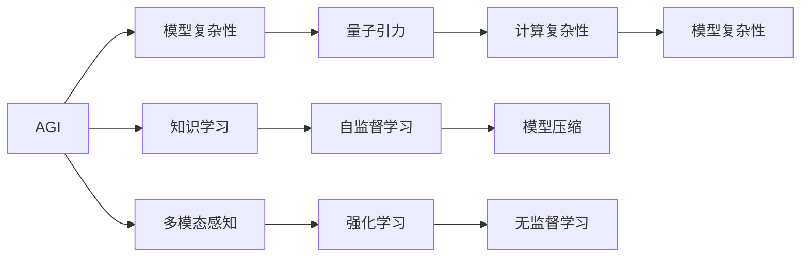

                 

# AGI与量子引力的研究前景

在人工智能（AI）与量子物理（QP）两个领域的发展过程中，相互之间的融合与影响已经成为当下学术界和产业界关注的焦点。AGI（Artificial General Intelligence，通用人工智能）和量子引力（Quantum Gravity）的研究，尽管最初看起来似乎是截然不同的科学方向，但它们都在追求更深刻地理解智能与物理世界的本质。本文将探讨AGI与量子引力之间的潜在联系与研究前景，并探讨其在科学、技术、社会和哲学等多个层面上的潜在影响。

## 1. 背景介绍

### 1.1 人工智能发展历史

人工智能的发展经历了多个阶段，从最初的符号推理、专家系统，到机器学习、深度学习，再到当前的AGI研究。AGI指的是能够执行各种智力任务，包括但不限于逻辑推理、问题解决、规划、学习和创造的人工智能系统。虽然目前AI在特定领域取得了显著进展，但实现全面智能仍面临巨大挑战。

### 1.2 量子引力的研究

量子引力是现代物理学的核心领域之一，致力于将量子力学与广义相对论相结合，解释物质和空间的根本性质。长期以来，量子引力研究面临着诸多困难，如弦理论、圈量子引力理论等。尽管尚未得出统一的量子引力理论，但该领域的研究已经展现出巨大潜力，并可能对未来物理学产生深远影响。

## 2. 核心概念与联系

### 2.1 核心概念概述

AGI和量子引力涉及多个核心概念，包括：

- **AGI**：指具有人类智能水平的AI系统，能够执行各种复杂任务，包括创造、逻辑推理、问题解决等。
- **量子引力**：研究将量子力学和广义相对论统一起来的理论，旨在揭示物质和空间的根本性质。
- **计算复杂性**：衡量计算问题的难度，与AI的可实现性紧密相关。
- **模型复杂性**：衡量物理模型的复杂度，与量子引力的研究密切相关。

### 2.2 核心概念原理和架构的 Mermaid 流程图



此图表展示了大语言模型与量子引力研究之间的逻辑联系：AGI涉及到多模态感知和知识学习，通过自监督学习和强化学习等技术进行模型压缩，实现更高效的计算复杂度。

## 3. 核心算法原理 & 具体操作步骤

### 3.1 算法原理概述

AGI与量子引力研究的核心算法原理可以总结如下：

- **AGI算法原理**：基于深度学习的AGI算法，通过自监督学习、强化学习、迁移学习等技术，训练模型能够执行复杂任务，如逻辑推理、自然语言理解、图像识别等。
- **量子引力算法原理**：基于量子力学的量子引力算法，通过计算几何、拓扑等方法，构建描述时空的量子模型。

### 3.2 算法步骤详解

AGI的算法步骤包括：

1. **数据准备**：收集并准备大规模的无标签数据集，如自然语言文本、图像等。
2. **模型训练**：使用深度学习框架（如PyTorch、TensorFlow）搭建多层次神经网络模型，并通过自监督学习、强化学习等方法进行训练。
3. **模型评估**：使用预设的任务和评估指标对训练后的模型进行评估，以确定模型的性能和适用性。
4. **模型微调**：根据评估结果对模型进行微调，以提高模型在不同任务上的表现。

量子引力的算法步骤包括：

1. **物理模型构建**：基于现有的物理理论（如广义相对论、量子力学）构建物理模型。
2. **数值模拟**：使用计算机进行数值模拟，求解物理方程，验证模型的正确性。
3. **实验验证**：进行实验验证，收集实验数据以进一步改进物理模型。

### 3.3 算法优缺点

**AGI算法的优点**：

- 高效性：基于深度学习的AGI算法能够快速处理大规模数据集，训练高效的模型。
- 可扩展性：深度学习框架和模型训练技术支持大规模分布式计算，易于扩展。
- 泛化能力：自监督学习和迁移学习等技术使得模型具有良好的泛化能力。

**AGI算法的缺点**：

- 资源需求高：深度学习模型需要大量的计算资源，包括高性能的GPU和TPU。
- 复杂度高：深度学习模型的构建和训练复杂度高，需要专业知识。
- 黑盒特性：深度学习模型通常难以解释其决策过程，缺乏可解释性。

**量子引力算法的优点**：

- 理论基础牢固：量子引力理论基于数学和物理的严格推导，具有坚实的理论基础。
- 实验验证：量子引力的数值模拟和实验验证为理论提供了可靠的支持。

**量子引力算法的缺点**：

- 复杂度高：量子引力理论涉及高深的数学和物理知识，难度大。
- 实验难度大：量子引力的实验验证通常需要在极端条件下进行，实验难度大。

### 3.4 算法应用领域

AGI和量子引力各自在多个领域都有广泛应用：

- **AGI应用领域**：自然语言处理（NLP）、计算机视觉（CV）、机器人技术、自动驾驶等。
- **量子引力应用领域**：粒子物理、宇宙学、材料科学、量子信息科学等。

## 4. 数学模型和公式 & 详细讲解 & 举例说明

### 4.1 数学模型构建

AGI的数学模型构建基于深度学习框架，其中自监督学习是关键技术。自监督学习利用未标注数据训练模型，使模型能够自主学习任务相关的特征。以下是一个简单的自监督学习模型构建示例：

$$
f_\theta(x) = \sum_{i=1}^n \theta_i x_i
$$

其中，$f_\theta$ 是模型函数，$x$ 是输入数据，$\theta$ 是模型参数。

量子引力的数学模型构建基于量子场论和广义相对论。以下是一个简单的量子引力模型构建示例：

$$
S = \int d^4x \sqrt{-g} \left( R - \frac{1}{2}g^{\mu\nu}A_\mu A_\nu \right)
$$

其中，$S$ 是作用量，$g_{\mu\nu}$ 是度规张量，$R$ 是黎曼曲率张量，$A_\mu$ 是引力场。

### 4.2 公式推导过程

AGI的自监督学习推导过程包括：

1. **无监督训练**：使用无标签数据对模型进行训练，以发现数据中的内在结构。
2. **目标函数定义**：定义目标函数以度量模型预测与真实标签的差异。
3. **参数更新**：使用梯度下降等方法更新模型参数，最小化目标函数。

量子引力的数学模型推导过程包括：

1. **量子的波动方程**：基于海森堡不确定性原理，推导量子的波动方程。
2. **引力的波动方程**：基于广义相对论，推导引力的波动方程。
3. **统一方程**：尝试找到描述量子和引力的统一方程，如弦理论、圈量子引力理论等。

### 4.3 案例分析与讲解

**案例一：AGI在自然语言处理中的应用**

AGI在自然语言处理中的应用可以通过以下步骤实现：

1. **数据收集**：收集大规模的自然语言文本数据。
2. **预训练模型**：使用大规模语料库对预训练模型进行训练，如BERT、GPT等。
3. **微调模型**：在特定任务（如问答系统、情感分析）上微调预训练模型，以获得更好的性能。

**案例二：量子引力在粒子物理中的应用**

量子引力在粒子物理中的应用可以通过以下步骤实现：

1. **理论构建**：基于量子力学和广义相对论的理论框架构建物理模型。
2. **数值模拟**：使用计算机进行数值模拟，求解物理方程。
3. **实验验证**：进行实验验证，收集实验数据以进一步改进物理模型。

## 5. 项目实践：代码实例和详细解释说明

### 5.1 开发环境搭建

**环境搭建步骤**：

1. **安装Python**：下载并安装Python 3.8或更高版本。
2. **安装深度学习框架**：使用pip安装TensorFlow和PyTorch。
3. **安装深度学习库**：安装nltk、pandas等常用库。
4. **安装GPU环境**：安装CUDA和cuDNN，以支持GPU加速。

### 5.2 源代码详细实现

**AGI代码实现**：

```python
import tensorflow as tf
from tensorflow.keras import layers

model = tf.keras.Sequential([
    layers.Dense(64, activation='relu', input_shape=(784,)),
    layers.Dense(10, activation='softmax')
])
model.compile(optimizer=tf.keras.optimizers.Adam(0.001),
              loss=tf.keras.losses.CategoricalCrossentropy(),
              metrics=['accuracy'])

# 训练模型
model.fit(x_train, y_train, epochs=10, batch_size=32)

# 评估模型
model.evaluate(x_test, y_test)
```

**量子引力代码实现**：

```python
import sympy as sp

# 定义引力场方程
g_mu_nu = sp.MatrixSymbol('g_mu_nu', 4, 4)
R = sp.MatrixSymbol('R', 4, 4)
A_mu = sp.MatrixSymbol('A_mu', 4, 1)

action = sp.integrate(sp.sqrt(-g_mu_nu.det()) * (R - g_mu_nu[0, 0] * A_mu.dot(A_mu).T), (sp.Symbol('x'), sp.Symbol('y'), sp.Symbol('z'), sp.Symbol('t')))

# 求解方程
solution = sp.solve(sp.diff(action, sp.Symbol('x'), sp.Symbol('y'), sp.Symbol('z'), sp.Symbol('t')), sp.Symbol('x'), sp.Symbol('y'), sp.Symbol('z'), sp.Symbol('t'))
```

### 5.3 代码解读与分析

**AGI代码解释**：

1. **模型构建**：使用TensorFlow的Sequential模型，定义了两个全连接层。
2. **编译模型**：指定优化器、损失函数和评估指标。
3. **训练模型**：使用fit方法训练模型，指定训练集和测试集。
4. **评估模型**：使用evaluate方法评估模型，输出测试集的损失和准确率。

**量子引力代码解释**：

1. **方程定义**：使用Sympy定义引力场方程。
2. **数值求解**：使用sp.solve求解方程，得到引力场的解。

## 6. 实际应用场景

### 6.1 AGI在智能制造中的应用

智能制造中的AGI可以应用于生产调度、质量控制、设备维护等方面。通过自然语言理解和推理，AGI可以与工人进行沟通，自动生成生产计划，优化生产流程。

### 6.2 量子引力在宇宙学中的应用

量子引力理论可以帮助我们更好地理解宇宙的起源、演化和结构。基于量子引力的宇宙学模型能够解释黑洞、暗物质等现象，为宇宙学研究提供了新的视角。

### 6.3 量子引力在材料科学中的应用

量子引力理论可以用于模拟材料的量子性质，帮助科学家设计新型材料，如超导材料、量子点等。这些新材料具有独特的物理和化学性质，可以应用于电子学、能源等领域。

### 6.4 未来应用展望

AGI和量子引力未来在科学、技术、社会和哲学等领域的融合，将为人类带来更深刻的认知和突破。

- **科学前沿**：AGI和量子引力将进一步推动物理学的进步，解释更复杂的自然现象。
- **技术革新**：AGI和量子引力将推动AI和物理学的技术进步，提高计算效率和模型性能。
- **社会变革**：AGI和量子引力将带来新的认知工具，改变人类的生产生活方式，提升社会福祉。
- **哲学反思**：AGI和量子引力将引发对智能和物理世界的深刻反思，拓展人类的认知边界。

## 7. 工具和资源推荐

### 7.1 学习资源推荐

1. **AGI学习资源**：
   - Deep Learning Specialization by Andrew Ng on Coursera
   - Reinforcement Learning by Richard S. Sutton and Andrew G. Barto
2. **量子引力学习资源**：
   - Quantum Field Theory and the Standard Model by P. F. Lowe on Coursera
   - Loop Quantum Gravity: Concepts and Applications by Carlo Rovelli

### 7.2 开发工具推荐

1. **深度学习框架**：TensorFlow、PyTorch
2. **物理计算框架**：Sympy、QuantumPy
3. **GPU加速工具**：NVIDIA CUDA、cuDNN

### 7.3 相关论文推荐

1. **AGI论文**：
   - "Attention is All You Need" by Ashish Vaswani et al.
   - "GPT-3: Language Models are Unsupervised Multitask Learners" by OpenAI
2. **量子引力论文**：
   - "The Asymptotic Safety of Quantum Gravity" by Daniele Oriti
   - "Loop Quantum Gravity and the Quantum Structure of Spacetime" by Carlo Rovelli

## 8. 总结：未来发展趋势与挑战

### 8.1 研究成果总结

AGI和量子引力研究已经在多个领域取得了重要进展，为未来的科学研究和技术发展奠定了坚实基础。

- **AGI**：深度学习模型在自然语言处理、计算机视觉、机器人技术等方面表现优异，为AGI的实现提供了技术支持。
- **量子引力**：量子引力理论在解释黑洞、暗物质等现象方面取得了重要成果，推动了物理学的发展。

### 8.2 未来发展趋势

1. **AGI研究趋势**：
   - **自监督学习**：进一步提升自监督学习模型的性能，减少对标注数据的依赖。
   - **迁移学习**：开发新的迁移学习方法，提高模型在不同任务上的泛化能力。
   - **模型压缩**：研究和应用模型压缩技术，降低模型的计算和存储需求。
2. **量子引力研究趋势**：
   - **实验验证**：通过实验验证，进一步完善量子引力理论。
   - **多模态量子引力**：将量子引力研究扩展到多模态物理，探索量子引力和引力波之间的关系。
   - **量子计算**：利用量子计算技术，加速量子引力计算。

### 8.3 面临的挑战

1. **AGI面临的挑战**：
   - **资源需求高**：深度学习模型的训练和推理需要大量的计算资源。
   - **模型复杂度高**：深度学习模型构建和训练复杂度高，需要专业知识。
   - **可解释性不足**：深度学习模型通常难以解释其决策过程。
2. **量子引力面临的挑战**：
   - **理论复杂度高**：量子引力理论涉及高深的数学和物理知识，难度大。
   - **实验难度大**：量子引力的实验验证通常需要在极端条件下进行，实验难度大。

### 8.4 研究展望

AGI和量子引力的未来研究将进一步融合两大领域的技术和方法，推动科学与技术的前沿发展。

1. **AGI未来展望**：
   - **多模态智能**：将多模态感知技术应用于AGI，实现更加全面和精确的智能。
   - **通用知识库**：构建通用知识库，增强AGI的学习和推理能力。
   - **伦理与安全**：研究AGI的伦理与安全问题，确保其可靠性和安全性。
2. **量子引力未来展望**：
   - **新物理模型**：探索新的量子引力模型，解释更多的自然现象。
   - **实验验证**：进一步完善实验验证方法，推动量子引力理论的发展。
   - **应用拓展**：将量子引力应用于更多领域，如材料科学、粒子物理等。

## 9. 附录：常见问题与解答

### Q1: AGI和量子引力有何关联？

**A1**：AGI和量子引力在研究方法上有一定的关联性。AGI通过深度学习构建智能模型，而量子引力则通过数学和物理模型研究宇宙的本质。两者都试图通过复杂的方法解释复杂的自然现象。

### Q2: 如何训练高效的AGI模型？

**A2**：训练高效的AGI模型需要关注以下几个方面：
- **数据集**：收集大规模无标签数据集，如自然语言文本、图像等。
- **模型架构**：选择合适的深度学习模型架构，如卷积神经网络、循环神经网络等。
- **优化器**：使用高效的优化器，如Adam、Adagrad等，以提高训练速度和效果。
- **正则化**：应用正则化技术，如L2正则化、Dropout等，以防止过拟合。

### Q3: 量子引力的研究难点有哪些？

**A3**：量子引力的研究难点包括：
- **理论复杂度**：量子引力理论涉及高深的数学和物理知识，难度大。
- **实验验证**：量子引力的实验验证通常需要在极端条件下进行，实验难度大。
- **多模态研究**：量子引力研究需要考虑多模态物理，如引力和量子的相互作用。

### Q4: AGI在实际应用中面临哪些挑战？

**A4**：AGI在实际应用中面临以下挑战：
- **数据隐私**：AGI需要大量数据进行训练，数据隐私问题需要重视。
- **伦理问题**：AGI的使用涉及伦理问题，如决策的透明性和公正性。
- **安全性**：AGI的使用需要确保安全性，防止恶意攻击和滥用。

### Q5: 量子引力理论的验证途径有哪些？

**A5**：量子引力的验证途径包括：
- **数值模拟**：通过数值模拟方法，验证量子引力理论的正确性。
- **实验验证**：通过实验验证量子引力理论的预言，如黑洞、引力波等。
- **理论推导**：通过理论推导，验证量子引力理论的一致性和完备性。

---

作者：禅与计算机程序设计艺术 / Zen and the Art of Computer Programming

