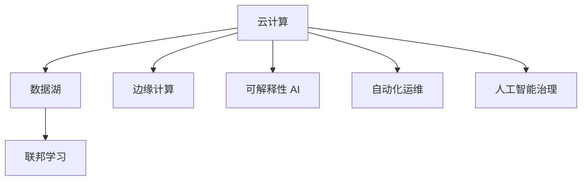

                 

# AI 2.0 基础设施建设：塑造未来世界

## 1. 背景介绍

### 1.1 问题由来
随着人工智能技术的迅速发展，AI 2.0时代的到来已不可阻挡。AI 2.0，即第二代人工智能，不仅能够处理静态数据，还能理解复杂的自然语言和图像，具备更高的通用性和创造性。然而，这些智能模型的构建和运行需要大量的计算资源、复杂的数据处理和精细的模型训练，这使得 AI 2.0 的实现变得异常复杂和昂贵。因此，构建一个全面、高效、灵活的 AI 2.0 基础设施成为塑造未来世界的重要一步。

### 1.2 问题核心关键点
AI 2.0 基础设施的核心目标是为 AI 模型的开发、训练、推理和部署提供全面的支持，同时确保数据、计算和模型的安全性、可靠性和可解释性。具体关键点包括：

- **计算基础设施**：确保强大的计算能力，满足 AI 模型训练和推理的需求。
- **数据基础设施**：提供高质量、高效存储和管理的标注和非标注数据，保障数据隐私和安全。
- **模型基础设施**：实现模型的快速开发、优化和部署，支持多种模型类型和算法。
- **管理与运营**：提供集中的平台管理系统，支持模型、数据、计算和用户的安全管理。
- **应用场景支撑**：提供灵活的应用接口和系统集成，适应不同领域和业务需求。

## 2. 核心概念与联系

### 2.1 核心概念概述

为了更好地理解 AI 2.0 基础设施的构建，我们首先介绍几个关键概念：

- **云计算**：通过互联网提供可扩展的计算资源和存储空间，支持多租户应用。
- **数据湖**：集中存储和管理的异构数据资源，支持数据的即时访问和高效分析。
- **边缘计算**：在数据源头或靠近数据源的地方进行数据处理和推理，降低网络延迟和带宽需求。
- **联邦学习**：多方在不共享数据的情况下协同训练模型，保护数据隐私。
- **可解释性 AI**：提高模型的决策透明度，使结果可被解释和审计。
- **自动化运维**：通过 AI 和机器学习技术，自动监控和优化系统性能，减少人工干预。
- **人工智能治理**：制定 AI 模型开发和部署的规范和标准，确保符合伦理和法律要求。

这些概念之间的逻辑关系可以通过以下 Mermaid 流程图来展示：



这个流程图展示了一个 AI 2.0 基础设施的基本架构，其中云计算、数据湖和边缘计算构成底层基础设施，而联邦学习、可解释性 AI、自动化运维和人工智能治理则构成了上层的应用和服务层。

## 3. 核心算法原理 & 具体操作步骤

### 3.1 算法原理概述

AI 2.0 基础设施的构建涉及多个层面的算法和技术，包括分布式计算、数据管理、模型优化和系统运维。以下是对这些核心算法原理的概述：

- **分布式计算**：通过分布式计算框架（如 TensorFlow、PyTorch）实现大规模模型的并行训练和推理。
- **数据管理**：采用数据湖技术和数据仓库技术，实现数据的集中存储和高效查询。
- **模型优化**：通过参数优化、超参数优化和模型压缩等技术，提升模型性能和效率。
- **系统运维**：利用自动化运维工具和机器学习模型，实现系统性能的实时监控和优化。

### 3.2 算法步骤详解

AI 2.0 基础设施的建设可以分为以下步骤：

**Step 1: 数据基础设施建设**
- 建立数据湖：选择高效的数据存储技术，如 Hadoop、Spark，构建数据湖架构。
- 数据清洗和预处理：利用 ETL（Extract, Transform, Load）工具对数据进行清洗和处理，确保数据的质量和一致性。
- 数据标注：对标注数据进行高效管理，支持分布式标注和质量评估。

**Step 2: 计算基础设施建设**
- 部署云计算平台：选择公有云（如 AWS、Azure、Google Cloud）或私有云平台，搭建计算资源池。
- 配置分布式计算环境：使用分布式计算框架（如 TensorFlow、PyTorch、Kubernetes）实现分布式训练和推理。
- 自动化资源管理：使用 Kubernetes 和 Ansible 等工具实现资源动态调整和自动化部署。

**Step 3: 模型基础设施建设**
- 选择合适的 AI 框架：选择适合 AI 2.0 应用的框架，如 TensorFlow、PyTorch、MXNet。
- 模型版本管理：使用 Git 等版本控制工具管理模型代码和参数。
- 模型优化和压缩：使用剪枝、量化、蒸馏等技术优化模型，减少计算资源消耗。

**Step 4: 应用系统开发**
- 开发 API 接口：提供标准化的 API 接口，支持模型部署和集成。
- 应用系统集成：将 AI 模型集成到现有业务系统中，支持不同领域的应用需求。
- 系统安全管理：使用数据加密、访问控制等技术，保护系统安全。

**Step 5: 系统监控和优化**
- 实时监控系统性能：利用 Prometheus、Grafana 等工具监控系统运行状态。
- 自动化调优：利用机器学习算法，自动调整模型参数和资源配置。
- 异常检测和预警：设置异常检测规则，及时发现和处理系统问题。

### 3.3 算法优缺点

AI 2.0 基础设施的构建具有以下优点：

- **灵活性**：云计算和边缘计算提供了灵活的计算和存储资源，支持不同规模和类型的应用。
- **高效性**：分布式计算和数据湖技术实现了大规模数据和模型的快速处理和分析。
- **可扩展性**：通过联邦学习和自动化运维，可以动态扩展系统的能力和资源。

同时，该基础设施也存在一些缺点：

- **复杂性**：基础设施的搭建和维护涉及多个层面的技术和工具，需要专业知识。
- **成本高**：云计算和数据湖需要高昂的初始投资和维护成本。
- **数据隐私**：分布式数据管理和联邦学习需要在不泄露隐私的前提下实现协同训练。

## 4. 数学模型和公式 & 详细讲解  
### 4.1 数学模型构建

AI 2.0 基础设施的构建涉及多个数学模型和公式，以下是对其中几个关键模型的介绍：

- **线性回归模型**：用于对标注数据进行模型训练，公式为：
  $$
  \hat{y} = w_0 + \sum_{i=1}^n w_ix_i
  $$
  其中，$w_i$ 为模型权重，$x_i$ 为输入特征，$\hat{y}$ 为预测结果。

- **卷积神经网络（CNN）**：用于图像识别和处理，公式为：
  $$
  y = \sigma(\mathbb{W}x + b)
  $$
  其中，$\sigma$ 为激活函数，$\mathbb{W}$ 为卷积核矩阵，$x$ 为输入图像，$y$ 为输出结果。

- **循环神经网络（RNN）**：用于序列数据处理，公式为：
  $$
  h_{t+1} = f(W_{h} h_t + W_{x} x_t + b_h)
  $$
  其中，$h_t$ 为隐藏状态，$f$ 为激活函数，$W_{h}$ 和 $W_{x}$ 分别为隐藏层和输入层的权重矩阵，$x_t$ 为输入数据，$b_h$ 为偏置项。

### 4.2 公式推导过程

以下是对上述模型的详细公式推导：

- **线性回归模型**：

  - 假设有一组标注数据 $(x_i, y_i)$，$i=1,2,\dots,n$，其中 $x_i$ 为输入特征，$y_i$ 为真实标签。
  - 使用最小二乘法求解模型参数 $w_0$ 和 $w_i$，使得预测值 $\hat{y}_i$ 最小化误差 $E$：
    $$
    E = \frac{1}{2n} \sum_{i=1}^n (\hat{y}_i - y_i)^2
    $$
  - 求解 $\frac{\partial E}{\partial w_j}$ 并令其等于0，得：
    $$
    w_j = \frac{\sum_{i=1}^n (x_{i,j} \hat{y}_i - x_{i,j} y_i)}{\sum_{i=1}^n (x_{i,j}^2)}
    $$
  - 使用学习率 $\alpha$ 更新模型参数：
    $$
    w_j \leftarrow w_j - \alpha \frac{\partial E}{\partial w_j}
    $$

- **卷积神经网络（CNN）**：

  - 假设输入图像大小为 $m \times n$，卷积核大小为 $k \times k$，步幅为 $s$，输出特征图大小为 $h \times w$。
  - 使用卷积运算实现特征提取，公式为：
    $$
    y = \sigma(\mathbb{W}x + b)
    $$
  - 其中 $\mathbb{W}$ 为卷积核矩阵，$x$ 为输入图像，$b$ 为偏置项，$\sigma$ 为激活函数。

- **循环神经网络（RNN）**：

  - 假设输入序列长度为 $T$，隐藏状态大小为 $h$。
  - 使用循环运算实现序列数据的处理，公式为：
    $$
    h_{t+1} = f(W_{h} h_t + W_{x} x_t + b_h)
    $$
  - 其中 $f$ 为激活函数，$W_{h}$ 和 $W_{x}$ 分别为隐藏层和输入层的权重矩阵，$x_t$ 为输入数据，$b_h$ 为偏置项。

### 4.3 案例分析与讲解

以图像识别任务为例，分析 CNN 模型的构建和训练过程：

- **数据准备**：收集并标注大量图像数据，使用数据增强技术扩充数据集。
- **模型构建**：选择适合图像处理的 CNN 架构，如 LeNet、AlexNet、VGGNet 等。
- **模型训练**：将标注数据分成训练集和验证集，使用交叉熵损失函数和 SGD 优化算法训练模型。
- **模型评估**：在测试集上评估模型性能，调整模型参数和超参数，优化模型性能。
- **模型部署**：将训练好的模型部署到生产环境，支持实时推理和推理速度优化。

## 5. 项目实践：代码实例和详细解释说明

### 5.1 开发环境搭建

在进行 AI 2.0 基础设施的实践前，我们需要准备好开发环境。以下是使用 Python 进行 TensorFlow 和 Keras 开发的环境配置流程：

1. 安装 Python：从官网下载并安装 Python 3.x。
2. 安装 TensorFlow：使用 pip 安装 TensorFlow，例如：
   ```
   pip install tensorflow==2.0
   ```
3. 安装 Keras：使用 pip 安装 Keras，例如：
   ```
   pip install keras==2.4.3
   ```
4. 安装 NumPy、Pandas 和 Matplotlib 等工具包，例如：
   ```
   pip install numpy pandas matplotlib
   ```

完成上述步骤后，即可在本地环境中开始 AI 2.0 基础设施的实践。

### 5.2 源代码详细实现

下面以图像分类任务为例，给出使用 TensorFlow 和 Keras 对 CNN 模型进行训练的代码实现。

首先，定义数据处理函数：

```python
import tensorflow as tf
from tensorflow.keras.preprocessing.image import ImageDataGenerator

train_data_dir = 'train_dir'
validation_data_dir = 'validation_dir'

train_datagen = ImageDataGenerator(rescale=1./255,
                                   shear_range=0.2,
                                   zoom_range=0.2,
                                   horizontal_flip=True)

validation_datagen = ImageDataGenerator(rescale=1./255)

train_generator = train_datagen.flow_from_directory(
        train_data_dir,
        target_size=(224, 224),
        batch_size=32,
        class_mode='categorical')

validation_generator = validation_datagen.flow_from_directory(
        validation_data_dir,
        target_size=(224, 224),
        batch_size=32,
        class_mode='categorical')
```

然后，定义模型和训练函数：

```python
from tensorflow.keras.models import Sequential
from tensorflow.keras.layers import Conv2D, MaxPooling2D, Flatten, Dense, Dropout
from tensorflow.keras.optimizers import Adam

model = Sequential()

model.add(Conv2D(32, (3, 3), activation='relu', input_shape=(224, 224, 3)))
model.add(MaxPooling2D(pool_size=(2, 2)))

model.add(Conv2D(64, (3, 3), activation='relu'))
model.add(MaxPooling2D(pool_size=(2, 2)))

model.add(Flatten())
model.add(Dense(128, activation='relu'))
model.add(Dropout(0.5))
model.add(Dense(10, activation='softmax'))

model.compile(optimizer=Adam(lr=0.001),
              loss='categorical_crossentropy',
              metrics=['accuracy'])

def train_epoch(model, generator, epochs=100):
    for epoch in range(epochs):
        model.fit_generator(
            generator,
            steps_per_epoch=generator.samples // generator.batch_size,
            validation_data=validation_generator,
            validation_steps=validation_generator.samples // validation_generator.batch_size,
            verbose=1)
```

最后，启动训练流程并在测试集上评估：

```python
train_epoch(model, train_generator, epochs=100)

test_generator = validation_datagen.flow_from_directory(
        validation_data_dir,
        target_size=(224, 224),
        batch_size=32,
        class_mode='categorical')

test_loss, test_acc = model.evaluate_generator(test_generator, steps=validation_generator.samples // test_generator.batch_size)

print(f'Test accuracy: {test_acc:.4f}')
```

以上就是使用 TensorFlow 和 Keras 对 CNN 模型进行图像分类任务训练的完整代码实现。可以看到，得益于 TensorFlow 和 Keras 的强大封装，我们可以用相对简洁的代码完成 CNN 模型的构建和训练。

### 5.3 代码解读与分析

让我们再详细解读一下关键代码的实现细节：

**ImageDataGenerator**：
- 用于处理图像数据，可以进行数据增强（如缩放、旋转、翻转等），标准化数据。
- 支持批量读取和生成数据，方便模型的训练。

**Sequential 模型定义**：
- 定义了一个包含多个层的 CNN 模型，包括卷积层、池化层、全连接层等。
- 使用 Keras 的高层 API，可以方便地定义复杂的神经网络结构。

**模型训练**：
- 使用 fit_generator 方法，支持数据批量的生成和处理。
- 设置交叉熵损失函数和 Adam 优化算法，控制学习率。
- 在每个 epoch 结束时，输出训练进度和验证集准确率。

**模型评估**：
- 使用 evaluate_generator 方法，评估模型在测试集上的性能。
- 输出测试集的损失和准确率。

可以看出，TensorFlow 和 Keras 的集成使用使得模型的构建和训练变得非常简单，开发者可以更加专注于业务逻辑的实现。

## 6. 实际应用场景

### 6.1 智慧城市

智慧城市是 AI 2.0 基础设施的重要应用场景之一。通过 AI 2.0 基础设施，可以实现对城市运行数据的实时监控和分析，优化城市交通、环境、能源管理等。

具体应用包括：

- **交通管理**：利用智能摄像头和传感器，实时监测交通流量，优化信号灯控制，减少拥堵。
- **环境监测**：通过部署传感器网络，实时监测空气质量、噪音水平、水质等指标，提供实时数据支持。
- **能源管理**：对城市能源消耗数据进行分析，优化电网运行，提高能源利用效率。
- **公共安全**：利用视频监控和智能分析技术，提升公共安全水平，保障城市安全。

### 6.2 智能制造

AI 2.0 基础设施在智能制造中的应用也非常广泛，通过自动化、智能化和优化生产流程，大幅提升制造效率和产品质量。

具体应用包括：

- **生产调度优化**：利用 AI 模型优化生产计划和调度，降低生产成本，提高生产效率。
- **质量控制**：通过图像识别和分析，实时监控产品质量，及时发现和纠正缺陷。
- **设备维护**：利用传感器和预测分析技术，预测设备故障，提前进行维护，减少停机时间。
- **供应链管理**：利用智能算法优化供应链流程，降低库存成本，提高物流效率。

### 6.3 金融服务

AI 2.0 基础设施在金融服务中的应用也日益广泛，通过大数据和 AI 技术，提升金融服务的智能化和个性化水平。

具体应用包括：

- **风险评估**：利用 AI 模型分析客户信用数据，评估贷款和信用风险。
- **智能投顾**：通过 AI 算法分析市场数据，提供个性化投资建议。
- **反欺诈检测**：利用 AI 模型检测异常交易行为，防止欺诈行为。
- **客户服务**：通过智能客服系统，提升客户服务质量和效率。

### 6.4 未来应用展望

未来，随着 AI 2.0 基础设施的不断完善，其应用范围将更加广泛，能够更好地服务于各个行业和领域。

- **医疗健康**：通过 AI 模型分析患者数据，提供个性化治疗方案，提高医疗服务质量。
- **教育培训**：利用 AI 模型分析学习数据，提供个性化教学方案，提升教育效果。
- **农业生产**：通过 AI 模型优化农业生产流程，提高农作物产量和质量。
- **环境保护**：利用 AI 模型分析环境数据，提升环境保护水平，实现可持续发展。

## 7. 工具和资源推荐

### 7.1 学习资源推荐

为了帮助开发者系统掌握 AI 2.0 基础设施的理论基础和实践技巧，这里推荐一些优质的学习资源：

1. **TensorFlow官方文档**：TensorFlow的官方文档是学习 TensorFlow 的重要资源，提供了丰富的 API 和示例代码，帮助开发者快速上手。
2. **Keras官方文档**：Keras的官方文档详细介绍了 Keras 的 API 和用法，适合初学者和进阶用户。
3. **深度学习基础课程**：如斯坦福大学的《Deep Learning Specialization》课程，涵盖了深度学习的核心概念和算法。
4. **TensorFlow实践指南**：《TensorFlow for Deep Learning》一书，详细介绍了 TensorFlow 的实际应用，适合动手实践。
5. **机器学习实战**：《Python Machine Learning》一书，提供了大量的 Python 代码示例，帮助开发者掌握机器学习技术。

通过对这些资源的学习实践，相信你一定能够快速掌握 AI 2.0 基础设施的精髓，并用于解决实际的业务问题。

### 7.2 开发工具推荐

高效的开发离不开优秀的工具支持。以下是几款用于 AI 2.0 基础设施开发的常用工具：

1. **Jupyter Notebook**：提供交互式的代码执行环境，适合开发和调试 AI 模型。
2. **Git**：版本控制工具，支持代码协作和版本管理，保障代码的安全性和可追溯性。
3. **Docker**：容器化技术，方便部署和管理 AI 应用，提高系统的可移植性和稳定性。
4. **Kubernetes**：容器编排工具，支持分布式部署和资源管理，提高系统的扩展性和可靠性。
5. **Prometheus**：监控系统，支持实时数据收集和分析，保障系统的性能和稳定性。

合理利用这些工具，可以显著提升 AI 2.0 基础设施的开发效率，加快创新迭代的步伐。

### 7.3 相关论文推荐

AI 2.0 基础设施的发展源于学界的持续研究。以下是几篇奠基性的相关论文，推荐阅读：

1. **《TensorFlow: A System for Large-Scale Machine Learning》**：Google 的 TensorFlow 团队发表的论文，介绍了 TensorFlow 的架构和特性。
2. **《Keras: Deep Learning for Humans》**：Frérançois Chollet 的论文，介绍了 Keras 的设计理念和用法。
3. **《ImageNet Classification with Deep Convolutional Neural Networks》**：AlexNet 的论文，介绍了卷积神经网络的架构和应用。
4. **《A Neural Computational Model of Cortical Place Cells and the Hippocampus》**：Hinton 的论文，介绍了循环神经网络的原理和应用。
5. **《Deep Reinforcement Learning for Robotic Manipulation》**：DeepMind 的论文，介绍了深度强化学习的应用。

这些论文代表了大规模 AI 基础设施的最新进展，通过学习这些前沿成果，可以帮助研究者把握学科前进方向，激发更多的创新灵感。

## 8. 总结：未来发展趋势与挑战

### 8.1 总结

本文对 AI 2.0 基础设施的构建进行了全面系统的介绍。首先阐述了 AI 2.0 基础设施的研究背景和意义，明确了基础设施在 AI 模型开发、训练、推理和部署中的重要地位。其次，从原理到实践，详细讲解了基础设施中涉及的计算、数据、模型等关键技术，给出了基础设施开发的完整代码实例。同时，本文还广泛探讨了基础设施在智慧城市、智能制造、金融服务等多个领域的应用前景，展示了 AI 2.0 基础设施的广阔应用空间。此外，本文精选了基础设施的各类学习资源，力求为读者提供全方位的技术指引。

通过本文的系统梳理，可以看到，AI 2.0 基础设施构建不仅是一个技术问题，更是一个跨学科的系统工程，需要整合计算、数据、模型、管理等各个领域的知识。唯有通过系统的设计和开发，才能构建一个高效、灵活、安全的 AI 2.0 基础设施，为 AI 模型的落地应用提供坚实的支撑。

### 8.2 未来发展趋势

展望未来，AI 2.0 基础设施的发展趋势如下：

1. **计算资源和数据规模**：随着硬件技术的进步，计算资源和数据规模将不断提升，支持更大规模、更复杂的 AI 模型。
2. **分布式计算和边缘计算**：分布式计算和边缘计算将进一步优化，支持更多应用场景的实时处理和分析。
3. **自动化运维和 AI 治理**：自动化运维和 AI 治理技术将更加成熟，提升系统的稳定性和安全性。
4. **多模态数据融合**：多模态数据融合技术将得到广泛应用，实现视觉、语音、文本等多模态数据的协同处理。
5. **联邦学习和隐私保护**：联邦学习技术将得到广泛应用，保障数据隐私和安全。
6. **可解释性 AI 和知识图谱**：可解释性 AI 和知识图谱技术将进一步发展，提高系统的透明性和可信度。

以上趋势凸显了 AI 2.0 基础设施的广阔前景。这些方向的探索发展，必将进一步提升 AI 系统的性能和应用范围，为构建智能社会和智慧地球铺平道路。

### 8.3 面临的挑战

尽管 AI 2.0 基础设施的构建取得了显著进展，但在迈向更加智能化、普适化应用的过程中，仍面临诸多挑战：

1. **成本和资源限制**：构建和维护 AI 2.0 基础设施需要高昂的成本和资源，中小企业难以承担。
2. **数据隐私和安全**：大规模数据的存储和处理涉及隐私和数据安全问题，需要严格的保护措施。
3. **系统复杂性**：AI 2.0 基础设施涉及多个层面的技术和工具，系统复杂性较高，需要专业知识。
4. **模型鲁棒性**：AI 模型面对不同场景和数据时，鲁棒性不足，容易产生误判。
5. **模型可解释性**：AI 模型的决策过程缺乏可解释性，难以理解和调试。
6. **伦理和法律问题**：AI 模型的应用涉及伦理和法律问题，需要严格的规范和标准。

这些挑战需要学界和产业界共同努力，寻求新的突破和解决方案。

### 8.4 研究展望

未来的研究需要在以下几个方面寻求新的突破：

1. **优化基础设施架构**：进一步优化计算资源和数据管理的架构，提高系统的灵活性和扩展性。
2. **提升基础设施性能**：通过优化算法和模型结构，提升基础设施的性能和效率。
3. **强化隐私保护和安全性**：采用先进的隐私保护技术和数据加密技术，保障数据安全。
4. **提高系统的可解释性**：利用可解释性 AI 和知识图谱技术，提高系统的透明性和可信度。
5. **探索新应用场景**：通过跨学科研究，探索 AI 基础设施在更多领域的应用，推动社会进步。

这些研究方向的探索，必将引领 AI 2.0 基础设施迈向更高的台阶，为构建智能社会和智慧地球提供坚实的支撑。面向未来，AI 基础设施需要与其他技术进行更深入的融合，如区块链、物联网、云计算等，多路径协同发力，共同推动智能技术的发展和应用。

## 9. 附录：常见问题与解答

**Q1: AI 2.0 基础设施对计算资源和数据规模有哪些要求？**

A: AI 2.0 基础设施需要大量的计算资源和数据规模，以支持大规模 AI 模型的训练和推理。计算资源包括高性能计算集群、GPU/TPU 等硬件设备，数据规模则要求存储和处理海量数据。

**Q2: 如何保障 AI 基础设施的数据隐私和安全？**

A: 保障 AI 基础设施的数据隐私和安全需要采用多种技术手段，如数据加密、访问控制、联邦学习等。通过这些技术，可以在不泄露数据的前提下，实现数据的安全共享和协同训练。

**Q3: AI 基础设施的开发和维护有哪些关键技术？**

A: AI 基础设施的开发和维护涉及多个关键技术，包括分布式计算、数据管理、模型优化、自动化运维和 AI 治理等。这些技术需要专业知识，需要跨学科的协同开发和合作。

**Q4: AI 基础设施的应用有哪些优势和局限？**

A: AI 基础设施的应用优势包括高效率、灵活性、可扩展性等，能够支持大规模、高复杂度的 AI 应用。但同时也存在成本高、系统复杂、数据隐私等问题，需要严格的管理和保护。

**Q5: AI 基础设施的未来发展趋势有哪些？**

A: AI 基础设施的未来发展趋势包括计算资源和数据规模的提升、分布式计算和边缘计算的优化、自动化运维和 AI 治理的进步、多模态数据融合技术的发展、联邦学习和隐私保护的普及、可解释性 AI 和知识图谱技术的提升等。这些趋势将推动 AI 基础设施的不断完善和应用。

---

作者：禅与计算机程序设计艺术 / Zen and the Art of Computer Programming

