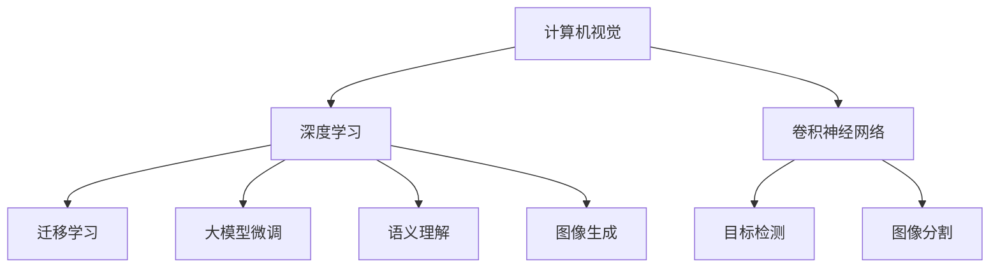

                 

# AI 2.0 时代的计算机视觉

> 关键词：计算机视觉,神经网络,卷积神经网络(CNN),深度学习,迁移学习,大模型微调,目标检测,图像分割,语义理解,图像生成

## 1. 背景介绍

### 1.1 问题由来

在过去几十年中，计算机视觉技术在算法、模型和数据上都经历了翻天覆地的变革。从基于手工特征提取的模板匹配，到基于手工设计的滤波器池化操作的早期卷积神经网络（CNN），再到深度学习时代的现代大规模神经网络模型，如卷积神经网络（CNNs）、残差网络（ResNets）、注意力机制（Attention）等。

深度学习技术，特别是以卷积神经网络为代表的深度学习技术，已成为计算机视觉领域的主流。大规模预训练模型和大模型微调方法的出现，更是将计算机视觉技术带入了AI 2.0时代，极大地提升了计算机视觉模型的泛化能力和适应性。

### 1.2 问题核心关键点

当前，计算机视觉领域的研究热点包括：

- **大模型微调**：在预训练模型基础上，针对特定任务进行微调，提升模型性能。
- **迁移学习**：将预训练模型知识迁移到新任务，减少标注数据需求。
- **目标检测和图像分割**：通过物体检测、语义分割等方法，实现视觉数据的精细理解和分析。
- **语义理解**：通过自然语言处理（NLP）与计算机视觉（CV）的结合，实现视觉信息的语义理解。
- **图像生成**：利用生成对抗网络（GANs）等技术，生成高质量的图像内容，支持图像编辑、增强等任务。

这些技术正在不断推动计算机视觉技术的发展，并为AI 2.0时代带来了新的机遇和挑战。

### 1.3 问题研究意义

计算机视觉技术的进步，使得计算机可以更准确地理解和处理视觉信息，从而在医疗、交通、安防、娱乐等多个领域发挥重要作用。大模型微调方法，进一步提升了计算机视觉模型的泛化能力和适应性，使得计算机视觉技术更加普适、高效和智能化。

## 2. 核心概念与联系

### 2.1 核心概念概述

为更好地理解AI 2.0时代的计算机视觉技术，本节将介绍几个关键概念及其联系：

- **计算机视觉**：研究如何使计算机“看”懂和处理图像、视频等视觉数据，实现目标检测、图像分割、语义理解、图像生成等任务。
- **深度学习**：基于神经网络模型进行学习和推理，通过数据驱动的方式不断优化模型性能。
- **卷积神经网络（CNNs）**：一种专门处理图像数据的神经网络结构，通过卷积、池化等操作提取图像特征。
- **迁移学习**：利用预训练模型知识，在新任务上进行微调，减少标注数据需求。
- **大模型微调**：在预训练模型基础上，针对特定任务进行微调，提升模型性能。
- **目标检测**：识别图像中特定的物体并确定其位置。
- **图像分割**：将图像中的像素分为不同的类别，实现物体的精细分割。
- **语义理解**：通过NLP与CV结合，理解图像中物体的语义信息。
- **图像生成**：利用GANs等技术，生成高质量的图像内容，支持图像编辑、增强等任务。

这些概念之间的联系可以通过以下Mermaid流程图来展示：



这个流程图展示了计算机视觉技术的主要构成部分及其相互关系：

1. 计算机视觉是研究如何使计算机“看”懂和处理图像、视频等视觉数据。
2. 深度学习技术，特别是卷积神经网络，是计算机视觉的核心算法。
3. 迁移学习和大模型微调技术，可以更好地利用预训练模型知识，提升特定任务的性能。
4. 目标检测和图像分割，是计算机视觉中的重要任务，用于对图像进行物体识别和分割。
5. 语义理解，通过NLP与CV结合，实现对图像的语义分析。
6. 图像生成，利用GANs等技术，生成高质量的图像内容，支持图像编辑、增强等任务。

这些概念共同构成了计算机视觉技术的基础框架，使得计算机能够更好地理解和处理视觉数据。

## 3. 核心算法原理 & 具体操作步骤

### 3.1 算法原理概述

AI 2.0时代的计算机视觉技术，主要以深度学习为主，其中卷积神经网络（CNNs）是其核心算法。CNNs通过卷积、池化等操作，从图像数据中提取特征，实现对图像的分类、检测、分割等任务。

大模型微调方法，在预训练模型基础上，通过微调特定层或全模型，适应特定任务，提升模型性能。迁移学习则是利用预训练模型知识，在新任务上进行微调，减少标注数据需求。

### 3.2 算法步骤详解

以下是AI 2.0时代计算机视觉技术的核心算法步骤：

**Step 1: 准备预训练模型和数据集**

- 选择合适的预训练模型，如ResNet、Inception、EfficientNet等，作为初始化参数。
- 收集并准备目标任务的标注数据集，划分为训练集、验证集和测试集。

**Step 2: 任务适配层设计**

- 根据目标任务，设计合适的输出层和损失函数。
- 对于分类任务，通常在顶层添加线性分类器和交叉熵损失函数。
- 对于检测和分割任务，通常使用回归损失函数和IoU（Intersection over Union）评价指标。

**Step 3: 设置微调超参数**

- 选择合适的优化算法及其参数，如Adam、SGD等，设置学习率、批大小、迭代轮数等。
- 设置正则化技术及强度，包括权重衰减、Dropout、Early Stopping等。
- 确定冻结预训练参数的策略，如仅微调顶层，或全部参数都参与微调。

**Step 4: 执行梯度训练**

- 将训练集数据分批次输入模型，前向传播计算损失函数。
- 反向传播计算参数梯度，根据设定的优化算法和学习率更新模型参数。
- 周期性在验证集上评估模型性能，根据性能指标决定是否触发 Early Stopping。
- 重复上述步骤直到满足预设的迭代轮数或 Early Stopping 条件。

**Step 5: 测试和部署**

- 在测试集上评估微调后模型性能，对比微调前后的精度提升。
- 使用微调后的模型对新样本进行推理预测，集成到实际的应用系统中。
- 持续收集新的数据，定期重新微调模型，以适应数据分布的变化。

以上是AI 2.0时代计算机视觉技术的一般流程。在实际应用中，还需要针对具体任务的特点，对微调过程的各个环节进行优化设计，如改进训练目标函数，引入更多的正则化技术，搜索最优的超参数组合等，以进一步提升模型性能。

### 3.3 算法优缺点

AI 2.0时代的计算机视觉技术具有以下优点：

- **精度高**：通过深度学习技术，利用大规模数据进行训练，可以获得高精度的模型。
- **适应性强**：利用大模型微调技术，可以适应多种任务和数据分布。
- **泛化能力强**：利用迁移学习技术，可以将预训练模型知识迁移到新任务，提升模型泛化能力。
- **效率高**：利用GPU等硬件加速，可以实现高效的推理和训练。

同时，该技术也存在一定的局限性：

- **计算资源需求高**：深度学习模型通常需要大规模的计算资源进行训练和推理。
- **数据依赖性强**：需要大量的标注数据进行微调，数据获取成本高。
- **模型复杂度高**：大规模模型结构复杂，难以调试和理解。
- **可解释性差**：深度学习模型通常被视为"黑盒"，难以解释其决策过程。

尽管存在这些局限性，但就目前而言，深度学习技术和计算机视觉技术在AI 2.0时代仍然占据主导地位，其发展方向和趋势值得关注。

### 3.4 算法应用领域

AI 2.0时代的计算机视觉技术，已经在众多领域得到广泛应用，例如：

- **自动驾驶**：通过目标检测、语义分割等技术，实现对道路、车辆、行人的识别和分析。
- **医学影像分析**：通过图像分割、目标检测等技术，实现对CT、MRI等影像的自动分析，辅助医生诊断。
- **安防监控**：通过目标检测、人脸识别等技术，实现对监控视频中异常行为的识别和预警。
- **智能家居**：通过图像识别、语义理解等技术，实现对家庭环境的智能化管理。
- **虚拟现实**：通过图像生成、增强现实等技术，实现虚拟场景的实时渲染和互动。

除了上述这些经典应用外，计算机视觉技术还被创新性地应用于更多场景中，如农业、零售、制造等，为各行各业带来了新的变革和机会。

## 4. 数学模型和公式 & 详细讲解  
### 4.1 数学模型构建

本节将使用数学语言对AI 2.0时代的计算机视觉技术进行更加严格的刻画。

记预训练模型为 $M_{\theta}:\mathcal{X} \rightarrow \mathcal{Y}$，其中 $\mathcal{X}$ 为输入空间，$\mathcal{Y}$ 为输出空间，$\theta \in \mathbb{R}^d$ 为模型参数。假设目标任务的训练集为 $D=\{(x_i,y_i)\}_{i=1}^N, x_i \in \mathcal{X}, y_i \in \mathcal{Y}$。

定义模型 $M_{\theta}$ 在数据样本 $(x,y)$ 上的损失函数为 $\ell(M_{\theta}(x),y)$，则在数据集 $D$ 上的经验风险为：

$$
\mathcal{L}(\theta) = \frac{1}{N} \sum_{i=1}^N \ell(M_{\theta}(x_i),y_i)
$$

微调的优化目标是最小化经验风险，即找到最优参数：

$$
\theta^* = \mathop{\arg\min}_{\theta} \mathcal{L}(\theta)
$$

在实践中，我们通常使用基于梯度的优化算法（如SGD、Adam等）来近似求解上述最优化问题。设 $\eta$ 为学习率，$\lambda$ 为正则化系数，则参数的更新公式为：

$$
\theta \leftarrow \theta - \eta \nabla_{\theta}\mathcal{L}(\theta) - \eta\lambda\theta
$$

其中 $\nabla_{\theta}\mathcal{L}(\theta)$ 为损失函数对参数 $\theta$ 的梯度，可通过反向传播算法高效计算。

### 4.2 公式推导过程

以下我们以目标检测任务为例，推导回归损失函数及其梯度的计算公式。

假设模型 $M_{\theta}$ 在输入 $x$ 上的输出为 $\hat{y}=M_{\theta}(x) \in \mathbb{R}^m$，表示物体边界框的位置和大小。真实标签 $y \in \mathbb{R}^m$。则目标检测的回归损失函数定义为：

$$
\ell(M_{\theta}(x),y) = \frac{1}{m} \sum_{i=1}^m (y_i - \hat{y}_i)^2
$$

将其代入经验风险公式，得：

$$
\mathcal{L}(\theta) = \frac{1}{Nm} \sum_{i=1}^N \sum_{j=1}^m (y_{ij} - \hat{y}_{ij})^2
$$

根据链式法则，损失函数对参数 $\theta_k$ 的梯度为：

$$
\frac{\partial \mathcal{L}(\theta)}{\partial \theta_k} = \frac{2}{Nm} \sum_{i=1}^N \sum_{j=1}^m (y_{ij} - \hat{y}_{ij}) \frac{\partial \hat{y}_{ij}}{\partial \theta_k}
$$

其中 $\frac{\partial \hat{y}_{ij}}{\partial \theta_k}$ 可进一步递归展开，利用自动微分技术完成计算。

在得到损失函数的梯度后，即可带入参数更新公式，完成模型的迭代优化。重复上述过程直至收敛，最终得到适应目标任务的最优模型参数 $\theta^*$。

## 5. 项目实践：代码实例和详细解释说明
### 5.1 开发环境搭建

在进行计算机视觉任务开发前，我们需要准备好开发环境。以下是使用Python进行PyTorch开发的环境配置流程：

1. 安装Anaconda：从官网下载并安装Anaconda，用于创建独立的Python环境。

2. 创建并激活虚拟环境：
```bash
conda create -n pytorch-env python=3.8 
conda activate pytorch-env
```

3. 安装PyTorch：根据CUDA版本，从官网获取对应的安装命令。例如：
```bash
conda install pytorch torchvision torchaudio cudatoolkit=11.1 -c pytorch -c conda-forge
```

4. 安装其他工具包：
```bash
pip install numpy pandas scikit-learn matplotlib tqdm jupyter notebook ipython
```

完成上述步骤后，即可在`pytorch-env`环境中开始计算机视觉任务开发。

### 5.2 源代码详细实现

下面我们以目标检测任务为例，给出使用PyTorch和Transformers库对Faster R-CNN模型进行目标检测的PyTorch代码实现。

首先，定义目标检测任务的数据处理函数：

```python
from torch.utils.data import Dataset, DataLoader
from torchvision import transforms
import torch
import cv2

class COCODataset(Dataset):
    def __init__(self, data_dir, transform=None):
        self.data_dir = data_dir
        self.transform = transform
        self.imgs, self.anns = self.load_coco()
    
    def load_coco(self):
        # 从COCO数据集加载图片和标注信息
        # 略去具体实现
        pass
    
    def __len__(self):
        return len(self.imgs)
    
    def __getitem__(self, idx):
        img_path = self.imgs[idx]
        img, ann = self.load_image_and_anno(idx)
        
        if self.transform is not None:
            img = self.transform(img)
        
        return img, ann
    
    def load_image_and_anno(self, idx):
        # 加载图片和标注信息
        # 略去具体实现
        pass
```

然后，定义模型和优化器：

```python
from transformers import FasterRCNN
from torchvision import models

model = FasterRCNN('resnet50', num_classes=80)

optimizer = torch.optim.Adam(model.parameters(), lr=1e-4)
```

接着，定义训练和评估函数：

```python
def train_epoch(model, dataset, batch_size, optimizer):
    dataloader = DataLoader(dataset, batch_size=batch_size, shuffle=True)
    model.train()
    epoch_loss = 0
    for batch in tqdm(dataloader, desc='Training'):
        img, ann = batch
        model.zero_grad()
        loss = model(img, ann)
        epoch_loss += loss.item()
        loss.backward()
        optimizer.step()
    return epoch_loss / len(dataloader)

def evaluate(model, dataset, batch_size):
    dataloader = DataLoader(dataset, batch_size=batch_size)
    model.eval()
    preds, labels = [], []
    with torch.no_grad():
        for batch in tqdm(dataloader, desc='Evaluating'):
            img, ann = batch
            batch_preds = model(img)
            batch_labels = ann['labels']
            for pred_tokens, label_tokens in zip(batch_preds, batch_labels):
                pred_boxes = pred_tokens[:len(label_tokens)]
                label_boxes = label_tokens
                preds.append(pred_boxes)
                labels.append(label_boxes)
                
    print('COCO mAP: {}'.format(calculate_coco_mAP(labels, preds)))
```

最后，启动训练流程并在测试集上评估：

```python
epochs = 10
batch_size = 16

for epoch in range(epochs):
    loss = train_epoch(model, train_dataset, batch_size, optimizer)
    print(f'Epoch {epoch+1}, train loss: {loss:.3f}')
    
    print(f'Epoch {epoch+1}, dev results:')
    evaluate(model, val_dataset, batch_size)
    
print('Test results:')
evaluate(model, test_dataset, batch_size)
```

以上就是使用PyTorch对Faster R-CNN进行目标检测任务的完整代码实现。可以看到，得益于Transformers库的强大封装，我们可以用相对简洁的代码完成Faster R-CNN模型的加载和训练。

### 5.3 代码解读与分析

让我们再详细解读一下关键代码的实现细节：

**COCODataset类**：
- `__init__`方法：初始化数据集目录、转换函数等关键组件。
- `load_coco`方法：从COCO数据集加载图片和标注信息，用于数据预处理。
- `__len__`方法：返回数据集的样本数量。
- `__getitem__`方法：对单个样本进行处理，将图片和标注信息加载为模型输入。

**模型定义**：
- 使用`FasterRCNN`类，指定基础网络为ResNet50，并设置类别数为80，用于目标检测任务。

**训练和评估函数**：
- 使用PyTorch的DataLoader对数据集进行批次化加载，供模型训练和推理使用。
- 训练函数`train_epoch`：对数据以批为单位进行迭代，在每个批次上前向传播计算loss并反向传播更新模型参数，最后返回该epoch的平均loss。
- 评估函数`evaluate`：与训练类似，不同点在于不更新模型参数，并在每个batch结束后将预测和标签结果存储下来，最后使用COCO mAP评价指标对整个评估集的预测结果进行打印输出。

**训练流程**：
- 定义总的epoch数和batch size，开始循环迭代
- 每个epoch内，先在训练集上训练，输出平均loss
- 在验证集上评估，输出mAP指标
- 所有epoch结束后，在测试集上评估，给出最终测试结果

可以看到，PyTorch配合Transformers库使得目标检测任务的代码实现变得简洁高效。开发者可以将更多精力放在数据处理、模型改进等高层逻辑上，而不必过多关注底层的实现细节。

当然，工业级的系统实现还需考虑更多因素，如模型的保存和部署、超参数的自动搜索、更灵活的任务适配层等。但核心的目标检测范式基本与此类似。

## 6. 实际应用场景

### 6.1 自动驾驶

自动驾驶系统需要实时感知道路、车辆、行人等物体，以便做出决策。目标检测技术可以通过摄像头、激光雷达等传感器获取实时图像和点云数据，实现对物体的位置、大小和类别的检测和分类。

在实际应用中，通常使用基于CNN的检测模型，如Faster R-CNN、YOLO、SSD等，通过微调或迁移学习技术，适应特定场景和应用需求。微调后的检测模型能够在低光照、复杂环境等条件下，提供更高的检测准确率和鲁棒性。

### 6.2 医学影像分析

医学影像分析是计算机视觉技术的重要应用领域之一。通过图像分割、目标检测等技术，可以实现对CT、MRI等影像的自动分析，辅助医生诊断。

例如，基于大模型微调，可以训练出针对特定疾病（如肺癌、乳腺癌）的检测模型，从影像中自动识别出异常区域和病灶。微调后的模型可以在早期诊断和筛查中发挥重要作用，提升疾病的早期发现率和治愈率。

### 6.3 安防监控

安防监控系统需要实时监测监控视频中的异常行为，及时发现和预警潜在的安全隐患。目标检测技术可以通过摄像头获取实时视频流，实现对行为异常的检测和分析。

在实际应用中，通常使用基于CNN的检测模型，如Faster R-CNN、YOLO等，通过微调或迁移学习技术，适应特定场景和应用需求。微调后的检测模型能够在实时视频流中进行快速检测和分类，提高监控系统的自动化和智能化水平。

### 6.4 未来应用展望

未来，计算机视觉技术将在更多领域得到应用，为各行各业带来新的变革和机会。

在智慧城市治理中，计算机视觉技术可以实现对城市环境、交通、公共安全的智能化监测和预警，提高城市管理的自动化和智能化水平，构建更安全、高效的未来城市。

在智能家居领域，计算机视觉技术可以实现对家庭环境的智能感知和分析，提供更加个性化的服务和体验。

在工业制造领域，计算机视觉技术可以实现对产品缺陷的自动检测和分类，提高生产效率和产品质量。

此外，在农业、零售、物流等众多领域，计算机视觉技术也将不断拓展应用，为经济社会发展注入新的动力。相信随着计算机视觉技术的不断发展，其在实际应用中的效果将越来越显著，应用场景将越来越广泛。

## 7. 工具和资源推荐
### 7.1 学习资源推荐

为了帮助开发者系统掌握计算机视觉技术，这里推荐一些优质的学习资源：

1. CS231n《卷积神经网络视觉识别》课程：斯坦福大学开设的计算机视觉明星课程，涵盖图像分类、目标检测、图像生成等核心内容。

2. Deep Learning Specialization系列课程：由Andrew Ng教授开设的深度学习课程，介绍了深度学习在计算机视觉中的应用。

3. Hands-On Machine Learning with Scikit-Learn、Keras & TensorFlow系列书籍：Hands-On系列书籍介绍了机器学习、深度学习在计算机视觉中的应用。

4. OpenCV官方文档：OpenCV是计算机视觉领域的重要工具库，提供了丰富的图像处理和计算机视觉算法。

5. PyTorch官方文档：PyTorch是目前深度学习领域最流行的框架之一，提供了强大的图像处理和计算机视觉模块。

通过对这些资源的学习实践，相信你一定能够快速掌握计算机视觉技术的精髓，并用于解决实际的计算机视觉问题。

### 7.2 开发工具推荐

高效的开发离不开优秀的工具支持。以下是几款用于计算机视觉任务开发的常用工具：

1. OpenCV：开源计算机视觉库，提供了丰富的图像处理和计算机视觉算法，支持多平台。

2. PyTorch：基于Python的开源深度学习框架，灵活动态的计算图，适合快速迭代研究。

3. TensorFlow：由Google主导开发的开源深度学习框架，生产部署方便，适合大规模工程应用。

4. Keras：简单易用的深度学习框架，适合快速原型开发和实验。

5. Weights & Biases：模型训练的实验跟踪工具，可以记录和可视化模型训练过程中的各项指标，方便对比和调优。

6. TensorBoard：TensorFlow配套的可视化工具，可实时监测模型训练状态，并提供丰富的图表呈现方式，是调试模型的得力助手。

合理利用这些工具，可以显著提升计算机视觉任务开发的效率，加快创新迭代的步伐。

### 7.3 相关论文推荐

计算机视觉技术的进步源于学界的持续研究。以下是几篇奠基性的相关论文，推荐阅读：

1. ImageNet Classification with Deep Convolutional Neural Networks：提出了卷积神经网络在图像分类任务中的突破性表现，奠定了深度学习在计算机视觉中的应用基础。

2. SSD: Single Shot MultiBox Detector：提出了一种高效的物体检测算法，能够在实时场景中进行高效检测。

3. Faster R-CNN: Towards Real-Time Object Detection with Region Proposal Networks：提出了一种高效的物体检测算法，在精度和速度上取得了新的突破。

4. Mask R-CNN：在Faster R-CNN的基础上，引入了掩膜分支，实现了对目标的语义分割和检测。

5. RetinaNet: Focal Loss for Dense Object Detection：提出了一种新的目标检测算法，通过引入Focal Loss，提升了小目标的检测效果。

6. EfficientDet: Scalable and Efficient Object Detection：提出了一种高效的目标检测算法，能够在资源受限的情况下，提供高精度和高速度的检测结果。

这些论文代表了大模型微调技术的发展脉络。通过学习这些前沿成果，可以帮助研究者把握学科前进方向，激发更多的创新灵感。

## 8. 总结：未来发展趋势与挑战

### 8.1 总结

本文对AI 2.0时代的计算机视觉技术进行了全面系统的介绍。首先阐述了计算机视觉技术的发展背景和重要意义，明确了大模型微调在提升模型性能方面的独特价值。其次，从原理到实践，详细讲解了大模型微调的技术细节和应用方法，给出了目标检测任务的代码实例。同时，本文还广泛探讨了大模型微调在智能驾驶、医学影像分析、安防监控等多个领域的应用前景，展示了大模型微调的巨大潜力。此外，本文精选了计算机视觉技术的学习资源、开发工具和相关论文，力求为读者提供全方位的技术指引。

通过本文的系统梳理，可以看到，大模型微调技术在计算机视觉领域已经取得了显著成果，极大地提升了计算机视觉模型的泛化能力和适应性。未来，伴随深度学习技术和计算机视觉技术的不断发展，基于大模型微调的方法必将在更多领域得到应用，为各行各业带来新的变革和机会。

### 8.2 未来发展趋势

展望未来，计算机视觉技术的发展趋势将呈现以下几个方向：

1. **大模型微调的普及**：随着预训练语言模型的不断进步，大模型微调技术也将更加普及，成为计算机视觉领域的主流方法。

2. **多模态融合**：计算机视觉技术将与自然语言处理（NLP）、语音识别（ASR）等技术进行更深入的融合，支持更加复杂多变的场景。

3. **自监督学习**：利用无标签数据进行自监督学习，提升模型的泛化能力和鲁棒性。

4. **联邦学习**：通过分布式计算和数据隐私保护技术，支持大规模数据的联邦学习，提升模型的训练效率和效果。

5. **边缘计算**：利用边缘计算技术，支持实时图像处理和分析，提升系统的响应速度和效率。

6. **智能决策**：结合决策树、规则引擎等技术，提升计算机视觉系统的智能决策能力，支持更加复杂的任务。

以上趋势凸显了计算机视觉技术的发展前景，将在未来带来更加智能、高效、普适的视觉理解能力。

### 8.3 面临的挑战

尽管大模型微调技术在计算机视觉领域已经取得了显著成果，但在迈向更加智能化、普适化应用的过程中，它仍面临着诸多挑战：

1. **计算资源需求高**：深度学习模型通常需要大规模的计算资源进行训练和推理。

2. **数据依赖性强**：需要大量的标注数据进行微调，数据获取成本高。

3. **模型复杂度高**：大规模模型结构复杂，难以调试和理解。

4. **可解释性差**：深度学习模型通常被视为"黑盒"，难以解释其决策过程。

5. **鲁棒性不足**：面对不同场景和数据分布，模型的泛化能力和鲁棒性仍需进一步提升。

6. **安全性有待保障**：模型可能学习到有偏见、有害的信息，需要通过模型评估和审核，确保输出安全。

尽管存在这些挑战，但大模型微调技术在计算机视觉领域仍然具有重要的应用价值和发展前景。未来，需要通过技术创新和优化，逐步克服这些挑战，推动计算机视觉技术的广泛应用。

### 8.4 研究展望

面对计算机视觉技术面临的挑战，未来的研究需要在以下几个方面寻求新的突破：

1. **参数高效微调**：开发更加参数高效的微调方法，在固定大部分预训练参数的同时，只更新极少量的任务相关参数，减少计算资源消耗。

2. **资源优化**：利用模型裁剪、量化加速等技术，优化模型的推理速度和资源占用，支持实时应用。

3. **模型压缩**：采用模型压缩和稀疏化存储技术，提升模型的存储和读取效率，支持更大规模数据的微调。

4. **多模态融合**：结合NLP、ASR等技术，实现多模态信息的融合，提升系统的感知和理解能力。

5. **鲁棒性提升**：利用对抗训练、数据增强等技术，提升模型的泛化能力和鲁棒性。

6. **可解释性增强**：引入因果分析、模型可视化等技术，增强模型的可解释性和透明性。

7. **安全性保障**：通过模型评估、规则引擎等技术，保障模型的安全性和鲁棒性，避免有害信息的输出。

这些研究方向将推动计算机视觉技术的进一步发展和完善，为构建更加智能、高效、普适的计算机视觉系统铺平道路。面向未来，计算机视觉技术需要从多个维度进行协同创新，不断提升模型的性能和应用范围，推动计算机视觉技术的广泛应用。

## 9. 附录：常见问题与解答

**Q1：计算机视觉技术适用于所有图像处理任务吗？**

A: 计算机视觉技术在大多数图像处理任务上都能取得不错的效果，特别是对于大尺寸、复杂场景的图像处理。但对于一些特定领域的图像处理任务，如生物显微镜图像、遥感图像等，可能需要针对特定领域的模型进行微调，才能取得理想效果。此外，对于一些需要实时性、个性化很强的任务，如实时视频监控、个性化推荐等，计算机视觉技术也需要针对性的改进优化。

**Q2：微调过程中如何选择合适的学习率？**

A: 微调的学习率一般要比预训练时小1-2个数量级，如果使用过大的学习率，容易破坏预训练权重，导致过拟合。一般建议从1e-5开始调参，逐步减小学习率，直至收敛。也可以使用warmup策略，在开始阶段使用较小的学习率，再逐渐过渡到预设值。需要注意的是，不同的优化器(如Adam、SGD等)以及不同的学习率调度策略，可能需要设置不同的学习率阈值。

**Q3：训练大模型微调时会面临哪些资源瓶颈？**

A: 大模型微调训练通常需要大规模的计算资源和内存，GPU/TPU等高性能设备是必不可少的，但即便如此，超大批次的训练和推理也可能遇到显存不足的问题。因此需要采用一些资源优化技术，如梯度积累、混合精度训练、模型并行等，来突破硬件瓶颈。同时，模型的存储和读取也可能占用大量时间和空间，需要采用模型压缩、稀疏化存储等方法进行优化。

**Q4：如何缓解微调过程中的过拟合问题？**

A: 过拟合是微调面临的主要挑战，尤其是在标注数据不足的情况下。常见的缓解策略包括：

1. 数据增强：通过回译、近义替换等方式扩充训练集。
2. 正则化：使用L2正则、Dropout、Early Stopping等避免过拟合。
3. 对抗训练：引入对抗样本，提高模型鲁棒性。
4. 参数高效微调：只调整少量参数(如Adapter、Prefix等)，减小过拟合风险。
5. 多模型集成：训练多个微调模型，取平均输出，抑制过拟合。

这些策略往往需要根据具体任务和数据特点进行灵活组合。只有在数据、模型、训练、推理等各环节进行全面优化，才能最大限度地发挥大模型微调的威力。

**Q5：计算机视觉模型在落地部署时需要注意哪些问题？**

A: 将计算机视觉模型转化为实际应用，还需要考虑以下因素：

1. 模型裁剪：去除不必要的层和参数，减小模型尺寸，加快推理速度。
2. 量化加速：将浮点模型转为定点模型，压缩存储空间，提高计算效率。
3. 服务化封装：将模型封装为标准化服务接口，便于集成调用。
4. 弹性伸缩：根据请求流量动态调整资源配置，平衡服务质量和成本。
5. 监控告警：实时采集系统指标，设置异常告警阈值，确保服务稳定性。
6. 安全防护：采用访问鉴权、数据脱敏等措施，保障数据和模型安全。

计算机视觉模型在实际应用中的效果将越来越显著，应用场景将越来越广泛。但如何将强大的性能转化为稳定、高效、安全的业务价值，还需要工程实践的不断打磨。只有从数据、算法、工程、业务等多个维度协同发力，才能真正实现计算机视觉技术的广泛应用。

---

作者：禅与计算机程序设计艺术 / Zen and the Art of Computer Programming

