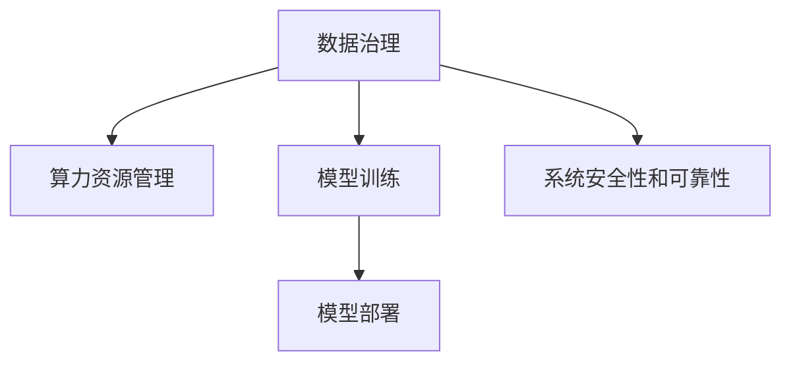

                 

# AI 2.0 时代：基础设施建设的机遇与挑战

## 1. 背景介绍

### 1.1 问题由来
随着人工智能(AI)技术的飞速发展，尤其是深度学习和大数据技术的应用，AI 2.0时代已悄然到来。AI 2.0时代，数据成为了新的生产要素，算力资源和计算架构也成为驱动 AI 发展的关键基础设施。基础设施建设不仅要满足当前需求，还要具有灵活性，以适应未来不断变化的技术和应用场景。

### 1.2 问题核心关键点
当前，AI 基础设施建设面临的主要挑战包括：
- **数据管理和治理**：如何有效地存储、管理和利用海量数据，确保数据安全和隐私保护。
- **算力资源管理**：如何高效地调度和管理计算资源，满足不同 AI 任务的计算需求。
- **模型训练与部署**：如何快速、稳定地训练和部署大规模 AI 模型，优化成本和效率。
- **系统安全性和可靠性**：如何保证 AI 系统的稳定运行，避免出现故障或安全漏洞。

这些问题不仅涉及技术层面的挑战，还需要跨学科的协作，包括计算机科学、数据科学、系统工程和安全保障等领域。

## 2. 核心概念与联系

### 2.1 核心概念概述

为更好地理解 AI 基础设施的建设，本节将介绍几个密切相关的核心概念：

- **数据治理**：数据治理是大数据应用的基础，旨在通过政策、制度和技术手段，确保数据的质量、安全性和合规性。
- **算力资源管理**：算力资源管理包括硬件资源的分配、调度、监控和优化，是 AI 系统高效运行的关键。
- **模型训练与部署**：模型训练是指利用数据和计算资源，训练 AI 模型的过程；模型部署是将训练好的模型投入使用的过程。
- **系统安全性和可靠性**：系统安全性和可靠性是指保障 AI 系统稳定运行，避免因硬件故障、网络攻击等原因导致的系统崩溃或数据泄露。

这些核心概念之间的逻辑关系可以通过以下 Mermaid 流程图来展示：



这个流程图展示了大数据和 AI 系统建设的各个关键环节，以及它们之间的相互作用。

## 3. 核心算法原理 & 具体操作步骤
### 3.1 算法原理概述

AI 基础设施的建设，本质上是通过一系列算法和技术手段，实现数据的有效管理和利用，算力的高效调度和管理，模型的快速训练和部署，以及系统的安全性和可靠性保障。其核心原理可以总结为以下几个方面：

1. **数据治理算法**：通过数据清洗、标注、分类等技术手段，确保数据的质量和一致性。
2. **算力资源管理算法**：采用资源调度算法（如 Kubernetes、Fargate 等），实现资源的自动化分配和管理。
3. **模型训练算法**：采用分布式训练算法（如 Parameter Server、Horovod 等），提高模型训练的效率和效果。
4. **模型部署算法**：通过容器化技术（如 Docker、Kubernetes 等），实现模型的快速部署和扩展。
5. **系统安全性和可靠性算法**：通过异常检测、故障恢复、安全加固等技术手段，保障系统的稳定运行。

### 3.2 算法步骤详解

AI 基础设施建设的具体步骤包括：

1. **数据收集与管理**：收集高质量的数据，并进行清洗、标注、分类等预处理操作，构建数据治理框架。
2. **算力资源配置**：根据任务需求，配置合适的硬件资源，如 CPU、GPU、内存等。
3. **模型训练与优化**：选择合适的训练算法和框架，如 TensorFlow、PyTorch、MXNet 等，进行模型训练和参数优化。
4. **模型部署与监控**：将训练好的模型部署到生产环境，并使用监控工具（如 Prometheus、Grafana 等）进行实时监控和故障诊断。
5. **系统安全与加固**：采用加密技术、访问控制、日志审计等手段，确保系统的安全性，防止数据泄露和攻击。

### 3.3 算法优缺点

AI 基础设施建设中采用的算法和技术有以下优缺点：

**优点**：
- **高效性**：通过自动化和智能化手段，提高资源利用率和模型训练效率。
- **可扩展性**：采用分布式和容器化技术，实现系统的大规模扩展和部署。
- **可靠性**：通过监控、故障恢复和安全加固，提高系统的稳定性和可靠性。

**缺点**：
- **复杂性**：建设和管理 AI 基础设施需要跨学科的协作，涉及技术复杂度高。
- **成本高**：算力资源和数据存储等成本较高，需要大量的资金投入。
- **安全性风险**：系统复杂性增加，导致安全漏洞的风险增加。

### 3.4 算法应用领域

AI 基础设施的算法和技术在多个领域得到了广泛应用：

- **金融**：用于风险评估、欺诈检测、客户服务等方面，提高金融业务的智能化水平。
- **医疗**：用于疾病预测、药物研发、医疗影像分析等方面，提升医疗服务的质量和效率。
- **自动驾驶**：用于环境感知、路径规划、决策控制等方面，推动自动驾驶技术的发展。
- **智能制造**：用于生产过程优化、质量控制、设备维护等方面，提升制造业的智能化水平。
- **智能家居**：用于智能语音助手、安防监控、智能控制等方面，提升家居生活的便捷性和安全性。

## 4. 数学模型和公式 & 详细讲解  
### 4.1 数学模型构建

AI 基础设施的建设涉及多个数学模型的构建，以确保数据、算力和系统的有效管理和利用。

1. **数据清洗模型**：
   - 假设数据集为 $D=\{(x_i,y_i)\}_{i=1}^N$，其中 $x_i$ 为输入，$y_i$ 为标签。
   - 数据清洗模型 $M$ 将对 $D$ 进行处理，得到干净的数据集 $D'$。

   数据清洗模型可以表示为：
   $$
   D' = M(D)
   $$

2. **资源调度模型**：
   - 假设资源需求为 $R_i$，资源供给为 $S_i$，$R_i$ 和 $S_i$ 均由服务器、GPU、内存等组成。
   - 资源调度模型 $M$ 将根据 $R_i$ 和 $S_i$ 进行资源分配，确保任务高效完成。

   资源调度模型可以表示为：
   $$
   A = M(R_i,S_i)
   $$

3. **模型训练模型**：
   - 假设模型参数为 $\theta$，训练数据集为 $D$，损失函数为 $L$。
   - 模型训练模型 $M$ 将对 $\theta$ 进行优化，使得 $L$ 最小化。

   模型训练模型可以表示为：
   $$
   \theta^* = M(D,L)
   $$

4. **模型部署模型**：
   - 假设训练好的模型为 $M_{\theta}$，部署平台为 $P$。
   - 模型部署模型 $M$ 将 $M_{\theta}$ 部署到 $P$ 上，供实际应用使用。

   模型部署模型可以表示为：
   $$
   M_{\text{deployed}} = M(M_{\theta},P)
   $$

5. **系统安全性模型**：
   - 假设系统安全风险为 $R$，安全防护措施为 $S$。
   - 系统安全性模型 $M$ 将根据 $R$ 和 $S$ 进行加固，确保系统安全。

   系统安全性模型可以表示为：
   $$
   S^* = M(R,S)
   $$

### 4.2 公式推导过程

以数据清洗模型为例，假设数据集 $D$ 中存在噪声和异常值，数据清洗模型 $M$ 的目标是去除这些噪声和异常值，得到干净的数据集 $D'$。

设 $D$ 中的噪声和异常值为 $N$，则数据清洗模型可以表示为：
$$
D' = M(D,N)
$$

数据清洗模型 $M$ 的推导过程如下：

1. **噪声检测**：检测数据中的噪声和异常值。
   - 假设 $N$ 为噪声和异常值，则 $D$ 可以表示为：
     $$
     D = \{x_i,y_i,N_i\}_{i=1}^N
     $$
   - 其中 $N_i$ 表示数据中的噪声和异常值。

2. **噪声移除**：根据检测结果，移除噪声和异常值。
   - 假设 $N_i$ 检测为噪声或异常值，则将其从 $D$ 中移除，得到干净的数据集 $D'$。

3. **异常值处理**：对检测到的异常值进行处理，如替换为平均值、中位数等。

通过以上步骤，可以得到干净的数据集 $D'$：
$$
D' = M(D,N) = \{x_i',y_i'\}_{i=1}^N
$$

其中 $x_i'$ 和 $y_i'$ 表示处理后的数据和标签。

### 4.3 案例分析与讲解

以金融领域的风险评估为例，数据清洗模型在风险评估中的应用如下：

1. **数据收集**：收集金融交易数据，包括交易时间、金额、交易类型等。
2. **数据预处理**：进行数据清洗和标注，去除噪声和异常值，构建训练集 $D$。
3. **模型训练**：使用训练集 $D$ 训练风险评估模型 $M_{\theta}$，最小化损失函数 $L$。
4. **模型部署**：将训练好的模型 $M_{\theta}$ 部署到生产环境，供实际风险评估使用。
5. **模型监控**：使用监控工具实时监控模型性能，确保其稳定运行。

在金融风险评估中，数据清洗模型的作用是确保数据的质量和一致性，提高模型训练的准确性。

## 5. 项目实践：代码实例和详细解释说明
### 5.1 开发环境搭建

在进行 AI 基础设施建设实践前，我们需要准备好开发环境。以下是使用 Python 和 PyTorch 开发的环境配置流程：

1. **安装 Python 和 PyTorch**：
   - 安装 Python 环境：
     ```bash
     sudo apt-get update
     sudo apt-get install python3 python3-pip
     sudo apt-get install python3-dev
     sudo apt-get install libffi-dev
     ```
   - 安装 PyTorch：
     ```bash
     sudo pip3 install torch torchvision torchaudio
     ```

2. **安装 TensorBoard**：用于可视化模型训练过程和结果。
   ```bash
   sudo pip3 install tensorboard
   ```

3. **安装 Kubernetes**：用于容器化部署和管理。
   ```bash
   sudo apt-get update
   sudo apt-get install apt-transport-https curl
   curl -s https://packages.cloud.google.com/apt/doc/apt-key.gpg | sudo apt-key add -
   sudo add-apt-repository "deb https://apt.kubernetes.io/ kubernetes-xenial main"
   sudo apt-get update
   sudo apt-get install -y kubelet kubeadm kubectl
   ```

### 5.2 源代码详细实现

下面我们以金融领域的风险评估为例，给出使用 PyTorch 和 Kubernetes 进行 AI 基础设施建设开发的 Python 代码实现。

首先，定义风险评估模型的输入和输出：

```python
import torch
import torch.nn as nn
import torch.optim as optim

class RiskModel(nn.Module):
    def __init__(self, input_dim, output_dim):
        super(RiskModel, self).__init__()
        self.fc1 = nn.Linear(input_dim, 256)
        self.fc2 = nn.Linear(256, output_dim)

    def forward(self, x):
        x = torch.relu(self.fc1(x))
        x = torch.sigmoid(self.fc2(x))
        return x

# 定义数据集
class FinancialDataDataset(torch.utils.data.Dataset):
    def __init__(self, data, target):
        self.data = data
        self.target = target

    def __getitem__(self, index):
        x = self.data[index]
        y = self.target[index]
        return (x, y)

    def __len__(self):
        return len(self.data)
```

然后，定义模型训练和评估函数：

```python
# 定义损失函数和优化器
criterion = nn.BCELoss()
optimizer = optim.Adam(model.parameters(), lr=0.001)

# 定义训练函数
def train_model(model, train_data, test_data, epochs=10):
    for epoch in range(epochs):
        train_loss = 0
        for i, (inputs, targets) in enumerate(train_data):
            optimizer.zero_grad()
            outputs = model(inputs)
            loss = criterion(outputs, targets)
            loss.backward()
            optimizer.step()
            train_loss += loss.item()
        print(f"Epoch {epoch+1}, train loss: {train_loss/len(train_data)}")

# 定义评估函数
def evaluate_model(model, test_data):
    correct = 0
    total = 0
    with torch.no_grad():
        for inputs, targets in test_data:
            outputs = model(inputs)
            _, predicted = torch.max(outputs.data, 1)
            total += targets.size(0)
            correct += (predicted == targets).sum().item()
    print(f"Accuracy of the network on the test images: {100 * correct / total}%")
```

最后，启动训练流程并在测试集上评估：

```python
# 加载数据集
train_data = FinancialDataDataset(train_data, train_labels)
test_data = FinancialDataDataset(test_data, test_labels)

# 训练模型
train_model(model, train_data, test_data)

# 评估模型
evaluate_model(model, test_data)
```

以上就是使用 PyTorch 和 Kubernetes 进行 AI 基础设施建设开发的完整代码实现。可以看到，通过 PyTorch 的高效计算和 Kubernetes 的容器化部署，可以轻松构建金融风险评估的 AI 系统。

### 5.3 代码解读与分析

让我们再详细解读一下关键代码的实现细节：

**RiskModel类**：
- `__init__`方法：定义模型结构，包含两个全连接层。
- `forward`方法：定义模型前向传播过程，通过激活函数和输出层得到模型输出。

**FinancialDataDataset类**：
- `__init__`方法：定义数据集，包含数据和标签。
- `__getitem__`方法：定义获取单个样本的函数。
- `__len__`方法：定义数据集的长度。

**train_model函数**：
- 使用 PyTorch 定义损失函数和优化器。
- 在每个 epoch 中，对模型进行前向传播、计算损失、反向传播和优化。
- 输出每个 epoch 的训练 loss。

**evaluate_model函数**：
- 在测试集上对模型进行评估，计算模型准确率。
- 输出模型的评估结果。

**训练流程**：
- 定义训练轮数和 batch size。
- 加载数据集。
- 调用 train_model 函数训练模型。
- 调用 evaluate_model 函数评估模型。

可以看出，通过 PyTorch 和 Kubernetes 的高效开发环境，可以轻松实现 AI 基础设施的建设，并在测试集上评估模型的性能。

## 6. 实际应用场景

### 6.1 智能客服系统

智能客服系统在金融、电商、医疗等许多行业都有广泛应用。通过 AI 基础设施建设，可以实现智能客服系统的快速部署和高效运行。

具体而言，可以使用微服务架构和 Kubernetes 容器化技术，将智能客服系统的各个组件（如语音识别、自然语言处理、意图识别等）独立部署和调度，以提高系统的可伸缩性和稳定性。同时，使用 TensorBoard 和 Prometheus 等工具，实时监控系统的性能和状态，及时发现和解决问题。

### 6.2 金融舆情监测

金融舆情监测是金融风险管理和客户服务的重要组成部分。通过 AI 基础设施建设，可以实现实时监测和分析金融舆情，及时预警和应对市场波动。

具体而言，可以使用分布式训练和模型压缩技术，快速训练和部署金融舆情监测模型，提高模型训练和推理的效率。同时，使用 Kubernetes 和容器化技术，将模型部署到云端，实现大规模数据和模型的存储和处理。使用 TensorBoard 和 Prometheus 等工具，实时监控系统的性能和状态，确保系统的稳定运行。

### 6.3 个性化推荐系统

个性化推荐系统在电商、视频、音乐等领域有广泛应用。通过 AI 基础设施建设，可以实现推荐系统的快速部署和高效运行。

具体而言，可以使用分布式训练和模型压缩技术，快速训练和部署个性化推荐模型，提高模型训练和推理的效率。同时，使用 Kubernetes 和容器化技术，将模型部署到云端，实现大规模数据和模型的存储和处理。使用 TensorBoard 和 Prometheus 等工具，实时监控系统的性能和状态，确保系统的稳定运行。

### 6.4 未来应用展望

随着 AI 基础设施建设的不断发展，未来将有以下几个趋势：

1. **智能化自动化**：未来 AI 基础设施将更加智能化和自动化，能够自动进行资源调度、模型训练、系统监控等操作，减少人工干预，提高系统的效率和稳定性。
2. **实时化动态化**：未来 AI 基础设施将实现实时化和动态化，能够根据任务的实时需求和数据的变化，动态调整资源和算法，提高系统的灵活性和适应性。
3. **跨领域融合化**：未来 AI 基础设施将实现跨领域的融合，支持多模态数据的处理和分析，提升系统的综合能力和应用范围。
4. **边缘化部署化**：未来 AI 基础设施将实现边缘化部署，支持在设备端进行数据处理和模型推理，减少数据传输和计算延迟，提高系统的响应速度和用户体验。
5. **协同化开放化**：未来 AI 基础设施将实现协同化和开放化，支持多方协同开发和共享资源，构建更加开放、协作、互惠的 AI 生态系统。

这些趋势将推动 AI 基础设施的不断发展，为各行各业带来更广阔的应用前景。

## 7. 工具和资源推荐

### 7.1 学习资源推荐

为了帮助开发者系统掌握 AI 基础设施的建设和优化，这里推荐一些优质的学习资源：

1. **《机器学习实战》（作者：Peter Harrington）**：介绍机器学习的基本概念和算法，适合初学者入门。
2. **《深度学习》（作者：Ian Goodfellow）**：深入讲解深度学习的基本原理和应用，适合进阶学习。
3. **Kubernetes 官方文档**：详细的 Kubernetes 文档和教程，适合掌握容器化部署和管理技术。
4. **TensorBoard 官方文档**：详细的 TensorBoard 文档和教程，适合掌握模型训练和性能监控技术。
5. **《TensorFlow 实战》（作者：Jay Alammar）**：介绍 TensorFlow 的基本概念和应用，适合掌握深度学习框架的使用。

通过对这些资源的学习实践，相信你一定能够快速掌握 AI 基础设施的建设和优化，并用于解决实际的 AI 问题。

### 7.2 开发工具推荐

高效的开发离不开优秀的工具支持。以下是几款用于 AI 基础设施建设和优化的常用工具：

1. **PyTorch**：基于 Python 的开源深度学习框架，灵活高效，适合研究和开发 AI 模型。
2. **TensorFlow**：由 Google 主导的开源深度学习框架，功能丰富，适合生产部署和优化。
3. **Kubernetes**：谷歌开源的容器编排系统，支持自动化的资源管理和调度。
4. **TensorBoard**：谷歌开源的可视化工具，支持监控和调试 AI 模型的训练和推理。
5. **Prometheus 和 Grafana**：开源的监控和可视化系统，支持实时监控和数据分析。

合理利用这些工具，可以显著提升 AI 基础设施的开发和优化效率，加快创新迭代的步伐。

### 7.3 相关论文推荐

AI 基础设施建设的理论研究不断推进，以下是几篇奠基性的相关论文，推荐阅读：

1. **《TensorFlow: A System for Large-Scale Machine Learning》（作者：Martín Abadi 等）**：介绍 TensorFlow 的设计和实现，是深度学习框架的代表。
2. **《Kubernetes: Protecting Your Most Important Workload with Automated Scaling》（作者：Brett Pollard 等）**：介绍 Kubernetes 的设计和实现，是容器化技术的代表。
3. **《Machine Learning: Principles and Patterns》（作者：Peter Harrington）**：深入讲解机器学习的原理和模式，是机器学习领域的经典之作。
4. **《Data-parallel Training of Deep Neural Networks》（作者：Geoffrey Hinton 等）**：介绍分布式深度学习算法，是分布式训练的代表性论文。

这些论文代表了大数据和 AI 基础设施建设的研究前沿，阅读这些论文可以帮助研究者把握学科发展方向，激发更多的创新灵感。

## 8. 总结：未来发展趋势与挑战

### 8.1 总结

本文对 AI 2.0 时代基础设施建设的机遇与挑战进行了全面系统的介绍。首先阐述了 AI 基础设施建设在大数据和 AI 系统中的重要性，明确了基础设施建设在满足当前需求、支持未来发展中的关键作用。其次，从原理到实践，详细讲解了数据治理、算力资源管理、模型训练与部署、系统安全性和可靠性等方面的核心算法和操作步骤。同时，本文还广泛探讨了 AI 基础设施建设在金融、医疗、自动驾驶、智能制造、智能家居等领域的实际应用场景，展示了基础设施建设带来的巨大潜力。此外，本文精选了基础设施建设的学习资源、开发工具和相关论文，力求为读者提供全方位的技术指引。

通过本文的系统梳理，可以看到，AI 基础设施建设不仅是技术层面的挑战，更涉及跨学科的协作和多领域的融合。只有通过不断创新和优化，才能构建高效、稳定、可靠的大数据和 AI 系统，满足不断变化的需求，实现技术进步和社会进步的双重目标。

### 8.2 未来发展趋势

展望未来，AI 基础设施建设将呈现以下几个发展趋势：

1. **智能化自动化**：未来 AI 基础设施将更加智能化和自动化，能够自动进行资源调度、模型训练、系统监控等操作，减少人工干预，提高系统的效率和稳定性。
2. **实时化动态化**：未来 AI 基础设施将实现实时化和动态化，能够根据任务的实时需求和数据的变化，动态调整资源和算法，提高系统的灵活性和适应性。
3. **跨领域融合化**：未来 AI 基础设施将实现跨领域的融合，支持多模态数据的处理和分析，提升系统的综合能力和应用范围。
4. **边缘化部署化**：未来 AI 基础设施将实现边缘化部署，支持在设备端进行数据处理和模型推理，减少数据传输和计算延迟，提高系统的响应速度和用户体验。
5. **协同化开放化**：未来 AI 基础设施将实现协同化和开放化，支持多方协同开发和共享资源，构建更加开放、协作、互惠的 AI 生态系统。

这些趋势将推动 AI 基础设施的不断发展，为各行各业带来更广阔的应用前景。

### 8.3 面临的挑战

尽管 AI 基础设施建设已经取得了显著进展，但在迈向更加智能化、普适化应用的过程中，它仍面临着诸多挑战：

1. **数据治理的复杂性**：数据治理涉及数据清洗、标注、分类、安全等多个方面，需要跨学科的协作和技术的融合。
2. **算力资源的稀缺性**：算力资源的获取和调度仍面临成本高、效率低的问题，需要更高效的资源管理算法。
3. **模型训练的高成本**：大规模模型训练需要大量的计算资源和时间，需要更高效的训练算法和更快速的硬件支持。
4. **系统安全性的挑战**：AI 系统面临的威胁日益复杂，需要更强的安全性和防护措施。
5. **跨领域融合的困难**：多模态数据的处理和分析涉及跨领域知识的融合，需要更强的跨领域理解和协作。

这些挑战需要研究者不断地探索和创新，才能构建高效、稳定、可靠的 AI 基础设施。

### 8.4 研究展望

未来 AI 基础设施的研究需要在以下几个方面寻求新的突破：

1. **智能化自动化技术**：研究自动化的资源调度、模型训练、系统监控等技术，提升系统的智能化水平。
2. **实时化动态化技术**：研究实时化和动态化的资源管理算法，提高系统的灵活性和适应性。
3. **跨领域融合技术**：研究多模态数据的处理和分析技术，提升系统的综合能力和应用范围。
4. **边缘化部署技术**：研究边缘化部署技术，支持在设备端进行数据处理和模型推理，提高系统的响应速度和用户体验。
5. **协同化开放化技术**：研究协同化和开放化的基础设施建设技术，构建更加开放、协作、互惠的 AI 生态系统。

这些研究方向的探索，必将引领 AI 基础设施建设迈向更高的台阶，为构建智能、高效、可靠的 AI 系统铺平道路。面向未来，AI 基础设施建设需要跨学科的协作和技术的融合，共同推动人工智能技术的发展和应用。

## 9. 附录：常见问题与解答

**Q1：AI 基础设施建设对数据治理的复杂性有何影响？**

A: AI 基础设施建设对数据治理的复杂性提出了更高的要求。数据治理涉及数据清洗、标注、分类、安全等多个方面，需要跨学科的协作和技术的融合。同时，数据治理的成本和效率也直接影响 AI 系统的性能和可靠性。因此，构建高效、稳定、可靠的数据治理体系，是 AI 基础设施建设的重要基础。

**Q2：AI 基础设施建设如何应对算力资源的稀缺性？**

A: AI 基础设施建设需要高效、稳定的算力资源支持。为应对算力资源的稀缺性，可以采用以下策略：
1. 采用分布式计算和并行计算技术，提高算力资源的利用率。
2. 使用混合精度计算和压缩技术，减少计算资源的消耗。
3. 引入云平台和边缘计算技术，充分利用云端和本地计算资源。
4. 优化算法和模型结构，减少计算资源的消耗。

这些策略能够有效应对算力资源的稀缺性，提升 AI 系统的计算效率和成本效益。

**Q3：AI 基础设施建设如何优化模型训练的高成本？**

A: AI 基础设施建设需要高效的模型训练算法和硬件支持。为优化模型训练的高成本，可以采用以下策略：
1. 使用分布式训练算法，提高模型训练的效率和效果。
2. 采用混合精度计算和压缩技术，减少计算资源的消耗。
3. 使用高效的前向传播和反向传播算法，提高计算效率。
4. 引入云平台和边缘计算技术，充分利用云端和本地计算资源。
5. 优化算法和模型结构，减少计算资源的消耗。

这些策略能够有效优化模型训练的高成本，提高 AI 系统的计算效率和成本效益。

**Q4：AI 基础设施建设如何应对系统安全性的挑战？**

A: AI 基础设施建设需要强大的安全性和防护措施，以保障系统的稳定运行。为应对系统安全性的挑战，可以采用以下策略：
1. 采用加密技术、访问控制、日志审计等手段，保障数据和模型的安全。
2. 使用异常检测和故障恢复技术，及时发现和解决问题。
3. 引入安全加固和漏洞扫描技术，保障系统的安全性。
4. 加强人工干预和审核，建立系统的监管机制。

这些策略能够有效应对系统安全性的挑战，提升 AI 系统的安全性和稳定性。

**Q5：AI 基础设施建设如何应对跨领域融合的困难？**

A: AI 基础设施建设需要跨领域知识的融合，以支持多模态数据的处理和分析。为应对跨领域融合的困难，可以采用以下策略：
1. 引入跨领域知识库和规则库，提供专家知识支持。
2. 使用跨领域融合算法，提升模型的跨领域理解能力。
3. 引入多模态数据处理技术，支持多模态数据的融合和分析。
4. 加强跨领域协作和沟通，提升团队的跨领域理解和协作能力。

这些策略能够有效应对跨领域融合的困难，提升 AI 系统的综合能力和应用范围。

---

作者：禅与计算机程序设计艺术 / Zen and the Art of Computer Programming

