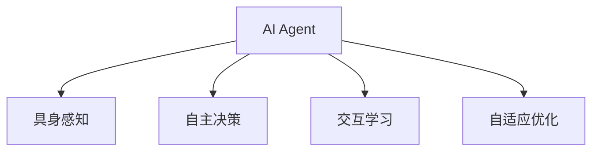

                 

# AI Agent: AI的下一个风口 具身机器人在日常生活中的应用

## 1. 背景介绍

### 1.1 问题由来

随着人工智能(AI)技术的不断发展，AI应用已从传统的集中式计算模式，向分布式、交互式、具身化方向发展。AI Agent作为一种新型的智能实体，其目标是通过模拟人类智能行为，实现与环境、用户或其他AI实体的高效互动。AI Agent不仅具备自主感知、学习、决策和交互能力，还能在复杂多变的实际环境中不断适应和优化，因此被视为未来AI应用的下一个风口。

### 1.2 问题核心关键点

AI Agent的核心技术包括具身感知、自主决策、交互学习和自适应优化等。这些技术不仅能够使AI Agent在特定领域实现高效的任务执行，还能提升AI系统在复杂多变环境中的适应性和鲁棒性。AI Agent技术涉及计算机视觉、自然语言处理、运动控制等多个交叉领域，是当前AI研究的热点和难点。

### 1.3 问题研究意义

研究AI Agent技术，对于拓展AI应用边界，提升AI系统在实际场景中的效果，加速AI技术的产业化进程，具有重要意义：

1. **提升AI系统的适应性**：AI Agent能够模拟人类的感知、决策和交互能力，更好地适应复杂多变的实际环境，提升AI系统在各种场景下的表现。
2. **降低开发成本**：通过使用AI Agent，开发人员可以更快地实现AI应用，减少从头开发所需的时间、人力和资金投入。
3. **增强人机互动**：AI Agent可以提供更加自然、直观的用户交互方式，提升用户满意度和使用体验。
4. **推动AI技术的落地应用**：AI Agent技术能够更好地融入实际业务流程，推动AI技术在更多行业中的落地应用。
5. **推动AI技术的持续演进**：AI Agent技术的发展，能够促使AI系统不断学习和优化，提升AI系统的智能水平。

## 2. 核心概念与联系

### 2.1 核心概念概述

为更好地理解AI Agent的核心技术及其应用，本节将介绍几个密切相关的核心概念：

- **AI Agent**：一种能够自主感知、学习、决策和交互的智能实体，旨在通过模拟人类智能行为，实现与环境、用户或其他AI实体的高效互动。
- **具身感知**：AI Agent通过传感器（如摄像头、激光雷达等）获取环境信息，实现对周围环境的实时感知和理解。
- **自主决策**：AI Agent通过学习算法（如强化学习、规划算法等），在感知环境的基础上，自主制定行动策略。
- **交互学习**：AI Agent通过与环境、用户或其他AI实体交互，不断学习优化自己的决策和行为。
- **自适应优化**：AI Agent能够根据环境变化和任务需求，动态调整自身策略和行为，保持最优性能。

这些核心概念之间的逻辑关系可以通过以下Mermaid流程图来展示：



这个流程图展示出AI Agent的核心概念及其之间的关系：

1. **具身感知**：AI Agent通过传感器获取环境信息，实现对环境的实时感知。
2. **自主决策**：AI Agent通过学习算法，在感知环境的基础上，制定行动策略。
3. **交互学习**：AI Agent通过与环境、用户或其他AI实体交互，不断学习优化。
4. **自适应优化**：AI Agent能够根据环境变化和任务需求，动态调整自身策略和行为。

## 3. 核心算法原理 & 具体操作步骤

### 3.1 算法原理概述

AI Agent的核心算法主要围绕具身感知、自主决策、交互学习和自适应优化四个方面展开。其核心思想是：通过感知环境、学习行为、决策行动和动态优化，实现与环境、用户和其他AI实体的交互和协同。

具体而言，AI Agent的算法包括：

1. **具身感知算法**：用于实时获取环境信息，并对其进行处理和理解。
2. **自主决策算法**：用于在感知环境的基础上，制定行动策略，实现目标任务。
3. **交互学习算法**：用于在互动过程中，不断学习和优化自身的行为策略。
4. **自适应优化算法**：用于在环境变化和任务需求发生变化时，动态调整自身策略和行为。

### 3.2 算法步骤详解

AI Agent的算法主要包括以下几个关键步骤：

**Step 1: 数据感知与环境建模**

AI Agent通过传感器（如摄像头、激光雷达等）获取环境信息，使用传感器数据进行环境建模。例如，对于机器人，可以使用摄像头捕捉视觉图像，使用激光雷达获取环境中的障碍物位置等。

**Step 2: 特征提取与环境理解**

使用机器学习算法对传感器数据进行处理，提取环境特征。例如，使用卷积神经网络对视觉图像进行处理，提取关键物体和行为特征。

**Step 3: 自主决策与行为规划**

根据提取的环境特征，使用强化学习、规划算法等，制定行动策略。例如，使用Q-learning算法学习最优的行动策略，使用A*算法进行路径规划。

**Step 4: 交互学习与模型优化**

在执行行动的过程中，AI Agent与环境、用户或其他AI实体进行交互，收集反馈信息，不断优化自身的行为策略。例如，使用经验回放、模型微调等技术，更新自身的行为模型。

**Step 5: 自适应优化与动态调整**

根据环境变化和任务需求，动态调整自身的策略和行为。例如，使用在线学习算法，实时更新决策模型，适应环境变化。

### 3.3 算法优缺点

AI Agent算法具有以下优点：

1. **适应性强**：AI Agent能够适应复杂多变的环境，实时调整自身策略和行为。
2. **自主决策能力强**：AI Agent具备自主感知、学习和决策能力，能够在无人类干预的情况下完成任务。
3. **交互能力强**：AI Agent能够与环境、用户和其他AI实体进行高效的交互，提升任务执行效率。
4. **自适应能力强**：AI Agent能够根据环境变化和任务需求，动态调整自身策略和行为，保持最优性能。

同时，该算法也存在一定的局限性：

1. **资源消耗大**：AI Agent需要大量的传感器和计算资源，初期开发和部署成本较高。
2. **复杂度高**：AI Agent算法涉及多个交叉领域，设计复杂，开发难度大。
3. **鲁棒性不足**：AI Agent在面对极端环境或异常情况时，可能出现决策失误或行为异常。
4. **可解释性不足**：AI Agent的决策过程往往缺乏可解释性，难以对其推理逻辑进行分析和调试。

尽管存在这些局限性，但AI Agent算法仍是大规模、复杂环境下的高效解决方案，具有广泛的应用前景。

### 3.4 算法应用领域

AI Agent算法在多个领域得到了广泛应用，例如：

1. **机器人技术**：用于自主导航、避障、抓取等任务，提升机器人任务的自动化水平。
2. **智能家居**：用于家庭环境感知、智能家电控制、安全监测等，提升家居系统的智能化水平。
3. **自动驾驶**：用于车辆环境感知、路径规划、决策行动等，提升自动驾驶系统的安全性。
4. **医疗辅助**：用于患者监护、手术辅助、药物管理等，提升医疗服务的智能化水平。
5. **智能客服**：用于客户感知、互动对话、任务处理等，提升客户服务质量。
6. **智慧城市**：用于交通管理、环境监测、应急响应等，提升城市管理的智能化水平。

## 4. 数学模型和公式 & 详细讲解 & 举例说明

### 4.1 数学模型构建

AI Agent算法的核心数学模型包括感知模型、决策模型、交互模型和优化模型。以机器人导航为例，构建AI Agent的数学模型如下：

**感知模型**：用于描述传感器获取环境信息的过程。

**决策模型**：用于描述AI Agent在感知环境的基础上，制定行动策略的过程。

**交互模型**：用于描述AI Agent与环境、用户和其他AI实体进行交互的过程。

**优化模型**：用于描述AI Agent在执行行动的过程中，动态调整自身策略和行为的过程。

### 4.2 公式推导过程

以下我们以机器人路径规划为例，推导Q-learning算法的公式。

假设AI Agent的行动空间为 $S=\{s_1, s_2, ..., s_n\}$，状态空间为 $O=\{o_1, o_2, ..., o_m\}$，行动空间为 $A=\{a_1, a_2, ..., a_k\}$。设 $Q(s, a)$ 表示在状态 $s$ 下，采取行动 $a$ 的期望收益。

**Q-learning算法**：

1. 初始化：$Q(s, a) \leftarrow 0$。
2. 迭代更新：
   $$
   Q(s, a) \leftarrow Q(s, a) + \alpha(r + \gamma \max_{a'} Q(s', a') - Q(s, a))
   $$
   其中 $r$ 为当前状态的即时奖励，$s'$ 为下一步状态，$a'$ 为下一步行动，$\alpha$ 为学习率，$\gamma$ 为折扣因子。

### 4.3 案例分析与讲解

**案例分析**：以自动驾驶中的路径规划为例，解释Q-learning算法的工作原理。

1. **感知模型**：自动驾驶系统通过摄像头、激光雷达等传感器获取道路信息，包括道路上的车辆、行人、交通信号等。
2. **决策模型**：基于感知到的道路信息，使用Q-learning算法，学习最优的行驶路径。
3. **交互模型**：自动驾驶系统与环境进行交互，接收交通信号、行人行为等信息。
4. **优化模型**：根据环境变化，动态调整行驶策略，选择最优路径。

## 5. 项目实践：代码实例和详细解释说明

### 5.1 开发环境搭建

在进行AI Agent项目实践前，我们需要准备好开发环境。以下是使用Python进行ROS开发的环境配置流程：

1. 安装ROS（Robot Operating System）：根据官方文档，下载并安装ROS操作系统。
2. 安装ROS所需的依赖库：包括ROS Python接口、ROS Bag工具等。
3. 配置ROS路径和环境变量：确保Python和ROS能相互访问。
4. 安装ROS所需的传感器和硬件：包括摄像头、激光雷达、电机等。
5. 安装ROS所需的机器学习库：包括TensorFlow、OpenCV等。

完成上述步骤后，即可在ROS环境下开始AI Agent的开发实践。

### 5.2 源代码详细实现

以下是使用ROS和PyTorch进行机器人路径规划的代码实现：

**感知模块**：
```python
import cv2
import rospkg
from sensor_msgs.msg import Image
from tf.transformations import euler_from_quaternion

class PerceptionModule:
    def __init__(self):
        # 初始化摄像头和激光雷达
        self.camera = cv2.VideoCapture(0)
        self.laser = sensor_msgs.msg.LaserScan()
        
        # 初始化感知模型
        self.perception_model = PerceptionModel()
        
    def process_sensor_data(self):
        # 获取摄像头图像和激光雷达数据
        image = self.camera.read()
        self.laser.header.stamp = rospy.Time.now()
        
        # 使用感知模型处理传感器数据
        image_tensor = self.perception_model(image)
        self.laser.data = self.perception_model(laser_data)
        
        # 返回处理后的数据
        return image_tensor, self.laser.data
```

**决策模块**：
```python
import torch
from torch import nn
from torch.nn import functional as F

class DecisionModule(nn.Module):
    def __init__(self):
        super(DecisionModule, self).__init__()
        self.fc1 = nn.Linear(64, 64)
        self.fc2 = nn.Linear(64, 4)
        
    def forward(self, x):
        x = F.relu(self.fc1(x))
        x = self.fc2(x)
        return x
```

**交互模块**：
```python
import rospy
import rospkg
from nav_msgs.msg import Odometry
from std_msgs.msg import Bool

class InteractionModule:
    def __init__(self):
        # 初始化动作控制器
        self.action_controller = ActionController()
        
        # 初始化交互模型
        self.interaction_model = InteractionModel()
        
    def process_action(self):
        # 获取当前位置和方向
        location = self.action_controller.current_position
        orientation = self.action_controller.current_orientation
        
        # 使用交互模型进行决策
        action = self.interaction_model(location, orientation)
        
        # 返回决策结果
        return action
```

**优化模块**：
```python
import rospkg
from sensor_msgs.msg import Image
from tf.transformations import euler_from_quaternion

class OptimizationModule:
    def __init__(self):
        # 初始化路径规划器
        self.path_planner = PathPlanner()
        
        # 初始化优化模型
        self.optimization_model = OptimizationModel()
        
    def optimize_path(self):
        # 获取当前位置和方向
        location = self.path_planner.current_position
        orientation = self.path_planner.current_orientation
        
        # 使用优化模型进行路径规划
        path = self.optimization_model(location, orientation)
        
        # 返回优化后的路径
        return path
```

### 5.3 代码解读与分析

**代码解读**：

- **感知模块**：使用OpenCV库获取摄像头图像和激光雷达数据，并将其输入感知模型进行处理。感知模型通常使用卷积神经网络(CNN)或循环神经网络(RNN)等深度学习算法，提取环境特征。
- **决策模块**：使用神经网络模型进行决策。决策模型通常包括一个或多个全连接层，用于预测最优的行动策略。
- **交互模块**：与环境进行交互，使用ROS的ActionServer和ActionClient进行通信。交互模块通常根据感知数据和决策结果，发出行动指令。
- **优化模块**：根据当前位置和方向，使用路径规划算法进行路径优化。优化模型通常使用A*、Dijkstra等算法，选择最优的路径。

**代码分析**：

- **感知模块**：通过摄像头和激光雷达获取环境信息，并将其输入感知模型进行处理。感知模型将传感器数据转换为高维特征向量，用于后续的决策和优化。
- **决策模块**：使用神经网络模型对感知数据进行处理，输出最优的行动策略。决策模块通常使用前向传播和反向传播算法，更新模型参数。
- **交互模块**：根据决策结果，使用ROS的ActionServer和ActionClient进行通信。交互模块将行动指令转换为ROS消息，发送到ActionServer，并接收ActionClient的反馈。
- **优化模块**：根据当前位置和方向，使用路径规划算法进行路径优化。优化模块将当前位置和方向作为输入，输出优化后的路径。

## 6. 实际应用场景

### 6.1 智能家居

AI Agent技术在智能家居领域具有广泛的应用前景。智能家居系统通过AI Agent实现环境感知、智能家电控制、安全监测等功能，提升用户的生活体验和安全性。例如，智能门锁通过AI Agent实现人脸识别、语音交互和异常报警，提升家居安全。智能空调通过AI Agent实现环境感知和智能控制，提升家居舒适度。

### 6.2 自动驾驶

自动驾驶技术是AI Agent在实际场景中的重要应用之一。自动驾驶车辆通过AI Agent实现环境感知、路径规划和决策行动等功能，提升驾驶安全性。例如，自动驾驶车辆通过摄像头和激光雷达感知道路信息，使用Q-learning算法进行路径规划，通过ROS进行车辆控制。

### 6.3 医疗辅助

医疗辅助是AI Agent在实际场景中的另一个重要应用领域。AI Agent通过环境感知、自主决策和交互学习，实现患者监护、手术辅助、药物管理等功能，提升医疗服务的智能化水平。例如，手术机器人通过AI Agent实现手术辅助，提高手术精度和安全性。

## 7. 工具和资源推荐

### 7.1 学习资源推荐

为了帮助开发者系统掌握AI Agent的理论基础和实践技巧，这里推荐一些优质的学习资源：

1. **《人工智能基础》**：这是一门由斯坦福大学开设的入门课程，涵盖了AI Agent的基本概念和核心算法。
2. **《机器人学导论》**：这是一本经典的机器人学教材，介绍了机器人感知、决策、交互等核心技术。
3. **《强化学习》**：这是一本关于强化学习的经典教材，介绍了Q-learning、策略梯度等核心算法。
4. **《ROS教程》**：ROS官方文档提供了大量的学习资源，包括ROS开发指南、ROS Bag工具等。
5. **《OpenCV教程》**：OpenCV是一个开源的计算机视觉库，提供了丰富的图像处理功能，是进行感知模块开发的重要工具。

### 7.2 开发工具推荐

高效的开发离不开优秀的工具支持。以下是几款用于AI Agent开发的常用工具：

1. **ROS**：Robot Operating System，用于机器人开发和调试，支持跨平台运行。
2. **PyTorch**：基于Python的深度学习框架，支持动态计算图，适合快速迭代研究。
3. **TensorFlow**：由Google主导的深度学习框架，生产部署方便，适合大规模工程应用。
4. **ROS Bag**：ROS配套的工具，用于记录和回放ROS系统的运行状态，方便分析和调试。
5. **OpenCV**：开源的计算机视觉库，提供了丰富的图像处理功能，是进行感知模块开发的重要工具。

### 7.3 相关论文推荐

AI Agent技术的发展源于学界的持续研究。以下是几篇奠基性的相关论文，推荐阅读：

1. **《Autonomous agents for continuous exploration》**：提出了一种基于Q-learning算法的自主探索方法，适用于未知环境。
2. **《Robotics, Vision and Deep Learning》**：介绍了深度学习在机器人领域的应用，包括感知、决策、交互等核心技术。
3. **《Towards Generalization with Continuous Curriculum》**：提出了一种基于连续曲线的学习策略，提升AI Agent的泛化能力。
4. **《Learning from Demonstrations》**：介绍了模仿学习技术，通过观察人类的行为，提升AI Agent的学习效率。
5. **《Model-based Reinforcement Learning》**：介绍了模型驱动的强化学习技术，提升AI Agent的决策能力。

## 8. 总结：未来发展趋势与挑战

### 8.1 总结

本文对AI Agent技术的核心算法和应用实践进行了全面系统的介绍。首先阐述了AI Agent在复杂多变环境中的重要性和应用前景，明确了AI Agent在自主决策、具身感知、交互学习和自适应优化等方面的核心技术。其次，从原理到实践，详细讲解了AI Agent算法的各个组成部分和实现细节，给出了AI Agent项目开发的完整代码实例。同时，本文还广泛探讨了AI Agent在智能家居、自动驾驶、医疗辅助等领域的实际应用，展示了AI Agent技术的广泛前景。

通过本文的系统梳理，可以看到，AI Agent技术正逐步成为未来AI应用的重要范式，其强大的自主决策和交互学习能力，使其能够在复杂多变的实际环境中，实现高效的任务执行和智能优化。未来，伴随AI Agent技术的不断演进，AI技术在更多行业中的落地应用将更加广泛，为人类社会的智能化进程带来深刻变革。

### 8.2 未来发展趋势

展望未来，AI Agent技术将呈现以下几个发展趋势：

1. **多模态融合**：AI Agent技术将逐渐融合多模态信息，实现视觉、语音、触觉等多模态信息的协同感知和理解。
2. **知识图谱整合**：AI Agent技术将逐步整合知识图谱等先验知识，提升决策的准确性和泛化能力。
3. **分布式协作**：AI Agent技术将逐步实现分布式协作，提升系统的大规模并行处理能力。
4. **自适应学习**：AI Agent技术将逐步实现自适应学习，提升系统的鲁棒性和适应能力。
5. **人机协同**：AI Agent技术将逐渐实现人机协同，提升系统的智能水平和用户体验。

### 8.3 面临的挑战

尽管AI Agent技术已经取得了瞩目成就，但在迈向更加智能化、普适化应用的过程中，仍面临诸多挑战：

1. **资源消耗大**：AI Agent技术需要大量的传感器和计算资源，初期开发和部署成本较高。
2. **复杂度高**：AI Agent技术涉及多个交叉领域，设计复杂，开发难度大。
3. **鲁棒性不足**：AI Agent技术在面对极端环境或异常情况时，可能出现决策失误或行为异常。
4. **可解释性不足**：AI Agent技术的决策过程往往缺乏可解释性，难以对其推理逻辑进行分析和调试。

尽管存在这些挑战，但AI Agent技术仍是大规模、复杂环境下的高效解决方案，具有广泛的应用前景。

### 8.4 研究展望

面对AI Agent技术面临的挑战，未来的研究需要在以下几个方面寻求新的突破：

1. **资源优化**：开发更加轻量级、低成本的传感器和计算设备，降低AI Agent技术的初期开发和部署成本。
2. **模型简化**：开发更加简单、高效的算法模型，提升AI Agent技术的可解释性和鲁棒性。
3. **人机协同**：开发更加智能、友好的人机交互界面，提升AI Agent技术的用户体验和用户满意度。
4. **多模态融合**：开发更加复杂、全面的多模态感知和理解技术，提升AI Agent技术的感知能力和决策能力。
5. **分布式协作**：开发更加高效、可靠的分布式协作技术，提升AI Agent技术的处理能力和系统可靠性。

这些研究方向的探索，必将引领AI Agent技术迈向更高的台阶，为构建安全、可靠、可解释、可控的智能系统铺平道路。面向未来，AI Agent技术还需要与其他AI技术进行更深入的融合，如自然语言处理、计算机视觉、深度学习等，多路径协同发力，共同推动智能系统的进步。只有勇于创新、敢于突破，才能不断拓展AI技术的应用边界，让智能技术更好地造福人类社会。

## 9. 附录：常见问题与解答

**Q1：AI Agent是否适用于所有AI任务？**

A: AI Agent技术主要适用于自主决策、具身感知、交互学习和自适应优化的任务。对于一些需要高度结构化和规则驱动的任务，AI Agent可能并不适用。例如，对于财务数据处理、股票分析等任务，可能需要更加结构化和规则化的算法。

**Q2：AI Agent的开发难度是否较大？**

A: AI Agent技术涉及多个交叉领域，设计复杂，开发难度较大。但随着技术的发展，开源工具和框架的完善，开发难度正在逐步降低。例如，ROS、TensorFlow等工具提供了丰富的开发接口和库函数，降低了开发难度。

**Q3：AI Agent的决策过程是否透明？**

A: AI Agent的决策过程往往缺乏可解释性，难以对其推理逻辑进行分析和调试。未来，随着可解释AI技术的发展，AI Agent的决策过程将逐渐透明，提升系统的可解释性和用户信任度。

**Q4：AI Agent是否容易受到环境干扰？**

A: AI Agent技术在面对极端环境或异常情况时，可能出现决策失误或行为异常。为提升AI Agent的鲁棒性，需要在算法设计中引入更多的容错机制和异常处理策略。

**Q5：AI Agent在实际应用中是否安全可靠？**

A: AI Agent技术在实际应用中，需要考虑到安全性和可靠性问题。例如，自动驾驶车辆需要满足一定的安全标准和法律法规，医疗辅助系统需要经过严格的测试和认证。未来，需要从数据安全、算法透明和用户监管等多个方面，保障AI Agent系统的安全性。

---

作者：禅与计算机程序设计艺术 / Zen and the Art of Computer Programming

