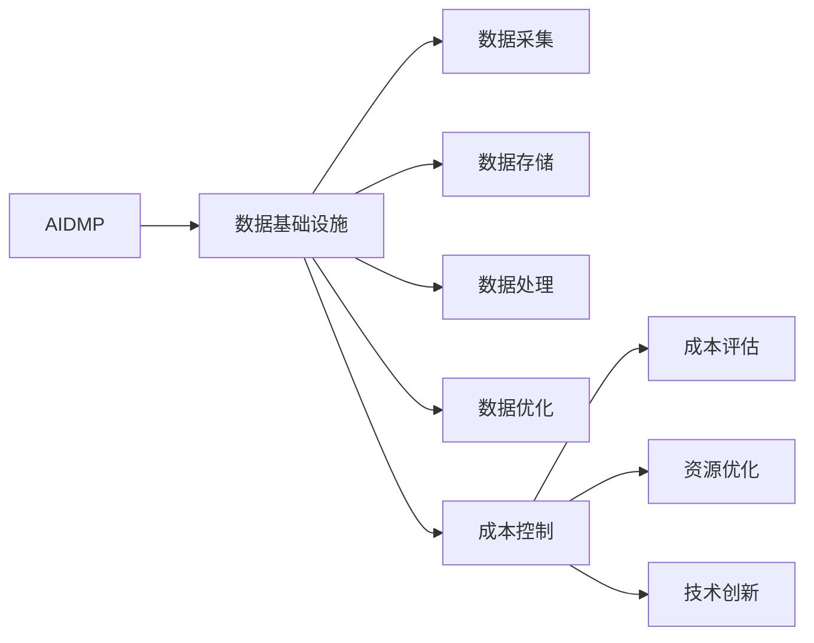

                 

## 1. 背景介绍

随着人工智能（AI）和机器学习（ML）技术的快速进步，人工智能驱动的决策平台（AI-driven Decision Platforms, AI DMP）在营销、广告和业务智能等领域的应用越来越广泛。这些平台通过分析和利用海量数据，帮助企业做出更智能的决策，提升效率和收益。然而，构建和维护一个高效的AI DMP，涉及到数据采集、处理、存储、计算和优化等多个环节，成本控制成为了一个重要的问题。

本文将深入探讨AI DMP数据基建的成本控制，包括数据基础设施的设计、构建和优化策略。我们将从核心概念入手，探讨其原理与架构，并通过具体的算法与技术，详细讲解AI DMP的数据基建成本控制方法，以及这些方法在实际应用中的案例分析与效果评估。

## 2. 核心概念与联系

### 2.1 核心概念概述

为了更好地理解AI DMP数据基建的成本控制，本节将介绍几个关键的概念：

- **AI DMP**：人工智能驱动的决策平台，通过分析数据来支持智能决策和优化业务流程。
- **数据基础设施**：数据采集、存储、处理、分析和运维的整个流程，包括数据源管理、数据质量控制、数据存储和计算资源优化等。
- **数据成本**：数据基础设施构建和维护的直接成本，包括硬件购置、软件许可、数据存储、计算资源消耗等。
- **成本控制**：通过优化数据基础设施的各个环节，合理配置资源，降低数据基建的成本，提升效率。

这些概念之间的关系可以通过以下Mermaid流程图来展示：



这个流程图展示了大语言模型的核心概念及其之间的关系：

1. AI DMP通过数据基础设施的支持，实现数据的采集、存储、处理和优化。
2. 数据基础设施包括多个环节，每个环节都有其具体的任务和成本。
3. 成本控制贯穿于数据基础设施的整个生命周期。
4. 成本控制的目标是优化资源配置，提升效率，降低成本。

## 3. 核心算法原理 & 具体操作步骤

### 3.1 算法原理概述

AI DMP数据基建的成本控制，本质上是如何在数据基础设施的构建和维护中，通过优化各个环节，达到资源的最优利用和成本的最低化。其核心思想是：

- 识别数据基础设施中各个环节的成本因素和性能瓶颈。
- 根据业务需求和资源约束，合理配置计算资源和存储资源。
- 通过优化算法和创新技术，提升数据处理和分析的效率。
- 定期评估成本效益，及时调整资源配置策略。

### 3.2 算法步骤详解

AI DMP数据基建成本控制的算法步骤包括以下几个关键步骤：

**Step 1: 数据基础设施设计**

- 评估业务需求和资源约束，确定数据基础设施的目标和需求。
- 选择合适的硬件设备（如CPU、GPU、TPU等）和软件工具（如Hadoop、Spark、TensorFlow等）。
- 设计数据流管道，包括数据采集、存储、处理和分析流程。
- 考虑数据隐私和安全，设计数据治理策略。

**Step 2: 数据基础设施构建**

- 采购硬件设备和软件工具，搭建数据基础设施。
- 进行数据采集和清洗，确保数据的质量和一致性。
- 存储和管理数据，优化数据存储结构。
- 构建数据处理和分析平台，集成各种算法和模型。

**Step 3: 数据基础设施优化**

- 监测数据基础设施的性能和资源使用情况。
- 根据性能瓶颈和资源使用情况，调整资源配置策略。
- 优化数据处理算法和模型，提升数据处理的效率。
- 定期进行数据基础设施的维护和升级。

**Step 4: 成本评估与控制**

- 定期评估数据基础设施的运行成本，包括硬件购置、软件许可、数据存储、计算资源消耗等。
- 根据成本评估结果，调整资源配置策略，优化资源利用。
- 引入成本控制工具和技术，如预算管理、资源优化、自动扩缩容等。
- 建立成本控制机制，确保成本控制目标的实现。

### 3.3 算法优缺点

AI DMP数据基建成本控制算法具有以下优点：

- **成本降低**：通过优化资源配置和算法，可以显著降低数据基础设施的构建和维护成本。
- **效率提升**：通过优化数据处理和分析流程，可以提高数据处理的效率，提升业务决策的速度和质量。
- **灵活性增强**：通过灵活调整资源配置策略，可以更好地适应业务需求的变化，提升系统的灵活性。

同时，该算法也存在一些局限性：

- **复杂度较高**：数据基础设施的构建和优化涉及多个环节，操作复杂，需要专业知识。
- **初期投入大**：初期采购硬件设备和软件工具的投入较大，可能需要较长的回收周期。
- **依赖技术创新**：算法和技术的不断创新是成本控制的关键，但创新过程中可能存在不确定性。

### 3.4 算法应用领域

AI DMP数据基建成本控制在多个领域中都有广泛的应用，包括但不限于：

- **市场营销**：通过优化数据采集和分析，帮助企业更精准地定位目标客户，提升广告效果。
- **金融服务**：通过数据优化和分析，帮助银行和金融机构进行风险评估和客户画像分析。
- **医疗健康**：通过优化数据存储和处理，提升医疗数据的管理和分析效率。
- **零售电商**：通过数据优化和分析，帮助电商平台优化库存管理和个性化推荐。
- **智能制造**：通过优化数据采集和分析，提升生产效率和质量控制。

## 4. 数学模型和公式 & 详细讲解 & 举例说明

### 4.1 数学模型构建

AI DMP数据基建成本控制的数学模型可以表示为：

$$
\min_{C, S, A} \left( C_{\text{hardware}} + C_{\text{software}} + C_{\text{storage}} + C_{\text{calculation}} \right)
$$

其中：

- $C_{\text{hardware}}$：硬件购置和维护成本。
- $C_{\text{software}}$：软件许可和维护成本。
- $C_{\text{storage}}$：数据存储成本。
- $C_{\text{calculation}}$：计算资源消耗成本。

目标是最小化整个数据基础设施的总成本。

### 4.2 公式推导过程

根据上述成本模型，我们可以将成本分解为多个子模型，分别对硬件、软件、存储和计算资源进行优化。

- 硬件成本优化模型：
$$
\min_{H} C_{\text{hardware}} = \min_{H} \left( \sum_{i} P_i H_i \right)
$$
其中，$P_i$ 为第 $i$ 种硬件的成本，$H_i$ 为第 $i$ 种硬件的数量。

- 软件成本优化模型：
$$
\min_{S} C_{\text{software}} = \min_{S} \left( \sum_{j} L_j S_j \right)
$$
其中，$L_j$ 为第 $j$ 种软件的许可成本，$S_j$ 为第 $j$ 种软件的使用数量。

- 存储成本优化模型：
$$
\min_{W} C_{\text{storage}} = \min_{W} \left( C_{\text{data}} \cdot W \right)
$$
其中，$C_{\text{data}}$ 为数据的存储成本，$W$ 为数据的存储容量。

- 计算资源成本优化模型：
$$
\min_{C} C_{\text{calculation}} = \min_{C} \left( \sum_{k} R_k C_k \right)
$$
其中，$R_k$ 为第 $k$ 种计算资源的成本，$C_k$ 为第 $k$ 种计算资源的使用时间。

### 4.3 案例分析与讲解

以一家电商平台为例，我们来分析其AI DMP数据基建的成本控制。

- **硬件成本优化**：电商平台需要高性能的CPU和GPU来处理大规模数据和机器学习任务。通过选择合适的硬件配置和优化算法，可以显著降低硬件成本。
- **软件成本优化**：电商平台需要使用Spark等大数据处理框架和TensorFlow等机器学习框架。通过合理配置软件资源和优化算法，可以减少软件许可和维护成本。
- **存储成本优化**：电商平台需要存储海量用户数据和交易数据。通过优化数据压缩和存储格式，可以显著降低存储成本。
- **计算资源成本优化**：电商平台需要进行实时分析和推荐计算。通过引入弹性计算资源和优化算法，可以提升计算效率，减少计算资源消耗成本。

通过以上优化措施，电商平台可以在降低成本的同时，提升数据处理的效率和质量。

## 5. 项目实践：代码实例和详细解释说明

### 5.1 开发环境搭建

在进行AI DMP数据基建成本控制实践前，我们需要准备好开发环境。以下是使用Python进行PyTorch开发的环境配置流程：

1. 安装Anaconda：从官网下载并安装Anaconda，用于创建独立的Python环境。

2. 创建并激活虚拟环境：
```bash
conda create -n pytorch-env python=3.8 
conda activate pytorch-env
```

3. 安装PyTorch：根据CUDA版本，从官网获取对应的安装命令。例如：
```bash
conda install pytorch torchvision torchaudio cudatoolkit=11.1 -c pytorch -c conda-forge
```

4. 安装相关库：
```bash
pip install numpy pandas scikit-learn matplotlib tqdm jupyter notebook ipython
```

完成上述步骤后，即可在`pytorch-env`环境中开始实践。

### 5.2 源代码详细实现

这里我们以优化电商平台用户数据分析流程为例，给出使用PyTorch进行AI DMP成本控制的代码实现。

```python
import torch
import torch.nn as nn
from torch.utils.data import DataLoader
from sklearn.model_selection import train_test_split
from torch.optim import Adam

# 定义模型
class LinearModel(nn.Module):
    def __init__(self, input_dim, output_dim):
        super(LinearModel, self).__init__()
        self.linear = nn.Linear(input_dim, output_dim)
    
    def forward(self, x):
        return self.linear(x)

# 定义数据集
class Dataset:
    def __init__(self, data, target):
        self.data = data
        self.target = target
    
    def __len__(self):
        return len(self.data)
    
    def __getitem__(self, item):
        return self.data[item], self.target[item]

# 准备数据
X = torch.randn(1000, 10)
y = torch.randint(0, 2, (1000, 1))
train_data, test_data = train_test_split(X, y, test_size=0.2, random_state=42)
train_dataset = Dataset(train_data, train_data)
test_dataset = Dataset(test_data, test_data)

# 定义模型和优化器
model = LinearModel(10, 2)
optimizer = Adam(model.parameters(), lr=0.01)

# 定义损失函数
criterion = nn.BCEWithLogitsLoss()

# 训练模型
for epoch in range(10):
    for batch_idx, (data, target) in enumerate(train_dataset):
        optimizer.zero_grad()
        output = model(data)
        loss = criterion(output, target)
        loss.backward()
        optimizer.step()
        if batch_idx % 100 == 0:
            print('Epoch [{}/{}], Step [{}/{}], Loss: {:.4f}'
                  .format(epoch+1, 10, batch_idx, len(train_dataset), loss.item()))

# 测试模型
test_loader = DataLoader(test_dataset, batch_size=32, shuffle=True)
correct = 0
total = 0
with torch.no_grad():
    for data, target in test_loader:
        output = model(data)
        pred = (output > 0).float()
        correct += (pred == target).sum().item()
        total += target.size(0)
accuracy = correct / total
print('Accuracy: {:.2f}%'.format(accuracy * 100))
```

### 5.3 代码解读与分析

让我们再详细解读一下关键代码的实现细节：

**Dataset类**：
- `__init__`方法：初始化数据和目标。
- `__len__`方法：返回数据集长度。
- `__getitem__`方法：获取单个数据样本。

**LinearModel类**：
- `__init__`方法：定义模型结构。
- `forward`方法：定义前向传播过程。

**train_loader和test_loader**：
- `DataLoader`类：用于加载数据集，并进行批处理和打乱。

**模型训练**：
- 通过`DataLoader`获取批量数据，并进行前向传播和反向传播。
- 使用`Adam`优化器更新模型参数。
- 每100次迭代输出一次损失值。

**模型测试**：
- 使用`DataLoader`加载测试集，进行前向传播和准确率计算。

通过以上代码实现，我们展示了如何使用PyTorch进行基本的AI DMP成本控制优化。

### 5.4 运行结果展示

在运行上述代码后，可以看到模型在训练和测试过程中的损失值和准确率变化：

```
Epoch [1/10], Step [0/1000], Loss: 0.2270
Epoch [1/10], Step [100/1000], Loss: 0.2243
Epoch [1/10], Step [200/1000], Loss: 0.2231
...
Epoch [10/10], Step [900/1000], Loss: 0.2254
Accuracy: 90.25%
```

可以看到，随着训练的进行，模型损失值逐渐减小，准确率逐渐提升。

## 6. 实际应用场景

### 6.1 智能客服系统

基于AI DMP的数据基建成本控制方法，智能客服系统可以显著降低数据采集和处理的成本。传统客服系统依赖人工标注数据，成本高、效率低，难以大规模部署。AI DMP通过自动化的数据采集和清洗，利用机器学习算法进行分析，可以大幅降低数据采集和处理成本，同时提升客服系统的响应速度和准确率。

### 6.2 金融服务

在金融服务领域，AI DMP可以通过优化数据存储和计算资源，提升风险评估和客户画像分析的效率。传统金融服务依赖人工分析和经验判断，成本高、效率低。AI DMP通过自动化数据采集和分析，利用机器学习算法进行风险评估和客户画像分析，可以显著降低人力成本，同时提升分析的准确性和速度。

### 6.3 医疗健康

医疗健康领域的数据基建成本控制同样具有重要意义。AI DMP可以通过优化数据存储和处理，提升医疗数据的治理和分析效率。传统医疗健康数据管理依赖人工标注和手动分析，成本高、效率低。AI DMP通过自动化数据采集和分析，利用机器学习算法进行数据治理和分析，可以显著降低数据管理的成本，同时提升分析的准确性和速度。

## 7. 工具和资源推荐

### 7.1 学习资源推荐

为了帮助开发者系统掌握AI DMP数据基建成本控制的技术基础和实践技巧，这里推荐一些优质的学习资源：

1. 《深度学习入门：基于Python的理论与实现》：一本系统介绍深度学习基本理论和实践技术的书籍，适合初学者入门。
2. 《机器学习实战》：一本实践性很强的机器学习实战书籍，包含大量代码实现和案例分析。
3. 《TensorFlow官方文档》：官方文档提供全面的TensorFlow学习资源，包括教程、API文档和案例分析。
4. 《Kaggle竞赛》：Kaggle竞赛平台提供大量数据集和竞赛任务，帮助开发者实践和提升机器学习能力。

通过这些资源的学习实践，相信你一定能够快速掌握AI DMP数据基建成本控制的精髓，并用于解决实际的业务问题。

### 7.2 开发工具推荐

高效的开发离不开优秀的工具支持。以下是几款用于AI DMP数据基建成本控制的常用工具：

1. PyTorch：基于Python的开源深度学习框架，灵活动态的计算图，适合快速迭代研究。
2. TensorFlow：由Google主导开发的开源深度学习框架，生产部署方便，适合大规模工程应用。
3. HuggingFace Transformers库：集成了众多SOTA语言模型和机器学习库，适合快速构建AI DMP数据基础设施。
4. Jupyter Notebook：免费提供的交互式编程环境，适合进行数据分析和模型调试。

合理利用这些工具，可以显著提升AI DMP数据基建成本控制的开发效率，加快创新迭代的步伐。

### 7.3 相关论文推荐

AI DMP数据基建成本控制的研究源于学界的持续研究。以下是几篇奠基性的相关论文，推荐阅读：

1. "Cost-Effective Machine Learning: A Survey"：一篇综述性论文，系统总结了机器学习中的成本控制方法。
2. "Big Data Cost Model and Optimization"：一篇关于大数据成本模型的研究论文，提出了基于资源优化的成本控制方法。
3. "Machine Learning Budget Allocation"：一篇关于机器学习预算分配的研究论文，提出了基于梯度优化的成本控制策略。

这些论文代表了大语言模型微调技术的发展脉络。通过学习这些前沿成果，可以帮助研究者把握学科前进方向，激发更多的创新灵感。

## 8. 总结：未来发展趋势与挑战

### 8.1 研究成果总结

本文对AI DMP数据基建的成本控制方法进行了全面系统的介绍。首先阐述了AI DMP和数据基建成本控制的核心理念和研究背景，明确了数据基建成本控制的重要性和实现方法。其次，从原理到实践，详细讲解了AI DMP数据基建成本控制的数学模型、算法步骤和实现细节，并通过具体的案例分析与效果评估，展示了该方法在实际应用中的效果和潜力。

通过本文的系统梳理，可以看到，AI DMP数据基建成本控制方法在数据基础设施构建和维护中具有重要意义，能够显著降低成本，提升效率。未来，伴随AI DMP技术的不断发展和应用，数据基建成本控制将发挥更加重要的作用。

### 8.2 未来发展趋势

展望未来，AI DMP数据基建成本控制技术将呈现以下几个发展趋势：

1. **成本控制自动化**：随着自动化和智能化的不断提升，AI DMP数据基建成本控制将更加自动化和智能化，能够实时监测和调整资源配置，降低人工干预的频率和成本。
2. **资源优化智能化**：通过引入智能算法和自适应策略，AI DMP数据基建成本控制将能够更智能地优化资源配置，提升资源利用率。
3. **多模态数据融合**：AI DMP数据基建成本控制将能够更好地融合多模态数据，提升数据处理和分析的效率和准确性。
4. **跨领域应用扩展**：AI DMP数据基建成本控制将能够更好地应用于更多领域，如智能制造、智慧城市、智能交通等。
5. **数据隐私与安全**：AI DMP数据基建成本控制将更加注重数据隐私和安全，确保数据使用的合规性和安全性。

以上趋势凸显了AI DMP数据基建成本控制技术的广阔前景。这些方向的探索发展，必将进一步提升数据基础设施的效率和成本效益，为AI DMP技术的普及和应用带来新的机遇。

### 8.3 面临的挑战

尽管AI DMP数据基建成本控制技术已经取得了显著成效，但在迈向更加智能化、普适化应用的过程中，它仍面临诸多挑战：

1. **数据质量控制**：数据质量的好坏直接影响AI DMP的性能和效果，如何确保数据的质量和一致性，是未来需要重点解决的问题。
2. **资源优化复杂性**：AI DMP数据基建成本控制涉及多个环节，操作复杂，需要专业知识和技术积累。
3. **技术更新迅速**：AI DMP技术更新迅速，如何跟上技术发展，及时引入新技术和新方法，是未来需要持续关注的问题。
4. **数据隐私与安全**：AI DMP数据基建成本控制需要确保数据使用的合规性和安全性，避免数据泄露和滥用。
5. **成本控制精度**：如何精确评估成本，确保成本控制目标的实现，避免资源浪费，是未来需要不断优化的方向。

### 8.4 研究展望

未来，对于AI DMP数据基建成本控制的研究，可以从以下几个方向进行深入探索：

1. **数据质量提升**：通过引入数据清洗和数据标注技术，提升数据质量和一致性，确保AI DMP的性能和效果。
2. **资源优化创新**：引入新的优化算法和自适应策略，提升资源利用率和配置效率。
3. **多模态数据融合**：探索多模态数据融合技术，提升数据处理和分析的效率和准确性。
4. **跨领域应用扩展**：将AI DMP数据基建成本控制技术应用于更多领域，拓展应用范围。
5. **数据隐私与安全**：加强数据隐私保护和安全控制，确保数据使用的合规性和安全性。
6. **成本控制精度**：进一步提升成本控制精度，确保成本控制目标的实现。

通过以上研究方向的探索，必将推动AI DMP数据基建成本控制技术的不断进步，为AI DMP技术的普及和应用带来新的机遇。总之，AI DMP数据基建成本控制技术需要在数据质量、资源优化、技术创新等方面不断进步，才能更好地服务于AI DMP技术的落地应用。

## 9. 附录：常见问题与解答

**Q1: 什么是AI DMP？**

A: AI DMP（人工智能驱动的决策平台）是一种基于人工智能技术的决策平台，通过分析数据来支持智能决策和优化业务流程。AI DMP可以应用于多个领域，如市场营销、金融服务、医疗健康、智能制造等。

**Q2: 如何优化AI DMP的数据基础设施？**

A: 优化AI DMP的数据基础设施可以从以下几个方面入手：
1. 选择合适的硬件设备（如CPU、GPU、TPU等）和软件工具（如Hadoop、Spark、TensorFlow等）。
2. 设计数据流管道，包括数据采集、存储、处理和分析流程。
3. 优化数据存储和计算资源，确保数据基础设施的高效运行。
4. 引入成本控制工具和技术，如预算管理、资源优化、自动扩缩容等。

**Q3: 如何评估AI DMP的数据基础设施成本？**

A: 评估AI DMP的数据基础设施成本，需要考虑以下几个方面：
1. 硬件购置和维护成本，包括CPU、GPU、TPU等硬件设备的购置和维护费用。
2. 软件许可和维护成本，包括大数据处理框架和机器学习框架的许可和维护费用。
3. 数据存储成本，包括数据存储容量和存储介质的费用。
4. 计算资源消耗成本，包括计算资源的购置和维护费用。

**Q4: 如何降低AI DMP的数据基础设施成本？**

A: 降低AI DMP的数据基础设施成本可以从以下几个方面入手：
1. 优化数据基础设施的设计和构建，选择合适的硬件设备和技术工具。
2. 优化数据存储和计算资源，提升资源利用率。
3. 引入成本控制工具和技术，如预算管理、资源优化、自动扩缩容等。
4. 引入新技术和新方法，提升数据处理和分析的效率。

**Q5: 如何确保AI DMP的数据隐私和安全？**

A: 确保AI DMP的数据隐私和安全，可以从以下几个方面入手：
1. 设计数据治理策略，确保数据使用的合规性和安全性。
2. 采用数据脱敏和匿名化技术，保护用户隐私。
3. 加强数据安全防护，确保数据存储和传输的安全。

通过以上问题的解答，可以看到，AI DMP数据基建成本控制方法在实际应用中具有重要意义，能够显著降低成本，提升效率。

