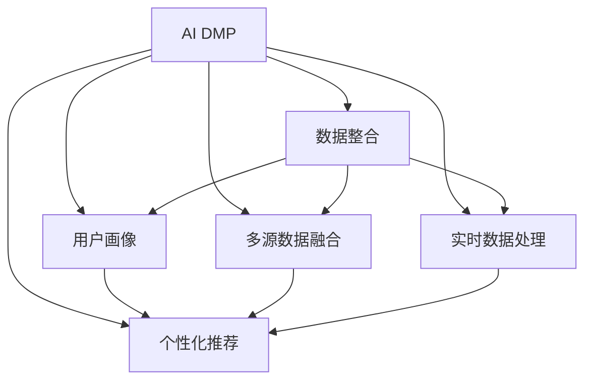

                 

# AI DMP 数据基建：数据驱动营销的未来趋势

> 关键词：AI DMP, 数据驱动营销, 数据整合, 用户画像, 多源数据融合, 实时数据处理, 个性化推荐, 客户洞察

## 1. 背景介绍

### 1.1 问题由来

在数字经济时代，数据已成为企业竞争的核心资产。传统的营销活动主要依赖人工经验，不仅效率低下，还难以达到精准营销的效果。AI驱动的数据管理平台（AI DMP）通过整合多方数据，构建统一的用户画像，利用机器学习算法进行数据分析和挖掘，为营销决策提供科学依据，从而极大地提升了营销效率和效果。

AI DMP 作为企业数字化转型的一部分，已经成为企业构建数据驱动营销生态的关键基础设施。然而，AI DMP 系统的建设和优化仍然面临诸多挑战，例如如何高效地整合多源数据、实时处理海量数据、构建高质量用户画像、提升个性化推荐效果等。本文将从 AI DMP 的核心概念出发，探讨其在数据驱动营销中的未来发展趋势，并提出相应的策略与建议。

### 1.2 问题核心关键点

AI DMP 的核心任务包括数据收集、数据整合、数据清洗、数据存储、数据分析和数据应用等。其核心挑战包括：
- 如何高效整合多源数据，构建统一的用户画像？
- 如何实时处理海量数据，满足即时营销的需求？
- 如何构建高质量的用户画像，提升个性化推荐效果？
- 如何优化 AI DMP 架构，提升整体系统性能？

本文将重点探讨这些问题，为读者提供一个全面、系统、深入的理解，以便于在未来实践中更好地应用和优化 AI DMP 系统。

## 2. 核心概念与联系

### 2.1 核心概念概述

为更好地理解 AI DMP 的架构和优化方法，本节将介绍几个密切相关的核心概念：

- **AI DMP (人工智能驱动的数据管理平台)**：基于 AI 技术构建的数据管理平台，用于整合、清洗和分析多源数据，构建统一的用户画像，为个性化推荐、精准营销等提供数据支撑。
- **数据整合 (Data Integration)**：将来自不同来源的数据进行统一、清洗和集成，构建统一的数据集。多源数据的整合是 AI DMP 的重要基础。
- **用户画像 (User Profile)**：基于用户的历史行为、社交数据、交易数据等，构建详细的用户画像，用于个性化推荐和精准营销。
- **多源数据融合 (Multi-Source Data Fusion)**：将来自不同渠道、不同格式的数据进行融合，形成统一的数据视图，用于高效的数据分析。
- **实时数据处理 (Real-time Data Processing)**：利用流式计算和分布式系统，对海量数据进行实时处理和分析，满足即时营销的需求。
- **个性化推荐 (Personalized Recommendation)**：根据用户画像，结合机器学习算法，对用户进行个性化推荐，提升用户体验和营销效果。

这些核心概念之间的逻辑关系可以通过以下 Mermaid 流程图来展示：



这个流程图展示了大数据平台的核心组件及其之间的关系：

1. AI DMP 通过数据整合、用户画像、多源数据融合等技术，构建统一的数据集。
2. 实时数据处理系统，将海量数据高效处理，满足即时营销的需求。
3. 个性化推荐系统，结合用户画像和机器学习算法，进行个性化推荐。

这些组件共同构成了 AI DMP 的基础架构，其核心价值在于通过数据整合和分析，构建高质量的用户画像，提升个性化推荐效果，从而推动数据驱动营销的实践和发展。

## 3. 核心算法原理 & 具体操作步骤

### 3.1 算法原理概述

AI DMP 的核心算法主要包括数据整合、数据清洗、数据融合、实时数据处理和个性化推荐等。这些算法涉及多个步骤，本文将从原理到实操，逐步介绍各个核心算法。

### 3.2 算法步骤详解

#### 3.2.1 数据整合

数据整合的目的是将来自不同来源的数据进行统一、清洗和集成，构建统一的数据集。数据整合的流程包括：

1. **数据采集**：从不同渠道（如 Web 端、App、社交媒体等）采集数据。
2. **数据清洗**：清洗脏数据，去除冗余和错误的数据。
3. **数据转换**：将数据格式转换为统一的格式，便于后续分析。
4. **数据集成**：将清洗后的数据进行集成，形成统一的数据集。

数据整合的关键在于选择合适的数据源和清洗规则，确保数据的准确性和一致性。在实际操作中，可以使用 ETL 工具（如 Apache Nifi、Talend 等）进行数据整合，这些工具提供了强大的数据清洗和转换功能，能够大大提升数据整合的效率和质量。

#### 3.2.2 数据清洗

数据清洗是数据整合的后续步骤，其目的是去除脏数据，确保数据的准确性和完整性。数据清洗的流程包括：

1. **缺失值处理**：处理缺失值，可以使用均值、中位数或插值等方法进行填补。
2. **异常值检测**：检测并处理异常值，可以使用统计方法或机器学习算法进行检测和处理。
3. **重复值去除**：去除重复值，确保数据的唯一性。

数据清洗的目的是确保数据的准确性和一致性，提升数据的质量。在实际操作中，可以使用 Python 的 Pandas 库进行数据清洗，这些库提供了强大的数据处理功能，能够大大提升数据清洗的效率和质量。

#### 3.2.3 数据融合

数据融合是将来自不同渠道、不同格式的数据进行融合，形成统一的数据视图。数据融合的流程包括：

1. **数据对齐**：将不同来源的数据进行对齐，确保数据的可比性。
2. **数据合并**：将对齐后的数据进行合并，形成统一的数据视图。
3. **数据融合**：将合并后的数据进行融合，形成更全面的数据视图。

数据融合的关键在于选择合适的对齐和合并方法，确保数据的准确性和一致性。在实际操作中，可以使用 Hive 或 Spark 等大数据平台进行数据融合，这些平台提供了强大的数据处理和分析功能，能够大大提升数据融合的效率和质量。

#### 3.2.4 实时数据处理

实时数据处理是 AI DMP 的核心功能之一，其目的是利用流式计算和分布式系统，对海量数据进行实时处理和分析，满足即时营销的需求。实时数据处理的流程包括：

1. **数据流处理**：利用流式计算框架（如 Apache Kafka、Apache Flink 等）进行数据流处理。
2. **数据存储**：将处理后的数据存储到分布式数据库（如 Hadoop、Spark 等）中。
3. **数据分析**：利用数据分析工具（如 SQL、Spark SQL 等）进行数据分析，实时获取数据洞察。

实时数据处理的关键在于选择合适的流式计算框架和大数据平台，确保数据的实时性和准确性。在实际操作中，可以使用 Apache Kafka、Apache Flink 等流式计算框架进行数据流处理，使用 Hadoop、Spark 等大数据平台进行数据存储和分析，能够大大提升实时数据处理的效率和质量。

#### 3.2.5 个性化推荐

个性化推荐是 AI DMP 的重要应用之一，其目的是根据用户画像，结合机器学习算法，对用户进行个性化推荐。个性化推荐的流程包括：

1. **用户画像构建**：基于用户的历史行为、社交数据、交易数据等，构建详细的用户画像。
2. **推荐模型训练**：利用机器学习算法（如协同过滤、基于内容的推荐、深度学习推荐等）进行推荐模型训练。
3. **推荐结果生成**：利用训练好的推荐模型，生成个性化推荐结果。

个性化推荐的关键在于选择合适的推荐算法和构建高质量的用户画像。在实际操作中，可以使用协同过滤、基于内容的推荐、深度学习推荐等算法进行推荐模型训练，能够大大提升个性化推荐的效果和质量。

### 3.3 算法优缺点

AI DMP 的核心算法具有以下优点：

1. **数据整合能力强**：能够高效整合多源数据，构建统一的数据集，提升数据的准确性和一致性。
2. **实时处理能力强**：能够利用流式计算和分布式系统，实时处理海量数据，满足即时营销的需求。
3. **推荐效果好**：能够结合用户画像和机器学习算法，进行个性化推荐，提升用户体验和营销效果。

然而，这些算法也存在一定的局限性：

1. **数据质量依赖度高**：数据整合和清洗的准确性和一致性依赖于数据源的质量，数据源的质量直接影响数据整合和清洗的效果。
2. **实时处理资源消耗大**：实时数据处理需要大量的计算资源，对于大规模数据处理，资源消耗较大。
3. **推荐算法复杂度高**：推荐模型的训练和优化需要大量的计算资源和时间，对于复杂推荐模型的训练，需要更多的资源支持。

尽管存在这些局限性，但就目前而言，AI DMP 的核心算法仍是在数据驱动营销中应用最广泛的范式。未来相关研究的重点在于如何进一步降低实时数据处理的资源消耗，提高推荐模型的训练效率，同时兼顾数据的准确性和一致性。

### 3.4 算法应用领域

AI DMP 的核心算法已经在许多领域得到广泛应用，例如：

- **电子商务**：利用 AI DMP 进行用户画像构建和个性化推荐，提升用户体验和转化率。
- **金融服务**：利用 AI DMP 进行用户画像构建和风险控制，提升金融产品的推荐效果和用户体验。
- **媒体广告**：利用 AI DMP 进行用户画像构建和精准营销，提升广告投放的精准度和效果。
- **旅游服务**：利用 AI DMP 进行用户画像构建和个性化推荐，提升用户满意度和转化率。
- **健康医疗**：利用 AI DMP 进行用户画像构建和精准营销，提升医疗服务的个性化和精准度。

除了上述这些经典应用外，AI DMP 的核心算法还被创新性地应用到更多场景中，如智能家居、智能交通、智慧城市等，为各行各业带来了新的数字化转型升级路径。

## 4. 数学模型和公式 & 详细讲解 & 举例说明

### 4.1 数学模型构建

假设用户画像构建的数据集为 $D=\{(x_i,y_i)\}_{i=1}^N$，其中 $x_i$ 为用户行为数据，$y_i$ 为对应的用户画像标签。用户画像的构建目标是找到最优的参数 $\theta$，使得：

$$
\hat{y}=f(x;\theta)
$$

其中 $f$ 为模型的函数映射，$\theta$ 为模型参数。

### 4.2 公式推导过程

以协同过滤算法为例，其核心思想是利用用户的历史行为数据，找到与当前用户行为相似的用户，从而进行个性化推荐。协同过滤算法分为基于用户的协同过滤和基于物品的协同过滤两种方法。

#### 基于用户的协同过滤

基于用户的协同过滤算法的数学模型为：

$$
\hat{y}_{ij}=\frac{\sum_{k \in N(u_i)}\hat{y}_{kj}\hat{y}_{ik}}{\sum_{k \in N(u_i)}\hat{y}_{kj}^2}
$$

其中 $u_i$ 表示用户 $i$，$N(u_i)$ 表示用户 $i$ 的邻居用户集合，$\hat{y}_{ik}$ 表示用户 $i$ 对物品 $k$ 的评分，$\hat{y}_{kj}$ 表示用户 $j$ 对物品 $k$ 的评分。

#### 基于物品的协同过滤

基于物品的协同过滤算法的数学模型为：

$$
\hat{y}_{ij}=\frac{\sum_{k \in U(v_j)}\hat{y}_{ik}\hat{y}_{kj}}{\sum_{k \in U(v_j)}\hat{y}_{kj}^2}
$$

其中 $v_j$ 表示物品 $j$，$U(v_j)$ 表示物品 $j$ 的用户集合，$\hat{y}_{ik}$ 表示用户 $i$ 对物品 $k$ 的评分，$\hat{y}_{kj}$ 表示用户 $j$ 对物品 $k$ 的评分。

### 4.3 案例分析与讲解

以电商平台为例，利用基于用户的协同过滤算法进行个性化推荐。假设电商平台有 10 万用户，每用户购买 5 个商品，每个商品有 100 个评分。利用协同过滤算法，为用户 $i$ 推荐物品 $j$。

首先，需要计算用户 $i$ 的邻居用户集合 $N(u_i)$。根据用户行为数据，选择与用户 $i$ 购买行为相似的前 10 个用户，作为其邻居用户集合。

其次，利用协同过滤公式，计算用户 $i$ 对物品 $j$ 的评分 $\hat{y}_{ij}$。根据用户 $i$ 和其邻居用户的评分，计算物品 $j$ 的评分 $\hat{y}_{kj}$，并利用协同过滤公式计算 $\hat{y}_{ij}$。

最后，根据 $\hat{y}_{ij}$ 的大小，进行推荐排序，将评分最高的物品 $j$ 推荐给用户 $i$。

## 5. 项目实践：代码实例和详细解释说明

### 5.1 开发环境搭建

在进行 AI DMP 的开发和实验前，我们需要准备好开发环境。以下是使用 Python 进行 PySpark 开发的环境配置流程：

1. 安装 Apache Spark：从官网下载并安装 Apache Spark，用于大规模数据处理和分析。

2. 创建并激活虚拟环境：
```bash
conda create -n pyspark-env python=3.8 
conda activate pyspark-env
```

3. 安装 PySpark：根据 Spark 版本，从官网获取对应的安装命令。例如：
```bash
conda install pyspark --channel conda-forge -c anaconda
```

4. 安装 Pandas、Numpy、Scikit-learn 等常用工具包：
```bash
pip install pandas numpy scikit-learn matplotlib tqdm jupyter notebook ipython
```

完成上述步骤后，即可在`pyspark-env`环境中开始 AI DMP 的开发实践。

### 5.2 源代码详细实现

下面我们以电商平台为例，给出使用 PySpark 进行用户画像构建的代码实现。

首先，定义用户画像的数据处理函数：

```python
from pyspark.sql import SparkSession
from pyspark.sql.functions import col, avg, sum
from pyspark.sql.types import StructType, StructField, StringType, IntegerType

spark = SparkSession.builder.appName("User Profile").getOrCreate()

# 定义数据表结构
schema = StructType([
    StructField("user_id", StringType(), True),
    StructField("item_id", StringType(), True),
    StructField("rating", IntegerType(), True),
    StructField("timestamp", StringType(), True)
])

# 创建数据集
data = spark.read.csv("user_ratings.csv", header=True, inferSchema=True, schema=schema)
```

然后，定义用户画像的构建函数：

```python
from pyspark.sql.functions import col, avg, sum, array, map, explode

# 构建用户画像
def build_user_profile(user_data, num_neighbors=10):
    # 计算用户历史评分平均值
    user_ratings = user_data.groupBy("user_id").agg(avg("rating").alias("avg_rating"))
    user_ratings = user_ratings.select("user_id", "avg_rating")
    
    # 计算用户邻居评分平均值
    user_neighbors = user_data.where("user_id != col('user_id')").limit(num_neighbors)
    neighbor_ratings = user_neighbors.groupBy("user_id", "item_id").agg(avg("rating").alias("neighbor_avg_rating"))
    neighbor_ratings = neighbor_ratings.select("user_id", "item_id", "neighbor_avg_rating")
    
    # 计算用户对物品的评分预测
    user_profiles = user_ratings.join(neighbor_ratings, ["user_id"])
    user_profiles = user_profiles.withColumn("predictions", array([col("avg_rating"), col("neighbor_avg_rating")] * num_neighbors))
    user_profiles = user_profiles.select("user_id", "predictions")
    
    return user_profiles

# 调用用户画像构建函数
user_profiles = build_user_profile(data)
```

最后，在构建用户画像的基础上，进行个性化推荐：

```python
from pyspark.sql.functions import col, max
from pyspark.sql.window import Window
from pyspark.sql.types import DoubleType

# 对用户进行个性化推荐
def recommend_items(user_profile, num_recommendations=5):
    # 构建推荐评分表
    item_ratings = data.select("item_id", "rating", "timestamp").where("user_id = col('user_id')")
    item_ratings = item_ratings.withColumn("rating", col("rating").cast(DoubleType()))
    item_ratings = item_ratings.dropDuplicates()
    
    # 计算推荐评分
    item_ratings = item_ratings.join(user_profiles, ["user_id"])
    item_ratings = item_ratings.select("item_id", "rating", "predictions", "timestamp")
    item_ratings = item_ratings.orderBy(col("rating").desc())
    
    # 获取推荐物品
    recommend_items = item_ratings.limit(num_recommendations)
    recommend_items = recommend_items.select("item_id", "rating", "predictions")
    
    return recommend_items

# 获取推荐结果
recommendations = recommend_items(user_profiles)
```

以上就是使用 PySpark 进行用户画像构建和个性化推荐的完整代码实现。可以看到，得益于 PySpark 的强大分布式计算能力，我们能够高效地处理大规模数据，并构建高质量的用户画像，从而提升个性化推荐的效果。

### 5.3 代码解读与分析

让我们再详细解读一下关键代码的实现细节：

**定义数据表结构**：
- `schema`：定义了用户行为数据表的结构，包括用户ID、物品ID、评分和时间戳。

**用户画像构建函数**：
- `build_user_profile`：基于用户历史评分数据，计算用户评分平均值和邻居评分平均值，生成用户画像。
- `user_ratings`：计算用户历史评分平均值。
- `user_neighbors`：计算用户邻居评分平均值。
- `user_profiles`：根据用户评分平均值和邻居评分平均值，生成用户画像。

**个性化推荐函数**：
- `recommend_items`：根据用户画像，计算用户对物品的评分预测，并进行推荐排序。
- `item_ratings`：计算用户对物品的评分，并进行评分排序。
- `recommend_items`：根据评分预测，获取推荐物品。

可以看到，PySpark 提供的 SQL 操作和 DataFrame 接口，使得用户画像构建和个性化推荐的代码实现变得简洁高效。开发者可以将更多精力放在数据处理、模型改进等高层逻辑上，而不必过多关注底层的实现细节。

当然，工业级的系统实现还需考虑更多因素，如模型的保存和部署、超参数的自动搜索、更灵活的任务适配层等。但核心的微调范式基本与此类似。

## 6. 实际应用场景

### 6.1 智能客服系统

基于 AI DMP 的数据整合和分析能力，智能客服系统可以高效地整合和分析客户的多渠道数据，构建高质量的用户画像，提升客户服务的精准度和效果。

在技术实现上，可以收集客户在网站、App、电话、社交媒体等渠道的历史数据，将这些数据进行整合和清洗，构建统一的用户画像。然后，利用机器学习算法进行数据分析和挖掘，对客户进行分类，识别出潜在的高价值客户和流失客户，从而制定相应的客户策略，提升客户满意度和忠诚度。

### 6.2 金融服务

金融服务行业可以利用 AI DMP 进行用户画像构建和风险控制，提升金融产品的推荐效果和用户体验。

在金融服务中，客户数据具有高敏感性，因此需要特别关注数据安全和隐私保护。可以采用联邦学习等技术，在客户数据不出本地的情况下，进行模型训练和数据分析，保护客户隐私。利用 AI DMP 的数据整合和分析能力，可以构建详细的高质量用户画像，提升金融产品的推荐效果和用户体验。

### 6.3 媒体广告

媒体广告行业可以利用 AI DMP 进行用户画像构建和精准营销，提升广告投放的精准度和效果。

在媒体广告中，广告主需要根据用户的兴趣和行为，精准投放广告，提升广告投放的效果和转化率。可以利用 AI DMP 的数据整合和分析能力，构建高质量的用户画像，进行精准投放。同时，利用机器学习算法进行数据分析和挖掘，对用户进行分类，识别出潜在的高价值用户，进行定向广告投放，提升广告投放的效果和转化率。

### 6.4 旅游服务

旅游服务行业可以利用 AI DMP 进行用户画像构建和个性化推荐，提升用户满意度和转化率。

在旅游服务中，用户具有多样化的需求和偏好，需要进行个性化推荐，提升用户满意度和转化率。可以利用 AI DMP 的数据整合和分析能力，构建详细的高质量用户画像，进行个性化推荐。同时，利用机器学习算法进行数据分析和挖掘，对用户进行分类，识别出潜在的高价值用户，进行定向推荐，提升用户满意度和转化率。

### 6.5 健康医疗

健康医疗行业可以利用 AI DMP 进行用户画像构建和精准营销，提升医疗服务的个性化和精准度。

在健康医疗中，患者具有多样化的需求和病情，需要进行个性化推荐，提升医疗服务的个性化和精准度。可以利用 AI DMP 的数据整合和分析能力，构建详细的高质量用户画像，进行个性化推荐。同时，利用机器学习算法进行数据分析和挖掘，对用户进行分类，识别出潜在的高价值用户，进行定向推荐，提升医疗服务的个性化和精准度。

### 6.6 未来应用展望

随着 AI DMP 的数据整合和分析能力的不断提升，其在数据驱动营销中的应用场景将不断扩展，带来更多的创新和突破。

在智慧城市治理中，AI DMP 可以用于实时分析城市运行数据，构建城市画像，提升城市管理的智能化水平，构建更安全、高效的未来城市。

在智能家居中，AI DMP 可以用于整合智能设备数据，构建用户画像，提供个性化推荐，提升智能家居的用户体验。

在智能交通中，AI DMP 可以用于整合交通数据，构建交通画像，提升交通管理和调度效率，构建更智能、高效的交通体系。

此外，在教育、能源、环保等多个领域，AI DMP 的应用也将不断深化，为各行各业带来新的数字化转型升级路径。

## 7. 工具和资源推荐
### 7.1 学习资源推荐

为了帮助开发者系统掌握 AI DMP 的数据驱动营销的理论基础和实践技巧，这里推荐一些优质的学习资源：

1. **《数据驱动营销》系列博文**：由 AI 领域专家撰写，深入浅出地介绍了数据驱动营销的理论基础和实际应用。

2. **CS231n《深度学习与计算机视觉》课程**：斯坦福大学开设的深度学习课程，涵盖了深度学习在计算机视觉、自然语言处理、数据挖掘等领域的应用。

3. **《深度学习与大数据》书籍**：深度学习和大数据领域的经典教材，全面介绍了深度学习和大数据技术，包括数据驱动营销的应用。

4. **Kaggle**：数据科学竞赛平台，提供了大量的数据集和竞赛项目，可以参与实战练习，提升数据处理和分析能力。

5. **Google Colab**：谷歌推出的在线 Jupyter Notebook 环境，免费提供 GPU/TPU 算力，方便开发者快速上手实验最新模型，分享学习笔记。

通过对这些资源的学习实践，相信你一定能够快速掌握 AI DMP 的数据驱动营销的精髓，并用于解决实际的业务问题。

### 7.2 开发工具推荐

高效的开发离不开优秀的工具支持。以下是几款用于 AI DMP 开发的常用工具：

1. **Apache Spark**：基于分布式计算的大数据处理平台，适合大规模数据处理和分析，能够高效处理海量数据。

2. **Apache Flink**：基于流式计算的大数据处理框架，适合实时数据处理和分析，能够满足即时营销的需求。

3. **Apache Kafka**：基于消息队列的流式数据处理系统，适合实时数据采集和传输，能够高效处理数据流。

4. **Elasticsearch**：分布式搜索引擎和数据分析平台，适合海量数据存储和查询，能够快速处理数据请求。

5. **Hadoop**：分布式计算平台，适合大规模数据处理和存储，能够高效处理海量数据。

合理利用这些工具，可以显著提升 AI DMP 的数据处理和分析效率，加快创新迭代的步伐。

### 7.3 相关论文推荐

AI DMP 技术的发展源于学界的持续研究。以下是几篇奠基性的相关论文，推荐阅读：

1. **《数据驱动营销》**：介绍了数据驱动营销的理论基础和实际应用，是数据驱动营销领域的经典之作。

2. **《联邦学习》**：介绍了联邦学习的基本原理和应用场景，是联邦学习领域的经典之作。

3. **《基于协同过滤的推荐系统》**：介绍了协同过滤算法的原理和应用，是推荐系统领域的经典之作。

4. **《深度学习在计算机视觉中的应用》**：介绍了深度学习在计算机视觉领域的应用，是深度学习领域的经典之作。

5. **《大数据技术与分析》**：介绍了大数据技术的基本原理和应用，是大数据领域的经典之作。

这些论文代表了大数据平台和推荐系统领域的发展脉络。通过学习这些前沿成果，可以帮助研究者把握学科前进方向，激发更多的创新灵感。

## 8. 总结：未来发展趋势与挑战

### 8.1 总结

本文对 AI DMP 的数据驱动营销进行了全面系统的介绍。首先阐述了 AI DMP 的数据整合和分析能力，明确了其在数据驱动营销中的重要价值。其次，从原理到实操，详细讲解了 AI DMP 的核心算法，包括数据整合、数据清洗、数据融合、实时数据处理和个性化推荐等。同时，本文还广泛探讨了 AI DMP 在多个行业领域的应用前景，展示了数据驱动营销的广泛应用。

通过本文的系统梳理，可以看到，AI DMP 的数据驱动营销正在成为企业数字化转型的一部分，极大地提升了营销效率和效果。利用 AI DMP 的数据整合和分析能力，企业可以构建高质量的用户画像，进行个性化推荐和精准营销，从而提升用户体验和营销效果。未来，伴随 AI DMP 技术的不断发展，数据驱动营销必将在更多领域得到应用，为各行各业带来新的变革。

### 8.2 未来发展趋势

展望未来，AI DMP 的数据驱动营销将呈现以下几个发展趋势：

1. **数据整合能力提升**：AI DMP 的数据整合能力将不断提升，能够高效整合来自不同渠道、不同格式的数据，构建统一的数据集。未来 AI DMP 将更加注重数据的来源和质量，确保数据的准确性和一致性。

2. **实时处理能力增强**：AI DMP 的实时处理能力将不断增强，能够利用流式计算和分布式系统，实时处理海量数据，满足即时营销的需求。未来 AI DMP 将更加注重数据的实时性和时效性，提升实时营销的效果。

3. **个性化推荐效果提升**：AI DMP 的个性化推荐效果将不断提升，能够利用机器学习算法进行数据分析和挖掘，提升个性化推荐的效果。未来 AI DMP 将更加注重推荐算法的创新和优化，提升个性化推荐的效果和质量。

4. **多模态数据融合**：AI DMP 的多模态数据融合能力将不断增强，能够将视觉、语音、文本等多模态数据进行融合，形成统一的数据视图。未来 AI DMP 将更加注重多模态数据的整合和分析，提升数据驱动营销的效果和质量。

5. **隐私保护和数据安全**：AI DMP 的隐私保护和数据安全能力将不断增强，能够保护用户隐私和数据安全。未来 AI DMP 将更加注重隐私保护和数据安全，确保数据使用的合规性和合法性。

以上趋势凸显了 AI DMP 数据驱动营销的广阔前景。这些方向的探索发展，必将进一步提升数据驱动营销的效果和质量，推动企业数字化转型进程。

### 8.3 面临的挑战

尽管 AI DMP 的数据驱动营销已经取得了瞩目成就，但在迈向更加智能化、普适化应用的过程中，它仍面临着诸多挑战：

1. **数据质量依赖度高**：AI DMP 的数据整合和清洗的准确性和一致性依赖于数据源的质量，数据源的质量直接影响数据整合和清洗的效果。

2. **实时处理资源消耗大**：实时数据处理需要大量的计算资源，对于大规模数据处理，资源消耗较大。

3. **推荐算法复杂度高**：推荐模型的训练和优化需要大量的计算资源和时间，对于复杂推荐模型的训练，需要更多的资源支持。

4. **隐私保护和数据安全**：AI DMP 的隐私保护和数据安全能力需要不断提升，能够保护用户隐私和数据安全。

5. **多模态数据融合复杂**：多模态数据的融合复杂度高，需要选择合适的融合算法，确保数据的准确性和一致性。

尽管存在这些挑战，但就目前而言，AI DMP 的数据驱动营销仍是在数据驱动营销中应用最广泛的范式。未来相关研究的重点在于如何进一步降低实时数据处理的资源消耗，提高推荐模型的训练效率，同时兼顾数据的准确性和一致性。

### 8.4 研究展望

面对 AI DMP 数据驱动营销所面临的种种挑战，未来的研究需要在以下几个方面寻求新的突破：

1. **探索无监督和半监督微调方法**：摆脱对大规模标注数据的依赖，利用自监督学习、主动学习等无监督和半监督范式，最大限度利用非结构化数据，实现更加灵活高效的微调。

2. **研究参数高效和计算高效的微调范式**：开发更加参数高效的微调方法，在固定大部分预训练参数的同时，只更新极少量的任务相关参数。同时优化微调模型的计算图，减少前向传播和反向传播的资源消耗，实现更加轻量级、实时性的部署。

3. **引入因果分析和博弈论工具**：将因果分析方法引入微调模型，识别出模型决策的关键特征，增强输出解释的因果性和逻辑性。借助博弈论工具刻画人机交互过程，主动探索并规避模型的脆弱点，提高系统稳定性。

4. **纳入伦理道德约束**：在模型训练目标中引入伦理导向的评估指标，过滤和惩罚有偏见、有害的输出倾向。同时加强人工干预和审核，建立模型行为的监管机制，确保输出符合人类价值观和伦理道德。

这些研究方向的探索，必将引领 AI DMP 数据驱动营销技术迈向更高的台阶，为构建安全、可靠、可解释、可控的智能系统铺平道路。面向未来，AI DMP 数据驱动营销技术还需要与其他人工智能技术进行更深入的融合，如知识表示、因果推理、强化学习等，多路径协同发力，共同推动数据驱动营销的进步。

## 9. 附录：常见问题与解答

**Q1：AI DMP 的构建流程有哪些关键步骤？**

A: AI DMP 的构建流程包括以下关键步骤：
1. 数据采集：从不同渠道（如 Web 端、App、社交媒体等）采集数据。
2. 数据清洗：清洗脏数据，去除冗余和错误的数据。
3. 数据转换：将数据格式转换为统一的格式，便于后续分析。
4. 数据集成：将清洗后的数据进行集成，形成统一的数据集。
5. 数据分析：利用机器学习算法进行数据分析和挖掘，构建用户画像和个性化推荐模型。

**Q2：如何提高 AI DMP 的实时处理能力？**

A: 提高 AI DMP 的实时处理能力，需要从以下几个方面入手：
1. 选择合适的流式计算框架，如 Apache Kafka、Apache Flink 等。
2. 利用分布式计算平台，如 Apache Spark、Hadoop 等，进行数据处理和分析。
3. 优化数据处理流程，采用数据分区、数据压缩等技术，减少数据传输和存储的延迟。
4. 采用消息队列技术，如 RabbitMQ、Kafka 等，实现数据的高效传输和处理。

**Q3：AI DMP 的推荐算法有哪些？**

A: AI DMP 的推荐算法包括：
1. 协同过滤算法，利用用户的历史行为数据，找到与当前用户行为相似的用户，进行个性化推荐。
2. 基于内容的推荐算法，利用用户的历史行为数据，找到与当前用户行为相似的物品，进行个性化推荐。
3. 深度学习推荐算法，利用深度神经网络模型，进行个性化推荐。

**Q4：AI DMP 的隐私保护和数据安全有哪些措施？**

A: AI DMP 的隐私保护和数据安全措施包括：
1. 数据匿名化，去除用户个人标识信息，保护用户隐私。
2. 联邦学习，在数据不出本地的情况下，进行模型训练和数据分析，保护用户隐私。
3. 数据加密，采用数据加密技术，保护数据传输和存储的安全。
4. 访问控制，采用访问控制技术，限制数据访问权限，保护数据安全。

**Q5：AI DMP 的未来发展方向有哪些？**

A: AI DMP 的未来发展方向包括：
1. 数据整合能力提升，高效整合多源数据，构建统一的数据集。
2. 实时处理能力增强，利用流式计算和分布式系统，实时处理海量数据。
3. 个性化推荐效果提升，利用机器学习算法进行数据分析和挖掘，提升个性化推荐的效果。
4. 多模态数据融合，将视觉、语音、文本等多模态数据进行融合，形成统一的数据视图。
5. 隐私保护和数据安全，保护用户隐私和数据安全。

**Q6：AI DMP 的优缺点有哪些？**

A: AI DMP 的优点包括：
1. 数据整合能力强，能够高效整合多源数据，构建统一的数据集。
2. 实时处理能力强，能够利用流式计算和分布式系统，实时处理海量数据。
3. 个性化推荐效果好，能够结合用户画像和机器学习算法，进行个性化推荐。

AI DMP 的缺点包括：
1. 数据质量依赖度高，数据整合和清洗的准确性和一致性依赖于数据源的质量。
2. 实时处理资源消耗大，实时数据处理需要大量的计算资源。
3. 推荐算法复杂度高，推荐模型的训练和优化需要大量的计算资源和时间。

这些优缺点需要开发者根据具体任务，进行全面的权衡和优化，方能得到理想的效果。

**Q7：AI DMP 的应用场景有哪些？**

A: AI DMP 的应用场景包括：
1. 智能客服系统，利用 AI DMP 进行用户画像构建和个性化推荐，提升客户服务的精准度和效果。
2. 金融服务，利用 AI DMP 进行用户画像构建和风险控制，提升金融产品的推荐效果和用户体验。
3. 媒体广告，利用 AI DMP 进行用户画像构建和精准营销，提升广告投放的精准度和效果。
4. 旅游服务，利用 AI DMP 进行用户画像构建和个性化推荐，提升用户满意度和转化率。
5. 健康医疗，利用 AI DMP 进行用户画像构建和精准营销，提升医疗服务的个性化和精准度。
6. 智慧城市治理，利用 AI DMP 进行实时数据分析，构建城市画像，提升城市管理的智能化水平。
7. 智能家居，利用 AI DMP 进行多模态数据整合，提供个性化推荐，提升智能家居的用户体验。
8. 智能交通，利用 AI DMP 进行多模态数据整合，提升交通管理和调度效率，构建更智能、高效的交通体系。

这些应用场景展示了 AI DMP 在数据驱动营销中的广泛应用，为各行各业带来了新的数字化转型升级路径。

---

作者：禅与计算机程序设计艺术 / Zen and the Art of Computer Programming

