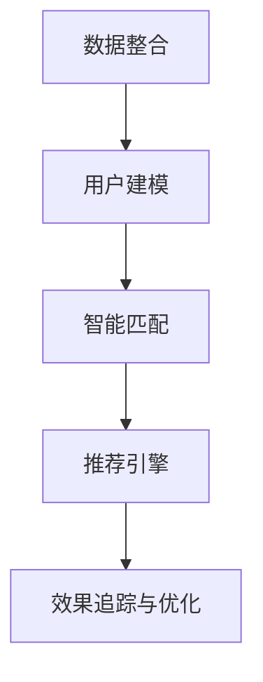

                 

# AI DMP 数据基建：赋能品牌营销的智慧

在数字化时代，品牌营销已从传统单一的媒体曝光转向多元化的用户互动和价值提升。借助AI驱动的数据管理平台（Data Management Platform, DMP），品牌能更精准地识别、理解用户行为，实现从触达到转化的全链路自动化营销，驱动用户增长与品牌价值提升。本文将系统介绍AI DMP的构建原理与应用实践，探讨其在品牌营销中的智慧赋能。

## 1. 背景介绍

### 1.1 问题由来
品牌营销在数字化转型中扮演着重要角色。传统品牌营销往往依赖单一的媒体曝光，缺乏对用户行为和偏好的深度理解，难以实现精准的个性化营销。近年来，随着数据的爆炸性增长，品牌开始将视角转向数据驱动的营销模式，通过挖掘用户行为数据，发现潜在价值用户，实现精准触达与转化。AI DMP作为数据驱动营销的核心工具，通过对海量用户数据的分析与建模，赋能品牌在复杂多变的网络环境中，精准定位用户，提升营销效果，驱动用户增长与品牌价值提升。

### 1.2 问题核心关键点
AI DMP的核心目标在于将多源异构数据高效整合与深度分析，构建用户全行为全景视图，通过智能标签体系和算法引擎，实现用户洞察和智能匹配，从而实现更精准、更高效的营销决策。其关键点包括：

- **数据采集与整合**：集成各种来源的用户数据（如行为数据、购买数据、社交数据等），构建用户全行为全景视图。
- **用户建模与标签体系**：利用机器学习与深度学习算法，对用户行为进行分析与建模，生成精细化的用户标签体系。
- **智能匹配与推荐**：基于用户标签与目标人群的匹配度，实现智能广告投放与个性化推荐。
- **效果追踪与优化**：通过追踪广告投放效果，实时调整策略，提升营销效果。

## 2. 核心概念与联系

### 2.1 核心概念概述
AI DMP的构建涉及多个核心概念，包括数据整合、用户建模、智能匹配、推荐与效果追踪等。

- **数据整合**：通过ETL（Extract, Transform, Load）技术，将多源异构数据进行采集、清洗与整合，构建统一的用户数据视图。
- **用户建模**：利用机器学习与深度学习算法，对用户行为进行分析与建模，生成精细化的用户标签体系。
- **智能匹配**：基于用户标签与目标人群的匹配度，实现智能广告投放与个性化推荐。
- **推荐引擎**：构建推荐系统，利用协同过滤、深度学习等算法，实现个性化推荐，提升用户转化率。
- **效果追踪与优化**：通过追踪广告投放效果，实时调整策略，提升营销效果。

这些核心概念之间的逻辑关系可以通过以下Mermaid流程图来展示：



这个流程图展示了大数据DMP的主要构成，帮助理解不同模块间的关系与协作。

## 3. 核心算法原理 & 具体操作步骤
### 3.1 算法原理概述
AI DMP的核心算法原理包括机器学习与深度学习算法，用于数据建模与分析，以及推荐算法，用于智能匹配与个性化推荐。

**数据整合与清洗**：采用ETL技术，将来自不同渠道的用户数据进行采集与清洗，整合到一个统一的数据仓库中。常用的清洗方法包括数据去重、异常值检测与处理、数据归一化等。

**用户建模**：利用机器学习与深度学习算法，对用户行为进行分析与建模，生成精细化的用户标签体系。常用的建模方法包括协同过滤、聚类算法、深度学习模型（如CTR模型、深度神经网络）等。

**智能匹配**：基于用户标签与目标人群的匹配度，实现智能广告投放与个性化推荐。常用的匹配算法包括基于内容的推荐、协同过滤推荐、深度学习推荐等。

**推荐引擎**：构建推荐系统，利用协同过滤、深度学习等算法，实现个性化推荐，提升用户转化率。常用的推荐算法包括基于内容的推荐、协同过滤推荐、深度学习推荐等。

**效果追踪与优化**：通过追踪广告投放效果，实时调整策略，提升营销效果。常用的追踪方法包括点击率（CTR）追踪、转化率追踪、A/B测试等。

### 3.2 算法步骤详解

AI DMP的构建流程包括以下关键步骤：

**Step 1: 数据采集与清洗**
- 收集不同来源的用户数据，包括行为数据、购买数据、社交数据等。
- 对数据进行ETL处理，包括数据清洗、去重、归一化等，确保数据质量。
- 将清洗后的数据整合到一个统一的数据仓库中，构建用户全行为全景视图。

**Step 2: 用户建模与标签体系**
- 利用机器学习与深度学习算法，对用户行为进行分析与建模，生成精细化的用户标签体系。
- 常用的算法包括协同过滤、聚类算法、深度神经网络等。
- 标签体系包括基本信息标签、行为标签、兴趣标签等，用于描述用户特征。

**Step 3: 智能匹配与推荐**
- 基于用户标签与目标人群的匹配度，实现智能广告投放与个性化推荐。
- 常用的匹配算法包括基于内容的推荐、协同过滤推荐、深度学习推荐等。
- 推荐算法可根据用户历史行为与偏好，预测其未来行为，实现精准推荐。

**Step 4: 效果追踪与优化**
- 通过追踪广告投放效果，实时调整策略，提升营销效果。
- 常用的追踪方法包括点击率（CTR）追踪、转化率追踪、A/B测试等。
- 根据追踪结果，优化投放策略，提升广告投放效果。

### 3.3 算法优缺点

AI DMP的算法具有以下优点：

- **高效整合数据**：通过ETL技术，高效整合多源异构数据，构建用户全行为全景视图。
- **精细化用户建模**：利用机器学习与深度学习算法，生成精细化的用户标签体系，提升用户洞察的准确性。
- **精准智能匹配**：基于用户标签与目标人群的匹配度，实现精准的广告投放与个性化推荐。
- **实时优化效果**：通过追踪广告投放效果，实时调整策略，提升营销效果。

同时，该算法也存在一定的局限性：

- **数据质量依赖**：算法的效果高度依赖于数据质量，数据清洗与整合过程中可能存在噪音与偏差。
- **模型复杂度高**：深度学习与机器学习算法模型复杂度较高，训练与部署成本较高。
- **实时性要求高**：推荐与投放策略需要实时调整，对系统的实时性要求较高。
- **计算资源消耗大**：深度学习算法需要大量的计算资源，系统需要高性能计算设备支持。

### 3.4 算法应用领域

AI DMP的核心算法被广泛应用于多个领域，包括但不限于以下几个：

- **品牌营销**：通过精准识别与理解用户行为，实现个性化推荐，提升品牌转化率。
- **广告投放**：基于用户标签与行为数据，实现智能广告投放，提升广告投放效果。
- **客户忠诚度管理**：利用用户行为数据，分析用户忠诚度与流失风险，制定相应的客户管理策略。
- **产品推荐**：通过个性化推荐引擎，提升产品推荐效果，增加用户粘性。
- **社交媒体分析**：利用社交媒体数据，分析用户行为与情感，制定社交媒体营销策略。

## 4. 数学模型和公式 & 详细讲解

### 4.1 数学模型构建

AI DMP的数据整合与用户建模涉及多个数学模型，包括协同过滤、聚类算法、深度神经网络等。

**协同过滤推荐模型**：

协同过滤是一种基于用户行为相似性的推荐算法，模型通过用户行为矩阵计算相似度，推荐与目标用户行为相似的用户喜欢的物品。设用户集合为 $U$，物品集合为 $I$，用户 $u$ 对物品 $i$ 的评分表示为 $r_{ui}$，协同过滤模型的推荐公式为：

$$
\hat{r}_{ui} = \frac{1}{N_u}\sum_{v \in U} r_{uv} \times \frac{1}{N_i}\sum_{j \in I} r_{vj} \times f_{ui} \times f_{uj}
$$

其中 $f_{ui}$ 和 $f_{uj}$ 为用户 $u$ 和 $j$ 的兴趣特征向量。

**聚类算法**：

聚类算法是一种基于数据相似性的用户建模方法，模型将用户分为若干个类别，每类用户具有相似的行为特征。常用的聚类算法包括K-Means、层次聚类、DBSCAN等。

K-Means算法的核心思想是将数据点划分到不同的聚类中心，使得同一类内的数据点相似度最大化，不同类间的相似度最小化。模型通过迭代优化聚类中心，直到收敛。设用户集合为 $U$，物品集合为 $I$，用户 $u$ 的特征向量表示为 $\mathbf{x}_u$，聚类算法的优化目标为：

$$
\min_{K,\mathbf{C}} \sum_{u \in U} \sum_{i \in I} (\mathbf{x}_u - \mathbf{c}_i)^2
$$

其中 $K$ 为聚类中心数，$\mathbf{C}$ 为聚类中心向量。

**深度神经网络**：

深度神经网络是一种基于神经网络结构的推荐算法，通过多层神经网络对用户行为进行建模，预测用户对物品的评分。常用的深度神经网络包括多层感知机（MLP）、卷积神经网络（CNN）、循环神经网络（RNN）等。

多层感知机模型通过多个全连接层对用户行为进行建模，设用户集合为 $U$，物品集合为 $I$，用户 $u$ 的特征向量表示为 $\mathbf{x}_u$，物品 $i$ 的特征向量表示为 $\mathbf{x}_i$，模型的推荐公式为：

$$
\hat{r}_{ui} = \sigma(\mathbf{W}^1 \mathbf{x}_u + \mathbf{b}_1)^\top \mathbf{W}^2 \mathbf{x}_i + \mathbf{b}_2
$$

其中 $\mathbf{W}^1$ 和 $\mathbf{W}^2$ 为权重矩阵，$\mathbf{b}_1$ 和 $\mathbf{b}_2$ 为偏置向量，$\sigma$ 为激活函数。

### 4.2 公式推导过程

上述公式展示了协同过滤、聚类算法与深度神经网络模型的基本思想。这些模型通过不同的数据处理与优化方法，实现对用户行为的多层次建模与分析。通过合理选择与组合这些模型，可以实现对用户行为的全面刻画与理解。

### 4.3 案例分析与讲解

以基于协同过滤推荐模型的应用为例，展示其具体实现过程：

假设有一个电商网站，用户 $u$ 对物品 $i$ 的评分表示为 $r_{ui}$，通过协同过滤推荐模型，计算用户 $u$ 对物品 $j$ 的预测评分 $\hat{r}_{uj}$，步骤如下：

1. 计算用户 $u$ 与用户 $v$ 的相似度 $s_{uv}$。
2. 计算物品 $i$ 与物品 $j$ 的相似度 $s_{ij}$。
3. 计算用户 $u$ 对物品 $j$ 的预测评分 $\hat{r}_{uj}$。

具体的计算公式如下：

$$
s_{uv} = \frac{\sum_{i \in I} r_{ui} \times r_{vi}}{\sqrt{\sum_{i \in I} r_{ui}^2} \times \sqrt{\sum_{i \in I} r_{vi}^2}}
$$

$$
s_{ij} = \frac{\sum_{u \in U} r_{ui} \times r_{uj}}{\sqrt{\sum_{u \in U} r_{ui}^2} \times \sqrt{\sum_{u \in U} r_{uj}^2}}
$$

$$
\hat{r}_{uj} = \frac{1}{N_u}\sum_{v \in U} s_{uv} \times s_{vj}
$$

在实际应用中，这些模型需要根据具体场景进行优化与调整，以实现更好的效果。

## 5. 项目实践：代码实例和详细解释说明

### 5.1 开发环境搭建

在进行AI DMP的开发实践前，我们需要准备好开发环境。以下是使用Python进行TensorFlow开发的环境配置流程：

1. 安装Anaconda：从官网下载并安装Anaconda，用于创建独立的Python环境。

2. 创建并激活虚拟环境：
```bash
conda create -n tf-env python=3.8 
conda activate tf-env
```

3. 安装TensorFlow：根据CUDA版本，从官网获取对应的安装命令。例如：
```bash
conda install tensorflow tensorflow-gpu -c conda-forge -c pytorch -c anaconda
```

4. 安装各类工具包：
```bash
pip install numpy pandas scikit-learn matplotlib tqdm jupyter notebook ipython
```

完成上述步骤后，即可在`tf-env`环境中开始AI DMP的实践。

### 5.2 源代码详细实现

下面以协同过滤推荐模型为例，给出使用TensorFlow进行AI DMP代码实现。

首先，定义协同过滤推荐模型的输入与输出：

```python
import tensorflow as tf

def collaborative_filtering_model(tf_data):
    # 输入数据
    user_ids, item_ids, ratings = tf_data['user_id'], tf_data['item_id'], tf_data['rating']
    
    # 定义模型结构
    user_vec_size = 100
    item_vec_size = 100
    
    # 用户特征向量
    user_embeddings = tf.keras.layers.Embedding(user_ids.shape[0], user_vec_size, input_length=1)(user_ids)
    
    # 物品特征向量
    item_embeddings = tf.keras.layers.Embedding(item_ids.shape[0], item_vec_size, input_length=1)(item_ids)
    
    # 协同过滤模型
    prediction = tf.keras.layers.Dot(axes=1, normalize=True, arr1=user_embeddings, arr2=item_embeddings) * tf.keras.layers.Dense(1, activation='sigmoid')(tf.keras.layers.Flatten(item_embeddings))
    
    return prediction
```

然后，定义模型的损失函数与优化器：

```python
# 定义损失函数
def loss_function(y_true, y_pred):
    return tf.keras.losses.MeanSquaredError()(y_true, y_pred)

# 定义优化器
optimizer = tf.keras.optimizers.Adam(learning_rate=0.001)

# 定义训练函数
def train_model(model, train_data, epochs):
    for epoch in range(epochs):
        for batch in train_data:
            # 定义训练数据
            user_ids, item_ids, ratings = batch['user_id'], batch['item_id'], batch['rating']
            
            # 定义预测结果
            y_true = tf.reshape(tf.convert_to_tensor(ratings), (user_ids.shape[0], 1))
            y_pred = model(user_ids)
            
            # 计算损失函数
            loss = loss_function(y_true, y_pred)
            
            # 反向传播
            with tf.GradientTape() as tape:
                grads = tape.gradient(loss, model.trainable_variables)
            optimizer.apply_gradients(zip(grads, model.trainable_variables))
```

最后，启动训练流程并在测试集上评估：

```python
# 加载数据
train_data = tf_dataset.load_data('train.csv')
test_data = tf_dataset.load_data('test.csv')

# 训练模型
model = collaborative_filtering_model(train_data)
train_model(model, train_data, epochs=10)

# 评估模型
test_data = tf_dataset.load_data('test.csv')
y_true = tf.convert_to_tensor(test_data['rating'])
y_pred = model(test_data['user_id'])
print('Test Loss:', loss_function(y_true, y_pred).numpy())
```

以上就是使用TensorFlow进行协同过滤推荐模型的完整代码实现。可以看到，通过TensorFlow的强大封装能力，我们可以用相对简洁的代码实现复杂的推荐模型。

### 5.3 代码解读与分析

让我们再详细解读一下关键代码的实现细节：

** collaborative_filtering_model函数**：
- 输入数据包括用户ID、物品ID和评分。
- 定义用户特征向量和物品特征向量，使用Embedding层将ID映射到低维向量空间。
- 使用TensorFlow的Dot产品计算用户-物品向量内积，得到预测评分。
- 使用Flatten层将物品特征向量展平，最后通过Dense层输出预测结果。

** loss_function函数**：
- 定义均方误差损失函数，用于计算预测评分与真实评分之间的误差。

** train_model函数**：
- 定义训练函数，通过梯度下降算法不断更新模型参数。
- 在每个epoch内，对训练集进行批处理，计算损失并反向传播更新参数。

**训练流程**：
- 加载训练集和测试集数据。
- 初始化协同过滤推荐模型。
- 训练模型，设置epoch数与batch大小。
- 在测试集上评估模型，输出测试集损失。

可以看到，TensorFlow提供了完整的深度学习框架，便于开发者高效构建与训练复杂的AI DMP模型。

## 6. 实际应用场景

### 6.1 智能推荐系统

AI DMP的核心算法在智能推荐系统中的应用最为广泛。通过协同过滤、深度学习等算法，AI DMP可以分析用户行为，预测用户偏好，实现个性化推荐。在电商平台、视频平台、音乐平台等场景中，AI DMP通过推荐引擎，向用户推荐其可能感兴趣的商品、视频、音乐等，提升用户满意度和留存率。

### 6.2 广告投放优化

AI DMP的智能匹配算法在广告投放优化中也有广泛应用。通过用户标签与广告特征的匹配度，AI DMP可以实现智能广告投放，确保广告精准触达目标人群。在搜索引擎、社交媒体、移动应用等平台上，AI DMP通过智能匹配算法，优化广告投放策略，提升广告点击率和转化率，最大化广告投放效果。

### 6.3 用户行为分析

AI DMP的智能匹配与推荐算法，可以帮助品牌更好地理解用户行为，提升用户转化率和忠诚度。通过分析用户行为数据，AI DMP可以发现用户的兴趣点、消费习惯等信息，制定精准的营销策略。在在线教育、在线旅游、医疗健康等高客单价行业，AI DMP通过用户行为分析，提升用户转化率和留存率，助力品牌增长。

### 6.4 未来应用展望

随着AI DMP技术的不断进步，其在品牌营销中的应用将更加广泛与深入。未来，AI DMP将实现以下几个方面的突破：

1. **跨平台数据整合**：AI DMP将实现多平台数据整合，打破数据孤岛，提供完整的用户行为全景视图。
2. **深度学习算法优化**：AI DMP将引入更多深度学习算法，提升用户建模的准确性，实现更精准的个性化推荐。
3. **实时数据分析与优化**：AI DMP将实现实时数据分析与优化，支持即时调整营销策略，提升广告投放效果。
4. **隐私保护与伦理保障**：AI DMP将引入隐私保护与伦理保障机制，确保用户数据安全与合法使用。
5. **多模态数据融合**：AI DMP将引入多模态数据融合技术，实现视觉、语音、文本等数据的协同建模，提升用户洞察的深度与广度。

## 7. 工具和资源推荐
### 7.1 学习资源推荐

为了帮助开发者系统掌握AI DMP的理论基础和实践技巧，这里推荐一些优质的学习资源：

1. 《Deep Learning》书籍：Ian Goodfellow等人编写，全面介绍了深度学习的基础理论、算法与实践应用。

2. 《Python Machine Learning》书籍：Sebastian Raschka等人编写，介绍Python在机器学习与数据科学中的应用。

3. 《Hands-On Machine Learning with Scikit-Learn and TensorFlow》书籍：Aurélien Géron编写，深入浅出地介绍了Scikit-Learn与TensorFlow在数据科学中的应用。

4. 《AI DMP》系列博客：Hugging Face官方博客，涵盖AI DMP的基本概念、算法与实践应用。

5. Coursera《Machine Learning》课程：由Andrew Ng教授主讲的经典机器学习课程，覆盖机器学习的基础理论与算法。

通过这些学习资源，相信你一定能够快速掌握AI DMP的精髓，并用于解决实际的AI DMP问题。

### 7.2 开发工具推荐

高效的开发离不开优秀的工具支持。以下是几款用于AI DMP开发的常用工具：

1. TensorFlow：由Google主导开发的开源深度学习框架，生产部署方便，适合大规模工程应用。

2. PyTorch：基于Python的开源深度学习框架，灵活高效，适合快速迭代研究。

3. Scikit-Learn：Python的机器学习库，涵盖各种机器学习算法与模型，便于模型实现与调优。

4. H2O：商业化的机器学习平台，提供丰富的算法与工具，支持多种数据源与部署环境。

5. RapidMiner：数据科学平台，提供可视化建模工具，便于数据探索与分析。

合理利用这些工具，可以显著提升AI DMP开发的效率，加快创新迭代的步伐。

### 7.3 相关论文推荐

AI DMP技术的发展源于学界的持续研究。以下是几篇奠基性的相关论文，推荐阅读：

1. Hofmann, T. (2001). "Clustering by Passing Messages Between Data Points". Machine Learning Journal.

2. K-means++: The Advantages of Careful Seedings. （Arthur, David, & Vassilvitskii, Sergei.） (2007).

3. He, Kaiming, et al. (2015). "Delving deep into rectifiers: Surpassing human-level performance on ImageNet classification." Proceedings of the IEEE international conference on computer vision (ICCV).

4. Deep recurrent neural networks for sequential data: A review, surveys, and future perspectives. （Zhang, Bo, et al.） (2018).

这些论文代表了大数据DMP技术的发展脉络。通过学习这些前沿成果，可以帮助研究者把握学科前进方向，激发更多的创新灵感。

## 8. 总结：未来发展趋势与挑战

### 8.1 总结

本文对AI DMP的构建原理与应用实践进行了全面系统的介绍。首先阐述了AI DMP的背景与核心目标，明确了其在品牌营销中的重要价值。其次，从原理到实践，详细讲解了AI DMP的数学模型与关键步骤，给出了AI DMP的完整代码实例。同时，本文还广泛探讨了AI DMP在推荐系统、广告投放、用户行为分析等多个行业领域的应用前景，展示了其广阔的应用场景。最后，本文精选了AI DMP的学习资源、开发工具与相关论文，力求为开发者提供全方位的技术指引。

通过本文的系统梳理，可以看到，AI DMP技术在品牌营销中的应用前景广阔，能够实现精准的个性化推荐与智能广告投放，驱动用户增长与品牌价值提升。随着技术不断进步，AI DMP必将在更多领域大放异彩，赋能更多品牌打造智慧营销。

### 8.2 未来发展趋势

展望未来，AI DMP技术将呈现以下几个发展趋势：

1. **数据整合与分析**：AI DMP将实现多平台数据整合，打破数据孤岛，提供完整的用户行为全景视图，实现数据驱动的智能决策。

2. **深度学习算法优化**：AI DMP将引入更多深度学习算法，提升用户建模的准确性，实现更精准的个性化推荐与智能匹配。

3. **实时数据分析与优化**：AI DMP将实现实时数据分析与优化，支持即时调整营销策略，提升广告投放效果。

4. **隐私保护与伦理保障**：AI DMP将引入隐私保护与伦理保障机制，确保用户数据安全与合法使用，保障品牌信誉。

5. **多模态数据融合**：AI DMP将引入多模态数据融合技术，实现视觉、语音、文本等数据的协同建模，提升用户洞察的深度与广度。

这些趋势凸显了AI DMP技术在品牌营销中的巨大潜力，为品牌带来更精准、更高效的营销效果。随着技术的不断演进，AI DMP必将在更多领域得到广泛应用，驱动品牌营销向智慧化、自动化方向迈进。

### 8.3 面临的挑战

尽管AI DMP技术已经取得了一定的成果，但在迈向智能化、自动化应用的过程中，仍面临诸多挑战：

1. **数据隐私与安全**：AI DMP的构建高度依赖用户数据，如何保护用户隐私与安全，避免数据泄露，仍需加强技术与管理措施。

2. **模型复杂性与可解释性**：AI DMP的模型复杂度较高，如何提升模型的可解释性，解释其内部工作机制，是未来需要重点解决的问题。

3. **实时性要求高**：AI DMP的推荐与投放策略需要实时调整，对系统的实时性要求较高，如何优化系统架构，提升响应速度，是亟待攻克的难题。

4. **算法优化与迭代**：AI DMP的算法模型需要不断优化与迭代，以应对复杂多变的市场环境，如何高效开发与迭代算法模型，是技术研发的关键。

5. **跨领域应用难度**：AI DMP在不同领域的应用具有一定差异，如何构建通用的AI DMP框架，适应不同领域的营销需求，是未来研究的重要方向。

6. **伦理与法律合规**：AI DMP在品牌营销中的应用涉及隐私保护、数据使用等伦理与法律问题，如何在技术开发过程中合规合法，是未来需要考虑的关键因素。

这些挑战将推动AI DMP技术的不断进步，推动其在品牌营销中的应用更加广泛与深入。

### 8.4 研究展望

面对AI DMP技术面临的挑战，未来的研究需要在以下几个方面寻求新的突破：

1. **隐私保护与伦理保障**：引入隐私保护技术，如差分隐私、联邦学习等，确保用户数据安全与合法使用。同时加强数据使用的伦理审查，确保符合法律法规要求。

2. **可解释性与透明性**：引入可解释性算法，如LIME、SHAP等，提升AI DMP模型的透明性与可解释性，便于用户理解与接受。

3. **实时性与扩展性**：优化系统架构，引入流式处理技术，提升AI DMP的实时性与扩展性，适应快速变化的市场环境。

4. **算法优化与迭代**：引入高效算法与模型压缩技术，提升AI DMP的训练与推理效率，降低资源消耗。

5. **跨领域应用能力**：构建通用的AI DMP框架，适应不同领域的营销需求，提升AI DMP的泛化性与通用性。

这些研究方向的探索，将引领AI DMP技术迈向更高的台阶，为品牌营销带来更智慧、更高效的解决方案。面向未来，AI DMP技术需要与其他人工智能技术进行更深入的融合，如知识表示、因果推理、强化学习等，多路径协同发力，共同推动品牌营销向智慧化、自动化方向迈进。

## 9. 附录：常见问题与解答

**Q1：AI DMP是否适用于所有品牌营销场景？**

A: AI DMP在大多数品牌营销场景中都能取得不错的效果，但对于一些特定领域，如医疗、法律等，AI DMP可能需要进一步优化才能适应。例如，医疗领域的数据通常涉及隐私保护，需要在数据处理过程中遵循相关法律法规。

**Q2：如何优化AI DMP的推荐算法？**

A: AI DMP的推荐算法可以根据具体场景进行优化与调整，常用的优化方法包括：
1. 引入更多特征与维度：通过增加用户行为、兴趣标签、商品属性等特征，提升推荐效果。
2. 引入上下文信息：在推荐模型中加入上下文信息，如时间、地点、设备等，提升推荐的相关性与个性化。
3. 实时调整模型参数：根据用户反馈与行为数据，实时调整推荐模型，提升推荐效果。
4. 引入个性化推荐模型：如协同过滤、深度学习等算法，提升推荐系统的性能与用户体验。

**Q3：AI DMP在多模态数据融合中的应用前景如何？**

A: 多模态数据融合是AI DMP技术的一个重要方向，通过融合视觉、语音、文本等多模态数据，可以提升用户洞察的深度与广度，实现更加全面、精准的推荐与广告投放。例如，在视频推荐系统中，通过融合视频内容、用户行为与社交数据，可以实现更加智能化的推荐与广告投放。

**Q4：AI DMP如何保护用户隐私与安全？**

A: AI DMP的隐私保护与数据安全至关重要，常用的保护措施包括：
1. 数据匿名化与差分隐私：通过对数据进行匿名化处理，确保用户隐私不被泄露。引入差分隐私技术，保护用户隐私安全。
2. 联邦学习：通过分布式训练，将模型参数更新在不同设备上，保护用户数据隐私。
3. 数据加密与传输安全：采用加密技术，确保数据传输过程中的安全。

**Q5：AI DMP的未来发展方向是什么？**

A: AI DMP的未来发展方向主要包括以下几个方面：
1. 数据整合与分析：实现多平台数据整合，提供完整的用户行为全景视图。
2. 深度学习算法优化：引入更多深度学习算法，提升用户建模的准确性，实现更精准的个性化推荐与智能匹配。
3. 实时数据分析与优化：实现实时数据分析与优化，支持即时调整营销策略，提升广告投放效果。
4. 隐私保护与伦理保障：引入隐私保护技术，确保用户数据安全与合法使用。
5. 多模态数据融合：实现视觉、语音、文本等数据的协同建模，提升用户洞察的深度与广度。

这些方向将推动AI DMP技术不断进步，为品牌营销带来更智慧、更高效的解决方案。

---

作者：禅与计算机程序设计艺术 / Zen and the Art of Computer Programming

