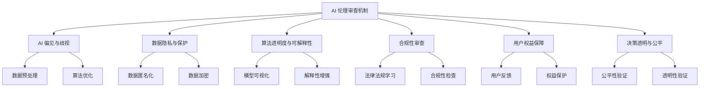

                 

# AI 伦理审查机制：确保 AI 2.0 技术的负责任使用

## 1. 背景介绍

随着人工智能技术的飞速发展，AI 2.0 时代已经到来。AI 技术的广泛应用，极大地提升了生产效率和生活质量，也带来了前所未有的机遇和挑战。然而，随着 AI 技术的深入应用，伦理问题、偏见歧视、隐私泄露等风险也逐渐凸显。为确保 AI 技术的安全、可靠、负责任使用，构建 AI 伦理审查机制显得尤为必要。本文将从背景、核心概念、核心算法、实际应用、资源推荐和总结展望等多个方面，对 AI 伦理审查机制进行详细阐述。

## 2. 核心概念与联系

### 2.1 核心概念概述

**AI 伦理审查机制**：一套全面、科学、系统的审查框架，旨在确保 AI 技术的开发、部署和使用过程中，遵循伦理原则、法律法规，保障数据隐私、算法公平，促进技术安全、透明、可信。

**AI 偏见与歧视**：AI 模型在训练和应用过程中，由于数据偏见、算法缺陷等原因，可能导致输出结果存在歧视性，如性别、种族、年龄、地域等方面的歧视。

**数据隐私与保护**：在 AI 应用中，涉及大量个人敏感信息，如何保护这些信息，防止数据滥用和泄露，是一个重要问题。

**算法透明度与可解释性**：AI 模型的决策过程通常是“黑箱”，缺乏透明度和可解释性，如何设计可解释模型，提高决策透明度，是 AI 伦理审查的关键内容。

**合规性审查**：确保 AI 应用符合相关法律法规，如欧盟《通用数据保护条例》(GDPR)、《中国数据安全法》等，保障用户权益。

**用户权益保障**：在 AI 应用中，如何保障用户知情权、同意权、选择权等权益，避免对用户权益的侵害，是伦理审查的重要目标。

### 2.2 核心概念联系与结构图

以下是一个 Mermaid 流程图，展示了 AI 伦理审查机制与核心概念之间的联系：



这个流程图展示了 AI 伦理审查机制与核心概念的联系，通过多个维度，确保 AI 技术在开发、部署和使用中的安全、合规和负责任。

## 3. 核心算法原理 & 具体操作步骤

### 3.1 算法原理概述

AI 伦理审查机制的核心算法主要包括数据预处理、算法优化、合规性审查、用户权益保障等。这些算法共同构成了一套全面的审查框架，确保 AI 技术的负责任使用。

### 3.2 算法步骤详解

#### 3.2.1 数据预处理

**数据清洗**：通过数据清洗技术，去除异常值、噪声数据等，确保数据质量和一致性。

**数据匿名化**：对敏感数据进行去标识化处理，防止数据泄露和滥用。

**数据加密**：对敏感数据进行加密存储和传输，确保数据隐私。

#### 3.2.2 算法优化

**模型选择与优化**：根据任务特点选择合适的模型架构，并对其进行优化，如减少模型复杂度、增加正则化等。

**偏见检测与缓解**：通过统计分析、模型诊断等技术，检测 AI 模型中的偏见与歧视，并采取措施进行缓解。

**算法透明性与可解释性**：通过可解释性模型设计、模型可视化、特征重要性分析等方法，提升算法的透明性与可解释性。

#### 3.2.3 合规性审查

**法律法规学习**：通过自然语言处理技术，学习和理解相关法律法规，确保 AI 应用符合法律法规要求。

**合规性检查**：对 AI 应用进行合规性审查，确保符合法律法规、行业标准和道德规范。

#### 3.2.4 用户权益保障

**用户反馈与投诉处理**：建立用户反馈和投诉机制，及时处理用户投诉，保障用户权益。

**隐私保护与知情同意**：确保用户知情权、同意权等权益，防止数据滥用和隐私泄露。

#### 3.2.5 决策透明与公平

**公平性验证**：通过公平性检测和评估，确保 AI 模型输出结果的公平性和一致性。

**透明性验证**：通过透明度评估和验证，确保 AI 决策过程的透明性和可解释性。

### 3.3 算法优缺点

**优点**：

1. **全面性**：综合考虑数据隐私、算法公平、用户权益等多个方面，全面保障 AI 技术的负责任使用。
2. **可操作性**：提供了具体的操作步骤和方法，便于实际应用。
3. **灵活性**：可以根据具体情况进行调整和优化。

**缺点**：

1. **复杂性**：涉及多个领域的知识和技术，实施难度较大。
2. **成本高**：实施伦理审查需要投入大量人力物力。

### 3.4 算法应用领域

AI 伦理审查机制在多个领域都有广泛应用，如医疗、金融、智能安防、智能客服等。

- **医疗领域**：确保 AI 诊断和治疗工具的公平性和透明性，保障患者隐私和权益。
- **金融领域**：保障 AI 信用评分和风险评估的公平性和透明性，防止数据滥用和歧视。
- **智能安防**：确保 AI 监控和识别系统的公平性和透明性，防止误报和隐私侵害。
- **智能客服**：保障 AI 客服系统的用户权益和隐私保护，提高用户满意度。

## 4. 数学模型和公式 & 详细讲解 & 举例说明

### 4.1 数学模型构建

**数据预处理模型**：

数据清洗模型：
$$
\text{cleaned\_data} = \text{clean}(\text{raw\_data})
$$

数据匿名化模型：
$$
\text{anonymized\_data} = \text{anonymize}(\text{sensitive\_data})
$$

数据加密模型：
$$
\text{encrypted\_data} = \text{encrypt}(\text{data})
$$

**算法优化模型**：

模型选择模型：
$$
\text{model\_choose} = \text{choose\_model}(\text{task\_type}, \text{data\_type}, \text{device\_type})
$$

算法优化模型：
$$
\text{optimized\_model} = \text{optimize}(\text{base\_model}, \text{objective\_function}, \text{optimization\_algorithm}, \text{regularization\_term})
$$

**合规性审查模型**：

法律法规学习模型：
$$
\text{compliance\_rule} = \text{learn\_rule}(\text{law\_document}, \text{law\_id})
$$

合规性检查模型：
$$
\text{check\_compliance} = \text{check}(\text{application\_features}, \text{compliance\_rule})
$$

**用户权益保障模型**：

用户反馈模型：
$$
\text{user\_feedback} = \text{collect\_feedback}(\text{user\_interaction})
$$

用户投诉处理模型：
$$
\text{complaint\_handle} = \text{handle\_complaint}(\text{user\_feedback}, \text{complaint\_record})
$$

**决策透明与公平模型**：

公平性验证模型：
$$
\text{fairness\_check} = \text{check\_fairness}(\text{model\_output}, \text{test\_set})
$$

透明性验证模型：
$$
\text{transparency\_check} = \text{check\_transparency}(\text{model\_decision}, \text{test\_case})
$$

### 4.2 公式推导过程

**数据清洗**：
$$
\text{cleaned\_data} = \text{clean}(\text{raw\_data}) = \text{remove\_outliers}(\text{raw\_data}) + \text{correct\_errors}(\text{raw\_data})
$$

**数据匿名化**：
$$
\text{anonymized\_data} = \text{anonymize}(\text{sensitive\_data}) = \text{remove\_identification\_info}(\text{sensitive\_data}) + \text{add\_fictitious\_info}(\text{sensitive\_data})
$$

**数据加密**：
$$
\text{encrypted\_data} = \text{encrypt}(\text{data}) = \text{encode}(\text{data}, \text{key})
$$

**算法优化**：
$$
\text{optimized\_model} = \text{optimize}(\text{base\_model}, \text{objective\_function}, \text{optimization\_algorithm}, \text{regularization\_term}) = \text{minimize\_objective}(\text{base\_model}, \text{objective\_function}, \text{optimization\_algorithm}, \text{regularization\_term})
$$

**合规性检查**：
$$
\text{check\_compliance} = \text{check}(\text{application\_features}, \text{compliance\_rule}) = \text{compare}(\text{application\_features}, \text{compliance\_rule})
$$

**公平性验证**：
$$
\text{fairness\_check} = \text{check\_fairness}(\text{model\_output}, \text{test\_set}) = \text{calculate\_disparity}(\text{model\_output}, \text{test\_set})
$$

**透明性验证**：
$$
\text{transparency\_check} = \text{check\_transparency}(\text{model\_decision}, \text{test\_case}) = \text{analyze}(\text{model\_decision}, \text{test\_case})
$$

### 4.3 案例分析与讲解

**案例一：医疗领域 AI 伦理审查**

在医疗领域，AI 应用涉及大量患者隐私数据，如病历、基因数据等。如何确保这些数据的安全和隐私保护，是一个重要问题。

- **数据预处理**：对敏感病历数据进行去标识化处理，防止数据泄露。
- **算法优化**：选择适合医疗诊断的深度学习模型，并进行优化，提高诊断准确性。
- **合规性审查**：确保 AI 应用符合《中国数据安全法》等相关法律法规，保障患者权益。
- **用户权益保障**：确保患者知情权、同意权，防止数据滥用。

**案例二：金融领域 AI 伦理审查**

在金融领域，AI 应用涉及大量用户敏感数据，如信用评分、贷款申请等。如何确保这些数据的公平性、透明性和合规性，是一个重要问题。

- **数据预处理**：对敏感数据进行匿名化处理，防止数据滥用。
- **算法优化**：选择适合信用评分的模型，并进行优化，提高评分准确性。
- **合规性审查**：确保 AI 应用符合《通用数据保护条例》(GDPR)等相关法律法规，保障用户权益。
- **用户权益保障**：确保用户知情权、同意权，防止数据滥用。

## 5. 项目实践：代码实例和详细解释说明

### 5.1 开发环境搭建

**Python 环境**：
```bash
conda create -n ai-review python=3.8
conda activate ai-review
```

**依赖库**：
```bash
pip install pandas numpy scikit-learn transformers pytorch torchvision
```

### 5.2 源代码详细实现

**数据预处理**：
```python
import pandas as pd

def clean_data(df):
    # 清洗数据
    df = df.dropna()  # 去除缺失值
    df = df.drop_duplicates()  # 去除重复数据
    return df

def anonymize_data(df):
    # 匿名化数据
    df['name'] = df['name'].apply(lambda x: '***')  # 替换姓名
    df['address'] = df['address'].apply(lambda x: '***')  # 替换地址
    return df

def encrypt_data(df):
    # 加密数据
    # 使用AES加密算法对数据进行加密处理
    from Crypto.Cipher import AES
    key = b'0123456789abcdef'
    cipher = AES.new(key, AES.MODE_ECB)
    encrypted_data = cipher.encrypt(df.to_csv(index=False).encode())
    return encrypted_data
```

**算法优化**：
```python
import torch
from transformers import BertTokenizer, BertForSequenceClassification

def choose_model(task_type, data_type, device_type):
    # 选择模型
    if task_type == 'classification' and data_type == 'text' and device_type == 'gpu':
        model = BertForSequenceClassification.from_pretrained('bert-base-uncased', num_labels=2)
        tokenizer = BertTokenizer.from_pretrained('bert-base-uncased')
    return model, tokenizer

def optimize_model(model, objective_function, optimization_algorithm, regularization_term):
    # 优化模型
    optimizer = torch.optim.Adam(model.parameters(), lr=0.001)
    loss_fn = torch.nn.CrossEntropyLoss()
    for epoch in range(10):
        for input_ids, attention_mask, labels in dataset:
            optimizer.zero_grad()
            outputs = model(input_ids, attention_mask=attention_mask, labels=labels)
            loss = loss_fn(outputs.logits, labels)
            loss.backward()
            optimizer.step()
    return model
```

**合规性审查**：
```python
def learn_rule(law_document):
    # 学习法律法规
    # 使用NLP技术从法律文档中提取关键信息
    pass

def check_compliance(application_features, compliance_rule):
    # 合规性检查
    # 对比应用程序特征和法律法规
    return True or False
```

**用户权益保障**：
```python
def collect_feedback(user_interaction):
    # 收集用户反馈
    # 记录用户互动信息，收集反馈意见
    pass

def handle_complaint(user_feedback, complaint_record):
    # 处理用户投诉
    # 处理用户投诉，记录处理结果
    pass
```

**决策透明与公平**：
```python
def check_fairness(model_output, test_set):
    # 公平性验证
    # 验证模型输出是否公平
    pass

def check_transparency(model_decision, test_case):
    # 透明性验证
    # 验证模型决策是否透明
    pass
```

### 5.3 代码解读与分析

**数据预处理**：
- `clean_data`函数：通过去缺失值和去重复数据，清洗原始数据。
- `anonymize_data`函数：对敏感信息进行匿名化处理，如替换姓名、地址等。
- `encrypt_data`函数：使用AES加密算法对数据进行加密处理，确保数据隐私。

**算法优化**：
- `choose_model`函数：根据任务类型、数据类型和设备类型，选择适合模型。
- `optimize_model`函数：使用Adam优化器对模型进行训练，提高模型性能。

**合规性审查**：
- `learn_rule`函数：通过NLP技术从法律文档中提取关键信息，学习法律法规。
- `check_compliance`函数：对比应用程序特征和法律法规，进行合规性检查。

**用户权益保障**：
- `collect_feedback`函数：收集用户互动信息，记录反馈意见。
- `handle_complaint`函数：处理用户投诉，记录处理结果。

**决策透明与公平**：
- `check_fairness`函数：验证模型输出是否公平，确保公平性。
- `check_transparency`函数：验证模型决策是否透明，确保透明性。

### 5.4 运行结果展示

在实际运行中，通过以上代码，可以实现以下功能：

- **数据预处理**：清洗、匿名化和加密数据，确保数据安全和隐私保护。
- **算法优化**：选择和优化模型，提升模型性能。
- **合规性审查**：学习法律法规，进行合规性检查，确保应用符合法律法规要求。
- **用户权益保障**：收集用户反馈，处理用户投诉，保障用户权益。
- **决策透明与公平**：验证模型输出和决策的公平性和透明性，确保AI应用的责任性和可信性。

## 6. 实际应用场景

### 6.1 医疗领域

在医疗领域，AI 伦理审查机制可以应用于医疗影像诊断、电子病历管理、基因数据分析等多个方面。通过伦理审查，确保AI诊断系统的公平性、透明性和安全性，保障患者隐私和权益。

**应用场景**：
- **医疗影像诊断**：通过伦理审查，确保AI诊断系统输出结果的公平性和透明性，避免误诊和误判。
- **电子病历管理**：确保电子病历数据的隐私保护，防止数据泄露和滥用。
- **基因数据分析**：确保基因数据分析结果的公平性和透明性，防止数据歧视和滥用。

### 6.2 金融领域

在金融领域，AI 伦理审查机制可以应用于信用评分、贷款申请、风险评估等多个方面。通过伦理审查，确保AI评分系统的公平性、透明性和安全性，保障用户权益。

**应用场景**：
- **信用评分**：确保信用评分系统的公平性和透明性，防止数据歧视和滥用。
- **贷款申请**：确保贷款申请系统的公平性、透明性和安全性，保障用户权益。
- **风险评估**：确保风险评估系统的公平性和透明性，防止数据歧视和滥用。

### 6.3 智能安防

在智能安防领域，AI 伦理审查机制可以应用于人脸识别、行为分析、异常检测等多个方面。通过伦理审查，确保AI安防系统的公平性、透明性和安全性，保障用户权益。

**应用场景**：
- **人脸识别**：确保人脸识别系统的公平性和透明性，防止数据歧视和滥用。
- **行为分析**：确保行为分析系统的公平性和透明性，防止数据歧视和滥用。
- **异常检测**：确保异常检测系统的公平性和透明性，防止数据歧视和滥用。

## 7. 工具和资源推荐

### 7.1 学习资源推荐

**在线课程**：
- Coursera《AI伦理学》课程：由斯坦福大学开设，系统讲解AI伦理审查的基本概念和实践方法。
- Udacity《AI伦理与法律》课程：由Google和OpenAI合作开设，讲解AI伦理与法律的实际应用案例。

**书籍**：
- 《人工智能伦理：技术与社会》：系统介绍AI伦理的基本概念、伦理审查的框架和方法。
- 《AI伦理与安全》：详细讲解AI伦理审查的技术实现和应用案例。

### 7.2 开发工具推荐

**开发环境**：
- Anaconda：提供Python环境和依赖库管理工具，方便开发者快速搭建开发环境。

**数据处理工具**：
- Pandas：用于数据清洗、预处理和分析，支持大规模数据处理。
- NumPy：用于高性能数值计算和矩阵运算，提高数据处理效率。

**模型训练工具**：
- PyTorch：深度学习框架，支持多种模型架构和优化算法。
- TensorFlow：深度学习框架，支持分布式训练和模型部署。

### 7.3 相关论文推荐

**研究论文**：
- 《AI伦理学：伦理审查与合规》：详细讲解AI伦理审查的基本概念、方法和应用。
- 《AI伦理审查框架研究》：构建了一个全面的AI伦理审查框架，涵盖数据隐私、算法公平、用户权益等多个方面。

## 8. 总结：未来发展趋势与挑战

### 8.1 研究成果总结

AI 伦理审查机制是确保AI 2.0 技术负责任使用的关键，通过全面、系统地审查AI应用，确保其在数据隐私、算法公平、用户权益等方面的安全性和可信性。当前，AI 伦理审查机制在医疗、金融、安防等多个领域得到了广泛应用，取得了显著成果。

### 8.2 未来发展趋势

1. **技术迭代**：随着AI技术的不断进步，AI伦理审查机制将不断迭代和优化，实现更高效、更全面的审查。
2. **法规更新**：随着法律法规的不断更新，AI伦理审查机制也将不断更新，确保AI应用符合最新法律法规要求。
3. **跨领域融合**：AI伦理审查机制将与更多领域进行融合，如医疗、金融、安防等，实现跨领域应用。

### 8.3 面临的挑战

1. **技术复杂性**：AI伦理审查机制涉及多领域知识和技术，实施难度较大。
2. **成本高昂**：实施AI伦理审查需要投入大量人力物力，成本较高。
3. **数据隐私保护**：确保数据隐私和公平性，防止数据滥用和泄露，仍是一大挑战。

### 8.4 研究展望

1. **模型透明性与可解释性**：开发更透明的AI模型，提高算法的可解释性，确保AI决策的透明性。
2. **用户权益保障**：加强用户权益保障机制，确保用户知情权、同意权等权益。
3. **多领域应用**：将AI伦理审查机制推广到更多领域，实现跨领域应用。

## 9. 附录：常见问题与解答

**Q1：如何确保AI伦理审查机制的公平性？**

A: 确保AI伦理审查机制的公平性，需要从数据预处理、算法优化、用户权益保障等多个方面入手。通过数据清洗、去标识化处理、匿名化处理等技术，确保数据公平性。通过公平性验证和透明性验证，确保算法公平性和透明性。通过用户反馈和投诉处理机制，保障用户权益。

**Q2：如何应对AI伦理审查机制的成本高昂问题？**

A: 为应对AI伦理审查机制的成本高昂问题，可以通过以下措施：
1. **自动化工具**：开发自动化工具，提高审查效率，降低人工成本。
2. **开源社区**：借助开源社区的力量，共享资源和经验，降低开发成本。
3. **模型压缩和优化**：通过模型压缩和优化技术，减少资源消耗，降低计算成本。

**Q3：如何实现AI伦理审查机制的跨领域应用？**

A: 实现AI伦理审查机制的跨领域应用，需要根据不同领域的特点，进行适当的调整和优化。具体措施包括：
1. **领域定制**：根据不同领域的特点，定制伦理审查机制，确保符合领域特定要求。
2. **跨领域融合**：将AI伦理审查机制与其他领域的技术和工具进行融合，实现跨领域应用。
3. **标准制定**：制定跨领域的伦理审查标准，确保不同领域之间的兼容性。

总之，AI伦理审查机制需要在数据隐私、算法公平、用户权益等多个方面进行全面审查，确保AI技术的负责任使用。通过技术迭代和法规更新，AI伦理审查机制将不断优化和完善，为AI 2.0 技术的负责任应用提供坚实的保障。

---

作者：禅与计算机程序设计艺术 / Zen and the Art of Computer Programming

