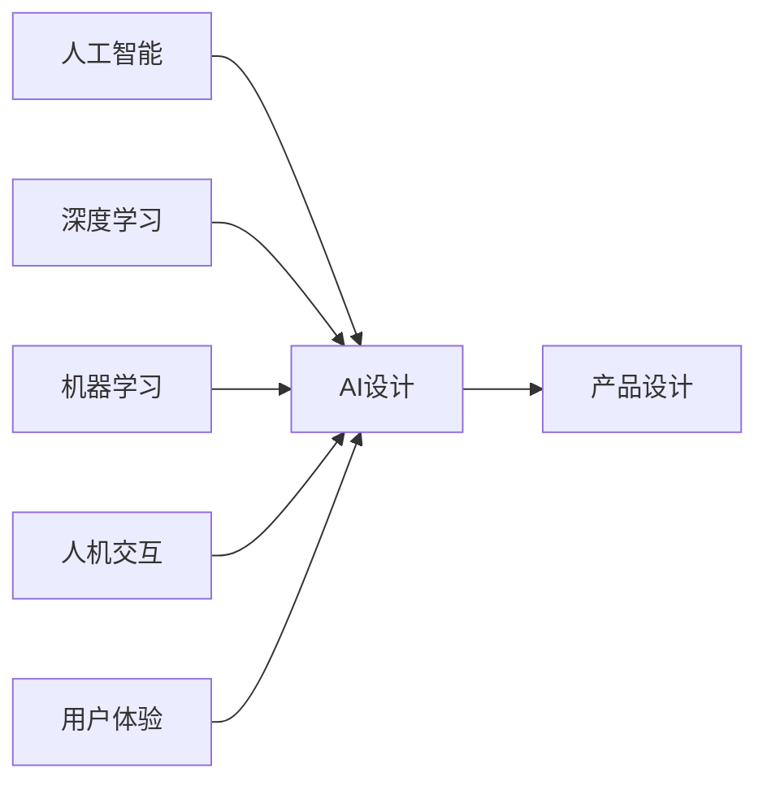

                 

# AI 在产品设计中的未来应用

> 关键词：AI设计、未来趋势、创新技术、用户体验、智能化、人机交互、智能化产品、深度学习、机器学习

## 1. 背景介绍

随着人工智能技术的飞速发展，AI已经深入到各行各业的各个层面，其中，AI在产品设计领域的应用前景尤为广阔。产品设计是人类创造性思维的结晶，旨在解决人类生活中的各种问题，提高生活质量。而人工智能，以其高效、智能、精确等特点，正在引领产品设计的新趋势。

## 2. 核心概念与联系

### 2.1 核心概念概述

AI在产品设计中的核心概念包括：

- **人工智能（AI）**：使用计算机算法和机器学习模型，使机器能够模拟人类智能过程，包括感知、认知、学习等能力。

- **产品设计（Product Design）**：指通过对市场需求、用户需求和技术可能的综合分析，从概念化到最终产品开发的全过程，强调用户体验和功能实现。

- **AI设计（AI Design）**：基于人工智能技术的辅助产品设计方法，旨在提高设计效率，优化设计过程，增强产品智能化水平。

- **深度学习（Deep Learning）**：一种基于人工神经网络的机器学习方法，能够处理高维、非线性数据，广泛应用于图像识别、语音识别、自然语言处理等领域。

- **机器学习（Machine Learning）**：一种通过算法使机器能够从数据中学习规律，自主进行预测和决策的技术。

- **人机交互（Human-Computer Interaction, HCI）**：研究如何设计人与计算机之间的交互方式，以提高系统易用性和用户体验。

- **用户体验（User Experience, UX）**：指用户在使用产品过程中感受到的情绪和反应，关注用户需求和满意度。

这些概念相互联系，共同构成了AI在产品设计中的应用框架。

### 2.2 核心概念原理和架构的 Mermaid 流程图



这个流程图展示了AI技术在产品设计中的应用路径。AI技术通过深度学习和机器学习等算法，辅助产品设计实现智能化，并通过人机交互和用户体验提升设计效果。

## 3. 核心算法原理 & 具体操作步骤

### 3.1 算法原理概述

AI在产品设计中的应用，主要基于以下几个算法原理：

- **深度学习（Deep Learning）**：通过多层神经网络结构，自动提取输入数据的特征，用于图像识别、自然语言处理等任务。

- **机器学习（Machine Learning）**：基于历史数据，训练模型进行预测和决策，支持分类、回归、聚类等任务。

- **生成对抗网络（Generative Adversarial Networks, GANs）**：通过两个神经网络相互博弈，生成逼真的图像、音频等输出。

- **强化学习（Reinforcement Learning, RL）**：通过试错和奖励机制，使模型自主学习最优策略。

- **推荐系统（Recommendation Systems）**：基于用户行为和历史数据，推荐用户可能感兴趣的产品。

这些算法通过各自的特点和优势，在产品设计中发挥着重要的作用。

### 3.2 算法步骤详解

基于上述算法原理，AI在产品设计中的应用一般包括以下步骤：

1. **数据收集与预处理**：收集用户行为数据、市场调研数据等，进行清洗和特征提取。

2. **模型训练与优化**：基于收集到的数据，训练深度学习、机器学习等模型，通过调参和优化提高模型性能。

3. **模型应用与反馈**：将训练好的模型应用于产品设计中，根据用户反馈进行模型调整和优化。

4. **用户测试与迭代**：通过用户测试获取反馈，进一步改进产品设计。

5. **部署与上线**：将设计好的产品部署到生产环境，进行线上测试和优化。

### 3.3 算法优缺点

AI在产品设计中的应用具有以下优点：

- **效率提升**：通过算法自动化处理大量数据，大大提高了设计效率。

- **精度提高**：基于数据驱动的算法，能够提供更准确的预测和决策。

- **智能化增强**：AI能够模拟人类智能，设计更智能、更创新的产品。

- **用户体验优化**：通过分析用户行为和反馈，优化产品设计，提升用户体验。

然而，AI在产品设计中也有其缺点：

- **数据依赖性高**：算法的效果依赖于高质量的数据，数据收集和处理需要大量资源。

- **模型复杂度高**：高维、非线性的数据处理需要复杂算法和计算资源。

- **算法透明度低**：一些AI模型如深度学习，其内部机制难以解释，缺乏透明性。

- **伦理和安全问题**：AI算法可能存在偏见和歧视，需关注其伦理和安全问题。

### 3.4 算法应用领域

AI在产品设计中的应用领域非常广泛，主要包括：

- **工业设计**：利用AI进行产品原型设计和结构优化，提升产品设计效率。

- **汽车设计**：通过AI进行智能驾驶、自动导航等设计，提升车辆智能化水平。

- **医疗设备设计**：利用AI进行疾病预测、医疗影像分析等，提升医疗设备智能化水平。

- **家居设计**：通过AI进行智能家居设计，提升家居智能化和舒适性。

- **消费电子产品设计**：利用AI进行产品创新和个性化定制，提升用户体验。

## 4. 数学模型和公式 & 详细讲解 & 举例说明

### 4.1 数学模型构建

以图像识别为例，构建基于深度学习的图像分类模型。

- **输入**：输入为图像像素矩阵$x \in \mathbb{R}^{n \times n}$。
- **输出**：输出为图像类别概率向量$y \in \mathbb{R}^c$，其中$c$为类别数。

### 4.2 公式推导过程

使用卷积神经网络（Convolutional Neural Network, CNN）进行图像分类。

- **前向传播**：输入图像通过卷积层、池化层、全连接层等，输出预测概率。

- **损失函数**：使用交叉熵损失函数$L(y,\hat{y})=-\frac{1}{N}\sum_{i=1}^N(y_i\log\hat{y}_i+(1-y_i)\log(1-\hat{y}_i))$。

- **反向传播**：通过反向传播算法更新模型参数。

### 4.3 案例分析与讲解

以Facebook的DeepFace为例，其使用卷积神经网络进行人脸识别。

- **模型结构**：DeepFace由多个卷积层、池化层和全连接层组成，通过多层次特征提取，实现对人脸特征的准确识别。

- **训练数据**：使用大规模的人脸图像数据集进行训练，提取人脸特征。

- **测试效果**：DeepFace在人脸识别任务中取得了优异的表现，能够精确识别不同人脸，提升用户体验。

## 5. 项目实践：代码实例和详细解释说明

### 5.1 开发环境搭建

在TensorFlow环境中搭建深度学习项目，具体步骤如下：

1. **安装TensorFlow**：
   ```bash
   pip install tensorflow
   ```

2. **准备数据**：
   ```bash
   # 下载数据集
   wget https://example.com/data.zip
   # 解压数据集
   unzip data.zip
   ```

### 5.2 源代码详细实现

以图像分类为例，使用TensorFlow实现卷积神经网络模型。

```python
import tensorflow as tf

# 定义卷积神经网络模型
def create_model(input_shape, num_classes):
    model = tf.keras.Sequential([
        tf.keras.layers.Conv2D(32, (3,3), activation='relu', input_shape=input_shape),
        tf.keras.layers.MaxPooling2D((2,2)),
        tf.keras.layers.Conv2D(64, (3,3), activation='relu'),
        tf.keras.layers.MaxPooling2D((2,2)),
        tf.keras.layers.Flatten(),
        tf.keras.layers.Dense(128, activation='relu'),
        tf.keras.layers.Dense(num_classes, activation='softmax')
    ])
    return model

# 加载数据集
(x_train, y_train), (x_test, y_test) = tf.keras.datasets.cifar10.load_data()

# 数据预处理
x_train = x_train / 255.0
x_test = x_test / 255.0

# 创建模型
model = create_model((32,32,3), 10)

# 编译模型
model.compile(optimizer='adam',
              loss=tf.keras.losses.SparseCategoricalCrossentropy(from_logits=True),
              metrics=['accuracy'])

# 训练模型
model.fit(x_train, y_train, epochs=10, validation_data=(x_test, y_test))
```

### 5.3 代码解读与分析

上述代码实现了基于卷积神经网络的图像分类模型，具体步骤如下：

1. **创建模型**：使用Sequential模型定义卷积神经网络结构，包括卷积层、池化层和全连接层。

2. **加载数据集**：使用CIFAR-10数据集，进行数据加载和预处理。

3. **编译模型**：使用Adam优化器和交叉熵损失函数，定义模型编译过程。

4. **训练模型**：使用训练数据和验证数据，训练模型10个epoch，并记录验证集准确率。

### 5.4 运行结果展示

训练完成后，可以在测试集上评估模型效果：

```python
test_loss, test_acc = model.evaluate(x_test, y_test)
print('Test accuracy:', test_acc)
```

## 6. 实际应用场景

### 6.1 工业设计

AI在工业设计中的应用，主要通过数据分析、仿真模拟等手段，提升设计效率和产品性能。例如，使用AI进行产品原型设计和结构优化，缩短研发周期，降低成本。

### 6.2 汽车设计

AI在汽车设计中的应用，主要通过智能驾驶、自动导航等功能，提升车辆智能化水平。例如，利用深度学习进行自动驾驶路径规划和障碍物检测，提高行车安全性。

### 6.3 医疗设备设计

AI在医疗设备设计中的应用，主要通过图像识别、疾病预测等技术，提升设备智能化水平。例如，利用AI进行医疗影像分析，辅助医生进行疾病诊断，提升诊断准确率。

### 6.4 家居设计

AI在家居设计中的应用，主要通过智能化控制和个性化定制，提升家居智能化和舒适性。例如，利用AI进行智能家居设备联动，实现语音控制和场景设置。

### 6.5 消费电子产品设计

AI在消费电子产品设计中的应用，主要通过产品创新和个性化定制，提升用户体验。例如，利用AI进行智能推荐系统，个性化推荐商品，提高用户满意度。

## 7. 工具和资源推荐

### 7.1 学习资源推荐

- **《深度学习》书籍**：Ian Goodfellow、Yoshua Bengio、Aaron Courville著，全面介绍深度学习理论和应用。

- **Coursera《深度学习专项课程》**：由Andrew Ng等人授课，涵盖深度学习基础知识和实践。

- **Kaggle平台**：提供丰富的数据集和竞赛，实践深度学习算法。

### 7.2 开发工具推荐

- **TensorFlow**：开源深度学习框架，支持多种语言和平台。

- **PyTorch**：开源深度学习框架，灵活性和易用性高。

- **Jupyter Notebook**：交互式编程环境，方便数据可视化、代码调试。

### 7.3 相关论文推荐

- **《深度学习在产品设计中的应用》**：吴恩达、杨立昆等著，详细介绍深度学习在产品设计中的应用。

- **《人机交互中的AI技术》**：Enst967等著，讨论人机交互中的AI技术。

- **《用户体验设计中的AI技术》**：Sam Spiegel等著，探讨AI在用户体验设计中的应用。

## 8. 总结：未来发展趋势与挑战

### 8.1 研究成果总结

AI在产品设计中的应用，已经成为提升设计效率和性能的重要手段。通过深度学习、机器学习等技术，AI已经在多个领域实现了显著应用效果，极大地提升了产品设计的智能化水平。

### 8.2 未来发展趋势

未来，AI在产品设计中的应用将呈现以下趋势：

- **更智能的设计工具**：基于AI的产品设计工具将更加智能，自动生成设计方案、优化设计过程。

- **更个性化的用户体验**：通过AI分析用户数据，实现更个性化的产品设计，提升用户体验。

- **更高效的协同设计**：AI可以协助设计师进行任务分配、进度跟踪等，提升团队协作效率。

- **更广泛的应用场景**：AI将更多地应用于各个行业的产品设计中，实现跨领域融合。

- **更强大的数据驱动能力**：AI将能够更好地利用大数据和云计算资源，提升设计效率和效果。

### 8.3 面临的挑战

AI在产品设计中的应用还面临以下挑战：

- **数据隐私和安全**：大量用户数据的收集和使用，需要解决数据隐私和安全问题。

- **算法透明性**：AI算法的黑盒特性，缺乏透明性和解释性，难以理解和调试。

- **跨学科整合**：AI应用需要与其他学科，如工程、心理学、艺术等，进行深度整合，提升设计质量。

- **伦理和社会影响**：AI设计可能存在偏见和歧视，需关注其伦理和社会影响，确保设计公平和可控。

### 8.4 研究展望

未来，AI在产品设计中的应用将需要从以下几个方面进行进一步探索：

- **数据隐私保护**：通过数据匿名化和加密技术，保护用户隐私。

- **算法透明性**：开发更透明的AI算法，提升模型的可解释性。

- **跨学科融合**：与其他学科深入融合，提升设计效果。

- **伦理和社会责任**：建立AI设计伦理框架，确保设计公平和可控。

## 9. 附录：常见问题与解答

**Q1：AI在产品设计中存在哪些问题？**

A: AI在产品设计中存在以下问题：

- **数据隐私和安全**：大量用户数据的收集和使用，存在隐私泄露和安全风险。

- **算法透明性**：AI算法的黑盒特性，难以理解和调试。

- **跨学科整合**：AI应用需要与其他学科，如工程、心理学、艺术等，进行深度整合，提升设计质量。

**Q2：AI在产品设计中如何提升用户体验？**

A: AI在产品设计中可以通过以下方式提升用户体验：

- **个性化推荐**：利用AI分析用户行为和偏好，进行个性化推荐，提升用户满意度。

- **智能交互**：通过语音识别和自然语言处理技术，实现智能交互，提升用户互动体验。

- **智能助手**：开发智能助手，协助用户完成任务，提升用户效率。

**Q3：AI在产品设计中的技术挑战有哪些？**

A: AI在产品设计中的技术挑战包括：

- **数据隐私和安全**：大量用户数据的收集和使用，需要解决数据隐私和安全问题。

- **算法透明性**：AI算法的黑盒特性，缺乏透明性和解释性，难以理解和调试。

- **跨学科整合**：AI应用需要与其他学科，如工程、心理学、艺术等，进行深度整合，提升设计质量。

- **伦理和社会影响**：AI设计可能存在偏见和歧视，需关注其伦理和社会影响，确保设计公平和可控。

**Q4：AI在产品设计中的应用前景如何？**

A: AI在产品设计中的应用前景广阔，未来将呈现以下趋势：

- **更智能的设计工具**：基于AI的产品设计工具将更加智能，自动生成设计方案、优化设计过程。

- **更个性化的用户体验**：通过AI分析用户数据，实现更个性化的产品设计，提升用户体验。

- **更高效的协同设计**：AI可以协助设计师进行任务分配、进度跟踪等，提升团队协作效率。

- **更广泛的应用场景**：AI将更多地应用于各个行业的产品设计中，实现跨领域融合。

- **更强大的数据驱动能力**：AI将能够更好地利用大数据和云计算资源，提升设计效率和效果。

---

作者：禅与计算机程序设计艺术 / Zen and the Art of Computer Programming

