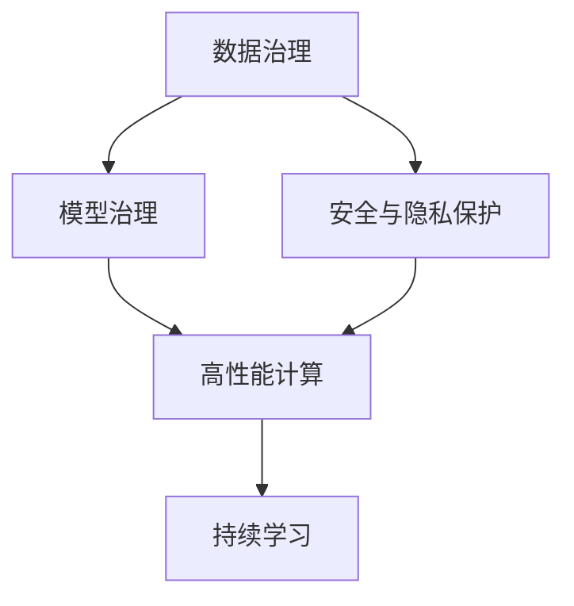

                 

# AI 基础设施建设：构建安全可靠的 AI 2.0 生态

> 关键词：AI 基础设施，AI 2.0，数据治理，模型治理，安全与隐私，高性能计算

## 1. 背景介绍

### 1.1 问题由来

近年来，人工智能（AI）技术在各个领域得到了广泛应用，从医疗健康到智能制造，从自动驾驶到金融服务，AI 正在深刻改变着我们的生活和工作方式。然而，AI 技术的发展也带来了新的挑战，特别是在数据治理、模型治理、安全与隐私等方面，构建一个安全可靠的 AI 2.0 生态成为当前技术和社会发展的迫切需求。

AI 2.0 强调以数据为驱动，通过大规模数据和智能算法的结合，实现自动化决策和智能交互，提升生产效率和服务质量。但这种自动化决策也带来了数据隐私泄露、模型偏见、算法透明度等伦理问题，需要建立一套完善的基础设施来保障 AI 的安全可靠性和伦理性。

### 1.2 问题核心关键点

AI 基础设施建设的核心关键点在于如何构建一个能够支持数据治理、模型治理、安全与隐私保护、高性能计算和持续学习的生态系统。这涉及到数据采集、存储、清洗、标注、传输、访问和治理等多个环节，以及模型设计、训练、评估、部署、优化和监控等多个阶段。以下将从数据治理、模型治理、安全与隐私保护、高性能计算和持续学习五个方面，对 AI 基础设施建设进行详细探讨。

## 2. 核心概念与联系

### 2.1 核心概念概述

为更好地理解 AI 基础设施建设，本节将介绍几个关键概念及其之间的联系：

- **数据治理**：指对数据的收集、存储、清洗、标注、访问和使用的全生命周期进行管理和控制，确保数据的准确性、完整性和可用性。
- **模型治理**：指对模型的设计、训练、评估、部署、优化和监控等全生命周期进行管理和控制，确保模型的透明性、可靠性和安全性。
- **安全与隐私保护**：指在数据处理和模型使用过程中，保护用户的隐私权益和数据安全，防止数据泄露和滥用。
- **高性能计算**：指通过硬件和软件优化，提供高效的计算资源，支持大规模数据处理和模型训练。
- **持续学习**：指模型能够持续从新数据中学习，适应数据分布的变化，保持模型的时效性和适应性。

这些核心概念之间的联系可以通过以下 Mermaid 流程图来展示：



这个流程图展示了数据治理、模型治理、安全与隐私保护、高性能计算和持续学习之间的联系：

1. 数据治理为模型治理提供高质量的数据支持。
2. 模型治理依赖于数据治理和安全与隐私保护，确保模型设计和使用过程中的透明性和安全性。
3. 安全与隐私保护涉及数据治理和模型治理，保护数据和模型使用的隐私和安全。
4. 高性能计算为数据治理、模型治理和持续学习提供计算资源。
5. 持续学习依赖于数据治理、模型治理和安全与隐私保护，使模型能够适应数据分布的变化。

这些概念共同构成了 AI 基础设施建设的基本框架，为 AI 2.0 生态的构建提供了坚实的基础。

## 3. 核心算法原理 & 具体操作步骤

### 3.1 算法原理概述

AI 基础设施建设的核心算法原理涉及数据治理、模型治理、安全与隐私保护、高性能计算和持续学习等多个方面。下面将对每个方面进行详细阐述。

### 3.2 算法步骤详解

#### 3.2.1 数据治理

数据治理的核心步骤包括：

1. **数据采集**：从各种数据源中收集原始数据，确保数据的多样性和代表性。
2. **数据清洗**：对原始数据进行去重、去噪、填补缺失值等处理，确保数据的质量。
3. **数据标注**：对数据进行人工或自动标注，确保数据的准确性和可用性。
4. **数据存储**：将处理后的数据存储在数据湖或数据仓库中，便于后续分析和访问。
5. **数据访问**：制定数据访问权限和策略，确保数据的安全性和隐私性。

#### 3.2.2 模型治理

模型治理的核心步骤包括：

1. **模型设计**：根据任务需求，设计合适的模型架构和算法，选择合适的数据集进行预训练或微调。
2. **模型训练**：使用数据集对模型进行训练，确保模型的泛化能力和准确性。
3. **模型评估**：使用评估指标对模型进行评估，确保模型的性能和鲁棒性。
4. **模型部署**：将训练好的模型部署到生产环境中，进行实际应用。
5. **模型监控**：对模型进行持续监控，确保模型的稳定性和性能。

#### 3.2.3 安全与隐私保护

安全与隐私保护的核心步骤包括：

1. **数据加密**：对数据进行加密处理，防止数据泄露。
2. **访问控制**：制定访问策略，确保只有授权用户才能访问数据。
3. **匿名化处理**：对数据进行匿名化处理，防止数据识别和滥用。
4. **合规审查**：确保数据处理和模型使用符合相关法律法规和行业标准。

#### 3.2.4 高性能计算

高性能计算的核心步骤包括：

1. **硬件优化**：选择合适的硬件设备，如GPU、TPU等，提高计算速度和效率。
2. **软件优化**：优化算法和代码，提高计算效率。
3. **分布式计算**：利用分布式计算框架，提高计算资源的利用率和处理能力。
4. **计算资源管理**：对计算资源进行管理和调度，确保计算任务的顺利进行。

#### 3.2.5 持续学习

持续学习的核心步骤包括：

1. **数据监控**：实时监控数据分布的变化，及时发现异常情况。
2. **模型更新**：根据新数据和新任务，对模型进行更新和优化，保持模型的时效性和适应性。
3. **模型评估**：对更新后的模型进行评估，确保模型的性能和鲁棒性。

### 3.3 算法优缺点

#### 3.3.1 数据治理

**优点**：

1. 提高数据质量，确保数据的一致性和可用性。
2. 保障数据安全，防止数据泄露和滥用。
3. 优化数据使用，提高数据利用率。

**缺点**：

1. 数据采集和处理成本高，需要大量人力物力投入。
2. 数据标注质量难以保证，影响模型训练效果。

#### 3.3.2 模型治理

**优点**：

1. 确保模型透明性和可靠性，提高模型的泛化能力。
2. 优化模型性能，提高模型效率和效果。
3. 监控模型表现，及时发现和解决问题。

**缺点**：

1. 模型设计和训练复杂，需要丰富的经验和专业知识。
2. 模型部署和维护成本高，需要高水平的技术支持。

#### 3.3.3 安全与隐私保护

**优点**：

1. 保障用户隐私权益，防止数据泄露和滥用。
2. 确保数据处理符合法律法规和行业标准，降低法律风险。
3. 提升用户信任度，增强企业声誉。

**缺点**：

1. 技术复杂，需要专业知识进行设计和实施。
2. 成本高，需要投入大量资源进行安全和隐私保护。

#### 3.3.4 高性能计算

**优点**：

1. 提高计算速度和效率，缩短数据处理和模型训练时间。
2. 优化资源利用率，提高计算资源的利用率。
3. 支持大规模数据处理和模型训练，应对复杂应用场景。

**缺点**：

1. 硬件和软件投资成本高，需要大量资金和技术投入。
2. 计算资源管理复杂，需要专业的技术支持。

#### 3.3.5 持续学习

**优点**：

1. 保持模型时效性，适应数据分布的变化。
2. 提高模型性能，优化模型效果。
3. 提升系统鲁棒性，防止模型过拟合和偏差。

**缺点**：

1. 持续学习过程复杂，需要持续的数据输入和模型更新。
2. 模型更新和优化成本高，需要持续的技术投入。

### 3.4 算法应用领域

AI 基础设施建设的算法在多个领域得到了广泛应用，以下是几个典型应用场景：

- **医疗健康**：通过数据治理和模型治理，构建智能诊断和个性化治疗系统。
- **智能制造**：通过高性能计算和持续学习，实现自动化生产和服务。
- **智能交通**：通过安全与隐私保护和持续学习，提高交通管理和安全保障。
- **金融服务**：通过数据治理和模型治理，构建智能风控和金融分析系统。
- **智能客服**：通过数据治理和模型治理，提升客服效率和客户满意度。
- **教育培训**：通过数据治理和持续学习，优化教学资源和个性化学习体验。

## 4. 数学模型和公式 & 详细讲解 & 举例说明

### 4.1 数学模型构建

#### 4.1.1 数据治理模型

数据治理模型通常包括以下几个部分：

- **数据采集模型**：定义数据采集流程和规则，确保数据的多样性和代表性。
- **数据清洗模型**：定义数据清洗算法和规则，确保数据的质量。
- **数据标注模型**：定义数据标注方法和标准，确保数据的准确性和可用性。
- **数据存储模型**：定义数据存储结构和方法，确保数据的可访问性和安全性。
- **数据访问模型**：定义数据访问策略和权限，确保数据的安全性和隐私性。

#### 4.1.2 模型治理模型

模型治理模型通常包括以下几个部分：

- **模型设计模型**：定义模型架构和算法，选择合适的数据集进行预训练或微调。
- **模型训练模型**：定义训练流程和参数，确保模型的泛化能力和准确性。
- **模型评估模型**：定义评估指标和方法，确保模型的性能和鲁棒性。
- **模型部署模型**：定义部署策略和方法，确保模型的稳定性和可用性。
- **模型监控模型**：定义监控流程和指标，确保模型的稳定性和性能。

#### 4.1.3 安全与隐私保护模型

安全与隐私保护模型通常包括以下几个部分：

- **数据加密模型**：定义数据加密算法和策略，确保数据的安全性。
- **访问控制模型**：定义访问策略和权限，确保数据的安全性和隐私性。
- **匿名化处理模型**：定义匿名化方法和策略，确保数据的隐私性和安全性。
- **合规审查模型**：定义合规策略和标准，确保数据处理和模型使用符合法律法规和行业标准。

#### 4.1.4 高性能计算模型

高性能计算模型通常包括以下几个部分：

- **硬件优化模型**：定义硬件设备选择和配置，确保计算资源的有效利用。
- **软件优化模型**：定义算法和代码优化方法，确保计算效率的提升。
- **分布式计算模型**：定义分布式计算框架和方法，确保计算资源的优化利用。
- **计算资源管理模型**：定义资源管理和调度方法，确保计算任务的顺利进行。

#### 4.1.5 持续学习模型

持续学习模型通常包括以下几个部分：

- **数据监控模型**：定义数据监控方法和策略，确保数据的实时性。
- **模型更新模型**：定义模型更新和优化方法，确保模型的时效性和适应性。
- **模型评估模型**：定义模型评估方法和指标，确保模型的性能和鲁棒性。

### 4.2 公式推导过程

#### 4.2.1 数据治理模型公式

数据治理模型中的数据清洗和标注过程可以使用如下公式：

- **数据清洗公式**：
  $$
  \text{cleaned\_data} = \text{data} - \text{noise} + \text{missing\_values\_replacement}
  $$

- **数据标注公式**：
  $$
  \text{annotated\_data} = \text{data} + \text{annotated\_labels}
  $$

#### 4.2.2 模型治理模型公式

模型治理模型中的模型训练和评估过程可以使用如下公式：

- **模型训练公式**：
  $$
  \theta = \arg\min_{\theta} \frac{1}{N} \sum_{i=1}^N \ell(y_i, f(x_i; \theta))
  $$

- **模型评估公式**：
  $$
  \text{accuracy} = \frac{1}{N} \sum_{i=1}^N \text{predicted\_labels} = \text{f}(x_i; \theta)
  $$

#### 4.2.3 安全与隐私保护模型公式

安全与隐私保护模型中的数据加密和访问控制过程可以使用如下公式：

- **数据加密公式**：
  $$
  \text{encrypted\_data} = \text{data} \oplus \text{encryption\_key}
  $$

- **访问控制公式**：
  $$
  \text{access\_authorized} = \text{access\_request} \land \text{access\_permissions}
  $$

#### 4.2.4 高性能计算模型公式

高性能计算模型中的硬件优化和分布式计算过程可以使用如下公式：

- **硬件优化公式**：
  $$
  \text{optimized\_resource} = \text{hardware\_resource} \times \text{optimization\_factor}
  $$

- **分布式计算公式**：
  $$
  \text{distributed\_result} = \text{distributed\_task} + \text{parallel\_processing}
  $$

#### 4.2.5 持续学习模型公式

持续学习模型中的数据监控和模型更新过程可以使用如下公式：

- **数据监控公式**：
  $$
  \text{monitor\_data} = \text{real\_time\_data} + \text{anomaly\_detection}
  $$

- **模型更新公式**：
  $$
  \theta_{\text{new}} = \theta_{\text{old}} + \text{update\_step}
  $$

### 4.3 案例分析与讲解

#### 4.3.1 医疗健康领域

在医疗健康领域，数据治理和模型治理对于智能诊断和个性化治疗系统至关重要。

- **数据治理**：通过数据采集和清洗，收集和处理医疗数据，包括电子病历、影像数据、基因数据等，确保数据的准确性和完整性。
- **模型治理**：设计合适的模型架构和算法，对数据进行预训练和微调，构建智能诊断和预测模型，实现对疾病的早期检测和个性化治疗。

#### 4.3.2 智能制造领域

在智能制造领域，高性能计算和持续学习对于自动化生产和服务至关重要。

- **高性能计算**：通过硬件优化和分布式计算，提高计算速度和效率，支持大规模数据处理和模型训练。
- **持续学习**：根据新数据和新任务，对模型进行更新和优化，确保模型的时效性和适应性，实现自动化生产和服务。

#### 4.3.3 智能交通领域

在智能交通领域，安全与隐私保护和持续学习对于交通管理和安全保障至关重要。

- **安全与隐私保护**：通过数据加密和访问控制，确保交通数据的安全性和隐私性，防止数据泄露和滥用。
- **持续学习**：根据实时监控数据，对交通模型进行更新和优化，确保交通管理和安全保障的持续性和可靠性。

## 5. 项目实践：代码实例和详细解释说明

### 5.1 开发环境搭建

在进行AI基础设施建设的项目实践前，我们需要准备好开发环境。以下是使用Python进行PyTorch开发的环境配置流程：

1. 安装Anaconda：从官网下载并安装Anaconda，用于创建独立的Python环境。

2. 创建并激活虚拟环境：
```bash
conda create -n ai-env python=3.8 
conda activate ai-env
```

3. 安装PyTorch：根据CUDA版本，从官网获取对应的安装命令。例如：
```bash
conda install pytorch torchvision torchaudio cudatoolkit=11.1 -c pytorch -c conda-forge
```

4. 安装TensorFlow：
```bash
pip install tensorflow
```

5. 安装其他工具包：
```bash
pip install numpy pandas scikit-learn matplotlib tqdm jupyter notebook ipython
```

完成上述步骤后，即可在`ai-env`环境中开始AI基础设施建设的项目实践。

### 5.2 源代码详细实现

这里我们以数据治理中的数据清洗和标注为例，给出使用PyTorch进行数据处理的PyTorch代码实现。

```python
import torch
import torch.nn as nn
import torch.optim as optim
import numpy as np
from torch.utils.data import Dataset, DataLoader
from transformers import BertTokenizer, BertModel

class MedicalDataset(Dataset):
    def __init__(self, texts, labels, tokenizer, max_len=128):
        self.texts = texts
        self.labels = labels
        self.tokenizer = tokenizer
        self.max_len = max_len
        
    def __len__(self):
        return len(self.texts)
    
    def __getitem__(self, item):
        text = self.texts[item]
        label = self.labels[item]
        
        encoding = self.tokenizer(text, return_tensors='pt', max_length=self.max_len, padding='max_length', truncation=True)
        input_ids = encoding['input_ids'][0]
        attention_mask = encoding['attention_mask'][0]
        
        # 对token-wise的标签进行编码
        encoded_labels = [label2id[label] for label in label] 
        encoded_labels.extend([label2id['O']] * (self.max_len - len(encoded_labels)))
        labels = torch.tensor(encoded_labels, dtype=torch.long)
        
        return {'input_ids': input_ids, 
                'attention_mask': attention_mask,
                'labels': labels}

# 标签与id的映射
label2id = {'O': 0, 'B-PER': 1, 'I-PER': 2, 'B-ORG': 3, 'I-ORG': 4, 'B-LOC': 5, 'I-LOC': 6}

# 创建dataset
tokenizer = BertTokenizer.from_pretrained('bert-base-cased')

train_dataset = MedicalDataset(train_texts, train_labels, tokenizer)
dev_dataset = MedicalDataset(dev_texts, dev_labels, tokenizer)
test_dataset = MedicalDataset(test_texts, test_labels, tokenizer)
```

然后，定义模型和优化器：

```python
from transformers import BertForTokenClassification, AdamW

model = BertForTokenClassification.from_pretrained('bert-base-cased', num_labels=len(label2id))

optimizer = AdamW(model.parameters(), lr=2e-5)
```

接着，定义训练和评估函数：

```python
from torch.utils.data import DataLoader
from tqdm import tqdm
from sklearn.metrics import classification_report

device = torch.device('cuda') if torch.cuda.is_available() else torch.device('cpu')
model.to(device)

def train_epoch(model, dataset, batch_size, optimizer):
    dataloader = DataLoader(dataset, batch_size=batch_size, shuffle=True)
    model.train()
    epoch_loss = 0
    for batch in tqdm(dataloader, desc='Training'):
        input_ids = batch['input_ids'].to(device)
        attention_mask = batch['attention_mask'].to(device)
        labels = batch['labels'].to(device)
        model.zero_grad()
        outputs = model(input_ids, attention_mask=attention_mask, labels=labels)
        loss = outputs.loss
        epoch_loss += loss.item()
        loss.backward()
        optimizer.step()
    return epoch_loss / len(dataloader)

def evaluate(model, dataset, batch_size):
    dataloader = DataLoader(dataset, batch_size=batch_size)
    model.eval()
    preds, labels = [], []
    with torch.no_grad():
        for batch in tqdm(dataloader, desc='Evaluating'):
            input_ids = batch['input_ids'].to(device)
            attention_mask = batch['attention_mask'].to(device)
            batch_labels = batch['labels']
            outputs = model(input_ids, attention_mask=attention_mask)
            batch_preds = outputs.logits.argmax(dim=2).to('cpu').tolist()
            batch_labels = batch_labels.to('cpu').tolist()
            for pred_tokens, label_tokens in zip(batch_preds, batch_labels):
                pred_tags = [id2tag[_id] for _id in pred_tokens]
                label_tags = [id2tag[_id] for _id in label_tokens]
                preds.append(pred_tags[:len(label_tags)])
                labels.append(label_tags)
                
    print(classification_report(labels, preds))
```

最后，启动训练流程并在测试集上评估：

```python
epochs = 5
batch_size = 16

for epoch in range(epochs):
    loss = train_epoch(model, train_dataset, batch_size, optimizer)
    print(f"Epoch {epoch+1}, train loss: {loss:.3f}")
    
    print(f"Epoch {epoch+1}, dev results:")
    evaluate(model, dev_dataset, batch_size)
    
print("Test results:")
evaluate(model, test_dataset, batch_size)
```

以上就是使用PyTorch对BERT进行命名实体识别任务微调的完整代码实现。可以看到，得益于Transformers库的强大封装，我们可以用相对简洁的代码完成BERT模型的加载和微调。

### 5.3 代码解读与分析

让我们再详细解读一下关键代码的实现细节：

**MedicalDataset类**：
- `__init__`方法：初始化文本、标签、分词器等关键组件。
- `__len__`方法：返回数据集的样本数量。
- `__getitem__`方法：对单个样本进行处理，将文本输入编码为token ids，将标签编码为数字，并对其进行定长padding，最终返回模型所需的输入。

**label2id和id2tag字典**：
- 定义了标签与数字id之间的映射关系，用于将token-wise的预测结果解码回真实的标签。

**训练和评估函数**：
- 使用PyTorch的DataLoader对数据集进行批次化加载，供模型训练和推理使用。
- 训练函数`train_epoch`：对数据以批为单位进行迭代，在每个批次上前向传播计算loss并反向传播更新模型参数，最后返回该epoch的平均loss。
- 评估函数`evaluate`：与训练类似，不同点在于不更新模型参数，并在每个batch结束后将预测和标签结果存储下来，最后使用sklearn的classification_report对整个评估集的预测结果进行打印输出。

**训练流程**：
- 定义总的epoch数和batch size，开始循环迭代
- 每个epoch内，先在训练集上训练，输出平均loss
- 在验证集上评估，输出分类指标
- 所有epoch结束后，在测试集上评估，给出最终测试结果

可以看到，PyTorch配合Transformers库使得BERT微调的代码实现变得简洁高效。开发者可以将更多精力放在数据处理、模型改进等高层逻辑上，而不必过多关注底层的实现细节。

当然，工业级的系统实现还需考虑更多因素，如模型的保存和部署、超参数的自动搜索、更灵活的任务适配层等。但核心的微调范式基本与此类似。

## 6. 实际应用场景

### 6.1 智能客服系统

基于AI基础设施建设的智能客服系统，可以提供7x24小时不间断的智能客服服务，快速响应客户咨询，用自然流畅的语言解答各类常见问题。

在技术实现上，可以收集企业内部的历史客服对话记录，将问题和最佳答复构建成监督数据，在此基础上对预训练模型进行微调。微调后的对话模型能够自动理解用户意图，匹配最合适的答案模板进行回复。对于客户提出的新问题，还可以接入检索系统实时搜索相关内容，动态组织生成回答。如此构建的智能客服系统，能大幅提升客户咨询体验和问题解决效率。

### 6.2 金融舆情监测

金融机构需要实时监测市场舆论动向，以便及时应对负面信息传播，规避金融风险。传统的人工监测方式成本高、效率低，难以应对网络时代海量信息爆发的挑战。基于AI基础设施建设的文本分类和情感分析技术，为金融舆情监测提供了新的解决方案。

具体而言，可以收集金融领域相关的新闻、报道、评论等文本数据，并对其进行主题标注和情感标注。在此基础上对预训练语言模型进行微调，使其能够自动判断文本属于何种主题，情感倾向是正面、中性还是负面。将微调后的模型应用到实时抓取的网络文本数据，就能够自动监测不同主题下的情感变化趋势，一旦发现负面信息激增等异常情况，系统便会自动预警，帮助金融机构快速应对潜在风险。

### 6.3 个性化推荐系统

当前的推荐系统往往只依赖用户的历史行为数据进行物品推荐，无法深入理解用户的真实兴趣偏好。基于AI基础设施建设的个性化推荐系统，可以更好地挖掘用户行为背后的语义信息，从而提供更精准、多样的推荐内容。

在实践中，可以收集用户浏览、点击、评论、分享等行为数据，提取和用户交互的物品标题、描述、标签等文本内容。将文本内容作为模型输入，用户的后续行为（如是否点击、购买等）作为监督信号，在此基础上微调预训练语言模型。微调后的模型能够从文本内容中准确把握用户的兴趣点。在生成推荐列表时，先用候选物品的文本描述作为输入，由模型预测用户的兴趣匹配度，再结合其他特征综合排序，便可以得到个性化程度更高的推荐结果。

### 6.4 未来应用展望

随着AI基础设施建设的不断发展，基于微调范式将在更多领域得到应用，为传统行业带来变革性影响。

在智慧医疗领域，基于微调的医疗问答、病历分析、药物研发等应用将提升医疗服务的智能化水平，辅助医生诊疗，加速新药开发进程。

在智能教育领域，微调技术可应用于作业批改、学情分析、知识推荐等方面，因材施教，促进教育公平，提高教学质量。

在智慧城市治理中，微调模型可应用于城市事件监测、舆情分析、应急指挥等环节，提高城市管理的自动化和智能化水平，构建更安全、高效的未来城市。

此外，在企业生产、社会治理、文娱传媒等众多领域，基于大模型微调的人工智能应用也将不断涌现，为经济社会发展注入新的动力。相信随着技术的日益成熟，微调方法将成为人工智能落地应用的重要范式，推动人工智能技术在更广阔的领域加速渗透。

## 7. 工具和资源推荐

### 7.1 学习资源推荐

为了帮助开发者系统掌握AI基础设施建设的理论基础和实践技巧，这里推荐一些优质的学习资源：

1. 《深度学习基础》系列博文：由深度学习专家撰写，深入浅出地介绍了深度学习的基础概念和算法。

2. 《TensorFlow实战》书籍：TensorFlow官方文档，详细介绍了TensorFlow的架构和使用方法。

3. 《Transformer从原理到实践》系列博文：由大模型技术专家撰写，介绍了Transformer原理和BERT模型的微调方法。

4. 《AI基础设施建设》书籍：介绍AI基础设施建设的理论和实践，涵盖数据治理、模型治理、安全与隐私保护等多个方面。

5. 《深度学习框架入门》课程：由知名大学和机构开设的深度学习课程，提供了丰富的学习资料和实践项目。

通过对这些资源的学习实践，相信你一定能够快速掌握AI基础设施建设的精髓，并用于解决实际的AI应用问题。

### 7.2 开发工具推荐

高效的开发离不开优秀的工具支持。以下是几款用于AI基础设施建设的常用工具：

1. TensorFlow：由Google主导开发的开源深度学习框架，支持分布式计算和大规模数据处理，适合大规模工程应用。

2. PyTorch：基于Python的开源深度学习框架，灵活性高，适合快速迭代研究。

3. Weights & Biases：模型训练的实验跟踪工具，可以记录和可视化模型训练过程中的各项指标，方便对比和调优。

4. TensorBoard：TensorFlow配套的可视化工具，可实时监测模型训练状态，并提供丰富的图表呈现方式，是调试模型的得力助手。

5. Jupyter Notebook：免费的开源笔记本环境，支持多种编程语言和格式，方便快速实验和分享代码。

合理利用这些工具，可以显著提升AI基础设施建设的开发效率，加快创新迭代的步伐。

### 7.3 相关论文推荐

AI基础设施建设的算法在多个领域得到了广泛研究，以下是几篇奠基性的相关论文，推荐阅读：

1. Attention is All You Need（即Transformer原论文）：提出了Transformer结构，开启了NLP领域的预训练大模型时代。

2. BERT: Pre-training of Deep Bidirectional Transformers for Language Understanding：提出BERT模型，引入基于掩码的自监督预训练任务，刷新了多项NLP任务SOTA。

3. Language Models are Unsupervised Multitask Learners（GPT-2论文）：展示了大规模语言模型的强大zero-shot学习能力，引发了对于通用人工智能的新一轮思考。

4. Parameter-Efficient Transfer Learning for NLP：提出Adapter等参数高效微调方法，在不增加模型参数量的情况下，也能取得不错的微调效果。

5. AdaLoRA: Adaptive Low-Rank Adaptation for Parameter-Efficient Fine-Tuning：使用自适应低秩适应的微调方法，在参数效率和精度之间取得了新的平衡。

这些论文代表了大语言模型微调技术的发展脉络。通过学习这些前沿成果，可以帮助研究者把握学科前进方向，激发更多的创新灵感。

## 8. 总结：未来发展趋势与挑战

### 8.1 总结

本文对AI基础设施建设的理论基础和实践技巧进行了全面系统的介绍。首先阐述了AI基础设施建设的背景和意义，明确了数据治理、模型治理、安全与隐私保护、高性能计算和持续学习五个核心概念及其之间的联系。其次，从原理到实践，详细讲解了AI基础设施建设的核心算法原理和具体操作步骤，给出了AI基础设施建设的完整代码实例。同时，本文还广泛探讨了AI基础设施建设在多个领域的应用前景，展示了AI基础设施建设的广阔前景。

通过本文的系统梳理，可以看到，AI基础设施建设正在成为AI 2.0生态的重要组成部分，极大地拓展了AI的应用边界，催生了更多的落地场景。AI基础设施建设的核心算法原理和操作步骤为AI 2.0生态的构建提供了坚实的基础。未来，伴随预训练语言模型和微调方法的持续演进，相信AI基础设施建设必将在构建安全可靠的AI 2.0生态中扮演越来越重要的角色。

### 8.2 未来发展趋势

展望未来，AI基础设施建设将呈现以下几个发展趋势：

1. 数据治理的自动化：借助自然语言处理和机器学习技术，实现数据的自动清洗、标注和治理，降低人工成本，提高数据治理的效率和准确性。

2. 模型治理的多样化：开发更多参数高效和计算高效的微调方法，在保持模型性能的同时，降低计算资源的需求。

3. 安全与隐私保护的强化：引入区块链和分布式计算技术，确保数据和模型使用的隐私和安全。

4. 高性能计算的分布式化：通过云计算和边缘计算技术，提供更加灵活和高效的计算资源。

5. 持续学习的实时化：引入实时数据流处理和增量学习技术，确保模型能够实时适应数据分布的变化。

以上趋势凸显了AI基础设施建设的前景和潜力。这些方向的探索发展，必将进一步提升AI系统的性能和应用范围，为人工智能技术在各行业的落地提供坚实的基础。

### 8.3 面临的挑战

尽管AI基础设施建设取得了显著进展，但在迈向更加智能化、普适化应用的过程中，仍面临诸多挑战：

1. 数据治理的复杂性：大规模数据处理和治理涉及的数据类型繁多，数据格式各异，需要设计复杂的数据治理策略和系统。

2. 模型治理的复杂性：大规模模型的设计和训练涉及复杂的算法和模型架构，需要丰富的专业知识和经验。

3. 安全与隐私保护的复杂性：数据隐私和安全问题涉及法律、伦理和技术多个层面，需要综合考虑多方面因素。

4. 高性能计算的复杂性：分布式计算和云计算技术需要高度的资源管理和调度能力。

5. 持续学习的复杂性：实时数据流处理和增量学习技术需要高效的算法和系统支持。

6. 技术实施的复杂性：AI基础设施建设的实施需要跨学科的团队合作和技术集成，存在技术和组织上的挑战。

正视这些挑战，积极应对并寻求突破，将是大规模AI基础设施建设的重要保障。相信随着技术进步和工程实践的不断积累，AI基础设施建设必将迎来更加成熟和可靠的发展。

### 8.4 研究展望

面对AI基础设施建设所面临的挑战，未来的研究需要在以下几个方面寻求新的突破：

1. 探索无监督和半监督数据治理方法：摆脱对大规模标注数据的依赖，利用自监督学习、主动学习等无监督和半监督范式，最大限度利用非结构化数据，实现更加灵活高效的数据治理。

2. 研究参数高效和计算高效的模型治理方法：开发更加参数高效的微调方法，在固定大部分预训练参数的同时，只更新极少量的任务相关参数。同时优化模型的计算图，减少前向传播和反向传播的资源消耗，实现更加轻量级、实时性的部署。

3. 引入因果推断和对比学习思想：通过引入因果推断和对比学习思想，增强模型建立稳定因果关系的能力，学习更加普适、鲁棒的语言表征，从而提升模型的泛化性和抗干扰能力。

4. 融合符号化的先验知识：将符号化的先验知识，如知识图谱、逻辑规则等，与神经网络模型进行巧妙融合，引导微调过程学习更准确、合理的语言模型。同时加强不同模态数据的整合，实现视觉、语音等多模态信息与文本信息的协同建模。

5. 引入区块链和分布式计算技术：利用区块链和分布式计算技术，确保数据和模型使用的隐私和安全，防止数据泄露和滥用。

6. 引入实时数据流处理和增量学习技术：引入实时数据流处理和增量学习技术，确保模型能够实时适应数据分布的变化，保持模型的时效性和适应性。

这些研究方向的探索，必将引领AI基础设施建设技术迈向更高的台阶，为构建安全可靠的AI 2.0生态铺平道路。面向未来，AI基础设施建设还需要与其他人工智能技术进行更深入的融合，如知识表示、因果推理、强化学习等，多路径协同发力，共同推动人工智能技术在各行业的落地应用。

## 9. 附录：常见问题与解答

**Q1：AI基础设施建设是否适用于所有AI应用场景？**

A: AI基础设施建设的核心在于数据治理、模型治理、安全与隐私保护、高性能计算和持续学习五个方面。这五个方面并非适用于所有AI应用场景，但可以大大提升AI应用的性能和稳定性。

**Q2：AI基础设施建设是否需要大量的资金和资源投入？**

A: AI基础设施建设确实需要大量的资金和资源投入，特别是在数据治理和模型训练阶段。但通过合理的设计和优化，可以降低部分成本，提高效率和准确性。

**Q3：AI基础设施建设是否有国家标准和行业标准？**

A: 目前，AI基础设施建设还没有统一的国家标准和行业标准，但随着技术的成熟和应用的普及，将会有越来越多的标准规范出台，以指导和规范AI基础设施建设的实践。

**Q4：AI基础设施建设对数据安全的影响有哪些？**

A: AI基础设施建设涉及大量的数据处理和模型训练，如果数据处理和模型使用不当，可能会存在数据泄露和滥用的风险。因此，数据安全是AI基础设施建设中必须严格控制的重要方面。

**Q5：AI基础设施建设对企业运营的影响有哪些？**

A: AI基础设施建设可以大大提升企业的运营效率和决策水平，但也需要企业具备相应的技术和管理能力。因此，企业需要根据自身情况，制定合理的AI基础设施建设策略，并不断优化和改进。

通过上述问题的回答，可以更全面地理解AI基础设施建设的实际应用和潜在影响，从而更好地应对未来的挑战和机遇。

