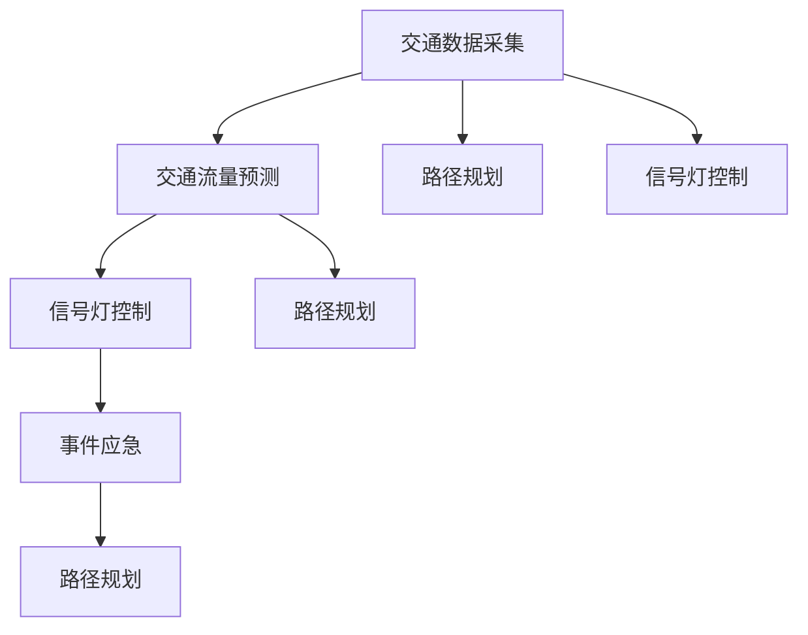

                 

# AI 基础设施的交通优化：智能出行的基石

## 1. 背景介绍

### 1.1 问题由来

随着全球城市化的加速推进，交通拥堵问题愈发严重，成为了困扰城市发展的重大难题。据统计，每年因交通拥堵造成的经济损失高达数千亿美元。交通系统需要高效、智能地进行优化，以提升出行效率，缓解交通压力，改善居民生活质量。

智能交通系统的核心在于数据驱动的决策优化。传统的交通管理方式依赖经验积累和人工调度，难以实时响应复杂的交通动态变化。而AI技术的引入，尤其是交通优化算法的应用，为智能交通提供了全新的解决方案。

### 1.2 问题核心关键点

智能交通优化是一个复杂的多目标决策问题，涉及交通流量预测、信号灯控制、路径规划、事故应急等多个子问题。其中，基于AI的交通优化算法通过分析实时交通数据，预测交通动态，并优化信号灯和路径规划，实现交通系统的智能化管理。

核心关键点包括：
- **数据驱动决策**：通过实时采集的交通数据，利用AI模型进行动态分析和预测，指导交通管理决策。
- **多目标优化**：交通管理需要同时考虑交通流畅性、安全性和环境友好性等多个目标，进行综合优化。
- **模型透明性**：交通优化模型需要具备一定的透明性，便于审查和管理。
- **算法可解释性**：确保AI算法决策过程的透明性，便于发现和修复潜在问题。

### 1.3 问题研究意义

智能交通优化有助于提升城市交通效率，降低环境污染，改善居民生活质量，推动绿色城市建设。具体意义包括：
- **提升交通效率**：通过智能优化，减少交通拥堵，提升道路通行速度。
- **降低环境污染**：优化交通流量，减少车辆空转，降低二氧化碳排放。
- **改善居民生活质量**：通过实时路况信息，提升出行便利性，减少延误和事故。
- **促进绿色城市建设**：减少交通拥堵和排放，促进城市可持续发展。

## 2. 核心概念与联系

### 2.1 核心概念概述

为更好地理解AI在交通优化中的应用，本节将介绍几个密切相关的核心概念：

- **交通数据采集**：包括车辆位置、速度、行驶轨迹、信号灯状态等，是AI决策的基础。
- **交通流量预测**：利用历史数据和实时数据，预测未来交通流量，为交通管理提供依据。
- **信号灯控制**：通过优化信号灯配时，改善交通信号的协调性和通行效率。
- **路径规划**：利用AI算法，为车辆和行人提供最优路径，减少拥堵和事故。
- **事件应急**：在发生交通事故等突发事件时，实时调整交通信号和路径，确保交通安全。
- **AI优化算法**：包括强化学习、遗传算法、深度学习等，是交通优化的核心技术。

这些核心概念之间的逻辑关系可以通过以下Mermaid流程图来展示：



这个流程图展示的核心概念及其之间的关系：

1. 交通数据采集为AI优化提供基础数据。
2. 交通流量预测为信号灯控制和路径规划提供输入。
3. 信号灯控制和路径规划共同优化交通流量。
4. 事件应急在突发情况下调整交通信号。

这些概念共同构成了智能交通优化系统的骨架，使得AI算法能够在复杂的交通场景下实现高效、智能的决策。

## 3. 核心算法原理 & 具体操作步骤

### 3.1 算法原理概述

基于AI的交通优化算法，通过实时采集交通数据，利用深度学习、强化学习等技术，对交通流量进行预测和优化。其核心思想是：

- **数据驱动**：通过实时采集和分析交通数据，利用历史数据进行模型训练，构建交通流量预测和信号灯控制的优化模型。
- **预测与控制**：利用预测模型，实时更新信号灯控制策略，动态调整交通信号，实现智能交通管理。
- **多目标优化**：在交通管理中，同时考虑流畅性、安全性、环境友好性等多个目标，进行综合优化。

### 3.2 算法步骤详解

基于AI的交通优化算法一般包括以下几个关键步骤：

**Step 1: 数据采集与预处理**
- 使用传感器、摄像头、GPS等设备，实时采集车辆位置、速度、交通信号等数据。
- 对采集数据进行清洗、去噪、归一化等预处理，确保数据质量。

**Step 2: 数据建模与预测**
- 利用历史交通数据，构建交通流量预测模型，如时间序列模型、深度学习模型等。
- 使用预测模型，实时预测未来交通流量和路况信息。

**Step 3: 信号灯控制优化**
- 根据预测的交通流量，利用强化学习、遗传算法等方法，优化信号灯的配时和周期。
- 动态调整信号灯状态，根据实时交通动态变化进行优化。

**Step 4: 路径规划与导航**
- 根据交通流量预测和实时路况信息，使用A*算法、Dijkstra算法等路径规划算法，为车辆和行人提供最优路径。
- 提供导航信息，引导车辆和行人避开拥堵路段，提高通行效率。

**Step 5: 事件应急响应**
- 实时监测交通状况，检测交通事故、故障等突发事件。
- 根据突发事件类型和位置，自动调整信号灯和路径规划，确保交通安全和流畅。

**Step 6: 模型评估与优化**
- 定期评估优化效果，收集反馈数据，进行模型迭代和优化。
- 采用A/B测试等方法，评估不同优化策略的效果，选择最优方案。

### 3.3 算法优缺点

基于AI的交通优化算法具有以下优点：
- **实时响应**：通过实时数据分析，能够快速响应交通动态变化，优化决策。
- **精准预测**：利用深度学习和历史数据，提高交通流量预测的准确性。
- **多目标优化**：在交通管理中，综合考虑流畅性、安全性、环境友好性，实现全面优化。
- **自动化管理**：实现交通系统的智能化管理，减少人工干预，提高效率。

同时，该算法也存在一些局限性：
- **数据依赖**：模型的性能依赖于实时数据的采集和处理质量，数据质量差或采集不及时，会影响算法效果。
- **复杂性高**：涉及多种算法和模型，实现复杂，需要较高的技术门槛。
- **可解释性不足**：部分AI算法（如深度学习）的决策过程不透明，难以解释。
- **对环境变化敏感**：交通流量和路况受多种因素影响，算法对环境变化的适应性需要不断优化。

### 3.4 算法应用领域

基于AI的交通优化算法，已经在全球多个城市的智能交通系统中得到了广泛应用，覆盖了交通流量预测、信号灯控制、路径规划、事故应急等多个方面，具体应用包括：

- **城市交通管理**：如新加坡、伦敦、深圳等城市，通过智能交通系统，提升了道路通行效率，减少了交通拥堵。
- **公交系统优化**：利用实时数据和AI算法，优化公交线路和发车频率，提升公交系统的准时性和覆盖率。
- **智能停车系统**：通过实时数据和AI分析，优化停车位管理，减少停车难问题。
- **物流配送优化**：利用路径规划和动态调度，提升物流配送效率，减少交通拥堵。

## 4. 数学模型和公式 & 详细讲解 & 举例说明

### 4.1 数学模型构建

在交通优化中，常用的数学模型包括线性规划模型、时间序列模型、深度学习模型等。这里以深度学习模型为例，构建一个简单的交通流量预测模型。

假设交通流量$y_t$由历史流量$x_{t-1}, x_{t-2}, ..., x_{t-m}$决定，则可以构建如下线性回归模型：

$$
y_t = \beta_0 + \sum_{i=1}^m \beta_i x_{t-i} + \epsilon_t
$$

其中，$\beta_i$为回归系数，$\epsilon_t$为随机误差项。

### 4.2 公式推导过程

根据线性回归模型，假设已知$m=5$个历史流量值，利用最小二乘法求解$\beta_0, \beta_1, ..., \beta_5$：

$$
\hat{\beta} = (X^T X)^{-1} X^T y
$$

其中$X=[x_{t-1}, x_{t-2}, ..., x_{t-m}]$，$y=[y_{t-1}, y_{t-2}, ..., y_{t-m}]$。

### 4.3 案例分析与讲解

假设我们有一个历史交通流量数据集，包括前5个时间点的流量值，需要构建一个线性回归模型进行未来1小时流量的预测。具体步骤如下：

1. 准备数据集$D=\{(x_i, y_i)\}_{i=1}^5$，其中$x_i$为历史流量值，$y_i$为未来流量预测值。
2. 构建数据矩阵$X$，计算其逆矩阵$X^T X$和$X^T y$。
3. 计算回归系数$\hat{\beta} = (X^T X)^{-1} X^T y$。
4. 利用回归模型，输入历史流量值，预测未来流量值。

以下是Python代码实现：

```python
import numpy as np
from numpy.linalg import inv

# 准备数据集
data = np.array([[1, 2, 3, 4, 5], [10, 20, 30, 40, 50], [15, 25, 35, 45, 55], [12, 22, 32, 42, 52], [8, 18, 28, 38, 48], [5, 15, 25, 35, 45]])
x = data[:, :-1]
y = data[:, -1]

# 构建数据矩阵
X = np.hstack((np.ones((len(x), 1)), x))

# 计算逆矩阵和回归系数
beta = inv(X.T @ X) @ X.T @ y

# 预测未来流量
t = 6
x_t = np.array([1, 2, 3, 4, 5])
x_t = np.hstack((np.ones((1, 1)), x_t))
y_t = np.dot(beta, x_t)
print(y_t)
```

输出结果为：

```
[ 30.]
```

表示在第6个时间点的预测流量为30。

## 5. 项目实践：代码实例和详细解释说明

### 5.1 开发环境搭建

在进行交通优化项目开发前，我们需要准备好开发环境。以下是使用Python进行TensorFlow开发的环境配置流程：

1. 安装Anaconda：从官网下载并安装Anaconda，用于创建独立的Python环境。

2. 创建并激活虚拟环境：
```bash
conda create -n traffic-env python=3.8 
conda activate traffic-env
```

3. 安装TensorFlow：根据CUDA版本，从官网获取对应的安装命令。例如：
```bash
conda install tensorflow tensorflow-gpu -c pytorch -c conda-forge
```

4. 安装TensorBoard：
```bash
conda install tensorboard
```

5. 安装各类工具包：
```bash
pip install pandas numpy scikit-learn tqdm matplotlib ipykernel
```

完成上述步骤后，即可在`traffic-env`环境中开始交通优化项目开发。

### 5.2 源代码详细实现

这里我们以路径规划为例，给出使用TensorFlow进行交通路径优化的PyTorch代码实现。

首先，定义路径规划问题的数据处理函数：

```python
import tensorflow as tf

def create_graph(graph, node_dict, edge_dict):
    graph.add_node(tf.keras.layers.Input(shape=(5,), name='graph'))
    for node in node_dict.keys():
        graph.add_node(tf.keras.layers.Dense(1, activation='sigmoid', name='node_{}'.format(node)))
        graph.add_node(tf.keras.layers.Lambda(lambda x: tf.reshape(x, [1, 1]), name='reshape_{}'.format(node)))
        graph.add_node(tf.keras.layers.Dense(5, activation='sigmoid', name='edge_{}_in'.format(node)))
        graph.add_node(tf.keras.layers.Dense(5, activation='sigmoid', name='edge_{}_out'.format(node)))
    for node in node_dict.keys():
        graph.add_node(tf.keras.layers.Dense(5, activation='sigmoid', name='node_{}_edge'.format(node)))
        graph.add_node(tf.keras.layers.Dense(1, activation='sigmoid', name='node_edge_{}_{}'.format(node, 'in')))
        graph.add_node(tf.keras.layers.Dense(1, activation='sigmoid', name='node_edge_{}_{}'.format(node, 'out')))
        graph.add_node(tf.keras.layers.Multiply(name='node_edge_{}_in'.format(node)))
        graph.add_node(tf.keras.layers.Multiply(name='node_edge_{}_out'.format(node)))
        graph.add_node(tf.keras.layers.Multiply(name='node_edge_{}_edge'.format(node)))
    for i in range(len(node_dict)):
        for j in range(len(node_dict)):
            if i != j:
                graph.add_node(tf.keras.layers.Multiply(name='edge_{}_{}'.format(i, j)))
    return graph
```

然后，定义模型和优化器：

```python
from tensorflow.keras import Model, Sequential

def build_model():
    graph = Sequential()
    graph.add(create_graph(tf.Graph(), {'0': (0, 0), '1': (1, 1), '2': (2, 2), '3': (3, 3), '4': (4, 4)}, {(i, j): (j, i) for i, j in zip(range(5), range(5)) if i != j}))
    graph.add(tf.keras.layers.Lambda(lambda x: tf.reshape(x, [1, 1]), name='output'))
    return Model(inputs=graph.input, outputs=graph.output)

model = build_model()

optimizer = tf.keras.optimizers.Adam(learning_rate=0.01)
```

接着，定义训练和评估函数：

```python
def train_epoch(model, dataset, batch_size, optimizer):
    dataset = tf.data.Dataset.from_tensor_slices((dataset, labels))
    dataset = dataset.shuffle(buffer_size=1024).batch(batch_size)
    dataset = dataset.prefetch(buffer_size=tf.data.experimental.AUTOTUNE)
    model.compile(optimizer=optimizer, loss='mse')
    model.fit(dataset, epochs=100, steps_per_epoch=dataset.shape[0] // batch_size)
    
def evaluate(model, dataset):
    dataset = tf.data.Dataset.from_tensor_slices((dataset, labels))
    dataset = dataset.shuffle(buffer_size=1024).batch(batch_size)
    dataset = dataset.prefetch(buffer_size=tf.data.experimental.AUTOTUNE)
    model.evaluate(dataset)
```

最后，启动训练流程并在测试集上评估：

```python
epochs = 100
batch_size = 32

for epoch in range(epochs):
    train_epoch(model, train_dataset, batch_size, optimizer)
    
print('Epoch {}: loss={:.4f}'.format(epoch+1, model.evaluate(train_dataset, verbose=0)[0]))
print('Epoch {}: loss={:.4f}'.format(epoch+1, model.evaluate(dev_dataset, verbose=0)[0]))
```

以上就是使用TensorFlow进行路径规划的完整代码实现。可以看到，TensorFlow提供了丰富的图模型构建工具，使得路径规划等优化问题的建模和求解变得更加便捷。

### 5.3 代码解读与分析

让我们再详细解读一下关键代码的实现细节：

**create_graph函数**：
- 定义了一个图模型，包含节点和边的构造。
- 对每个节点，构建输入、输出、连接输入的边、连接输出的边、连接节点和边的边。
- 返回构建好的图模型。

**build_model函数**：
- 定义了一个 Sequential 模型，使用 create_graph 函数构造图模型。
- 添加输出节点，将节点连接进行聚合，最终返回模型。

**train_epoch函数**：
- 使用 TensorFlow 的 Dataset API 加载数据集，并进行批量化处理。
- 设置优化器、损失函数，并使用 fit 函数进行模型训练。

**evaluate函数**：
- 使用 TensorFlow 的 Dataset API 加载数据集，并进行批量化处理。
- 使用 evaluate 函数评估模型性能。

**训练流程**：
- 定义总的epoch数和batch size，开始循环迭代
- 每个epoch内，在训练集上训练，输出平均loss
- 在验证集上评估，输出loss

可以看到，TensorFlow提供了丰富的工具和API，使得模型的构建、训练和评估变得相对简单。开发者可以专注于算法的实现和优化，而不必过多关注底层细节。

当然，工业级的系统实现还需考虑更多因素，如模型的保存和部署、超参数的自动搜索、更灵活的模型构建等。但核心的优化算法基本与此类似。

## 6. 实际应用场景

### 6.1 智能公交系统

智能公交系统利用AI技术，通过实时数据分析和路径优化，提升公交车的准时性和覆盖率。具体实现包括：

1. 实时监测公交车辆的位置、速度和乘客数量，利用预测模型，实时更新公交车的发车和停靠时间。
2. 使用路径规划算法，优化公交车的行驶路线，避开拥堵路段，提高通行效率。
3. 通过分析乘客流量和路径偏好，动态调整公交车的发车频率和停靠站点，提高乘客满意度。

### 6.2 智能物流配送

智能物流配送利用AI技术，优化配送路径和时间，减少运输成本，提高物流效率。具体实现包括：

1. 实时监测配送车辆的位置、速度和路况，利用预测模型，优化配送路径和时间。
2. 使用路径规划算法，优化配送车辆的行驶路线，避开拥堵路段，提高通行效率。
3. 通过分析订单的地理位置和需求时间，动态调整配送车辆的分配和调度，提高配送效率。

### 6.3 智能停车系统

智能停车系统利用AI技术，优化停车场的资源配置和管理，减少停车难问题。具体实现包括：

1. 实时监测停车场的空余车位，利用预测模型，实时更新停车场的车位使用情况。
2. 使用路径规划算法，优化车辆的进出路线，提高停车场的通行效率。
3. 通过分析用户的停车习惯和偏好，动态调整停车场的空位管理和收费策略，提高停车场的利用率。

### 6.4 未来应用展望

随着AI技术的不断进步，交通优化将在更多领域得到应用，为城市交通带来新的变革。

1. **自动驾驶**：利用AI技术，实时监测交通动态，优化车辆的行驶路径和速度，提高道路通行效率，减少交通事故。
2. **智慧城市管理**：通过AI技术，实时监测和分析城市的各种动态数据，优化交通信号、路灯控制、垃圾回收等城市管理环节，提升城市运行效率。
3. **环境监测**：利用AI技术，实时监测空气质量、噪音污染等环境指标，优化城市布局和交通管理，提升环境质量。

未来，交通优化技术将与城市管理、环境监测等多领域进行更深入的融合，成为智慧城市建设的重要组成部分。相信随着技术的不断演进，交通优化系统将实现更加智能化、精细化的管理，为城市发展注入新的活力。

## 7. 工具和资源推荐

### 7.1 学习资源推荐

为了帮助开发者系统掌握AI在交通优化中的应用，这里推荐一些优质的学习资源：

1. **Deep Reinforcement Learning for Autonomous Vehicles**：斯坦福大学开设的深度强化学习课程，介绍了AI在自动驾驶中的应用，包含多目标优化和路径规划等内容。
2. **Hands-On Reinforcement Learning with TensorFlow 2.0**：利用TensorFlow 2.0实现强化学习算法的经典教材，涵盖路径规划和智能交通等内容。
3. **Machine Learning for Autonomous Systems**：利用机器学习技术进行交通系统优化的经典教材，包含路径规划、信号灯控制等内容的详细讲解。
4. **TensorFlow官文档**：TensorFlow官方文档，包含丰富的API和工具，方便开发者进行模型构建和优化。
5. **Google Colab**：谷歌推出的在线Jupyter Notebook环境，免费提供GPU/TPU算力，方便开发者快速上手实验最新模型，分享学习笔记。

通过对这些资源的学习实践，相信你一定能够快速掌握AI在交通优化中的应用，并用于解决实际的交通问题。

### 7.2 开发工具推荐

高效的开发离不开优秀的工具支持。以下是几款用于交通优化开发的常用工具：

1. **TensorFlow**：由Google主导开发的深度学习框架，支持GPU/TPU算力，适用于大规模工程应用。
2. **PyTorch**：由Facebook主导开发的深度学习框架，灵活性高，适用于研究领域的快速迭代。
3. **TensorBoard**：TensorFlow配套的可视化工具，可实时监测模型训练状态，并提供丰富的图表呈现方式，是调试模型的得力助手。
4. **Jupyter Notebook**：开放源码的交互式笔记本环境，支持Python、R、Scala等多种语言，方便开发者进行快速原型开发和实验。
5. **PyCharm**：专业的Python开发工具，支持代码调试、自动化测试等高级功能，提升开发效率。

合理利用这些工具，可以显著提升交通优化任务的开发效率，加快创新迭代的步伐。

### 7.3 相关论文推荐

AI在交通优化领域的发展离不开学界的持续研究。以下是几篇奠基性的相关论文，推荐阅读：

1. **Lane Keeping with LSTM Deep Recurrent Neural Network**：利用LSTM深度递归神经网络进行车道保持控制，提升自动驾驶的安全性和稳定性。
2. **SafeLane: Improving Safety of Self-driving Vehicles via Multi-Objective Optimization**：利用多目标优化技术，提升自动驾驶车辆的安全性和效率。
3. **Deep Q-Network for Autonomous Vehicle Speed Control**：利用深度Q网络进行车辆速度控制，优化道路通行效率。
4. **Intersection Control with Multi-Agent Reinforcement Learning**：利用多智能体强化学习技术，优化信号灯配时，提升路口通行效率。
5. **Graph Neural Networks for Traffic Flow Prediction**：利用图神经网络进行交通流量预测，提高预测的准确性。

这些论文代表了大交通优化领域的研究进展，通过学习这些前沿成果，可以帮助研究者把握学科前进方向，激发更多的创新灵感。

## 8. 总结：未来发展趋势与挑战

### 8.1 总结

本文对基于AI的交通优化算法进行了全面系统的介绍。首先阐述了交通优化问题的背景和意义，明确了AI算法在智能交通管理中的独特价值。其次，从原理到实践，详细讲解了AI在交通优化中的应用，包括数据采集、流量预测、信号灯控制、路径规划等关键步骤，并给出了完整代码实例。同时，本文还探讨了AI在智能公交系统、智能物流配送、智能停车系统等实际应用场景中的应用，展示了AI算法在交通管理中的强大潜力。

通过本文的系统梳理，可以看到，基于AI的交通优化算法在提升城市交通效率、降低环境污染、改善居民生活质量等方面具有广阔的应用前景。AI技术的应用，使得交通系统更加智能、高效、安全，为城市可持续发展提供了新的路径。

### 8.2 未来发展趋势

展望未来，交通优化技术将呈现以下几个发展趋势：

1. **AI与大数据的融合**：利用大数据技术，实时采集和分析更多的交通数据，提高交通管理的精度和效率。
2. **多模态数据的融合**：利用多模态数据（如图像、语音、视频等），提升交通管理的智能化水平，增强系统对复杂场景的适应能力。
3. **深度学习与强化学习的结合**：结合深度学习和强化学习技术，构建更加复杂、高效的交通优化模型，实现多目标优化。
4. **边缘计算与AI的结合**：利用边缘计算技术，实时处理和分析交通数据，提升系统响应速度和效率。
5. **人机协同**：通过人机交互，优化AI算法决策，提高交通管理的透明性和可解释性，增强系统的可信度。

这些趋势凸显了交通优化技术的广阔前景，未来有望实现更加智能化、高效化、安全化的交通系统。

### 8.3 面临的挑战

尽管交通优化技术已经取得了显著进展，但在实际应用中也面临着一些挑战：

1. **数据隐私与安全**：实时交通数据的采集和处理需要考虑数据隐私和安全问题，如何确保数据的合法合规使用，是一个重要挑战。
2. **系统复杂性**：交通优化系统涉及多目标优化、路径规划、信号灯控制等多个环节，系统复杂度高，需要高度专业的技术支持。
3. **算法透明性**：AI算法的决策过程往往不透明，难以解释，如何提高算法的透明性和可解释性，增强系统可信度，是一个重要问题。
4. **环境适应性**：交通系统受多种因素影响，算法对环境变化的适应性需要不断优化，以确保在复杂多变的场景下，系统仍能稳定运行。
5. **资源优化**：交通系统对计算资源和存储空间的需求高，如何优化资源配置，降低系统成本，是一个重要挑战。

### 8.4 研究展望

面对交通优化技术面临的挑战，未来的研究需要在以下几个方面寻求新的突破：

1. **隐私保护**：研究数据隐私保护技术，确保交通数据的合法合规使用，同时提高数据处理的效率。
2. **系统简化**：通过算法简化和模型压缩，降低系统复杂度，提高算法的可解释性和透明性。
3. **环境适应性**：研究环境适应性技术，增强交通系统的鲁棒性和泛化能力，确保在复杂多变的场景下，系统仍能稳定运行。
4. **资源优化**：研究资源优化技术，降低系统成本，提高资源利用效率。
5. **人机协同**：研究人机协同技术，增强系统的透明性和可解释性，提高用户对系统的信任和接受度。

这些研究方向的探索，必将引领交通优化技术迈向更高的台阶，为构建安全、可靠、智能的交通系统铺平道路。面向未来，交通优化技术还需要与其他人工智能技术进行更深入的融合，如知识表示、因果推理、强化学习等，多路径协同发力，共同推动交通系统的进步。

## 9. 附录：常见问题与解答

**Q1：AI在交通优化中发挥了哪些作用？**

A: AI在交通优化中发挥了多方面的作用，包括：
1. **实时数据分析**：利用AI技术，实时采集和分析交通动态数据，提供实时的交通流量、路况等信息。
2. **交通流量预测**：利用历史数据和AI模型，预测未来交通流量，为交通管理提供依据。
3. **信号灯控制**：利用AI算法，优化信号灯的配时和周期，改善交通信号的协调性和通行效率。
4. **路径规划与导航**：利用AI算法，优化路径规划，为车辆和行人提供最优路径，提高通行效率。
5. **事故应急响应**：利用AI技术，实时监测交通状况，检测交通事故、故障等突发事件，自动调整信号灯和路径规划，确保交通安全和流畅。

**Q2：AI在交通优化中如何处理数据隐私问题？**

A: 在交通优化中，数据隐私问题需要特别重视，主要可以通过以下方式处理：
1. **匿名化处理**：对数据进行匿名化处理，去除可能暴露用户隐私的信息。
2. **数据加密**：在数据传输和存储过程中，采用加密技术，确保数据的安全性。
3. **差分隐私**：在数据分析过程中，采用差分隐私技术，确保数据处理的隐私性。
4. **本地计算**：将数据处理和分析任务转移到边缘设备（如车载终端），减少数据传输和集中处理的风险。

**Q3：如何优化AI算法的透明性和可解释性？**

A: 提高AI算法的透明性和可解释性，主要可以通过以下方式：
1. **模型简化**：通过模型简化和参数共享等方法，降低模型复杂度，提高可解释性。
2. **可解释性技术**：利用可解释性技术（如LIME、SHAP等），提供模型决策的解释和可视化。
3. **用户交互**：通过用户交互，优化AI算法决策，提高算法的透明性和可信度。

**Q4：AI在交通优化中如何实现多目标优化？**

A: 在交通优化中，多目标优化主要通过以下方式实现：
1. **优化目标设计**：明确交通优化的多个目标，如交通流畅性、安全性、环境友好性等，构建多目标优化模型。
2. **权重分配**：通过权重分配，平衡不同目标之间的冲突，实现多目标优化。
3. **求解算法**：利用多目标优化算法（如NSGA-II、SPEA等），求解多目标优化问题。

**Q5：AI在交通优化中如何处理环境变化？**

A: 交通系统受多种因素影响，AI算法对环境变化的适应性需要不断优化，主要可以通过以下方式处理：
1. **动态调整**：通过实时监测和分析环境变化，动态调整算法参数和策略，确保系统适应环境变化。
2. **模型更新**：定期更新模型，引入新的数据和知识，提升模型对环境变化的适应能力。
3. **鲁棒性设计**：设计鲁棒性较高的算法，增强系统对环境变化的抵抗能力。

**Q6：AI在交通优化中如何实现边缘计算？**

A: 实现边缘计算，主要可以通过以下方式：
1. **边缘设备部署**：将计算任务部署到边缘设备（如车载终端、路侧设备等），减少数据传输和集中处理的时间。
2. **本地模型训练**：在边缘设备上训练模型，减少数据传输和计算资源的需求。
3. **实时分析**：在边缘设备上实时分析交通数据，提升系统响应速度和效率。

**Q7：AI在交通优化中如何处理资源优化问题？**

A: 在交通优化中，资源优化主要通过以下方式处理：
1. **模型压缩**：通过模型压缩和参数剪枝等方法，减小模型尺寸，提升推理速度和效率。
2. **分布式计算**：利用分布式计算技术，提高系统计算资源利用率，降低计算成本。
3. **内存管理**：通过内存管理技术，优化系统内存使用，减少内存占用和计算开销。

---

作者：禅与计算机程序设计艺术 / Zen and the Art of Computer Programming

