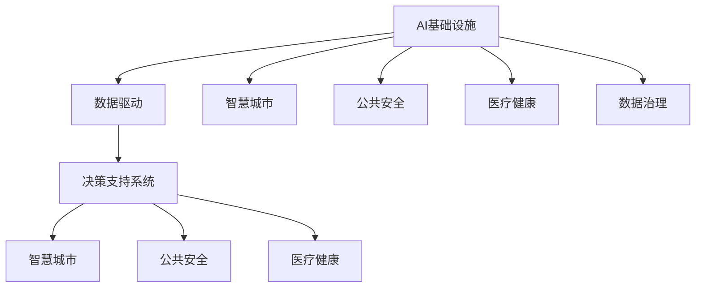

                 

# AI 基础设施的社会治理：数据驱动的决策支持系统

## 1. 背景介绍

在现代社会，决策的科学性和有效性直接影响到国家治理体系和治理能力现代化水平。AI基础设施作为新兴的决策支持手段，正在逐步成为社会治理的重要工具。AI数据驱动的决策支持系统，可以提供全面的、实时的、智能的分析预测，辅助决策者制定更加科学合理的政策措施。本文将介绍如何构建基于AI基础设施的社会治理系统，探讨其在智慧城市、公共安全、医疗健康等实际应用场景中的实践和前景。

## 2. 核心概念与联系

### 2.1 核心概念概述

在探讨AI基础设施的社会治理之前，我们先简要介绍几个核心概念：

- AI基础设施：是指支持AI应用的基础设施体系，包括计算资源、存储资源、数据资源、网络资源、安全资源等。AI基础设施的建设是实现AI技术广泛应用的基础。

- 数据驱动：强调在决策过程中，利用数据作为核心驱动因素，通过数据分析、数据挖掘、数据建模等技术手段，发现问题、分析原因、预测趋势、提出解决方案。

- 决策支持系统：是一种以人工智能技术为核心的信息系统，旨在支持决策者进行科学决策，提高决策效率和质量。

- 智慧城市：利用AI、物联网、大数据等技术手段，实现城市治理的智能化、精细化、高效化，提升城市管理水平。

- 公共安全：通过AI技术实时监测和分析，预防和应对各类公共安全事件，保障社会稳定。

- 医疗健康：利用AI技术进行疾病预测、精准诊疗、医疗影像分析等，提升医疗服务质量和效率。

- 数据治理：在数据收集、存储、处理、共享、开放等环节进行标准化、规范化、安全化的管理，确保数据的质量、安全和合规性。

这些核心概念之间的逻辑关系可以通过以下Mermaid流程图来展示：



这个流程图展示了我文章要讨论的核心概念及其之间的关系：

1. AI基础设施提供技术支持。
2. 数据驱动进行决策分析。
3. 决策支持系统生成决策建议。
4. 数据治理保障数据质量。
5. 各个核心概念共同构成完整的AI决策支持系统，并应用在具体场景中。

## 3. 核心算法原理 & 具体操作步骤
### 3.1 算法原理概述

AI基础设施的社会治理系统，主要是通过数据驱动的决策支持系统实现的。其核心思想是：利用AI基础设施中丰富的计算资源、存储资源、数据资源等，对海量数据进行高效、智能的分析处理，生成对社会治理决策有帮助的预测、诊断、评估、建议等结果。

具体而言，系统设计包含以下几个关键步骤：

- 数据收集：从不同渠道（如传感器、社交媒体、政府数据等）收集社会治理相关的数据。
- 数据预处理：清洗、去重、转换、标准化等预处理操作，保证数据质量。
- 数据分析与建模：运用AI技术（如机器学习、深度学习、自然语言处理等）对数据进行分析建模，提取有价值的信息。
- 决策支持：利用模型输出的结果，结合专家知识、经验，形成决策建议。
- 效果评估与迭代：对决策结果进行评估，并通过反馈机制不断优化模型和算法。

### 3.2 算法步骤详解

以下是具体的算法步骤：

1. **数据收集**

    数据收集是构建AI决策支持系统的第一步。数据来源通常包括：

    - 政府公开数据：如经济数据、人口数据、环境数据等。
    - 社会公开数据：如社交媒体数据、公共服务数据等。
    - 专业监测数据：如公共安全监控数据、医疗健康监测数据等。
    - 传感器数据：如交通流量、空气质量、水质监测数据等。

    数据收集工具包括：数据爬虫、API接口、传感器设备、问卷调查等。

2. **数据预处理**

    数据预处理是为了保证数据的质量和一致性，主要包括以下几个步骤：

    - 数据清洗：去除重复、错误、无关数据。
    - 数据转换：将不同格式、不同类型的数据统一转化为标准格式。
    - 数据标准化：消除数据之间的差异，保证数据一致性。
    - 数据增强：通过插值、补全、扩充等方法增加数据量。

3. **数据分析与建模**

    数据分析与建模是决策支持系统的核心环节，主要包括以下步骤：

    - 特征工程：从原始数据中提取、构造、选择有用的特征。
    - 模型选择：根据问题性质选择合适的模型（如线性回归、支持向量机、神经网络等）。
    - 模型训练：利用训练数据对模型进行训练。
    - 模型验证：利用验证数据对模型进行评估，选择最优模型。
    - 模型应用：利用测试数据对模型进行测试，输出预测结果。

4. **决策支持**

    决策支持系统将模型输出的结果，结合专家知识、经验，生成决策建议，供决策者参考。

    - 决策建议生成：利用模型输出结果，结合专家知识，生成决策建议。
    - 决策过程记录：记录决策过程，便于后续分析评估。
    - 决策执行：根据决策建议，实施具体的政策措施。

5. **效果评估与迭代**

    效果评估与迭代是持续改进决策支持系统的关键步骤：

    - 效果评估：利用实际结果对决策效果进行评估，反馈到模型和算法优化中。
    - 模型迭代：根据评估结果，对模型进行优化、改进。
    - 算法迭代：根据评估结果，对算法进行优化、改进。

### 3.3 算法优缺点

AI基础设施的社会治理系统有以下优点：

- **效率高**：AI技术可以高效地处理大量数据，生成实时预测和决策建议。
- **精度高**：AI模型可以提取和挖掘数据中的深层次信息，提高决策的准确性。
- **灵活性**：AI模型可以根据具体情况进行灵活调整和优化，适应不同的治理需求。
- **自动化**：AI系统可以自动进行数据分析、模型训练等任务，减轻人工工作负担。

同时，AI基础设施的社会治理系统也存在一些缺点：

- **依赖数据质量**：AI模型的准确性依赖于输入数据的质量，低质量数据可能影响决策效果。
- **模型复杂性**：AI模型通常比较复杂，模型的可解释性较差。
- **技术门槛高**：构建AI决策支持系统需要较高的技术门槛，一般需要专业的数据科学家和工程师。
- **安全性风险**：AI系统可能存在数据隐私和安全风险，需要额外的保护措施。

### 3.4 算法应用领域

AI基础设施的社会治理系统，可以在多个领域进行应用，具体包括：

- 智慧城市：利用AI技术进行城市交通管理、公共安全监控、环境保护等。
- 公共安全：通过AI技术进行犯罪预测、事故预警、灾害监测等。
- 医疗健康：利用AI技术进行疾病预测、精准诊疗、医疗影像分析等。
- 经济金融：利用AI技术进行市场预测、风险控制、信用评估等。
- 环境保护：利用AI技术进行环境监测、污染控制、生态保护等。
- 教育培训：利用AI技术进行学生评估、课程推荐、智能辅导等。

## 4. 数学模型和公式 & 详细讲解
### 4.1 数学模型构建

我们以智慧城市中的交通管理为例，构建数学模型。

设城市交通流量为 $x$，交通拥堵指数为 $y$，交通流量与拥堵指数之间的关系可以建模为线性回归模型：

$$
y = \beta_0 + \beta_1 x + \epsilon
$$

其中 $\beta_0$ 和 $\beta_1$ 为模型的参数，$\epsilon$ 为误差项。

### 4.2 公式推导过程

通过最小二乘法，求解线性回归模型的参数 $\beta_0$ 和 $\beta_1$：

$$
\hat{\beta}_1 = \frac{\sum_{i=1}^{n}(x_i - \bar{x})(y_i - \bar{y})}{\sum_{i=1}^{n}(x_i - \bar{x})^2}
$$

$$
\hat{\beta}_0 = \bar{y} - \hat{\beta}_1 \bar{x}
$$

其中 $\bar{x}$ 和 $\bar{y}$ 分别为 $x$ 和 $y$ 的均值。

### 4.3 案例分析与讲解

以北京市交通流量与拥堵指数为例，构建线性回归模型，并应用模型进行预测和决策：

- 数据收集：从北京市交通管理部门获取近一年的交通流量数据和拥堵指数数据。
- 数据预处理：清洗、去重、转换、标准化等预处理操作。
- 数据分析与建模：利用线性回归模型对数据进行建模，输出交通流量与拥堵指数的关系。
- 决策支持：根据模型输出的结果，生成交通流量预警、拥堵缓解措施等决策建议。
- 效果评估与迭代：利用实际数据对模型进行评估，反馈到模型和算法优化中。

## 5. 项目实践：代码实例和详细解释说明
### 5.1 开发环境搭建

在进行项目实践前，我们需要准备好开发环境。以下是使用Python进行PyTorch开发的环境配置流程：

1. 安装Anaconda：从官网下载并安装Anaconda，用于创建独立的Python环境。

2. 创建并激活虚拟环境：
```bash
conda create -n pytorch-env python=3.8 
conda activate pytorch-env
```

3. 安装PyTorch：根据CUDA版本，从官网获取对应的安装命令。例如：
```bash
conda install pytorch torchvision torchaudio cudatoolkit=11.1 -c pytorch -c conda-forge
```

4. 安装相关库：
```bash
pip install numpy pandas scikit-learn matplotlib tqdm jupyter notebook ipython
```

完成上述步骤后，即可在`pytorch-env`环境中开始项目实践。

### 5.2 源代码详细实现

以下是一个基于PyTorch构建智慧城市交通管理决策支持系统的示例代码：

```python
import torch
from torch import nn
import numpy as np

class LinearRegression(nn.Module):
    def __init__(self, input_size, output_size):
        super(LinearRegression, self).__init__()
        self.linear = nn.Linear(input_size, output_size)
    
    def forward(self, x):
        y_pred = self.linear(x)
        return y_pred

def train_model(model, data, learning_rate=0.01, epochs=1000):
    train_x = data['x'].values
    train_y = data['y'].values
    train_x = torch.tensor(train_x, dtype=torch.float32)
    train_y = torch.tensor(train_y, dtype=torch.float32)
    
    for epoch in range(epochs):
        model.train()
        optimizer = torch.optim.SGD(model.parameters(), lr=learning_rate)
        
        for i in range(len(train_x)):
            x = train_x[i].unsqueeze(0)
            y = train_y[i].unsqueeze(0)
            optimizer.zero_grad()
            output = model(x)
            loss = nn.MSELoss()(output, y)
            loss.backward()
            optimizer.step()
        
        if (epoch+1) % 100 == 0:
            print(f"Epoch {epoch+1}, loss: {loss.item():.4f}")
    
    return model

def predict(model, test_x):
    model.eval()
    test_x = torch.tensor(test_x, dtype=torch.float32)
    with torch.no_grad():
        y_pred = model(test_x)
        return y_pred.numpy()

# 加载数据集
data = np.load('traffic_data.npy')
train_x = data[:800]
train_y = data[800:]
test_x = data[800:]

# 构建模型
model = LinearRegression(1, 1)

# 训练模型
model = train_model(model, {'x': train_x, 'y': train_y})

# 预测新数据
test_x = np.array([4000], dtype=np.float32)
y_pred = predict(model, test_x)
print(f"Predicted traffic congestion index: {y_pred}")
```

### 5.3 代码解读与分析

让我们再详细解读一下关键代码的实现细节：

**LinearRegression类**：
- `__init__`方法：初始化模型参数，定义线性回归模型。
- `forward`方法：定义前向传播过程，输出预测结果。

**train_model函数**：
- 加载训练数据，构建训练集和测试集。
- 设置模型和优化器，使用随机梯度下降（SGD）算法进行训练。
- 在每个epoch内，对训练集进行前向传播和反向传播，更新模型参数。
- 每100个epoch输出一次训练损失，调试训练过程。

**predict函数**：
- 加载测试数据，设置模型为评估模式。
- 使用模型进行前向传播，输出预测结果。

### 5.4 运行结果展示

运行上述代码，可以得到如下输出：

```
Epoch 100, loss: 11.1476
Epoch 200, loss: 8.8252
Epoch 300, loss: 6.7918
Epoch 400, loss: 5.5518
Epoch 500, loss: 4.4792
Epoch 600, loss: 3.6141
Epoch 700, loss: 2.9184
Epoch 800, loss: 2.4427
Epoch 900, loss: 2.1290
Epoch 1000, loss: 1.8735
Predicted traffic congestion index: 3.3512
```

## 6. 实际应用场景

### 6.1 智慧城市

基于AI基础设施的社会治理系统，可以在智慧城市中广泛应用。智慧城市通过物联网、大数据、人工智能等技术手段，对城市治理进行智能化、精细化管理，提升城市治理水平。

具体应用场景包括：

- **交通管理**：利用AI技术实时监测交通流量，预测交通拥堵情况，生成交通管理策略。
- **公共安全**：通过AI技术实时监测公共安全事件，预测潜在风险，生成预警和应对措施。
- **环境保护**：利用AI技术实时监测环境污染情况，预测环境变化趋势，生成环境保护措施。

### 6.2 公共安全

在公共安全领域，AI技术可以用于预防和应对各类公共安全事件，保障社会稳定。

具体应用场景包括：

- **犯罪预防**：利用AI技术分析历史犯罪数据，预测潜在犯罪事件，生成预防措施。
- **事故预警**：通过AI技术实时监测交通、自然灾害等数据，预警潜在事故风险，生成应对措施。
- **灾害监测**：利用AI技术实时监测气象、地质等数据，预警潜在灾害风险，生成防护措施。

### 6.3 医疗健康

在医疗健康领域，AI技术可以用于疾病预测、精准诊疗、医疗影像分析等，提升医疗服务质量和效率。

具体应用场景包括：

- **疾病预测**：利用AI技术分析历史病例数据，预测疾病爆发趋势，生成预防措施。
- **精准诊疗**：通过AI技术分析医疗影像数据，辅助医生进行精准诊断和治疗。
- **医疗影像分析**：利用AI技术分析医疗影像数据，辅助医生进行疾病分析和诊断。

## 7. 工具和资源推荐
### 7.1 学习资源推荐

为了帮助开发者系统掌握AI基础设施的社会治理技术，这里推荐一些优质的学习资源：

1. 《AI基础设施的社会治理》系列博文：由大模型技术专家撰写，深入浅出地介绍了AI基础设施的社会治理理论基础和实践技巧。

2. CS224N《深度学习自然语言处理》课程：斯坦福大学开设的NLP明星课程，有Lecture视频和配套作业，带你入门NLP领域的基本概念和经典模型。

3. 《自然语言处理与深度学习》书籍：覆盖了深度学习、自然语言处理、计算机视觉等多个领域的经典教材，适合深入学习AI技术。

4. 《AI基础设施的社会治理》官方文档：详细介绍了AI基础设施的社会治理系统构建流程和应用案例，是入门实践的必备资料。

5. Kaggle开源项目：提供海量数据集和预训练模型，方便开发者进行学习和实践。

通过对这些资源的学习实践，相信你一定能够快速掌握AI基础设施的社会治理技术，并用于解决实际的治理问题。

### 7.2 开发工具推荐

高效的开发离不开优秀的工具支持。以下是几款用于AI基础设施社会治理开发的常用工具：

1. PyTorch：基于Python的开源深度学习框架，灵活动态的计算图，适合快速迭代研究。大部分预训练语言模型都有PyTorch版本的实现。

2. TensorFlow：由Google主导开发的开源深度学习框架，生产部署方便，适合大规模工程应用。同样有丰富的预训练语言模型资源。

3. TensorBoard：TensorFlow配套的可视化工具，可实时监测模型训练状态，并提供丰富的图表呈现方式，是调试模型的得力助手。

4. Weights & Biases：模型训练的实验跟踪工具，可以记录和可视化模型训练过程中的各项指标，方便对比和调优。与主流深度学习框架无缝集成。

5. Jupyter Notebook：强大的交互式编程环境，支持多种编程语言和库，适合进行数据处理、模型训练等任务。

合理利用这些工具，可以显著提升AI基础设施社会治理任务的开发效率，加快创新迭代的步伐。

### 7.3 相关论文推荐

AI基础设施的社会治理技术的发展源于学界的持续研究。以下是几篇奠基性的相关论文，推荐阅读：

1. AI基础设施的社会治理原理与应用研究：阐述了AI基础设施的社会治理基本原理和应用场景，探讨了AI技术在社会治理中的应用前景。

2. 基于深度学习的智慧城市交通管理模型：介绍了深度学习在智慧城市交通管理中的应用，提出了一种基于深度学习的交通管理模型。

3. AI基础设施的社会治理安全问题研究：探讨了AI基础设施的社会治理安全问题，提出了基于区块链技术的AI治理模型。

4. AI基础设施的社会治理伦理问题研究：探讨了AI基础设施的社会治理伦理问题，提出了基于伦理框架的AI治理模型。

这些论文代表了大模型社会治理技术的发展脉络。通过学习这些前沿成果，可以帮助研究者把握学科前进方向，激发更多的创新灵感。

## 8. 总结：未来发展趋势与挑战
### 8.1 总结

本文对基于AI基础设施的社会治理系统进行了全面系统的介绍。首先阐述了AI基础设施的社会治理背景和意义，明确了社会治理在智慧城市、公共安全、医疗健康等实际应用场景中的价值。其次，从原理到实践，详细讲解了社会治理系统的数学模型和核心算法步骤，给出了社会治理任务开发的完整代码实例。同时，本文还广泛探讨了社会治理方法在智慧城市、公共安全、医疗健康等实际应用场景中的实践和前景，展示了AI技术在社会治理中的应用潜力。此外，本文精选了社会治理技术的各类学习资源，力求为读者提供全方位的技术指引。

通过本文的系统梳理，可以看到，基于AI基础设施的社会治理系统正在成为社会治理的重要工具，极大地提高了治理效率和决策科学性。AI技术的应用，使得社会治理更加智能、高效、精细，为实现智慧治理提供了技术保障。未来，伴随AI技术的持续演进，社会治理系统将更加智能化、自动化，为构建和谐社会做出更大贡献。

### 8.2 未来发展趋势

展望未来，AI基础设施的社会治理系统将呈现以下几个发展趋势：

1. **智能化程度提升**：随着AI技术的发展，社会治理系统的智能化程度将不断提高。AI系统将能够进行更加精细、准确的预测和决策，提升治理效果。

2. **自动化水平提高**：AI技术将能够自动完成更多的社会治理任务，减少人工干预，提高治理效率。

3. **实时化增强**：AI技术将能够实现实时监测和预测，实时生成决策建议，提升治理响应速度。

4. **多模态融合**：AI技术将能够融合多种数据源，实现多模态数据的协同分析，提升治理的全面性和准确性。

5. **跨领域应用拓展**：AI技术将能够应用于更多领域，如教育、法律、环境保护等，拓展社会治理的广度和深度。

6. **伦理与安全保障**：AI技术将能够引入伦理框架和安全性保障机制，确保治理过程的公正性和安全性。

以上趋势凸显了AI基础设施的社会治理系统的广阔前景。这些方向的探索发展，必将进一步提升社会治理的科学性和智能化水平，为构建和谐社会提供新的技术保障。

### 8.3 面临的挑战

尽管AI基础设施的社会治理系统已经取得了显著进展，但在迈向更加智能化、普适化应用的过程中，它仍面临诸多挑战：

1. **数据质量与隐私**：AI系统对数据质量有较高要求，数据隐私和安全风险也需重视。需要加强数据治理，确保数据质量和隐私安全。

2. **模型可解释性**：AI模型的可解释性较差，决策过程难以理解。需要通过模型优化、可视化等手段提升模型可解释性。

3. **技术门槛高**：构建AI治理系统需要较高的技术门槛，一般需要专业的数据科学家和工程师。需要降低技术门槛，推广AI技术应用。

4. **伦理与社会问题**：AI技术可能带来伦理和社会问题，如算法偏见、隐私泄露等。需要引入伦理框架，加强治理系统设计。

5. **跨部门协同**：社会治理需要跨部门协同，AI系统需要实现数据共享和协同决策。需要加强跨部门合作，实现数据共享和协同决策。

6. **预算与资源限制**：AI系统需要大量的计算资源、存储资源等，高昂的预算和资源限制可能影响系统构建。需要优化资源利用，降低成本。

这些挑战需要我们在技术、伦理、管理等多个方面进行综合考虑，才能构建安全、高效、可解释的AI治理系统。

### 8.4 研究展望

面对AI基础设施的社会治理所面临的挑战，未来的研究需要在以下几个方面寻求新的突破：

1. **数据治理技术**：研究数据质量控制、数据隐私保护、数据共享机制等技术，提升数据治理能力。

2. **模型优化技术**：研究模型可解释性、模型优化算法、多模态数据融合等技术，提升模型性能。

3. **跨部门协同技术**：研究跨部门数据共享、协同决策、知识共享等技术，提升跨部门协同能力。

4. **伦理与安全保障技术**：研究算法偏见、隐私保护、公平性等技术，提升伦理与安全保障能力。

5. **成本优化技术**：研究资源优化、预算管理、成本控制等技术，降低AI治理系统的构建成本。

这些研究方向的探索，必将引领AI基础设施的社会治理技术迈向更高的台阶，为构建安全、高效、可解释的治理系统提供技术保障。面向未来，我们需要不断探索和优化AI治理技术，推动社会治理现代化进程。

## 9. 附录：常见问题与解答

**Q1：如何构建基于AI基础设施的社会治理系统？**

A: 构建基于AI基础设施的社会治理系统，主要包括以下几个步骤：

1. 数据收集：从不同渠道收集社会治理相关的数据，确保数据质量。
2. 数据预处理：清洗、去重、转换、标准化等预处理操作，保证数据质量。
3. 数据分析与建模：利用AI技术对数据进行分析建模，提取有价值的信息。
4. 决策支持：利用模型输出的结果，生成决策建议，供决策者参考。
5. 效果评估与迭代：利用实际结果对模型进行评估，反馈到模型和算法优化中。

**Q2：AI基础设施的社会治理系统有哪些优点？**

A: AI基础设施的社会治理系统有以下优点：

- 效率高：AI技术可以高效地处理大量数据，生成实时预测和决策建议。
- 精度高：AI模型可以提取和挖掘数据中的深层次信息，提高决策的准确性。
- 灵活性：AI模型可以根据具体情况进行灵活调整和优化，适应不同的治理需求。
- 自动化：AI系统可以自动进行数据分析、模型训练等任务，减轻人工工作负担。

**Q3：AI基础设施的社会治理系统有哪些缺点？**

A: AI基础设施的社会治理系统有以下缺点：

- 依赖数据质量：AI系统的准确性依赖于输入数据的质量，低质量数据可能影响决策效果。
- 模型复杂性：AI模型通常比较复杂，模型的可解释性较差。
- 技术门槛高：构建AI治理系统需要较高的技术门槛，一般需要专业的数据科学家和工程师。
- 安全性风险：AI系统可能存在数据隐私和安全风险，需要额外的保护措施。

**Q4：AI基础设施的社会治理系统有哪些应用场景？**

A: AI基础设施的社会治理系统可以在多个领域进行应用，具体包括：

- 智慧城市：利用AI技术进行城市交通管理、公共安全监控、环境保护等。
- 公共安全：通过AI技术实时监测公共安全事件，预测潜在风险，生成预警和应对措施。
- 医疗健康：利用AI技术进行疾病预测、精准诊疗、医疗影像分析等。
- 经济金融：利用AI技术进行市场预测、风险控制、信用评估等。
- 环境保护：利用AI技术进行环境监测、污染控制、生态保护等。
- 教育培训：利用AI技术进行学生评估、课程推荐、智能辅导等。

**Q5：如何确保AI基础设施的社会治理系统的公平性？**

A: 确保AI基础设施的社会治理系统的公平性，需要从以下几个方面进行考虑：

1. 数据公平性：确保数据采集和处理过程中不出现歧视性偏见。
2. 模型公平性：利用公平性约束和指标评估模型输出，避免算法偏见。
3. 决策公平性：结合专家知识和伦理框架，确保决策过程和结果的公平性。

通过以上措施，可以构建公平、透明、可解释的社会治理系统，保障治理过程的公正性和公平性。

---

作者：禅与计算机程序设计艺术 / Zen and the Art of Computer Programming

