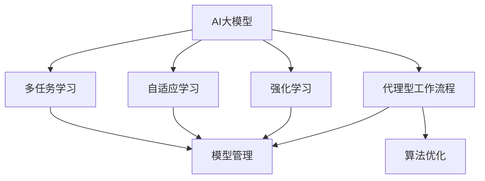

                 

# AI 大模型代理型工作流程 (Agentic workflow) 

> 关键词：AI大模型, 代理型工作流程, 多任务学习, 自适应学习, 强化学习, 模型管理, 算法优化

## 1. 背景介绍

随着人工智能技术的发展，AI大模型逐渐成为智能系统的重要组成部分。这些大模型，如BERT、GPT-3、T5等，拥有强大的语言理解与生成能力，可以应用于自然语言处理（NLP）、计算机视觉（CV）、语音识别（ASR）等多个领域。然而，如何在大模型与实际应用之间建立有效的连接，使其在各种场景下发挥最佳性能，成为一个亟待解决的问题。

代理型工作流程（Agentic workflow）应运而生，旨在构建一种智能代理，能够在大模型与实际任务之间充当桥梁，帮助模型自适应学习，提升应用效果。这种工作流程使得大模型能够灵活应对不同的任务需求，提供更加个性化的服务，从而实现其最大价值。

## 2. 核心概念与联系

### 2.1 核心概念概述

为了深入理解代理型工作流程，首先需对以下几个关键概念进行阐释：

- **AI大模型**：指通过大规模无标签数据预训练得到的大型神经网络模型。具有强大的自适应能力，能够进行复杂语言任务。
- **代理型工作流程**：指由智能代理（Agents）驱动的工作流程，通过在实际任务与大模型之间进行中介，提升模型的应用效果。
- **多任务学习**：指同时训练模型以解决多个任务，提高模型在多个任务上的泛化能力。
- **自适应学习**：指模型能够根据环境变化自发调整学习策略，以适应新的任务需求。
- **强化学习**：通过试错和奖励机制，训练模型在特定环境下做出最优决策的算法。
- **模型管理**：包括模型加载、优化、部署、监控等在内的全生命周期管理。
- **算法优化**：通过改进算法结构、参数设置等手段，提升模型性能。

### 2.2 核心概念原理和架构的 Mermaid 流程图

以下是一个简单的 Mermaid 流程图，用于展示上述概念之间的关系：



## 3. 核心算法原理 & 具体操作步骤

### 3.1 算法原理概述

代理型工作流程的核心在于通过智能代理，将大模型的能力和任务需求结合起来。智能代理不仅负责任务调度、参数配置，还能通过多任务学习、自适应学习、强化学习等手段，不断优化模型的应用效果。

这一过程可以大致分为以下几个步骤：

1. **模型初始化**：选择合适的预训练模型，根据任务需求进行微调。
2. **任务适配**：将任务与模型适配，设计合适的损失函数、输出层等。
3. **智能代理调度**：通过智能代理进行任务调度，选择合适的模型参数和训练策略。
4. **自适应学习与多任务学习**：根据任务需求和数据变化，智能代理自适应调整模型，同时支持多任务学习以提升模型泛化能力。
5. **强化学习优化**：使用强化学习技术，通过奖励机制和反馈，优化模型参数，提升应用效果。
6. **模型管理**：对模型进行生命周期管理，包括加载、优化、部署和监控。

### 3.2 算法步骤详解

以自然语言处理（NLP）中的问答系统为例，详细说明代理型工作流程的具体操作步骤：

**Step 1: 模型初始化**
- 选择预训练模型，如BERT、GPT-3等。
- 在模型基础上进行微调，以适应特定任务，如问答、文本分类、命名实体识别等。

**Step 2: 任务适配**
- 设计合适的任务适配层，包括输出层、损失函数等。
- 针对具体任务（如问答系统），设计合理的模型输入和输出格式。

**Step 3: 智能代理调度**
- 使用智能代理进行任务调度，选择合适的模型参数和训练策略。
- 根据任务需求和数据变化，自适应调整模型，同时支持多任务学习。

**Step 4: 自适应学习与多任务学习**
- 通过多任务学习，训练模型在多个任务上的泛化能力。
- 使用自适应学习，根据数据变化不断调整模型参数，以适应新任务。

**Step 5: 强化学习优化**
- 使用强化学习技术，通过奖励机制和反馈，优化模型参数，提升应用效果。
- 将强化学习应用于多任务学习，进一步提升模型泛化能力。

**Step 6: 模型管理**
- 对模型进行生命周期管理，包括加载、优化、部署和监控。
- 定期评估模型性能，进行参数更新和调整。

### 3.3 算法优缺点

**优点**：
- **灵活性**：智能代理能够根据任务需求自适应调整模型，提高模型应用效果。
- **泛化能力**：通过多任务学习，模型能够在多个任务上表现出色。
- **高效性**：强化学习技术能够通过奖励机制和反馈，快速优化模型参数，提升应用效果。
- **可扩展性**：模型管理机制能够对模型进行全生命周期管理，支持模型的持续优化和更新。

**缺点**：
- **复杂性**：智能代理和模型管理机制需要设计复杂的逻辑和算法。
- **资源消耗**：强化学习和大模型训练需要大量计算资源，存在资源消耗大的问题。
- **易过拟合**：自适应学习和多任务学习需要大量数据，存在过拟合风险。
- **部署难度**：模型的部署和监控需要一定技术和经验，存在部署难度大的问题。

### 3.4 算法应用领域

代理型工作流程在多个领域都有广泛的应用：

- **自然语言处理**：问答系统、文本分类、命名实体识别、机器翻译等。
- **计算机视觉**：图像分类、目标检测、图像生成等。
- **语音识别**：自动语音识别、语音合成、语音情感分析等。
- **推荐系统**：个性化推荐、内容推荐、广告推荐等。
- **智能客服**：对话系统、情感分析、意图识别等。
- **医疗健康**：疾病诊断、健康管理、药物研发等。
- **金融服务**：信用评估、风险预测、市场分析等。

## 4. 数学模型和公式 & 详细讲解

### 4.1 数学模型构建

在代理型工作流程中，数学模型主要涉及多任务学习、自适应学习和强化学习等算法。以多任务学习为例，其目标是最小化所有任务的总损失函数：

$$
\min_{\theta} \sum_{k=1}^K L_k(\theta)
$$

其中，$K$为任务数，$\theta$为模型参数。每个任务$k$的损失函数$L_k$可以是交叉熵损失、均方误差损失等。

### 4.2 公式推导过程

以二分类任务为例，推导多任务学习模型的损失函数。假设有两个任务，分别使用sigmoid函数作为输出层：

$$
\hat{y}_k = \sigma(W_k x + b_k), k \in \{1, 2\}
$$

其中，$x$为输入特征，$W_k$和$b_k$为任务$k$的模型参数。任务的标签$y_k$为0或1。

任务1的损失函数为：

$$
L_1(\theta) = -\frac{1}{N_1}\sum_{i=1}^{N_1}[y_1^{(i)}\log\hat{y}_1^{(i)} + (1-y_1^{(i)})\log(1-\hat{y}_1^{(i)})]
$$

任务2的损失函数为：

$$
L_2(\theta) = -\frac{1}{N_2}\sum_{i=1}^{N_2}[y_2^{(i)}\log\hat{y}_2^{(i)} + (1-y_2^{(i)})\log(1-\hat{y}_2^{(i)})
$$

多任务学习的目标是最小化所有任务的总损失函数：

$$
L(\theta) = \lambda_1 L_1(\theta) + \lambda_2 L_2(\theta)
$$

其中，$\lambda_1$和$\lambda_2$为任务权重，用于平衡不同任务的重要性。

### 4.3 案例分析与讲解

以推荐系统为例，分析多任务学习的应用。推荐系统通常包含多个任务，如召回率、点击率、转化率等。可以通过多任务学习，同时训练模型在多个任务上的性能：

$$
L(\theta) = \lambda_1 L_{recall}(\theta) + \lambda_2 L_{click}(\theta) + \lambda_3 L_{conversion}(\theta)
$$

其中，$L_{recall}$、$L_{click}$和$L_{conversion}$分别为召回率、点击率和转化率的损失函数。

## 5. 项目实践：代码实例和详细解释说明

### 5.1 开发环境搭建

以TensorFlow为例，搭建开发环境：

1. 安装Anaconda：从官网下载并安装Anaconda，用于创建独立的Python环境。
2. 创建并激活虚拟环境：
```bash
conda create -n tf_env python=3.7
conda activate tf_env
```

3. 安装TensorFlow：根据CUDA版本，从官网获取对应的安装命令。例如：
```bash
conda install tensorflow-cpu -c conda-forge
```

4. 安装TensorBoard：TensorFlow配套的可视化工具，用于模型训练和评估。
```bash
conda install tensorboard
```

5. 安装其他相关库：
```bash
conda install numpy pandas scikit-learn
```

### 5.2 源代码详细实现

以下是一个简单的代码示例，使用TensorFlow实现多任务学习模型的训练：

```python
import tensorflow as tf
from tensorflow.keras.layers import Input, Dense, concatenate
from tensorflow.keras.models import Model
from tensorflow.keras.losses import categorical_crossentropy

# 定义输入层
input1 = Input(shape=(100,))
input2 = Input(shape=(100,))

# 定义任务1的输出层和损失函数
dense1 = Dense(64, activation='relu')(input1)
output1 = Dense(1, activation='sigmoid')(dense1)
loss1 = categorical_crossentropy

# 定义任务2的输出层和损失函数
dense2 = Dense(64, activation='relu')(input2)
output2 = Dense(1, activation='sigmoid')(dense2)
loss2 = categorical_crossentropy

# 定义多任务学习的输出层和损失函数
merged = concatenate([output1, output2])
loss = tf.keras.losses.Mean()
output = Dense(1, activation='sigmoid')(merged)

# 定义模型
model = Model(inputs=[input1, input2], outputs=output)
model.compile(optimizer='adam', loss=loss)

# 训练模型
model.fit([x_train1, x_train2], [y_train1, y_train2], epochs=10, batch_size=32)
```

### 5.3 代码解读与分析

- `Input`层定义输入特征。
- `Dense`层定义神经网络层，使用ReLU激活函数。
- `Dense`层输出任务特定的二分类结果。
- `categorical_crossentropy`损失函数定义二分类任务的损失。
- `concatenate`层将两个任务的输出结果合并。
- `Mean`损失函数用于多任务学习。
- `Model`层定义完整的模型。
- `compile`方法定义优化器、损失函数等。
- `fit`方法训练模型。

## 6. 实际应用场景

### 6.1 智能客服系统

智能客服系统利用代理型工作流程，能够实时处理客户咨询，提供个性化服务。例如，当客户询问某个问题时，系统通过智能代理，从多个模型中调度最优模型进行回答，提升客户满意度。

### 6.2 金融舆情监测

金融舆情监测系统通过代理型工作流程，实时监测市场舆情变化，预测风险。系统根据实时数据和历史数据，动态调整模型参数，快速响应市场变化。

### 6.3 个性化推荐系统

推荐系统通过代理型工作流程，实时调整模型参数，推荐最符合用户兴趣的内容。系统根据用户的浏览、点击等行为数据，动态调整模型，提供个性化推荐。

### 6.4 未来应用展望

未来，代理型工作流程将进一步提升大模型的应用效果，拓展更多领域的应用。例如，在医疗健康领域，通过智能代理，实时监测患者健康状况，提供个性化治疗方案。在交通领域，通过智能代理，实时分析交通数据，提供最优出行路线。

## 7. 工具和资源推荐

### 7.1 学习资源推荐

为了掌握代理型工作流程，可以参考以下学习资源：

- TensorFlow官方文档：TensorFlow的全面教程，涵盖模型的构建、训练、评估等。
- Keras官方文档：Keras的全面教程，适合初学者快速上手。
- Deep Learning Specialization：Andrew Ng教授的深度学习课程，涵盖多个领域的深度学习应用。
- TensorFlow 2.0 for Deep Learning：一本全面介绍TensorFlow 2.0的书籍。

### 7.2 开发工具推荐

以下是几种常用的开发工具：

- PyCharm：强大的Python开发环境，支持TensorFlow、Keras等库。
- Visual Studio Code：轻量级的代码编辑器，支持Python开发。
- Jupyter Notebook：交互式的代码编辑器，支持Python、TensorFlow等库。
- TensorBoard：可视化工具，用于模型训练和评估。

### 7.3 相关论文推荐

以下是几篇相关论文，推荐阅读：

- "Multi-task Learning" by Carol L. D. Soares：介绍多任务学习的基本概念和应用。
- "Adaptive Computation of Functionals of Markov Chains and Its Applications to Convergence Rate and Stability of Numerical Methods" by Huyer and Neuhaus：介绍自适应学习的基本概念和应用。
- "Introduction to Reinforcement Learning" by Sutton and Barto：介绍强化学习的基本概念和算法。
- "A Survey of Model Management" by Sch,,,, R. Ke: "Model Management: From Model Building to Deployment and Lifecycle Management"：介绍模型管理的基本概念和应用。

## 8. 总结：未来发展趋势与挑战

### 8.1 总结

本文详细介绍了代理型工作流程，探讨了其在大模型中的应用。代理型工作流程通过智能代理和模型管理，提升了大模型的应用效果，使其能够灵活应对不同的任务需求。该工作流程在NLP、CV、ASR等多个领域有广泛的应用前景。

### 8.2 未来发展趋势

未来，代理型工作流程将呈现以下发展趋势：

- **智能化提升**：智能代理将进一步优化，具备更强的任务调度能力和自适应能力。
- **资源优化**：通过模型压缩、量化等技术，优化模型的资源消耗。
- **可扩展性增强**：支持更多任务和多模型管理，提高系统的可扩展性。
- **实时性提升**：通过缓存、分布式计算等技术，提升模型的实时性。

### 8.3 面临的挑战

尽管代理型工作流程有许多优点，但也存在以下挑战：

- **复杂性增加**：智能代理和模型管理需要复杂的算法和逻辑设计。
- **资源消耗大**：强化学习和模型训练需要大量的计算资源，存在资源消耗大的问题。
- **易过拟合**：自适应学习和多任务学习需要大量数据，存在过拟合风险。
- **部署难度高**：模型的部署和监控需要一定技术和经验，存在部署难度大的问题。

### 8.4 研究展望

未来研究可以从以下几个方向进行：

- **强化学习优化**：优化强化学习算法，提升模型的应用效果。
- **多任务学习提升**：提升多任务学习算法，提高模型在多个任务上的泛化能力。
- **自适应学习改进**：改进自适应学习算法，提升模型的自适应能力。
- **模型管理优化**：优化模型管理机制，提高模型的可扩展性和部署效率。

## 9. 附录：常见问题与解答

**Q1：代理型工作流程如何提升模型性能？**

A: 代理型工作流程通过智能代理和模型管理，灵活调度不同模型，优化模型参数，提升模型在多个任务上的泛化能力和性能。

**Q2：代理型工作流程适用于哪些任务？**

A: 代理型工作流程适用于需要实时处理和优化的大模型应用场景，如智能客服、金融舆情监测、个性化推荐等。

**Q3：代理型工作流程在实际应用中面临哪些挑战？**

A: 代理型工作流程在实际应用中面临资源消耗大、复杂度高、易过拟合等挑战，需要不断优化算法和设计，提升系统性能。

**Q4：代理型工作流程与传统机器学习模型有何区别？**

A: 代理型工作流程通过智能代理和模型管理，动态调整模型参数，提升模型的应用效果，而传统机器学习模型需要人工设计和调整，缺乏动态优化能力。

**Q5：代理型工作流程是否需要大规模数据支持？**

A: 代理型工作流程需要大量数据来训练模型和优化参数，但可以通过多任务学习和自适应学习，降低对数据量的依赖。

---

作者：禅与计算机程序设计艺术 / Zen and the Art of Computer Programming

