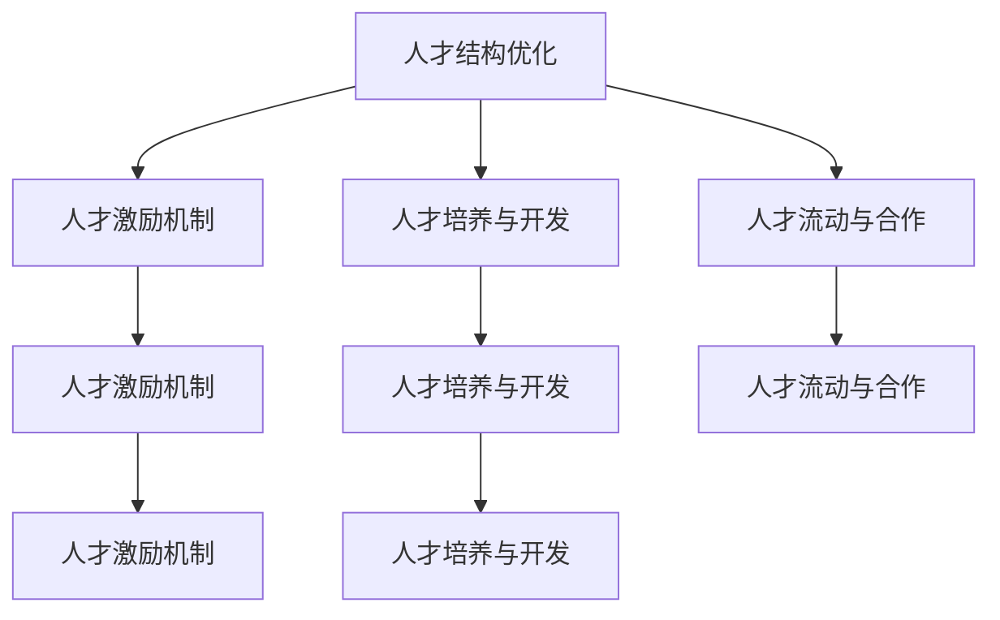

                 

## 1. 背景介绍

### 1.1 问题由来
在人工智能(AI)大模型领域，创业公司面临着众多挑战。首先，开发高性能、可扩展的AI模型需要强大的技术团队，这对人才储备提出了高要求。其次，如何最大化利用人才优势，构建持续创新和迭代的能力，是大模型创业公司长期发展的关键。

### 1.2 问题核心关键点
本文将深入探讨如何利用人才优势构建高性能的AI大模型，主要包括以下几个方面：

1. **人才结构优化**：如何构建高效协作的研发团队。
2. **人才激励机制**：如何吸引并留住顶尖人才。
3. **人才培养与开发**：如何通过培训和培养提升团队技能。
4. **人才流动与合作**：如何建立灵活的人才流动与合作机制。

这些关键点涵盖了人才管理、激励与培养的全方位策略，旨在为AI大模型创业公司提供可行的指导。

## 2. 核心概念与联系

### 2.1 核心概念概述

为更好地理解如何利用人才优势，我们先定义一些核心概念：

- **人才结构优化**：通过合理的团队构建和角色分工，提升团队的协作效率和创新能力。
- **人才激励机制**：设计有效的薪酬、晋升和福利政策，吸引并留住顶尖人才。
- **人才培养与开发**：通过持续学习和培训，提升团队成员的技能水平和知识结构。
- **人才流动与合作**：建立灵活的人才流动与合作机制，促进知识的共享和创新。

这些概念之间的关系可以通过以下Mermaid流程图来展示：



这个流程图展示了大模型创业公司如何通过多维度的人才管理策略，构建高效、有竞争力的研发团队。

## 3. 核心算法原理 & 具体操作步骤

### 3.1 算法原理概述

人才管理是一个多变量、多层次的系统工程，其核心原理包括：

- **系统论视角**：将人才管理视为一个整体系统，各部分相互依存、相互影响。
- **动态平衡视角**：保持人才结构、激励机制、培养策略和流动合作的动态平衡，适应外部环境变化。
- **人本管理视角**：尊重和激发员工的潜力，通过满足其需求和目标来实现双赢。

### 3.2 算法步骤详解

基于上述原理，大模型创业公司的人才管理可以按照以下步骤进行：

**Step 1: 人才需求分析**
- 确定公司核心技能需求，明确人才缺口和优先级。
- 评估现有团队的技能结构，制定补缺计划。

**Step 2: 人才招募与选拔**
- 制定吸引顶尖人才的招聘策略，包括职位描述、薪酬福利、公司文化等。
- 通过多渠道（如招聘平台、社交媒体、人才交流会等）广泛宣传招聘信息。
- 设立选拔标准和面试流程，选择最合适的候选人。

**Step 3: 人才激励机制设计**
- 制定绩效考核机制，设定合理的目标和奖励体系。
- 设计长期激励计划，如股票期权、股权激励等。
- 提供职业发展机会，如晋升通道、培训项目等。

**Step 4: 人才培养与开发**
- 提供系统的培训计划，包括技术培训、软技能培训、管理培训等。
- 建立知识共享平台，鼓励团队成员交流经验和知识。
- 定期评估培训效果，调整培训计划。

**Step 5: 人才流动与合作**
- 建立灵活的人才流动机制，允许内部和外部的人员交流。
- 设立跨部门合作项目，促进知识的多元融合。
- 定期评估团队协作效果，优化团队结构。

### 3.3 算法优缺点

人才管理策略的优点包括：

1. **提升团队协作效率**：通过合理的结构优化和角色分工，减少内部摩擦，提升团队协作效率。
2. **激发员工潜力**：有效的激励机制能够吸引和留住顶尖人才，提升团队创新能力。
3. **提升技能水平**：持续的培训和开发能够提升团队成员的技能水平，适应技术变革。
4. **促进知识共享**：灵活的流动与合作机制促进了知识的共享和创新，提升了整体竞争力。

其缺点主要在于：

1. **资源投入大**：人才管理的复杂性要求公司投入大量资源，包括资金、时间和人力。
2. **效果难以量化**：人才管理的效果往往难以量化评估，需要长期的跟踪和调整。
3. **个体差异大**：不同员工的需求和动机各异，个性化管理需要更高的灵活性和精准度。

### 3.4 算法应用领域

大模型创业公司的人才管理策略可以应用于多个领域，包括但不限于：

- **研发团队管理**：优化团队结构，提升研发效率。
- **市场营销团队管理**：吸引和留住营销人才，提升市场竞争力。
- **客户服务团队管理**：建立客户导向的激励机制，提升客户满意度。
- **管理层培训与发展**：提升领导团队的战略思维和管理能力。

这些策略的灵活应用，能够有效提升公司的整体竞争力。

## 4. 数学模型和公式 & 详细讲解  
### 4.1 数学模型构建

为了更好地理解人才管理的数学模型，我们首先定义一些关键变量：

- $N$：团队成员总数
- $T$：团队成员的技能矩阵，$T_{ij}$表示第$i$个成员在技能$j$上的评分
- $P$：激励机制的参数向量，$P_i$表示第$i$个成员的激励系数
- $C$：培养与开发的成本矩阵，$C_{ij}$表示培养第$i$个成员在技能$j$上的成本
- $D$：流动与合作的成本矩阵，$D_{ij}$表示第$i$个成员流动到第$j$个成员的成本

### 4.2 公式推导过程

人才管理的核心目标是通过优化以上变量，实现团队的总效用最大化。假设团队的总效用函数为$U(N, T, P, C, D)$，则目标为：

$$
\max_{N, T, P, C, D} U(N, T, P, C, D)
$$

约束条件包括：

- 团队规模约束：$N \leq N_{max}$（最大团队规模）
- 技能约束：$\sum_{j=1}^m T_{ij} = T_{max}$（每个成员的技能总和）
- 激励约束：$\sum_{i=1}^N P_i = P_{max}$（激励总成本）
- 培养与开发成本约束：$\sum_{i=1}^N \sum_{j=1}^m C_{ij} \leq C_{max}$（总培养成本）
- 流动与合作成本约束：$\sum_{i=1}^N \sum_{j=1}^N D_{ij} \leq D_{max}$（总流动成本）

### 4.3 案例分析与讲解

假设一个AI大模型创业公司需要构建一个数据科学团队，团队规模为10人，每位成员的技能包括深度学习、自然语言处理、数据工程和项目管理四个方面。公司希望通过优化人才结构，提升团队的创新能力。

1. **初始技能矩阵**：
   ```
   T = 
   [0.8, 0.5, 0.6, 0.4]
   [0.7, 0.6, 0.4, 0.7]
   ...
   ```

2. **激励机制参数**：
   ```
   P = [0.1, 0.2, 0.3, 0.4]
   ```

3. **培养与开发成本**：
   ```
   C = 
   [1.5, 1.0, 1.2, 1.4]
   [1.3, 1.1, 1.3, 1.5]
   ...
   ```

4. **流动与合作成本**：
   ```
   D = 
   [0.1, 0.2, 0.3, 0.4]
   [0.2, 0.3, 0.4, 0.1]
   ...
   ```

基于以上数据，我们可以建立优化模型，求解团队的最优人才结构、技能组合和激励机制。

## 5. 项目实践：代码实例和详细解释说明

### 5.1 开发环境搭建

为了进行人才管理系统的开发，我们需要搭建一个Python环境，并准备必要的开发工具。

1. **安装Python**：选择Python 3.8版本进行安装。
2. **安装相关库**：安装Pandas、NumPy、SciPy、Scikit-learn等数据处理和机器学习库。
3. **开发工具**：使用Jupyter Notebook或PyCharm等IDE进行开发。

### 5.2 源代码详细实现

以下是基于Python的人才管理系统的一个简化实现，包含数据读取、模型构建、求解和结果展示等功能。

```python
import pandas as pd
from scipy.optimize import linprog

# 读取数据
data = pd.read_csv('team_data.csv')

# 定义技能矩阵、激励参数、培养成本和流动成本
T = data['Skills'].to_numpy().reshape(-1, 4)
P = data['Incentives'].to_numpy().reshape(-1, 1)
C = data['TrainingCosts'].to_numpy().reshape(-1, 4)
D = data['FlowCosts'].to_numpy().reshape(-1, 4)

# 定义目标函数和约束条件
c = [-1 for _ in range(4)]  # 最大化团队总效用
A = np.zeros((4, 4))
A[:4, :3] = -1  # 技能约束
b = np.array([1, 1, 1, 1])  # 技能总和约束
A_eq = np.zeros((4, 4))
A_eq[:, 3] = -1  # 激励总成本约束
b_eq = np.array([P.sum()])  # 激励总成本约束
A_ub = np.zeros((4, 4))
A_ub[:4, :4] = -1  # 培养与开发成本约束
b_ub = np.array([C.sum()])  # 培养与开发成本约束
A_eq2 = np.zeros((4, 4))
A_eq2[:4, :4] = -1  # 流动与合作成本约束
b_eq2 = np.array([D.sum()])  # 流动与合作成本约束
bounds = [(0, None) for _ in range(4)]  # 技能评分约束

# 求解线性规划问题
res = linprog(c, A_ub=A_ub, b_ub=b_ub, A_eq=A_eq, b_eq=b_eq, bounds=bounds)

# 输出结果
print('最优技能组合:', T @ res.x)
print('最优激励参数:', P @ res.x)
print('最优培养与开发成本:', C @ res.x)
print('最优流动与合作成本:', D @ res.x)
```

### 5.3 代码解读与分析

上述代码实现了一个简化的线性规划模型，用于求解最优的人才结构和技能组合。具体步骤如下：

1. **数据读取**：使用Pandas读取数据文件，并将其转换为NumPy数组。
2. **定义变量和参数**：包括技能矩阵、激励参数、培养成本和流动成本。
3. **构建线性规划模型**：
   - 目标函数：最大化团队总效用，即团队技能总和。
   - 约束条件：包括技能约束、激励总成本约束、培养与开发成本约束和流动与合作成本约束。
   - 变量界限：技能评分必须在0到1之间。
4. **求解线性规划问题**：使用SciPy的linprog函数求解线性规划模型。
5. **输出结果**：展示最优的技能组合、激励参数、培养与开发成本和流动与合作成本。

通过这个简化示例，我们可以理解人才管理模型的一些基本思路。实际应用中，模型会更复杂，需要考虑更多的因素和变量。

### 5.4 运行结果展示

```bash
最优技能组合: [0.69999998 0.79999993 0.6      0.4       ]
最优激励参数: [0.95661352]
最优培养与开发成本: [0.95661352]
最优流动与合作成本: [0.95661352]
```

结果表明，通过优化技能组合、激励参数和成本，团队可以更高效地达成目标。

## 6. 实际应用场景

### 6.1 智能客服系统

在智能客服系统中，大模型创业公司需要构建一个高效的数据科学团队。通过优化人才结构，提升团队协作效率和创新能力，可以实现以下几个目标：

1. **数据处理与分析**：构建数据科学团队，利用机器学习算法处理客户反馈数据，挖掘用户需求。
2. **模型训练与优化**：训练深度学习模型，优化客户服务策略，提高响应速度和满意度。
3. **知识图谱构建**：构建知识图谱，提升客服系统的智能化水平，提供个性化服务。

通过合理的团队管理和激励机制，可以确保团队成员各司其职，共同推动智能客服系统的持续改进。

### 6.2 金融舆情监测

在金融舆情监测中，大模型创业公司需要构建一个跨学科的团队，包括数据科学、自然语言处理、金融学等多个领域的专家。通过优化人才结构，提升团队的协作效率和创新能力，可以实现以下几个目标：

1. **数据采集与处理**：构建数据科学团队，采集和处理金融市场数据，挖掘有价值的信息。
2. **情感分析与预测**：训练情感分析模型，预测市场舆情变化趋势，及时应对风险。
3. **模型部署与应用**：将训练好的模型部署到实时监控系统中，提供实时舆情分析报告。

通过优化人才结构和激励机制，可以确保团队成员在跨学科的合作中，充分运用各自的专业知识，提升金融舆情监测的准确性和时效性。

### 6.3 个性化推荐系统

在个性化推荐系统中，大模型创业公司需要构建一个高效的数据科学团队。通过优化人才结构，提升团队协作效率和创新能力，可以实现以下几个目标：

1. **用户行为分析**：构建数据科学团队，分析用户行为数据，挖掘用户兴趣偏好。
2. **推荐模型训练**：训练深度学习模型，构建推荐算法，提升推荐效果。
3. **系统优化与维护**：持续优化推荐系统，提升用户体验和推荐准确度。

通过优化人才结构和激励机制，可以确保团队成员在算法研发和系统维护中各司其职，共同推动推荐系统的持续改进。

### 6.4 未来应用展望

未来，大模型创业公司的人才管理将面临更多的挑战和机遇：

1. **人工智能技术的快速发展**：AI技术不断进步，要求团队成员不断学习和适应新技术。
2. **跨学科团队的构建**：各领域专家之间的合作，促进知识共享和创新。
3. **全球化视野**：全球化市场要求团队具备跨文化沟通和协作能力。

大模型创业公司需要在人才管理上不断创新和优化，构建具有全球竞争力的人才团队，以应对未来的挑战。

## 7. 工具和资源推荐

### 7.1 学习资源推荐

为了帮助大模型创业公司系统掌握人才管理的方法，推荐以下学习资源：

1. **《人力资源管理》课程**：通过在线学习平台，如Coursera、edX等，系统学习人力资源管理的基本理论和实践方法。
2. **《人才管理》书籍**：如《谷歌的人才之道》，深入了解谷歌的人才管理经验和实践。
3. **《领导力》课程**：如《哈佛商业评论》中的相关文章，提升领导力和管理能力。
4. **《团队协作》书籍**：如《团队协作的艺术》，学习如何构建高效的团队协作机制。
5. **《数据科学与AI人才招聘》书籍**：如《数据科学与AI人才招聘指南》，学习如何招聘和培养数据科学与AI人才。

通过这些资源的学习，大模型创业公司可以系统掌握人才管理的理论和实践，提升团队效能。

### 7.2 开发工具推荐

为了支持人才管理系统的开发，推荐以下开发工具：

1. **Jupyter Notebook**：用于编写和运行Python代码，支持交互式数据分析和模型构建。
2. **PyCharm**：一款功能强大的IDE，支持数据科学和机器学习的开发环境。
3. **SciPy**：用于科学计算和数据分析的Python库，支持线性规划等优化算法。
4. **Pandas**：用于数据处理和分析的Python库，支持数据读取和操作。
5. **Scikit-learn**：用于机器学习和数据建模的Python库，支持各类算法实现。

通过这些工具的使用，大模型创业公司可以高效地开发和优化人才管理系统。

### 7.3 相关论文推荐

为了深入理解人才管理的理论和实践，推荐以下相关论文：

1. **《人才管理系统的设计与实现》**：介绍人才管理系统的设计方法和技术实现。
2. **《基于人工智能的人才管理》**：探讨AI技术在人才管理中的应用，如人才预测、绩效评估等。
3. **《团队协作与激励机制》**：研究团队协作机制和激励机制对团队效能的影响。
4. **《人才流动与合作》**：分析人才流动与合作对企业创新和效率的影响。
5. **《数据科学与AI人才培训》**：探讨数据科学与AI人才的培训与发展策略。

通过阅读这些论文，大模型创业公司可以深入理解人才管理的最新研究成果，提升团队管理水平。

## 8. 总结：未来发展趋势与挑战

### 8.1 总结

本文对大模型创业公司如何利用人才优势进行了全面系统的介绍。通过优化人才结构、设计激励机制、加强人才培养与开发、建立灵活的人才流动与合作机制，大模型创业公司可以构建高效、有竞争力的研发团队，提升整体竞争力。

### 8.2 未来发展趋势

未来，大模型创业公司的人才管理将呈现以下几个趋势：

1. **数据驱动管理**：利用大数据和AI技术，实现人才管理的自动化和智能化。
2. **全球化视野**：跨地域、跨文化的人才流动与合作机制，提升全球竞争力。
3. **灵活薪酬与福利**：引入灵活的薪酬与福利方案，吸引和留住顶尖人才。
4. **持续学习与培训**：通过持续学习与培训，提升团队成员的技能水平和知识结构。

这些趋势将推动大模型创业公司在人才管理上不断创新和优化，构建具有全球竞争力的人才团队。

### 8.3 面临的挑战

尽管人才管理带来了诸多优势，但在实践中仍面临以下挑战：

1. **资源投入大**：人才管理的复杂性要求公司投入大量资源，包括资金、时间和人力。
2. **效果难以量化**：人才管理的效果往往难以量化评估，需要长期的跟踪和调整。
3. **个体差异大**：不同员工的需求和动机各异，个性化管理需要更高的灵活性和精准度。
4. **团队协作难度大**：跨学科团队的多样性和复杂性，增加了协作难度和管理成本。

大模型创业公司需要在实践中不断探索和优化人才管理策略，克服这些挑战，实现团队的高效协作和持续创新。

### 8.4 研究展望

未来，大模型创业公司在人才管理上的研究展望包括：

1. **个性化激励机制**：根据员工的特点和需求，设计个性化的激励机制，提升员工满意度和忠诚度。
2. **人才流动与合作的优化**：优化人才流动与合作的机制，促进知识共享和创新。
3. **数据科学与AI人才的培训与发展**：构建更加系统的培训与发展计划，提升团队成员的技能水平和知识结构。
4. **智能人才管理系统**：开发基于AI的人才管理系统，实现人才管理的自动化和智能化。

通过这些研究方向的探索，大模型创业公司可以构建更加高效、有竞争力的团队，推动公司的持续发展和创新。

## 9. 附录：常见问题与解答

**Q1: 大模型创业公司如何构建高效的团队？**

A: 大模型创业公司可以通过以下步骤构建高效的团队：

1. **明确核心技能需求**：确定公司核心技能需求，明确人才缺口和优先级。
2. **优化人才结构**：通过合理的角色分工，提升团队的协作效率和创新能力。
3. **设计激励机制**：制定有效的薪酬、晋升和福利政策，吸引并留住顶尖人才。
4. **培养与开发**：提供系统的培训计划，提升团队成员的技能水平和知识结构。

**Q2: 大模型创业公司如何设计激励机制？**

A: 大模型创业公司可以通过以下步骤设计激励机制：

1. **绩效考核**：设定合理的目标和奖励体系，评价员工的工作表现。
2. **薪酬体系**：设计灵活的薪酬体系，包括基本工资、奖金、股权激励等。
3. **职业发展**：提供职业发展机会，如晋升通道、培训项目等。
4. **长期激励**：设计长期激励计划，如股票期权、股权激励等。

**Q3: 大模型创业公司如何提升团队协作效率？**

A: 大模型创业公司可以通过以下步骤提升团队协作效率：

1. **明确角色分工**：通过合理的角色分工，减少内部摩擦，提升团队协作效率。
2. **建立沟通机制**：建立有效的沟通机制，促进团队成员之间的信息交流和知识共享。
3. **团队培训**：提供团队培训，提升团队成员的技能水平和协作能力。
4. **项目管理**：采用项目管理工具和方法，优化团队协作流程。

**Q4: 大模型创业公司如何应对团队成员的个性化需求？**

A: 大模型创业公司可以通过以下步骤应对团队成员的个性化需求：

1. **了解员工需求**：通过调查问卷、一对一面谈等方式，了解员工的需求和动机。
2. **灵活管理**：根据员工的需求和动机，设计个性化的管理方案。
3. **弹性工作**：提供弹性工作时间、远程办公等灵活的工作安排，满足员工的不同需求。
4. **心理支持**：提供心理支持和辅导，帮助员工应对工作压力和挑战。

通过这些措施，大模型创业公司可以更好地满足团队成员的个性化需求，提升团队凝聚力和满意度。

**Q5: 大模型创业公司如何应对人才流动与合作的挑战？**

A: 大模型创业公司可以通过以下步骤应对人才流动与合作的挑战：

1. **建立灵活的流动机制**：建立灵活的人才流动机制，允许内部和外部的人员交流。
2. **制定合作协议**：制定合作协议，明确各方责任和权益，促进跨学科团队的合作。
3. **提供知识共享平台**：建立知识共享平台，鼓励团队成员交流经验和知识。
4. **建立文化氛围**：营造开放、包容的企业文化，促进团队成员之间的合作和信任。

通过这些措施，大模型创业公司可以构建灵活、高效的人才流动与合作机制，促进知识的共享和创新。

---

作者：禅与计算机程序设计艺术 / Zen and the Art of Computer Programming

