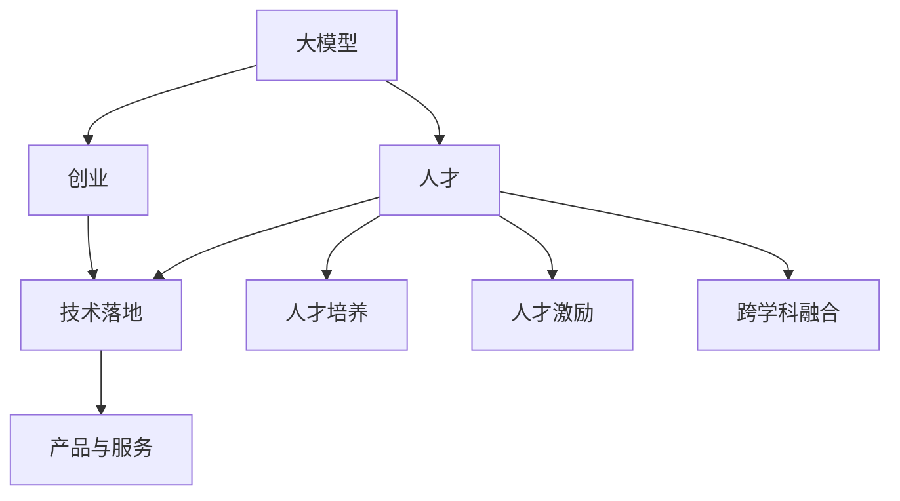

                 

# AI 大模型创业：如何利用人才优势？

> 关键词：大模型，创业，人才优势，人工智能，技术落地

## 1. 背景介绍

### 1.1 问题由来
近年来，人工智能(AI)技术在各行各业迅速普及，大模型在机器学习和自然语言处理(NLP)领域取得了显著进展。然而，尽管大模型拥有强大的计算能力和知识表示能力，但其实际落地仍面临诸多挑战，如高昂的开发成本、数据获取困难、模型泛化能力不足等。特别是在创业环境中，资源有限，如何高效利用有限的人才资源，成功将大模型技术转化为产品，成为一个亟需探讨的问题。

### 1.2 问题核心关键点
大模型创业的关键在于如何最大化利用人才优势，通过合理的组织结构和人才培养策略，将技术优势转化为商业价值。具体来说，核心关键点包括：

- 人才结构优化：构建多元化的团队，包括算法工程师、数据科学家、产品经理等，充分发挥各成员的专长，形成合力。
- 跨学科融合：鼓励不同背景的人才进行跨领域合作，激发创新思维，增强模型的泛化能力和应用范围。
- 持续学习与成长：通过培训、交流等方式，提升团队整体的技术水平和业务能力，保持公司的竞争力和创新活力。
- 人才培养与激励：制定科学的人才培养计划，包括带薪学习、竞赛奖励、股权激励等，吸引和留住顶尖人才。

## 2. 核心概念与联系

### 2.1 核心概念概述

为更好地理解如何利用人才优势进行大模型创业，本节将介绍几个密切相关的核心概念：

- 大模型(Large Model)：以深度神经网络为基础，包含大量参数的模型，能够处理大规模数据和复杂任务，如图像识别、自然语言处理等。
- 创业(Creation)：创建新的产品、服务或商业模式的过程，需要集结多方资源，实现创新突破。
- 人才(Talent)：具有特定技能、知识和经验的人力资源，是推动创业成功的关键因素。
- 人工智能(AI)：利用算法和计算能力，赋予机器以智能的技术，包括机器学习、自然语言处理、计算机视觉等。
- 技术落地(Implementation)：将先进的技术和理念转化为实际应用的过程，实现商业化目标。

这些核心概念之间的逻辑关系可以通过以下Mermaid流程图来展示：



这个流程图展示了大模型、创业、人才、人工智能和技术落地的核心概念及其之间的关系：

1. 大模型为创业提供技术支撑。
2. 创业过程需要集结人才，以实现技术落地。
3. 技术落地过程涉及人才培养和跨学科融合。
4. 最终形成产品与服务，实现商业价值。

这些概念共同构成了大模型创业的基础框架，使得公司能够利用人才优势，高效推进产品开发和市场推广。

## 3. 核心算法原理 & 具体操作步骤
### 3.1 算法原理概述

大模型创业的核心算法原理主要围绕数据驱动和人才驱动两个方面展开：

1. 数据驱动：通过收集、处理和分析海量数据，利用大模型进行学习和优化，形成有价值的算法和模型。
2. 人才驱动：通过科学的团队管理、人才培养和激励机制，最大化人才的潜能，提升创新能力和工作效率。

在实际操作中，大模型创业可以分为以下几个步骤：

**Step 1: 团队构建**
- 确定核心技术团队，包括算法工程师、数据科学家、产品经理等，根据项目需求和公司规模合理配置。
- 组建跨学科团队，鼓励不同背景的人才合作，形成协同效应。

**Step 2: 人才招聘与培训**
- 通过招聘平台、校园招聘、人才推荐等渠道，寻找符合公司文化和业务需求的优秀人才。
- 制定系统的培训计划，包括基础技术培训、行业知识培训、软技能培训等，提升团队整体素质。

**Step 3: 算法模型开发与优化**
- 基于公司业务需求，选择合适的算法和模型框架，进行模型构建和优化。
- 通过实验和测试，不断迭代和改进模型，提升性能和泛化能力。

**Step 4: 产品设计与原型开发**
- 根据市场调研和用户需求，设计符合市场需求的产品功能和界面。
- 使用敏捷开发方法，快速迭代和改进产品原型，提升用户体验。

**Step 5: 市场推广与反馈收集**
- 利用线上和线下渠道，推广产品和服务，扩大用户基础。
- 收集用户反馈和市场数据，不断优化产品功能和商业模式。

### 3.2 算法步骤详解

以下是大模型创业的详细操作步骤：

**Step 1: 团队构建**

1. **核心技术团队的配置**
   - 确定算法工程师的数量和职责，负责模型的设计和优化。
   - 招聘数据科学家，负责数据的清洗和分析，以及特征工程的构建。
   - 聘请产品经理，负责产品的需求分析和用户体验设计。

2. **跨学科团队的组建**
   - 鼓励不同背景的人才进行跨学科合作，如算法工程师与数据科学家合作构建模型，产品经理与设计师合作优化用户体验。
   - 建立跨部门沟通机制，定期进行跨学科项目讨论，提升团队协作效率。

3. **团队文化建设**
   - 建立开放包容的公司文化，鼓励创新和试错。
   - 提供良好的工作环境和福利待遇，吸引和留住优秀人才。

**Step 2: 人才招聘与培训**

1. **招聘渠道**
   - 利用招聘平台如LinkedIn、Indeed等发布招聘信息。
   - 参加行业会议、技术论坛等活动，拓展人才招聘渠道。
   - 与高校合作，开展校园招聘和实习项目，培养未来人才。

2. **招聘筛选**
   - 设置合理的招聘标准，包括技术能力、行业经验、团队协作能力等。
   - 进行多轮面试和评估，确保招聘到符合公司需求的人才。

3. **人才培训**
   - 制定系统的培训计划，包括技术培训、软技能培训和行业知识培训等。
   - 邀请行业专家进行讲座和培训，提升团队整体素质。
   - 鼓励员工参加各类技术比赛和交流活动，拓展视野和提升能力。

**Step 3: 算法模型开发与优化**

1. **数据获取与处理**
   - 收集和处理海量数据，确保数据的质量和多样性。
   - 使用数据增强技术，扩充训练集，提升模型泛化能力。

2. **模型构建与优化**
   - 选择合适的模型框架和算法，如TensorFlow、PyTorch等。
   - 设计模型结构，进行超参数调优，提升模型性能。
   - 使用分布式训练和模型压缩等技术，提高模型效率。

**Step 4: 产品设计与原型开发**

1. **产品需求分析**
   - 进行市场调研和用户需求分析，明确产品的核心功能和用户体验目标。
   - 制定详细的产品设计方案，包括UI/UX设计、功能需求等。

2. **原型开发**
   - 使用敏捷开发方法，快速迭代和改进产品原型。
   - 利用用户体验测试，收集用户反馈，不断优化产品功能。

3. **产品测试与优化**
   - 进行多轮测试，包括功能测试、性能测试和安全测试等。
   - 根据测试结果，优化产品功能和用户体验，提升产品质量。

**Step 5: 市场推广与反馈收集**

1. **市场推广**
   - 利用线上和线下渠道，推广产品和服务，扩大用户基础。
   - 通过社交媒体、广告投放等方式，提升品牌知名度和产品曝光度。

2. **用户反馈收集**
   - 通过问卷调查、用户访谈等方式，收集用户反馈和市场数据。
   - 分析用户反馈，优化产品功能和商业模式。

3. **市场数据分析**
   - 利用数据分析工具，分析用户行为和市场趋势，指导产品开发和优化。
   - 制定科学的市场策略，提升市场竞争力。

### 3.3 算法优缺点

大模型创业具有以下优点：

1. **技术领先**：借助大模型和前沿算法，在技术上占据优势，形成产品竞争优势。
2. **数据驱动**：利用海量数据进行学习和优化，提升模型性能和泛化能力。
3. **人才多样性**：通过跨学科融合和多元团队建设，激发创新思维，提升团队整体素质。

同时，也存在以下缺点：

1. **成本高昂**：大模型和复杂算法的开发和优化需要大量资金和时间投入。
2. **数据获取难**：高质量的数据获取和处理需要大量资源和专业知识。
3. **人才需求高**：需要大量高水平的技术人才，公司需提供良好的薪酬和福利待遇。
4. **市场推广难**：高技术门槛可能导致用户理解和使用难度增加，推广难度大。

尽管存在这些缺点，但大模型创业在技术先进性和市场潜力方面具有显著优势，只要合理利用人才优势，仍能取得成功。

### 3.4 算法应用领域

大模型创业在多个领域具有广泛应用，具体如下：

1. **自然语言处理**：利用大模型进行文本分类、情感分析、问答系统等任务，提升智能客服和翻译系统的性能。
2. **计算机视觉**：利用大模型进行图像识别、目标检测、视频分析等任务，提升安防监控、医疗影像诊断等应用的效果。
3. **智能推荐系统**：利用大模型进行用户行为分析、推荐算法优化等任务，提升电商、视频网站等平台的用户体验和推荐效果。
4. **金融科技**：利用大模型进行信用评估、风险预测、智能投顾等任务，提升金融服务的智能化水平。
5. **智慧城市**：利用大模型进行交通管理、城市事件监测等任务，提升城市治理的智能化水平。
6. **医疗健康**：利用大模型进行疾病预测、智能诊断、健康管理等任务，提升医疗服务的智能化水平。

这些领域的大模型创业项目，不仅能够提升技术水平，还能实现商业化落地，带来巨大的社会和经济效益。

## 4. 数学模型和公式 & 详细讲解  
### 4.1 数学模型构建

假设公司需构建一个AI产品，包含以下步骤：

1. **用户需求分析**：明确产品的核心功能，例如文本分类、图像识别等。
2. **数据准备**：收集和处理相关数据，构建训练集和测试集。
3. **模型选择与设计**：选择合适的模型框架和算法，如BERT、ResNet等。
4. **模型训练与优化**：使用训练集进行模型训练和优化，提升模型性能。
5. **模型评估与测试**：使用测试集对模型进行评估，确保模型泛化能力。
6. **产品上线与迭代**：将模型集成到产品中，进行市场推广和用户反馈收集，不断迭代优化。

在数学上，可以构建如下模型：

$$
Model = f(X, Y)
$$

其中 $X$ 表示输入数据，$Y$ 表示输出结果，$f$ 表示模型映射函数。

### 4.2 公式推导过程

**数据准备**

1. **数据收集与清洗**
   - 从各种渠道收集相关数据，如社交媒体数据、医疗影像数据等。
   - 对数据进行清洗和预处理，去除噪声和冗余数据。

2. **数据分割**
   - 将数据集分为训练集、验证集和测试集，确保模型在不同数据集上均能表现良好。

**模型选择与设计**

1. **模型框架选择**
   - 选择适合的深度学习框架，如TensorFlow、PyTorch等。

2. **模型结构设计**
   - 设计模型结构，包括输入层、隐藏层、输出层等。

**模型训练与优化**

1. **模型训练**
   - 使用训练集进行模型训练，最小化损失函数，优化模型参数。
   - 使用优化算法，如梯度下降法、Adam等，更新模型参数。

2. **超参数调优**
   - 进行超参数调优，如学习率、批大小等，提升模型性能。

**模型评估与测试**

1. **模型评估**
   - 使用验证集对模型进行评估，计算评估指标，如准确率、召回率等。

2. **模型测试**
   - 使用测试集对模型进行测试，确保模型泛化能力。

**产品上线与迭代**

1. **产品上线**
   - 将模型集成到产品中，进行市场推广。

2. **用户反馈收集**
   - 收集用户反馈和市场数据，进行产品迭代和优化。

### 4.3 案例分析与讲解

**案例分析：智能客服系统**

1. **需求分析**
   - 明确智能客服系统的核心功能，如问答系统、情感分析等。

2. **数据准备**
   - 收集历史客服对话记录，进行数据清洗和预处理。
   - 将对话记录分为训练集、验证集和测试集。

3. **模型选择与设计**
   - 选择BERT作为基础模型，设计多层次输出层和交叉熵损失函数。

4. **模型训练与优化**
   - 使用训练集进行模型训练，最小化交叉熵损失函数。
   - 使用Adam优化算法，调整学习率和批大小等超参数。

5. **模型评估与测试**
   - 使用验证集对模型进行评估，计算准确率、召回率等指标。
   - 使用测试集对模型进行测试，确保模型泛化能力。

6. **产品上线与迭代**
   - 将模型集成到智能客服系统中，进行市场推广。
   - 收集用户反馈，进行产品迭代和优化。

通过以上案例分析，可以更好地理解大模型创业的流程和方法。

## 5. 项目实践：代码实例和详细解释说明
### 5.1 开发环境搭建

以下是使用Python进行PyTorch开发的环境配置流程：

1. 安装Anaconda：从官网下载并安装Anaconda，用于创建独立的Python环境。

2. 创建并激活虚拟环境：
```bash
conda create -n pytorch-env python=3.8 
conda activate pytorch-env
```

3. 安装PyTorch：根据CUDA版本，从官网获取对应的安装命令。例如：
```bash
conda install pytorch torchvision torchaudio cudatoolkit=11.1 -c pytorch -c conda-forge
```

4. 安装Transformers库：
```bash
pip install transformers
```

5. 安装各类工具包：
```bash
pip install numpy pandas scikit-learn matplotlib tqdm jupyter notebook ipython
```

完成上述步骤后，即可在`pytorch-env`环境中开始大模型创业实践。

### 5.2 源代码详细实现

这里以一个基于BERT的情感分析项目为例，展示大模型创业的代码实现：

首先，定义情感分析任务的数据处理函数：

```python
from transformers import BertTokenizer
from torch.utils.data import Dataset
import torch

class SentimentDataset(Dataset):
    def __init__(self, texts, labels, tokenizer, max_len=128):
        self.texts = texts
        self.labels = labels
        self.tokenizer = tokenizer
        self.max_len = max_len
        
    def __len__(self):
        return len(self.texts)
    
    def __getitem__(self, item):
        text = self.texts[item]
        label = self.labels[item]
        
        encoding = self.tokenizer(text, return_tensors='pt', max_length=self.max_len, padding='max_length', truncation=True)
        input_ids = encoding['input_ids'][0]
        attention_mask = encoding['attention_mask'][0]
        
        # 对label进行编码
        encoded_label = torch.tensor(label, dtype=torch.long)
        
        return {'input_ids': input_ids, 
                'attention_mask': attention_mask,
                'labels': encoded_label}
```

然后，定义模型和优化器：

```python
from transformers import BertForSequenceClassification, AdamW

model = BertForSequenceClassification.from_pretrained('bert-base-cased', num_labels=2)

optimizer = AdamW(model.parameters(), lr=2e-5)
```

接着，定义训练和评估函数：

```python
from torch.utils.data import DataLoader
from tqdm import tqdm
from sklearn.metrics import accuracy_score

device = torch.device('cuda') if torch.cuda.is_available() else torch.device('cpu')
model.to(device)

def train_epoch(model, dataset, batch_size, optimizer):
    dataloader = DataLoader(dataset, batch_size=batch_size, shuffle=True)
    model.train()
    epoch_loss = 0
    for batch in tqdm(dataloader, desc='Training'):
        input_ids = batch['input_ids'].to(device)
        attention_mask = batch['attention_mask'].to(device)
        labels = batch['labels'].to(device)
        model.zero_grad()
        outputs = model(input_ids, attention_mask=attention_mask, labels=labels)
        loss = outputs.loss
        epoch_loss += loss.item()
        loss.backward()
        optimizer.step()
    return epoch_loss / len(dataloader)

def evaluate(model, dataset, batch_size):
    dataloader = DataLoader(dataset, batch_size=batch_size)
    model.eval()
    preds, labels = [], []
    with torch.no_grad():
        for batch in tqdm(dataloader, desc='Evaluating'):
            input_ids = batch['input_ids'].to(device)
            attention_mask = batch['attention_mask'].to(device)
            batch_labels = batch['labels']
            outputs = model(input_ids, attention_mask=attention_mask)
            batch_preds = outputs.logits.argmax(dim=1).to('cpu').tolist()
            batch_labels = batch_labels.to('cpu').tolist()
            for pred, label in zip(batch_preds, batch_labels):
                preds.append(pred)
                labels.append(label)
                
    print('Accuracy:', accuracy_score(labels, preds))
```

最后，启动训练流程并在测试集上评估：

```python
epochs = 5
batch_size = 16

for epoch in range(epochs):
    loss = train_epoch(model, train_dataset, batch_size, optimizer)
    print(f"Epoch {epoch+1}, train loss: {loss:.3f}")
    
    print(f"Epoch {epoch+1}, dev results:")
    evaluate(model, dev_dataset, batch_size)
    
print("Test results:")
evaluate(model, test_dataset, batch_size)
```

以上就是使用PyTorch对BERT进行情感分析任务微调的完整代码实现。可以看到，得益于Transformers库的强大封装，我们可以用相对简洁的代码完成BERT模型的加载和微调。

### 5.3 代码解读与分析

让我们再详细解读一下关键代码的实现细节：

**SentimentDataset类**：
- `__init__`方法：初始化文本、标签、分词器等关键组件。
- `__len__`方法：返回数据集的样本数量。
- `__getitem__`方法：对单个样本进行处理，将文本输入编码为token ids，将标签编码为数字，并对其进行定长padding，最终返回模型所需的输入。

**情感分析模型的训练和评估函数**：
- 使用PyTorch的DataLoader对数据集进行批次化加载，供模型训练和推理使用。
- 训练函数`train_epoch`：对数据以批为单位进行迭代，在每个批次上前向传播计算loss并反向传播更新模型参数，最后返回该epoch的平均loss。
- 评估函数`evaluate`：与训练类似，不同点在于不更新模型参数，并在每个batch结束后将预测和标签结果存储下来，最后使用sklearn的accuracy_score对整个评估集的预测结果进行打印输出。

**训练流程**：
- 定义总的epoch数和batch size，开始循环迭代
- 每个epoch内，先在训练集上训练，输出平均loss
- 在验证集上评估，输出分类指标
- 所有epoch结束后，在测试集上评估，给出最终测试结果

可以看到，PyTorch配合Transformers库使得BERT微调的代码实现变得简洁高效。开发者可以将更多精力放在数据处理、模型改进等高层逻辑上，而不必过多关注底层的实现细节。

当然，工业级的系统实现还需考虑更多因素，如模型的保存和部署、超参数的自动搜索、更灵活的任务适配层等。但核心的微调范式基本与此类似。

## 6. 实际应用场景
### 6.1 智能客服系统

基于大语言模型微调的对话技术，可以广泛应用于智能客服系统的构建。传统客服往往需要配备大量人力，高峰期响应缓慢，且一致性和专业性难以保证。而使用微调后的对话模型，可以7x24小时不间断服务，快速响应客户咨询，用自然流畅的语言解答各类常见问题。

在技术实现上，可以收集企业内部的历史客服对话记录，将问题和最佳答复构建成监督数据，在此基础上对预训练对话模型进行微调。微调后的对话模型能够自动理解用户意图，匹配最合适的答案模板进行回复。对于客户提出的新问题，还可以接入检索系统实时搜索相关内容，动态组织生成回答。如此构建的智能客服系统，能大幅提升客户咨询体验和问题解决效率。

### 6.2 金融舆情监测

金融机构需要实时监测市场舆论动向，以便及时应对负面信息传播，规避金融风险。传统的人工监测方式成本高、效率低，难以应对网络时代海量信息爆发的挑战。基于大语言模型微调的文本分类和情感分析技术，为金融舆情监测提供了新的解决方案。

具体而言，可以收集金融领域相关的新闻、报道、评论等文本数据，并对其进行主题标注和情感标注。在此基础上对预训练语言模型进行微调，使其能够自动判断文本属于何种主题，情感倾向是正面、中性还是负面。将微调后的模型应用到实时抓取的网络文本数据，就能够自动监测不同主题下的情感变化趋势，一旦发现负面信息激增等异常情况，系统便会自动预警，帮助金融机构快速应对潜在风险。

### 6.3 个性化推荐系统

当前的推荐系统往往只依赖用户的历史行为数据进行物品推荐，无法深入理解用户的真实兴趣偏好。基于大语言模型微调技术，个性化推荐系统可以更好地挖掘用户行为背后的语义信息，从而提供更精准、多样的推荐内容。

在实践中，可以收集用户浏览、点击、评论、分享等行为数据，提取和用户交互的物品标题、描述、标签等文本内容。将文本内容作为模型输入，用户的后续行为（如是否点击、购买等）作为监督信号，在此基础上微调预训练语言模型。微调后的模型能够从文本内容中准确把握用户的兴趣点。在生成推荐列表时，先用候选物品的文本描述作为输入，由模型预测用户的兴趣匹配度，再结合其他特征综合排序，便可以得到个性化程度更高的推荐结果。

### 6.4 未来应用展望

随着大语言模型微调技术的发展，基于微调范式将在更多领域得到应用，为传统行业带来变革性影响。

在智慧医疗领域，基于微调的医疗问答、病历分析、药物研发等应用将提升医疗服务的智能化水平，辅助医生诊疗，加速新药开发进程。

在智能教育领域，微调技术可应用于作业批改、学情分析、知识推荐等方面，因材施教，促进教育公平，提高教学质量。

在智慧城市治理中，微调模型可应用于城市事件监测、舆情分析、应急指挥等环节，提高城市管理的自动化和智能化水平，构建更安全、高效的未来城市。

此外，在企业生产、社会治理、文娱传媒等众多领域，基于大模型微调的人工智能应用也将不断涌现，为经济社会发展注入新的动力。相信随着技术的日益成熟，微调方法将成为人工智能落地应用的重要范式，推动人工智能技术在垂直行业的规模化落地。

## 7. 工具和资源推荐
### 7.1 学习资源推荐

为了帮助开发者系统掌握大模型微调的理论基础和实践技巧，这里推荐一些优质的学习资源：

1. 《Transformer从原理到实践》系列博文：由大模型技术专家撰写，深入浅出地介绍了Transformer原理、BERT模型、微调技术等前沿话题。

2. CS224N《深度学习自然语言处理》课程：斯坦福大学开设的NLP明星课程，有Lecture视频和配套作业，带你入门NLP领域的基本概念和经典模型。

3. 《Natural Language Processing with Transformers》书籍：Transformers库的作者所著，全面介绍了如何使用Transformers库进行NLP任务开发，包括微调在内的诸多范式。

4. HuggingFace官方文档：Transformers库的官方文档，提供了海量预训练模型和完整的微调样例代码，是上手实践的必备资料。

5. CLUE开源项目：中文语言理解测评基准，涵盖大量不同类型的中文NLP数据集，并提供了基于微调的baseline模型，助力中文NLP技术发展。

通过对这些资源的学习实践，相信你一定能够快速掌握大模型微调的精髓，并用于解决实际的NLP问题。
###  7.2 开发工具推荐

高效的开发离不开优秀的工具支持。以下是几款用于大模型微调开发的常用工具：

1. PyTorch：基于Python的开源深度学习框架，灵活动态的计算图，适合快速迭代研究。大部分预训练语言模型都有PyTorch版本的实现。

2. TensorFlow：由Google主导开发的开源深度学习框架，生产部署方便，适合大规模工程应用。同样有丰富的预训练语言模型资源。

3. Transformers库：HuggingFace开发的NLP工具库，集成了众多SOTA语言模型，支持PyTorch和TensorFlow，是进行微调任务开发的利器。

4. Weights & Biases：模型训练的实验跟踪工具，可以记录和可视化模型训练过程中的各项指标，方便对比和调优。与主流深度学习框架无缝集成。

5. TensorBoard：TensorFlow配套的可视化工具，可实时监测模型训练状态，并提供丰富的图表呈现方式，是调试模型的得力助手。

6. Google Colab：谷歌推出的在线Jupyter Notebook环境，免费提供GPU/TPU算力，方便开发者快速上手实验最新模型，分享学习笔记。

合理利用这些工具，可以显著提升大模型微调任务的开发效率，加快创新迭代的步伐。

### 7.3 相关论文推荐

大语言模型和微调技术的发展源于学界的持续研究。以下是几篇奠基性的相关论文，推荐阅读：

1. Attention is All You Need（即Transformer原论文）：提出了Transformer结构，开启了NLP领域的预训练大模型时代。

2. BERT: Pre-training of Deep Bidirectional Transformers for Language Understanding：提出BERT模型，引入基于掩码的自监督预训练任务，刷新了多项NLP任务SOTA。

3. Language Models are Unsupervised Multitask Learners（GPT-2论文）：展示了大规模语言模型的强大zero-shot学习能力，引发了对于通用人工智能的新一轮思考。

4. Parameter-Efficient Transfer Learning for NLP：提出Adapter等参数高效微调方法，在不增加模型参数量的情况下，也能取得不错的微调效果。

5. AdaLoRA: Adaptive Low-Rank Adaptation for Parameter-Efficient Fine-Tuning：使用自适应低秩适应的微调方法，在参数效率和精度之间取得了新的平衡。

这些论文代表了大语言模型微调技术的发展脉络。通过学习这些前沿成果，可以帮助研究者把握学科前进方向，激发更多的创新灵感。

## 8. 总结：未来发展趋势与挑战

### 8.1 总结

本文对大模型创业过程中的人才优势利用进行了全面系统的介绍。首先阐述了大模型创业的背景和关键点，明确了人才在微调技术落地中的应用价值。其次，从理论到实践，详细讲解了大模型创业的核心算法原理和具体操作步骤，给出了微调任务开发的完整代码实例。同时，本文还探讨了大模型在多个领域的应用前景，展示了微调范式的广泛应用。此外，本文还精选了微调技术的各类学习资源，力求为读者提供全方位的技术指引。

通过本文的系统梳理，可以看到，利用人才优势进行大模型创业，不仅能够提升技术水平，还能实现商业化落地，带来巨大的社会和经济效益。未来，伴随大模型和微调技术的不断进步，基于微调范式将在更多领域得到应用，为传统行业带来变革性影响。

### 8.2 未来发展趋势

展望未来，大模型微调创业将呈现以下几个发展趋势：

1. **技术融合创新**：随着大模型的不断演进和微调技术的深入研究，未来将涌现更多融合多学科知识的技术创新，提升系统的综合性能。

2. **跨领域应用拓展**：微调技术将进一步拓展到更多垂直领域，如医疗、金融、教育等，助力各行业数字化转型。

3. **数据驱动优化**：利用更丰富的数据源和数据增强技术，提升模型的泛化能力和鲁棒性，实现更好的效果。

4. **智能人机协同**：引入自然语言处理、知识图谱等技术，实现人机互动，提升用户体验和系统智能化水平。

5. **隐私保护和伦理设计**：随着AI技术在社会各个领域的深度应用，如何保护用户隐私和伦理设计将成为重要课题。

6. **国际化发展**：随着全球化的推进，微调技术也将走向国际化，提升跨文化应用能力和语言支持。

以上趋势凸显了大模型微调创业的广阔前景。这些方向的探索发展，必将进一步提升AI系统的性能和应用范围，为人类认知智能的进化带来深远影响。

### 8.3 面临的挑战

尽管大模型微调技术已经取得了显著成就，但在迈向更加智能化、普适化应用的过程中，仍面临诸多挑战：

1. **人才资源短缺**：高质量的人才资源相对稀缺，如何吸引和留住顶尖人才，成为企业发展的瓶颈。

2. **技术迭代速度快**：大模型和微调技术发展迅速，企业需要不断学习新技术，更新产品。

3. **数据获取困难**：高质量的数据获取和处理需要大量资源和专业知识，数据获取成本高。

4. **算法复杂度高**：大模型和微调算法的复杂度较高，需要高水平的技术人才进行开发和优化。

5. **市场推广难度大**：高技术门槛可能导致用户理解和使用难度增加，推广难度大。

尽管存在这些挑战，但大模型微调技术在技术先进性和市场潜力方面具有显著优势，只要合理利用人才优势，仍能取得成功。

### 8.4 研究展望

面对大模型微调创业所面临的挑战，未来的研究需要在以下几个方面寻求新的突破：

1. **人才储备和培养**：制定科学的人才储备和培养计划，包括带薪学习、竞赛奖励、股权激励等，吸引和留住顶尖人才。

2. **技术迭代加速**：利用云计算、分布式训练等技术，加快模型训练和优化，提高技术迭代速度。

3. **数据获取与处理**：利用数据增强、数据合成等技术，降低数据获取成本，提升数据质量。

4. **算法优化与简化**：开发更加参数高效和计算高效的微调方法，减少资源消耗，提升系统性能。

5. **市场推广策略**：通过用户体验设计、产品演示、技术讲座等方式，降低用户使用门槛，提升市场推广效果。

6. **伦理设计与隐私保护**：制定科学的产品设计原则，注重伦理设计和隐私保护，确保产品安全合规。

这些研究方向的探索，必将引领大模型微调技术迈向更高的台阶，为构建安全、可靠、可解释、可控的智能系统铺平道路。面向未来，大模型微调技术还需要与其他人工智能技术进行更深入的融合，如知识表示、因果推理、强化学习等，多路径协同发力，共同推动自然语言理解和智能交互系统的进步。只有勇于创新、敢于突破，才能不断拓展语言模型的边界，让智能技术更好地造福人类社会。

## 9. 附录：常见问题与解答

**Q1：大模型创业过程中如何确保技术优势？**

A: 确保技术优势的关键在于持续学习和技术创新。公司应定期组织技术交流会议，鼓励员工参加学术会议和行业研讨会，了解最新的技术进展。同时，公司应设立技术创新基金，鼓励员工进行技术探索和研究。此外，公司应与高校、科研机构合作，开展产学研合作项目，提升技术水平。

**Q2：大模型创业中如何平衡技术成本和商业化需求？**

A: 平衡技术成本和商业化需求需要从多个方面入手。首先，公司应建立合理的成本控制机制，严格控制技术研发成本。其次，应优化研发流程，提升研发效率，缩短产品开发周期。同时，应注重产品市场推广和用户反馈，及时调整产品策略，确保产品符合市场需求。

**Q3：大模型创业过程中如何提升团队协作效率？**

A: 提升团队协作效率需要建立开放包容的公司文化，鼓励跨学科合作。公司应定期组织团队建设活动，增强团队凝聚力。同时，应采用敏捷开发方法，进行快速迭代和反馈改进，确保团队协作高效。

**Q4：大模型创业中如何保持技术领先优势？**

A: 保持技术领先优势需要持续进行技术创新和市场调研。公司应定期进行技术评估和市场分析，了解行业最新动态，及时调整技术方向。同时，应鼓励员工进行技术创新，设立技术创新奖，激励员工提出和实施创新方案。

**Q5：大模型创业过程中如何应对数据隐私和伦理问题？**

A: 应对数据隐私和伦理问题需要制定科学的产品设计原则，注重伦理设计和隐私保护。公司应设立数据隐私保护委员会，制定严格的数据隐私保护政策，确保数据安全合规。同时，应定期进行数据隐私和安全评估，及时发现和解决潜在问题。

通过以上问题的解答，可以更好地理解大模型创业过程中的人才优势利用策略，并应对面临的挑战和问题。

---

作者：禅与计算机程序设计艺术 / Zen and the Art of Computer Programming

