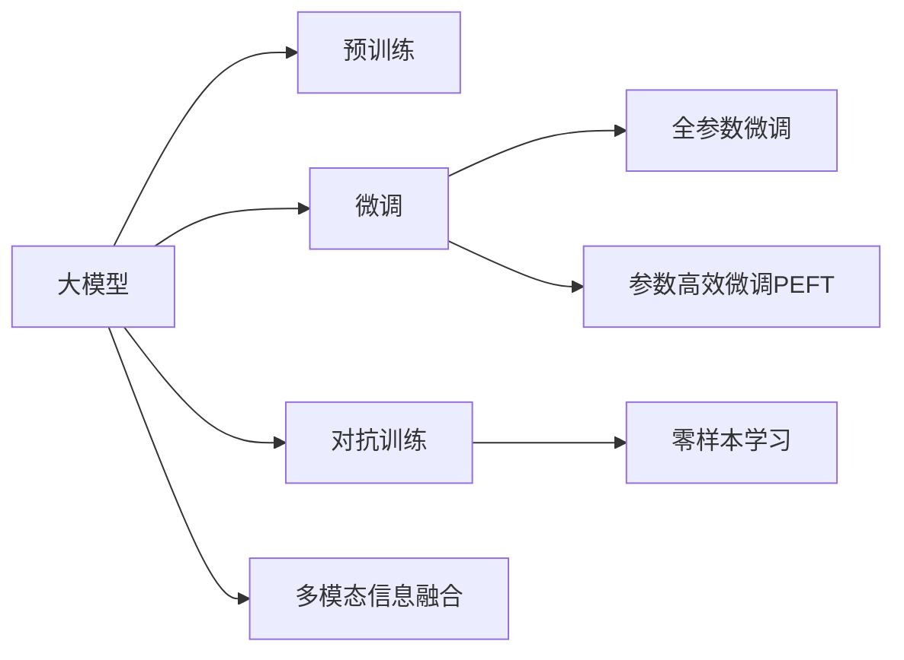

                 

# AI 大模型创业：如何利用创新优势？

## 1. 背景介绍

在人工智能（AI）领域，大模型已经成为一个重要的研究焦点。这些模型，通常基于自监督学习技术，如BERT和GPT系列模型，具有强大的语言理解和生成能力。然而，尽管这些模型在学术界取得了显著进展，但在实际应用中的商业化仍面临诸多挑战。本博客旨在探讨如何通过利用创新优势，加速大模型在创业领域的落地和应用。

### 1.1 大模型的兴起与挑战

大模型如BERT和GPT-3在学术界和工业界都引发了巨大的关注。这些模型通过大规模无标签数据预训练，学习到通用的语言表示，能够对各种NLP任务进行微调，并取得优异表现。然而，大模型的商业化过程中仍存在诸多挑战：

- **计算资源需求高**：大模型的训练和推理需要巨量的计算资源，包括高性能GPU、TPU等。
- **高昂的标注成本**：下游任务的微调往往需要大量标注数据，标注成本高昂。
- **模型可解释性不足**：大模型通常是“黑盒”，缺乏可解释性，难以满足某些行业对算法透明度的需求。

### 1.2 创业机会

尽管存在挑战，大模型的商业化仍提供了巨大的创业机会。通过合理利用创新技术，企业能够高效构建和部署大模型应用，加速NLP技术的落地。这些机会包括：

- **算法和架构创新**：如参数高效微调、对抗训练、零样本学习等，以降低成本和提升效果。
- **领域特定的优化**：针对特定行业或任务进行模型优化和微调，提升模型性能。
- **云计算和边缘计算**：通过云计算和边缘计算技术，优化模型部署和推理效率。
- **多模态信息融合**：将视觉、语音等多模态数据与文本数据融合，提升模型的综合表现。

本文将详细介绍如何通过这些创新技术，加速大模型在创业领域的商业化进程。

## 2. 核心概念与联系

### 2.1 核心概念概述

- **大模型（Large Models）**：基于自监督学习技术，通过大规模数据预训练，学习到通用的语言表示，具有强大的语言理解和生成能力。

- **微调（Fine-Tuning）**：通过有监督的训练，优化模型在特定任务上的性能，通常使用少量标注数据。

- **参数高效微调（Parameter-Efficient Fine-Tuning, PEFT）**：只更新少量模型参数，固定大部分预训练权重，以提高微调效率，避免过拟合。

- **对抗训练（Adversarial Training）**：在训练中加入对抗样本，提高模型的鲁棒性。

- **零样本学习（Zero-Shot Learning）**：模型无需经过微调，仅凭任务描述即可执行新任务。

- **多模态信息融合（Multimodal Information Fusion）**：将视觉、语音等多模态数据与文本数据结合，提升模型的综合表现。

这些概念之间存在紧密的联系，共同构成了大模型创业的关键技术框架。

### 2.2 核心概念原理和架构的 Mermaid 流程图



这个流程图展示了核心概念之间的逻辑关系：

1. 大模型通过预训练学习通用语言表示。
2. 微调通过有监督训练优化模型在特定任务上的表现。
3. 参数高效微调提高微调效率，避免过拟合。
4. 对抗训练增强模型鲁棒性。
5. 零样本学习减少微调需求。
6. 多模态信息融合提升模型综合表现。

## 3. 核心算法原理 & 具体操作步骤

### 3.1 算法原理概述

大模型创业的核心在于如何高效构建和部署大模型应用，提升模型的性能和效率。以下是大模型创业的核心算法原理：

1. **预训练模型选择**：选择合适的预训练模型作为创业项目的起点，如BERT、GPT系列模型。
2. **数据准备**：收集和标注特定任务的数据集，准备微调的标注样本。
3. **微调算法**：使用参数高效微调等技术，最小化对计算资源和标注数据的需求，提升模型性能。
4. **对抗训练**：增强模型对对抗样本的鲁棒性，提高模型的泛化能力。
5. **零样本学习**：利用大模型的语言理解能力，减少微调需求，降低成本。
6. **多模态融合**：将视觉、语音等多模态数据与文本数据结合，提升模型的综合表现。

### 3.2 算法步骤详解

#### 3.2.1 数据准备

1. **数据收集**：收集特定任务的相关数据，如新闻文章、对话记录等。
2. **数据预处理**：进行文本清洗、分词、标注等预处理步骤，准备数据集。
3. **数据划分**：将数据集划分为训练集、验证集和测试集，便于后续的模型训练和评估。

#### 3.2.2 微调算法步骤

1. **模型选择**：选择适合特定任务的预训练模型，如BERT、GPT-3等。
2. **任务适配层设计**：根据任务类型，设计合适的输出层和损失函数，如分类任务使用交叉熵损失，生成任务使用负对数似然损失。
3. **模型初始化**：加载预训练模型权重，进行模型初始化。
4. **训练设置**：设置微调的学习率、批大小、迭代轮数等超参数。
5. **训练过程**：使用训练集进行有监督训练，通过梯度下降等优化算法更新模型参数。
6. **模型评估**：在验证集和测试集上评估模型性能，调整超参数。

#### 3.2.3 参数高效微调（PEFT）

1. **参数冻结**：冻结预训练模型的部分层，只微调顶层。
2. **提示词设计**：设计合适的提示词，引导模型按期望方式输出。
3. **微调优化**：使用梯度累积、混合精度训练等技术优化微调过程。

#### 3.2.4 对抗训练

1. **生成对抗样本**：利用对抗样本生成技术，生成扰动样本。
2. **训练过程**：在训练中加入对抗样本，更新模型参数。
3. **模型评估**：在测试集上评估模型鲁棒性。

#### 3.2.5 零样本学习

1. **任务描述**：提供任务描述，如“根据这段文字描述，猜测上下文所涉及的事件”。
2. **模型推理**：模型通过语言理解能力，预测任务的正确答案。
3. **结果验证**：人工验证模型的推理结果，优化模型参数。

#### 3.2.6 多模态信息融合

1. **多模态数据收集**：收集视觉、语音等多模态数据，作为模型输入。
2. **数据融合**：将多模态数据与文本数据融合，形成统一的表示。
3. **模型训练**：将融合后的数据输入模型，训练模型学习多模态特征。
4. **模型推理**：使用训练好的模型，对多模态数据进行推理预测。

### 3.3 算法优缺点

#### 3.3.1 优点

- **高效性**：通过参数高效微调和对抗训练等技术，最小化对计算资源和标注数据的需求。
- **可扩展性**：模型能够适应各种NLP任务，具有广泛的通用性和可扩展性。
- **鲁棒性**：通过对抗训练等技术，增强模型对对抗样本的鲁棒性，提高模型的泛化能力。
- **低成本**：零样本学习技术减少了微调需求，降低了标注成本。
- **高性能**：通过多模态信息融合等技术，提升模型的综合表现。

#### 3.3.2 缺点

- **高初始成本**：预训练模型和计算资源的高投入是创业初期的主要挑战。
- **模型复杂性**：大模型的复杂性和高计算需求增加了技术实现的难度。
- **数据依赖性**：微调依赖于标注数据，数据获取和标注成本较高。
- **伦理风险**：模型可能学习到有害信息，产生伦理风险。

### 3.4 算法应用领域

大模型在创业领域的广泛应用包括：

- **智能客服**：利用大模型构建智能客服系统，处理客户咨询和问题。
- **金融风控**：使用大模型进行金融舆情监测，预测金融市场风险。
- **医疗诊断**：通过大模型进行医学知识抽取和患者问答，辅助医生诊断。
- **教育辅导**：利用大模型提供个性化学习推荐，提升教学效果。
- **安全监控**：使用大模型进行网络安全监控，识别和应对网络攻击。

## 4. 数学模型和公式 & 详细讲解

### 4.1 数学模型构建

大模型微调的过程可以形式化表示为：

$$
M_{\theta} = \arg\min_{\theta} \mathcal{L}(D)
$$

其中 $M_{\theta}$ 为微调后的模型，$\theta$ 为模型参数，$\mathcal{L}(D)$ 为损失函数，$D$ 为训练数据集。

### 4.2 公式推导过程

以分类任务为例，交叉熵损失函数为：

$$
\mathcal{L}(D) = -\frac{1}{N}\sum_{i=1}^N \sum_{j=1}^C y_{ij}\log P_{ij}
$$

其中 $N$ 为样本数量，$C$ 为类别数，$y_{ij}$ 为样本 $i$ 属于类别 $j$ 的标签，$P_{ij}$ 为模型预测样本 $i$ 属于类别 $j$ 的概率。

梯度下降更新模型的公式为：

$$
\theta \leftarrow \theta - \eta \nabla_{\theta}\mathcal{L}(D)
$$

其中 $\eta$ 为学习率，$\nabla_{\theta}\mathcal{L}(D)$ 为损失函数对模型参数的梯度。

### 4.3 案例分析与讲解

以文本分类任务为例，使用BERT模型进行微调：

1. **数据准备**：收集新闻文章，进行分词和标注。
2. **模型初始化**：加载BERT模型权重，进行模型初始化。
3. **任务适配层设计**：设计输出层和损失函数，如交叉熵损失。
4. **训练设置**：设置学习率、批大小、迭代轮数等超参数。
5. **训练过程**：使用训练集进行有监督训练，更新模型参数。
6. **模型评估**：在验证集和测试集上评估模型性能，调整超参数。

## 5. 项目实践：代码实例和详细解释说明

### 5.1 开发环境搭建

1. **Python环境配置**：安装Python 3.7及以上版本，安装TensorFlow和Keras等深度学习框架。
2. **数据准备**：收集并标注新闻文章数据集，进行预处理。
3. **模型选择**：选择BERT模型作为预训练模型。
4. **任务适配层设计**：设计输出层和损失函数。
5. **训练设置**：设置学习率、批大小、迭代轮数等超参数。

### 5.2 源代码详细实现

```python
import tensorflow as tf
from tensorflow.keras.preprocessing.text import Tokenizer
from tensorflow.keras.preprocessing.sequence import pad_sequences

# 数据准备
texts = ['This is a news article about AI.', 'Another article about AI technology.']
labels = [1, 0] # 1表示AI相关，0表示非AI相关

# 分词和编码
tokenizer = Tokenizer()
tokenizer.fit_on_texts(texts)
sequences = tokenizer.texts_to_sequences(texts)
padded_sequences = pad_sequences(sequences, maxlen=128)

# 模型选择
model = tf.keras.Sequential([
    tf.keras.layers.Embedding(input_dim=len(tokenizer.word_index)+1, output_dim=128, input_length=128),
    tf.keras.layers.LSTM(64),
    tf.keras.layers.Dense(1, activation='sigmoid')
])

# 训练设置
model.compile(loss='binary_crossentropy', optimizer='adam', metrics=['accuracy'])

# 训练过程
model.fit(padded_sequences, labels, epochs=10, batch_size=32)

# 模型评估
test_sequences = tokenizer.texts_to_sequences(['This is a new article.'])
test_padded_sequences = pad_sequences(test_sequences, maxlen=128)
test_loss, test_accuracy = model.evaluate(test_padded_sequences, [1])
print('Test Loss:', test_loss, 'Test Accuracy:', test_accuracy)
```

### 5.3 代码解读与分析

1. **数据准备**：使用Tokenizer对文本进行分词和编码，使用pad_sequences对序列进行填充。
2. **模型选择**：使用Sequential模型，包含嵌入层、LSTM层和全连接层。
3. **训练设置**：使用binary_crossentropy作为损失函数，adam作为优化器。
4. **训练过程**：使用fit方法进行训练，设置epochs和batch_size。
5. **模型评估**：使用evaluate方法进行评估，输出测试集上的损失和准确率。

## 6. 实际应用场景

### 6.1 智能客服系统

利用大模型构建智能客服系统，能够自动处理客户咨询和问题，提高客户满意度和服务效率。

### 6.2 金融风控

通过大模型进行金融舆情监测，预测金融市场风险，辅助金融机构做出决策。

### 6.3 医疗诊断

利用大模型进行医学知识抽取和患者问答，辅助医生进行诊断和治疗。

### 6.4 教育辅导

利用大模型提供个性化学习推荐，提升教学效果和学生的学习体验。

### 6.5 安全监控

使用大模型进行网络安全监控，识别和应对网络攻击，保障网络安全。

## 7. 工具和资源推荐

### 7.1 学习资源推荐

- **深度学习框架**：TensorFlow、Keras、PyTorch等。
- **自然语言处理**：NLTK、SpaCy、Transformers库等。
- **大模型**：Google BERT、OpenAI GPT系列模型等。

### 7.2 开发工具推荐

- **开发环境**：Jupyter Notebook、Google Colab等。
- **云计算平台**：AWS、Google Cloud、阿里云等。
- **数据管理**：Dask、Hadoop、Spark等。

### 7.3 相关论文推荐

- **BERT模型**：Devlin et al., "BERT: Pre-training of Deep Bidirectional Transformers for Language Understanding"。
- **GPT模型**：Radford et al., "Language Models are Unsupervised Multitask Learners"。
- **多模态信息融合**：LeCun et al., "Convolutional Deep Belief Networks for Scalable Unsupervised Learning of Hierarchical Representations"。

## 8. 总结：未来发展趋势与挑战

### 8.1 研究成果总结

大模型在创业领域的广泛应用，展示了其在提升模型性能和效率方面的巨大潜力。通过参数高效微调、对抗训练、零样本学习等多项技术，大模型能够在低成本、高效率的条件下，完成多样化的NLP任务。

### 8.2 未来发展趋势

1. **算法和架构创新**：如模型蒸馏、自适应学习率等，进一步提升模型的效果和效率。
2. **多模态信息融合**：将视觉、语音等多模态数据与文本数据结合，提升模型的综合表现。
3. **零样本学习和跨领域迁移**：利用大模型的语言理解能力，减少微调需求，降低成本。
4. **可解释性和鲁棒性**：增强模型的可解释性和鲁棒性，满足高风险行业的算法透明性和稳定性需求。
5. **伦理和安全性**：在模型训练和应用过程中，引入伦理导向的评估指标，过滤和惩罚有害信息，确保输出安全性。

### 8.3 面临的挑战

1. **计算资源瓶颈**：大模型的训练和推理需要巨量的计算资源，是创业初期的主要挑战。
2. **数据依赖性**：微调依赖于标注数据，数据获取和标注成本较高。
3. **伦理和安全性**：模型可能学习到有害信息，产生伦理风险。
4. **模型复杂性**：大模型的复杂性和高计算需求增加了技术实现的难度。

### 8.4 研究展望

未来的研究应集中在以下几个方面：

1. **高效模型构建**：进一步提升模型的效率和效果，降低计算资源需求。
2. **多模态融合**：探索更多多模态信息的融合方法，提升模型的综合表现。
3. **算法透明性和可解释性**：增强模型的可解释性和鲁棒性，满足高风险行业的算法透明性和稳定性需求。
4. **伦理和安全**：在模型训练和应用过程中，引入伦理导向的评估指标，过滤和惩罚有害信息，确保输出安全性。

## 9. 附录：常见问题与解答

**Q1：大模型创业的主要挑战是什么？**

A: 大模型创业的主要挑战包括计算资源需求高、标注成本高昂、模型复杂性大、数据依赖性强、伦理和安全性问题等。

**Q2：如何选择适合特定任务的预训练模型？**

A: 选择适合特定任务的预训练模型，需要考虑模型的通用性和任务特点。BERT适用于通用文本处理任务，GPT系列模型适用于生成任务，如对话生成和摘要生成。

**Q3：如何高效利用数据进行微调？**

A: 高效利用数据进行微调，可以通过数据增强、正则化、对抗训练等技术，最小化对标注数据的需求，提升模型性能。

**Q4：如何提高模型的鲁棒性和可解释性？**

A: 提高模型的鲁棒性，可以通过对抗训练等技术，增强模型对对抗样本的鲁棒性。提高模型的可解释性，可以通过可解释性工具和算法，如LIME、SHAP等。

**Q5：如何平衡模型性能和资源消耗？**

A: 平衡模型性能和资源消耗，可以通过参数高效微调、对抗训练、多模态融合等技术，最小化计算资源需求，提升模型效果。

**Q6：如何确保模型的伦理和安全性？**

A: 确保模型的伦理和安全性，需要在模型训练和应用过程中引入伦理导向的评估指标，过滤和惩罚有害信息，确保输出安全性。

---

作者：禅与计算机程序设计艺术 / Zen and the Art of Computer Programming

