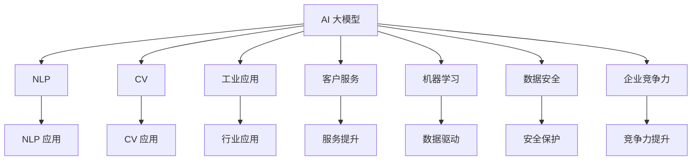

                 

# AI 大模型创业：如何利用品牌优势？

> 关键词：AI 大模型, 创业, 品牌优势, 自然语言处理(NLP), 计算机视觉(CV), 工业应用, 客户服务, 机器学习, 数据安全, 企业竞争力

## 1. 背景介绍

### 1.1 问题由来

近年来，人工智能(AI)技术迅速发展，成为企业创新的重要驱动力。大模型是AI技术的重要组成部分，以其强大的泛化能力和表现力，在自然语言处理(NLP)、计算机视觉(CV)等多个领域取得了显著成效。然而，随着AI大模型的应用日益普及，企业如何利用大模型品牌优势，提升自身竞争力，也成为行业关注的热点。

### 1.2 问题核心关键点

1. **品牌优势的利用**：如何通过大模型的品牌效应，提升企业的市场知名度和客户信任度？
2. **数据资源的整合**：如何高效整合大模型所需的大量数据资源？
3. **技术栈的优化**：如何优化技术栈，确保大模型的高效部署和应用？
4. **客户服务的创新**：如何利用大模型提高客户服务质量和效率？
5. **数据安全和隐私保护**：如何在保证数据安全和隐私的前提下，利用大模型提升企业竞争力？

## 2. 核心概念与联系

### 2.1 核心概念概述

- **AI 大模型**：基于大规模深度学习模型，如GPT-3、BERT等，具备强大的语言理解、生成和视觉识别能力，广泛应用于自然语言处理和计算机视觉等领域。
- **品牌优势**：企业通过大模型技术积累的品牌效应，包括技术领先、行业认可、用户信任等，可以提升企业市场竞争力。
- **NLP（自然语言处理）**：研究如何让计算机理解和生成人类语言的技术，包括文本分类、情感分析、问答系统等。
- **CV（计算机视觉）**：研究如何让计算机理解和处理图像、视频等视觉数据的技术，包括目标检测、图像分割、图像生成等。
- **工业应用**：将大模型技术应用于具体行业，提升企业的生产效率和产品质量。
- **客户服务**：利用AI大模型提升客户服务质量，如智能客服、智能推荐等。
- **机器学习**：利用数据和算法，让计算机自动从经验中学习改进的技术。
- **数据安全**：保护企业数据和用户隐私，避免数据泄露和滥用。
- **企业竞争力**：企业通过技术创新和品牌建设，提升市场份额和盈利能力。

这些概念之间的逻辑关系可以通过以下Mermaid流程图来展示：



## 3. 核心算法原理 & 具体操作步骤

### 3.1 算法原理概述

利用AI大模型的品牌优势，可以通过以下步骤进行：

1. **品牌宣传与营销**：通过展示大模型的技术优势和成功案例，提升企业品牌知名度。
2. **技术融合与创新**：将大模型技术与现有业务流程深度融合，创造新的应用场景和产品。
3. **数据资源整合**：高效整合和利用大模型所需的数据资源，提升数据处理效率。
4. **客户服务优化**：利用大模型提升客户服务质量和效率，增强客户满意度。
5. **数据安全保障**：通过数据加密和隐私保护技术，确保数据安全。
6. **企业竞争力提升**：利用大模型技术提升企业的生产效率和市场竞争力。

### 3.2 算法步骤详解

**Step 1: 品牌宣传与营销**

1. **技术展示与案例分析**：在企业官网、社交媒体等平台展示大模型的技术优势和成功案例。
2. **合作伙伴关系**：与行业内的知名企业建立合作关系，共同推广大模型应用。
3. **技术研讨会与培训**：举办技术研讨会和培训课程，提升客户对大模型的认识和信任。

**Step 2: 技术融合与创新**

1. **业务流程优化**：将大模型技术与现有业务流程深度融合，创造新的应用场景和产品。
2. **数据驱动决策**：利用大模型处理海量数据，辅助企业做出更好的决策。
3. **产品创新**：开发基于大模型的创新产品，提升企业竞争力。

**Step 3: 数据资源整合**

1. **数据收集与整理**：从企业内部和外部收集所需的数据资源，进行清洗和标注。
2. **数据平台搭建**：搭建数据处理和存储平台，实现数据的高效管理和利用。
3. **数据共享与合作**：与行业内的其他企业合作，共享数据资源。

**Step 4: 客户服务优化**

1. **智能客服系统**：利用大模型技术开发智能客服系统，提升客户服务效率和质量。
2. **智能推荐系统**：利用大模型处理用户行为数据，提供个性化的产品推荐。
3. **客户情感分析**：利用大模型进行客户情感分析，提升客户满意度。

**Step 5: 数据安全保障**

1. **数据加密**：对敏感数据进行加密存储和传输，防止数据泄露。
2. **隐私保护**：遵循GDPR等隐私保护法规，保护用户隐私。
3. **安全监控**：利用安全监控技术，及时发现和应对潜在威胁。

**Step 6: 企业竞争力提升**

1. **生产效率提升**：利用大模型优化生产流程，提高生产效率。
2. **产品质量提升**：利用大模型进行质量检测和预测，提升产品质量。
3. **市场扩展**：通过大模型技术提升企业市场竞争力，拓展新市场。

### 3.3 算法优缺点

**优点**：

1. **技术领先**：利用大模型技术，企业可以保持技术领先地位。
2. **客户信任**：客户对大模型技术的信任度高，有助于提升品牌影响力。
3. **效率提升**：利用大模型处理数据，提升业务效率。
4. **创新能力**：大模型技术为企业的创新提供了新的动力。

**缺点**：

1. **数据需求大**：大模型需要大量的标注数据，数据收集和处理成本高。
2. **资源消耗大**：大模型训练和部署需要高性能硬件，资源消耗大。
3. **技术复杂**：大模型技术复杂，需要专业团队进行维护和优化。
4. **安全风险**：大模型处理敏感数据，需要高度关注数据安全和隐私保护。

## 4. 数学模型和公式 & 详细讲解 & 举例说明

### 4.1 数学模型构建

假设企业拥有一个大规模预训练语言模型$M$，其参数为$\theta$。企业希望通过大模型提升品牌知名度，并应用于NLP任务。

**Step 1: 任务定义**

- 定义NLP任务：文本分类、情感分析、问答系统等。
- 收集训练数据：$D=\{(x_i, y_i)\}_{i=1}^N$，其中$x_i$为输入文本，$y_i$为任务标签。

**Step 2: 模型构建**

- 加载预训练模型$M$。
- 添加任务适配层，如线性分类器或解码器。
- 定义损失函数：如交叉熵损失、均方误差损失等。

**Step 3: 训练与微调**

- 定义优化器，如AdamW。
- 设置学习率$\eta$和批大小$batch\_size$。
- 执行梯度下降优化，更新模型参数。

### 4.2 公式推导过程

**Step 1: 任务损失函数**

- 假设任务为二分类任务，标签$y \in \{0, 1\}$。
- 定义损失函数：$\ell(M(x), y) = -[y\log M(x) + (1-y)\log(1-M(x))]$。

**Step 2: 模型训练公式**

- 梯度下降优化公式：$\theta \leftarrow \theta - \eta \nabla_{\theta} \ell(M(x), y)$。
- 批梯度下降公式：$\eta \leftarrow \frac{\eta}{batch\_size}$。

**Step 3: 参数更新公式**

- 更新公式：$\theta \leftarrow \theta - \eta \nabla_{\theta} \ell(M(x), y) - \eta \lambda \theta$，其中$\lambda$为正则化系数。

### 4.3 案例分析与讲解

**案例分析**：某电商平台利用大模型提升客户服务体验。

1. **品牌宣传**：展示大模型技术优势，吸引新用户。
2. **智能客服**：利用大模型进行智能客服，提升用户体验。
3. **情感分析**：利用大模型进行情感分析，优化商品推荐。
4. **数据安全**：对用户数据进行加密和隐私保护。
5. **企业竞争力**：提升客户满意度和市场竞争力。

## 5. 项目实践：代码实例和详细解释说明

### 5.1 开发环境搭建

1. **硬件配置**：高性能CPU/GPU、大容量内存和存储。
2. **软件环境**：Python、PyTorch、TensorFlow等深度学习框架。
3. **开发工具**：Jupyter Notebook、PyCharm等。
4. **数据平台**：AWS、Google Cloud等云平台。

### 5.2 源代码详细实现

以下是一个使用PyTorch进行文本分类的示例代码：

```python
import torch
import torch.nn as nn
import torch.optim as optim
from torch.utils.data import Dataset, DataLoader

class TextDataset(Dataset):
    def __init__(self, texts, labels):
        self.texts = texts
        self.labels = labels
        
    def __len__(self):
        return len(self.texts)
    
    def __getitem__(self, idx):
        text = self.texts[idx]
        label = self.labels[idx]
        return text, label

# 加载预训练模型
model = BertForSequenceClassification.from_pretrained('bert-base-cased', num_labels=2)

# 加载数据集
train_dataset = TextDataset(train_texts, train_labels)
test_dataset = TextDataset(test_texts, test_labels)

# 定义优化器和损失函数
optimizer = AdamW(model.parameters(), lr=2e-5)
criterion = nn.CrossEntropyLoss()

# 训练模型
for epoch in range(10):
    for text, label in DataLoader(train_dataset, batch_size=16):
        optimizer.zero_grad()
        outputs = model(text)
        loss = criterion(outputs, label)
        loss.backward()
        optimizer.step()

# 评估模型
with torch.no_grad():
    correct = 0
    total = 0
    for text, label in DataLoader(test_dataset, batch_size=16):
        outputs = model(text)
        _, predicted = torch.max(outputs, 1)
        total += label.size(0)
        correct += (predicted == label).sum().item()
    print('Accuracy: {:.2f}%'.format(correct/total*100))
```

### 5.3 代码解读与分析

**代码解读**：

1. **数据集定义**：定义文本数据集和标签数据集，用于模型训练和测试。
2. **模型加载**：加载预训练模型BertForSequenceClassification，用于文本分类任务。
3. **优化器和损失函数定义**：定义AdamW优化器和交叉熵损失函数。
4. **训练过程**：使用DataLoader对数据集进行批次化处理，通过梯度下降优化更新模型参数。
5. **模型评估**：在测试集上评估模型性能，计算准确率。

**分析**：

1. **数据预处理**：数据集定义过程中，需要对文本数据进行预处理，如分词、编码等。
2. **模型适配**：根据具体任务需求，适配预训练模型的顶层输出层和损失函数。
3. **模型训练**：使用优化器更新模型参数，训练过程中需要注意学习率、批大小等参数的调整。
4. **模型评估**：模型训练完成后，需要在新数据集上进行评估，确保模型泛化性能。

### 5.4 运行结果展示

在训练完成后，可以使用测试集对模型进行评估，计算准确率等指标。

## 6. 实际应用场景

### 6.1 智能客服系统

**应用场景**：智能客服系统可以利用大模型提升客户服务质量，处理客户咨询，提供实时响应。

**实现步骤**：

1. **数据收集**：收集客户咨询记录，标注客户意图和回复。
2. **模型训练**：利用大模型进行微调，训练智能客服模型。
3. **系统集成**：将训练好的模型集成到客服系统中，实现自动回复。
4. **效果评估**：对系统进行效果评估，优化模型参数。

### 6.2 金融舆情监测

**应用场景**：金融机构需要实时监测金融舆情，以评估市场动态，规避风险。

**实现步骤**：

1. **数据收集**：收集金融新闻、评论等数据。
2. **模型训练**：利用大模型进行情感分析，识别舆情变化。
3. **预警系统**：根据舆情分析结果，建立预警系统，及时发现潜在风险。
4. **效果评估**：评估舆情监测系统的准确率和响应速度。

### 6.3 个性化推荐系统

**应用场景**：电商平台需要根据用户行为推荐个性化商品，提升用户体验。

**实现步骤**：

1. **数据收集**：收集用户浏览、点击等行为数据。
2. **模型训练**：利用大模型进行推荐模型训练，计算用户兴趣。
3. **推荐引擎**：将训练好的模型集成到推荐系统中，生成个性化推荐。
4. **效果评估**：评估推荐系统的点击率和转化率。

### 6.4 未来应用展望

未来，随着大模型技术的不断发展，其在各个领域的应用将更加广泛。以下是几个可能的发展方向：

1. **医疗健康**：利用大模型进行医学影像分析、疾病预测等。
2. **教育培训**：利用大模型进行个性化教学、智能辅导等。
3. **城市治理**：利用大模型进行城市事件监测、公共安全等。
4. **农业管理**：利用大模型进行农业数据监测、精准农业等。
5. **交通物流**：利用大模型进行交通流量预测、路径规划等。

## 7. 工具和资源推荐

### 7.1 学习资源推荐

1. **自然语言处理课程**：斯坦福大学《CS224N: 自然语言处理与深度学习》。
2. **计算机视觉课程**：Coursera《Deep Learning Specialization》。
3. **深度学习框架**：PyTorch官方文档、TensorFlow官方文档。
4. **大模型资源**：Hugging Face的Transformers库。
5. **数据处理工具**：Pandas、NumPy。

### 7.2 开发工具推荐

1. **深度学习框架**：PyTorch、TensorFlow。
2. **数据处理工具**：Pandas、NumPy。
3. **机器学习框架**：Scikit-Learn。
4. **可视化工具**：TensorBoard、Weights & Biases。

### 7.3 相关论文推荐

1. **大模型论文**：GPT-3、BERT等预训练模型论文。
2. **自然语言处理论文**：《Attention is All You Need》、《BERT: Pre-training of Deep Bidirectional Transformers for Language Understanding》。
3. **计算机视觉论文**：《R-CNN》、《Faster R-CNN》。

## 8. 总结：未来发展趋势与挑战

### 8.1 研究成果总结

大模型技术在提升企业品牌知名度和客户服务质量方面具有巨大潜力。通过数据驱动决策、智能客服系统、个性化推荐等应用，企业可以大幅提升竞争力。

### 8.2 未来发展趋势

1. **技术融合**：大模型技术与业务流程深度融合，创造更多应用场景。
2. **数据驱动**：利用大模型处理海量数据，提升决策质量。
3. **客户服务**：利用大模型提升客户服务体验，增强客户满意度。
4. **数据安全**：加强数据安全保护，确保数据隐私。

### 8.3 面临的挑战

1. **数据需求大**：大模型需要大量数据进行训练，数据收集和处理成本高。
2. **资源消耗大**：大模型训练和部署需要高性能硬件，资源消耗大。
3. **技术复杂**：大模型技术复杂，需要专业团队进行维护和优化。
4. **安全风险**：大模型处理敏感数据，需要高度关注数据安全和隐私保护。

### 8.4 研究展望

未来研究将重点关注以下几个方向：

1. **数据高效**：研究如何高效收集和利用数据资源，降低大模型训练成本。
2. **模型优化**：优化大模型结构和训练算法，提升性能和资源效率。
3. **安全保障**：研究数据加密、隐私保护等技术，保障数据安全。
4. **应用创新**：探索更多应用场景，提升企业竞争力。

## 9. 附录：常见问题与解答

**Q1: 如何确保大模型数据的安全性？**

**A1:** 采用数据加密、隐私保护等技术，确保数据在存储和传输过程中的安全。

**Q2: 大模型对企业数据处理有什么影响？**

**A2:** 大模型需要大量数据进行训练，可以有效提升数据处理和决策质量，但同时数据需求大，成本高。

**Q3: 大模型技术对企业客户服务有哪些优势？**

**A3:** 大模型技术可以提升客户服务质量和效率，实现智能客服、情感分析等应用，增强客户满意度。

**Q4: 大模型在企业应用中需要注意哪些问题？**

**A4:** 大模型应用中需要注意数据安全、资源消耗、技术复杂等问题，需要综合考虑。

---

作者：禅与计算机程序设计艺术 / Zen and the Art of Computer Programming

