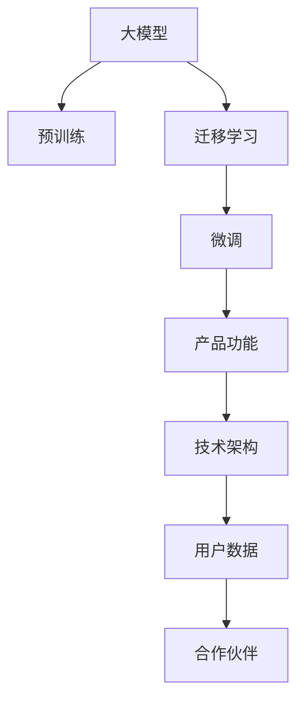

                 

# AI 大模型创业：如何利用商业优势？

## 1. 背景介绍

### 1.1 问题由来

随着人工智能(AI)技术的不断发展和商业应用的深化，大模型如BERT、GPT-3等在自然语言处理(NLP)、计算机视觉(CV)、语音识别(SR)等领域的突破性表现，吸引了众多创业者和投资者的关注。这些大模型经过大规模数据训练，具备卓越的泛化能力和复杂任务处理能力，为各行各业带来了前所未有的商业机会。

然而，虽然大模型的技术能力强大，但其商业化应用过程中仍面临诸多挑战。如何高效利用大模型的商业优势，最大化其商业价值，成为创业者和投资者的重要课题。本文将从大模型的商业应用出发，探讨如何通过商业模式、产品设计、技术架构等手段，将大模型的优势转化为可观的商业收益。

### 1.2 问题核心关键点

本文的核心在于揭示如何将大模型的技术优势转化为商业应用，具体包括：
- 商业模式的设计与选择
- 产品功能的设计与开发
- 技术架构的优化与调整
- 用户数据的使用与保护
- 合作伙伴关系的构建与维护

通过深入分析这些关键点，我们旨在为有意利用大模型的创业者和投资者提供系统的指导，帮助他们在大模型商业化的道路上取得成功。

## 2. 核心概念与联系

### 2.1 核心概念概述

为更好地理解大模型的商业应用，本节将介绍几个密切相关的核心概念：

- 大模型(Large Model)：指基于大规模数据训练的深度神经网络模型，如BERT、GPT-3等，具备强大的泛化能力和复杂任务处理能力。
- 预训练(Pre-training)：指在大规模无标签数据上，通过自监督学习任务训练通用模型的过程。
- 迁移学习(Transfer Learning)：指将预训练模型应用到下游任务上，通过少量有标签数据进行微调，以提高模型在该任务上的性能。
- 微调(Fine-tuning)：指在预训练模型的基础上，使用下游任务的少量有标签数据进行优化，使其更好地适应特定任务。
- 产品功能(Product Functionality)：指为满足用户需求，产品需要具备的核心功能和辅助功能。
- 技术架构(Technical Architecture)：指支撑产品功能的底层技术组件和架构设计，包括但不限于云计算、分布式存储、数据处理等。
- 用户数据(User Data)：指用户在使用产品过程中产生的各类数据，包括但不限于文本、图像、视频等。
- 合作伙伴(Partnerships)：指与产品紧密合作的第三方机构，如数据提供者、技术供应商、法规监管机构等。

这些核心概念之间的逻辑关系可以通过以下Mermaid流程图来展示：



这个流程图展示了大模型的核心概念及其之间的关系：

1. 大模型通过预训练获得基础能力。
2. 通过迁移学习，将预训练模型应用于下游任务，提升模型在该任务上的性能。
3. 利用微调，进一步优化模型，以适应特定任务的要求。
4. 基于优化后的模型，设计产品功能，满足用户需求。
5. 根据产品功能需求，构建技术架构，支撑产品运行。
6. 在产品运行过程中，收集用户数据，用于产品优化和反馈。
7. 与其他合作伙伴建立合作关系，共同推动产品发展。

这些概念共同构成了大模型商业应用的框架，使其能够在各种场景下发挥强大的作用。通过理解这些核心概念，我们可以更好地把握大模型的商业价值和应用策略。

## 3. 核心算法原理 & 具体操作步骤

### 3.1 算法原理概述

利用大模型的商业应用，核心在于将模型的技术优势转化为实际产品功能，并通过合理的商业模式和运营策略，最大化其商业价值。大模型本身不具备直接产生商业价值的能力，但其强大的泛化能力和复杂任务处理能力，可以为产品功能和商业模式设计提供基础支持。

### 3.2 算法步骤详解

基于大模型的商业应用，一般包括以下几个关键步骤：

**Step 1: 确定产品功能和目标市场**

- 深入分析目标市场的需求，设计符合市场需求的商业功能。
- 根据市场需求，选择适当的商业模式，如SaaS、B2B、B2C等。
- 确定产品的核心竞争力和差异化特征。

**Step 2: 构建技术架构**

- 根据产品功能需求，选择合适的云计算平台，如AWS、阿里云、华为云等。
- 设计数据处理和存储架构，确保数据安全和高效存储。
- 构建网络架构，确保系统稳定性和可扩展性。
- 设计API接口，提供第三方调用服务。

**Step 3: 优化算法和模型**

- 根据产品功能和市场需求，选择适当的模型和算法，进行优化和微调。
- 设计高效的训练流程，优化算法性能。
- 利用数据增强、对抗训练等技术，提高模型鲁棒性。

**Step 4: 设计和开发产品**

- 基于技术架构和算法优化，设计和开发产品原型。
- 设计用户界面(UI)和用户体验(UX)，提升产品易用性。
- 进行用户测试，收集反馈，不断优化产品功能。

**Step 5: 市场推广和运营**

- 制定市场推广策略，选择合适的营销渠道，如社交媒体、SEO、广告等。
- 设计和实施用户体验(UX)和客户支持策略，提升用户满意度。
- 建立合作伙伴关系，共同推广产品。

**Step 6: 监测和反馈**

- 实时监测产品性能和用户反馈，及时进行优化和改进。
- 收集用户数据，用于模型训练和产品优化。
- 定期评估商业模式效果，调整和优化市场策略。

以上是基于大模型的商业应用的一般流程。在实际应用中，还需要根据具体产品需求和市场环境，对各环节进行优化设计，以进一步提升产品性能和市场竞争力。

### 3.3 算法优缺点

利用大模型的商业应用，具有以下优点：
1. 高效泛化：大模型具备强大的泛化能力，可以适应多种业务场景，减少定制开发的工作量。
2. 快速迭代：大模型的优化和微调过程较短，可以快速迭代产品功能，满足市场需求。
3. 成本效益：相比于从头开发，大模型的商业应用成本较低，有助于快速回收投资。
4. 市场竞争力：大模型的强大技术优势，可以提升产品的市场竞争力，吸引更多用户和合作伙伴。

同时，该方法也存在一定的局限性：
1. 数据依赖：大模型应用依赖于高质量的数据集，数据获取和标注成本较高。
2. 技术门槛：大模型的技术复杂性较高，需要专业团队进行开发和维护。
3. 法律风险：大模型的使用可能涉及数据隐私、知识产权等法律问题。
4. 可解释性：大模型的决策过程较为复杂，缺乏明确的可解释性，可能影响用户信任。

尽管存在这些局限性，但就目前而言，利用大模型的商业应用仍是大模型应用的最主流范式。未来相关研究的重点在于如何进一步降低大模型应用的数据和成本依赖，提高模型的可解释性和安全性，同时兼顾产品的市场竞争力。

### 3.4 算法应用领域

利用大模型的商业应用，已经在医疗、金融、零售、教育等多个领域取得了显著成效。

1. 医疗领域：利用大模型进行医学图像分析、疾病诊断、个性化治疗推荐等。大模型的强大泛化能力，可以在不同医院和患者数据上进行迁移学习，提升诊断准确性和治疗效果。

2. 金融领域：利用大模型进行风险评估、信用评分、反欺诈检测等。大模型的复杂任务处理能力，可以帮助金融机构识别潜在的风险点和欺诈行为，提高金融安全性和服务质量。

3. 零售领域：利用大模型进行商品推荐、库存管理、市场分析等。大模型的推荐能力，可以在大数据背景下，提供个性化的购物建议，提高用户体验和商家销售额。

4. 教育领域：利用大模型进行学习数据分析、个性化学习推荐等。大模型的知识图谱和逻辑推理能力，可以帮助教育机构设计更加科学的教学方案，提升教育质量。

除了上述这些经典领域外，大模型还被创新性地应用到更多场景中，如智能客服、智能家居、智能交通等，为各行各业带来了新的变革。

## 4. 数学模型和公式 & 详细讲解 & 举例说明

### 4.1 数学模型构建

本节将使用数学语言对大模型在商业应用中的数学模型进行更加严格的刻画。

记大模型为 $M_{\theta}$，其中 $\theta$ 为模型参数。假设商业应用的目标任务为 $T$，需求为 $y$，则目标任务 $T$ 的优化目标为：

$$
\min_{\theta} \|M_{\theta}(x) - y\|
$$

其中 $x$ 为输入数据，$\|.\|$ 为损失函数，用于衡量模型输出与真实需求之间的差异。常见的损失函数包括均方误差、交叉熵等。

### 4.2 公式推导过程

以下我们以推荐系统为例，推导均方误差损失函数及其梯度计算公式。

假设推荐系统需要根据用户历史行为 $x$，预测用户对商品 $y$ 的需求 $z$。推荐系统模型的输出 $M_{\theta}(x)$ 为商品 $y$ 对用户 $x$ 的推荐分数。均方误差损失函数定义为：

$$
L(y,z) = \frac{1}{N} \sum_{i=1}^N (z_i - y_i)^2
$$

将其代入优化目标，得：

$$
\min_{\theta} \frac{1}{N} \sum_{i=1}^N \|M_{\theta}(x_i) - y_i\|^2
$$

根据链式法则，损失函数对参数 $\theta_k$ 的梯度为：

$$
\frac{\partial L(y,z)}{\partial \theta_k} = \frac{2}{N} \sum_{i=1}^N \frac{\partial M_{\theta}(x_i)}{\partial \theta_k} \cdot (z_i - y_i)
$$

其中 $\frac{\partial M_{\theta}(x_i)}{\partial \theta_k}$ 可进一步递归展开，利用自动微分技术完成计算。

在得到损失函数的梯度后，即可带入参数更新公式，完成模型的迭代优化。重复上述过程直至收敛，最终得到适应商业任务的最优模型参数 $\theta^*$。

### 4.3 案例分析与讲解

**推荐系统案例分析**

推荐系统是利用大模型在商业应用中的典型案例。推荐系统通过分析用户历史行为数据，预测用户对商品的兴趣和需求，从而推荐相应的商品。

在技术实现上，可以采用大模型进行用户行为序列的编码，并通过嵌入层和全连接层进行预测。具体步骤如下：

1. 收集用户的历史行为数据，包括点击、浏览、购买等行为。
2. 对用户行为进行序列编码，形成输入序列 $x$。
3. 利用大模型 $M_{\theta}$ 对输入序列 $x$ 进行编码，得到用户行为特征向量 $z$。
4. 设计推荐模型，如基于矩阵分解的方法，预测用户对商品的需求 $y$。
5. 根据均方误差损失函数计算模型输出与真实需求之间的差距。
6. 利用梯度下降等优化算法，更新模型参数 $\theta$，最小化损失函数。
7. 在训练集和验证集上评估模型性能，优化超参数，防止过拟合。
8. 在测试集上评估模型效果，部署到实际推荐系统中。

通过以上步骤，可以构建出高效准确的推荐系统，提升用户的购物体验和商家的销售额。

## 5. 项目实践：代码实例和详细解释说明

### 5.1 开发环境搭建

在进行商业应用开发前，我们需要准备好开发环境。以下是使用Python进行PyTorch开发的环境配置流程：

1. 安装Anaconda：从官网下载并安装Anaconda，用于创建独立的Python环境。

2. 创建并激活虚拟环境：
```bash
conda create -n pytorch-env python=3.8 
conda activate pytorch-env
```

3. 安装PyTorch：根据CUDA版本，从官网获取对应的安装命令。例如：
```bash
conda install pytorch torchvision torchaudio cudatoolkit=11.1 -c pytorch -c conda-forge
```

4. 安装TensorFlow：
```bash
pip install tensorflow
```

5. 安装各类工具包：
```bash
pip install numpy pandas scikit-learn matplotlib tqdm jupyter notebook ipython
```

完成上述步骤后，即可在`pytorch-env`环境中开始商业应用开发。

### 5.2 源代码详细实现

下面我们以推荐系统为例，给出使用TensorFlow进行大模型微调的PyTorch代码实现。

首先，定义推荐系统的数据处理函数：

```python
import tensorflow as tf
from tensorflow.keras.layers import Input, Dense
from tensorflow.keras.models import Model

def create_model(input_dim, output_dim):
    input = Input(shape=(input_dim,))
    x = Dense(64, activation='relu')(input)
    x = Dense(64, activation='relu')(x)
    output = Dense(output_dim, activation='sigmoid')(x)
    model = Model(inputs=input, outputs=output)
    model.compile(loss='binary_crossentropy', optimizer='adam', metrics=['accuracy'])
    return model
```

然后，定义模型和优化器：

```python
model = create_model(input_dim, output_dim)
optimizer = tf.keras.optimizers.Adam(learning_rate=0.001)
```

接着，定义训练和评估函数：

```python
def train_model(model, X_train, y_train, X_val, y_val, epochs=10):
    model.fit(X_train, y_train, batch_size=32, epochs=epochs, validation_data=(X_val, y_val))
    return model

def evaluate_model(model, X_test, y_test):
    loss, accuracy = model.evaluate(X_test, y_test)
    print(f'Test Loss: {loss:.4f}')
    print(f'Test Accuracy: {accuracy:.4f}')
```

最后，启动训练流程并在测试集上评估：

```python
X_train, y_train, X_val, y_val, X_test, y_test = load_data(input_dim, output_dim)

model = train_model(model, X_train, y_train, X_val, y_val, epochs=10)

evaluate_model(model, X_test, y_test)
```

以上就是使用TensorFlow对推荐系统进行微调的完整代码实现。可以看到，TensorFlow的高级API封装使得模型构建和训练变得简洁高效。

### 5.3 代码解读与分析

让我们再详细解读一下关键代码的实现细节：

**create_model函数**：
- 定义推荐系统的输入层、隐藏层和输出层，采用ReLU激活函数。
- 输出层采用sigmoid激活函数，预测用户是否对商品感兴趣。
- 通过编译模型，设置损失函数和优化器。

**train_model函数**：
- 在训练集上调用模型的fit方法，设置训练轮数和批次大小，并进行模型验证。

**evaluate_model函数**：
- 在测试集上调用模型的evaluate方法，评估模型性能，并输出损失和准确率。

**训练流程**：
- 加载数据集，定义模型和优化器
- 在训练集上训练模型，并在验证集上进行评估
- 在测试集上评估模型效果

通过以上步骤，可以构建出高效准确的推荐系统，提升用户的购物体验和商家的销售额。

## 6. 实际应用场景

### 6.1 智能客服系统

利用大模型构建的智能客服系统，可以大幅度提升客户服务质量，减少人力成本。传统客服系统需要大量人工，高峰期响应时间长，且客服质量难以保证。而智能客服系统通过大模型微调，可以实现24/7不间断服务，快速响应客户咨询，并提供准确、一致的回答。

在技术实现上，可以收集企业内部的历史客服对话记录，将问题和最佳答复构建成监督数据，在此基础上对预训练模型进行微调。微调后的模型能够自动理解用户意图，匹配最合适的答案模板进行回复。对于客户提出的新问题，还可以接入检索系统实时搜索相关内容，动态组织生成回答。如此构建的智能客服系统，能大幅提升客户咨询体验和问题解决效率。

### 6.2 金融舆情监测

金融机构需要实时监测市场舆论动向，以便及时应对负面信息传播，规避金融风险。传统的人工监测方式成本高、效率低，难以应对网络时代海量信息爆发的挑战。利用大模型构建的金融舆情监测系统，可以通过微调技术学习金融领域相关的新闻、报道、评论等文本数据，判断文本属于何种主题，情感倾向是正面、中性还是负面。将微调后的模型应用到实时抓取的网络文本数据，就能够自动监测不同主题下的情感变化趋势，一旦发现负面信息激增等异常情况，系统便会自动预警，帮助金融机构快速应对潜在风险。

### 6.3 个性化推荐系统

当前的推荐系统往往只依赖用户的历史行为数据进行物品推荐，无法深入理解用户的真实兴趣偏好。利用大模型构建的个性化推荐系统，可以更好地挖掘用户行为背后的语义信息，从而提供更精准、多样的推荐内容。

在技术实现上，可以收集用户浏览、点击、评论、分享等行为数据，提取和用户交互的物品标题、描述、标签等文本内容。将文本内容作为模型输入，用户的后续行为（如是否点击、购买等）作为监督信号，在此基础上微调预训练语言模型。微调后的模型能够从文本内容中准确把握用户的兴趣点。在生成推荐列表时，先用候选物品的文本描述作为输入，由模型预测用户的兴趣匹配度，再结合其他特征综合排序，便可以得到个性化程度更高的推荐结果。

### 6.4 未来应用展望

随着大模型的不断发展，其在商业应用中的潜力将进一步显现。未来，大模型将在更多领域得到应用，为传统行业带来变革性影响。

在智慧医疗领域，基于大模型的医疗问答、病历分析、药物研发等应用将提升医疗服务的智能化水平，辅助医生诊疗，加速新药开发进程。

在智能教育领域，微调技术可应用于作业批改、学情分析、知识推荐等方面，因材施教，促进教育公平，提高教学质量。

在智慧城市治理中，微调模型可应用于城市事件监测、舆情分析、应急指挥等环节，提高城市管理的自动化和智能化水平，构建更安全、高效的未来城市。

此外，在企业生产、社会治理、文娱传媒等众多领域，基于大模型微调的人工智能应用也将不断涌现，为经济社会发展注入新的动力。

## 7. 工具和资源推荐

### 7.1 学习资源推荐

为了帮助开发者系统掌握大模型在商业应用中的理论和实践，这里推荐一些优质的学习资源：

1. 《Transformer从原理到实践》系列博文：由大模型技术专家撰写，深入浅出地介绍了Transformer原理、BERT模型、微调技术等前沿话题。

2. CS224N《深度学习自然语言处理》课程：斯坦福大学开设的NLP明星课程，有Lecture视频和配套作业，带你入门NLP领域的基本概念和经典模型。

3. 《Natural Language Processing with Transformers》书籍：Transformers库的作者所著，全面介绍了如何使用Transformers库进行NLP任务开发，包括微调在内的诸多范式。

4. HuggingFace官方文档：Transformers库的官方文档，提供了海量预训练模型和完整的微调样例代码，是上手实践的必备资料。

5. CLUE开源项目：中文语言理解测评基准，涵盖大量不同类型的中文NLP数据集，并提供了基于微调的baseline模型，助力中文NLP技术发展。

通过对这些资源的学习实践，相信你一定能够快速掌握大模型在商业应用中的精髓，并用于解决实际的NLP问题。

### 7.2 开发工具推荐

高效的开发离不开优秀的工具支持。以下是几款用于大模型商业应用开发的常用工具：

1. PyTorch：基于Python的开源深度学习框架，灵活动态的计算图，适合快速迭代研究。大部分预训练语言模型都有PyTorch版本的实现。

2. TensorFlow：由Google主导开发的开源深度学习框架，生产部署方便，适合大规模工程应用。同样有丰富的预训练语言模型资源。

3. Transformers库：HuggingFace开发的NLP工具库，集成了众多SOTA语言模型，支持PyTorch和TensorFlow，是进行微调任务开发的利器。

4. Weights & Biases：模型训练的实验跟踪工具，可以记录和可视化模型训练过程中的各项指标，方便对比和调优。与主流深度学习框架无缝集成。

5. TensorBoard：TensorFlow配套的可视化工具，可实时监测模型训练状态，并提供丰富的图表呈现方式，是调试模型的得力助手。

6. Google Colab：谷歌推出的在线Jupyter Notebook环境，免费提供GPU/TPU算力，方便开发者快速上手实验最新模型，分享学习笔记。

合理利用这些工具，可以显著提升大模型商业应用开发的效率，加快创新迭代的步伐。

### 7.3 相关论文推荐

大模型在商业应用中的不断发展，源于学界的持续研究。以下是几篇奠基性的相关论文，推荐阅读：

1. Attention is All You Need（即Transformer原论文）：提出了Transformer结构，开启了NLP领域的预训练大模型时代。

2. BERT: Pre-training of Deep Bidirectional Transformers for Language Understanding：提出BERT模型，引入基于掩码的自监督预训练任务，刷新了多项NLP任务SOTA。

3. Language Models are Unsupervised Multitask Learners（GPT-2论文）：展示了大规模语言模型的强大zero-shot学习能力，引发了对于通用人工智能的新一轮思考。

4. Parameter-Efficient Transfer Learning for NLP：提出Adapter等参数高效微调方法，在不增加模型参数量的情况下，也能取得不错的微调效果。

5. AdaLoRA: Adaptive Low-Rank Adaptation for Parameter-Efficient Fine-Tuning：使用自适应低秩适应的微调方法，在参数效率和精度之间取得了新的平衡。

6. Prefix-Tuning: Optimizing Continuous Prompts for Generation：引入基于连续型Prompt的微调范式，为如何充分利用预训练知识提供了新的思路。

这些论文代表了大模型在商业应用中的发展脉络。通过学习这些前沿成果，可以帮助研究者把握学科前进方向，激发更多的创新灵感。

## 8. 总结：未来发展趋势与挑战

### 8.1 总结

本文对大模型在商业应用中的相关理论和技术进行了全面系统的介绍。首先阐述了大模型在商业应用中的价值和重要性，明确了微调在商业化过程中的核心作用。其次，从原理到实践，详细讲解了大模型在商业应用中的数学模型和关键步骤，给出了商业应用的完整代码实例。同时，本文还广泛探讨了大模型在智能客服、金融舆情、个性化推荐等多个领域的应用前景，展示了大模型在商业化过程中的广泛潜力。此外，本文精选了微调技术的各类学习资源，力求为读者提供全方位的技术指引。

通过本文的系统梳理，可以看到，大模型在商业应用中的潜力已经逐步显现，极大地拓展了预训练语言模型的应用边界，催生了更多的落地场景。受益于大规模语料的预训练，微调模型以更低的时间和标注成本，在小样本条件下也能取得不错的效果，有力推动了NLP技术的产业化进程。未来，伴随大语言模型和微调方法的持续演进，相信NLP技术将在更广阔的应用领域大放异彩，深刻影响人类的生产生活方式。

### 8.2 未来发展趋势

展望未来，大模型在商业应用中仍将呈现以下几个发展趋势：

1. 模型规模持续增大。随着算力成本的下降和数据规模的扩张，预训练语言模型的参数量还将持续增长。超大规模语言模型蕴含的丰富语言知识，有望支撑更加复杂多变的商业任务微调。

2. 商业应用场景多样化。大模型的强大技术能力，可以广泛应用于金融、医疗、零售、教育等多个领域，满足不同业务需求。

3. 参数高效微调方法的发展。开发更加参数高效的微调方法，在固定大部分预训练参数的同时，只更新极少量的任务相关参数。同时优化微调模型的计算图，减少前向传播和反向传播的资源消耗，实现更加轻量级、实时性的部署。

4. 跨领域迁移能力的提升。通过引入更多先验知识，将符号化的先验知识，如知识图谱、逻辑规则等，与神经网络模型进行巧妙融合，引导微调过程学习更准确、合理的语言模型。同时加强不同模态数据的整合，实现视觉、语音等多模态信息与文本信息的协同建模。

5. 用户数据的使用与保护。利用用户数据进行微调，可以有效提升产品性能，但也面临隐私保护的法律和伦理挑战。如何在使用用户数据时进行隐私保护，成为未来必须面对的重要课题。

6. 生态系统的构建与优化。大模型商业应用的生态系统建设，包括数据供应商、技术服务商、法规监管机构等，将对大模型的商业化应用产生重要影响。构建健康、高效的生态系统，是推动大模型商业化应用的重要保障。

以上趋势凸显了大模型在商业应用中的广阔前景。这些方向的探索发展，必将进一步提升大模型商业应用的性能和市场竞争力，为人工智能技术在垂直行业的规模化落地提供新的动力。

### 8.3 面临的挑战

尽管大模型在商业应用中已经取得了一定的成效，但在迈向更加智能化、普适化应用的过程中，仍面临诸多挑战：

1. 标注数据成本高。高质量标注数据的获取和标注，成本较高，对小规模应用场景可能难以承受。如何降低标注成本，甚至实现无监督学习，是未来需要重点解决的问题。

2. 数据隐私风险高。利用用户数据进行商业应用时，必须考虑数据隐私保护的问题。如何在使用用户数据时进行隐私保护，成为未来必须面对的重要课题。

3. 技术复杂度高。大模型在商业应用中，技术复杂度较高，需要专业团队进行开发和维护。如何降低技术门槛，提高模型的可操作性，是未来需要重点解决的问题。

4. 市场竞争激烈。随着大模型在商业应用中的逐渐普及，市场竞争将变得愈发激烈。如何在大模型市场中脱颖而出，成为未来需要重点解决的问题。

5. 法律和伦理风险高。大模型在商业应用中，可能涉及法律和伦理问题。如何在使用大模型时进行法律合规和伦理审查，成为未来必须面对的重要课题。

6. 模型泛化能力差。大模型在特定场景中的泛化能力，可能受到数据分布、训练集大小等因素的影响。如何提高模型的泛化能力，避免过拟合，是未来需要重点解决的问题。

这些挑战需要在技术、法律、伦理等多个层面进行全面考虑和应对，才能确保大模型在商业化应用中的安全和有效。

### 8.4 研究展望

面对大模型商业应用所面临的诸多挑战，未来的研究需要在以下几个方面寻求新的突破：

1. 无监督学习和半监督学习的发展。探索如何在大模型商业应用中，降低对标注数据的依赖，利用自监督学习、主动学习等无监督和半监督范式，最大限度利用非结构化数据，实现更加灵活高效的微调。

2. 参数高效微调方法的研究。开发更加参数高效的微调方法，在固定大部分预训练参数的同时，只更新极少量的任务相关参数。同时优化微调模型的计算图，减少前向传播和反向传播的资源消耗，实现更加轻量级、实时性的部署。

3. 跨领域迁移能力的研究。通过引入更多先验知识，将符号化的先验知识，如知识图谱、逻辑规则等，与神经网络模型进行巧妙融合，引导微调过程学习更准确、合理的语言模型。同时加强不同模态数据的整合，实现视觉、语音等多模态信息与文本信息的协同建模。

4. 数据隐私保护的研究。在大模型商业应用中，必须考虑数据隐私保护的问题。如何在使用用户数据时进行隐私保护，成为未来必须面对的重要课题。

5. 法律和伦理合规的研究。在大模型商业应用中，可能涉及法律和伦理问题。如何在使用大模型时进行法律合规和伦理审查，成为未来需要重点解决的问题。

6. 模型泛化能力的研究。提高模型的泛化能力，避免过拟合，是未来需要重点解决的问题。

这些研究方向的探索，必将引领大模型商业应用技术迈向更高的台阶，为构建安全、可靠、可解释、可控的智能系统铺平道路。面向未来，大模型商业应用还需要与其他人工智能技术进行更深入的融合，如知识表示、因果推理、强化学习等，多路径协同发力，共同推动自然语言理解和智能交互系统的进步。只有勇于创新、敢于突破，才能不断拓展语言模型的边界，让智能技术更好地造福人类社会。

## 9. 附录：常见问题与解答

**Q1：大模型在商业应用中需要注意哪些问题？**

A: 大模型在商业应用中，需要注意以下问题：
1. 数据依赖：大模型应用依赖于高质量的数据集，数据获取和标注成本较高。
2. 技术门槛：大模型的技术复杂性较高，需要专业团队进行开发和维护。
3. 法律风险：大模型的使用可能涉及数据隐私、知识产权等法律问题。
4. 可解释性：大模型的决策过程较为复杂，缺乏明确的可解释性，可能影响用户信任。

**Q2：大模型在商业应用中如何降低数据成本？**

A: 大模型在商业应用中，可以通过以下方式降低数据成本：
1. 利用迁移学习：在预训练模型的基础上，使用下游任务的少量标注数据进行微调，减少对标注数据的依赖。
2. 利用无监督学习：探索如何在大模型商业应用中，利用自监督学习、主动学习等无监督和半监督范式，最大限度利用非结构化数据，实现更加灵活高效的微调。
3. 利用用户数据：在满足用户隐私保护的前提下，利用用户数据进行微调，提高产品性能。
4. 利用公开数据：利用公开数据集进行模型训练，减少标注数据的获取成本。

**Q3：大模型在商业应用中如何保护用户隐私？**

A: 大模型在商业应用中，可以通过以下方式保护用户隐私：
1. 数据匿名化：在收集用户数据时，对数据进行匿名化处理，防止数据泄露。
2. 数据加密：对用户数据进行加密存储和传输，防止数据被未授权访问。
3. 数据隔离：将用户数据与其他数据隔离存储，防止数据泄露。
4. 法律合规：在使用用户数据时，遵守相关法律法规，进行合法合规的数据使用。

**Q4：大模型在商业应用中如何提高用户信任？**

A: 大模型在商业应用中，可以通过以下方式提高用户信任：
1. 提高模型可解释性：通过引入因果分析方法，增强模型的可解释性和可理解性，提高用户对模型的信任。
2. 公开算法透明：在模型训练和使用过程中，公开算法和模型架构，让用户了解模型的决策过程。
3. 用户反馈机制：建立用户反馈机制，及时收集用户意见，优化模型性能，增强用户信任。
4. 合规和伦理审查：在使用大模型时，进行法律合规和伦理审查，确保模型输出符合人类价值观和伦理道德。

**Q5：大模型在商业应用中如何提高模型泛化能力？**

A: 大模型在商业应用中，可以通过以下方式提高模型泛化能力：
1. 增加数据量：通过增加训练数据量，提高模型的泛化能力。
2. 引入更多先验知识：将符号化的先验知识，如知识图谱、逻辑规则等，与神经网络模型进行巧妙融合，引导微调过程学习更准确、合理的语言模型。
3. 跨领域迁移学习：通过跨领域迁移学习，将预训练模型应用到其他领域，提升模型泛化能力。
4. 数据增强：通过数据增强技术，增加训练数据的多样性，提高模型泛化能力。

通过以上措施，可以有效提升大模型在商业应用中的泛化能力，避免过拟合，提高模型的稳定性和鲁棒性。

---

作者：禅与计算机程序设计艺术 / Zen and the Art of Computer Programming

