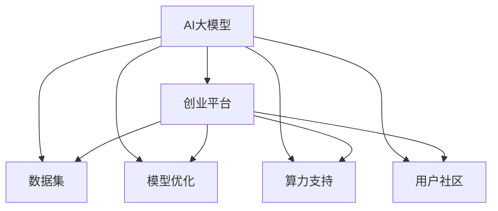

                 

# AI 大模型创业：如何利用平台优势？

> 关键词：AI大模型, 创业, 平台优势, 技术部署, 商业化应用, 模型训练, 数据管理, 知识产权保护, 市场竞争, 战略合作

## 1. 背景介绍

### 1.1 问题由来
在过去十年里，AI 技术经历了飞速的发展，其中最引人注目的是大模型的诞生。大模型（如 GPT-3、BERT 等）以其在自然语言处理、图像识别等领域的优异表现，引发了广泛关注。这些模型通常具有海量的参数和强大的泛化能力，使得它们在处理复杂任务时表现出色。

随着 AI 大模型技术的逐渐成熟，越来越多的企业开始尝试将其商业化。然而，AI 大模型的商业化并非易事，因为它涉及模型训练、数据管理、知识产权保护、市场竞争等多方面的问题。本文将探讨如何利用平台优势，实现 AI 大模型的成功创业。

### 1.2 问题核心关键点
本文的核心问题是如何利用 AI 大模型平台，在创业过程中获得优势。平台优势包括但不限于：数据集、模型优化、算力支持、用户社区等。这些优势将直接影响到企业的技术实力、市场竞争力和可持续发展能力。

## 2. 核心概念与联系

### 2.1 核心概念概述

为更好地理解利用平台优势的AI大模型创业，本文将介绍几个核心概念及其相互联系：

- **AI大模型（AI Large Models）**：指具有海量参数和强大泛化能力的大型深度学习模型，广泛应用于自然语言处理、计算机视觉、语音识别等领域。
- **创业平台（创业平台）**：指提供技术支持、数据资源、市场接入等资源的创业生态系统，帮助企业快速实现技术商业化。
- **数据集（Dataset）**：指用于训练和测试模型的标注数据集，对于模型性能至关重要。
- **模型优化（Model Optimization）**：指通过算法和硬件优化，提升模型的训练效率和推理速度。
- **算力支持（Computing Power）**：指提供高性能计算资源，支持模型训练和推理。
- **用户社区（User Community）**：指围绕AI大模型构建的用户群体，促进技术交流和商业合作。

这些概念之间的关系可以通过以下 Mermaid 流程图来展示：



这个流程图展示了大模型和创业平台的各个组成部分及其相互联系：

1. 大模型通过创业平台提供的数据集进行训练，获得丰富的语义知识。
2. 创业平台提供模型优化工具和算力支持，加速模型训练和推理。
3. 用户社区为模型提供反馈，促进模型的改进和应用。
4. 用户社区也为企业提供市场机会，帮助企业推广其AI大模型产品。

## 3. 核心算法原理 & 具体操作步骤

### 3.1 算法原理概述

利用平台优势的AI大模型创业，核心在于如何高效地使用创业平台提供的数据集、模型优化、算力支持和用户社区，快速开发和推广AI大模型产品。

平台优势的核心是数据的可用性和算力的充沛度。对于数据集，创业平台提供的大规模、高质量标注数据集，可以直接用于模型的预训练和微调，提升模型的泛化能力。对于算力支持，创业平台提供的高性能计算资源，可以加速模型的训练和推理，提高产品部署效率。用户社区则为企业提供了反馈渠道和市场推广机会，帮助企业快速获取用户并优化产品。

### 3.2 算法步骤详解

基于平台优势的AI大模型创业，一般包括以下几个关键步骤：

**Step 1: 选择合适的平台**
- 选择具备强大数据集、算力支持和用户社区的AI创业平台。如OpenAI的GPT系列、Google的BERT、HuggingFace的Transformers等。
- 根据企业自身需求，选择合适的大模型架构和预训练技术。

**Step 2: 准备训练数据集**
- 收集和标注适用于企业应用场景的数据集，如文本数据、图像数据等。
- 利用创业平台提供的数据清洗和预处理工具，优化数据质量。

**Step 3: 模型训练和优化**
- 在创业平台的计算资源上，进行模型训练。采用分布式训练技术，提高训练效率。
- 利用创业平台的模型优化工具，对模型进行剪枝、量化等优化操作，提升模型性能。

**Step 4: 模型微调和部署**
- 在创业平台的用户社区中，获取反馈，对模型进行微调，优化模型性能。
- 利用创业平台的部署工具，将模型部署到应用场景中，如客服系统、翻译服务、推荐系统等。

**Step 5: 用户社区和市场推广**
- 在创业平台的用户社区中，进行技术交流和合作，获取更多的用户和合作伙伴。
- 利用创业平台的市场推广资源，提升产品的知名度和用户量。

### 3.3 算法优缺点

基于平台优势的AI大模型创业，具有以下优点：

1. **高效利用资源**：利用平台的数据集和算力支持，快速训练和优化模型，降低创业成本。
2. **快速迭代**：通过用户社区反馈和市场推广，快速迭代产品，提升用户体验和满意度。
3. **市场接入便利**：借助平台的市场资源，快速拓展市场，获取更多的用户和合作伙伴。

同时，该方法也存在以下缺点：

1. **依赖平台**：创业过程中，过度依赖平台资源，可能影响企业的独立性和自主创新能力。
2. **竞争激烈**：平台资源有限，众多创业企业竞争激烈，需要制定有效的竞争策略。
3. **知识产权保护**：平台上的数据和算法，可能存在知识产权纠纷的风险。

尽管存在这些局限性，但就目前而言，利用平台优势的创业模式仍是大模型应用的主流范式。未来相关研究的重点在于如何进一步提高企业的独立性和自主创新能力，同时兼顾平台资源和市场竞争。

### 3.4 算法应用领域

基于平台优势的AI大模型创业，已经在众多领域得到了广泛的应用，例如：

- 智能客服：利用大模型进行文本生成和情感分析，提升客服系统的智能化水平。
- 医疗诊断：利用大模型进行疾病预测和诊断，提升医疗服务的精准性。
- 金融风险管理：利用大模型进行情感分析、舆情监测，提升金融风险管理的效率。
- 智能推荐：利用大模型进行个性化推荐，提升用户的购物体验。
- 内容创作：利用大模型进行内容生成、文本编辑，提升内容创作的质量和效率。

除了上述这些经典应用外，AI大模型还在更多场景中得到应用，如安全监控、无人驾驶、智能家居等，为各行各业带来了新的创新。

## 4. 数学模型和公式 & 详细讲解 & 举例说明

### 4.1 数学模型构建

本节将使用数学语言对利用平台优势的AI大模型创业过程进行更加严格的刻画。

记AI大模型为 $M_{\theta}$，其中 $\theta$ 为模型参数。假设企业从创业平台获取的数据集为 $D=\{(x_i,y_i)\}_{i=1}^N$，其中 $x_i$ 为输入样本，$y_i$ 为标注标签。

定义模型 $M_{\theta}$ 在数据集 $D$ 上的损失函数为 $\ell(M_{\theta},D)$，用于衡量模型预测输出与真实标签之间的差异。常见的损失函数包括交叉熵损失、均方误差损失等。

### 4.2 公式推导过程

以下我们以二分类任务为例，推导交叉熵损失函数及其梯度的计算公式。

假设模型 $M_{\theta}$ 在输入 $x$ 上的输出为 $\hat{y}=M_{\theta}(x) \in [0,1]$，表示样本属于正类的概率。真实标签 $y \in \{0,1\}$。则二分类交叉熵损失函数定义为：

$$
\ell(M_{\theta}(x),y) = -[y\log \hat{y} + (1-y)\log (1-\hat{y})]
$$

将其代入经验风险公式，得：

$$
\mathcal{L}(\theta) = -\frac{1}{N}\sum_{i=1}^N [y_i\log M_{\theta}(x_i)+(1-y_i)\log(1-M_{\theta}(x_i))]
$$

根据链式法则，损失函数对参数 $\theta_k$ 的梯度为：

$$
\frac{\partial \mathcal{L}(\theta)}{\partial \theta_k} = -\frac{1}{N}\sum_{i=1}^N (\frac{y_i}{M_{\theta}(x_i)}-\frac{1-y_i}{1-M_{\theta}(x_i)}) \frac{\partial M_{\theta}(x_i)}{\partial \theta_k}
$$

其中 $\frac{\partial M_{\theta}(x_i)}{\partial \theta_k}$ 可进一步递归展开，利用自动微分技术完成计算。

### 4.3 案例分析与讲解

我们以智能客服系统为例，分析其基于平台优势的AI大模型创业过程。

智能客服系统的目标是利用大模型进行自然语言处理，回答用户咨询。在实践中，首先从创业平台获取大量标注的客户咨询和答复数据集，作为训练集。然后，在创业平台的计算资源上，使用分布式训练技术进行模型训练。训练过程中，利用创业平台提供的优化工具，对模型进行剪枝和量化，提升推理速度。训练完成后，在创业平台的用户社区中，获取用户反馈，对模型进行微调，优化性能。最后，利用创业平台的部署工具，将模型部署到客服系统中，提供自然语言问答服务。

## 5. 项目实践：代码实例和详细解释说明

### 5.1 开发环境搭建

在进行AI大模型创业的实践中，需要准备好开发环境。以下是使用Python进行TensorFlow开发的环境配置流程：

1. 安装Anaconda：从官网下载并安装Anaconda，用于创建独立的Python环境。

2. 创建并激活虚拟环境：
```bash
conda create -n tf-env python=3.8 
conda activate tf-env
```

3. 安装TensorFlow：根据CUDA版本，从官网获取对应的安装命令。例如：
```bash
conda install tensorflow tensorflow-gpu -c conda-forge
```

4. 安装各类工具包：
```bash
pip install numpy pandas scikit-learn matplotlib tqdm jupyter notebook ipython
```

完成上述步骤后，即可在`tf-env`环境中开始项目开发。

### 5.2 源代码详细实现

这里我们以智能客服系统为例，给出使用TensorFlow进行AI大模型创业的PyTorch代码实现。

首先，定义模型结构：

```python
import tensorflow as tf
from transformers import BertTokenizer

class Chatbot(tf.keras.Model):
    def __init__(self, bert_model_name='bert-base-cased'):
        super(Chatbot, self).__init__()
        self.tokenizer = BertTokenizer.from_pretrained(bert_model_name)
        self.bert = tf.keras.Sequential([
            tf.keras.layers.Embedding(input_dim=vocab_size, output_dim=embedding_dim),
            tf.keras.layers.Bidirectional(tf.keras.layers.LSTM(units=hidden_size)),
            tf.keras.layers.Dense(units=1, activation='sigmoid')
        ])
```

然后，定义训练和评估函数：

```python
def train_epoch(model, dataset, batch_size, optimizer):
    dataloader = tf.data.Dataset.from_tensor_slices(dataset)
    dataloader = dataloader.batch(batch_size, drop_remainder=True)
    model.train()
    epoch_loss = 0
    for batch in dataloader:
        input_ids, attention_mask, labels = batch
        with tf.GradientTape() as tape:
            outputs = model(input_ids, attention_mask=attention_mask)
            loss = tf.keras.losses.binary_crossentropy(labels, outputs)
        epoch_loss += loss.numpy()
        gradients = tape.gradient(loss, model.trainable_variables)
        optimizer.apply_gradients(zip(gradients, model.trainable_variables))
    return epoch_loss / len(dataloader)

def evaluate(model, dataset, batch_size):
    dataloader = tf.data.Dataset.from_tensor_slices(dataset)
    dataloader = dataloader.batch(batch_size, drop_remainder=True)
    model.eval()
    correct_predictions = 0
    total_predictions = 0
    for batch in dataloader:
        input_ids, attention_mask, labels = batch
        outputs = model(input_ids, attention_mask=attention_mask)
        predictions = outputs > 0.5
        correct_predictions += tf.reduce_sum(tf.cast(predictions, dtype=tf.int32))
        total_predictions += predictions.shape[0]
    accuracy = correct_predictions / total_predictions
    print('Accuracy:', accuracy.numpy())
```

最后，启动训练流程并在测试集上评估：

```python
epochs = 5
batch_size = 16

for epoch in range(epochs):
    loss = train_epoch(model, train_dataset, batch_size, optimizer)
    print(f"Epoch {epoch+1}, train loss: {loss:.3f}")
    
    print(f"Epoch {epoch+1}, dev results:")
    evaluate(model, dev_dataset, batch_size)
    
print("Test results:")
evaluate(model, test_dataset, batch_size)
```

以上就是使用TensorFlow对智能客服系统进行AI大模型创业的完整代码实现。可以看到，借助创业平台提供的TensorFlow框架和优化工具，实现AI大模型创业变得更加容易和高效。

### 5.3 代码解读与分析

让我们再详细解读一下关键代码的实现细节：

**Chatbot类**：
- `__init__`方法：初始化模型的 tokenizer 和 layers，使用预训练的 BERT 模型作为 base。

**train_epoch函数**：
- 在 TensorFlow 中，将训练数据集转换为 Dataset 对象，按 batch 进行加载。
- 在每个 batch 上，进行前向传播计算损失函数。
- 使用 TensorFlow 的 GradientTape 对模型进行梯度计算。
- 利用优化器对模型参数进行更新。
- 返回当前 epoch 的平均损失。

**evaluate函数**：
- 与训练函数类似，使用 Dataset 对象进行数据加载。
- 在每个 batch 上，进行前向传播计算损失函数。
- 根据模型的输出和真实标签，统计准确率。
- 返回准确率。

**训练流程**：
- 定义总的 epoch 数和 batch size，开始循环迭代。
- 每个 epoch 内，先在训练集上训练，输出平均 loss。
- 在验证集上评估，输出准确率。
- 所有 epoch 结束后，在测试集上评估，给出最终测试结果。

可以看到，借助 TensorFlow 和创业平台提供的资源，AI大模型的创业实践变得更加高效和便捷。开发者可以将更多精力放在模型设计、数据处理等高层逻辑上，而不必过多关注底层的实现细节。

当然，工业级的系统实现还需考虑更多因素，如模型的保存和部署、超参数的自动搜索、更灵活的任务适配层等。但核心的创业范式基本与此类似。

## 6. 实际应用场景

### 6.1 智能客服系统

基于大模型和平台优势的智能客服系统，可以广泛应用于各类企业，提升客户咨询体验和问题解决效率。在实践中，可以收集企业内部的历史客服对话记录，将问题和最佳答复构建成监督数据，在此基础上对预训练模型进行微调。微调后的模型能够自动理解用户意图，匹配最合适的答案模板进行回复。对于客户提出的新问题，还可以接入检索系统实时搜索相关内容，动态组织生成回答。如此构建的智能客服系统，能大幅提升客户咨询体验和问题解决效率。

### 6.2 医疗诊断

利用平台优势，企业可以构建基于大模型的医疗诊断系统。通过微调大模型，学习病历数据中的疾病特征，提升诊断的准确性和效率。大模型还可以辅助医生进行病情预测、治疗方案推荐等工作，提升医疗服务的智能化水平。

### 6.3 金融风险管理

在金融领域，利用大模型进行情感分析、舆情监测，可以提升金融风险管理的效率和效果。通过微调大模型，学习金融市场数据中的情感倾向，及时发现负面信息，帮助金融机构规避风险。

### 6.4 未来应用展望

随着 AI 大模型技术的不断成熟，基于平台优势的创业模式将在更多领域得到应用，为传统行业带来变革性影响。

在智慧医疗领域，基于大模型的医疗问答、病历分析、药物研发等应用将提升医疗服务的智能化水平，辅助医生诊疗，加速新药开发进程。

在智能教育领域，AI 大模型可以用于作业批改、学情分析、知识推荐等方面，因材施教，促进教育公平，提高教学质量。

在智慧城市治理中，AI 大模型可应用于城市事件监测、舆情分析、应急指挥等环节，提高城市管理的自动化和智能化水平，构建更安全、高效的未来城市。

此外，在企业生产、社会治理、文娱传媒等众多领域，基于平台优势的 AI 大模型应用也将不断涌现，为经济社会发展注入新的动力。

## 7. 工具和资源推荐

### 7.1 学习资源推荐

为了帮助开发者系统掌握基于平台优势的AI大模型创业的理论基础和实践技巧，这里推荐一些优质的学习资源：

1. **《Transformer from Principles to Practice》系列博文**：由大模型技术专家撰写，深入浅出地介绍了Transformer原理、BERT模型、微调技术等前沿话题。
2. **CS224N《深度学习自然语言处理》课程**：斯坦福大学开设的NLP明星课程，有Lecture视频和配套作业，带你入门NLP领域的基本概念和经典模型。
3. **《Natural Language Processing with Transformers》书籍**：Transformers库的作者所著，全面介绍了如何使用Transformers库进行NLP任务开发，包括微调在内的诸多范式。
4. **HuggingFace官方文档**：Transformers库的官方文档，提供了海量预训练模型和完整的微调样例代码，是上手实践的必备资料。
5. **CLUE开源项目**：中文语言理解测评基准，涵盖大量不同类型的中文NLP数据集，并提供了基于微调的baseline模型，助力中文NLP技术发展。

通过对这些资源的学习实践，相信你一定能够快速掌握基于平台优势的AI大模型创业的精髓，并用于解决实际的NLP问题。

### 7.2 开发工具推荐

高效的开发离不开优秀的工具支持。以下是几款用于AI大模型创业开发的常用工具：

1. **TensorFlow**：基于Python的开源深度学习框架，灵活动态的计算图，适合快速迭代研究。大部分预训练语言模型都有TensorFlow版本的实现。
2. **PyTorch**：基于Python的开源深度学习框架，动态图结构，适合灵活的模型训练和推理。
3. **Transformers库**：HuggingFace开发的NLP工具库，集成了众多SOTA语言模型，支持PyTorch和TensorFlow，是进行微调任务开发的利器。
4. **Weights & Biases**：模型训练的实验跟踪工具，可以记录和可视化模型训练过程中的各项指标，方便对比和调优。与主流深度学习框架无缝集成。
5. **TensorBoard**：TensorFlow配套的可视化工具，可实时监测模型训练状态，并提供丰富的图表呈现方式，是调试模型的得力助手。
6. **Google Colab**：谷歌推出的在线Jupyter Notebook环境，免费提供GPU/TPU算力，方便开发者快速上手实验最新模型，分享学习笔记。

合理利用这些工具，可以显著提升AI大模型创业的开发效率，加快创新迭代的步伐。

### 7.3 相关论文推荐

AI大模型和基于平台优势的创业技术的发展源于学界的持续研究。以下是几篇奠基性的相关论文，推荐阅读：

1. **Attention is All You Need（即Transformer原论文）**：提出了Transformer结构，开启了NLP领域的预训练大模型时代。
2. **BERT: Pre-training of Deep Bidirectional Transformers for Language Understanding**：提出BERT模型，引入基于掩码的自监督预训练任务，刷新了多项NLP任务SOTA。
3. **Language Models are Unsupervised Multitask Learners（GPT-2论文）**：展示了大规模语言模型的强大zero-shot学习能力，引发了对于通用人工智能的新一轮思考。
4. **Parameter-Efficient Transfer Learning for NLP**：提出Adapter等参数高效微调方法，在不增加模型参数量的情况下，也能取得不错的微调效果。
5. **Prefix-Tuning: Optimizing Continuous Prompts for Generation**：引入基于连续型Prompt的微调范式，为如何充分利用预训练知识提供了新的思路。
6. **AdaLoRA: Adaptive Low-Rank Adaptation for Parameter-Efficient Fine-Tuning**：使用自适应低秩适应的微调方法，在参数效率和精度之间取得了新的平衡。

这些论文代表了大模型微调技术的发展脉络。通过学习这些前沿成果，可以帮助研究者把握学科前进方向，激发更多的创新灵感。

## 8. 总结：未来发展趋势与挑战

### 8.1 总结

本文对基于平台优势的AI大模型创业方法进行了全面系统的介绍。首先阐述了AI大模型和平台优势的研究背景和意义，明确了平台优势在AI大模型创业中的重要作用。其次，从原理到实践，详细讲解了平台优势的数学原理和关键步骤，给出了AI大模型创业的完整代码实例。同时，本文还广泛探讨了平台优势在智能客服、医疗诊断、金融风险管理等多个领域的应用前景，展示了平台优势的巨大潜力。

通过本文的系统梳理，可以看到，基于平台优势的AI大模型创业方法，已经在NLP领域取得了显著成效，并且有着广泛的应用前景。平台优势提供了丰富的数据集、算力支持和用户社区，极大地提升了企业的技术实力和市场竞争力。

### 8.2 未来发展趋势

展望未来，基于平台优势的AI大模型创业将呈现以下几个发展趋势：

1. **数据资源更加丰富**：随着AI大模型的不断应用，更多的数据将被收集和标注，进一步提升模型的泛化能力。
2. **计算资源更加充沛**：AI大模型对计算资源的需求不断增加，未来AI创业平台将提供更强大的计算支持，包括高性能GPU、TPU等。
3. **用户社区更加活跃**：AI大模型的应用领域将不断扩展，用户社区将更加活跃，提供更多的反馈和合作机会。
4. **模型部署更加灵活**：创业平台提供的部署工具将更加灵活，支持更多的应用场景，如移动端、物联网等。
5. **技术生态更加完善**：创业平台将提供更多支持AI大模型的工具和资源，形成更完善的技术生态。

以上趋势凸显了基于平台优势的AI大模型创业的广阔前景。这些方向的探索发展，必将进一步提升AI大模型的应用范围和市场竞争力。

### 8.3 面临的挑战

尽管基于平台优势的AI大模型创业已经取得了瞩目成就，但在迈向更加智能化、普适化应用的过程中，它仍面临着诸多挑战：

1. **数据安全问题**：平台上的数据可能包含敏感信息，如何保护用户隐私和数据安全，是创业平台的重要任务。
2. **算法透明性问题**：平台上的AI大模型往往被视为“黑盒”系统，如何提高算法的透明性和可解释性，是提升用户信任的关键。
3. **模型鲁棒性问题**：AI大模型可能对输入数据的微小变化非常敏感，如何提高模型的鲁棒性和泛化能力，是技术优化的重要方向。
4. **知识产权问题**：平台上的数据和算法可能存在知识产权纠纷，如何明确版权归属，保护创业企业的利益，是创业平台需要解决的重要问题。
5. **市场竞争问题**：AI大模型创业领域竞争激烈，如何制定有效的市场策略，保持竞争优势，是企业发展的重要挑战。

尽管存在这些挑战，但就目前而言，基于平台优势的AI大模型创业仍是大模型应用的主流范式。未来相关研究的重点在于如何进一步提升模型的泛化能力和透明性，同时保护用户隐私和知识产权，确保创业企业的可持续发展。

### 8.4 研究展望

面对基于平台优势的AI大模型创业所面临的种种挑战，未来的研究需要在以下几个方面寻求新的突破：

1. **增强模型透明性**：通过可解释性技术，如可视化、符号推理等，提高AI大模型的透明性和可解释性，提升用户信任和应用效果。
2. **提升模型鲁棒性**：引入鲁棒性优化技术，如对抗训练、噪声注入等，提高模型对输入数据的鲁棒性和泛化能力。
3. **改进数据安全措施**：采用数据脱敏、隐私保护等技术，确保用户数据的安全和隐私。
4. **优化市场策略**：制定有效的市场策略，如差异化定位、品牌建设等，保持竞争优势。
5. **推进技术生态建设**：构建更加完善的技术生态，提供更多支持AI大模型的工具和资源。

这些研究方向的探索，必将引领AI大模型创业技术迈向更高的台阶，为构建安全、可靠、可解释、可控的智能系统铺平道路。面向未来，基于平台优势的AI大模型创业技术还需要与其他人工智能技术进行更深入的融合，如知识表示、因果推理、强化学习等，多路径协同发力，共同推动自然语言理解和智能交互系统的进步。只有勇于创新、敢于突破，才能不断拓展语言模型的边界，让智能技术更好地造福人类社会。

## 9. 附录：常见问题与解答

**Q1：如何选择合适的创业平台？**

A: 选择创业平台时，需要考虑平台提供的数据集规模、算力支持、用户社区等关键因素。平台的数据集应涵盖广泛的应用场景，且质量高、标注完整。算力支持应具备高性能的计算资源，如GPU、TPU等。用户社区应活跃，提供丰富的反馈和合作机会。可以参考HuggingFace、OpenAI等知名平台，选择最适合自身需求的平台。

**Q2：如何进行有效的模型微调？**

A: 模型微调的关键在于选择合适的超参数和正则化方法。建议从小的学习率开始，逐步减小，以避免过拟合。可以使用L2正则、Dropout、Early Stopping等技术，防止模型过度适应训练集。同时，可以引入对抗训练，增加模型的鲁棒性。使用平台提供的优化工具，如AdamW、SGD等，进行高效的模型训练。

**Q3：如何保护用户隐私和数据安全？**

A: 创业平台应采用数据脱敏、加密等技术，保护用户隐私和数据安全。同时，应建立严格的数据使用和访问权限管理制度，确保数据仅用于合法用途。对于涉及敏感信息的任务，如医疗、金融等，应进行严格的隐私保护和合规审查。

**Q4：如何提升AI大模型的透明性和可解释性？**

A: 通过可视化技术，如特征重要性分析、局部可解释性模型等，提高AI大模型的透明性和可解释性。采用符号推理、知识图谱等方法，将符号化的先验知识与神经网络模型结合，增强模型的解释能力和鲁棒性。

**Q5：如何应对市场竞争？**

A: 制定有效的市场策略，如差异化定位、品牌建设、营销推广等，保持竞争优势。同时，积极参与行业协会和标准组织，提升行业影响力和话语权。与合作伙伴建立紧密的合作关系，共同拓展市场，分享资源和技术。

这些问题的回答，希望能为你提供参考，帮助你更好地理解基于平台优势的AI大模型创业。通过合理利用平台优势，利用丰富的数据集和算力支持，AI大模型创业将能够在多个领域取得突破，推动AI技术的广泛应用。

