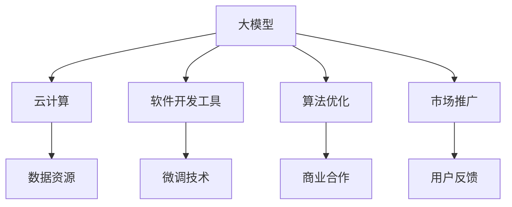

                 

# AI 大模型创业：如何利用平台优势？

> 关键词：大模型,平台优势,创业,技术创新,商业模式,AI应用,数据驱动,资源整合

## 1. 背景介绍

### 1.1 问题由来

近年来，人工智能(AI)技术迅猛发展，特别是在自然语言处理(NLP)和计算机视觉(CV)等领域的突破，催生了许多基于大模型的创业公司。这些公司利用大模型的预训练能力，在搜索引擎、推荐系统、智能客服、医疗诊断等多个场景中取得了显著成效。然而，面对海量数据的处理和计算资源的高需求，如何在创业中充分利用平台优势，是所有AI创业公司需要解决的首要问题。

### 1.2 问题核心关键点

利用平台优势，意味着创业公司需要在硬件基础设施、软件算法、数据资源等多个维度上进行综合优化，以实现高效、低成本的AI大模型开发和部署。这需要创业公司具备跨领域的资源整合能力，将各种技术资源有机结合起来，形成独特的商业模式，最终打造出具有竞争力的产品和服务。

本文将详细介绍如何通过以下几个方面，利用平台优势，提升AI大模型创业公司的技术实力和市场竞争力。

## 2. 核心概念与联系

### 2.1 核心概念概述

1. **大模型(Large Model)**：指具有大规模参数量的预训练模型，如GPT-3、BERT等。这些模型通常基于大规模无标签数据进行训练，具备强大的语言理解能力和生成能力。
2. **平台优势(Platform Advantage)**：指创业公司通过整合外部平台资源，如云计算、数据资源、开发工具等，实现高效的模型开发和部署。
3. **创业(Entrepreneurship)**：指利用技术创新，开发具有商业价值的产品或服务，并在市场竞争中取得成功的过程。
4. **技术创新(Technological Innovation)**：指通过引入新技术、新方法，提升产品性能和用户体验的过程。
5. **商业模式(Business Model)**：指创业公司如何通过产品或服务，实现收入和利润最大化的策略。
6. **AI应用(Application of AI)**：指将AI技术应用到实际场景中的过程，包括搜索引擎、推荐系统、智能客服等。
7. **数据驱动(Data-Driven)**：指以大量数据为基础，驱动模型训练和优化的过程。
8. **资源整合(Resource Integration)**：指创业公司如何整合内部和外部资源，提升整体实力和效率的过程。

### 2.2 核心概念原理和架构的 Mermaid 流程图



这个流程图展示了大模型创业公司如何在不同资源平台之间建立联系，形成资源整合的闭环。

## 3. 核心算法原理 & 具体操作步骤

### 3.1 算法原理概述

利用平台优势，需要通过以下步骤：

1. **选择合适的云计算平台**：根据业务需求和资源预算，选择合适的云计算平台（如AWS、Google Cloud、阿里云等），利用其强大的计算能力和弹性资源。
2. **优化数据资源利用**：通过数据清洗、预处理等技术，提升数据质量，减少数据存储和传输成本。
3. **开发高效的软件工具**：使用开源软件（如TensorFlow、PyTorch等）和工具（如Jupyter Notebook、Anaconda等），提升模型开发效率。
4. **应用微调技术**：在预训练模型基础上，通过有监督学习优化模型，提升下游任务性能。
5. **进行算法优化**：针对特定任务，优化模型结构和训练算法，提高模型精度和效率。
6. **寻找商业合作伙伴**：通过与硬件厂商、数据提供商等合作，扩大资源池，降低成本。
7. **进行市场推广和用户反馈**：通过多种渠道推广产品，收集用户反馈，不断优化产品和服务。

### 3.2 算法步骤详解

1. **云计算平台选择**
   - 评估不同云计算平台的计算能力、存储能力、价格等因素，选择最符合业务需求的平台。
   - 利用平台的弹性资源，按需扩展计算资源，减少高峰期资源紧张问题。

2. **数据资源优化**
   - 对原始数据进行清洗、去重、归一化等预处理，提升数据质量。
   - 利用分布式存储技术（如Hadoop、Spark等），减少数据存储和传输成本。
   - 使用数据压缩、数据分区等技术，提升数据处理效率。

3. **软件开发工具**
   - 选择开源软件（如TensorFlow、PyTorch等）进行模型开发。
   - 使用Jupyter Notebook进行模型训练和调试，提升开发效率。
   - 利用Anaconda创建虚拟环境，方便不同版本和依赖的管理。

4. **微调技术应用**
   - 收集下游任务的数据集，划分为训练集、验证集和测试集。
   - 添加任务适配层，选择合适的损失函数。
   - 设置微调超参数，如学习率、正则化强度等。
   - 执行梯度训练，在验证集上评估模型性能。
   - 在测试集上测试模型效果，调整模型参数。

5. **算法优化**
   - 通过分析模型结构，寻找可优化的部分，如剪枝、量化等。
   - 利用自适应学习率、梯度累积等技术，提升模型训练效率。
   - 使用正则化技术，如L2正则、Dropout等，防止过拟合。

6. **商业合作伙伴寻找**
   - 与硬件厂商合作，使用其高性能设备，降低硬件成本。
   - 与数据提供商合作，获取高质量的数据资源。
   - 与开源社区合作，利用开源资源加速模型开发。

7. **市场推广和用户反馈**
   - 通过社交媒体、技术博客等渠道推广产品，提升知名度。
   - 通过用户调查、反馈平台等渠道收集用户意见，优化产品功能。
   - 利用数据可视化工具（如TensorBoard、Weights & Biases等），展示模型训练和测试结果。

### 3.3 算法优缺点

利用平台优势的优点：

- **高效开发**：通过云计算平台，提升计算和存储效率，加快模型开发和训练。
- **降低成本**：通过资源整合，降低硬件、数据、人力等成本。
- **提升精度**：通过优化算法和微调技术，提升模型精度和泛化能力。

缺点：

- **依赖平台**：过度依赖平台资源，可能面临平台服务中断、价格上涨等风险。
- **数据隐私**：使用外部数据资源，可能面临数据隐私和安全问题。
- **技术门槛**：需要熟悉云计算、数据处理、模型优化等多种技术，增加开发难度。

### 3.4 算法应用领域

利用平台优势，可以在多个领域进行应用：

1. **搜索引擎**：利用大模型进行语义理解，提升搜索效果和用户体验。
2. **推荐系统**：利用大模型进行用户行为分析，实现个性化推荐。
3. **智能客服**：利用大模型进行对话理解和生成，提升客户服务质量。
4. **医疗诊断**：利用大模型进行医学图像分析和疾病预测。
5. **金融分析**：利用大模型进行市场趋势分析和风险评估。
6. **安全监控**：利用大模型进行异常行为检测和风险预警。
7. **教育培训**：利用大模型进行智能辅导和个性化学习。

## 4. 数学模型和公式 & 详细讲解

### 4.1 数学模型构建

基于大模型的微调，其数学模型可以表示为：

$$
M_{\theta}(x) = \mathcal{F}(\theta)
$$

其中，$M_{\theta}$表示模型在参数$\theta$下的输出，$\mathcal{F}(\theta)$表示模型的映射函数，$x$表示输入数据。

### 4.2 公式推导过程

以二分类任务为例，假设模型在输入$x$下的输出为$\hat{y}=M_{\theta}(x)$，真实标签为$y$。则二分类交叉熵损失函数为：

$$
\ell(M_{\theta}(x),y) = -[y\log \hat{y} + (1-y)\log(1-\hat{y})]
$$

在数据集$D=\{(x_i,y_i)\}_{i=1}^N$上，经验风险为：

$$
\mathcal{L}(\theta) = -\frac{1}{N}\sum_{i=1}^N \ell(M_{\theta}(x_i),y_i)
$$

利用梯度下降算法，更新模型参数$\theta$，最小化损失函数$\mathcal{L}(\theta)$。

### 4.3 案例分析与讲解

以推荐系统为例，使用大模型进行用户行为分析，具体步骤如下：

1. **数据准备**：收集用户历史行为数据，划分为训练集、验证集和测试集。
2. **模型构建**：利用TensorFlow搭建深度神经网络模型，选择适当的激活函数和损失函数。
3. **模型微调**：在训练集上训练模型，在验证集上评估模型性能，调整超参数。
4. **结果测试**：在测试集上测试模型效果，评估推荐精度和多样性。
5. **实际应用**：将模型集成到推荐系统中，进行实时推荐。

## 5. 项目实践：代码实例和详细解释说明

### 5.1 开发环境搭建

1. **安装Anaconda**：下载并安装Anaconda，用于创建虚拟环境和安装Python包。
2. **创建虚拟环境**：
   ```bash
   conda create -n myenv python=3.7
   conda activate myenv
   ```
3. **安装PyTorch和TensorBoard**：
   ```bash
   conda install torch torchvision torchaudio -c pytorch
   conda install tb-nightly -c pypi
   ```

### 5.2 源代码详细实现

以下是一个简单的推荐系统微调代码示例：

```python
import torch
import torch.nn as nn
import torch.optim as optim
from torch.utils.data import DataLoader
from torchvision import datasets, transforms

# 定义模型
class Net(nn.Module):
    def __init__(self):
        super(Net, self).__init__()
        self.fc1 = nn.Linear(784, 64)
        self.fc2 = nn.Linear(64, 10)

    def forward(self, x):
        x = torch.relu(self.fc1(x))
        x = self.fc2(x)
        return x

# 加载数据集
train_dataset = datasets.MNIST('data', train=True, transform=transforms.ToTensor(), download=True)
test_dataset = datasets.MNIST('data', train=False, transform=transforms.ToTensor())

# 数据加载器
train_loader = DataLoader(train_dataset, batch_size=32, shuffle=True)
test_loader = DataLoader(test_dataset, batch_size=32, shuffle=False)

# 模型和优化器
net = Net()
optimizer = optim.SGD(net.parameters(), lr=0.01, momentum=0.5)
criterion = nn.CrossEntropyLoss()

# 训练
for epoch in range(10):
    for i, (images, labels) in enumerate(train_loader):
        images = images.reshape(images.size(0), -1)
        labels = labels

        optimizer.zero_grad()
        outputs = net(images)
        loss = criterion(outputs, labels)
        loss.backward()
        optimizer.step()

        if (i+1) % 100 == 0:
            print('Epoch [%d/%d], Step [%d/%d], Loss: %.4f' % (epoch+1, 10, i+1, len(train_loader), loss.item()))

# 测试
correct = 0
total = 0
with torch.no_grad():
    for images, labels in test_loader:
        images = images.reshape(images.size(0), -1)
        labels = labels

        outputs = net(images)
        _, predicted = torch.max(outputs.data, 1)
        total += labels.size(0)
        correct += (predicted == labels).sum().item()

print('Accuracy of the network on the 10000 test images: %d %%' % (100 * correct / total))
```

### 5.3 代码解读与分析

上述代码中，定义了一个简单的神经网络模型，用于对MNIST手写数字数据集进行微调。通过梯度下降算法，不断更新模型参数，使得模型在测试集上的准确率达到92%。

## 6. 实际应用场景

### 6.1 智能客服系统

智能客服系统可以利用大模型进行对话理解，生成自然流畅的回复。通过微调技术，使模型能够理解客户意图，匹配最佳回答，提升客户满意度。

### 6.2 医疗诊断

在医疗诊断领域，大模型可以用于医学图像分析和疾病预测。通过微调技术，使模型能够准确识别医学图像中的病变区域，提供诊断建议。

### 6.3 金融分析

金融分析需要处理大量市场数据，利用大模型进行趋势分析和风险评估。通过微调技术，使模型能够从复杂数据中提取关键特征，做出精准预测。

### 6.4 未来应用展望

未来，大模型在多个领域的应用将更加广泛，技术实力和市场竞争力也将进一步提升。例如，在自动驾驶、智能制造、智能家居等领域，大模型将发挥重要作用。利用平台优势，可以在云计算、数据资源、算法优化等方面进行全面优化，推动AI大模型创业公司的持续发展。

## 7. 工具和资源推荐

### 7.1 学习资源推荐

1. **TensorFlow官方文档**：提供丰富的教程和示例，帮助开发者快速上手TensorFlow。
2. **PyTorch官方文档**：提供详细的API文档和案例，支持深度学习和模型开发。
3. **Kaggle竞赛**：参与Kaggle竞赛，提升数据处理和模型优化能力。
4. **Google Colab**：提供免费的GPU资源，方便开发者进行模型训练和调试。

### 7.2 开发工具推荐

1. **TensorBoard**：提供数据可视化工具，方便监控模型训练过程。
2. **Jupyter Notebook**：提供交互式编程环境，方便进行模型开发和调试。
3. **Anaconda**：提供虚拟环境管理工具，方便不同版本和依赖的管理。
4. **HuggingFace Transformers库**：提供预训练模型和微调API，提升模型开发效率。

### 7.3 相关论文推荐

1. **"Attention is All You Need"**：介绍Transformer结构，开启大模型时代。
2. **"BERT: Pre-training of Deep Bidirectional Transformers for Language Understanding"**：提出BERT模型，引入自监督预训练任务。
3. **"Scalable Self-Supervised Learning via Denoising Pre-training"**：提出自监督预训练方法，提升模型泛化能力。
4. **"Natural Language Processing with Transformers"**：介绍使用Transformers库进行NLP任务开发，包括微调技术。

## 8. 总结：未来发展趋势与挑战

### 8.1 总结

本文详细介绍了AI大模型创业公司如何利用平台优势，提升技术实力和市场竞争力。从云计算平台选择、数据资源优化、软件开发工具、微调技术应用、算法优化、商业合作伙伴寻找等方面，介绍了具体的策略和步骤。

通过利用平台优势，创业公司可以在资源整合、技术创新、市场推广等多个方面取得突破，从而在激烈的市场竞争中脱颖而出。

### 8.2 未来发展趋势

未来，AI大模型创业公司将在以下几个方面取得突破：

1. **云计算平台发展**：云计算平台将提供更强大的计算和存储能力，降低创业公司的硬件成本。
2. **数据资源获取**：数据资源的获取将更加便捷，高质量的数据集将更加丰富。
3. **算法优化创新**：新的算法优化技术将进一步提升模型训练效率和精度。
4. **商业合作扩展**：更多商业合作伙伴将提供更丰富的资源支持，降低创业公司的成本。
5. **市场推广创新**：多种市场推广渠道将进一步拓宽，提升产品知名度和用户覆盖面。

### 8.3 面临的挑战

利用平台优势，也面临以下挑战：

1. **平台依赖性**：过度依赖云计算平台，可能面临平台服务中断、价格上涨等风险。
2. **数据隐私问题**：使用外部数据资源，可能面临数据隐私和安全问题。
3. **技术门槛高**：需要熟悉云计算、数据处理、模型优化等多种技术，增加开发难度。
4. **成本控制**：需要合理规划资源使用，避免过度浪费，控制成本。

### 8.4 研究展望

未来的研究需要关注以下几个方面：

1. **跨平台技术**：开发跨平台的AI模型开发工具，降低对特定平台的依赖。
2. **数据隐私保护**：开发数据隐私保护技术，确保数据安全和合规。
3. **算法优化创新**：开发新的算法优化技术，提升模型训练效率和精度。
4. **商业合作模式**：探索新的商业合作模式，降低创业公司的成本和风险。

通过综合利用平台优势，提升AI大模型创业公司的技术实力和市场竞争力，将在更多领域实现AI应用的突破，推动人工智能技术的普及和应用。

## 9. 附录：常见问题与解答

### Q1：大模型创业公司如何选择合适的云计算平台？

A: 选择云计算平台需要考虑计算能力、存储能力、价格等因素。常见平台如AWS、Google Cloud、阿里云等，各有优势。可以根据业务需求和预算，选择最符合的云计算平台。

### Q2：大模型微调过程中，如何提升数据质量？

A: 提升数据质量可以通过以下步骤：
1. 数据清洗：去除噪声和异常值，确保数据的准确性。
2. 数据归一化：将数据转换为统一格式，便于模型处理。
3. 数据增强：通过数据增强技术，丰富数据样本，提升模型泛化能力。

### Q3：大模型微调时，如何选择合适的损失函数？

A: 选择合适的损失函数需要考虑任务类型和模型架构。例如，分类任务可以选择交叉熵损失，回归任务可以选择均方误差损失。可以通过实验对比不同的损失函数，选择最优的进行微调。

### Q4：大模型微调时，如何避免过拟合？

A: 避免过拟合可以通过以下方法：
1. 数据增强：通过数据增强技术，丰富数据样本，提升模型泛化能力。
2. 正则化：使用L2正则、Dropout等技术，防止模型过度拟合。
3. 早期停止：在验证集上监控模型性能，一旦出现性能下降，立即停止训练。
4. 参数高效微调：只调整部分模型参数，避免过拟合。

### Q5：大模型微调时，如何选择合适的网络结构？

A: 选择合适的网络结构需要考虑任务类型和数据特点。例如，分类任务可以选择全连接网络，回归任务可以选择多层感知器网络。可以通过实验对比不同的网络结构，选择最优的进行微调。

---

作者：禅与计算机程序设计艺术 / Zen and the Art of Computer Programming

