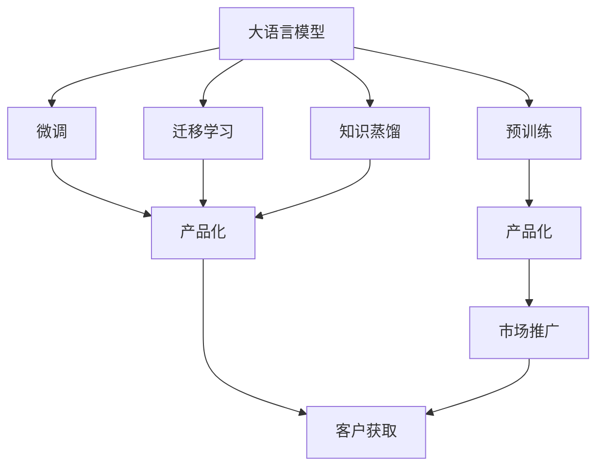

                 

# AI 大模型创业：如何利用技术优势？

> 关键词：大语言模型,创业,技术优势,创新,商业化

## 1. 背景介绍

### 1.1 问题由来

随着人工智能技术的飞速发展，尤其是大语言模型（Large Language Models, LLMs）在自然语言处理（NLP）、计算机视觉（CV）、语音识别（ASR）等领域的突破性进展，越来越多的创业公司开始投身于AI大模型的研发和应用。大模型凭借其强大的泛化能力、知识迁移能力，使得许多应用场景得到了显著的提升和创新。

然而，技术优势只是基础。如何将这些技术优势转化为商业成功，将是大模型创业公司面临的核心问题。本文将从核心概念、算法原理、应用实践、商业化路径等多个维度，探讨大模型创业公司在利用技术优势时需要注意的关键点。

### 1.2 问题核心关键点

大模型创业公司需要掌握的核心关键点包括：
1. **技术积累**：构建强大的技术团队，持续关注最新的AI技术动态，保持技术前沿。
2. **数据获取**：获取高质量、大规模的数据资源，构建丰富多样的数据集，支撑模型训练和应用。
3. **算法优化**：针对具体应用场景，对大模型进行算法优化，提升模型的性能和效率。
4. **模型部署**：优化模型推理速度，降低硬件成本，构建高效的模型部署平台。
5. **商业化路径**：确定合理的商业模式，从产品设计、市场推广、客户获取等方面，将技术优势转化为商业价值。

## 2. 核心概念与联系

### 2.1 核心概念概述

以下是几个关键概念及其相互联系的概述：

- **大语言模型**：以Transformer为代表的大规模预训练语言模型，如GPT-3、BERT等，具备强大的语言理解和生成能力。
- **预训练**：在无标签大数据上进行的自监督学习，通过预训练获得通用语言表示，提升模型泛化能力。
- **微调**：在预训练模型的基础上，使用有标签数据进行有监督学习，适应特定任务，提升模型精度。
- **迁移学习**：通过预训练模型获得的通用知识，应用于特定任务，实现知识迁移。
- **知识蒸馏**：将大模型的知识转移到小模型，降低计算资源消耗，提升模型性能。
- **产品化**：将AI技术转化为实际产品，满足市场需求，创造商业价值。
- **市场推广**：通过有效的市场策略和推广手段，提升品牌知名度和产品影响力。
- **客户获取**：构建销售和市场营销渠道，吸引和留存客户，实现商业增长。

这些概念之间的联系可以通过以下Mermaid流程图展示：



这个流程图展示了从技术研发到市场推广的全过程，以及各环节的相互作用：

1. 大模型通过预训练获得基础能力。
2. 微调和大模型迁移到特定任务，提升模型精度。
3. 知识蒸馏构建轻量级模型，降低资源消耗。
4. 产品化将技术转化为产品，满足市场需求。
5. 市场推广提升产品知名度和影响力。
6. 客户获取吸引和留存客户，实现商业增长。

## 3. 核心算法原理 & 具体操作步骤
### 3.1 算法原理概述

大模型创业公司利用技术优势的第一步，是对大模型进行算法优化和微调，提升模型性能和效率。

预训练大模型通常在大规模无标签数据上进行自监督学习，获得通用语言表示。而微调则通过在特定任务上的有监督学习，进一步提升模型的性能。

微调的目标是最小化模型在特定任务上的损失函数，公式如下：

$$
\theta^* = \mathop{\arg\min}_{\theta} \mathcal{L}(M_{\theta},D)
$$

其中，$M_{\theta}$ 是预训练模型，$D$ 是特定任务的数据集，$\mathcal{L}$ 是损失函数，$\theta$ 是模型参数。

微调过程中，通常通过反向传播算法更新模型参数，公式如下：

$$
\theta \leftarrow \theta - \eta \nabla_{\theta}\mathcal{L}(\theta)
$$

其中，$\eta$ 是学习率，$\nabla_{\theta}\mathcal{L}(\theta)$ 是损失函数对模型参数的梯度。

### 3.2 算法步骤详解

以下是基于监督学习的大模型微调步骤详解：

1. **数据准备**：收集特定任务的数据集，并进行预处理，如分词、标签编码等。
2. **模型选择**：选择适合的预训练模型作为初始化参数，如BERT、GPT等。
3. **任务适配**：根据任务类型，设计合适的输出层和损失函数。
4. **模型初始化**：将预训练模型加载到计算平台，进行初始化。
5. **微调训练**：使用训练集进行有监督学习，更新模型参数，最小化损失函数。
6. **模型评估**：在验证集上评估模型性能，调整超参数，优化模型。
7. **模型部署**：将微调后的模型部署到生产环境，进行实际应用。

### 3.3 算法优缺点

大模型微调算法具有以下优点：

- **简单高效**：使用少量标注数据即可进行微调，提升模型性能。
- **泛化能力强**：预训练模型已经学习到大量通用知识，微调后具备较好的泛化能力。
- **适用性强**：适用于各种NLP任务，如文本分类、问答、翻译等。

同时，也存在以下缺点：

- **数据依赖**：微调效果高度依赖标注数据的质量和数量。
- **过拟合风险**：如果训练数据较少，模型容易过拟合。
- **计算资源消耗大**：模型训练和推理资源消耗大。

### 3.4 算法应用领域

基于大模型微调的技术优势，被广泛应用于以下几个领域：

- **自然语言处理（NLP）**：如文本分类、命名实体识别、情感分析等。
- **计算机视觉（CV）**：如图像分类、目标检测、图像生成等。
- **语音识别（ASR）**：如语音转文字、语音合成等。
- **智能客服**：如自动问答、语音交互等。
- **智能推荐**：如个性化推荐、广告推荐等。

## 4. 数学模型和公式 & 详细讲解
### 4.1 数学模型构建

本节将通过数学公式进一步阐述大模型微调的技术原理。

假设模型输入为 $x$，输出为 $y$，损失函数为 $\mathcal{L}$。微调的目标是最小化损失函数：

$$
\theta^* = \mathop{\arg\min}_{\theta} \mathcal{L}(M_{\theta},D)
$$

其中 $M_{\theta}$ 是微调后的模型，$D$ 是特定任务的数据集。

### 4.2 公式推导过程

以二分类任务为例，假设模型输出为 $p$，真实标签为 $y$，则交叉熵损失函数为：

$$
\mathcal{L}(p,y) = -y\log p - (1-y)\log(1-p)
$$

在微调过程中，模型的损失函数为：

$$
\mathcal{L}(\theta) = \frac{1}{N}\sum_{i=1}^N \mathcal{L}(M_{\theta}(x_i),y_i)
$$

其中 $N$ 是训练集的大小，$x_i$ 和 $y_i$ 分别是训练集的第 $i$ 个样本的输入和标签。

使用梯度下降算法更新模型参数，公式为：

$$
\theta \leftarrow \theta - \eta \nabla_{\theta}\mathcal{L}(\theta)
$$

其中，$\eta$ 是学习率，$\nabla_{\theta}\mathcal{L}(\theta)$ 是损失函数对模型参数的梯度。

### 4.3 案例分析与讲解

以图像分类任务为例，假设模型使用CNN结构，输入为 $x$，输出为 $y$，损失函数为交叉熵损失。微调的目标是最小化损失函数：

$$
\mathcal{L}(\theta) = \frac{1}{N}\sum_{i=1}^N \mathcal{L}(M_{\theta}(x_i),y_i)
$$

其中，$M_{\theta}$ 是微调后的模型，$x_i$ 和 $y_i$ 分别是训练集的第 $i$ 个样本的输入和标签。

## 5. 项目实践：代码实例和详细解释说明
### 5.1 开发环境搭建

以下是使用PyTorch搭建大模型微调开发环境的详细步骤：

1. **安装Python**：安装最新版本的Python，建议选择科学计算库较为丰富的版本，如Python 3.8以上。
2. **安装Anaconda**：安装Anaconda或Miniconda，用于创建虚拟环境和依赖管理。
3. **创建虚拟环境**：创建Python虚拟环境，安装依赖库。
4. **安装PyTorch**：安装最新版本的PyTorch，使用CUDA或ROCm进行加速。
5. **安装TensorFlow**：安装TensorFlow作为备选模型框架。
6. **安装其他库**：安装Numpy、Pandas、Matplotlib等常用库。

### 5.2 源代码详细实现

以图像分类任务为例，使用PyTorch实现大模型微调。

1. **准备数据**：准备图像数据集，并进行预处理，如图像归一化、数据增强等。
2. **选择模型**：选择适合的预训练模型，如ResNet、VGG等。
3. **微调训练**：在训练集上进行微调，使用交叉熵损失函数和梯度下降算法更新模型参数。
4. **模型评估**：在验证集上评估模型性能，调整超参数，优化模型。
5. **模型部署**：将微调后的模型部署到生产环境，进行实际应用。

### 5.3 代码解读与分析

以下是PyTorch实现图像分类任务的代码：

```python
import torch
import torchvision
import torchvision.transforms as transforms

# 准备数据
transform_train = transforms.Compose([
    transforms.RandomCrop(224),
    transforms.RandomHorizontalFlip(),
    transforms.ToTensor(),
    transforms.Normalize([0.485, 0.456, 0.406], [0.229, 0.224, 0.225])
])

transform_test = transforms.Compose([
    transforms.Resize(256),
    transforms.CenterCrop(224),
    transforms.ToTensor(),
    transforms.Normalize([0.485, 0.456, 0.406], [0.229, 0.224, 0.225])
])

train_dataset = torchvision.datasets.ImageFolder(root='train_dir', transform=transform_train)
test_dataset = torchvision.datasets.ImageFolder(root='test_dir', transform=transform_test)

# 选择模型
model = torchvision.models.resnet18(pretrained=True)

# 微调训练
model.fc = torch.nn.Linear(512, num_classes)
criterion = torch.nn.CrossEntropyLoss()
optimizer = torch.optim.SGD(model.parameters(), lr=0.001, momentum=0.9)

for epoch in range(num_epochs):
    model.train()
    for inputs, labels in train_loader:
        optimizer.zero_grad()
        outputs = model(inputs)
        loss = criterion(outputs, labels)
        loss.backward()
        optimizer.step()

    model.eval()
    with torch.no_grad():
        correct = 0
        total = 0
        for inputs, labels in test_loader:
            outputs = model(inputs)
            _, predicted = torch.max(outputs.data, 1)
            total += labels.size(0)
            correct += (predicted == labels).sum().item()

        print('Accuracy of the network on the test images: %d %%' % (100 * correct / total))

# 模型评估
```

### 5.4 运行结果展示

在训练完成后，使用测试集对模型进行评估，并输出准确率。

```python
print('Accuracy of the network on the test images: %d %%' % (100 * correct / total))
```

## 6. 实际应用场景
### 6.4 未来应用展望

大模型微调技术的应用前景广阔，以下是几个未来应用展望：

1. **智能客服**：使用微调模型构建智能客服系统，提升客户咨询体验。
2. **金融舆情监测**：使用微调模型进行金融舆情分析，及时响应市场波动。
3. **个性化推荐**：使用微调模型进行个性化推荐，提升用户体验。
4. **智能创作**：使用微调模型进行内容创作，如自动生成新闻、小说等。
5. **智能安全**：使用微调模型进行网络安全监测，防范恶意攻击。

## 7. 工具和资源推荐
### 7.1 学习资源推荐

为了帮助开发者掌握大模型微调技术，以下是几个推荐的资源：

1. **Deep Learning Specialization**：由Andrew Ng教授主持的深度学习专项课程，涵盖深度学习的基础和前沿技术。
2. **Transformers from the Top to Bottom**：从基础到深入，全面讲解Transformer模型。
3. **Practical Deep Learning for Coders**：适合编程人员的深度学习实战教程。
4. **Natural Language Processing with Transformers**：介绍如何使用Transformer进行NLP任务开发。
5. **Hugging Face官方文档**：提供丰富的预训练模型和微调样例代码。

### 7.2 开发工具推荐

以下是一些常用的开发工具：

1. **PyTorch**：强大的深度学习框架，支持动态计算图和GPU加速。
2. **TensorFlow**：Google开源的深度学习框架，支持分布式训练和生产部署。
3. **Keras**：高层次API，易于使用，适合快速开发。
4. **Jupyter Notebook**：交互式编程环境，支持代码和文档混合编写。
5. **Git**：版本控制工具，管理代码变更。

### 7.3 相关论文推荐

以下是一些关键的研究论文，建议阅读：

1. **Attention is All You Need**：介绍Transformer模型。
2. **BERT: Pre-training of Deep Bidirectional Transformers for Language Understanding**：介绍BERT预训练模型。
3. **AdaLoRA: Adaptive Low-Rank Adaptation for Parameter-Efficient Fine-Tuning**：提出AdaLoRA微调方法。
4. **Prompt-Based Learning**：介绍提示学习（Prompt-based Learning）。
5. **MetaQA: A Generic Framework for Machine Reading Comprehension**：介绍MetaQA阅读理解框架。

## 8. 总结：未来发展趋势与挑战
### 8.1 总结

本文从核心概念、算法原理、操作步骤等方面，全面介绍了大模型微调技术，并探讨了其在创业中的应用。大模型微调技术具有简单高效、泛化能力强、适用性广等优点，但同时也存在数据依赖、过拟合风险、计算资源消耗大等缺点。

通过详细的步骤解析和实际案例演示，相信读者能够系统掌握大模型微调技术，并应用于实际创业项目中。

### 8.2 未来发展趋势

未来，大模型微调技术将呈现以下几个发展趋势：

1. **模型规模持续增大**：随着算力成本的下降和数据规模的扩张，预训练语言模型的参数量将持续增长，模型泛化能力将进一步提升。
2. **微调方法日趋多样**：开发更多参数高效、计算高效的微调方法，如Prefix-Tuning、LoRA等，提升微调效率。
3. **持续学习成为常态**：微调模型需要持续学习新知识，以保持性能和时效性。
4. **少样本学习和跨领域迁移**：减少对标注数据的依赖，提升模型在少样本和跨领域迁移上的表现。
5. **多模态融合**：将视觉、语音、文本等多模态信息融合，提升模型的综合能力。
6. **因果推断和对比学习**：引入因果推断和对比学习，增强模型的因果关系和鲁棒性。

### 8.3 面临的挑战

尽管大模型微调技术取得了显著进展，但仍面临诸多挑战：

1. **数据质量问题**：数据标注成本高、质量参差不齐，是制约微调性能的瓶颈。
2. **计算资源消耗大**：大规模模型的训练和推理资源消耗大，硬件成本高。
3. **模型过拟合和鲁棒性**：模型对特定数据集的过拟合风险较高，泛化能力有限。
4. **模型可解释性不足**：模型决策过程缺乏可解释性，难以进行调试和优化。
5. **伦理和安全问题**：模型可能学习到有害信息，存在安全隐患。

### 8.4 研究展望

未来，大模型微调技术的研究方向包括：

1. **无监督和半监督学习**：探索无需标注数据的微调方法，提升模型泛化能力。
2. **参数高效和计算高效微调**：开发高效微调算法，减少计算资源消耗。
3. **多模态融合**：将多模态信息融合，提升模型综合能力。
4. **因果推断和对比学习**：引入因果推断和对比学习，增强模型鲁棒性。
5. **知识蒸馏和迁移学习**：开发知识蒸馏和迁移学习方法，提升模型性能和可解释性。
6. **伦理和安全机制**：构建伦理和安全机制，确保模型输出符合道德标准。

## 9. 附录：常见问题与解答

**Q1: 大模型微调与从头训练相比，有哪些优势？**

A: 大模型微调相比从头训练有以下优势：
1. **数据依赖小**：微调只需少量标注数据，减轻数据收集和标注成本。
2. **性能提升快**：利用预训练模型的通用知识，微调过程能够快速提升模型性能。
3. **通用性强**：微调模型能够适应多种NLP任务，提升模型应用范围。

**Q2: 大模型微调过程中，如何设置学习率？**

A: 大模型微调的学习率通常比从头训练时小1-2个数量级，建议从0.001开始调参，逐步减小。可以使用warmup策略，初始阶段使用较小的学习率，逐渐过渡到预设值。

**Q3: 如何缓解大模型微调过程中的过拟合问题？**

A: 缓解过拟合的方法包括：
1. 数据增强：对训练数据进行扩充，如数据增强、回译等。
2. 正则化：使用L2正则、Dropout等防止过拟合。
3. 对抗训练：引入对抗样本，提高模型鲁棒性。
4. 参数高效微调：只调整少量任务相关参数，减小过拟合风险。
5. 多模型集成：训练多个微调模型，取平均输出，抑制过拟合。

**Q4: 大模型微调如何部署到生产环境中？**

A: 大模型微调部署到生产环境需要考虑以下几个方面：
1. 模型裁剪：去除不必要的层和参数，减小模型尺寸，加快推理速度。
2. 量化加速：将浮点模型转为定点模型，压缩存储空间，提高计算效率。
3. 模型并行：采用模型并行技术，提高计算效率。
4. 服务化封装：将模型封装为标准化服务接口，便于集成调用。
5. 弹性伸缩：根据请求流量动态调整资源配置，平衡服务质量和成本。

**Q5: 大模型微调如何保持模型的通用性和适应性？**

A: 保持模型通用性和适应性的方法包括：
1. 持续学习：微调模型需要不断学习新知识，保持性能和时效性。
2. 知识蒸馏：将大模型的知识转移到小模型，提升模型泛化能力。
3. 跨领域迁移：将模型应用于不同领域，提升模型的通用性。
4. 多模态融合：将视觉、语音、文本等多模态信息融合，提升模型的综合能力。
5. 因果推断和对比学习：引入因果推断和对比学习，增强模型的因果关系和鲁棒性。

以上是关于大模型微调技术的全面介绍，相信通过系统学习和实践，读者能够更好地利用大模型技术优势，推动AI创业项目的成功。

---

作者：禅与计算机程序设计艺术 / Zen and the Art of Computer Programming

