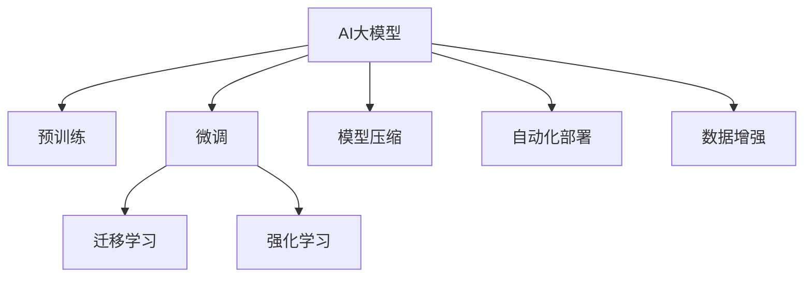

                 

## 1. 背景介绍

### 1.1 问题由来
近年来，AI大模型技术在多个领域取得了突破性进展，尤其在自然语言处理、计算机视觉、语音识别等领域，大模型已经成为行业标准。其卓越的性能、泛化能力和可扩展性，使得大模型成为了AI创业公司的核心竞争力。

然而，大模型的研发和部署成本高昂，对算法、工程、数据等资源需求巨大。对许多初创公司而言，如何有效利用大模型技术，实现商业落地，是一个极具挑战性的问题。

### 1.2 问题核心关键点
大模型创业的核心在于如何将模型技术转化为具体的业务应用，并实现高效、可扩展、低成本的部署。以下为大模型创业的关键要素：

- **技术优势：** 大模型的预训练能力使得公司能够快速开发高精度、泛化能力强的AI应用。
- **商业化策略：** 如何平衡技术研发与商业盈利，确保产品的市场竞争力。
- **部署与运维：** 如何高效部署模型，确保模型服务稳定性、可靠性和可扩展性。
- **数据与标注：** 如何获取高质量的标注数据，高效利用数据资源，降低成本。

### 1.3 问题研究意义
探讨大模型创业的策略和技术，有助于初创公司更有效地利用AI大模型的技术优势，加速业务落地。通过学习本文，可以明确创业公司在技术、商业、部署和数据等多个维度的策略，从而在激烈的市场竞争中取得优势。

## 2. 核心概念与联系

### 2.1 核心概念概述

为更好地理解如何利用AI大模型技术创业，本节将介绍几个关键概念：

- **AI大模型（AI Large Models）：** 以Transformer、BERT、GPT-3等为代表的深度学习模型，在大规模数据上进行预训练，具备强大的表示和推理能力。

- **预训练（Pre-training）：** 在大量无标签数据上对模型进行自监督训练，学习到通用语言模型，然后用于特定任务上的微调。

- **微调（Fine-tuning）：** 在预训练模型的基础上，使用少量有标签数据进行有监督训练，优化模型在特定任务上的性能。

- **迁移学习（Transfer Learning）：** 利用预训练模型在特定任务上的表现，避免从头开始训练。

- **强化学习（Reinforcement Learning）：** 利用奖励信号，训练模型在特定任务上的最优策略。

- **模型压缩（Model Compression）：** 减小模型参数量，降低计算资源消耗，提高模型推理速度。

- **自动化部署（Auto Deployment）：** 通过自动化的方式部署模型，确保服务稳定性和可扩展性。

- **数据增强（Data Augmentation）：** 通过数据扩充和变换，增加模型训练数据的数量和多样性。

这些概念之间的逻辑关系可以通过以下Mermaid流程图来展示：



这个流程图展示了大模型的核心概念及其之间的关系：

1. 大模型通过预训练获得基础能力。
2. 微调可以对预训练模型进行任务特定的优化。
3. 迁移学习是连接预训练模型与下游任务的桥梁。
4. 强化学习可以在特定任务上训练最优策略。
5. 模型压缩减小模型规模，提高推理效率。
6. 自动化部署确保模型服务稳定和可扩展。
7. 数据增强提高训练数据的多样性和质量。

这些概念共同构成了大模型创业的核心框架，使其能够提供高效、可扩展的AI解决方案。

## 3. 核心算法原理 & 具体操作步骤

### 3.1 算法原理概述

利用AI大模型进行创业，关键在于如何将模型技术转化为具体的业务应用，并实现高效、可扩展、低成本的部署。本文从预训练、微调、迁移学习、模型压缩、自动化部署等多个角度，深入探讨大模型的应用策略。

### 3.2 算法步骤详解

**Step 1: 准备预训练模型**

- 选择合适的预训练模型。当前流行的预训练模型包括BERT、GPT、T5等，选择最适合业务需求的模型。
- 下载预训练模型的权重，安装必要的库和工具。

**Step 2: 数据预处理**

- 收集和标注数据集。标注数据需要覆盖业务场景，并具有代表性。
- 数据增强。使用数据增强技术扩充数据集，提高模型的泛化能力。

**Step 3: 模型微调**

- 定义任务适配层。根据业务需求，添加特定的输出层和损失函数。
- 设置微调超参数。选择合适的优化算法、学习率、批大小等。
- 执行微调。使用预训练模型和标注数据进行微调，优化模型在特定任务上的性能。

**Step 4: 迁移学习**

- 在预训练模型基础上，进行迁移学习。利用已有的预训练知识，避免从头开始训练。
- 微调部分参数。在保留预训练权重不变的情况下，微调顶层参数，以提高微调效率。

**Step 5: 模型压缩**

- 模型裁剪。去除不必要的层和参数，减小模型规模。
- 量化加速。将浮点模型转换为定点模型，提高推理速度。

**Step 6: 自动化部署**

- 选择适合的部署平台，如AWS、Google Cloud等。
- 自动化部署。使用CI/CD工具自动化部署模型，确保服务稳定性和可扩展性。

**Step 7: 数据分析与监控**

- 收集模型运行数据。通过监控工具，实时了解模型性能和资源占用情况。
- 数据可视化和告警。使用可视化工具，展示模型运行状态和性能指标，设置异常告警阈值。

### 3.3 算法优缺点

利用AI大模型进行创业的优势在于：

- 高性能：大模型具备强大的表示和推理能力，能够处理复杂任务。
- 泛化能力强：经过大规模数据预训练，模型能够适应多种业务场景。
- 可扩展性强：模型压缩和自动化部署技术，能够支持大规模的业务需求。

然而，大模型创业也存在一些挑战：

- 成本高昂：预训练和微调需要大量计算资源和时间。
- 数据依赖：依赖高质量标注数据，获取和标注成本高。
- 算法复杂：模型训练和部署涉及多种技术，需要专业团队。
- 模型安全：大模型可能引入偏见和有害信息，需要严格监控和管理。

### 3.4 算法应用领域

AI大模型创业广泛应用于多个领域，以下列举几个典型应用：

- **医疗健康：** 利用大模型进行病历分析、诊断辅助、个性化治疗推荐等。
- **金融服务：** 应用大模型进行信用评估、风险管理、智能投顾等。
- **智能制造：** 使用大模型进行设备故障预测、工艺优化、质量检测等。
- **智慧城市：** 在交通管理、环境监测、公共安全等领域，应用大模型进行数据分析和决策支持。
- **娱乐媒体：** 利用大模型进行内容推荐、情感分析、智能创作等。

## 4. 数学模型和公式 & 详细讲解 & 举例说明

### 4.1 数学模型构建

在大模型创业过程中，数学模型构建是非常重要的一环。我们以图像分类为例，描述大模型的构建过程。

假设大模型为ResNet，输入为图像数据$X$，输出为分类标签$Y$。模型结构如图1所示：

```
  X
 /  \
ResNet
 /    \
output Y
```

图1: ResNet模型结构

模型的前向传播过程为：

1. 输入图像$X$通过卷积层和池化层，得到特征表示$F$。
2. 特征表示$F$经过全连接层和softmax层，得到分类概率$P(Y|X)$。
3. 计算交叉熵损失，反向传播更新模型参数。

### 4.2 公式推导过程

**数据预处理**

输入数据$X$需要进行标准化处理：

$$
X_{std} = \frac{X - \mu}{\sigma}
$$

其中$\mu$和$\sigma$为图像的均值和标准差。

**模型前向传播**

卷积层和池化层的输出为：

$$
F = h(X)
$$

其中$h$为卷积和池化操作。

全连接层和softmax层的输出为：

$$
P(Y|X) = softmax(WF + b)
$$

其中$W$和$b$为全连接层的权重和偏置。

**损失函数**

交叉熵损失函数为：

$$
L = -\frac{1}{N} \sum_{i=1}^N \sum_{j=1}^C y_j \log P(y_j|x_i)
$$

其中$N$为样本数，$C$为类别数，$y$为真实标签。

**反向传播**

损失函数对参数的梯度为：

$$
\frac{\partial L}{\partial W}, \frac{\partial L}{\partial b}
$$

通过链式法则，可以得到模型的参数更新公式：

$$
W \leftarrow W - \eta \frac{\partial L}{\partial W}
$$

$$
b \leftarrow b - \eta \frac{\partial L}{\partial b}
$$

其中$\eta$为学习率。

### 4.3 案例分析与讲解

**案例1: 医疗影像分类**

假设有一家医疗影像分类创业公司，使用大模型进行癌症检测。其预训练模型为ResNet，数据集为大量胸片影像，标注数据为癌症和正常两类。

1. 数据预处理：对胸片影像进行标准化处理。
2. 模型微调：定义输出层为两个神经元，分别对应癌症和正常分类。
3. 迁移学习：使用已有的ResNet模型作为基础，添加特定的输出层进行微调。
4. 模型压缩：裁剪模型不必要的层，使用量化加速。
5. 自动化部署：使用AWS的SageMaker平台进行自动化部署。
6. 数据分析与监控：使用TensorBoard进行模型性能监控。

**案例2: 智能客服**

某智能客服公司使用GPT大模型进行对话系统开发。其预训练模型为GPT，数据集为大量客户对话记录。

1. 数据预处理：对对话记录进行标准化处理。
2. 模型微调：定义输出层为分类和生成层，进行对话意图分类和生成回复。
3. 迁移学习：使用已有的GPT模型作为基础，添加特定的输出层进行微调。
4. 模型压缩：使用裁剪和量化技术，优化模型大小和推理速度。
5. 自动化部署：使用Google Cloud进行自动化部署。
6. 数据分析与监控：使用Prometheus进行模型性能监控。

## 5. 项目实践：代码实例和详细解释说明

### 5.1 开发环境搭建

在进行大模型创业实践前，需要准备好开发环境。以下是使用Python进行TensorFlow开发的环境配置流程：

1. 安装Anaconda：从官网下载并安装Anaconda，用于创建独立的Python环境。

2. 创建并激活虚拟环境：
```bash
conda create -n tf-env python=3.8 
conda activate tf-env
```

3. 安装TensorFlow：根据CUDA版本，从官网获取对应的安装命令。例如：
```bash
conda install tensorflow==2.8
```

4. 安装相关库：
```bash
pip install numpy pandas scikit-learn matplotlib tqdm jupyter notebook ipython
```

5. 安装TensorBoard：
```bash
pip install tensorboard
```

完成上述步骤后，即可在`tf-env`环境中开始大模型创业实践。

### 5.2 源代码详细实现

下面以图像分类任务为例，给出使用TensorFlow对ResNet模型进行微调的PyTorch代码实现。

首先，定义图像分类任务的数据处理函数：

```python
import tensorflow as tf
from tensorflow.keras import layers, models

def preprocess_image(x):
    x = tf.image.resize(x, [224, 224])
    x = tf.image.per_image_standardization(x)
    return x

class ImageDataset(tf.keras.preprocessing.image_dataset_from_directory):
    def __init__(self, data_dir, batch_size, img_size=224):
        self.data_dir = data_dir
        self.batch_size = batch_size
        self.img_size = img_size
        
    def __len__(self):
        return self.total_samples // self.batch_size

    def __getitem__(self, idx):
        image_path = os.path.join(self.data_dir, self.filenames[idx])
        img = tf.keras.preprocessing.image.load_img(image_path, target_size=(self.img_size, self.img_size))
        img = tf.keras.preprocessing.image.img_to_array(img)
        img = tf.expand_dims(img, axis=0)
        img = preprocess_image(img)
        label = self.class_indices[self.class_names.index(os.path.basename(image_path))]

        return img, label
```

然后，定义模型和优化器：

```python
base_model = tf.keras.applications.ResNet50(include_top=False, weights='imagenet', input_shape=(224, 224, 3))

# 冻结预训练权重
base_model.trainable = False

# 定义输出层
output_layer = tf.keras.layers.Dense(2, activation='softmax')
model = tf.keras.Model(inputs=base_model.input, outputs=output_layer(base_model.output))

# 定义优化器
optimizer = tf.keras.optimizers.Adam(learning_rate=0.001)

# 编译模型
model.compile(optimizer=optimizer, loss='categorical_crossentropy', metrics=['accuracy'])
```

接着，定义训练和评估函数：

```python
from tensorflow.keras.preprocessing.image import ImageDataGenerator

def train_epoch(model, dataset, batch_size, optimizer):
    dataloader = tf.data.Dataset.from_generator(lambda: dataset, output_signature=(tf.float32, tf.int32))
    dataloader = dataloader.shuffle(buffer_size=1024).batch(batch_size).prefetch(buffer_size=tf.data.experimental.AUTOTUNE)

    model.trainable = True
    for batch, (x, y) in enumerate(dataloader):
        with tf.GradientTape() as tape:
            y_pred = model(x, training=True)
            loss = tf.keras.losses.categorical_crossentropy(y_true=y, y_pred=y_pred)

        gradients = tape.gradient(loss, model.trainable_variables)
        optimizer.apply_gradients(zip(gradients, model.trainable_variables))
```

最后，启动训练流程并在测试集上评估：

```python
epochs = 10
batch_size = 32

train_dataset = ImageDataset(train_dir, batch_size)
test_dataset = ImageDataset(test_dir, batch_size)

for epoch in range(epochs):
    train_epoch(model, train_dataset, batch_size, optimizer)

    test_loss, test_acc = model.evaluate(test_dataset)
    print(f'Epoch {epoch+1}, Test Loss: {test_loss:.4f}, Test Accuracy: {test_acc:.4f}')
```

以上就是使用TensorFlow对ResNet进行图像分类任务微调的完整代码实现。可以看到，TensorFlow提供了丰富的API和组件，使得大模型微调过程变得更加高效便捷。

### 5.3 代码解读与分析

让我们再详细解读一下关键代码的实现细节：

**ImageDataset类**：
- `__init__`方法：初始化数据集路径、批次大小、图像大小等关键参数。
- `__len__`方法：返回数据集的样本数量。
- `__getitem__`方法：对单个样本进行处理，将图像进行预处理和标准化，返回图像和标签。

**preprocess_image函数**：
- 对输入图像进行标准化处理，使其符合模型要求。

**train_epoch函数**：
- 定义数据生成器，对训练集进行批次化加载。
- 在训练过程中，冻结预训练权重，只更新输出层和部分顶部全连接层。
- 通过梯度下降法更新模型参数，并计算损失函数。

**模型训练与评估**：
- 循环迭代训练过程，每个epoch使用训练数据集进行训练。
- 在每个epoch结束时，使用测试集评估模型性能，打印测试结果。

通过上述代码示例，可以清晰地理解如何使用TensorFlow进行大模型的微调和训练。

## 6. 实际应用场景

### 6.1 智能客服系统

利用大模型微调技术，智能客服系统可以实现自然语言理解、意图识别、对话生成等能力，提升客服效率和客户满意度。

在技术实现上，可以收集历史客服对话数据，标注对话意图和回答内容，构建监督数据集。在预训练的GPT大模型基础上进行微调，使其具备自动理解客户意图、生成自然回应、回答常见问题等能力。对于客户提出的新问题，还可以通过检索系统实时搜索相关内容，动态生成回答。

### 6.2 金融舆情监测

在金融领域，利用大模型微调技术，可以实现实时舆情监测、情感分析、风险预警等应用。

具体而言，可以收集金融领域的各种文本数据，如新闻、报道、评论等，标注其情感倾向和主题。在预训练的BERT大模型基础上进行微调，使其具备自动分析文本情感和主题的能力。实时抓取网络上的金融文本，进行情感和主题分析，及时发现市场舆情的变化，为金融机构提供决策支持。

### 6.3 个性化推荐系统

利用大模型微调技术，可以构建高效的个性化推荐系统，提升用户购物体验和满意度。

在技术实现上，可以收集用户的浏览、点击、评价等行为数据，提取物品的文本描述信息。在预训练的BERT大模型基础上进行微调，使其具备自动提取用户兴趣点、匹配物品的能力。在生成推荐列表时，先通过物品描述生成向量，再通过模型预测用户的兴趣匹配度，综合其他特征排序，生成推荐结果。

### 6.4 未来应用展望

未来，大模型微调技术将在更多领域得到应用，为传统行业带来变革性影响。

在智慧医疗领域，利用大模型微调技术，可以实现病历分析、诊断辅助、个性化治疗推荐等，提升医疗服务的智能化水平。

在智能教育领域，利用大模型微调技术，可以实现作业批改、学情分析、知识推荐等，因材施教，促进教育公平，提高教学质量。

在智慧城市治理中，利用大模型微调技术，可以实现城市事件监测、舆情分析、应急指挥等，提高城市管理的自动化和智能化水平。

此外，在企业生产、社会治理、文娱传媒等众多领域，大模型微调技术也将不断涌现，为经济社会发展注入新的动力。

## 7. 工具和资源推荐

### 7.1 学习资源推荐

为了帮助开发者系统掌握大模型微调的理论基础和实践技巧，这里推荐一些优质的学习资源：

1. 《深度学习》书籍：Ian Goodfellow所著，全面介绍了深度学习的基本概念和经典模型。
2. CS231n《卷积神经网络》课程：斯坦福大学开设的计算机视觉课程，涵盖卷积神经网络的基本原理和实践。
3. TensorFlow官方文档：TensorFlow的官方文档，详细介绍了TensorFlow的核心组件和API。
4. Kaggle平台：全球最大的数据科学竞赛平台，提供了丰富的数据集和代码示例，适合学习大模型微调。
5. Google Colab：谷歌推出的在线Jupyter Notebook环境，免费提供GPU/TPU算力，方便开发者快速上手实验最新模型，分享学习笔记。

通过对这些资源的学习实践，相信你一定能够快速掌握大模型微调的精髓，并用于解决实际的NLP问题。

### 7.2 开发工具推荐

高效的开发离不开优秀的工具支持。以下是几款用于大模型微调开发的常用工具：

1. TensorFlow：由Google主导开发的开源深度学习框架，生产部署方便，适合大规模工程应用。
2. PyTorch：基于Python的开源深度学习框架，灵活动态的计算图，适合快速迭代研究。
3. Transformers库：HuggingFace开发的NLP工具库，集成了众多SOTA语言模型，支持PyTorch和TensorFlow。
4. TensorBoard：TensorFlow配套的可视化工具，可实时监测模型训练状态，并提供丰富的图表呈现方式。
5. Weights & Biases：模型训练的实验跟踪工具，可以记录和可视化模型训练过程中的各项指标。

合理利用这些工具，可以显著提升大模型微调任务的开发效率，加快创新迭代的步伐。

### 7.3 相关论文推荐

大模型微调技术的发展源于学界的持续研究。以下是几篇奠基性的相关论文，推荐阅读：

1. Attention is All You Need：提出Transformer结构，开启了NLP领域的预训练大模型时代。
2. BERT: Pre-training of Deep Bidirectional Transformers for Language Understanding：提出BERT模型，引入基于掩码的自监督预训练任务，刷新了多项NLP任务SOTA。
3. Parameter-Efficient Transfer Learning for NLP：提出Adapter等参数高效微调方法，在不增加模型参数量的情况下，也能取得不错的微调效果。
4. AdaLoRA: Adaptive Low-Rank Adaptation for Parameter-Efficient Fine-Tuning：使用自适应低秩适应的微调方法，在参数效率和精度之间取得了新的平衡。
5. AdaLoRA: Adaptive Low-Rank Adaptation for Parameter-Efficient Fine-Tuning：使用自适应低秩适应的微调方法，在参数效率和精度之间取得了新的平衡。

这些论文代表了大模型微调技术的发展脉络。通过学习这些前沿成果，可以帮助研究者把握学科前进方向，激发更多的创新灵感。

## 8. 总结：未来发展趋势与挑战

### 8.1 总结

本文对利用AI大模型进行创业的方法进行了全面系统的介绍。首先阐述了大模型和大模型创业的关键要素和技术优势，明确了如何有效利用大模型技术，实现业务落地。其次，从预训练、微调、迁移学习、模型压缩、自动化部署等多个角度，详细讲解了大模型的应用策略。最后，分析了在大模型创业过程中可能面临的挑战和未来的发展趋势。

通过本文的系统梳理，可以看到，利用大模型进行创业不仅需要深厚的技术储备，还需要对业务场景的深刻理解，以及对模型部署和运维的全面把握。只有将这些技术优势转化为具体的业务应用，才能在大模型创业中取得成功。

### 8.2 未来发展趋势

展望未来，大模型创业将呈现以下几个发展趋势：

1. **模型规模持续增大**：随着算力成本的下降和数据规模的扩张，预训练语言模型的参数量还将持续增长。超大规模语言模型蕴含的丰富语言知识，有望支撑更加复杂多变的下游任务微调。
2. **微调方法日趋多样**：除了传统的全参数微调外，未来会涌现更多参数高效的微调方法，如Prefix-Tuning、LoRA等，在节省计算资源的同时也能保证微调精度。
3. **持续学习成为常态**：随着数据分布的不断变化，微调模型也需要持续学习新知识以保持性能。如何在不遗忘原有知识的同时，高效吸收新样本信息，将成为重要的研究课题。
4. **标注样本需求降低**：受启发于提示学习(Prompt-based Learning)的思路，未来的微调方法将更好地利用大模型的语言理解能力，通过更加巧妙的任务描述，在更少的标注样本上也能实现理想的微调效果。
5. **多模态微调崛起**：当前的微调主要聚焦于纯文本数据，未来会进一步拓展到图像、视频、语音等多模态数据微调。多模态信息的融合，将显著提升语言模型对现实世界的理解和建模能力。
6. **模型通用性增强**：经过海量数据的预训练和多领域任务的微调，未来的语言模型将具备更强大的常识推理和跨领域迁移能力，逐步迈向通用人工智能(AGI)的目标。

以上趋势凸显了大模型微调技术的广阔前景。这些方向的探索发展，必将进一步提升NLP系统的性能和应用范围，为人类认知智能的进化带来深远影响。

### 8.3 面临的挑战

尽管大模型微调技术已经取得了瞩目成就，但在迈向更加智能化、普适化应用的过程中，它仍面临着诸多挑战：

1. **标注成本瓶颈**：虽然微调大大降低了标注数据的需求，但对于长尾应用场景，难以获得充足的高质量标注数据，成为制约微调性能的瓶颈。如何进一步降低微调对标注样本的依赖，将是一大难题。
2. **模型鲁棒性不足**：当前微调模型面对域外数据时，泛化性能往往大打折扣。对于测试样本的微小扰动，微调模型的预测也容易发生波动。如何提高微调模型的鲁棒性，避免灾难性遗忘，还需要更多理论和实践的积累。
3. **推理效率有待提高**：大规模语言模型虽然精度高，但在实际部署时往往面临推理速度慢、内存占用大等效率问题。如何在保证性能的同时，简化模型结构，提升推理速度，优化资源占用，将是重要的优化方向。
4. **可解释性亟需加强**：当前微调模型更像是"黑盒"系统，难以解释其内部工作机制和决策逻辑。对于医疗、金融等高风险应用，算法的可解释性和可审计性尤为重要。如何赋予微调模型更强的可解释性，将是亟待攻克的难题。
5. **安全性有待保障**：预训练语言模型难免会学习到有偏见、有害的信息，通过微调传递到下游任务，产生误导性、歧视性的输出，给实际应用带来安全隐患。如何从数据和算法层面消除模型偏见，避免恶意用途，确保输出的安全性，也将是重要的研究课题。

### 8.4 未来突破

面对大模型微调面临的种种挑战，未来的研究需要在以下几个方面寻求新的突破：

1. **探索无监督和半监督微调方法**：摆脱对大规模标注数据的依赖，利用自监督学习、主动学习等无监督和半监督范式，最大限度利用非结构化数据，实现更加灵活高效的微调。
2. **研究参数高效和计算高效的微调范式**：开发更加参数高效的微调方法，在固定大部分预训练参数的同时，只更新极少量的任务相关参数。同时优化微调模型的计算图，减少前向传播和反向传播的资源消耗，实现更加轻量级、实时性的部署。
3. **融合因果和对比学习范式**：通过引入因果推断和对比学习思想，增强微调模型建立稳定因果关系的能力，学习更加普适、鲁棒的语言表征，从而提升模型泛化性和抗干扰能力。
4. **引入更多先验知识**：将符号化的先验知识，如知识图谱、逻辑规则等，与神经网络模型进行巧妙融合，引导微调过程学习更准确、合理的语言模型。同时加强不同模态数据的整合，实现视觉、语音等多模态信息与文本信息的协同建模。
5. **结合因果分析和博弈论工具**：将因果分析方法引入微调模型，识别出模型决策的关键特征，增强输出解释的因果性和逻辑性。借助博弈论工具刻画人机交互过程，主动探索并规避模型的脆弱点，提高系统稳定性。
6. **纳入伦理道德约束**：在模型训练目标中引入伦理导向的评估指标，过滤和惩罚有偏见、有害的输出倾向。同时加强人工干预和审核，建立模型行为的监管机制，确保输出符合人类价值观和伦理道德。

这些研究方向的探索，必将引领大语言模型微调技术迈向更高的台阶，为构建安全、可靠、可解释、可控的智能系统铺平道路。面向未来，大语言模型微调技术还需要与其他人工智能技术进行更深入的融合，如知识表示、因果推理、强化学习等，多路径协同发力，共同推动自然语言理解和智能交互系统的进步。只有勇于创新、敢于突破，才能不断拓展语言模型的边界，让智能技术更好地造福人类社会。

## 9. 附录：常见问题与解答

**Q1: 大模型创业是否需要强大的技术团队？**

A: 是的，大模型创业需要强大的技术团队支持。预训练模型和微调模型涉及多种技术，包括深度学习、数据工程、模型部署等，需要跨领域的专业人才。

**Q2: 如何平衡技术研发与商业盈利？**

A: 创业公司需要合理分配资源，平衡技术研发与商业盈利。初期重点投入技术研发，积累技术优势。中期利用技术优势，推出有竞争力的产品，获取市场份额。后期不断迭代优化，提升产品体验，实现商业盈利。

**Q3: 数据标注成本如何降低？**

A: 可以通过数据增强、主动学习、弱监督学习等方法，减少对大规模标注数据的依赖。利用无标注数据进行预训练，再通过微调进行任务适配，可以显著降低数据标注成本。

**Q4: 如何确保模型服务稳定性？**

A: 利用容器化和自动化部署工具，确保模型服务稳定性和可扩展性。定期进行模型训练和测试，及时发现和修复模型问题，提升模型服务可靠性。

**Q5: 如何提高模型推理效率？**

A: 利用模型压缩技术，减小模型规模，提高推理速度。使用GPU、TPU等高性能设备，提升模型计算效率。合理设计模型结构和超参数，优化推理过程。

通过上述问题的解答，可以更好地理解如何利用AI大模型进行创业，并在实际应用中取得成功。

---

作者：禅与计算机程序设计艺术 / Zen and the Art of Computer Programming

