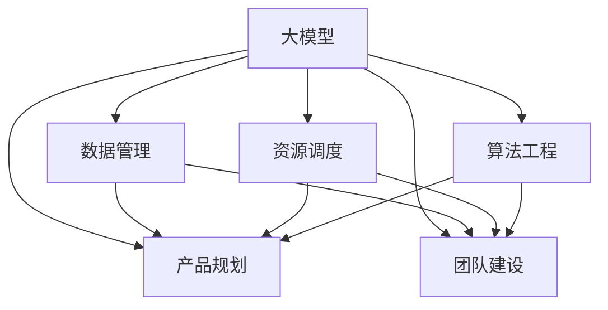

                 

# AI 大模型创业：如何利用管理优势？

> 关键词：大模型,创业,管理优势,数据科学,算法工程,产品规划,资源调度,团队建设

## 1. 背景介绍

### 1.1 问题由来
随着人工智能技术的迅速发展，大模型（Large Models）如GPT、BERT等在自然语言处理（NLP）、计算机视觉（CV）、语音识别（ASR）等领域的广泛应用，已成为推动AI技术进步的重要引擎。然而，大模型的训练和应用需要庞大的计算资源、数据资源和专业知识，这些资源的管理和调度成为创业公司面临的主要挑战。如何通过科学的管理手段，高效利用资源，推动大模型的成功商业化应用，是当前AI创业公司需要解决的核心问题。

### 1.2 问题核心关键点
大模型的管理优势主要体现在以下几个方面：

- **数据管理**：数据是大模型的基石。有效管理数据的质量、规模和分布，是保证模型性能的关键。
- **资源调度**：计算资源（如GPU、TPU）的合理分配和调度，直接影响模型的训练速度和成本。
- **算法工程**：大模型涉及复杂的算法和工程实现，科学的管理能提升开发效率和模型精度。
- **产品规划**：如何从模型到产品，将大模型应用到实际场景中，需要系统的规划和执行。
- **团队建设**：拥有一支高效、专业的团队，是实现大模型商业化的重要保障。

本文将从以上几个关键点出发，探讨如何利用科学的管理手段，提升大模型的应用效率和商业价值。

## 2. 核心概念与联系

### 2.1 核心概念概述

为更好地理解如何利用管理优势推动大模型的应用，本节将介绍几个密切相关的核心概念：

- **大模型（Large Models）**：以Transformer、BERT等架构为基础，通过大规模数据训练得到的通用模型。其特点是参数量大、计算资源需求高，但在特定任务上表现优异。
- **数据管理（Data Management）**：涉及数据的采集、清洗、标注、存储和分发等环节。有效管理数据是保证模型性能的前提。
- **资源调度（Resource Scheduling）**：针对GPU、TPU等计算资源进行合理分配和管理，提升训练和推理效率。
- **算法工程（Algorithm Engineering）**：将前沿算法和工程实践相结合，提升模型开发效率和性能。
- **产品规划（Product Planning）**：从模型开发到产品落地的系统规划和执行，确保模型在实际应用中的效果和用户体验。
- **团队建设（Team Building）**：组建高效、专业的团队，提升项目管理、技术开发和市场推广的能力。

这些核心概念之间的逻辑关系可以通过以下Mermaid流程图来展示：



这个流程图展示了大模型的核心概念及其之间的关系：

1. 大模型通过数据管理获得优质数据，通过资源调度提升训练和推理效率，通过算法工程提升模型性能。
2. 数据管理、资源调度和算法工程支持产品规划，提升模型的应用效果和用户体验。
3. 数据管理、资源调度和算法工程也支持团队建设，提升团队的技术和管理能力。

## 3. 核心算法原理 & 具体操作步骤
### 3.1 算法原理概述

利用管理优势推动大模型的应用，主要涉及以下几个方面：

1. **数据管理**：通过科学的数据管理流程，确保数据的丰富性、多样性和质量。
2. **资源调度**：优化资源配置策略，提升训练和推理的效率和成本效益。
3. **算法工程**：改进模型训练和推理的算法，提升模型性能和开发效率。
4. **产品规划**：系统规划模型的应用场景和用户体验，确保模型成功落地。
5. **团队建设**：建立高效、专业的团队，提升项目管理、技术开发和市场推广的能力。

### 3.2 算法步骤详解

以下是利用管理优势推动大模型应用的详细步骤：

**Step 1: 数据管理**

1. **数据采集**：从公开数据集、众包平台、企业内部数据等多渠道采集数据。
2. **数据清洗**：去除噪声、缺失值、异常值等，确保数据质量。
3. **数据标注**：根据任务需求，进行标签标注，如文本分类、实体识别等。
4. **数据存储**：采用分布式存储系统（如Hadoop、HDFS），确保数据可靠性和可扩展性。
5. **数据分发**：根据模型训练需求，分布式地提供数据，如TensorFlow Data Service（TFDS）。

**Step 2: 资源调度**

1. **资源评估**：评估计算资源（如GPU、TPU）的配置和性能。
2. **调度策略**：采用轮询、优先级、任务队列等调度算法，合理分配资源。
3. **资源监控**：实时监控计算资源的使用情况，及时调整资源分配。
4. **资源回收**：在任务完成后，回收计算资源，避免资源浪费。

**Step 3: 算法工程**

1. **模型优化**：改进模型的训练和推理算法，如梯度裁剪、动量优化、正则化等。
2. **硬件优化**：利用硬件加速技术，如Tensor Cores、混合精度训练等，提升模型性能。
3. **工具链优化**：采用高效的工具链，如TensorFlow、PyTorch等，提升开发效率。

**Step 4: 产品规划**

1. **需求分析**：分析目标用户的需求和场景，明确模型应用需求。
2. **系统设计**：设计系统架构，包括模型部署、接口设计、用户界面等。
3. **测试验证**：在开发过程中进行持续集成和测试，确保模型和系统的稳定性。
4. **上线部署**：将模型部署到生产环境，进行灰度测试和用户反馈收集。

**Step 5: 团队建设**

1. **人才招聘**：根据项目需求，招聘数据科学、算法工程、产品管理等专业人才。
2. **团队培训**：通过内部培训、外部培训等方式，提升团队的技术和管理能力。
3. **激励机制**：建立激励机制，如绩效考核、股权激励等，提升团队士气。
4. **文化建设**：营造积极向上的团队文化，鼓励创新和合作。

### 3.3 算法优缺点

利用管理优势推动大模型应用的方法，具有以下优点：

1. **提升效率**：通过科学的管理手段，优化数据和资源的配置，提升模型训练和推理效率。
2. **降低成本**：优化资源调度，避免资源浪费，降低计算成本。
3. **提升性能**：改进算法和硬件优化，提升模型精度和性能。
4. **加速落地**：系统化的产品规划和团队建设，加速模型的商业化应用。

同时，该方法也存在一定的局限性：

1. **管理复杂性**：科学的管理需要专业知识和技能，对创业公司的管理团队要求较高。
2. **灵活性不足**：固定的管理策略可能难以应对快速变化的市场需求。
3. **资源限制**：缺乏足够的计算资源和数据资源，可能影响模型的训练和应用。

尽管存在这些局限性，但就目前而言，科学的管理手段是提升大模型应用效率和商业价值的重要途径。未来相关研究的重点在于如何进一步优化管理流程，提升管理的灵活性和自动化水平，同时兼顾成本和性能的平衡。

### 3.4 算法应用领域

利用管理优势推动大模型应用的方法，在多个领域得到了广泛的应用，包括但不限于：

- **自然语言处理（NLP）**：如文本分类、情感分析、机器翻译等任务。通过数据管理和算法优化，提升模型的自然语言理解和生成能力。
- **计算机视觉（CV）**：如图像分类、目标检测、图像生成等任务。通过数据增强和硬件加速，提升模型的视觉识别和生成能力。
- **语音识别（ASR）**：如语音转文本、语音情感分析等任务。通过数据标注和硬件优化，提升模型的语音识别和生成能力。
- **智能推荐系统**：如电商推荐、新闻推荐等任务。通过数据管理和算法工程，提升模型的推荐效果和用户体验。
- **医疗健康**：如疾病预测、医学影像分析等任务。通过数据管理、算法优化和产品规划，提升模型的医疗应用价值。

除了上述这些经典任务外，大模型的管理优势还在更多场景中得到应用，如智能客服、金融风控、智慧城市等，为各行各业带来新的技术突破。随着管理手段的不断进步，相信大模型的应用范围将进一步拓展，推动AI技术在更多领域的应用和发展。

## 4. 数学模型和公式 & 详细讲解  
### 4.1 数学模型构建

在利用管理优势推动大模型应用的过程中，需要构建一系列的数学模型，用于描述和优化管理流程。

**数据质量评估模型**：
$$
\text{Quality} = \text{Accuracy} \times \text{Completeness} \times \text{Relevance} \times \text{Timeliness}
$$

**资源优化模型**：
$$
\text{Efficiency} = \frac{\text{Output}}{\text{Input}} \times \text{Utilization}
$$

**算法性能评估模型**：
$$
\text{Performance} = \text{Accuracy} \times \text{Speed} \times \text{Scalability} \times \text{鲁棒性}
$$

**产品用户体验评估模型**：
$$
\text{User Experience} = \text{可用性} \times \text{可访问性} \times \text{安全性} \times \text{可扩展性}
$$

**团队绩效评估模型**：
$$
\text{Performance} = \text{项目成功率} \times \text{技术创新} \times \text{客户满意度} \times \text{成本效益}
$$

### 4.2 公式推导过程

以下我们以资源优化模型为例，推导其计算公式。

假设总资源数为 $R$，单个任务所需的资源为 $C$，每个任务的优先级为 $P$，每个任务的完成时间（或成本）为 $T$。则资源优化模型的目标是最小化总成本或最大化资源利用率。

引入优先级因子 $P_i$，表示任务 $i$ 的优先级。则总成本 $Cost$ 可以表示为：
$$
Cost = \sum_{i=1}^N P_i \times C_i \times T_i
$$

资源利用率 $Utilization$ 可以表示为：
$$
Utilization = \frac{Cost}{R}
$$

为了最大化资源利用率，需要优化任务的资源分配，使得 $T_i$ 最小。可以利用动态规划或贪心算法求解最优解。

### 4.3 案例分析与讲解

以下以一家AI初创公司为例，分析其利用管理优势推动大模型应用的过程。

**背景**：一家AI初创公司，主营业务为智能推荐系统。公司采用Transformer模型进行推荐算法开发，但模型训练和推理资源有限，亟需优化管理手段。

**解决方案**：

1. **数据管理**：
   - **数据采集**：通过API接口和数据爬虫，从电商、社交媒体、用户行为记录等多个渠道采集数据。
   - **数据清洗**：利用开源工具（如Python Pandas）进行数据清洗和预处理，去除噪声和异常值。
   - **数据标注**：通过众包平台进行标注，如Amazon Mechanical Turk，确保标注数据的质量和多样性。
   - **数据存储**：采用分布式存储系统（如Hadoop HDFS），确保数据的可靠性和可扩展性。
   - **数据分发**：利用TensorFlow Data Service（TFDS），按需分配训练数据，提升模型训练效率。

2. **资源调度**：
   - **资源评估**：评估公司现有的计算资源（8张NVIDIA Tesla P100 GPU），评估每个任务所需的计算资源。
   - **调度策略**：采用优先级调度策略，优先处理高优先级的任务，如实时推荐系统的模型训练。
   - **资源监控**：实时监控计算资源的使用情况，及时调整资源分配。
   - **资源回收**：在任务完成后，回收计算资源，避免资源浪费。

3. **算法工程**：
   - **模型优化**：采用梯度裁剪、动量优化等算法，提升模型的训练效果。
   - **硬件优化**：利用Tensor Cores进行混合精度训练，提升模型推理速度。
   - **工具链优化**：采用PyTorch进行高效开发，提升开发效率。

4. **产品规划**：
   - **需求分析**：分析电商用户的推荐需求和场景，明确模型应用需求。
   - **系统设计**：设计推荐系统的架构，包括模型部署、接口设计、用户界面等。
   - **测试验证**：在开发过程中进行持续集成和测试，确保模型的稳定性。
   - **上线部署**：将模型部署到生产环境，进行灰度测试和用户反馈收集。

5. **团队建设**：
   - **人才招聘**：招聘数据科学、算法工程、产品管理等专业人才。
   - **团队培训**：通过内部培训、外部培训等方式，提升团队的技术和管理能力。
   - **激励机制**：建立激励机制，如绩效考核、股权激励等，提升团队士气。
   - **文化建设**：营造积极向上的团队文化，鼓励创新和合作。

通过科学的管理手段，该公司成功推动了智能推荐系统的开发和应用，取得了显著的市场反响。

## 5. 项目实践：代码实例和详细解释说明
### 5.1 开发环境搭建

在进行大模型管理实践前，我们需要准备好开发环境。以下是使用Python进行PyTorch开发的环境配置流程：

1. 安装Anaconda：从官网下载并安装Anaconda，用于创建独立的Python环境。

2. 创建并激活虚拟环境：
```bash
conda create -n pytorch-env python=3.8 
conda activate pytorch-env
```

3. 安装PyTorch：根据CUDA版本，从官网获取对应的安装命令。例如：
```bash
conda install pytorch torchvision torchaudio cudatoolkit=11.1 -c pytorch -c conda-forge
```

4. 安装Transformers库：
```bash
pip install transformers
```

5. 安装各类工具包：
```bash
pip install numpy pandas scikit-learn matplotlib tqdm jupyter notebook ipython
```

完成上述步骤后，即可在`pytorch-env`环境中开始管理实践。

### 5.2 源代码详细实现

这里我们以资源调度优化为例，给出使用Python进行资源调度的代码实现。

首先，定义资源管理类：

```python
class ResourceManager:
    def __init__(self, resources, tasks):
        self.resources = resources
        self.tasks = tasks
        self.resource_pool = {}
    
    def allocate(self, task, resource):
        if resource not in self.resource_pool:
            self.resource_pool[resource] = 0
        self.resource_pool[resource] += 1
        print(f"{resource} allocated to {task}")
    
    def deallocate(self, task, resource):
        if resource in self.resource_pool:
            self.resource_pool[resource] -= 1
            if self.resource_pool[resource] == 0:
                del self.resource_pool[resource]
                print(f"{resource} deallocated from {task}")
        else:
            print(f"{resource} not allocated to {task}")
    
    def get_utilization(self):
        total_cost = sum(self.resource_pool.values())
        total_resources = sum([task.requested_resources for task in self.tasks])
        utilization = total_cost / total_resources
        print(f"Resource Utilization: {utilization:.2f}")
```

然后，定义任务管理类：

```python
class Task:
    def __init__(self, name, requested_resources):
        self.name = name
        self.requested_resources = requested_resources
```

接着，定义测试类：

```python
if __name__ == '__main__':
    resources = [8, 4, 2]  # 假设有8张GPU，4张CPU，2张TPU
    tasks = [Task('Task1', 2), Task('Task2', 1), Task('Task3', 3)]
    
    manager = ResourceManager(resources, tasks)
    manager.allocate('Task1', 'GPU')
    manager.allocate('Task2', 'CPU')
    manager.allocate('Task3', 'TPU')
    manager.get_utilization()
    manager.deallocate('Task1', 'GPU')
    manager.deallocate('Task2', 'CPU')
    manager.get_utilization()
```

### 5.3 代码解读与分析

让我们再详细解读一下关键代码的实现细节：

**ResourceManager类**：
- `__init__`方法：初始化资源池、任务列表和资源池。
- `allocate`方法：分配资源，更新资源池和任务资源。
- `deallocate`方法：释放资源，更新资源池和任务资源。
- `get_utilization`方法：计算资源利用率并输出。

**Task类**：
- `__init__`方法：初始化任务名称和所需资源。

**测试类**：
- 定义了资源池和任务列表，创建资源管理器实例，进行资源分配和释放，最后输出资源利用率。

## 6. 实际应用场景
### 6.1 智能推荐系统

利用科学的管理手段，智能推荐系统可以在有限的计算资源下，快速训练和部署高质量的推荐模型。通过科学的数据管理、资源调度和算法工程，提升模型的推荐效果和用户体验，实现商业价值的最大化。

### 6.2 医疗健康

在医疗健康领域，利用大模型进行疾病预测、医学影像分析等任务，需要大量的数据和管理资源。通过科学的数据管理、资源调度和团队建设，可以有效提升模型的性能和应用效果，助力医疗健康领域的创新发展。

### 6.3 智慧城市

智慧城市治理需要实时监测城市事件、舆情分析、应急指挥等任务。利用科学的管理手段，可以高效利用计算资源和数据资源，提升系统的实时性和可靠性，构建更安全、高效的未来城市。

### 6.4 未来应用展望

随着科学管理手段的不断进步，未来的大模型应用将更加高效、灵活和可靠。例如：

- **数据融合**：将多源数据进行融合，提升模型的泛化能力和鲁棒性。
- **自动化管理**：利用AI进行资源管理，实现更高效的资源分配和调度。
- **自适应管理**：通过动态调整管理策略，适应不同场景下的需求变化。
- **联邦学习**：利用分布式计算资源，提升模型的计算效率和隐私安全性。

## 7. 工具和资源推荐
### 7.1 学习资源推荐

为了帮助开发者系统掌握大模型管理的理论基础和实践技巧，这里推荐一些优质的学习资源：

1. 《大数据管理与分析》书籍：介绍大数据管理的理论基础和实践技巧，适合系统学习。
2. 《算法工程实践》系列博文：深入浅出地介绍算法工程的基础知识和实际应用。
3. 《机器学习实战》书籍：介绍机器学习算法的实现和优化，适合实践学习。
4. Coursera《大数据技术与应用》课程：涵盖大数据管理的多个环节，适合全面学习。
5. Kaggle平台：丰富的数据集和竞赛，提供实战锻炼机会。

通过对这些资源的学习实践，相信你一定能够快速掌握大模型管理的精髓，并用于解决实际的AI应用问题。
###  7.2 开发工具推荐

高效的开发离不开优秀的工具支持。以下是几款用于大模型管理开发的常用工具：

1. Apache Hadoop：大数据分布式处理框架，支持海量数据的存储和管理。
2. TensorFlow Data Service（TFDS）：TensorFlow的分布式数据服务，支持按需分配训练数据。
3. Apache Spark：大数据处理框架，支持实时计算和数据分析。
4. Kubernetes：容器编排工具，支持大规模集群管理和资源调度。
5. Jupyter Notebook：交互式开发环境，支持Python等语言的开发和调试。

合理利用这些工具，可以显著提升大模型管理任务的开发效率，加快创新迭代的步伐。

### 7.3 相关论文推荐

大模型管理和微调技术的发展源于学界的持续研究。以下是几篇奠基性的相关论文，推荐阅读：

1. "Big Data Management: Concepts and Architectures" 书籍：全面介绍大数据管理的概念和架构，适合系统学习。
2. "Algorithm Engineering: Principles, Techniques, and Implementation" 书籍：深入介绍算法工程的原理和实现，适合深入学习。
3. "Machine Learning for Real: Data Management for the Real World" 书籍：介绍机器学习算法的数据管理策略，适合实战学习。
4. "Cloud Computing: Concepts, Technology, and Architecture" 书籍：介绍云计算平台的管理和优化策略，适合云平台开发学习。
5. "Model-based Algorithm Engineering" 论文：介绍基于模型的算法工程方法，适合理论学习。

这些论文代表了大模型管理和微调技术的发展脉络。通过学习这些前沿成果，可以帮助研究者把握学科前进方向，激发更多的创新灵感。

## 8. 总结：未来发展趋势与挑战
### 8.1 总结

本文对利用管理优势推动大模型应用的方法进行了全面系统的介绍。首先阐述了数据管理、资源调度、算法工程、产品规划、团队建设等核心概念，明确了其在大模型应用中的重要性。其次，从原理到实践，详细讲解了科学管理手段的具体应用，给出了系统化的代码实现。同时，本文还广泛探讨了科学管理手段在大模型应用中的实际应用场景，展示了其在智能推荐、医疗健康、智慧城市等多个领域的应用前景。此外，本文精选了科学管理手段的学习资源、开发工具和相关论文，力求为读者提供全方位的技术指引。

通过本文的系统梳理，可以看到，科学管理手段是提升大模型应用效率和商业价值的重要途径。这些手段不仅能有效利用资源，提升模型性能，还能加速模型的商业化应用，推动AI技术的产业化进程。未来，随着科学管理手段的不断进步，大模型的应用范围将进一步拓展，推动AI技术在更多领域的应用和发展。

### 8.2 未来发展趋势

展望未来，科学管理手段将在大模型应用中发挥越来越重要的作用：

1. **自动化管理**：利用AI进行资源管理和调度，实现更高效的资源分配和任务执行。
2. **自适应管理**：通过动态调整管理策略，适应不同场景下的需求变化。
3. **数据融合**：将多源数据进行融合，提升模型的泛化能力和鲁棒性。
4. **联邦学习**：利用分布式计算资源，提升模型的计算效率和隐私安全性。
5. **动态优化**：实时监测和管理系统性能，根据反馈动态调整管理策略。

以上趋势凸显了科学管理手段在大模型应用中的广阔前景。这些方向的探索发展，必将进一步提升大模型的应用效率和商业价值，为AI技术的产业化进程提供更强的技术保障。

### 8.3 面临的挑战

尽管科学管理手段在大模型应用中取得了显著成效，但仍面临诸多挑战：

1. **管理复杂性**：科学管理需要专业知识和技能，对创业公司的管理团队要求较高。
2. **灵活性不足**：固定的管理策略可能难以应对快速变化的市场需求。
3. **资源限制**：缺乏足够的计算资源和数据资源，可能影响模型的训练和应用。
4. **成本高昂**：高质量的资源管理需要大量的时间和资金投入，初创公司可能难以承担。
5. **数据隐私**：大规模数据的管理和处理可能涉及隐私和安全问题，需要严格的监管和保护。

尽管存在这些挑战，但通过不断优化管理流程，提升管理的灵活性和自动化水平，科学管理手段将在未来大模型应用中发挥更大作用。相信随着学界和产业界的共同努力，这些挑战终将一一被克服，科学管理手段必将在大模型应用中大放异彩。

### 8.4 研究展望

未来，科学管理手段在大模型应用中的研究将集中在以下几个方向：

1. **自动化管理**：进一步提升AI在资源管理和调度中的作用，实现更高效的资源利用。
2. **自适应管理**：通过动态调整管理策略，适应不同场景下的需求变化，提升系统灵活性。
3. **数据融合**：探索更高效的数据融合方法，提升模型的泛化能力和鲁棒性。
4. **联邦学习**：利用分布式计算资源，提升模型的计算效率和隐私安全性。
5. **动态优化**：实时监测和管理系统性能，根据反馈动态调整管理策略。

这些研究方向将为科学管理手段在大模型应用中的不断进步提供新的思路和方法，推动大模型在更多领域的应用和发展。

## 9. 附录：常见问题与解答
### Q1：如何选择合适的资源调度策略？

A: 资源调度策略的选择需要考虑多个因素，如任务的紧急程度、资源类型、系统负载等。常见的调度策略包括轮询、优先级、任务队列等。一般建议优先处理高优先级的任务，如实时推荐系统的模型训练。

### Q2：如何优化模型的训练和推理效率？

A: 通过科学的数据管理、资源调度和算法工程，可以有效提升模型的训练和推理效率。具体优化方法包括：
1. 数据增强：通过回译、近义替换等方式扩充训练集。
2. 正则化：使用L2正则、Dropout、Early Stopping等防止模型过拟合。
3. 对抗训练：加入对抗样本，提高模型鲁棒性。
4. 参数高效微调：只更新少量的模型参数，避免不必要的计算资源浪费。

### Q3：如何提升团队的技术和管理能力？

A: 通过内部培训、外部培训、参与开源项目等方式，不断提升团队的技术和管理能力。同时建立激励机制，如绩效考核、股权激励等，提升团队士气，营造积极向上的团队文化。

### Q4：如何确保数据和模型的隐私和安全？

A: 科学管理手段在大模型应用中需要严格保护数据和模型的隐私和安全。具体措施包括：
1. 数据加密：对数据进行加密处理，防止数据泄露。
2. 访问控制：限制数据的访问权限，确保只有授权人员可以访问敏感数据。
3. 安全审计：定期进行安全审计，发现并修复潜在的安全漏洞。
4. 合规性检查：确保数据管理和模型应用符合相关法律法规和行业标准。

通过科学管理手段的不断优化和完善，大模型在实际应用中的隐私和安全问题将得到更好的保障，确保数据和模型的安全可靠。

