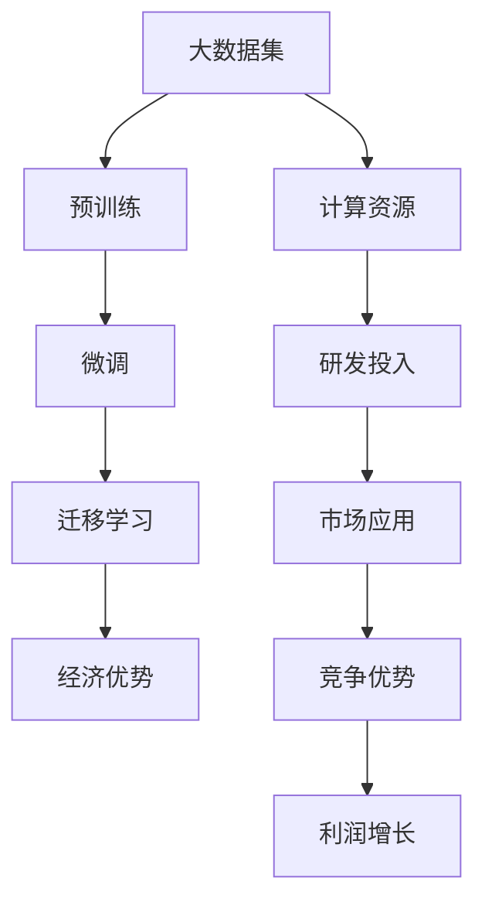

                 

## 1. 背景介绍

在过去几年中，AI大模型迅速崛起，成为推动企业创新和增长的关键引擎。这种技术革命不仅改变了数据处理和分析的方式，还极大地拓展了应用场景，从自动驾驶、机器人到金融分析、医疗诊断，无处不在。对于创业公司而言，如何利用这些AI大模型的经济优势，无疑是一个重要课题。

### 1.1 技术突破的驱动

AI大模型的发展主要受到以下几个方面的驱动：

1. **数据量的爆炸性增长**：随着互联网的普及和数字化的深入，大数据已成为支撑AI技术发展的重要基石。企业通过收集、整理和分析海量数据，为其大模型的训练和优化提供了丰富的土壤。
2. **计算能力的持续提升**：从传统的CPU、GPU到现代的TPU和边缘计算设备，计算能力的大幅提升为AI大模型的训练和运行提供了强大支撑。
3. **算法和架构的创新**：深度学习、卷积神经网络（CNN）、循环神经网络（RNN）等算法的出现，以及Transformer等先进架构的引入，极大地提高了模型的性能和效率。
4. **资本的密集投入**：高昂的研发投入和大规模资金的涌入，为AI大模型的持续发展和应用推广提供了重要保障。

### 1.2 市场需求的增长

AI大模型的应用场景日益丰富，市场需求也在不断增长。根据市场研究，预计到2025年，全球AI大模型的市场规模将达到数百亿美元。这种增长趋势不仅来自于传统行业的数字化转型，也来自于新兴行业如自动驾驶、量子计算等领域的迅猛发展。

## 2. 核心概念与联系

### 2.1 核心概念概述

要深刻理解AI大模型创业的经济优势，首先需要理解几个核心概念：

1. **大模型（Big Models）**：指拥有数十亿甚至数百亿参数的神经网络模型。这些模型通常基于Transformer架构，如GPT、BERT等，具备强大的语言理解和生成能力。
2. **预训练（Pre-training）**：通过在大量无标签数据上自监督学习，大模型能够学习到丰富的语言表示，为后续微调打下基础。
3. **微调（Fine-tuning）**：在大模型的基础上，通过在有标签数据上的有监督学习，优化模型在特定任务上的性能。
4. **迁移学习（Transfer Learning）**：通过在预训练模型的基础上进行微调，利用已有知识快速适应新任务。
5. **经济优势（Economic Advantage）**：指AI大模型在训练成本、应用效率和市场竞争力方面的优势。

这些概念之间具有紧密的联系，共同构成了AI大模型的核心框架。大模型的预训练和微调过程，不仅提升了模型的性能，还带来了显著的经济效益。

### 2.2 核心概念原理和架构的 Mermaid 流程图



这个流程图展示了AI大模型的预训练、微调、迁移学习和经济优势之间的联系。预训练为微调提供了基础，微调提升了模型的任务适应性，迁移学习拓展了模型的应用范围，而经济优势则体现了这些过程带来的实际经济收益。

## 3. 核心算法原理 & 具体操作步骤

### 3.1 算法原理概述

AI大模型的经济优势主要体现在以下几个方面：

1. **训练成本的降低**：通过大规模无标签数据的预训练，大模型可以在较短时间内学习到丰富的知识，减少对标注数据的需求，从而降低训练成本。
2. **应用效率的提升**：由于大模型的泛化能力强，能够在少数数据上实现高效微调，快速适应新任务，提高应用效率。
3. **市场竞争力的增强**：大模型的高性能和低成本，使其在市场竞争中具有显著优势，能够迅速占领市场，形成技术壁垒。
4. **利润的增长**：高效低成本的应用，能够显著降低企业的运营成本，提升盈利能力。

### 3.2 算法步骤详解

AI大模型的经济优势可以通过以下步骤实现：

1. **数据预处理**：收集和整理大量的无标签数据，如大规模网络文本、图片、语音等，作为预训练的数据集。
2. **模型预训练**：利用预训练技术，如自监督学习，在大模型上进行训练，学习通用语言表示。
3. **任务微调**：根据具体任务的需求，收集少量标注数据，对大模型进行微调，优化模型在特定任务上的表现。
4. **迁移学习**：利用预训练模型的知识，在新任务上进行迁移学习，快速适应新场景。
5. **应用部署**：将微调后的模型部署到实际应用场景中，如自动驾驶、智能客服等，实现高效低成本的应用。
6. **持续优化**：根据应用反馈和用户需求，持续优化模型，保持其性能和竞争力。

### 3.3 算法优缺点

AI大模型的经济优势主要体现在以下优点：

1. **高泛化能力**：通过预训练，大模型具备较强的泛化能力，能在少数数据上实现高效微调。
2. **低标注成本**：大模型利用无标签数据进行预训练，减少了对标注数据的依赖，降低了训练成本。
3. **高效应用**：微调后的模型能够快速适应新任务，提升应用效率。
4. **竞争优势**：在市场竞争中，大模型的高性能和低成本使其具有显著优势。

同时，也存在一些缺点：

1. **高计算资源需求**：大模型的训练和运行需要大量的计算资源，如GPU、TPU等。
2. **模型规模大**：大模型的参数量巨大，存储和传输需求高。
3. **数据隐私问题**：在预训练和微调过程中，数据隐私保护是一个重要挑战。

### 3.4 算法应用领域

AI大模型的经济优势广泛适用于多个领域，包括：

1. **自然语言处理（NLP）**：如问答系统、机器翻译、情感分析等。
2. **计算机视觉（CV）**：如图像识别、人脸识别、物体检测等。
3. **自动驾驶**：如自动驾驶车辆、无人驾驶飞机等。
4. **医疗诊断**：如医学影像分析、疾病预测等。
5. **金融分析**：如市场预测、欺诈检测等。
6. **智能制造**：如智能工厂、智慧物流等。

## 4. 数学模型和公式 & 详细讲解 & 举例说明

### 4.1 数学模型构建

AI大模型的经济优势可以通过以下数学模型来描述：

设大模型的预训练损失为 $L_{pre}$，微调的损失为 $L_{fin}$，迁移学习的损失为 $L_{trans}$。则经济优势 $A$ 可以表示为：

$$
A = \frac{L_{pre}}{L_{fin} + L_{trans}}
$$

其中，$L_{pre}$ 为预训练损失，$L_{fin}$ 为微调损失，$L_{trans}$ 为迁移学习损失。$A$ 值越大，表示经济优势越明显。

### 4.2 公式推导过程

设 $X_{pre}$ 为预训练数据集，$Y_{fin}$ 为微调任务数据集，$Y_{trans}$ 为迁移学习任务数据集。则有：

$$
L_{pre} = \frac{1}{N_{pre}} \sum_{i=1}^{N_{pre}} \ell_{pre}(X_{pre}, y_{pre}^{(i)})

L_{fin} = \frac{1}{N_{fin}} \sum_{i=1}^{N_{fin}} \ell_{fin}(X_{fin}, y_{fin}^{(i)})

L_{trans} = \frac{1}{N_{trans}} \sum_{i=1}^{N_{trans}} \ell_{trans}(X_{trans}, y_{trans}^{(i)})
$$

其中，$\ell_{pre}$ 为预训练损失函数，$\ell_{fin}$ 为微调损失函数，$\ell_{trans}$ 为迁移学习损失函数。

### 4.3 案例分析与讲解

以NLP领域的情感分析任务为例，分析其经济优势：

1. **预训练阶段**：利用大规模无标签文本数据进行自监督学习，学习通用语言表示。
2. **微调阶段**：收集少量的标注数据，如电影评论、商品评价等，进行有监督学习，优化模型在情感分析上的性能。
3. **迁移学习阶段**：将微调后的模型应用于其他领域的情感分析任务，如社交媒体评论、产品评论等。

假设预训练损失为 $L_{pre}=1$，微调损失为 $L_{fin}=0.5$，迁移学习损失为 $L_{trans}=0.3$，则经济优势 $A$ 为：

$$
A = \frac{1}{0.5 + 0.3} = 1.43
$$

表明在情感分析任务上，AI大模型的经济优势显著，能够通过较低的训练成本，实现高效的应用。

## 5. 项目实践：代码实例和详细解释说明

### 5.1 开发环境搭建

在进行AI大模型创业时，首先需要搭建合适的开发环境。以下是使用Python进行PyTorch开发的环境配置流程：

1. 安装Anaconda：从官网下载并安装Anaconda，用于创建独立的Python环境。
2. 创建并激活虚拟环境：
```bash
conda create -n pytorch-env python=3.8 
conda activate pytorch-env
```

3. 安装PyTorch：根据CUDA版本，从官网获取对应的安装命令。例如：
```bash
conda install pytorch torchvision torchaudio cudatoolkit=11.1 -c pytorch -c conda-forge
```

4. 安装Transformer库：
```bash
pip install transformers
```

5. 安装各类工具包：
```bash
pip install numpy pandas scikit-learn matplotlib tqdm jupyter notebook ipython
```

完成上述步骤后，即可在`pytorch-env`环境中开始AI大模型的开发实践。

### 5.2 源代码详细实现

下面以情感分析任务为例，给出使用Transformers库对BERT模型进行微调的PyTorch代码实现。

首先，定义情感分析任务的数据处理函数：

```python
from transformers import BertTokenizer
from torch.utils.data import Dataset
import torch

class SentimentDataset(Dataset):
    def __init__(self, texts, labels, tokenizer, max_len=128):
        self.texts = texts
        self.labels = labels
        self.tokenizer = tokenizer
        self.max_len = max_len
        
    def __len__(self):
        return len(self.texts)
    
    def __getitem__(self, item):
        text = self.texts[item]
        label = self.labels[item]
        
        encoding = self.tokenizer(text, return_tensors='pt', max_length=self.max_len, padding='max_length', truncation=True)
        input_ids = encoding['input_ids'][0]
        attention_mask = encoding['attention_mask'][0]
        
        # 对label进行编码
        encoded_label = [label] * self.max_len
        labels = torch.tensor(encoded_label, dtype=torch.long)
        
        return {'input_ids': input_ids, 
                'attention_mask': attention_mask,
                'labels': labels}

# 标签与id的映射
label2id = {'positive': 1, 'negative': 0}
id2label = {v: k for k, v in label2id.items()}

# 创建dataset
tokenizer = BertTokenizer.from_pretrained('bert-base-cased')

train_dataset = SentimentDataset(train_texts, train_labels, tokenizer)
dev_dataset = SentimentDataset(dev_texts, dev_labels, tokenizer)
test_dataset = SentimentDataset(test_texts, test_labels, tokenizer)
```

然后，定义模型和优化器：

```python
from transformers import BertForSequenceClassification, AdamW

model = BertForSequenceClassification.from_pretrained('bert-base-cased', num_labels=len(label2id))

optimizer = AdamW(model.parameters(), lr=2e-5)
```

接着，定义训练和评估函数：

```python
from torch.utils.data import DataLoader
from tqdm import tqdm
from sklearn.metrics import classification_report

device = torch.device('cuda') if torch.cuda.is_available() else torch.device('cpu')
model.to(device)

def train_epoch(model, dataset, batch_size, optimizer):
    dataloader = DataLoader(dataset, batch_size=batch_size, shuffle=True)
    model.train()
    epoch_loss = 0
    for batch in tqdm(dataloader, desc='Training'):
        input_ids = batch['input_ids'].to(device)
        attention_mask = batch['attention_mask'].to(device)
        labels = batch['labels'].to(device)
        model.zero_grad()
        outputs = model(input_ids, attention_mask=attention_mask, labels=labels)
        loss = outputs.loss
        epoch_loss += loss.item()
        loss.backward()
        optimizer.step()
    return epoch_loss / len(dataloader)

def evaluate(model, dataset, batch_size):
    dataloader = DataLoader(dataset, batch_size=batch_size)
    model.eval()
    preds, labels = [], []
    with torch.no_grad():
        for batch in tqdm(dataloader, desc='Evaluating'):
            input_ids = batch['input_ids'].to(device)
            attention_mask = batch['attention_mask'].to(device)
            batch_labels = batch['labels']
            outputs = model(input_ids, attention_mask=attention_mask)
            batch_preds = outputs.logits.argmax(dim=1).to('cpu').tolist()
            batch_labels = batch_labels.to('cpu').tolist()
            for pred, label in zip(batch_preds, batch_labels):
                preds.append(pred)
                labels.append(label)
                
    print(classification_report(labels, preds))
```

最后，启动训练流程并在测试集上评估：

```python
epochs = 5
batch_size = 16

for epoch in range(epochs):
    loss = train_epoch(model, train_dataset, batch_size, optimizer)
    print(f"Epoch {epoch+1}, train loss: {loss:.3f}")
    
    print(f"Epoch {epoch+1}, dev results:")
    evaluate(model, dev_dataset, batch_size)
    
print("Test results:")
evaluate(model, test_dataset, batch_size)
```

以上就是使用PyTorch对BERT进行情感分析任务微调的完整代码实现。可以看到，得益于Transformers库的强大封装，我们可以用相对简洁的代码完成BERT模型的加载和微调。

### 5.3 代码解读与分析

让我们再详细解读一下关键代码的实现细节：

**SentimentDataset类**：
- `__init__`方法：初始化文本、标签、分词器等关键组件。
- `__len__`方法：返回数据集的样本数量。
- `__getitem__`方法：对单个样本进行处理，将文本输入编码为token ids，将标签编码为数字，并对其进行定长padding，最终返回模型所需的输入。

**label2id和id2label字典**：
- 定义了标签与数字id之间的映射关系，用于将标签转换为模型可接受的数字形式。

**训练和评估函数**：
- 使用PyTorch的DataLoader对数据集进行批次化加载，供模型训练和推理使用。
- 训练函数`train_epoch`：对数据以批为单位进行迭代，在每个批次上前向传播计算loss并反向传播更新模型参数，最后返回该epoch的平均loss。
- 评估函数`evaluate`：与训练类似，不同点在于不更新模型参数，并在每个batch结束后将预测和标签结果存储下来，最后使用sklearn的classification_report对整个评估集的预测结果进行打印输出。

**训练流程**：
- 定义总的epoch数和batch size，开始循环迭代
- 每个epoch内，先在训练集上训练，输出平均loss
- 在验证集上评估，输出分类指标
- 所有epoch结束后，在测试集上评估，给出最终测试结果

可以看到，PyTorch配合Transformers库使得BERT微调的代码实现变得简洁高效。开发者可以将更多精力放在数据处理、模型改进等高层逻辑上，而不必过多关注底层的实现细节。

## 6. 实际应用场景

### 6.1 金融舆情监测

金融舆情监测是AI大模型应用的重要领域之一。金融机构需要实时监测市场舆论动向，以便及时应对负面信息传播，规避金融风险。传统的人工监测方式成本高、效率低，难以应对网络时代海量信息爆发的挑战。

基于大语言模型微调的文本分类和情感分析技术，为金融舆情监测提供了新的解决方案。具体而言，可以收集金融领域相关的新闻、报道、评论等文本数据，并对其进行主题标注和情感标注。在此基础上对预训练语言模型进行微调，使其能够自动判断文本属于何种主题，情感倾向是正面、中性还是负面。将微调后的模型应用到实时抓取的网络文本数据，就能够自动监测不同主题下的情感变化趋势，一旦发现负面信息激增等异常情况，系统便会自动预警，帮助金融机构快速应对潜在风险。

### 6.2 智能客服系统

智能客服系统是大语言模型应用的重要场景之一。传统的客服系统依赖于人工，高峰期响应缓慢，且一致性和专业性难以保证。而使用微调后的对话模型，可以7x24小时不间断服务，快速响应客户咨询，用自然流畅的语言解答各类常见问题。

在技术实现上，可以收集企业内部的历史客服对话记录，将问题和最佳答复构建成监督数据，在此基础上对预训练对话模型进行微调。微调后的对话模型能够自动理解用户意图，匹配最合适的答案模板进行回复。对于客户提出的新问题，还可以接入检索系统实时搜索相关内容，动态组织生成回答。如此构建的智能客服系统，能大幅提升客户咨询体验和问题解决效率。

### 6.3 医疗诊断

AI大模型在医疗诊断领域也有广泛的应用。传统的医疗诊断依赖于医生的经验和直觉，效率低下且容易出错。利用大语言模型微调技术，可以将医生的知识、经验等转换为模型参数，实现自动化诊断。

具体而言，可以收集医学影像、病例、报告等数据，标注相应的诊断结果，用于训练大语言模型。微调后的模型能够自动分析医学影像，识别病变区域，辅助医生进行诊断。对于复杂病例，还可以结合医生的反馈，持续优化模型，提高诊断准确率。

## 7. 工具和资源推荐

### 7.1 学习资源推荐

为了帮助开发者系统掌握AI大模型的微调理论基础和实践技巧，这里推荐一些优质的学习资源：

1. **《Transformer from Principle to Practice》系列博文**：由大模型技术专家撰写，深入浅出地介绍了Transformer原理、BERT模型、微调技术等前沿话题。
2. **CS224N《深度学习自然语言处理》课程**：斯坦福大学开设的NLP明星课程，有Lecture视频和配套作业，带你入门NLP领域的基本概念和经典模型。
3. **《Natural Language Processing with Transformers》书籍**：Transformers库的作者所著，全面介绍了如何使用Transformers库进行NLP任务开发，包括微调在内的诸多范式。
4. **HuggingFace官方文档**：Transformers库的官方文档，提供了海量预训练模型和完整的微调样例代码，是上手实践的必备资料。
5. **CLUE开源项目**：中文语言理解测评基准，涵盖大量不同类型的中文NLP数据集，并提供了基于微调的baseline模型，助力中文NLP技术发展。

通过对这些资源的学习实践，相信你一定能够快速掌握AI大模型微调的精髓，并用于解决实际的NLP问题。

### 7.2 开发工具推荐

高效的开发离不开优秀的工具支持。以下是几款用于AI大模型微调开发的常用工具：

1. **PyTorch**：基于Python的开源深度学习框架，灵活动态的计算图，适合快速迭代研究。大部分预训练语言模型都有PyTorch版本的实现。
2. **TensorFlow**：由Google主导开发的开源深度学习框架，生产部署方便，适合大规模工程应用。同样有丰富的预训练语言模型资源。
3. **Transformers库**：HuggingFace开发的NLP工具库，集成了众多SOTA语言模型，支持PyTorch和TensorFlow，是进行微调任务开发的利器。
4. **Weights & Biases**：模型训练的实验跟踪工具，可以记录和可视化模型训练过程中的各项指标，方便对比和调优。与主流深度学习框架无缝集成。
5. **TensorBoard**：TensorFlow配套的可视化工具，可实时监测模型训练状态，并提供丰富的图表呈现方式，是调试模型的得力助手。
6. **Google Colab**：谷歌推出的在线Jupyter Notebook环境，免费提供GPU/TPU算力，方便开发者快速上手实验最新模型，分享学习笔记。

合理利用这些工具，可以显著提升AI大模型微调的开发效率，加快创新迭代的步伐。

### 7.3 相关论文推荐

AI大模型和微调技术的发展源于学界的持续研究。以下是几篇奠基性的相关论文，推荐阅读：

1. **Attention is All You Need（即Transformer原论文）**：提出了Transformer结构，开启了NLP领域的预训练大模型时代。
2. **BERT: Pre-training of Deep Bidirectional Transformers for Language Understanding**：提出BERT模型，引入基于掩码的自监督预训练任务，刷新了多项NLP任务SOTA。
3. **Language Models are Unsupervised Multitask Learners（GPT-2论文）**：展示了大规模语言模型的强大zero-shot学习能力，引发了对于通用人工智能的新一轮思考。
4. **Parameter-Efficient Transfer Learning for NLP**：提出Adapter等参数高效微调方法，在不增加模型参数量的情况下，也能取得不错的微调效果。
5. **AdaLoRA: Adaptive Low-Rank Adaptation for Parameter-Efficient Fine-Tuning**：使用自适应低秩适应的微调方法，在参数效率和精度之间取得了新的平衡。
6. **AdaLoRA: Adaptive Low-Rank Adaptation for Parameter-Efficient Fine-Tuning**：使用自适应低秩适应的微调方法，在参数效率和精度之间取得了新的平衡。
7. **Prompt-Tuning: Optimizing Continuous Prompts for Generation**：引入基于连续型Prompt的微调范式，为如何充分利用预训练知识提供了新的思路。
8. **FAIR: Fast Adaptation of Pre-trained Models to New Tasks**：提出FAIR方法，通过冻结预训练层和微调顶层的方式，实现了高效的少样本学习。

这些论文代表了大语言模型微调技术的发展脉络。通过学习这些前沿成果，可以帮助研究者把握学科前进方向，激发更多的创新灵感。

## 8. 总结：未来发展趋势与挑战

### 8.1 总结

本文对基于经济优势的AI大模型创业进行了全面系统的介绍。首先阐述了AI大模型创业的背景和意义，明确了AI大模型在训练成本、应用效率和市场竞争力方面的经济优势。其次，从原理到实践，详细讲解了AI大模型的预训练、微调和迁移学习过程，给出了完整的代码实例和详细解读。同时，本文还广泛探讨了AI大模型在金融舆情监测、智能客服系统、医疗诊断等多个领域的应用前景，展示了其广阔的发展空间。最后，本文精选了AI大模型微调技术的各类学习资源，力求为读者提供全方位的技术指引。

通过本文的系统梳理，可以看到，AI大模型通过其强大的经济优势，能够在训练成本、应用效率和市场竞争力等方面，显著优于传统模型和应用。未来，伴随着AI大模型的不断发展和应用，相信其在各个领域将展现出更大的潜力和价值。

### 8.2 未来发展趋势

展望未来，AI大模型在创业应用中将呈现以下几个发展趋势：

1. **计算能力的提升**：随着计算硬件的进步，AI大模型的训练和推理效率将进一步提升，成本将进一步降低。
2. **多模态融合**：AI大模型将更好地整合视觉、语音、文本等多种数据形式，实现更加全面、准确的信息理解和生成。
3. **迁移学习的普适性**：AI大模型将在更多领域实现迁移学习，跨领域应用能力将得到进一步提升。
4. **微调技术的创新**：未来的微调方法将更加参数高效、计算高效，能够在不增加资源消耗的情况下，实现更好的微调效果。
5. **模型的可解释性**：未来的AI大模型将具备更强的可解释性，能够通过用户友好的方式输出结果，提高模型透明度。
6. **伦理道德的重视**：未来的AI大模型将更加注重伦理道德，避免偏见和歧视，确保输出的公平性和安全性。

### 8.3 面临的挑战

尽管AI大模型在创业应用中具备显著的经济优势，但在推广过程中仍面临一些挑战：

1. **数据隐私和安全**：AI大模型训练和应用过程中涉及大量敏感数据，数据隐私和安全保护是一个重要问题。
2. **模型的可扩展性**：随着应用场景的不断扩展，模型的可扩展性和部署效率需要进一步提升。
3. **算法的透明性**：目前AI大模型“黑盒”特性明显，算法的透明性和可解释性亟需加强。
4. **应用的伦理性和公平性**：AI大模型的输出需要考虑伦理性和公平性，避免偏见和歧视。

### 8.4 研究展望

面对AI大模型创业应用中的挑战，未来的研究需要在以下几个方面寻求新的突破：

1. **数据隐私保护**：采用差分隐私、联邦学习等技术，保护数据隐私和安全。
2. **模型压缩和优化**：通过模型压缩、量化等技术，提高模型的可扩展性和部署效率。
3. **算法透明性和可解释性**：引入可解释性方法，增强模型的透明性和可解释性。
4. **伦理道德的引导**：建立伦理导向的评估指标，引入伦理道德的引导机制，确保模型的公平性和安全性。

这些研究方向将推动AI大模型在更多领域实现应用，保障其公平性、安全性和透明度，提升其在实际场景中的性能和价值。

## 9. 附录：常见问题与解答

**Q1：如何选择合适的AI大模型进行微调？**

A: 选择合适的AI大模型需要考虑以下几个因素：
1. **任务的复杂度**：对于复杂任务，选择参数量较大、性能较好的大模型，如BERT、GPT等。
2. **数据量的大小**：对于数据量较小的任务，选择参数量适中、易于微调的大模型，如BART、T5等。
3. **计算资源的可用性**：根据计算资源的限制，选择参数量适当、训练效率高的模型。
4. **迁移学习的能力**：选择具有较强迁移学习能力的大模型，能够在较少数据上实现高效微调。

**Q2：微调过程中如何选择学习率和优化器？**

A: 微调过程中，学习率和优化器的选择对模型性能和收敛速度有重要影响。一般建议：
1. **学习率**：根据预训练模型的参数量，选择合适的学习率，通常范围在1e-5到1e-4之间。
2. **优化器**：常用的优化器包括AdamW、SGD等，AdamW更适用于大规模模型和大数据集，SGD更适用于小规模模型和少量数据集。
3. **学习率调度**：使用warmup策略，开始阶段使用较小的学习率，逐步过渡到预设值。

**Q3：如何避免微调过程中的过拟合？**

A: 微调过程中避免过拟合的方法包括：
1. **数据增强**：通过回译、近义替换等方式扩充训练集。
2. **正则化**：使用L2正则、Dropout、Early Stopping等避免过拟合。
3. **对抗训练**：引入对抗样本，提高模型鲁棒性。
4. **参数高效微调**：只调整少量参数，固定大部分预训练参数不变。

**Q4：微调后的模型如何部署到实际应用中？**

A: 将微调后的模型部署到实际应用中，需要进行以下几个步骤：
1. **模型裁剪**：去除不必要的层和参数，减小模型尺寸，加快推理速度。
2. **量化加速**：将浮点模型转为定点模型，压缩存储空间，提高计算效率。
3. **服务化封装**：将模型封装为标准化服务接口，便于集成调用。
4. **弹性伸缩**：根据请求流量动态调整资源配置，平衡服务质量和成本。
5. **监控告警**：实时采集系统指标，设置异常告警阈值，确保服务稳定性。

**Q5：如何评估AI大模型在实际应用中的性能？**

A: 评估AI大模型在实际应用中的性能，可以从以下几个方面考虑：
1. **精度和召回率**：计算模型在测试集上的精度、召回率等指标，评估模型性能。
2. **响应时间**：测试模型的推理速度，评估响应时间。
3. **可解释性**：通过可解释性方法，评估模型的透明性和可理解性。
4. **用户满意度**：通过用户反馈，评估模型在实际应用中的用户体验。

**Q6：AI大模型在创业中应注意哪些法律和伦理问题？**

A: AI大模型在创业中需要注意的法律和伦理问题包括：
1. **数据隐私**：确保数据的合法获取和使用，遵守相关法律法规。
2. **模型透明度**：公开模型的算法和决策过程，增强模型的透明度。
3. **公平性**：确保模型输出公平，避免偏见和歧视。
4. **安全性**：确保模型的输出安全，避免恶意用途。

作者：禅与计算机程序设计艺术 / Zen and the Art of Computer Programming

