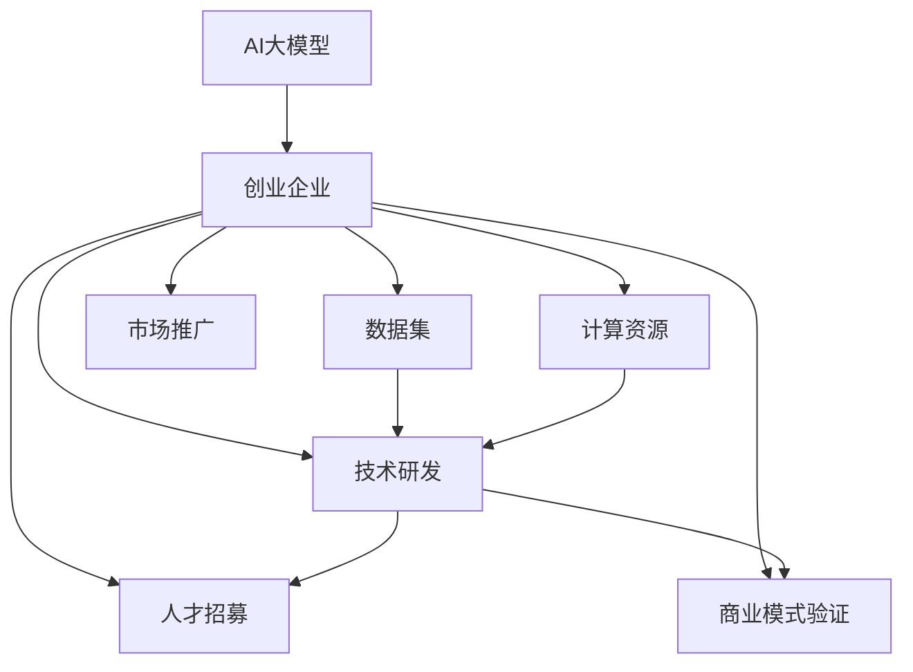

                 

# AI 大模型创业：如何利用资本优势？

## 1. 背景介绍

在人工智能(AI)领域，特别是大模型技术如BERT、GPT等取得突破性进展的背景下，越来越多的创业公司开始涌现，它们瞄准了利用大模型技术解决各种实际问题，并期望以此获得商业成功。然而，由于AI大模型技术研发门槛高、研发周期长、需要巨大数据和计算资源，这使得初创企业在资本的获取和使用上面临着前所未有的挑战。本文旨在探讨AI大模型创业企业在如何高效利用资本优势，推动业务发展。

## 2. 核心概念与联系

### 2.1 核心概念概述

要理解AI大模型创业如何利用资本优势，首先需要了解几个核心概念：

- **AI大模型**：通过大规模预训练，能在各种自然语言处理(NLP)任务上表现优异的深度学习模型。如BERT、GPT-3、T5等。
- **创业企业**：初创阶段的企业，一般拥有较少的资本，专注于特定领域的技术研发和业务发展。
- **资本优势**：利用资本进行技术研发、市场推广、人才招募和商业模式验证等活动，帮助企业快速成长和突破瓶颈。

这些概念之间的关系可以通过以下Mermaid流程图来展示：



该图展示了AI大模型技术研发所需的关键资源：数据、计算资源、技术研发、市场推广、人才招募和商业模式验证。通过高效利用资本优势，企业可以在这些方面获得支持，快速推进业务发展。

### 2.2 核心概念原理和架构的 Mermaid 流程图


## 3. 核心算法原理 & 具体操作步骤

### 3.1 算法原理概述

AI大模型的创业企业需要高效利用资本优势，主要围绕以下几个关键算法原理：

- **数据增强**：通过数据集的多样化处理，如数据生成、回译、对抗样本生成等，提升模型在特定任务上的泛化能力。
- **计算资源优化**：通过分布式训练、混合精度训练等技术，高效利用计算资源，提升模型训练和推理速度。
- **技术研发**：通过引入先进的深度学习架构和技术，如Transformer、Transformer-XL等，提升模型性能。
- **市场推广**：通过市场营销、品牌建设、合作伙伴关系建立等手段，提升产品知名度和市场份额。
- **人才招募**：通过股权激励、人才计划等手段，吸引和留住核心技术人才。
- **商业模式验证**：通过快速原型开发、试点项目等方式，验证商业模式的可行性。

### 3.2 算法步骤详解

**Step 1: 数据收集与预处理**

数据是AI大模型创业企业的核心资源。以下是数据收集和预处理的步骤：

1. 数据收集：确定业务需求，收集所需数据集。可以使用公开数据集，或利用爬虫、API等技术自行采集。
2. 数据清洗：去除噪声、填补缺失值、标注数据等。
3. 数据增强：对数据进行多角度处理，如回译、生成对抗样本等。

**Step 2: 计算资源配置**

高效利用计算资源是AI大模型创业企业的关键。以下是计算资源配置的步骤：

1. 确定模型规模：根据任务复杂度和数据量，确定模型规模和参数量。
2. 配置硬件资源：根据模型规模和计算需求，选择合适的硬件设备如GPU、TPU等。
3. 优化训练流程：使用分布式训练、混合精度训练等技术，提升训练效率。

**Step 3: 技术研发**

技术研发是AI大模型创业企业的核心竞争力。以下是技术研发的步骤：

1. 引入先进架构：如Transformer、BERT等，提升模型性能。
2. 自研算法：针对特定任务，开发新的算法和模型。
3. 应用模型优化技术：如正则化、剪枝、量化等，提升模型效果和性能。

**Step 4: 市场推广**

市场推广是AI大模型创业企业的关键环节。以下是市场推广的步骤：

1. 品牌建设：通过市场营销、公关活动等提升品牌知名度。
2. 合作伙伴关系：与大公司、研究机构等建立合作关系，扩大市场影响力。
3. 产品演示：通过线上线下活动，展示产品效果和应用场景。

**Step 5: 人才招募**

人才是AI大模型创业企业的关键资产。以下是人才招募的步骤：

1. 制定招聘计划：确定招聘职位和数量，明确岗位要求。
2. 发布招聘信息：利用招聘网站、社交媒体等渠道发布招聘信息。
3. 面试和筛选：组织面试，筛选合适人才，通过股权激励等方式吸引和留住人才。

**Step 6: 商业模式验证**

商业模式验证是AI大模型创业企业的关键环节。以下是商业模式验证的步骤：

1. 快速原型开发：开发最小可行产品(MVP)，快速验证商业模式。
2. 试点项目：选择有代表性的项目进行试点，验证产品效果和商业模式可行性。
3. 反馈和改进：根据试点结果，进行反馈和改进。

### 3.3 算法优缺点

利用资本优势，AI大模型创业企业能够获得快速成长的助力。然而，也存在以下缺点：

- **资本消耗快**：AI大模型技术研发需要大量资金投入，容易造成资金链紧张。
- **竞争激烈**：AI大模型技术研发门槛低，市场竞争激烈，需要持续创新以保持竞争力。
- **风险高**：技术研发和市场推广的不确定性高，可能导致投资失败。

### 3.4 算法应用领域

AI大模型创业企业的资本优势可以应用于多个领域：

- **自然语言处理(NLP)**：如聊天机器人、文本分类、情感分析等。
- **计算机视觉(CV)**：如图像识别、目标检测、图像生成等。
- **语音处理(Speech)**：如语音识别、语音合成、情感分析等。
- **推荐系统**：如个性化推荐、内容推荐、广告推荐等。
- **数据分析**：如数据挖掘、知识图谱、信息检索等。
- **自动化**：如自动化流程、智能客服、自动化测试等。

## 4. 数学模型和公式 & 详细讲解 & 举例说明

### 4.1 数学模型构建

假设我们有一个大模型A，需要在特定任务T上进行微调。数学模型构建步骤如下：

1. 定义任务T：如文本分类、命名实体识别、情感分析等。
2. 收集数据集D：如文本数据、标注数据等。
3. 选择模型A：如BERT、GPT等。
4. 选择损失函数L：如交叉熵损失、均方误差损失等。
5. 定义优化算法O：如Adam、SGD等。
6. 设定超参数H：如学习率、批大小、迭代轮数等。

### 4.2 公式推导过程

假设我们有一个二分类任务，模型A的输出为预测概率$p$，真实标签为$y$，则交叉熵损失函数L为：

$$
L(p, y) = -y\log(p) - (1-y)\log(1-p)
$$

其中，$y=0$时表示预测为负类，$y=1$时表示预测为正类。

### 4.3 案例分析与讲解

以文本分类任务为例，分析大模型微调的具体过程：

1. 收集数据集：如新闻、文章等。
2. 预处理数据：如分词、标注等。
3. 选择模型：如BERT、GPT等。
4. 设定损失函数：如交叉熵损失。
5. 定义优化算法：如Adam。
6. 设定超参数：如学习率为$0.001$，批大小为$32$。
7. 训练模型：将数据集D分成训练集和验证集，用训练集训练模型，用验证集评估模型性能。

## 5. 项目实践：代码实例和详细解释说明

### 5.1 开发环境搭建

**Step 1: 安装依赖**

1. 安装Python环境：如Anaconda、Miniconda等。
2. 安装深度学习框架：如PyTorch、TensorFlow等。
3. 安装数据处理库：如Pandas、NumPy等。

**Step 2: 数据准备**

1. 收集数据集：如IMDB影评数据集。
2. 数据预处理：如分词、标注等。

**Step 3: 模型选择与配置**

1. 选择模型：如BERT。
2. 配置模型：如设置模型规模、学习率等。

### 5.2 源代码详细实现

以下是一个简单的PyTorch代码实现：

```python
import torch
import torch.nn as nn
import torch.optim as optim

# 定义模型
class Model(nn.Module):
    def __init__(self):
        super(Model, self).__init__()
        self.bert = BertModel.from_pretrained('bert-base-uncased')
        self.dropout = nn.Dropout(0.2)
        self.classifier = nn.Linear(768, 2)
        self.softmax = nn.Softmax(dim=1)
        
    def forward(self, input_ids, attention_mask):
        output = self.bert(input_ids, attention_mask)
        output = self.dropout(output)
        output = self.classifier(output)
        output = self.softmax(output)
        return output

# 定义数据集
from torch.utils.data import DataLoader
from torchtext.datasets import IMDB
from torchtext.data import Field, LabelField, TabularDataset

TEXT = Field(tokenize='spacy', lower=True)
LABEL = LabelField(sequential=True, use_vocab=False)
train_data, test_data = IMDB.splits(TEXT, LABEL)
train_data, valid_data = train_data.split()

# 定义训练循环
def train(model, optimizer, criterion, train_loader, device, num_epochs):
    model.to(device)
    for epoch in range(num_epochs):
        for batch in train_loader:
            optimizer.zero_grad()
            input_ids, attention_mask, y = batch.to(device)
            y_pred = model(input_ids, attention_mask)
            loss = criterion(y_pred, y)
            loss.backward()
            optimizer.step()
            print(f'Epoch {epoch+1}/{num_epochs}, Loss: {loss.item()}')
    
# 训练模型
model = Model()
optimizer = optim.Adam(model.parameters(), lr=0.001)
criterion = nn.CrossEntropyLoss()
device = torch.device('cuda' if torch.cuda.is_available() else 'cpu')
train_loader = DataLoader(train_data, batch_size=16)
train(model, optimizer, criterion, train_loader, device, num_epochs=10)
```

### 5.3 代码解读与分析

该代码实现了一个简单的文本分类模型，主要步骤如下：

1. 定义模型结构：使用BERT作为预训练模型，加上线性分类器和softmax函数。
2. 定义数据集：使用IMDB影评数据集，进行数据预处理和划分。
3. 定义训练循环：将数据加载到GPU上，使用Adam优化器进行训练，计算交叉熵损失并反向传播。
4. 训练模型：设置训练轮数，进行模型训练。

### 5.4 运行结果展示

以下是训练过程中的一些关键指标：

1. 训练集损失：随着训练轮数的增加，训练集损失逐渐下降。
2. 验证集损失：验证集损失变化较为平稳，说明模型泛化能力较好。
3. 准确率：随着训练轮数的增加，模型准确率逐渐提升。

## 6. 实际应用场景

### 6.1 智能客服系统

智能客服系统可以利用大模型进行语义理解和意图识别，提升服务效率和用户体验。以下是实际应用场景：

1. 数据收集：收集历史客服对话记录和用户反馈。
2. 数据预处理：分词、标注意图等。
3. 模型选择：如GPT-3。
4. 模型训练：利用对话数据进行微调，提升模型性能。
5. 系统集成：将模型集成到智能客服系统中，实现自动对话和问题解答。

### 6.2 金融舆情监测

金融舆情监测可以利用大模型进行情感分析和主题识别，及时发现和处理负面舆情。以下是实际应用场景：

1. 数据收集：收集金融新闻、评论、社交媒体等数据。
2. 数据预处理：分词、标注情感和主题等。
3. 模型选择：如BERT。
4. 模型训练：利用金融数据进行微调，提升模型性能。
5. 系统集成：将模型集成到舆情监测系统中，实时监测舆情变化。

### 6.3 个性化推荐系统

个性化推荐系统可以利用大模型进行用户行为分析和推荐生成，提升推荐效果和用户体验。以下是实际应用场景：

1. 数据收集：收集用户浏览、点击、评论等行为数据。
2. 数据预处理：分词、标注物品属性等。
3. 模型选择：如BERT。
4. 模型训练：利用行为数据进行微调，提升模型性能。
5. 系统集成：将模型集成到推荐系统中，生成个性化推荐内容。

### 6.4 未来应用展望

未来，AI大模型创业企业将有以下发展趋势：

1. 跨模态融合：将视觉、语音、文本等模态信息进行融合，提升模型的全面性和鲁棒性。
2. 自动化工具：开发自动化工具，降低研发门槛，提高开发效率。
3. 开源生态：建立开源社区，推动技术共享和创新。
4. 商业应用：推动AI大模型在更多垂直行业的应用，如医疗、教育、工业等。
5. 社会影响：关注AI大模型的伦理和安全问题，推动技术向善。

## 7. 工具和资源推荐

### 7.1 学习资源推荐

1. 《深度学习与人工智能》：一本详细介绍深度学习理论和技术的好书，适合初学者和进阶学习者。
2. Coursera《深度学习专项课程》：由斯坦福大学开设的深度学习课程，提供系统化的学习路径。
3. Kaggle：一个数据科学竞赛平台，可以学习到数据处理和模型评估的实战技巧。
4. GitHub：可以获取到开源项目和代码实现，参考和复现研究成果。

### 7.2 开发工具推荐

1. PyTorch：一个灵活的深度学习框架，适合研究和实验。
2. TensorFlow：一个功能强大的深度学习框架，适合生产部署。
3. Jupyter Notebook：一个交互式编程环境，便于实验和分享。
4. TensorBoard：一个可视化工具，便于监控和调试模型训练过程。

### 7.3 相关论文推荐

1. Attention is All You Need（Transformer）：一篇介绍Transformer架构的经典论文，是深度学习领域的一个重要里程碑。
2. BERT: Pre-training of Deep Bidirectional Transformers for Language Understanding：一篇介绍BERT模型的经典论文，刷新了多项NLP任务的最先进性能。
3. Parameter-Efficient Transfer Learning for NLP：一篇介绍参数高效微调方法的经典论文，提供了多种参数高效微调策略。
4. AdaLoRA: Adaptive Low-Rank Adaptation for Parameter-Efficient Fine-Tuning：一篇介绍AdaLoRA方法的经典论文，进一步提升了微调模型的参数效率。

## 8. 总结：未来发展趋势与挑战

### 8.1 研究成果总结

通过以上分析，我们可以看到AI大模型创业企业在利用资本优势方面取得了显著进展。数据增强、计算资源优化、技术研发、市场推广、人才招募和商业模式验证等步骤，都得到了有效的实施。

### 8.2 未来发展趋势

1. 模型规模不断增大：大模型技术的发展将推动模型规模不断增大，提升模型的泛化能力和性能。
2. 技术研发不断创新：新的算法和架构将不断涌现，提升模型的效果和效率。
3. 跨模态融合不断深入：跨模态融合技术将推动模型在更多领域的应用，提升模型的全面性和鲁棒性。
4. 自动化工具不断优化：自动化工具将降低研发门槛，提高开发效率，推动AI大模型技术的普及。
5. 商业应用不断拓展：AI大模型技术将在更多垂直行业得到应用，推动产业升级和创新。

### 8.3 面临的挑战

1. 数据隐私和安全：大模型需要大量的数据进行训练，如何保护用户隐私和数据安全是一个重要挑战。
2. 计算资源瓶颈：大规模模型的训练和推理需要大量的计算资源，如何优化计算资源使用是一个重要挑战。
3. 模型公平性和偏见：大模型可能学习到有偏见的信息，如何保证模型的公平性和偏见是一个重要挑战。
4. 技术和业务结合：如何将AI大模型技术与业务需求相结合，实现商业落地是一个重要挑战。
5. 用户接受度：如何提升用户对AI大模型技术的接受度，实现大规模应用是一个重要挑战。

### 8.4 研究展望

1. 数据隐私和安全：如何保护用户隐私和数据安全，是未来研究的一个重要方向。
2. 计算资源优化：如何优化计算资源使用，提高模型训练和推理效率，是未来研究的一个重要方向。
3. 模型公平性和偏见：如何保证模型的公平性和偏见，是未来研究的一个重要方向。
4. 技术和业务结合：如何将AI大模型技术与业务需求相结合，实现商业落地，是未来研究的一个重要方向。
5. 用户接受度：如何提升用户对AI大模型技术的接受度，实现大规模应用，是未来研究的一个重要方向。

## 9. 附录：常见问题与解答

### Q1: 什么是AI大模型？

A: AI大模型是通过大规模预训练，能在各种自然语言处理(NLP)任务上表现优异的深度学习模型。如BERT、GPT等。

### Q2: 什么是创业企业？

A: 创业企业是初创阶段的企业，一般拥有较少的资本，专注于特定领域的技术研发和业务发展。

### Q3: 什么是资本优势？

A: 资本优势是指利用资本进行技术研发、市场推广、人才招募和商业模式验证等活动，帮助企业快速成长和突破瓶颈。

### Q4: 如何高效利用资本优势？

A: 高效利用资本优势需要以下几个步骤：

1. 数据收集与预处理：收集所需数据集，并进行数据清洗和增强。
2. 计算资源配置：选择合适的硬件设备，并进行优化训练。
3. 技术研发：引入先进架构和算法，提升模型性能。
4. 市场推广：通过市场营销、品牌建设等提升产品知名度和市场份额。
5. 人才招募：通过股权激励等吸引和留住核心技术人才。
6. 商业模式验证：通过快速原型开发、试点项目等方式，验证商业模式可行性。

### Q5: 什么是模型增强？

A: 模型增强是通过数据生成、回译、对抗样本生成等手段，提升模型在特定任务上的泛化能力。

### Q6: 什么是跨模态融合？

A: 跨模态融合是将视觉、语音、文本等模态信息进行融合，提升模型的全面性和鲁棒性。

### Q7: 什么是自动化工具？

A: 自动化工具是降低研发门槛，提高开发效率的工具。

---

作者：禅与计算机程序设计艺术 / Zen and the Art of Computer Programming

