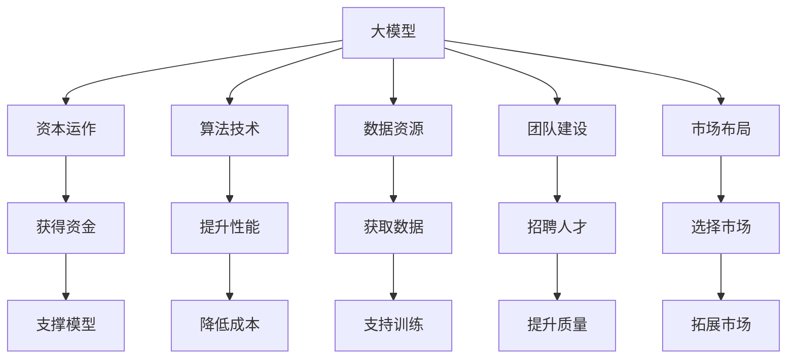

                 

# AI 大模型创业：如何利用资源优势？

> 关键词：大模型创业,资源优势,资本运作,算法技术,人工智能

## 1. 背景介绍

### 1.1 问题由来
近年来，人工智能(AI)技术的迅猛发展，特别是深度学习模型在图像识别、自然语言处理等领域取得突破性进展，催生了大量的创业公司。其中，利用大模型进行创业，凭借其强大的算力和数据驱动能力，成为不少AI创业公司竞争的核心资源。然而，大模型的开发、训练和维护成本高昂，且需要深厚的技术积累和强大的资源支撑，这对许多创业公司来说是一大挑战。

### 1.2 问题核心关键点
如何利用大模型的资源优势，高效、低成本地构建AI创业公司？这是当前AI领域创业中一个亟需解决的关键问题。本文将从资本运作、算法技术、数据资源、团队建设和市场布局等多个维度，探讨如何高效利用大模型资源，推动AI创业公司的发展。

### 1.3 问题研究意义
研究大模型在AI创业中的应用策略，对于帮助AI创业公司充分利用大模型的算力和数据优势，降低开发和维护成本，提升产品竞争力，具有重要的理论和实践意义。

1. 高效利用资源：通过优化资本运作和技术选择，可以在有限的资源下实现大模型的高效开发和部署。
2. 降低创业风险：科学的数据选择和算法优化可以显著降低创业公司面临的数据集不足和模型过拟合的风险。
3. 提升产品竞争力：充分利用大模型的优势，可以有效提升AI产品的性能和用户体验，增强市场竞争力。
4. 加速创业进程：优化团队建设和市场布局策略，可以加速AI创业公司的市场化进程，缩短产品开发周期。

## 2. 核心概念与联系

### 2.1 核心概念概述

为更好地理解大模型在AI创业中的应用策略，本节将介绍几个密切相关的核心概念：

- 大模型(Big Model)：指具有大规模参数量、复杂结构和强大表达能力的深度学习模型，如BERT、GPT、ResNet等。大模型通常需要耗费大量算力和数据进行训练和优化。
- 资本运作(Capital Operation)：指创业公司如何通过股权融资、政府支持、技术合作等多种方式获取资金资源，推动公司发展和模型开发。
- 算法技术(Algorithm Technology)：指选择和使用合适的算法模型，通过优化算法提高模型效率和性能，如参数高效微调、知识蒸馏、正则化等。
- 数据资源(Data Resource)：指创业公司获取和使用大规模数据集，如公开数据集、网络爬虫、众包平台等，支持模型训练和优化。
- 团队建设(Team Building)：指创业公司如何构建和维护一支高效、专业、具有跨学科背景的团队，包括数据科学家、工程师、产品经理等。
- 市场布局(Market Layout)：指创业公司如何选择合适的市场和业务方向，通过市场调研、产品定位、品牌建设等方式，进行市场拓展和客户积累。

这些核心概念之间的逻辑关系可以通过以下Mermaid流程图来展示：



这个流程图展示了大模型在AI创业中的核心概念及其相互关系：

1. 大模型通过算力驱动训练和优化。
2. 资本运作支持模型开发和公司运营。
3. 算法技术提升模型效率和性能。
4. 数据资源丰富训练集和测试集。
5. 团队建设保障技术研发和产品创新。
6. 市场布局开拓市场和客户。

这些概念共同构成了大模型在AI创业中的资源利用框架，帮助创业公司最大化其资源价值，提升产品竞争力和市场影响力。

## 3. 核心算法原理 & 具体操作步骤
### 3.1 算法原理概述

大模型在AI创业中的应用策略，核心在于如何高效利用大模型的算力和数据优势，同时规避其高昂成本和资源消耗。以下是基于大模型的AI创业中常用的算法原理：

- 参数高效微调(Parameter-Efficient Fine-Tuning, PEFT)：通过只更新少量模型参数，保留大部分预训练参数，减少资源消耗，提高微调效率。
- 知识蒸馏(Knowledge Distillation)：通过将大模型的知识传递给小模型，减少模型计算量，同时保持性能。
- 数据增强(Data Augmentation)：通过对训练数据进行扩充，提高模型的泛化能力。
- 正则化(Regularization)：通过L1/L2正则、Dropout等技术，防止模型过拟合，提高模型鲁棒性。
- 对抗训练(Adversarial Training)：通过加入对抗样本训练模型，提高模型的鲁棒性和泛化能力。
- 可解释性(Explainability)：通过可视化工具和解释模型，提升模型的可解释性，帮助用户理解模型决策。

这些算法原理可以帮助创业公司在有限资源下高效开发和优化大模型，提升产品性能和用户体验。

### 3.2 算法步骤详解

基于大模型的AI创业中，算法步骤主要包括：

1. **数据准备**：选择合适的数据集，并进行数据预处理，如清洗、归一化、分词等，为模型训练做准备。
2. **模型选择与初始化**：根据任务需求，选择合适的预训练模型作为初始化参数，并进行模型适配层的添加。
3. **算法实现**：在模型训练中应用上述算法原理，如PEFT、知识蒸馏等，优化模型参数和训练过程。
4. **模型评估与优化**：在验证集上评估模型性能，根据评估结果进行参数调整和算法改进。
5. **模型部署与应用**：将优化后的模型部署到实际应用中，进行效果测试和用户反馈收集，不断迭代优化。

### 3.3 算法优缺点

基于大模型的AI创业中，常用的算法原理具有以下优缺点：

- **优点**：
  - **高效性**：通过算法优化，可以在较少的训练数据和资源下实现高效模型开发。
  - **泛化能力**：参数高效微调和知识蒸馏等技术，能提高模型的泛化能力和鲁棒性。
  - **低成本**：算法优化降低了对大模型的依赖，减少了算力、数据和人力成本。

- **缺点**：
  - **技术复杂**：算法优化需要深厚的技术积累，实施难度较大。
  - **时间成本**：算法优化过程需要较长的调试和测试时间，影响产品开发速度。
  - **结果依赖**：算法的有效性依赖于数据的丰富度和质量，数据不足时效果可能不佳。

### 3.4 算法应用领域

基于大模型的AI创业中，常用的算法原理在不同领域的应用如下：

- **自然语言处理(NLP)**：通过参数高效微调和知识蒸馏，优化BERT、GPT等预训练模型，提升文本分类、情感分析、问答等任务的性能。
- **计算机视觉(CV)**：通过数据增强和对抗训练，优化ResNet、Inception等预训练模型，提升图像分类、目标检测、图像生成等任务的性能。
- **语音识别(SR)**：通过正则化和对抗训练，优化CNN-RNN等预训练模型，提升语音识别和语音生成等任务的性能。
- **推荐系统(Recommender System)**：通过知识蒸馏和参数高效微调，优化协同过滤和基于深度学习的推荐模型，提升推荐精准度和个性化程度。
- **医疗健康(Healthcare)**：通过正则化和对抗训练，优化医疗影像分析和疾病诊断模型，提升医疗服务的精准度和可靠性。

以上领域展示了大模型在AI创业中的广泛应用，不同算法原理可以针对不同任务需求进行优化和选择。

## 4. 数学模型和公式 & 详细讲解  
### 4.1 数学模型构建

本节将使用数学语言对基于大模型的AI创业中常用的算法原理进行更加严格的刻画。

假设大模型为 $M_{\theta}$，其中 $\theta$ 为模型参数。我们以自然语言处理任务为例，定义模型的损失函数 $\ell$，并应用参数高效微调(PEFT)技术，仅更新模型顶层参数。

假设模型在输入 $x$ 上的输出为 $\hat{y}=M_{\theta}(x)$，真实标签为 $y$。则PEFT的目标是最小化损失函数：

$$
\mathcal{L}(\theta) = \frac{1}{N}\sum_{i=1}^N \ell(y_i, M_{\theta}(x_i))
$$

其中，$\ell$ 为损失函数，如交叉熵损失、均方误差损失等。在微调过程中，我们仅更新顶层参数 $\theta^*$，而保留底层预训练参数不变，目标函数为：

$$
\theta^* = \mathop{\arg\min}_{\theta} \mathcal{L}(\theta)
$$

通过梯度下降等优化算法，微调过程不断更新顶层参数 $\theta^*$，最小化损失函数 $\mathcal{L}$，使得模型输出逼近真实标签。

### 4.2 公式推导过程

以交叉熵损失为例，推导PEFT的优化目标函数。

假设模型在输入 $x$ 上的输出为 $\hat{y}=M_{\theta}(x) \in [0,1]$，表示样本属于正类的概率。真实标签 $y \in \{0,1\}$。则二分类交叉熵损失函数定义为：

$$
\ell(M_{\theta}(x),y) = -[y\log \hat{y} + (1-y)\log (1-\hat{y})]
$$

将模型输出 $\hat{y}$ 和真实标签 $y$ 带入损失函数，得：

$$
\mathcal{L}(\theta) = -\frac{1}{N}\sum_{i=1}^N [y_i\log M_{\theta}(x_i)+(1-y_i)\log(1-M_{\theta}(x_i))]
$$

在微调过程中，我们仅更新顶层参数 $\theta^*$，而保留底层预训练参数不变。目标函数为：

$$
\theta^* = \mathop{\arg\min}_{\theta} \mathcal{L}(\theta)
$$

通过梯度下降等优化算法，微调过程不断更新顶层参数 $\theta^*$，最小化损失函数 $\mathcal{L}$，使得模型输出逼近真实标签。

## 5. 项目实践：代码实例和详细解释说明
### 5.1 开发环境搭建

在进行大模型创业的算法实践中，我们需要准备好开发环境。以下是使用Python进行PyTorch开发的环境配置流程：

1. 安装Anaconda：从官网下载并安装Anaconda，用于创建独立的Python环境。

2. 创建并激活虚拟环境：
```bash
conda create -n pytorch-env python=3.8 
conda activate pytorch-env
```

3. 安装PyTorch：根据CUDA版本，从官网获取对应的安装命令。例如：
```bash
conda install pytorch torchvision torchaudio cudatoolkit=11.1 -c pytorch -c conda-forge
```

4. 安装Transformers库：
```bash
pip install transformers
```

5. 安装各类工具包：
```bash
pip install numpy pandas scikit-learn matplotlib tqdm jupyter notebook ipython
```

完成上述步骤后，即可在`pytorch-env`环境中开始算法实践。

### 5.2 源代码详细实现

这里我们以BERT模型在NLP任务上的微调为例，给出使用Transformers库的Python代码实现。

首先，定义NLP任务的数据处理函数：

```python
from transformers import BertTokenizer
from torch.utils.data import Dataset
import torch

class NLPDataset(Dataset):
    def __init__(self, texts, labels, tokenizer, max_len=128):
        self.texts = texts
        self.labels = labels
        self.tokenizer = tokenizer
        self.max_len = max_len
        
    def __len__(self):
        return len(self.texts)
    
    def __getitem__(self, item):
        text = self.texts[item]
        label = self.labels[item]
        
        encoding = self.tokenizer(text, return_tensors='pt', max_length=self.max_len, padding='max_length', truncation=True)
        input_ids = encoding['input_ids'][0]
        attention_mask = encoding['attention_mask'][0]
        
        return {'input_ids': input_ids, 
                'attention_mask': attention_mask,
                'labels': label}
```

然后，定义模型和优化器：

```python
from transformers import BertForTokenClassification, AdamW

model = BertForTokenClassification.from_pretrained('bert-base-cased', num_labels=len(tag2id))

optimizer = AdamW(model.parameters(), lr=2e-5)
```

接着，定义训练和评估函数：

```python
from torch.utils.data import DataLoader
from tqdm import tqdm
from sklearn.metrics import classification_report

device = torch.device('cuda') if torch.cuda.is_available() else torch.device('cpu')
model.to(device)

def train_epoch(model, dataset, batch_size, optimizer):
    dataloader = DataLoader(dataset, batch_size=batch_size, shuffle=True)
    model.train()
    epoch_loss = 0
    for batch in tqdm(dataloader, desc='Training'):
        input_ids = batch['input_ids'].to(device)
        attention_mask = batch['attention_mask'].to(device)
        labels = batch['labels'].to(device)
        model.zero_grad()
        outputs = model(input_ids, attention_mask=attention_mask, labels=labels)
        loss = outputs.loss
        epoch_loss += loss.item()
        loss.backward()
        optimizer.step()
    return epoch_loss / len(dataloader)

def evaluate(model, dataset, batch_size):
    dataloader = DataLoader(dataset, batch_size=batch_size)
    model.eval()
    preds, labels = [], []
    with torch.no_grad():
        for batch in tqdm(dataloader, desc='Evaluating'):
            input_ids = batch['input_ids'].to(device)
            attention_mask = batch['attention_mask'].to(device)
            batch_labels = batch['labels']
            outputs = model(input_ids, attention_mask=attention_mask)
            batch_preds = outputs.logits.argmax(dim=2).to('cpu').tolist()
            batch_labels = batch_labels.to('cpu').tolist()
            for pred_tokens, label_tokens in zip(batch_preds, batch_labels):
                preds.append(pred_tokens[:len(label_tokens)])
                labels.append(label_tokens)
                
    print(classification_report(labels, preds))
```

最后，启动训练流程并在测试集上评估：

```python
epochs = 5
batch_size = 16

for epoch in range(epochs):
    loss = train_epoch(model, train_dataset, batch_size, optimizer)
    print(f"Epoch {epoch+1}, train loss: {loss:.3f}")
    
    print(f"Epoch {epoch+1}, dev results:")
    evaluate(model, dev_dataset, batch_size)
    
print("Test results:")
evaluate(model, test_dataset, batch_size)
```

以上就是使用PyTorch对BERT进行NLP任务微调的完整代码实现。可以看到，得益于Transformers库的强大封装，我们可以用相对简洁的代码完成BERT模型的加载和微调。

### 5.3 代码解读与分析

让我们再详细解读一下关键代码的实现细节：

**NLPDataset类**：
- `__init__`方法：初始化文本、标签、分词器等关键组件。
- `__len__`方法：返回数据集的样本数量。
- `__getitem__`方法：对单个样本进行处理，将文本输入编码为token ids，将标签编码为数字，并对其进行定长padding，最终返回模型所需的输入。

**tag2id和id2tag字典**：
- 定义了标签与数字id之间的映射关系，用于将token-wise的预测结果解码回真实的标签。

**训练和评估函数**：
- 使用PyTorch的DataLoader对数据集进行批次化加载，供模型训练和推理使用。
- 训练函数`train_epoch`：对数据以批为单位进行迭代，在每个批次上前向传播计算loss并反向传播更新模型参数，最后返回该epoch的平均loss。
- 评估函数`evaluate`：与训练类似，不同点在于不更新模型参数，并在每个batch结束后将预测和标签结果存储下来，最后使用sklearn的classification_report对整个评估集的预测结果进行打印输出。

**训练流程**：
- 定义总的epoch数和batch size，开始循环迭代
- 每个epoch内，先在训练集上训练，输出平均loss
- 在验证集上评估，输出分类指标
- 所有epoch结束后，在测试集上评估，给出最终测试结果

可以看到，PyTorch配合Transformers库使得BERT微调的代码实现变得简洁高效。开发者可以将更多精力放在数据处理、模型改进等高层逻辑上，而不必过多关注底层的实现细节。

当然，工业级的系统实现还需考虑更多因素，如模型的保存和部署、超参数的自动搜索、更灵活的任务适配层等。但核心的微调范式基本与此类似。

## 6. 实际应用场景
### 6.1 智能客服系统

基于大模型的NLP任务微调，可以广泛应用于智能客服系统的构建。传统客服往往需要配备大量人力，高峰期响应缓慢，且一致性和专业性难以保证。而使用微调后的NLP模型，可以7x24小时不间断服务，快速响应客户咨询，用自然流畅的语言解答各类常见问题。

在技术实现上，可以收集企业内部的历史客服对话记录，将问题和最佳答复构建成监督数据，在此基础上对预训练NLP模型进行微调。微调后的NLP模型能够自动理解用户意图，匹配最合适的答案模板进行回复。对于客户提出的新问题，还可以接入检索系统实时搜索相关内容，动态组织生成回答。如此构建的智能客服系统，能大幅提升客户咨询体验和问题解决效率。

### 6.2 金融舆情监测

金融机构需要实时监测市场舆论动向，以便及时应对负面信息传播，规避金融风险。传统的人工监测方式成本高、效率低，难以应对网络时代海量信息爆发的挑战。基于大模型的文本分类和情感分析技术，为金融舆情监测提供了新的解决方案。

具体而言，可以收集金融领域相关的新闻、报道、评论等文本数据，并对其进行主题标注和情感标注。在此基础上对预训练语言模型进行微调，使其能够自动判断文本属于何种主题，情感倾向是正面、中性还是负面。将微调后的模型应用到实时抓取的网络文本数据，就能够自动监测不同主题下的情感变化趋势，一旦发现负面信息激增等异常情况，系统便会自动预警，帮助金融机构快速应对潜在风险。

### 6.3 个性化推荐系统

当前的推荐系统往往只依赖用户的历史行为数据进行物品推荐，无法深入理解用户的真实兴趣偏好。基于大模型微调的NLP任务，可以更好地挖掘用户行为背后的语义信息，从而提供更精准、多样的推荐内容。

在实践中，可以收集用户浏览、点击、评论、分享等行为数据，提取和用户交互的物品标题、描述、标签等文本内容。将文本内容作为模型输入，用户的后续行为（如是否点击、购买等）作为监督信号，在此基础上微调预训练语言模型。微调后的模型能够从文本内容中准确把握用户的兴趣点。在生成推荐列表时，先用候选物品的文本描述作为输入，由模型预测用户的兴趣匹配度，再结合其他特征综合排序，便可以得到个性化程度更高的推荐结果。

### 6.4 未来应用展望

随着大模型和微调方法的不断发展，基于微调范式将在更多领域得到应用，为传统行业带来变革性影响。

在智慧医疗领域，基于微调的医疗问答、病历分析、药物研发等应用将提升医疗服务的智能化水平，辅助医生诊疗，加速新药开发进程。

在智能教育领域，微调技术可应用于作业批改、学情分析、知识推荐等方面，因材施教，促进教育公平，提高教学质量。

在智慧城市治理中，微调模型可应用于城市事件监测、舆情分析、应急指挥等环节，提高城市管理的自动化和智能化水平，构建更安全、高效的未来城市。

此外，在企业生产、社会治理、文娱传媒等众多领域，基于大模型微调的人工智能应用也将不断涌现，为经济社会发展注入新的动力。相信随着预训练语言模型和微调方法的持续演进，大语言模型微调必将在构建人机协同的智能时代中扮演越来越重要的角色。

## 7. 工具和资源推荐
### 7.1 学习资源推荐

为了帮助开发者系统掌握大模型微调的理论基础和实践技巧，这里推荐一些优质的学习资源：

1. 《Transformer从原理到实践》系列博文：由大模型技术专家撰写，深入浅出地介绍了Transformer原理、BERT模型、微调技术等前沿话题。

2. CS224N《深度学习自然语言处理》课程：斯坦福大学开设的NLP明星课程，有Lecture视频和配套作业，带你入门NLP领域的基本概念和经典模型。

3. 《Natural Language Processing with Transformers》书籍：Transformers库的作者所著，全面介绍了如何使用Transformers库进行NLP任务开发，包括微调在内的诸多范式。

4. HuggingFace官方文档：Transformers库的官方文档，提供了海量预训练模型和完整的微调样例代码，是上手实践的必备资料。

5. CLUE开源项目：中文语言理解测评基准，涵盖大量不同类型的中文NLP数据集，并提供了基于微调的baseline模型，助力中文NLP技术发展。

通过对这些资源的学习实践，相信你一定能够快速掌握大模型微调的精髓，并用于解决实际的NLP问题。
###  7.2 开发工具推荐

高效的开发离不开优秀的工具支持。以下是几款用于大模型微调开发的常用工具：

1. PyTorch：基于Python的开源深度学习框架，灵活动态的计算图，适合快速迭代研究。大部分预训练语言模型都有PyTorch版本的实现。

2. TensorFlow：由Google主导开发的开源深度学习框架，生产部署方便，适合大规模工程应用。同样有丰富的预训练语言模型资源。

3. Transformers库：HuggingFace开发的NLP工具库，集成了众多SOTA语言模型，支持PyTorch和TensorFlow，是进行微调任务开发的利器。

4. Weights & Biases：模型训练的实验跟踪工具，可以记录和可视化模型训练过程中的各项指标，方便对比和调优。与主流深度学习框架无缝集成。

5. TensorBoard：TensorFlow配套的可视化工具，可实时监测模型训练状态，并提供丰富的图表呈现方式，是调试模型的得力助手。

6. Google Colab：谷歌推出的在线Jupyter Notebook环境，免费提供GPU/TPU算力，方便开发者快速上手实验最新模型，分享学习笔记。

合理利用这些工具，可以显著提升大模型微调任务的开发效率，加快创新迭代的步伐。

### 7.3 相关论文推荐

大模型和微调技术的发展源于学界的持续研究。以下是几篇奠基性的相关论文，推荐阅读：

1. Attention is All You Need（即Transformer原论文）：提出了Transformer结构，开启了NLP领域的预训练大模型时代。

2. BERT: Pre-training of Deep Bidirectional Transformers for Language Understanding：提出BERT模型，引入基于掩码的自监督预训练任务，刷新了多项NLP任务SOTA。

3. Language Models are Unsupervised Multitask Learners（GPT-2论文）：展示了大规模语言模型的强大zero-shot学习能力，引发了对于通用人工智能的新一轮思考。

4. Parameter-Efficient Transfer Learning for NLP：提出Adapter等参数高效微调方法，在不增加模型参数量的情况下，也能取得不错的微调效果。

5. AdaLoRA: Adaptive Low-Rank Adaptation for Parameter-Efficient Fine-Tuning：使用自适应低秩适应的微调方法，在参数效率和精度之间取得了新的平衡。

这些论文代表了大模型微调技术的发展脉络。通过学习这些前沿成果，可以帮助研究者把握学科前进方向，激发更多的创新灵感。

## 8. 总结：未来发展趋势与挑战

### 8.1 总结

本文对基于大模型的AI创业中，如何高效利用资源进行了全面系统的介绍。首先阐述了大模型和微调技术在AI创业中的重要性，明确了资源优势在模型开发和业务落地中的核心地位。其次，从资本运作、算法技术、数据资源、团队建设和市场布局等多个维度，详细讲解了高效利用大模型资源的方法和策略。最后，通过实际应用场景和未来展望，展示了大模型在AI创业中的广阔应用前景。

通过本文的系统梳理，可以看到，基于大模型的AI创业能够充分利用其算力和数据优势，显著降低开发和维护成本，提升产品性能和用户体验。大模型在NLP、CV、SR、Recommender System等众多领域的应用，正在推动AI技术向更加智能化、普适化的方向发展。

### 8.2 未来发展趋势

展望未来，基于大模型的AI创业将呈现以下几个发展趋势：

1. **大模型规模不断增大**：随着算力资源的丰富和数据量的积累，大模型的参数量将持续增大，进一步提升模型的表达能力和性能。
2. **算法技术持续优化**：在参数高效微调、知识蒸馏、数据增强等算法技术的推动下，模型效率和性能将不断提升，同时降低资源消耗。
3. **多模态融合应用**：通过将大模型应用于NLP、CV、SR等多个模态，实现跨模态的融合应用，提升模型的泛化能力和应用场景。
4. **知识图谱与模型结合**：将知识图谱与大模型结合，构建更加全面、准确的知识表示和推理系统，提升模型的逻辑推理能力。
5. **模型持续学习与更新**：通过在线学习、增量学习等方法，使模型能够持续学习新知识，适应数据分布的变化。

这些趋势表明，基于大模型的AI创业将越来越智能化、普适化和自适应，成为推动AI技术快速发展的强大动力。

### 8.3 面临的挑战

尽管基于大模型的AI创业前景广阔，但仍面临诸多挑战：

1. **数据获取与标注**：获取高质量、大规模的数据集仍然是资源获取的瓶颈，标注数据的成本也较高。
2. **模型训练与调参**：大模型训练和调参需要强大的计算资源和专业知识，实施难度较大。
3. **模型优化与部署**：大模型部署和优化需要考虑内存、计算速度等资源限制，复杂度高。
4. **市场竞争与合作**：大模型创业公司需要面对激烈的市场竞争，同时也要加强与其他企业的合作，共同推动技术进步。
5. **伦理与合规**：大模型应用可能涉及隐私保护、数据安全等伦理与合规问题，需要制定严格的规范和标准。

解决这些挑战，将是大模型创业公司实现可持续发展的重要保障。

### 8.4 研究展望

面对大模型创业中面临的挑战，未来的研究需要在以下几个方面寻求新的突破：

1. **数据增强与生成**：开发更多数据增强和生成方法，提升数据集的丰富性和多样性。
2. **模型压缩与量化**：通过模型压缩和量化技术，减少大模型的计算资源消耗，提升模型部署效率。
3. **自适应学习与在线学习**：研究自适应学习与在线学习算法，使模型能够持续学习新知识，适应数据分布的变化。
4. **跨领域迁移与迁移学习**：研究跨领域迁移与迁移学习技术，使模型能够在不同领域之间进行知识迁移，提升模型的泛化能力。
5. **模型解释性与可控性**：研究模型解释性方法，提升模型的可控性和可解释性，增强用户的信任和接受度。

这些研究方向的探索，必将引领基于大模型的AI创业进入更加智能化、普适化和可控化的新时代。

## 9. 附录：常见问题与解答

**Q1：大模型创业是否适用于所有AI领域？**

A: 大模型在AI创业中的适用性取决于具体领域的需求和数据特征。对于NLP、CV、SR等数据驱动领域，大模型能够发挥其算力和数据优势，显著提升产品性能。但对于需要大量先验知识和复杂推理的场景，如金融风控、医疗诊断等，大模型的优势可能被削弱，需要结合领域知识进行模型优化。

**Q2：如何选择合适的大模型进行创业？**

A: 选择合适的大模型，需要考虑以下几个因素：
1. **任务匹配度**：选择与创业任务匹配度高的模型，如NLP任务选择BERT、GPT，CV任务选择ResNet、Inception等。
2. **模型规模与性能**：根据创业资源和需求，选择规模适中、性能均衡的模型，避免资源浪费或性能不足。
3. **模型可定制性**：选择具备良好可定制性的模型，以便根据具体需求进行任务适配和参数优化。

**Q3：如何高效利用数据资源进行大模型微调？**

A: 高效利用数据资源，可以通过以下方法：
1. **数据增强**：通过回译、近义替换等方式扩充训练集，提高模型泛化能力。
2. **数据预处理**：进行数据清洗、归一化、分词等预处理，提升数据质量。
3. **数据集组合**：将公开数据集与自定义数据集结合，构建多样化训练集。
4. **分布式训练**：利用分布式训练技术，加速模型训练，提升数据利用效率。

**Q4：大模型微调过程中如何避免过拟合？**

A: 避免过拟合，可以通过以下方法：
1. **正则化**：使用L2正则、Dropout等技术，防止模型过拟合。
2. **对抗训练**：加入对抗样本训练模型，提高模型鲁棒性。
3. **参数高效微调**：只调整少量参数，保留大部分预训练参数不变。
4. **数据增强**：扩充训练集，提升模型泛化能力。
5. **模型集成**：训练多个模型，取平均输出，抑制过拟合。

**Q5：大模型微调过程中如何优化模型性能？**

A: 优化模型性能，可以通过以下方法：
1. **算法优化**：选择合适算法，如参数高效微调、知识蒸馏等，提升模型效率和性能。
2. **模型裁剪与量化**：通过模型裁剪和量化技术，减少资源消耗，提升模型部署效率。
3. **任务适配层设计**：根据任务需求，设计合适的输出层和损失函数，优化模型性能。
4. **超参数调优**：通过自动调参工具，优化学习率、批大小等超参数，提升模型效果。

这些方法可以帮助创业公司在大模型微调过程中，高效利用资源，提升模型性能，降低开发成本，快速实现市场化部署。

---

作者：禅与计算机程序设计艺术 / Zen and the Art of Computer Programming

