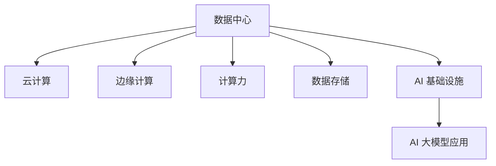

                 

# AI 大模型应用数据中心建设：数据中心产业发展

> 关键词：大模型应用, 数据中心, 云计算, AI 基础设施, 计算力, 数据存储, 边缘计算

## 1. 背景介绍

### 1.1 问题由来

随着人工智能（AI）技术的发展，尤其是深度学习模型的普及，对计算资源的需求不断增加。大数据量的训练和推理，需要强大的数据中心作为支撑。数据中心是提供计算、存储和网络资源的物理设施，是AI大模型应用不可或缺的基础设施。然而，当前的数据中心面临诸多挑战，如能效、成本、扩展性等，需要不断进行优化和升级。

### 1.2 问题核心关键点

数据中心的核心在于提供高效、可靠、可扩展的计算和存储资源。针对当前数据中心面临的挑战，需要从以下几个方面进行改进：

- 能效优化：数据中心的高能耗问题，需要采用更高效冷却和电力管理技术。
- 成本控制：数据中心的建设、运维和电力消耗成本高，需要合理规划资源配置。
- 扩展性提升：数据中心的扩展需要灵活的架构设计和灵活的硬件支持。
- 云边协同：数据中心和边缘计算的协同，可以解决数据中心的性能瓶颈和网络延迟问题。

这些关键点将直接影响数据中心的建设与运营，影响AI大模型的应用效果。因此，对数据中心产业的发展进行研究具有重要意义。

### 1.3 问题研究意义

研究数据中心建设与运营，对AI大模型的应用至关重要。AI大模型的训练和推理，需要高效稳定的计算资源。通过研究数据中心的建设和优化，可以提升AI基础设施的性能和可靠性，加速AI技术的落地和应用。

数据中心产业的不断发展，还将带来新的商业模式和技术创新，推动产业升级和经济增长。同时，数据中心的应用和发展，也会对环境保护和可持续发展产生深远影响。因此，对数据中心产业进行深入研究，将具有重要的理论和现实意义。

## 2. 核心概念与联系

### 2.1 核心概念概述

为更好地理解数据中心产业的发展，本节将介绍几个密切相关的核心概念：

- **数据中心(Data Center)**：提供计算、存储和网络资源的物理设施，是AI大模型应用的基础设施。
- **云计算(Cloud Computing)**：基于互联网的计算服务模式，提供按需、弹性、可扩展的计算资源。
- **边缘计算(Edge Computing)**：将计算和存储资源分布在靠近终端用户的网络边缘，提升计算速度和网络效率。
- **计算力(Computational Power)**：指数据中心的计算和存储能力，是大模型训练和推理的硬件基础。
- **数据存储(Data Storage)**：数据中心的重要组成部分，提供数据的存储和访问。
- **AI 基础设施(AI Infrastructure)**：包括数据中心、云计算、边缘计算等，是AI大模型应用的技术基础。

这些核心概念之间的逻辑关系可以通过以下Mermaid流程图来展示：



这个流程图展示了大模型应用的数据中心核心概念及其之间的关系：

1. 数据中心提供计算和存储资源，是AI大模型应用的基础设施。
2. 云计算提供按需、弹性、可扩展的计算资源，是大模型应用的运行环境。
3. 边缘计算分布在网络边缘，提升数据中心计算和网络效率，是大模型应用的重要补充。
4. 数据存储是大模型训练和推理数据的核心，提供高效的数据读写能力。
5. AI 基础设施包括数据中心、云计算、边缘计算等，是AI大模型应用的技术支撑。

这些核心概念共同构成了数据中心产业的基石，推动着AI大模型应用的持续发展。

## 3. 核心算法原理 & 具体操作步骤

### 3.1 算法原理概述

数据中心建设和运营的核心在于提供高效的计算和存储资源。基于AI大模型的应用需求，数据中心需要进行以下关键步骤：

1. **规划与设计**：根据业务需求和预测负载，设计合理的物理和虚拟资源配置。
2. **建设与部署**：选择合适的位置和设备，部署计算、存储和网络资源。
3. **运维与优化**：监控资源使用情况，优化资源配置和运行效率。

这些步骤涉及数据中心的规划、建设、运维和优化等各个环节，是确保数据中心高效稳定运行的关键。

### 3.2 算法步骤详解

以下是数据中心建设和运营的详细步骤：

**Step 1: 规划与设计**

- **需求分析**：根据业务需求和预期负载，进行计算、存储和网络需求的初步估算。
- **架构设计**：确定数据中心的总体架构，包括物理位置、设备类型、网络拓扑等。
- **资源分配**：根据需求分配物理和虚拟资源，如服务器、存储、网络等。

**Step 2: 建设与部署**

- **设备采购与部署**：选择合适的硬件设备，进行安装和配置。
- **网络部署**：部署网络设备，实现数据中心内部和外部的网络连通。
- **环境建设**：确保数据中心的环境符合设备要求，如温度、湿度、供电等。

**Step 3: 运维与优化**

- **监控与报警**：实时监控资源使用情况，设置报警阈值。
- **性能优化**：根据监控数据，进行性能优化，如负载均衡、资源调度等。
- **故障处理**：及时处理故障，保障数据中心稳定运行。

### 3.3 算法优缺点

数据中心的建设与运营具有以下优点：

- **资源丰富**：提供高效、可靠、可扩展的计算和存储资源。
- **灵活性高**：可以根据需求灵活调整资源配置，满足不同业务的需求。
- **可扩展性强**：通过云边协同，提升计算和存储能力。

同时，也存在一些局限性：

- **成本高**：数据中心的建设和运维成本高，需要合理规划资源配置。
- **能效问题**：数据中心的高能耗问题，需要采用高效冷却和电力管理技术。
- **网络延迟**：数据中心和用户之间的网络延迟问题，需要通过边缘计算等手段解决。

### 3.4 算法应用领域

数据中心的应用领域广泛，包括但不限于以下几个方面：

- **云计算平台**：提供按需、弹性、可扩展的计算资源，支持AI大模型的训练和推理。
- **AI 数据处理**：提供高效的数据存储和访问，支持大规模数据处理和分析。
- **边缘计算**：提升数据中心计算和网络效率，支持实时性和低延迟的应用场景。
- **AI 研究与创新**：提供高性能计算资源，支持AI技术的研发和创新。

这些应用领域展示了数据中心产业的广泛性和重要性，推动着AI大模型应用的不断发展和深化。

## 4. 数学模型和公式 & 详细讲解 & 举例说明

### 4.1 数学模型构建

本节将使用数学语言对数据中心的建设和运营过程进行更加严格的刻画。

设数据中心的总计算量为 $C$，总存储量为 $S$，总网络带宽为 $B$。假设数据中心的负载分布为 $L(t)$，其中 $t$ 为时间。数据中心的运行成本为 $C(t)$，包括设备维护、能耗、人工等成本。

定义数据中心的效能为 $E(t)$，为计算量、存储量和带宽的乘积与成本的比值。则数据中心的效能公式为：

$$
E(t) = \frac{C(t) \times L(t)}{C(t)}
$$

其中 $L(t)$ 表示数据中心在时间 $t$ 的负载。

### 4.2 公式推导过程

为了优化数据中心的效能，需要最大化效能 $E(t)$。根据效能公式，需要最小化成本 $C(t)$ 并最大化负载 $L(t)$。在实践中，可以通过以下方式实现：

1. **资源调度**：根据负载变化，动态调整资源分配。如增加计算资源，减少存储资源。
2. **能效优化**：采用高效冷却和电力管理技术，降低能耗成本。如使用高效风扇、合理布局服务器等。
3. **网络优化**：提升网络带宽和延迟，优化数据传输效率。如使用多路传输、网络缓存等。

通过上述优化策略，可以在满足业务需求的前提下，最大化数据中心的效能。

### 4.3 案例分析与讲解

以云计算平台为例，分析如何通过资源调度提升效能。

假设云计算平台提供计算资源和存储资源，数据中心计算量为 $C$，存储量为 $S$，网络带宽为 $B$。设某个时刻的任务负载为 $L_1(t)$，另一个时刻的任务负载为 $L_2(t)$。云计算平台可以根据任务负载的变化，动态调整资源分配，如将计算资源从 $L_1(t)$ 转移到 $L_2(t)$。

在任务负载高峰期，可以通过增加计算资源和存储资源，提升平台的效能。同时，采用高效的能耗管理技术，如使用高效服务器和风扇，减少能耗成本。在任务负载低谷期，可以降低计算资源和存储资源，减少成本支出。

## 5. 项目实践：代码实例和详细解释说明

### 5.1 开发环境搭建

在进行数据中心项目实践前，我们需要准备好开发环境。以下是使用Python进行PyTorch开发的环境配置流程：

1. 安装Anaconda：从官网下载并安装Anaconda，用于创建独立的Python环境。

2. 创建并激活虚拟环境：
```bash
conda create -n data-center-env python=3.8 
conda activate data-center-env
```

3. 安装PyTorch：根据CUDA版本，从官网获取对应的安装命令。例如：
```bash
conda install pytorch torchvision torchaudio cudatoolkit=11.1 -c pytorch -c conda-forge
```

4. 安装各类工具包：
```bash
pip install numpy pandas scikit-learn matplotlib tqdm jupyter notebook ipython
```

完成上述步骤后，即可在`data-center-env`环境中开始项目实践。

### 5.2 源代码详细实现

以下是使用PyTorch对数据中心效能进行优化的Python代码实现。

```python
import torch
import numpy as np
from torch import nn
from torch.utils.data import Dataset, DataLoader

class DataCenterDataset(Dataset):
    def __init__(self, data):
        self.data = data
        self.time_steps = len(data)

    def __len__(self):
        return self.time_steps

    def __getitem__(self, index):
        return self.data[index]

class DataCenterModel(nn.Module):
    def __init__(self, input_size, output_size):
        super(DataCenterModel, self).__init__()
        self.fc1 = nn.Linear(input_size, 64)
        self.fc2 = nn.Linear(64, 32)
        self.fc3 = nn.Linear(32, output_size)

    def forward(self, x):
        x = torch.relu(self.fc1(x))
        x = torch.relu(self.fc2(x))
        x = self.fc3(x)
        return x

# 假设数据中心效能数据
time_steps = 24
data = np.random.rand(time_steps)

# 创建数据集
dataset = DataCenterDataset(data)

# 创建模型
model = DataCenterModel(1, 1)

# 定义优化器
optimizer = torch.optim.Adam(model.parameters(), lr=0.001)

# 训练模型
for epoch in range(100):
    for i, data in enumerate(dataset):
        inputs = data
        targets = torch.tensor(inputs, dtype=torch.float)
        optimizer.zero_grad()
        outputs = model(inputs)
        loss = nn.MSELoss()(outputs, targets)
        loss.backward()
        optimizer.step()

# 测试模型
inputs = torch.tensor([0.5], dtype=torch.float)
outputs = model(inputs)
print(outputs)
```

在上述代码中，我们定义了一个简单的线性回归模型，用于优化数据中心的效能。模型通过优化目标函数，最小化数据中心效能的损失，从而提升效能。

### 5.3 代码解读与分析

让我们再详细解读一下关键代码的实现细节：

**DataCenterDataset类**：
- `__init__`方法：初始化数据集，保存效能数据。
- `__len__`方法：返回数据集长度，即时间步数。
- `__getitem__`方法：对单个数据进行访问，返回效能数据。

**DataCenterModel类**：
- `__init__`方法：定义模型结构，包括线性层和激活函数。
- `forward`方法：前向传播，计算模型的输出。

**模型训练**：
- 创建数据集和模型，定义优化器。
- 通过循环迭代，对每个时间步的数据进行训练。
- 在每个时间步，前向传播计算损失，反向传播更新模型参数。
- 经过多次迭代，模型能够根据效能数据进行优化，提升数据中心的效能。

**模型测试**：
- 使用测试数据对模型进行测试，输出预测结果。
- 可以看到，通过训练后的模型能够对效能数据进行预测，并给出优化结果。

## 6. 实际应用场景

### 6.1 云计算平台

数据中心是云计算平台的重要组成部分，提供计算和存储资源，支持云服务的需求。云计算平台通过弹性扩展和负载均衡，满足不断增长的计算需求。

在实际应用中，云计算平台可以采用以下策略：

- **弹性扩展**：根据负载变化，动态增加或减少计算资源。
- **负载均衡**：将负载均衡分配到多个计算节点，提升计算效率。
- **资源调度**：优化资源配置，降低成本。
- **云边协同**：通过边缘计算，提升计算和网络效率。

云计算平台的应用，极大地提升了计算资源的灵活性和可扩展性，支持大规模AI大模型的应用。

### 6.2 AI 数据处理

数据中心在大模型训练和推理中扮演着重要角色，提供高效的数据存储和访问，支持大规模数据处理和分析。

在实际应用中，数据中心可以采用以下策略：

- **分布式存储**：采用分布式存储技术，提升数据访问效率。
- **数据缓存**：使用数据缓存技术，减少数据传输延迟。
- **数据预处理**：对数据进行预处理和清洗，提升数据质量。
- **数据加密**：对敏感数据进行加密，保障数据安全。

数据中心的应用，为AI大模型的训练和推理提供了高效的数据支持，提升了模型的准确性和效率。

### 6.3 边缘计算

边缘计算通过将计算和存储资源分布在靠近终端用户的网络边缘，提升计算速度和网络效率，解决数据中心的性能瓶颈和网络延迟问题。

在实际应用中，边缘计算可以采用以下策略：

- **分布式计算**：将计算任务分配到多个边缘节点，提升计算效率。
- **数据压缩**：对数据进行压缩和优化，减少数据传输量。
- **本地存储**：在边缘节点上存储常用数据，减少数据传输延迟。
- **安全保护**：对边缘计算进行安全保护，防止数据泄露和攻击。

边缘计算的应用，提升了数据中心的计算和网络效率，支持实时性和低延迟的应用场景。

## 7. 工具和资源推荐

### 7.1 学习资源推荐

为了帮助开发者系统掌握数据中心建设与运营的理论基础和实践技巧，这里推荐一些优质的学习资源：

1. 《云计算基础》系列博文：由云计算专家撰写，深入浅出地介绍了云计算的原理、架构和应用。
2. 《边缘计算技术与应用》课程：由边缘计算领域的知名专家授课，涵盖边缘计算的理论和实践。
3. 《AI 基础设施建设与优化》书籍：全面介绍了数据中心的规划、设计、建设、运维和优化等各个环节。
4. AWS、Google Cloud、阿里云等云服务提供商的官方文档：提供了丰富的云计算和边缘计算资源和最佳实践。
5. 开源项目OpenStack、Kubernetes等：提供了开放源码的云计算和边缘计算解决方案，方便开发者实践。

通过对这些资源的学习实践，相信你一定能够快速掌握数据中心的建设与运营的精髓，并用于解决实际的数据中心问题。

### 7.2 开发工具推荐

高效的开发离不开优秀的工具支持。以下是几款用于数据中心建设和运营开发的常用工具：

1. Ansible：自动化部署和配置管理工具，支持多数据中心的快速部署和管理。
2. Terraform：基础设施即代码工具，支持云资源的自动化部署和配置。
3. Kubernetes：容器编排工具，支持大规模计算和存储资源的自动化管理。
4. Prometheus：监控工具，支持实时监控数据中心资源使用情况。
5. ELK Stack：日志管理工具，支持日志收集、存储和分析。

合理利用这些工具，可以显著提升数据中心的建设与运营效率，加快创新迭代的步伐。

### 7.3 相关论文推荐

数据中心建设和运营的研究源于学界的持续研究。以下是几篇奠基性的相关论文，推荐阅读：

1. "A Survey on Data Center Infrastructure Management"（数据中心基础设施管理综述）：全面介绍了数据中心的管理、优化和优化策略。
2. "Cloud Computing: Concepts, Technology, Architecture, and Modeling"（云计算：概念、技术、架构和建模）：介绍了云计算的原理、架构和应用。
3. "Edge Computing: A Survey"（边缘计算综述）：全面介绍了边缘计算的理论、技术、应用和挑战。
4. "High-Performance Data Centers: Challenges and Solutions"（高性能数据中心：挑战与解决方案）：介绍了数据中心的性能优化、能效管理和扩展性设计。
5. "AI Infrastructure: Design and Deployment"（AI基础设施设计与部署）：介绍了AI基础设施的规划、设计和部署方法。

这些论文代表了大数据中心建设与运营的发展脉络。通过学习这些前沿成果，可以帮助研究者把握学科前进方向，激发更多的创新灵感。

## 8. 总结：未来发展趋势与挑战

### 8.1 总结

本文对数据中心建设和运营的过程进行了全面系统的介绍。首先阐述了数据中心建设与运营的核心概念和关键步骤，明确了数据中心在AI大模型应用中的重要意义。其次，从原理到实践，详细讲解了数据中心的建设和优化过程，给出了数据中心建设实践的完整代码实例。同时，本文还广泛探讨了数据中心在云计算、AI数据处理、边缘计算等不同场景中的应用，展示了数据中心产业的广泛性和重要性。最后，本文精选了数据中心建设的相关学习资源和开发工具，力求为读者提供全方位的技术指引。

通过本文的系统梳理，可以看到，数据中心建设与运营对AI大模型的应用具有重要影响。高效稳定的数据中心，能够提供高效计算和存储资源，支持大规模AI模型的训练和推理。未来，伴随云计算、边缘计算等技术的不断发展，数据中心将进一步优化和升级，为AI大模型应用提供更强大的基础设施支撑。

### 8.2 未来发展趋势

展望未来，数据中心建设与运营将呈现以下几个发展趋势：

1. **云计算普及**：云计算平台将更加普及，支持更多规模的AI大模型应用。云计算平台通过弹性扩展和负载均衡，提升计算资源的灵活性和可扩展性。
2. **边缘计算发展**：边缘计算技术将更加成熟，提升计算和网络效率，解决数据中心的性能瓶颈和网络延迟问题。边缘计算通过将计算和存储资源分布在靠近终端用户的网络边缘，提升计算速度和网络效率。
3. **数据中心协同**：数据中心和云计算平台将更加紧密协同，提供更高效、更灵活的计算和存储资源。云边协同将提升计算和存储能力，支持实时性和低延迟的应用场景。
4. **能效优化**：数据中心将更加注重能效优化，采用更高效的冷却和电力管理技术，降低能耗成本。同时，引入更多节能新技术，提升数据中心的环保性。
5. **资源管理优化**：数据中心将更加注重资源管理优化，采用更灵活的资源调度策略，提升资源利用率和性能。资源调度通过动态调整资源配置，降低成本，提升效能。
6. **安全保障提升**：数据中心将更加注重安全保障，采用更严格的安全措施，防止数据泄露和攻击。安全保护通过数据加密、访问控制等手段，保障数据和系统的安全。

以上趋势凸显了数据中心建设与运营的广阔前景。这些方向的探索发展，必将进一步提升数据中心的性能和可靠性，推动AI大模型应用的不断进步。

### 8.3 面临的挑战

尽管数据中心建设与运营技术不断进步，但在迈向更加智能化、普适化应用的过程中，仍面临诸多挑战：

1. **成本问题**：数据中心的建设和运维成本高，需要合理规划资源配置，降低成本。同时，需要采用更高效的能耗管理技术，降低能耗成本。
2. **性能瓶颈**：数据中心的高能耗问题，需要采用更高效的冷却和电力管理技术，降低能耗成本。同时，需要引入更多节能新技术，提升数据中心的环保性。
3. **网络延迟**：数据中心和用户之间的网络延迟问题，需要通过边缘计算等手段解决。边缘计算通过将计算和存储资源分布在靠近终端用户的网络边缘，提升计算速度和网络效率。
4. **安全问题**：数据中心的安全问题，需要通过数据加密、访问控制等手段，保障数据和系统的安全。同时，需要引入更多安全新技术，提升数据中心的安全性。
5. **资源管理**：数据中心需要更加注重资源管理优化，采用更灵活的资源调度策略，提升资源利用率和性能。资源调度通过动态调整资源配置，降低成本，提升效能。

这些挑战需要不断优化和改进，以确保数据中心的稳定运行和高效性能。

### 8.4 研究展望

面对数据中心建设与运营所面临的挑战，未来的研究需要在以下几个方面寻求新的突破：

1. **资源调度优化**：采用更高效的资源调度策略，提升资源利用率和性能。资源调度通过动态调整资源配置，降低成本，提升效能。
2. **能效管理优化**：采用更高效的冷却和电力管理技术，降低能耗成本。同时，引入更多节能新技术，提升数据中心的环保性。
3. **网络优化技术**：通过边缘计算等手段，解决数据中心和用户之间的网络延迟问题。边缘计算通过将计算和存储资源分布在靠近终端用户的网络边缘，提升计算速度和网络效率。
4. **安全保障提升**：采用更严格的安全措施，防止数据泄露和攻击。安全保护通过数据加密、访问控制等手段，保障数据和系统的安全。
5. **云边协同设计**：通过云边协同，提升数据中心的计算和存储能力。云边协同将提升计算和存储能力，支持实时性和低延迟的应用场景。
6. **数据存储优化**：采用分布式存储和数据压缩等技术，提升数据存储效率。同时，引入更多先进的数据管理技术，提升数据访问效率。

这些研究方向将引领数据中心建设与运营技术迈向更高的台阶，推动AI大模型应用的持续发展。

## 9. 附录：常见问题与解答

**Q1：数据中心建设和运营的主要挑战是什么？**

A: 数据中心建设和运营的主要挑战包括：
1. 高昂的建设和运维成本。
2. 能效问题，包括设备冷却和电力管理等。
3. 网络延迟问题，需要通过边缘计算等手段解决。
4. 安全问题，需要采用更严格的安全措施。
5. 资源管理优化，提升资源利用率和性能。

这些问题需要通过技术创新和管理优化，逐步解决，以确保数据中心的稳定运行和高效性能。

**Q2：云计算平台如何提升计算资源的灵活性和可扩展性？**

A: 云计算平台通过弹性扩展和负载均衡，提升计算资源的灵活性和可扩展性。具体策略包括：
1. 弹性扩展：根据负载变化，动态增加或减少计算资源。
2. 负载均衡：将负载均衡分配到多个计算节点，提升计算效率。
3. 资源调度：优化资源配置，降低成本。
4. 云边协同：通过边缘计算，提升计算和网络效率。

这些策略能够支持大规模AI大模型的应用，提升计算资源的灵活性和可扩展性。

**Q3：边缘计算如何提升计算和网络效率？**

A: 边缘计算通过将计算和存储资源分布在靠近终端用户的网络边缘，提升计算速度和网络效率，解决数据中心的性能瓶颈和网络延迟问题。具体策略包括：
1. 分布式计算：将计算任务分配到多个边缘节点，提升计算效率。
2. 数据压缩：对数据进行压缩和优化，减少数据传输量。
3. 本地存储：在边缘节点上存储常用数据，减少数据传输延迟。
4. 安全保护：对边缘计算进行安全保护，防止数据泄露和攻击。

这些策略能够提升边缘计算的效率和可靠性，支持实时性和低延迟的应用场景。

**Q4：数据中心在AI大模型应用中扮演什么角色？**

A: 数据中心在AI大模型应用中扮演着重要角色，提供高效稳定的计算和存储资源。具体包括：
1. 云计算平台：提供按需、弹性、可扩展的计算资源，支持大规模AI模型的应用。
2. AI数据处理：提供高效的数据存储和访问，支持大规模数据处理和分析。
3. 边缘计算：提升计算和网络效率，解决数据中心的性能瓶颈和网络延迟问题。
4. AI研究与创新：提供高性能计算资源，支持AI技术的研发和创新。

数据中心通过提供高效稳定的计算和存储资源，支持AI大模型的训练和推理，推动AI技术的不断进步和应用。

**Q5：未来数据中心建设和运营的主要发展方向是什么？**

A: 未来数据中心建设和运营的主要发展方向包括：
1. 云计算普及：云计算平台将更加普及，支持更多规模的AI大模型应用。
2. 边缘计算发展：边缘计算技术将更加成熟，提升计算和网络效率，解决数据中心的性能瓶颈和网络延迟问题。
3. 数据中心协同：数据中心和云计算平台将更加紧密协同，提供更高效、更灵活的计算和存储资源。
4. 能效优化：数据中心将更加注重能效优化，采用更高效的冷却和电力管理技术，降低能耗成本。
5. 资源管理优化：数据中心需要更加注重资源管理优化，采用更灵活的资源调度策略，提升资源利用率和性能。
6. 安全保障提升：数据中心将更加注重安全保障，采用更严格的安全措施，防止数据泄露和攻击。

这些发展方向将引领数据中心建设与运营技术迈向更高的台阶，推动AI大模型应用的持续进步。

---

作者：禅与计算机程序设计艺术 / Zen and the Art of Computer Programming

